# AI Model Integration

<cite>
**Referenced Files in This Document**
- [multi_model_moderation.py](file://backend/app/services/multi_model_moderation.py)
- [ai_moderation.py](file://backend/app/services/ai_moderation.py)
- [hash_cache.py](file://backend/app/services/hash_cache.py)
- [moderate.py](file://backend/app/api/moderate.py)
- [config.py](file://backend/app/core/config.py)
- [redis.py](file://backend/app/core/redis.py)
- [test_multi_model.py](file://backend/test_multi_model.py)
- [README.md](file://README.md)
</cite>

## Table of Contents
1. [Introduction](#introduction)
2. [Project Structure](#project-structure)
3. [Core Components](#core-components)
4. [Architecture Overview](#architecture-overview)
5. [Detailed Component Analysis](#detailed-component-analysis)
6. [Dependency Analysis](#dependency-analysis)
7. [Performance Considerations](#performance-considerations)
8. [Troubleshooting Guide](#troubleshooting-guide)
9. [Conclusion](#conclusion)

## Introduction
This document explains the OmniShield multi-model ensemble architecture that coordinates six specialized AI models for comprehensive content moderation:
- NSFW detection via NudeNet v3.4.2
- Violence/gore detection via CLIP zero-shot classification
- Weapon detection via YOLOv8n
- Face detection via MTCNN
- Text moderation via PaddleOCR with profanity filtering
- Additional context from NudeNet fallback heuristics and professional portrait override logic

The system uses lazy loading to minimize startup memory, parallel orchestration via asyncio and ThreadPoolExecutor, SHA256-based image deduplication caching with Redis, and an ensemble aggregation strategy that combines per-model outputs into a final risk assessment with confidence calibration. It also includes GPU auto-detection with CPU fallback and model version tracking.

## Project Structure
The relevant backend components are organized under app/services and app/api:
- Services:
  - multi_model_moderation.py: orchestrates all detectors, implements async parallel execution, ensemble voting, and professional portrait override
  - ai_moderation.py: NudeNet pipeline integration (used by the NSFW detector)
  - hash_cache.py: SHA256 hashing and Redis-backed caching
- API:
  - moderate.py: FastAPI endpoints for single and comprehensive moderation, cache checks, logging, and response formatting
- Core:
  - config.py: application settings including feature toggles and thresholds
  - redis.py: shared Redis client initialization with graceful degradation

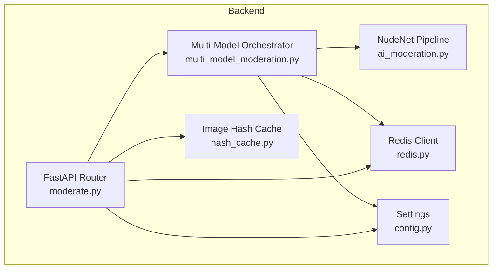

**Diagram sources**
- [moderate.py:446-597](file://backend/app/api/moderate.py#L446-L597)
- [multi_model_moderation.py:532-732](file://backend/app/services/multi_model_moderation.py#L532-L732)
- [ai_moderation.py:148-275](file://backend/app/services/ai_moderation.py#L148-L275)
- [hash_cache.py:8-59](file://backend/app/services/hash_cache.py#L8-L59)
- [redis.py:1-21](file://backend/app/core/redis.py#L1-L21)
- [config.py:70-83](file://backend/app/core/config.py#L70-L83)

**Section sources**
- [moderate.py:446-597](file://backend/app/api/moderate.py#L446-L597)
- [multi_model_moderation.py:1-147](file://backend/app/services/multi_model_moderation.py#L1-L147)
- [ai_moderation.py:1-147](file://backend/app/services/ai_moderation.py#L1-L147)
- [hash_cache.py:1-59](file://backend/app/services/hash_cache.py#L1-L59)
- [redis.py:1-21](file://backend/app/core/redis.py#L1-L21)
- [config.py:1-148](file://backend/app/core/config.py#L1-L148)

## Core Components
- Multi-Model Orchestrator:
  - Lazy loaders for each model with singleton pattern
  - Async parallel execution using asyncio.gather and ThreadPoolExecutor
  - Ensemble aggregation with risk scoring and recommended actions
  - Professional portrait override mechanism
  - Model version tracking in results
- NudeNet Integration:
  - Dedicated module for NSFW detection with close-up padding and heuristic fallbacks
- Image Deduplication Cache:
  - SHA256 file hashing
  - Redis-backed storage with TTL
  - Graceful degradation when Redis is unavailable
- API Layer:
  - Endpoints for single and comprehensive moderation
  - Validation, size limits, magic byte checks
  - Logging and result serialization

**Section sources**
- [multi_model_moderation.py:43-147](file://backend/app/services/multi_model_moderation.py#L43-L147)
- [multi_model_moderation.py:532-732](file://backend/app/services/multi_model_moderation.py#L532-L732)
- [ai_moderation.py:148-275](file://backend/app/services/ai_moderation.py#L148-L275)
- [hash_cache.py:8-59](file://backend/app/services/hash_cache.py#L8-L59)
- [moderate.py:223-378](file://backend/app/api/moderate.py#L223-L378)
- [moderate.py:446-597](file://backend/app/api/moderate.py#L446-L597)

## Architecture Overview
The comprehensive moderation flow:
- Client uploads an image to the comprehensive endpoint
- API validates input, computes SHA256, checks cache
- On cache miss, orchestrator launches all enabled detectors concurrently
- Each detector runs in its own thread; results are aggregated
- Ensemble logic applies professional portrait override and calculates aggregate risk
- Final decision is returned with categories, model versions, and metadata

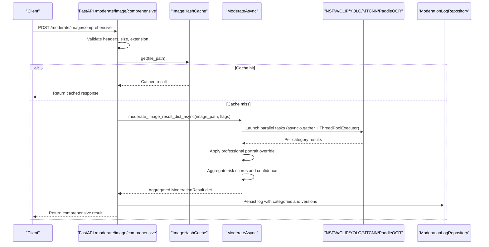

**Diagram sources**
- [moderate.py:446-597](file://backend/app/api/moderate.py#L446-L597)
- [multi_model_moderation.py:532-732](file://backend/app/services/multi_model_moderation.py#L532-L732)
- [hash_cache.py:21-59](file://backend/app/services/hash_cache.py#L21-L59)

## Detailed Component Analysis

### Multi-Model Orchestrator
Responsibilities:
- Lazy-load models on first use
- Run detectors concurrently
- Aggregate results and compute overall status, risk level, confidence, and recommended action
- Track model versions
- Apply professional portrait override

Key implementation details:
- Lazy loaders:
  - NudeNet detector via ai_moderation integration
  - CLIP model and processor for violence detection
  - YOLOv8n object detector
  - MTCNN face detector with device selection
  - PaddleOCR text reader
  - Profanity filter loader
- Parallel execution:
  - _run_detector_async wraps sync detectors in ThreadPoolExecutor
  - asyncio.gather collects results across all enabled detectors
- Ensemble aggregation:
  - Collects labels, bounding boxes, and model versions
  - Maps per-model risk levels to numeric scores
  - Computes aggregate confidence and risk score
  - Determines recommended action based on thresholds
- Professional portrait override:
  - If exactly one face detected, no weapons, and violence probability below threshold, override low-confidence violence to safe

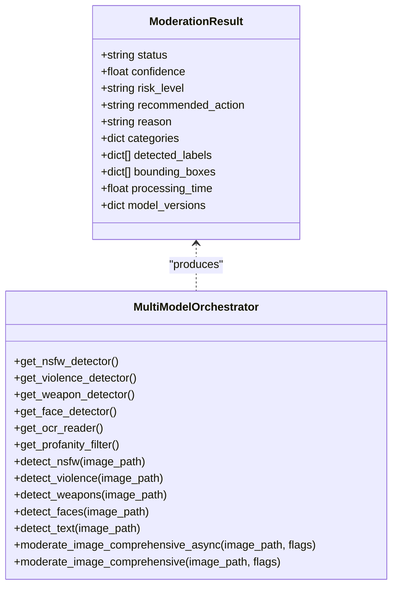

**Diagram sources**
- [multi_model_moderation.py:28-41](file://backend/app/services/multi_model_moderation.py#L28-L41)
- [multi_model_moderation.py:43-147](file://backend/app/services/multi_model_moderation.py#L43-L147)
- [multi_model_moderation.py:532-732](file://backend/app/services/multi_model_moderation.py#L532-L732)

**Section sources**
- [multi_model_moderation.py:43-147](file://backend/app/services/multi_model_moderation.py#L43-L147)
- [multi_model_moderation.py:532-732](file://backend/app/services/multi_model_moderation.py#L532-L732)

### NudeNet NSFW Detection
Responsibilities:
- Detect explicit content using NudeNet
- Handle close-up images by running padded detection
- Apply heuristic fallback rules
- Map detections to enterprise risk levels and recommended actions

Key behaviors:
- Lazy NudeDetector initialization
- Close-up detection via aspect ratio and size heuristics
- Padding strategy to improve contextual detection
- Fallback rules for inferred nudity scenarios
- Risk mapping based on label severity and confidence thresholds

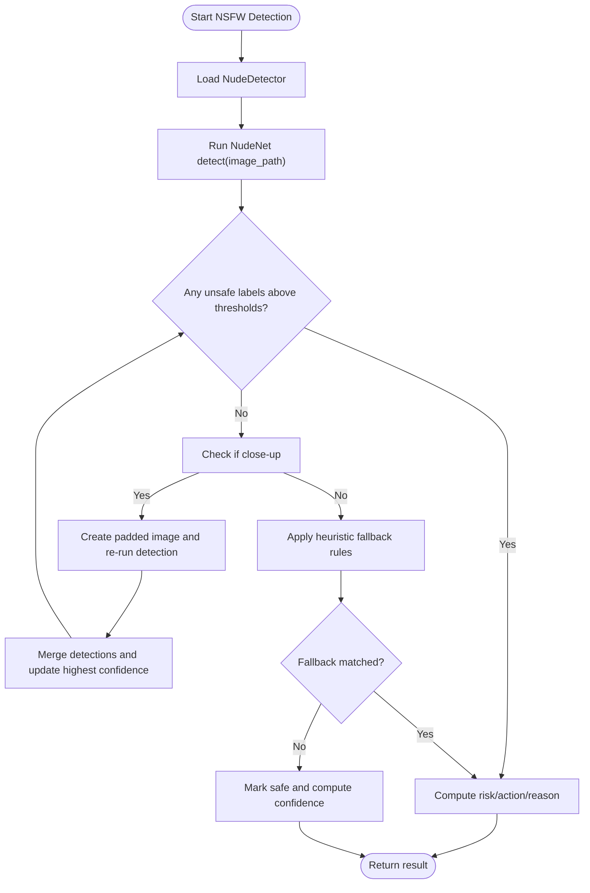

**Diagram sources**
- [ai_moderation.py:148-275](file://backend/app/services/ai_moderation.py#L148-L275)

**Section sources**
- [ai_moderation.py:148-275](file://backend/app/services/ai_moderation.py#L148-L275)

### CLIP Violence/Gore Detection
Responsibilities:
- Zero-shot classification using CLIP with safety vs violence categories
- Strict thresholds to reduce false positives
- Confidence calibration and debug metrics included

Key behaviors:
- Loads CLIP model and processor lazily
- Moves model to GPU if available
- Classifies image against categories including safe and violence-related prompts
- Applies strict criteria: high violence probability and margin over safe probability
- Returns risk level based on violence probability thresholds

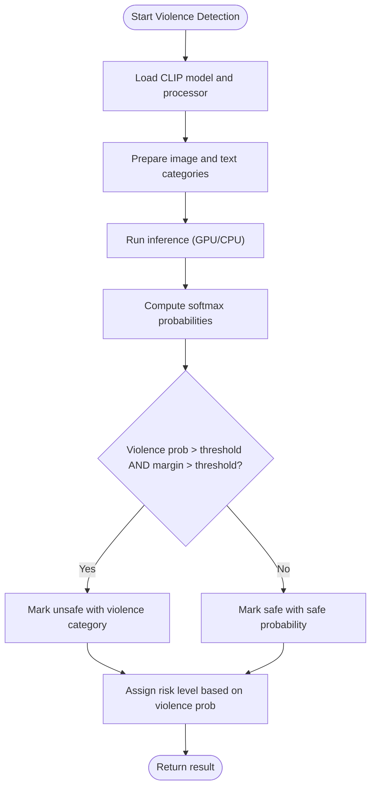

**Diagram sources**
- [multi_model_moderation.py:218-301](file://backend/app/services/multi_model_moderation.py#L218-L301)

**Section sources**
- [multi_model_moderation.py:218-301](file://backend/app/services/multi_model_moderation.py#L218-L301)

### YOLOv8 Weapon Detection
Responsibilities:
- Object detection using YOLOv8n
- Identify potential weapon-like objects
- Provide bounding boxes and confidence scores

Key behaviors:
- Lazy load YOLOv8n model
- Filter detections by predefined classes and confidence threshold
- Convert bounding box coordinates to integers
- Assign risk level based on max confidence

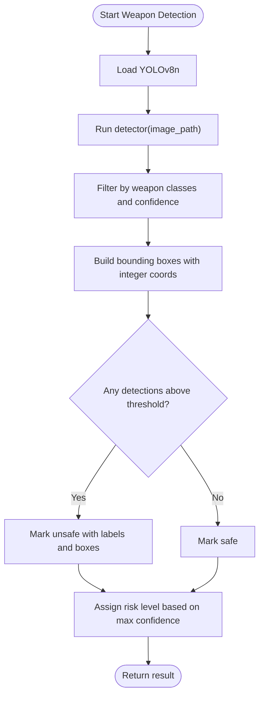

**Diagram sources**
- [multi_model_moderation.py:304-377](file://backend/app/services/multi_model_moderation.py#L304-L377)

**Section sources**
- [multi_model_moderation.py:304-377](file://backend/app/services/multi_model_moderation.py#L304-L377)

### MTCNN Face Detection
Responsibilities:
- Detect faces and return counts and bounding boxes
- Provide context for professional portrait override

Key behaviors:
- Lazy load MTCNN with device selection
- Detect faces and convert bounding boxes to integers
- Include face_count and boxes in result

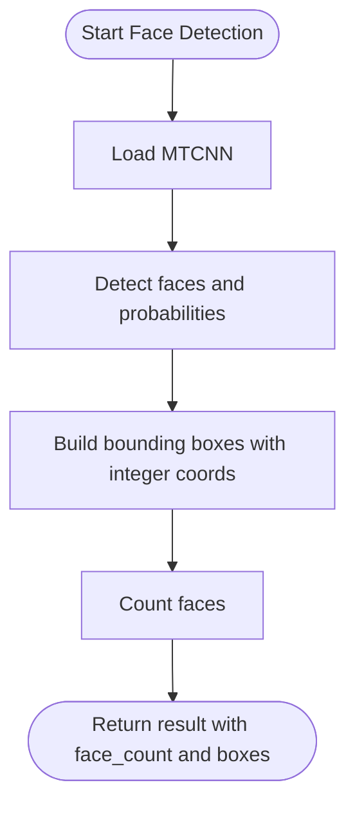

**Diagram sources**
- [multi_model_moderation.py:380-431](file://backend/app/services/multi_model_moderation.py#L380-L431)

**Section sources**
- [multi_model_moderation.py:380-431](file://backend/app/services/multi_model_moderation.py#L380-L431)

### PaddleOCR + Profanity Filtering
Responsibilities:
- Extract text from images
- Detect profanity and censor text
- Provide text moderation result

Key behaviors:
- Lazy load PaddleOCR and profanity filter
- OCR with angle classification and English language
- Join extracted texts and check for profanity
- Return censored text and contains_profanity flag

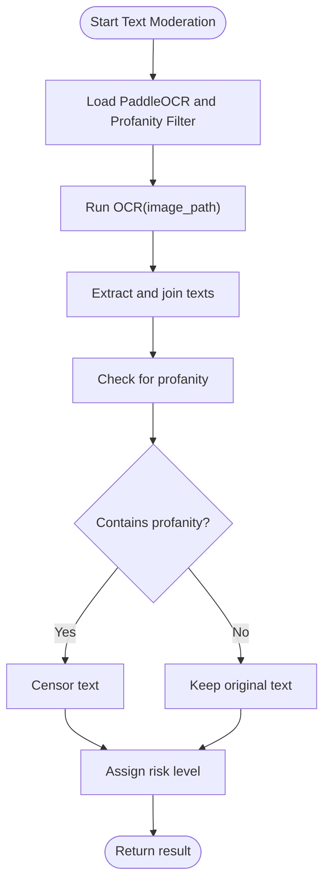

**Diagram sources**
- [multi_model_moderation.py:434-486](file://backend/app/services/multi_model_moderation.py#L434-L486)

**Section sources**
- [multi_model_moderation.py:434-486](file://backend/app/services/multi_model_moderation.py#L434-L486)

### Ensemble Aggregation and Professional Portrait Override
Responsibilities:
- Combine per-model results into a unified decision
- Apply professional portrait override to reduce false positives
- Calculate aggregate confidence and risk level
- Track model versions

Key behaviors:
- Collect labels, boxes, and model versions from non-error/skipped results
- Map risk levels to numeric scores and compute aggregate risk
- Use highest confidence among unsafe categories or average confidence for safe verdicts
- Professional portrait override: if one face, no weapons, and violence probability below threshold, mark violence as safe
- Determine recommended action based on aggregate risk thresholds

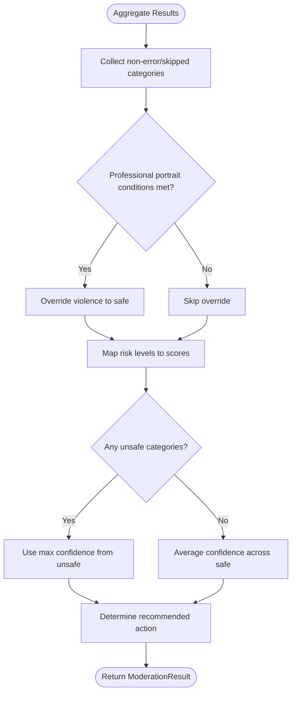

**Diagram sources**
- [multi_model_moderation.py:621-732](file://backend/app/services/multi_model_moderation.py#L621-L732)

**Section sources**
- [multi_model_moderation.py:621-732](file://backend/app/services/multi_model_moderation.py#L621-L732)

### SHA256-Based Image Deduplication Caching
Responsibilities:
- Compute SHA256 checksums for uploaded files
- Store and retrieve moderation results in Redis
- Gracefully degrade when Redis is unavailable

Key behaviors:
- calculate_sha256 reads file in chunks
- get/set methods use Redis keys prefixed with image_cache:
- TTL defaults to 7 days
- Error responses are not cached

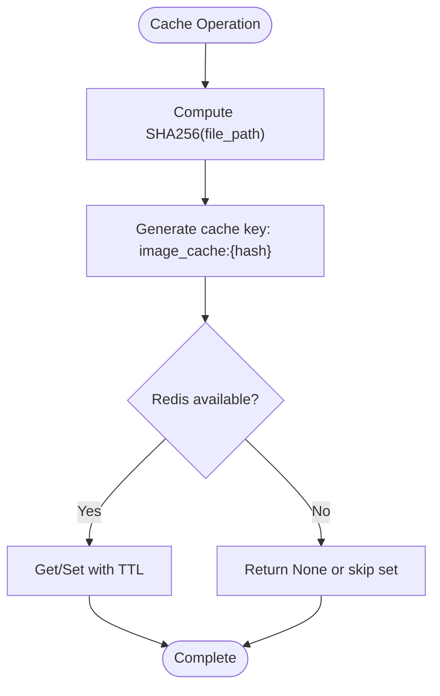

**Diagram sources**
- [hash_cache.py:13-59](file://backend/app/services/hash_cache.py#L13-L59)
- [redis.py:1-21](file://backend/app/core/redis.py#L1-L21)

**Section sources**
- [hash_cache.py:1-59](file://backend/app/services/hash_cache.py#L1-L59)
- [redis.py:1-21](file://backend/app/core/redis.py#L1-L21)

### API Endpoints and Orchestration
Responsibilities:
- Accept image uploads and route to appropriate moderation service
- Validate file types and sizes
- Check cache before running inference
- Persist logs and return structured responses

Key behaviors:
- Single image endpoint uses NudeNet only
- Comprehensive endpoint enables multiple detectors via query flags
- Background tasks support batch processing
- Response includes categories, model versions, and additional metadata

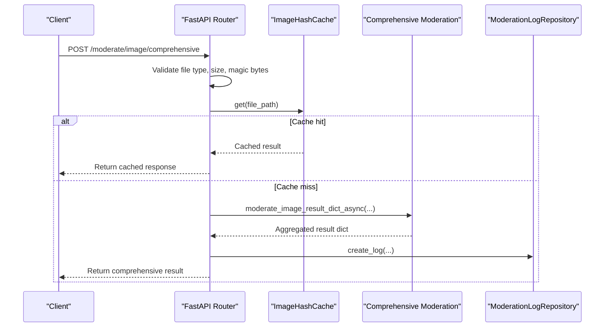

**Diagram sources**
- [moderate.py:446-597](file://backend/app/api/moderate.py#L446-L597)
- [hash_cache.py:21-59](file://backend/app/services/hash_cache.py#L21-L59)

**Section sources**
- [moderate.py:446-597](file://backend/app/api/moderate.py#L446-L597)

## Dependency Analysis
Component relationships:
- API depends on services for moderation and caching
- Multi-model orchestrator depends on individual detectors and configuration
- NudeNet integration is used by the NSFW detector within the orchestrator
- Redis client provides caching infrastructure with graceful degradation

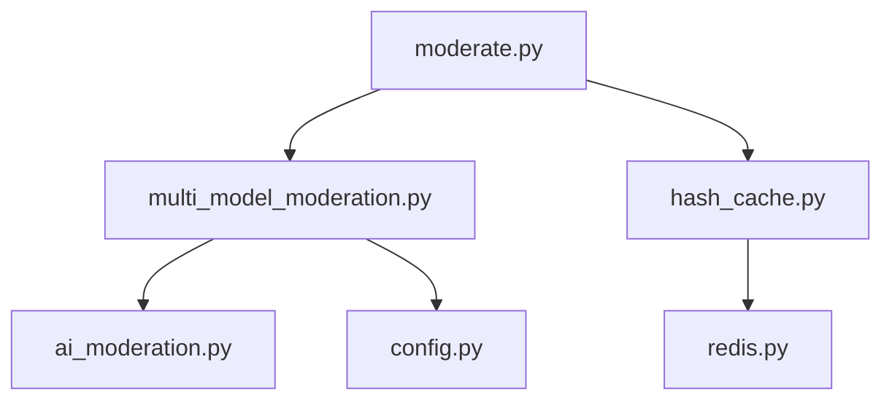

**Diagram sources**
- [moderate.py:446-597](file://backend/app/api/moderate.py#L446-L597)
- [multi_model_moderation.py:532-732](file://backend/app/services/multi_model_moderation.py#L532-L732)
- [ai_moderation.py:148-275](file://backend/app/services/ai_moderation.py#L148-L275)
- [hash_cache.py:8-59](file://backend/app/services/hash_cache.py#L8-L59)
- [redis.py:1-21](file://backend/app/core/redis.py#L1-L21)
- [config.py:70-83](file://backend/app/core/config.py#L70-L83)

**Section sources**
- [moderate.py:446-597](file://backend/app/api/moderate.py#L446-L597)
- [multi_model_moderation.py:532-732](file://backend/app/services/multi_model_moderation.py#L532-L732)
- [ai_moderation.py:148-275](file://backend/app/services/ai_moderation.py#L148-L275)
- [hash_cache.py:8-59](file://backend/app/services/hash_cache.py#L8-L59)
- [redis.py:1-21](file://backend/app/core/redis.py#L1-L21)
- [config.py:70-83](file://backend/app/core/config.py#L70-L83)

## Performance Considerations
- Lazy loading reduces initial memory footprint and startup time
- Parallel execution via asyncio.gather and ThreadPoolExecutor maximizes throughput
- GPU auto-detection accelerates CLIP and MTCNN inference where available
- SHA256 caching eliminates redundant processing for identical images
- Risk thresholds and professional portrait override reduce false positives and unnecessary reprocessing

[No sources needed since this section provides general guidance]

## Troubleshooting Guide
Common issues and resolutions:
- Model loading failures:
  - Ensure required dependencies are installed
  - Verify GPU availability and CUDA setup for PyTorch-based models
  - Check network access for downloading pretrained models
- Redis connectivity:
  - Confirm Redis URL and port are correct
  - System gracefully degrades without Redis but caching will be disabled
- File validation errors:
  - Ensure uploaded files match allowed extensions and pass magic byte checks
  - Verify file size does not exceed configured limits
- Test suite:
  - Use test_multi_model.py to verify model loading and basic functionality

**Section sources**
- [test_multi_model.py:25-117](file://backend/test_multi_model.py#L25-L117)
- [redis.py:8-21](file://backend/app/core/redis.py#L8-L21)
- [moderate.py:32-60](file://backend/app/api/moderate.py#L32-L60)

## Conclusion
The OmniShield multi-model ensemble integrates six specialized AI models with robust orchestration, lazy loading, parallel execution, and intelligent aggregation. The system balances accuracy and performance through SHA256 caching, GPU acceleration, and professional portrait override logic. Model version tracking and detailed per-category results provide transparency and auditability for production deployments.

[No sources needed since this section summarizes without analyzing specific files]