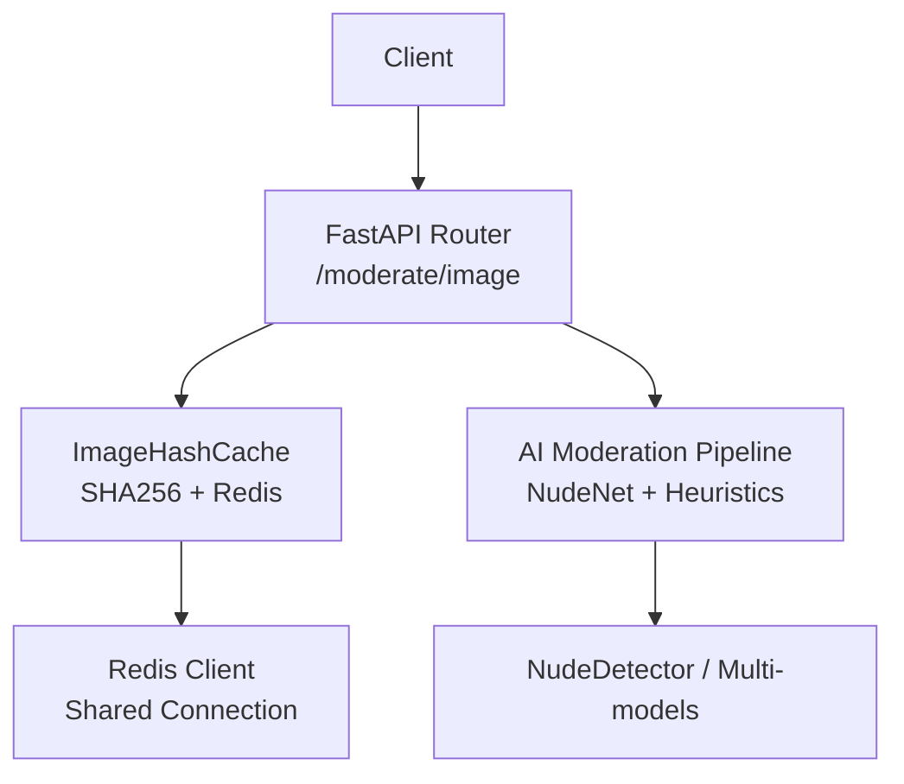
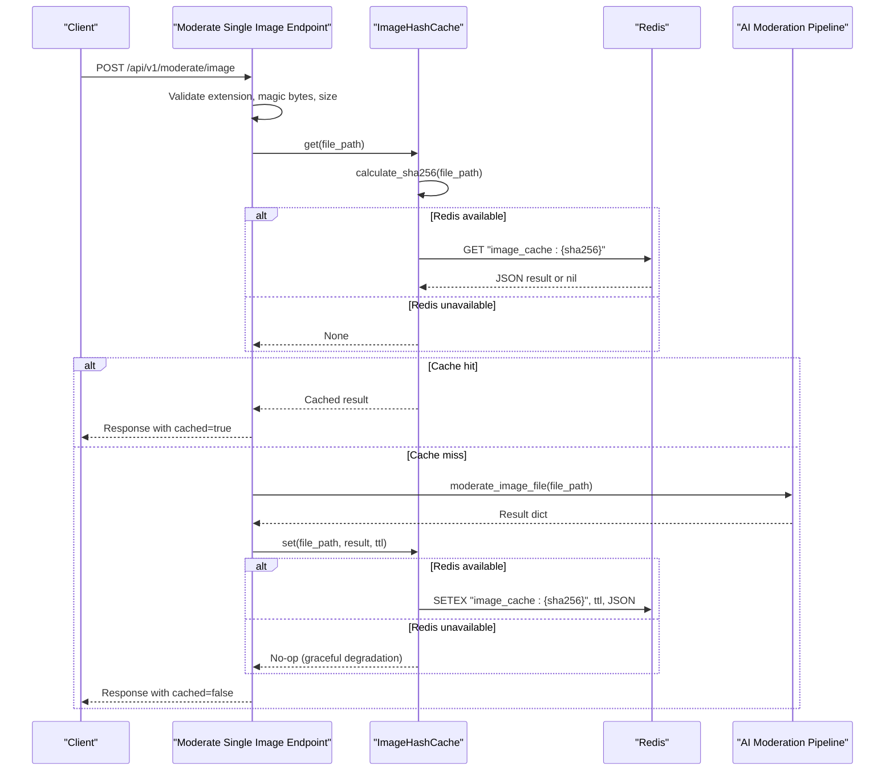
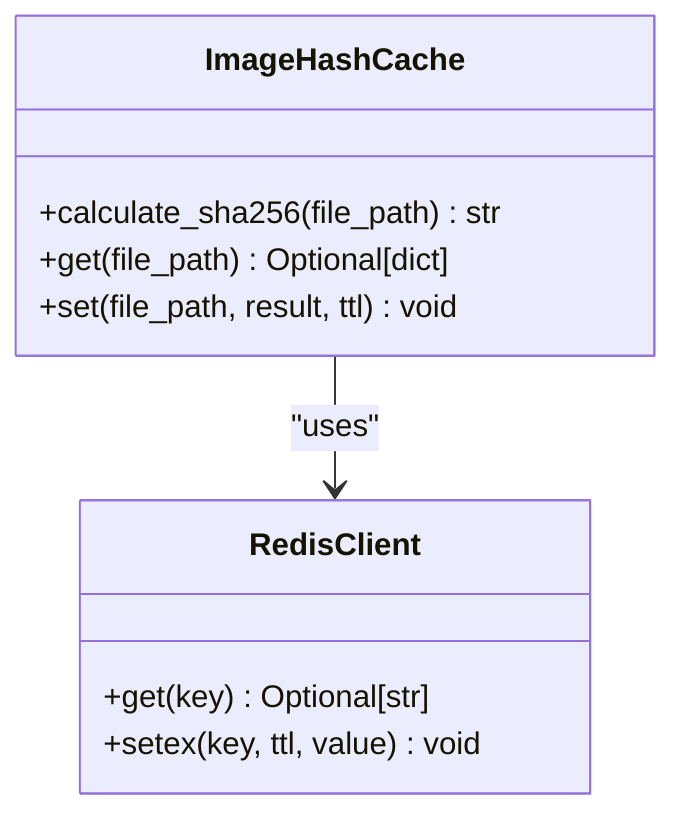
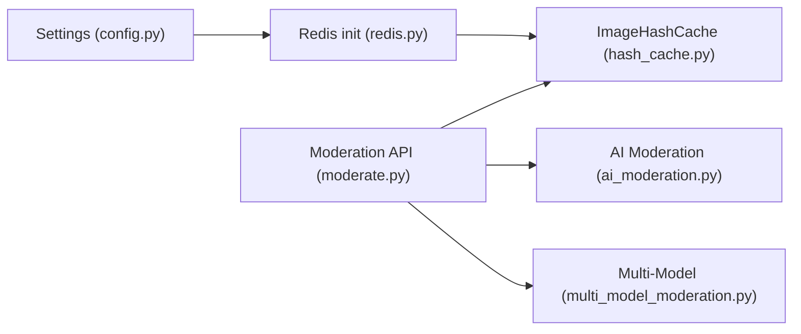

# Caching & Deduplication System

<cite>
**Referenced Files in This Document**
- [hash_cache.py](file://backend/app/services/hash_cache.py)
- [redis.py](file://backend/app/core/redis.py)
- [config.py](file://backend/app/core/config.py)
- [moderate.py](file://backend/app/api/moderate.py)
- [ai_moderation.py](file://backend/app/services/ai_moderation.py)
- [multi_model_moderation.py](file://backend/app/services/multi_model_moderation.py)
- [test_moderation_engine.py](file://backend/tests/test_moderation_engine.py)
</cite>

## Table of Contents
1. [Introduction](#introduction)
2. [Project Structure](#project-structure)
3. [Core Components](#core-components)
4. [Architecture Overview](#architecture-overview)
5. [Detailed Component Analysis](#detailed-component-analysis)
6. [Dependency Analysis](#dependency-analysis)
7. [Performance Considerations](#performance-considerations)
8. [Troubleshooting Guide](#troubleshooting-guide)
9. [Conclusion](#conclusion)

## Introduction
This document explains the SHA256-based image deduplication and caching system that reduces redundant AI model computations by reusing previous moderation results for identical images. It covers:
- How image hashing identifies duplicates before processing
- Redis integration for distributed caching, including key generation, TTL policies, and fallback behavior when Redis is unavailable
- Hash computation using file-level SHA256 (streaming reads) and how it integrates with the AI pipeline
- Cache hit/miss patterns, memory management considerations, and performance impact
- Configuration options for cache TTL and environment settings
- Interaction between the caching layer and the AI model pipeline, including consistency guarantees

## Project Structure
The caching and deduplication logic spans a small set of focused modules:
- API endpoints orchestrate upload handling, cache checks, and model inference
- A dedicated hash cache service computes SHA256 checksums and interacts with Redis
- A shared Redis client module initializes connection and availability flags
- Configuration centralizes Redis URL and TTL values
- AI moderation services implement the actual detection pipelines

**Diagram sources**
- [moderate.py:223-370](file://backend/app/api/moderate.py#L223-L370)
- [hash_cache.py:8-58](file://backend/app/services/hash_cache.py#L8-L58)
- [redis.py:1-21](file://backend/app/core/redis.py#L1-L21)
- [ai_moderation.py:148-275](file://backend/app/services/ai_moderation.py#L148-L275)

**Section sources**
- [moderate.py:223-370](file://backend/app/api/moderate.py#L223-L370)
- [hash_cache.py:8-58](file://backend/app/services/hash_cache.py#L8-L58)
- [redis.py:1-21](file://backend/app/core/redis.py#L1-L21)
- [ai_moderation.py:148-275](file://backend/app/services/ai_moderation.py#L148-L275)

## Core Components
- ImageHashCache: Computes SHA256 checksums per uploaded file path and stores/retrieves moderation results in Redis under keys prefixed with "image_cache:". It avoids caching error responses and marks cached results with a flag to distinguish them from real-time inference.
- Redis Client: Initializes a shared Redis connection with a short socket timeout and sets an availability flag used by the cache layer to gracefully degrade if Redis is down.
- Moderation Endpoints: The single-image endpoint validates uploads, checks the cache via SHA256, runs the AI pipeline on cache miss, persists results to cache, and logs transactions.
- AI Moderation Services: Implement NudeNet detection, close-up padding heuristics, and metadata mapping; these are invoked only on cache misses.

Key responsibilities:
- Deduplication: Identical files produce identical hashes, enabling reuse of prior results.
- Distributed caching: Shared Redis allows multiple backend instances to benefit from each other’s results.
- Graceful degradation: If Redis is unavailable, requests proceed without caching but still function correctly.

**Section sources**
- [hash_cache.py:8-58](file://backend/app/services/hash_cache.py#L8-L58)
- [redis.py:1-21](file://backend/app/core/redis.py#L1-L21)
- [moderate.py:223-370](file://backend/app/api/moderate.py#L223-L370)
- [ai_moderation.py:148-275](file://backend/app/services/ai_moderation.py#L148-L275)

## Architecture Overview
The end-to-end flow for image moderation with caching and deduplication:

**Diagram sources**
- [moderate.py:223-370](file://backend/app/api/moderate.py#L223-L370)
- [hash_cache.py:13-55](file://backend/app/services/hash_cache.py#L13-L55)
- [redis.py:8-21](file://backend/app/core/redis.py#L8-L21)
- [ai_moderation.py:148-275](file://backend/app/services/ai_moderation.py#L148-L275)

## Detailed Component Analysis

### ImageHashCache: SHA256-based deduplication and Redis-backed storage
Responsibilities:
- Compute SHA256 checksums by streaming file reads in fixed-size blocks to avoid loading entire files into memory.
- Generate deterministic cache keys using the pattern "image_cache:{sha256}".
- Retrieve cached results from Redis if available; otherwise return None to trigger full inference.
- Store successful moderation results in Redis with a configurable TTL; skip caching error outputs.
- Mark cached results with a flag to indicate retrieval from cache.

Complexity and performance:
- Hash computation is O(n) in file size with constant memory overhead due to streaming reads.
- Redis operations are O(1) for GET/SETEX.

Error handling:
- Exceptions during cache queries or writes are logged and do not break request processing.
- Errors in moderation results are intentionally not cached to prevent persisting transient failures.

Configuration:
- Default TTL is provided in the method signature; configuration also exposes a global IMAGE_CACHE_TTL setting.

**Section sources**
- [hash_cache.py:13-55](file://backend/app/services/hash_cache.py#L13-L55)
- [config.py:49-51](file://backend/app/core/config.py#L49-L51)

#### Class diagram

**Diagram sources**
- [hash_cache.py:8-58](file://backend/app/services/hash_cache.py#L8-L58)
- [redis.py:1-21](file://backend/app/core/redis.py#L1-L21)

### Redis Integration: Connection, availability, and graceful degradation
Behavior:
- Attempts to initialize a shared Redis client with a low socket connect timeout.
- Pings the server to verify connectivity; sets a boolean availability flag accordingly.
- The cache layer consults this flag to decide whether to use Redis or bypass it.

Implications:
- When Redis is unavailable, the system continues to operate without caching, ensuring resilience.
- Short timeouts prevent blocking on network issues.

**Section sources**
- [redis.py:8-21](file://backend/app/core/redis.py#L8-L21)

### Moderation Endpoint: Cache-first workflow and DB logging
Workflow highlights:
- Validates file type and size, then computes SHA256 to check Redis cache.
- On cache hit, constructs a database log entry from cached data and returns immediately.
- On cache miss, invokes the AI moderation pipeline, caches the result, and persists a database log.
- Cleans up temporary files after processing.

Consistency guarantees:
- Results are consistent across instances because they are keyed by content hash.
- Error responses are not cached, preventing propagation of transient errors.

**Section sources**
- [moderate.py:223-370](file://backend/app/api/moderate.py#L223-L370)

### AI Moderation Pipeline: Inference and heuristics
Responsibilities:
- Lazy-initializes NudeNet detector to minimize startup cost.
- Applies thresholds per label and supports close-up detection with optional padded re-run.
- Maps detections to enterprise risk levels and recommended actions.
- Returns structured results consumed by the endpoint and cache layer.

Integration with caching:
- Only invoked on cache misses; results are subsequently stored in Redis for future reuse.

**Section sources**
- [ai_moderation.py:14-22](file://backend/app/services/ai_moderation.py#L14-L22)
- [ai_moderation.py:148-275](file://backend/app/services/ai_moderation.py#L148-L275)

### Comprehensive Multi-Model Moderation: Parallel execution and current caching status
Highlights:
- Orchestrates multiple detectors concurrently using async gather and thread pools.
- Aggregates results across models and applies safety overrides.
- The comprehensive endpoint currently does not cache results; it computes a composite key suffix based on enabled models but skips caching for simplicity.

Note:
- Future enhancements can extend caching to multi-model results by incorporating model flags into the cache key.

**Section sources**
- [multi_model_moderation.py:532-732](file://backend/app/services/multi_model_moderation.py#L532-L732)
- [moderate.py:446-615](file://backend/app/api/moderate.py#L446-L615)

## Dependency Analysis
High-level dependencies among components:

**Diagram sources**
- [config.py:44-51](file://backend/app/core/config.py#L44-L51)
- [redis.py:1-21](file://backend/app/core/redis.py#L1-L21)
- [hash_cache.py:1-11](file://backend/app/services/hash_cache.py#L1-L11)
- [moderate.py:1-22](file://backend/app/api/moderate.py#L1-L22)
- [ai_moderation.py:1-22](file://backend/app/services/ai_moderation.py#L1-L22)
- [multi_model_moderation.py:1-25](file://backend/app/services/multi_model_moderation.py#L1-L25)

**Section sources**
- [config.py:44-51](file://backend/app/core/config.py#L44-L51)
- [redis.py:1-21](file://backend/app/core/redis.py#L1-L21)
- [hash_cache.py:1-11](file://backend/app/services/hash_cache.py#L1-L11)
- [moderate.py:1-22](file://backend/app/api/moderate.py#L1-L22)
- [ai_moderation.py:1-22](file://backend/app/services/ai_moderation.py#L1-L22)
- [multi_model_moderation.py:1-25](file://backend/app/services/multi_model_moderation.py#L1-L25)

## Performance Considerations
- Hash computation cost: O(n) in file size with minimal memory usage due to streaming reads. For large images, expect proportional CPU time and I/O.
- Cache hit latency: Near-instant compared to model inference; dominated by Redis round-trip and JSON serialization/deserialization.
- Cache miss cost: Includes full AI pipeline execution; typically orders of magnitude slower than cache hits.
- Redis availability: Short socket connect timeout prevents long stalls; graceful degradation ensures functionality even when Redis is down.
- Memory management: Temporary files are created and deleted within request scope; ensure cleanup paths are executed to avoid disk pressure.
- Throughput: With Redis caching, repeated identical images incur negligible additional load. For new unique images, throughput depends on GPU/CPU resources and model sizes.

[No sources needed since this section provides general guidance]

## Troubleshooting Guide
Common issues and diagnostics:
- Redis unavailable:
  - Symptom: Requests succeed but never hit cache; no entries written to Redis.
  - Check: Initialization logs indicating failure and graceful degradation.
  - Action: Verify REDIS_URL connectivity and firewall rules; monitor ping success.
- Cache not populated:
  - Symptom: Repeated cache misses despite identical uploads.
  - Check: Ensure moderation results are not marked as errors (errors are not cached).
  - Action: Inspect moderation pipeline logs for exceptions; confirm successful inference.
- High CPU usage on hash computation:
  - Symptom: Elevated CPU during high-volume uploads.
  - Check: File sizes and concurrency; streaming reads are efficient but still CPU-bound.
  - Action: Scale horizontally; consider pre-hashing at ingestion if applicable.
- Disk space growth:
  - Symptom: Temporary files accumulating.
  - Check: Cleanup code paths in endpoints; ensure finally blocks execute.
  - Action: Add monitoring and alerts for temp directory size.

**Section sources**
- [redis.py:8-21](file://backend/app/core/redis.py#L8-L21)
- [hash_cache.py:37-55](file://backend/app/services/hash_cache.py#L37-L55)
- [moderate.py:362-378](file://backend/app/api/moderate.py#L362-L378)

## Conclusion
The SHA256-based deduplication and Redis-backed caching system significantly reduces redundant AI model computations by reusing moderation results for identical images. It provides:
- Deterministic content-based keys for cross-instance sharing
- Graceful degradation when Redis is unavailable
- Clear separation of concerns between caching, configuration, and inference
- Consistent behavior across deployments through content-hash-based keys

Future improvements may include:
- Extending caching to comprehensive multi-model results with model-flag-aware keys
- Adding cache metrics and observability (hit/miss ratios, TTL distribution)
- Implementing explicit invalidation strategies for policy updates or model version changes

[No sources needed since this section summarizes without analyzing specific files]