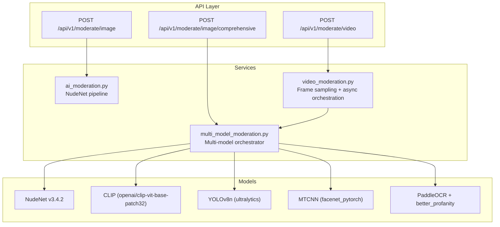
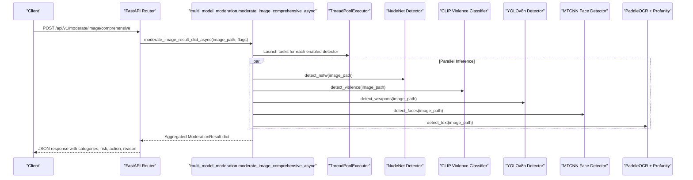
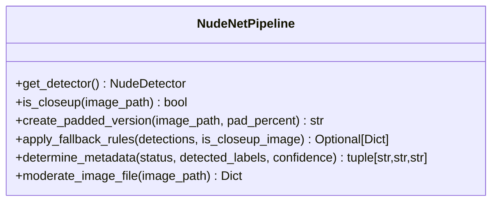
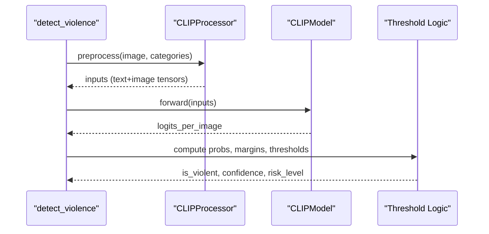
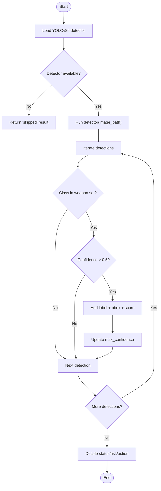
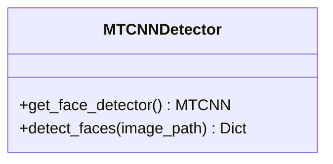
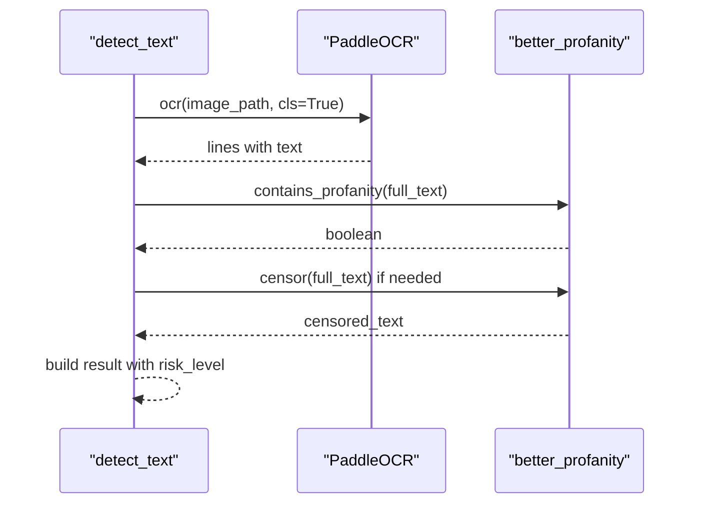
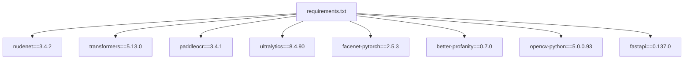

# Individual AI Model Implementations

<cite>
**Referenced Files in This Document**
- [ai_moderation.py](file://backend/app/services/ai_moderation.py)
- [multi_model_moderation.py](file://backend/app/services/multi_model_moderation.py)
- [video_moderation.py](file://backend/app/services/video_moderation.py)
- [moderate.py](file://backend/app/api/moderate.py)
- [config.py](file://backend/app/core/config.py)
- [moderate.py (schemas)](file://backend/app/schemas/moderate.py)
- [requirements.txt](file://backend/requirements.txt)
</cite>

## Table of Contents
1. [Introduction](#introduction)
2. [Project Structure](#project-structure)
3. [Core Components](#core-components)
4. [Architecture Overview](#architecture-overview)
5. [Detailed Component Analysis](#detailed-component-analysis)
6. [Dependency Analysis](#dependency-analysis)
7. [Performance Considerations](#performance-considerations)
8. [Troubleshooting Guide](#troubleshooting-guide)
9. [Conclusion](#conclusion)

## Introduction
This document provides detailed, code-sourced documentation for each individual AI model implementation within the OmniShield system. It focuses on:
- NudeNet v3.4.2 for NSFW content detection with category thresholds and bounding box outputs
- CLIP zero-shot classification for violence/gore detection using openai/clip-vit-base-patch32 with strict confidence thresholds to minimize false positives
- YOLOv8n weapon detection using COCO object classes with specialized filtering
- MTCNN face detection capabilities and face counting functionality
- PaddleOCR text extraction combined with better_profanity filtering for inappropriate content detection

For each model, we include version information, threshold configurations, error handling patterns, integration specifics, input/output formats, confidence scoring mechanisms, and risk assessment calculations.

## Project Structure
The AI models are orchestrated by a multi-model moderation service that runs detectors concurrently and aggregates results into a unified response. The API layer exposes endpoints for single image moderation, comprehensive multi-model moderation, and asynchronous video moderation.

**Diagram sources**
- [moderate.py:223-378](file://backend/app/api/moderate.py#L223-L378)
- [moderate.py:446-615](file://backend/app/api/moderate.py#L446-L615)
- [moderate.py:85-189](file://backend/app/api/moderate.py#L85-L189)
- [ai_moderation.py:148-275](file://backend/app/services/ai_moderation.py#L148-L275)
- [multi_model_moderation.py:532-732](file://backend/app/services/multi_model_moderation.py#L532-L732)
- [video_moderation.py:89-236](file://backend/app/services/video_moderation.py#L89-L236)

**Section sources**
- [moderate.py:223-378](file://backend/app/api/moderate.py#L223-L378)
- [moderate.py:446-615](file://backend/app/api/moderate.py#L446-L615)
- [moderate.py:85-189](file://backend/app/api/moderate.py#L85-L189)
- [ai_moderation.py:148-275](file://backend/app/services/ai_moderation.py#L148-L275)
- [multi_model_moderation.py:532-732](file://backend/app/services/multi_model_moderation.py#L532-L732)
- [video_moderation.py:89-236](file://backend/app/services/video_moderation.py#L89-L236)

## Core Components
- NudeNet NSFW detector with per-label thresholds and fallback heuristics for close-up images
- CLIP zero-shot classifier for violence/gore with strict thresholds and margin checks
- YOLOv8n general object detector filtered to weapon-related COCO classes
- MTCNN face detector providing face counts and bounding boxes
- PaddleOCR text extraction with profanity filtering
- Multi-model orchestrator running all detectors concurrently and aggregating risk levels and actions

**Section sources**
- [ai_moderation.py:25-41](file://backend/app/services/ai_moderation.py#L25-L41)
- [ai_moderation.py:76-118](file://backend/app/services/ai_moderation.py#L76-L118)
- [multi_model_moderation.py:218-301](file://backend/app/services/multi_model_moderation.py#L218-L301)
- [multi_model_moderation.py:304-377](file://backend/app/services/multi_model_moderation.py#L304-L377)
- [multi_model_moderation.py:380-431](file://backend/app/services/multi_model_moderation.py#L380-L431)
- [multi_model_moderation.py:434-486](file://backend/app/services/multi_model_moderation.py#L434-L486)
- [multi_model_moderation.py:532-732](file://backend/app/services/multi_model_moderation.py#L532-L732)

## Architecture Overview
The system uses an async-first design where multiple CPU/GPU-bound detectors run concurrently via ThreadPoolExecutor and asyncio.gather. Results are aggregated into a unified ModerationResult with overall status, confidence, risk level, recommended action, and reasons.

**Diagram sources**
- [moderate.py:446-615](file://backend/app/api/moderate.py#L446-L615)
- [multi_model_moderation.py:532-732](file://backend/app/services/multi_model_moderation.py#L532-L732)
- [multi_model_moderation.py:491-529](file://backend/app/services/multi_model_moderation.py#L491-L529)

## Detailed Component Analysis

### NudeNet v3.4.2 — NSFW Content Detection
- Version: nudenet==3.4.2 (from requirements)
- Purpose: Detect explicit nudity categories with per-label thresholds and bounding boxes
- Key behaviors:
  - Lazy initialization of NudeDetector
  - Per-label thresholds for unsafe categories
  - Close-up detection heuristic with optional padded re-run
  - Fallback rules based on contextual cues (e.g., exposed belly without face)
  - Risk mapping to enterprise levels and recommended actions

Thresholds and labels:
- Unsafe labels include exposed genitalia, anus, breasts, buttocks
- Thresholds vary by label; highest priority labels have lower thresholds to avoid misses
- Default fallback threshold is configurable via settings.DEFAULT_THRESHOLD

Bounding boxes:
- Returned as integer coordinates with label and score
- Padded detections append a suffix to indicate padding context

Risk assessment:
- Critical for explicit genitalia/anus
- High for exposed breasts/buttocks or covered male genitalia depending on confidence
- Medium for inferred nudity via heuristics

Error handling:
- File not found returns error status
- Unexpected exceptions return error status with message
- Graceful cleanup of temporary padded files

Input/Output format:
- Input: image file path
- Output: status, confidence, detected_labels, bounding_boxes, processing_time, risk_level, recommended_action, reason

Example paths:
- [ai_moderation.py:25-41](file://backend/app/services/ai_moderation.py#L25-L41)
- [ai_moderation.py:76-118](file://backend/app/services/ai_moderation.py#L76-L118)
- [ai_moderation.py:148-275](file://backend/app/services/ai_moderation.py#L148-L275)

Accuracy note:
- The repository does not provide a measured accuracy metric for NudeNet v3.4.2. The project includes a dataset test script that computes accuracy over a local dataset but does not publish a fixed accuracy figure.

**Section sources**
- [requirements.txt:67-67](file://backend/requirements.txt#L67-L67)
- [ai_moderation.py:25-41](file://backend/app/services/ai_moderation.py#L25-L41)
- [ai_moderation.py:76-118](file://backend/app/services/ai_moderation.py#L76-L118)
- [ai_moderation.py:148-275](file://backend/app/services/ai_moderation.py#L148-L275)
- [dataset_test.py:1-104](file://backend/dataset_test.py#L1-L104)

#### Class Diagram: NudeNet Pipeline

**Diagram sources**
- [ai_moderation.py:14-22](file://backend/app/services/ai_moderation.py#L14-L22)
- [ai_moderation.py:44-74](file://backend/app/services/ai_moderation.py#L44-L74)
- [ai_moderation.py:76-118](file://backend/app/services/ai_moderation.py#L76-L118)
- [ai_moderation.py:121-146](file://backend/app/services/ai_moderation.py#L121-L146)
- [ai_moderation.py:148-275](file://backend/app/services/ai_moderation.py#L148-L275)

### CLIP Zero-Shot Classification — Violence/Gore Detection
- Model: openai/clip-vit-base-patch32 (transformers)
- Purpose: Zero-shot classification across safety vs violence-related prompts
- Strict thresholds:
  - Violence probability must exceed 0.85
  - Margin between violence and safe probabilities must be > 0.25
- Risk mapping:
  - Critical if max violence prob > 0.95
  - High if > 0.90
  - Medium if > 0.85
  - Low otherwise

Confidence scoring:
- If violent: confidence equals max violence probability
- If safe: confidence equals safe probability

Debug fields:
- Includes internal debug probabilities for transparency

Error handling:
- Returns error status with reason on exceptions

Input/Output format:
- Input: image file path
- Output: status, confidence, risk_level, detected_labels, bounding_boxes (empty), reason, model identifier, debug fields

Integration specifics:
- Lazy loading of CLIP model and processor
- GPU acceleration when available
- Categories include safe, violence/fighting, blood/injury, weapons/combat, aggressive behavior

**Section sources**
- [multi_model_moderation.py:65-82](file://backend/app/services/multi_model_moderation.py#L65-L82)
- [multi_model_moderation.py:218-301](file://backend/app/services/multi_model_moderation.py#L218-L301)

#### Sequence Diagram: CLIP Violence Detection

**Diagram sources**
- [multi_model_moderation.py:218-301](file://backend/app/services/multi_model_moderation.py#L218-L301)

### YOLOv8n — Weapon Detection
- Model: yolov8n.pt (ultralytics)
- Purpose: General object detection filtered to weapon-related COCO classes
- Filtered classes: knife, scissors, baseball bat, tennis racket, bottle, fork, spoon
- Confidence threshold: > 0.5 for inclusion
- Risk mapping:
  - Critical if max conf > 0.8
  - High if > 0.6
  - Medium if > 0.4
  - Low otherwise

Bounding boxes:
- Converted to integer coordinates
- Each detection includes label, box, score

Error handling:
- Skipped if detector unavailable
- Error status with reason on exceptions

Input/Output format:
- Input: image file path
- Output: status, confidence, risk_level, detected_labels, bounding_boxes, reason, model identifier

Integration specifics:
- Lazy loading with fallback to None if model fails to load
- Uses ultralytics YOLO inference API

**Section sources**
- [multi_model_moderation.py:85-100](file://backend/app/services/multi_model_moderation.py#L85-L100)
- [multi_model_moderation.py:304-377](file://backend/app/services/multi_model_moderation.py#L304-L377)

#### Flowchart: YOLOv8 Weapon Filtering

**Diagram sources**
- [multi_model_moderation.py:304-377](file://backend/app/services/multi_model_moderation.py#L304-L377)

### MTCNN — Face Detection and Counting
- Library: facenet_pytorch MTCNN
- Purpose: Detect faces and count them; provide bounding boxes and per-face scores
- Behavior:
  - Returns face_count and list of bounding boxes with labels like FACE_1, FACE_2
  - Status always safe (face detection alone does not determine safety)
  - Confidence defaults to 0.95 for non-violent decisions

Error handling:
- Skipped if detector unavailable
- Error status with reason on exceptions

Input/Output format:
- Input: image file path
- Output: status, confidence, face_count, bounding_boxes, reason, model identifier

Integration specifics:
- Lazy loading with device selection (CUDA if available)
- keep_all=True to capture all detected faces

**Section sources**
- [multi_model_moderation.py:103-117](file://backend/app/services/multi_model_moderation.py#L103-L117)
- [multi_model_moderation.py:380-431](file://backend/app/services/multi_model_moderation.py#L380-L431)

#### Class Diagram: MTCNN Face Detector

**Diagram sources**
- [multi_model_moderation.py:103-117](file://backend/app/services/multi_model_moderation.py#L103-L117)
- [multi_model_moderation.py:380-431](file://backend/app/services/multi_model_moderation.py#L380-L431)

### PaddleOCR + better_profanity — Text Extraction and Profanity Filtering
- Libraries: paddleocr==3.4.1, better-profanity==0.7.0
- Purpose: Extract text from images and detect inappropriate language
- Behavior:
  - OCR with angle classification and English language
  - Concatenates extracted texts and checks for profanity
  - Censors text if profanity detected
  - Risk level high if profanity present, low otherwise

Error handling:
- Skipped if OCR or profanity filter unavailable
- Error status with reason on exceptions

Input/Output format:
- Input: image file path
- Output: status, confidence, detected_text, contains_profanity, text_count, reason, model identifier, risk_level

Integration specifics:
- Lazy loading of PaddleOCR and profanity filter
- Profanity dictionary loaded at first use

**Section sources**
- [multi_model_moderation.py:120-146](file://backend/app/services/multi_model_moderation.py#L120-L146)
- [multi_model_moderation.py:434-486](file://backend/app/services/multi_model_moderation.py#L434-L486)

#### Sequence Diagram: Text Moderation

**Diagram sources**
- [multi_model_moderation.py:434-486](file://backend/app/services/multi_model_moderation.py#L434-L486)

### Multi-Model Orchestrator — Aggregation and Risk Assessment
- Orchestrator function: moderate_image_comprehensive_async
- Runs detectors concurrently via ThreadPoolExecutor and asyncio.gather
- Aggregates:
  - All detected labels (deduplicated)
  - All bounding boxes
  - Model versions per category
  - Overall status, confidence, risk level, recommended action, reason
- Professional portrait override:
  - If exactly one face detected, no weapons, and violence confidence < 0.85, override violence to safe

Risk aggregation:
- Maps risk levels to numeric scores (low=0, medium=25, high=50, critical=100)
- Highest risk among unsafe categories determines overall risk
- For safe verdicts, average confidence across categories

Error handling:
- Skipped categories do not affect safety unless other categories are unsafe
- Errors logged and excluded from aggregation

Input/Output format:
- Input: image_path, enable_* flags, max_workers
- Output: ModerationResult dataclass serialized to dict

**Section sources**
- [multi_model_moderation.py:532-732](file://backend/app/services/multi_model_moderation.py#L532-L732)
- [multi_model_moderation.py:735-777](file://backend/app/services/multi_model_moderation.py#L735-L777)

## Dependency Analysis
Key dependencies and their roles:
- nudenet==3.4.2: NSFW detection
- transformers==5.13.0 + torch==2.12.1: CLIP zero-shot classification
- ultralytics==8.4.90: YOLOv8n object detection
- facenet-pytorch==2.5.3: MTCNN face detection
- paddleocr==3.4.1 + paddlepaddle==3.3.1: Text extraction
- better-profanity==0.7.0: Profanity filtering
- fastapi==0.137.0: API layer
- opencv-python==5.0.0.93: Video frame extraction

**Diagram sources**
- [requirements.txt:1-142](file://backend/requirements.txt#L1-L142)

**Section sources**
- [requirements.txt:1-142](file://backend/requirements.txt#L1-L142)

## Performance Considerations
- Concurrent execution: ThreadPoolExecutor with asyncio.gather maximizes throughput for CPU/GPU-bound models
- Lazy loading: Models initialized only when needed to reduce startup time
- GPU utilization: CLIP and MTCNN leverage CUDA when available
- Frame sampling: Video moderation samples frames at 1 FPS to balance coverage and performance
- Bounding box conversion: Utility function ensures consistent integer coordinates for serialization

[No sources needed since this section provides general guidance]

## Troubleshooting Guide
Common issues and resolutions:
- Model loading failures:
  - YOLOv8n may fail to load initially; system gracefully disables weapon detection
  - MTCNN and PaddleOCR may fail due to missing dependencies; system skips those detectors
- File validation errors:
  - Image header validation rejects spoofed files
  - Video header validation enforces supported containers
- Cache and temp files:
  - Temporary padded images are cleaned up after use
  - Uploaded files are deleted after processing

Error handling patterns:
- Each detector returns structured error responses with status, confidence, risk_level, and reason
- API layer raises HTTPException for client-facing errors and logs unexpected exceptions

**Section sources**
- [multi_model_moderation.py:85-100](file://backend/app/services/multi_model_moderation.py#L85-L100)
- [multi_model_moderation.py:103-117](file://backend/app/services/multi_model_moderation.py#L103-L117)
- [multi_model_moderation.py:120-146](file://backend/app/services/multi_model_moderation.py#L120-L146)
- [moderate.py:32-60](file://backend/app/api/moderate.py#L32-L60)
- [moderate.py:223-378](file://backend/app/api/moderate.py#L223-L378)
- [moderate.py:446-615](file://backend/app/api/moderate.py#L446-L615)

## Conclusion
OmniShield integrates five distinct AI models to deliver comprehensive content moderation:
- NudeNet v3.4.2 provides robust NSFW detection with nuanced thresholds and contextual fallbacks
- CLIP zero-shot classification offers strict violence/gore detection with high confidence thresholds to prevent false positives
- YOLOv8n filters COCO objects to identify potential weapons
- MTCNN enables face detection and counting for privacy-aware workflows
- PaddleOCR plus profanity filtering catches inappropriate text

The orchestrator aggregates results with clear risk levels and recommended actions, while maintaining graceful degradation when individual models are unavailable.

[No sources needed since this section summarizes without analyzing specific files]