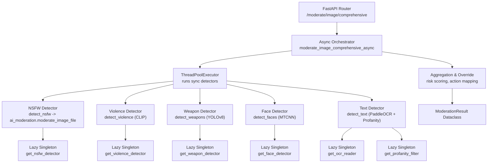
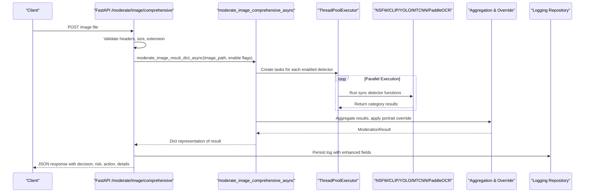
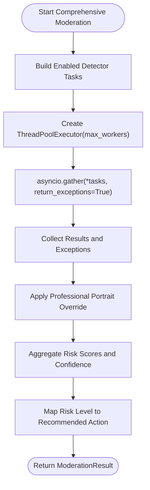
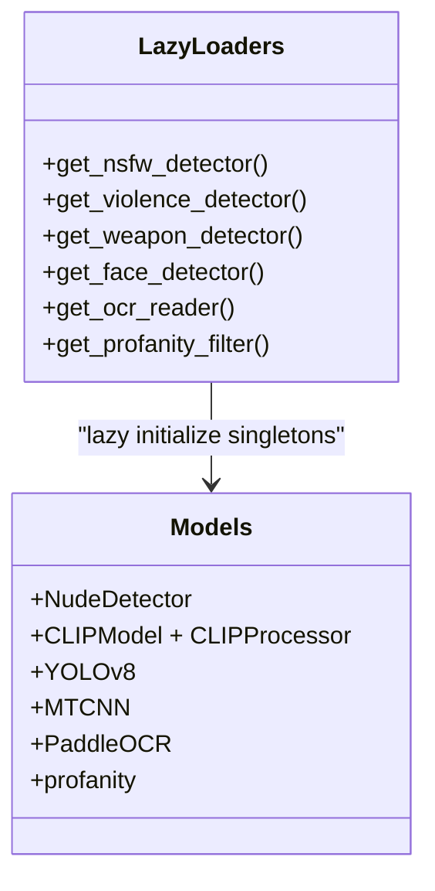
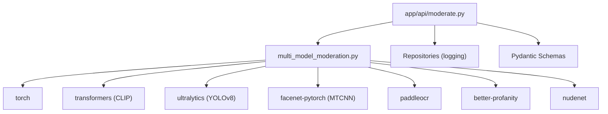

# Multi-Model Architecture & Orchestration

<cite>
**Referenced Files in This Document**
- [multi_model_moderation.py](file://backend/app/services/multi_model_moderation.py)
- [ai_moderation.py](file://backend/app/services/ai_moderation.py)
- [moderate.py](file://backend/app/api/moderate.py)
- [moderate.py (schemas)](file://backend/app/schemas/moderate.py)
- [config.py](file://backend/app/core/config.py)
- [test_multi_model.py](file://backend/test_multi_model.py)
</cite>

## Table of Contents
1. [Introduction](#introduction)
2. [Project Structure](#project-structure)
3. [Core Components](#core-components)
4. [Architecture Overview](#architecture-overview)
5. [Detailed Component Analysis](#detailed-component-analysis)
6. [Dependency Analysis](#dependency-analysis)
7. [Performance Considerations](#performance-considerations)
8. [Troubleshooting Guide](#troubleshooting-guide)
9. [Conclusion](#conclusion)

## Introduction
This document explains the multi-model orchestration architecture for content moderation, focusing on the ensemble coordination system that combines outputs from six AI models: NSFW detection (NudeNet), violence detection (CLIP), weapon detection (YOLOv8), face detection (MTCNN), text moderation (PaddleOCR + profanity filter), and a legacy NudeNet pipeline integration. The system uses an async parallel execution strategy with asyncio.gather and ThreadPoolExecutor to run model inference concurrently. It implements lazy loading with global singletons to prevent memory bloat, includes a professional portrait override to reduce false positives, and provides a robust result aggregation algorithm with risk mapping and recommended actions. Error handling ensures graceful degradation when individual models fail, and GPU auto-detection with CPU fallback is used where applicable.

## Project Structure
The relevant backend components are organized under app/services, app/api, app/schemas, and app/core. The orchestration logic resides primarily in the multi-model service, which coordinates multiple detectors and aggregates their results into a unified ModerationResult.

**Diagram sources**
- [moderate.py:446-615](file://backend/app/api/moderate.py#L446-L615)
- [multi_model_moderation.py:532-732](file://backend/app/services/multi_model_moderation.py#L532-L732)
- [ai_moderation.py:148-275](file://backend/app/services/ai_moderation.py#L148-L275)

**Section sources**
- [moderate.py:446-615](file://backend/app/api/moderate.py#L446-L615)
- [multi_model_moderation.py:1-777](file://backend/app/services/multi_model_moderation.py#L1-L777)
- [ai_moderation.py:1-275](file://backend/app/services/ai_moderation.py#L1-L275)

## Core Components
- ModerationResult dataclass: Structured output containing status, confidence, risk_level, recommended_action, reason, categories, detected_labels, bounding_boxes, processing_time, and model_versions.
- Async orchestrator: Builds detector configurations based on flags, executes them concurrently via asyncio.gather with ThreadPoolExecutor, and aggregates results.
- Lazy-loading singletons: Global module-level variables hold detector instances; each get_* function initializes once and caches the instance.
- Individual detectors:
  - detect_nsfw: Delegates to ai_moderation.moderate_image_file and normalizes bounding boxes.
  - detect_violence: CLIP zero-shot classification with strict thresholds and debug fields.
  - detect_weapons: YOLOv8 object detection with weapon class filtering.
  - detect_faces: MTCNN face detection returning counts and boxes.
  - detect_text: PaddleOCR extraction plus profanity filtering.
- Aggregation and override: Applies professional portrait override, maps per-category risk levels to scores, computes aggregate confidence and risk, and determines recommended action.

**Section sources**
- [multi_model_moderation.py:28-41](file://backend/app/services/multi_model_moderation.py#L28-L41)
- [multi_model_moderation.py:532-732](file://backend/app/services/multi_model_moderation.py#L532-L732)
- [multi_model_moderation.py:54-146](file://backend/app/services/multi_model_moderation.py#L54-L146)
- [ai_moderation.py:148-275](file://backend/app/services/ai_moderation.py#L148-L275)

## Architecture Overview
The orchestration flow starts at the FastAPI endpoint, which validates uploads, optionally checks cache, and invokes the comprehensive async moderation routine. The orchestrator constructs tasks for enabled detectors, runs them concurrently using a thread pool, and then aggregates results with safety overrides and risk mapping.

**Diagram sources**
- [moderate.py:446-615](file://backend/app/api/moderate.py#L446-L615)
- [multi_model_moderation.py:532-732](file://backend/app/services/multi_model_moderation.py#L532-L732)

## Detailed Component Analysis

### ModerationResult Dataclass and Risk Mapping
- Fields:
  - status: safe or unsafe
  - confidence: aggregated confidence score
  - risk_level: low, medium, high, critical
  - recommended_action: allow, quarantine, block
  - reason: human-readable explanation
  - categories: per-model results dictionary
  - detected_labels: deduplicated labels across models
  - bounding_boxes: combined boxes from all detectors
  - processing_time: total time spent
  - model_versions: map of category to model version string
- Risk mapping and action logic:
  - Per-category risk levels mapped to numeric scores: low=0, medium=25, high=50, critical=100.
  - If any category is unsafe, aggregate confidence is the maximum among unsafe categories; otherwise average of confidences.
  - Aggregate risk score determines final risk level and action:
    - >= 80: critical → block
    - >= 50: high → block
    - >= 25: medium → quarantine
    - < 25: low → allow

**Section sources**
- [multi_model_moderation.py:28-41](file://backend/app/services/multi_model_moderation.py#L28-L41)
- [multi_model_moderation.py:654-705](file://backend/app/services/multi_model_moderation.py#L654-L705)

### Async Parallel Execution Strategy
- Orchestrator builds a list of enabled detectors based on query flags.
- Uses ThreadPoolExecutor with max_workers capped by number of enabled detectors.
- Each detector is wrapped in an async helper that runs the synchronous function in the executor via loop.run_in_executor.
- asyncio.gather collects results concurrently; exceptions are handled gracefully without aborting other tasks.

**Diagram sources**
- [multi_model_moderation.py:532-618](file://backend/app/services/multi_model_moderation.py#L532-L618)
- [multi_model_moderation.py:491-529](file://backend/app/services/multi_model_moderation.py#L491-L529)

**Section sources**
- [multi_model_moderation.py:532-618](file://backend/app/services/multi_model_moderation.py#L532-L618)
- [multi_model_moderation.py:491-529](file://backend/app/services/multi_model_moderation.py#L491-L529)

### Lazy Loading Implementation Pattern
- Global module-level variables store singleton instances for NudeNet, CLIP, YOLOv8, MTCNN, PaddleOCR, and profanity filter.
- Each get_* function lazily imports and initializes the model only on first use, caching the instance globally.
- GPU auto-detection:
  - CLIP moves model to CUDA if available, else stays on CPU.
  - MTCNN selects device based on torch.cuda.is_available().
- Graceful failure:
  - YOLOv8 and PaddleOCR initialization failures are logged and set to None; detectors return “skipped” results.
  - Face detector returns “skipped” if not available.

**Diagram sources**
- [multi_model_moderation.py:54-146](file://backend/app/services/multi_model_moderation.py#L54-L146)

**Section sources**
- [multi_model_moderation.py:54-146](file://backend/app/services/multi_model_moderation.py#L54-L146)

### Individual Model Detectors
- NSFW Detection:
  - Delegates to ai_moderation.moderate_image_file, converts bounding boxes to integers, and standardizes fields.
- Violence Detection (CLIP):
  - Zero-shot classification with categories including safe vs violence-related prompts.
  - Strict thresholds: requires high violence probability and margin over safe probability to avoid false positives.
  - Includes debug fields for internal probabilities and margins.
- Weapon Detection (YOLOv8):
  - Runs general object detection and filters for weapon-like classes with confidence threshold.
  - Returns bounding boxes and normalized labels.
- Face Detection (MTCNN):
  - Detects faces and returns count and boxes; does not determine safety alone.
- Text Moderation (PaddleOCR + Profanity):
  - Extracts text, checks for profanity, censors if needed, and assigns risk level accordingly.

**Section sources**
- [multi_model_moderation.py:179-486](file://backend/app/services/multi_model_moderation.py#L179-L486)
- [ai_moderation.py:148-275](file://backend/app/services/ai_moderation.py#L148-L275)

### Professional Portrait Detection Override
- Conditions:
  - Exactly one face detected and face status is safe.
  - No weapons detected (or skipped/error).
  - Violence probability below threshold (< 0.85).
- Effect:
  - Forces violence category to safe, clears labels, sets risk level to low, and updates reason.
- Purpose:
  - Reduces false positives in professional photography scenarios where CLIP might misclassify neutral poses.

**Section sources**
- [multi_model_moderation.py:627-653](file://backend/app/services/multi_model_moderation.py#L627-L653)

### Result Aggregation Algorithm
- Collects labels and boxes from non-error/non-skipped categories.
- Maps per-category risk levels to numeric scores and aggregates:
  - If any unsafe category exists, aggregate confidence is the maximum among unsafe categories; aggregate risk score is the maximum risk score.
  - Otherwise, aggregate confidence is the average of confidences; aggregate risk score is zero.
- Final risk level and action determined by thresholds:
  - critical/high → block
  - medium → quarantine
  - low → allow

**Section sources**
- [multi_model_moderation.py:654-705](file://backend/app/services/multi_model_moderation.py#L654-L705)

### API Integration and Response Schema
- Endpoint:
  - POST /api/v1/moderate/image/comprehensive accepts image files and enable flags for each detector.
- Processing:
  - Validates file type and size, writes to temporary path, calls async comprehensive moderation, persists logs with enhanced fields (categories, model versions, face count, text moderation info).
- Response schema:
  - Pydantic models define structured responses with decision, risk_level, confidence, detected_labels, bounding_boxes, processing_time, recommended_action, reason, cached flag, and additional fields for comprehensive results.

**Section sources**
- [moderate.py:446-615](file://backend/app/api/moderate.py#L446-L615)
- [moderate.py (schemas):1-31](file://backend/app/schemas/moderate.py#L1-L31)

## Dependency Analysis
The orchestration depends on several external libraries and services:
- Torch and transformers for CLIP.
- ultralytics for YOLOv8.
- facenet-pytorch for MTCNN.
- paddleocr for OCR.
- better-profanity for text moderation.
- nudenet for NSFW detection.
- FastAPI for HTTP endpoints.
- SQLAlchemy repositories for logging.

**Diagram sources**
- [multi_model_moderation.py:1-26](file://backend/app/services/multi_model_moderation.py#L1-L26)
- [moderate.py:1-22](file://backend/app/api/moderate.py#L1-L22)

**Section sources**
- [multi_model_moderation.py:1-26](file://backend/app/services/multi_model_moderation.py#L1-L26)
- [moderate.py:1-22](file://backend/app/api/moderate.py#L1-L22)

## Performance Considerations
- Concurrency:
  - asyncio.gather with ThreadPoolExecutor enables parallel execution of CPU/GPU-bound detectors, maximizing throughput.
- Worker tuning:
  - max_workers is capped by the number of enabled detectors to avoid oversubscription.
- Lazy loading:
  - Singletons ensure heavy models are loaded only when needed, reducing startup time and memory footprint.
- GPU acceleration:
  - CLIP and MTCNN automatically select CUDA if available; otherwise fall back to CPU.
- Caching:
  - The single-image endpoint caches results by SHA256 hash; comprehensive endpoint currently bypasses caching but can be extended.
- Bounding box normalization:
  - Utility function converts various coordinate types to integers for consistent serialization.

[No sources needed since this section provides general guidance]

## Troubleshooting Guide
- Model loading failures:
  - YOLOv8 and PaddleOCR may fail on first run or missing dependencies; detectors return “skipped” results and continue operation.
  - Use the test script to verify model availability and installation steps.
- False positives in violence detection:
  - Adjust CLIP thresholds or rely on the professional portrait override to suppress low-confidence violence flags when appropriate.
- Performance bottlenecks:
  - Reduce max_workers if CPU contention occurs; ensure GPU drivers and CUDA are correctly installed for acceleration.
- File validation errors:
  - Ensure uploaded files pass magic byte checks and size limits; the API raises clear HTTP errors for invalid inputs.

**Section sources**
- [multi_model_moderation.py:85-146](file://backend/app/services/multi_model_moderation.py#L85-L146)
- [multi_model_moderation.py:218-301](file://backend/app/services/multi_model_moderation.py#L218-L301)
- [moderate.py:32-61](file://backend/app/api/moderate.py#L32-L61)
- [test_multi_model.py:25-117](file://backend/test_multi_model.py#L25-L117)

## Conclusion
The multi-model orchestration system integrates six complementary AI detectors, executing them concurrently through an async/await pattern backed by a thread pool. Lazy-loaded singletons minimize memory usage and startup overhead, while GPU auto-detection optimizes performance where possible. The aggregation algorithm combines per-model outputs into a unified decision with calibrated risk levels and actionable recommendations. A professional portrait override reduces false positives in specific scenarios, and robust error handling ensures graceful degradation when individual models fail. Together, these design choices deliver a scalable, resilient, and explainable moderation platform.