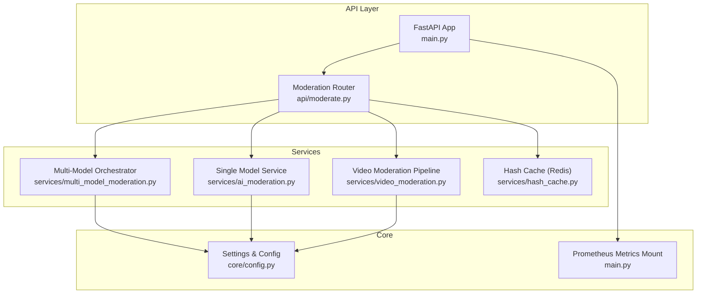
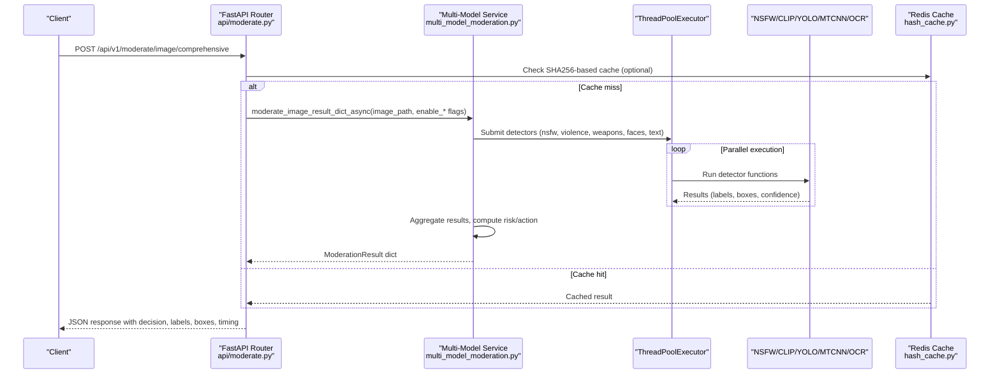
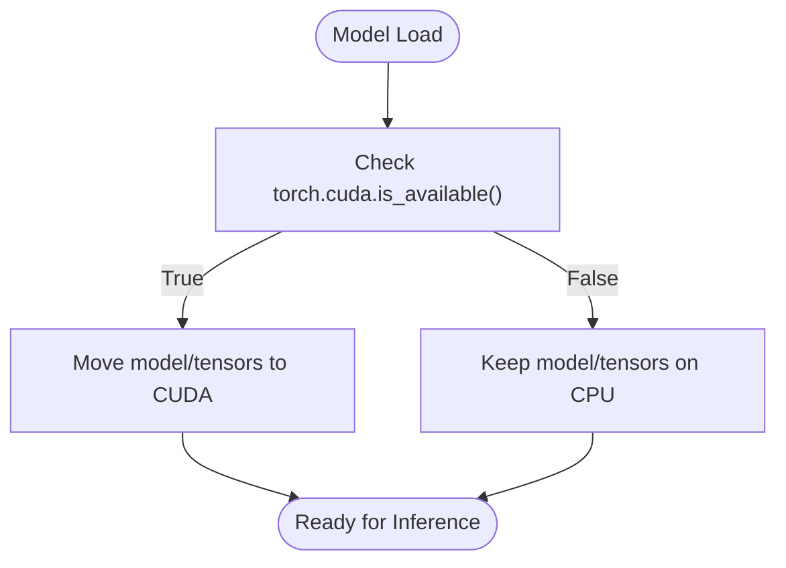
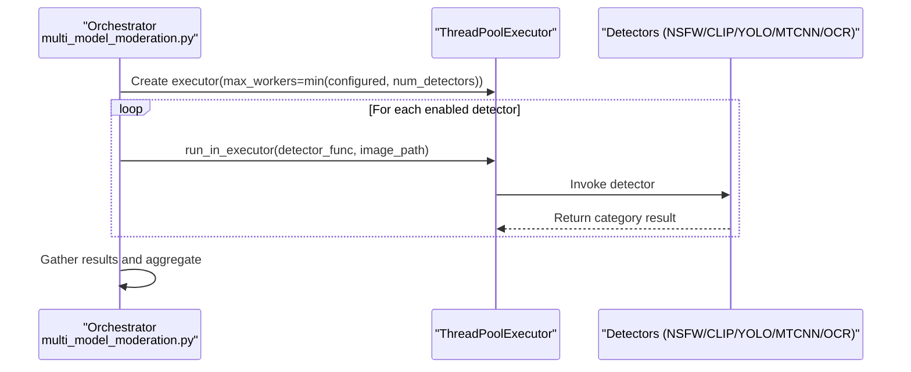
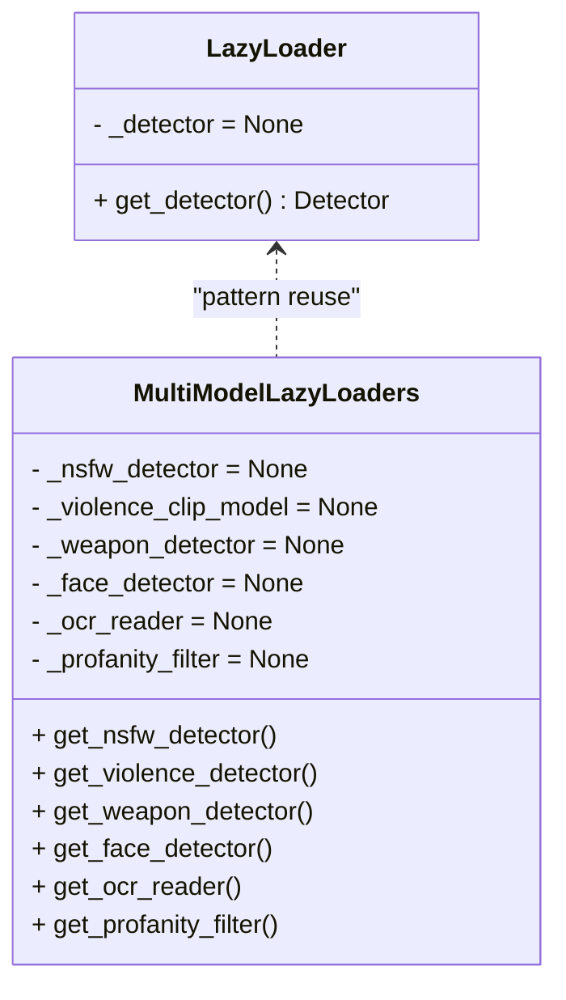
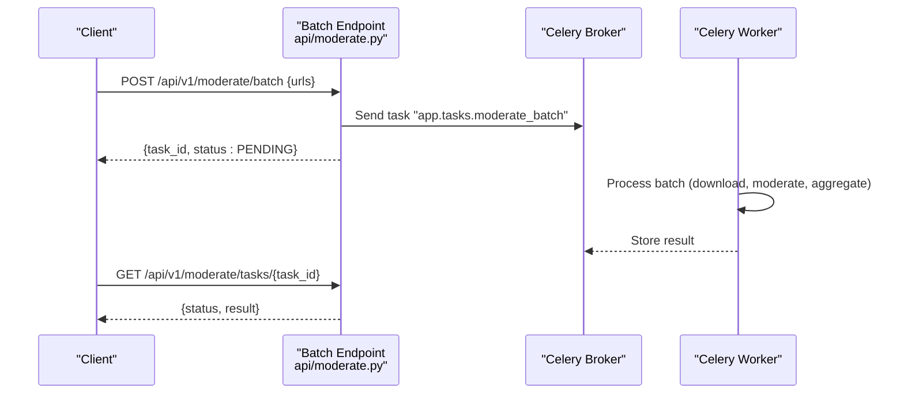
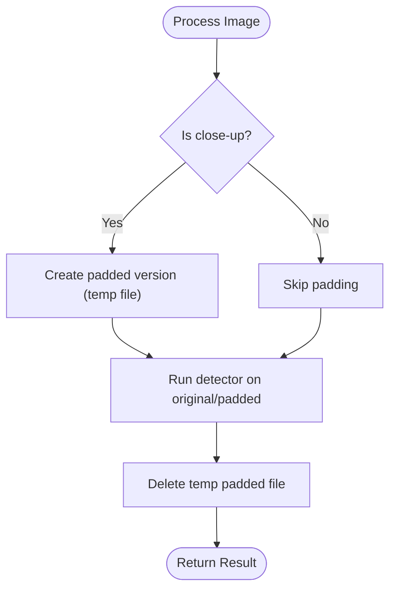
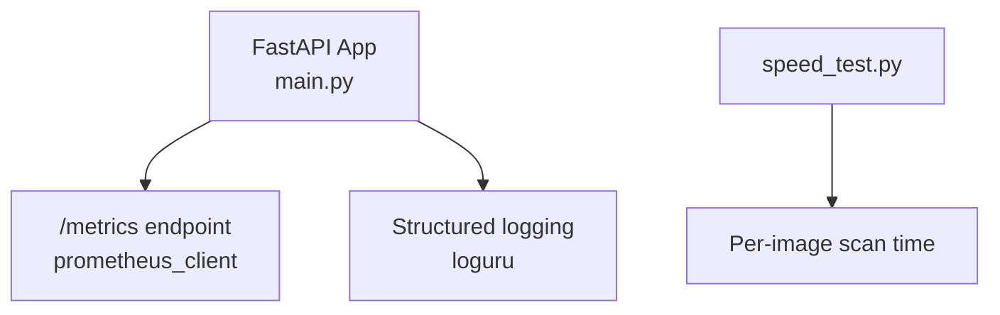
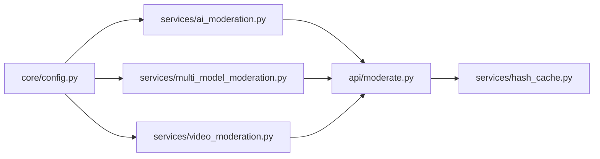

# Performance Optimization & GPU Acceleration

<cite>
**Referenced Files in This Document**
- [ai_moderation.py](file://backend/app/services/ai_moderation.py)
- [multi_model_moderation.py](file://backend/app/services/multi_model_moderation.py)
- [video_moderation.py](file://backend/app/services/video_moderation.py)
- [moderate.py](file://backend/app/api/moderate.py)
- [hash_cache.py](file://backend/app/services/hash_cache.py)
- [config.py](file://backend/app/core/config.py)
- [main.py](file://backend/app/main.py)
- [speed_test.py](file://backend/speed_test.py)
</cite>

## Table of Contents
1. [Introduction](#introduction)
2. [Project Structure](#project-structure)
3. [Core Components](#core-components)
4. [Architecture Overview](#architecture-overview)
5. [Detailed Component Analysis](#detailed-component-analysis)
6. [Dependency Analysis](#dependency-analysis)
7. [Performance Considerations](#performance-considerations)
8. [Troubleshooting Guide](#troubleshooting-guide)
9. [Conclusion](#conclusion)
10. [Appendices](#appendices)

## Introduction
This document explains the performance optimization strategies implemented in the AI model pipeline, focusing on:
- GPU auto-detection and CPU fallback using torch.cuda.is_available()
- Parallel inference via ThreadPoolExecutor with configurable worker counts
- Lazy loading to defer heavy model initialization until first use
- Batch processing capabilities, memory management for large images, and resource cleanup
- Benchmarking methodologies, profiling integration, and monitoring metrics collection
- Scaling considerations for high-throughput scenarios, load balancing across workers, and horizontal scaling patterns
- Common bottlenecks and solutions including model quantization, image preprocessing optimization, and I/O streamlining

## Project Structure
The performance-critical components are primarily located under backend/app/services and backend/app/api. The key modules include:
- Image moderation service (single-model)
- Multi-model orchestration with parallel execution
- Video moderation pipeline that samples frames and runs multi-model moderation concurrently
- API endpoints handling uploads, caching, and background jobs
- Configuration settings for GPU and feature toggles
- Prometheus metrics endpoint wiring

**Diagram sources**
- [main.py:1-126](file://backend/app/main.py#L1-L126)
- [moderate.py:1-615](file://backend/app/api/moderate.py#L1-L615)
- [ai_moderation.py:1-275](file://backend/app/services/ai_moderation.py#L1-L275)
- [multi_model_moderation.py:1-777](file://backend/app/services/multi_model_moderation.py#L1-L777)
- [video_moderation.py:1-254](file://backend/app/services/video_moderation.py#L1-L254)
- [hash_cache.py:1-59](file://backend/app/services/hash_cache.py#L1-L59)
- [config.py:1-148](file://backend/app/core/config.py#L1-L148)

**Section sources**
- [main.py:1-126](file://backend/app/main.py#L1-L126)
- [moderate.py:1-615](file://backend/app/api/moderate.py#L1-L615)
- [ai_moderation.py:1-275](file://backend/app/services/ai_moderation.py#L1-L275)
- [multi_model_moderation.py:1-777](file://backend/app/services/multi_model_moderation.py#L1-L777)
- [video_moderation.py:1-254](file://backend/app/services/video_moderation.py#L1-L254)
- [hash_cache.py:1-59](file://backend/app/services/hash_cache.py#L1-L59)
- [config.py:1-148](file://backend/app/core/config.py#L1-L148)

## Core Components
- Single-model image moderation with lazy NudeDetector initialization and heuristic fallbacks
- Multi-model orchestrator combining NSFW, violence (CLIP), weapons (YOLOv8), faces (MTCNN), and text (PaddleOCR + profanity) with parallel execution
- Video moderation pipeline sampling frames at a configured interval and running concurrent multi-model moderation per frame
- Hash-based caching layer backed by Redis to avoid redundant inference
- FastAPI endpoints for single image, comprehensive multi-model, batch queuing, and video moderation
- Settings for GPU usage flags and feature toggles; optional Prometheus metrics endpoint

Key performance features present in code:
- Lazy loading of models to reduce startup time and memory footprint
- torch.cuda.is_available() checks for GPU device selection and tensor placement
- ThreadPoolExecutor with asyncio.gather for parallel model inference
- Temporary file management and cleanup for padded images and video frames
- SHA256-based deduplication cache to skip repeated work

**Section sources**
- [ai_moderation.py:14-22](file://backend/app/services/ai_moderation.py#L14-L22)
- [multi_model_moderation.py:54-146](file://backend/app/services/multi_model_moderation.py#L54-L146)
- [multi_model_moderation.py:491-615](file://backend/app/services/multi_model_moderation.py#L491-L615)
- [video_moderation.py:89-236](file://backend/app/services/video_moderation.py#L89-L236)
- [hash_cache.py:1-59](file://backend/app/services/hash_cache.py#L1-L59)
- [moderate.py:223-378](file://backend/app/api/moderate.py#L223-L378)
- [moderate.py:446-615](file://backend/app/api/moderate.py#L446-L615)
- [config.py:70-83](file://backend/app/core/config.py#L70-L83)
- [main.py:98-108](file://backend/app/main.py#L98-L108)

## Architecture Overview
The system uses an async-first API layer that delegates to services. Heavy ML operations run in thread pools to avoid blocking the event loop. Models are lazily loaded and optionally placed on GPU when available.

**Diagram sources**
- [moderate.py:446-615](file://backend/app/api/moderate.py#L446-L615)
- [multi_model_moderation.py:532-732](file://backend/app/services/multi_model_moderation.py#L532-L732)
- [hash_cache.py:21-56](file://backend/app/services/hash_cache.py#L21-L56)

## Detailed Component Analysis

### GPU Auto-Detection and CPU Fallback
- CLIP model loader explicitly checks torch.cuda.is_available() and moves the model to CUDA if present; otherwise it remains on CPU.
- MTCNN face detector constructs a torch.device based on torch.cuda.is_available().
- Violence detection function transfers inputs to CUDA when available during inference.

These patterns ensure robust operation across environments without manual configuration.

**Diagram sources**
- [multi_model_moderation.py:65-82](file://backend/app/services/multi_model_moderation.py#L65-L82)
- [multi_model_moderation.py:103-117](file://backend/app/services/multi_model_moderation.py#L103-L117)
- [multi_model_moderation.py:243-246](file://backend/app/services/multi_model_moderation.py#L243-L246)

**Section sources**
- [multi_model_moderation.py:65-82](file://backend/app/services/multi_model_moderation.py#L65-L82)
- [multi_model_moderation.py:103-117](file://backend/app/services/multi_model_moderation.py#L103-L117)
- [multi_model_moderation.py:243-246](file://backend/app/services/multi_model_moderation.py#L243-L246)

### Thread Pool Orchestration for Parallel Inference
- The orchestrator builds a list of enabled detectors and submits them to a ThreadPoolExecutor with max_workers capped by the number of active detectors.
- Each detector runs synchronously within a thread but is orchestrated asynchronously via asyncio.gather, maximizing throughput while keeping the event loop responsive.
- The executor context ensures proper resource lifecycle management.

**Diagram sources**
- [multi_model_moderation.py:532-615](file://backend/app/services/multi_model_moderation.py#L532-L615)

**Section sources**
- [multi_model_moderation.py:532-615](file://backend/app/services/multi_model_moderation.py#L532-L615)

### Lazy Loading Implementation
- Global module-level variables hold detector instances initialized only on first access.
- This defers expensive imports and model loads until they are needed, reducing startup latency and initial memory pressure.
- Both single-model and multi-model services implement this pattern consistently.

**Diagram sources**
- [ai_moderation.py:11-22](file://backend/app/services/ai_moderation.py#L11-L22)
- [multi_model_moderation.py:43-146](file://backend/app/services/multi_model_moderation.py#L43-L146)

**Section sources**
- [ai_moderation.py:11-22](file://backend/app/services/ai_moderation.py#L11-L22)
- [multi_model_moderation.py:43-146](file://backend/app/services/multi_model_moderation.py#L43-L146)

### Batch Processing Capabilities
- The API exposes a batch endpoint that queues a Celery task for asynchronous processing of multiple image URLs.
- While the actual batching logic resides in tasks (not shown here), the endpoint returns a task ID for status polling.

**Diagram sources**
- [moderate.py:380-443](file://backend/app/api/moderate.py#L380-L443)

**Section sources**
- [moderate.py:380-443](file://backend/app/api/moderate.py#L380-L443)

### Memory Management for Large Images and Resource Cleanup
- Close-up images may be padded to improve detection; temporary files are created and cleaned up after use.
- Video moderation writes sampled frames into a temporary directory and deletes it upon completion.
- API handlers delete uploaded temporary files after processing.

**Diagram sources**
- [ai_moderation.py:44-74](file://backend/app/services/ai_moderation.py#L44-L74)
- [ai_moderation.py:191-228](file://backend/app/services/ai_moderation.py#L191-L228)
- [video_moderation.py:132-160](file://backend/app/services/video_moderation.py#L132-L160)
- [moderate.py:370-378](file://backend/app/api/moderate.py#L370-L378)
- [moderate.py:607-615](file://backend/app/api/moderate.py#L607-L615)

**Section sources**
- [ai_moderation.py:44-74](file://backend/app/services/ai_moderation.py#L44-L74)
- [ai_moderation.py:191-228](file://backend/app/services/ai_moderation.py#L191-L228)
- [video_moderation.py:132-160](file://backend/app/services/video_moderation.py#L132-L160)
- [moderate.py:370-378](file://backend/app/api/moderate.py#L370-L378)
- [moderate.py:607-615](file://backend/app/api/moderate.py#L607-L615)

### Monitoring Metrics Collection and Profiling Integration
- Optional Prometheus metrics endpoint is mounted at /metrics when enabled in settings.
- The application logs processing times and decisions, enabling external instrumentation.
- A simple speed test script measures single-image scan time for baseline benchmarking.

**Diagram sources**
- [main.py:98-108](file://backend/app/main.py#L98-L108)
- [speed_test.py:1-41](file://backend/speed_test.py#L1-L41)

**Section sources**
- [main.py:98-108](file://backend/app/main.py#L98-L108)
- [speed_test.py:1-41](file://backend/speed_test.py#L1-L41)

## Dependency Analysis
- Services depend on core settings for thresholds, feature flags, and GPU options.
- API routes depend on services and repositories for persistence and caching.
- Multi-model orchestrator depends on multiple third-party libraries (transformers, ultralytics, facenet_pytorch, paddleocr).

**Diagram sources**
- [config.py:70-83](file://backend/app/core/config.py#L70-L83)
- [ai_moderation.py:1-22](file://backend/app/services/ai_moderation.py#L1-L22)
- [multi_model_moderation.py:1-26](file://backend/app/services/multi_model_moderation.py#L1-L26)
- [video_moderation.py:1-24](file://backend/app/services/video_moderation.py#L1-L24)
- [moderate.py:1-22](file://backend/app/api/moderate.py#L1-L22)
- [hash_cache.py:1-12](file://backend/app/services/hash_cache.py#L1-L12)

**Section sources**
- [config.py:70-83](file://backend/app/core/config.py#L70-L83)
- [ai_moderation.py:1-22](file://backend/app/services/ai_moderation.py#L1-L22)
- [multi_model_moderation.py:1-26](file://backend/app/services/multi_model_moderation.py#L1-L26)
- [video_moderation.py:1-24](file://backend/app/services/video_moderation.py#L1-L24)
- [moderate.py:1-22](file://backend/app/api/moderate.py#L1-L22)
- [hash_cache.py:1-12](file://backend/app/services/hash_cache.py#L1-L12)

## Performance Considerations
- GPU acceleration:
  - Use torch.cuda.is_available() checks to place models and tensors on GPU where possible.
  - Ensure PyTorch CUDA wheels are installed for optimal performance.
- Parallelism tuning:
  - ThreadPoolExecutor max_workers should be tuned based on CPU cores and GPU capacity.
  - For multi-GPU setups, consider distributing models across devices or sharding requests.
- Lazy loading:
  - Defer model initialization to reduce cold start times and memory usage.
- Caching:
  - Leverage SHA256-based Redis cache to avoid redundant inference for identical images.
- I/O efficiency:
  - Stream uploads and write to disk efficiently; clean up temporary files promptly.
  - For videos, sample frames at appropriate intervals to balance accuracy and throughput.
- Memory management:
  - Avoid holding large tensors in memory longer than necessary; move tensors back to CPU before serialization.
  - Reuse model instances via lazy loaders to prevent duplication.
- Quantization and model size:
  - Consider INT8 quantization for models like CLIP and YOLOv8 to reduce memory and increase throughput.
- Preprocessing optimization:
  - Resize images to model input sizes early; avoid unnecessary conversions.
  - Use efficient libraries (e.g., OpenCV) for frame extraction and color conversion.

[No sources needed since this section provides general guidance]

## Troubleshooting Guide
- GPU not detected:
  - Verify torch.cuda.is_available() returns True and correct CUDA drivers are installed.
  - Confirm PyTorch was installed with CUDA support.
- High latency:
  - Increase ThreadPoolExecutor max_workers cautiously; monitor CPU/GPU utilization.
  - Enable caching for repeated images; review cache hit rates.
- Out-of-memory errors:
  - Reduce image resolution or batch size; ensure tensors are moved off GPU after inference.
  - Monitor temporary file growth and ensure cleanup paths execute.
- Model failures:
  - Graceful degradation is implemented; check logs for specific model errors and disable problematic detectors via settings.
- Metrics not visible:
  - Ensure ENABLE_PROMETHEUS_METRICS is True and prometheus-client is installed.

**Section sources**
- [multi_model_moderation.py:65-82](file://backend/app/services/multi_model_moderation.py#L65-L82)
- [multi_model_moderation.py:103-117](file://backend/app/services/multi_model_moderation.py#L103-L117)
- [multi_model_moderation.py:243-246](file://backend/app/services/multi_model_moderation.py#L243-L246)
- [main.py:98-108](file://backend/app/main.py#L98-L108)
- [ai_moderation.py:191-228](file://backend/app/services/ai_moderation.py#L191-L228)
- [video_moderation.py:226-236](file://backend/app/services/video_moderation.py#L226-L236)

## Conclusion
The pipeline integrates several proven performance optimizations:
- Automatic GPU detection with CPU fallback
- Parallel inference via ThreadPoolExecutor and asyncio.gather
- Lazy model loading to minimize startup overhead
- Robust caching and temporary file cleanup
- Optional Prometheus metrics for observability

For high-throughput deployments, tune worker counts, leverage caching aggressively, and consider model quantization and preprocessing optimizations. Horizontal scaling can be achieved by running multiple API replicas behind a load balancer and using background workers for batch and video jobs.

[No sources needed since this section summarizes without analyzing specific files]

## Appendices

### Benchmarking Methodologies
- Single-image baseline:
  - Use the provided speed test script to measure per-image scan time.
- Throughput testing:
  - Generate synthetic traffic against /moderate/image and /moderate/image/comprehensive endpoints.
  - Measure p50/p95 latencies and error rates.
- Model-specific profiling:
  - Add timers around individual detector calls to identify hotspots.
- Database and cache metrics:
  - Track query durations and cache hit ratios to correlate with inference latency.

**Section sources**
- [speed_test.py:1-41](file://backend/speed_test.py#L1-L41)
- [moderate.py:223-378](file://backend/app/api/moderate.py#L223-L378)
- [moderate.py:446-615](file://backend/app/api/moderate.py#L446-L615)

### Scaling Patterns
- Horizontal scaling:
  - Deploy multiple API replicas; distribute requests via a reverse proxy/load balancer.
- Background job scaling:
  - Scale Celery workers independently to handle batch and video moderation tasks.
- Statelessness:
  - Keep API stateless; store results in database and cache externally.
- Resource isolation:
  - Separate CPU-bound and GPU-bound workloads onto different nodes or containers.

[No sources needed since this section provides general guidance]