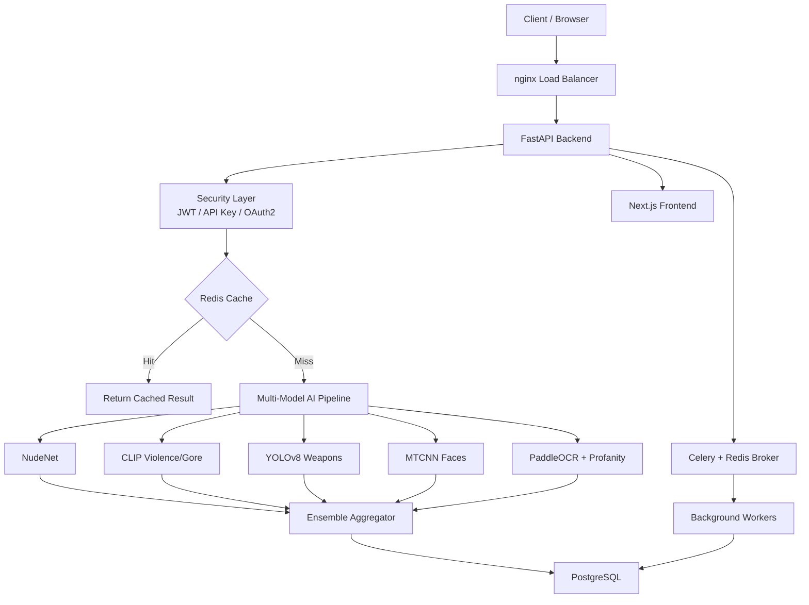
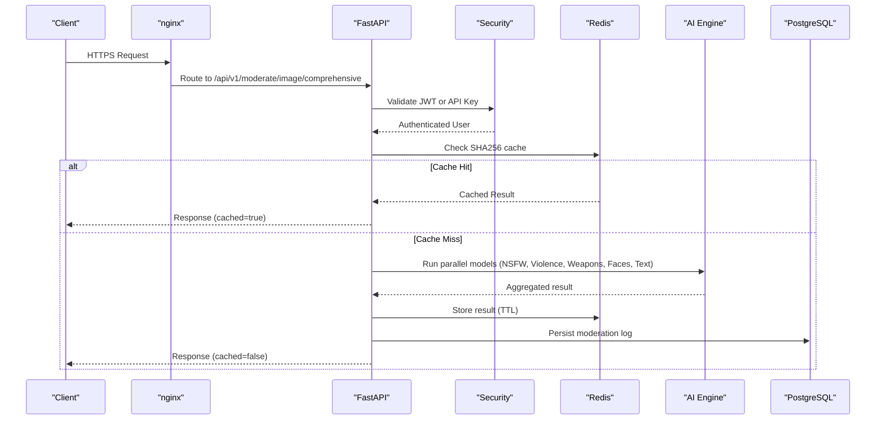
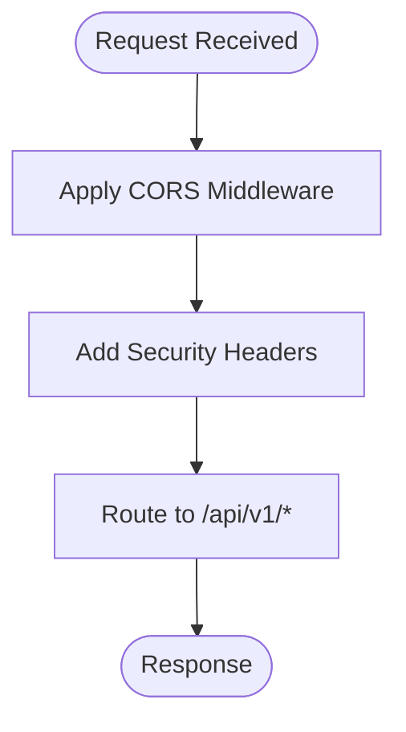
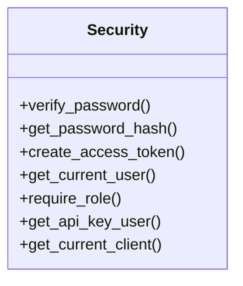
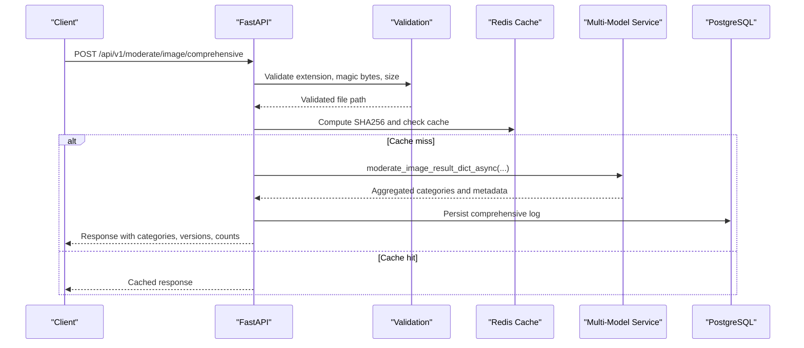
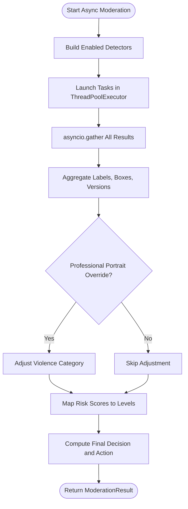
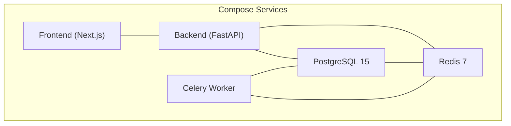
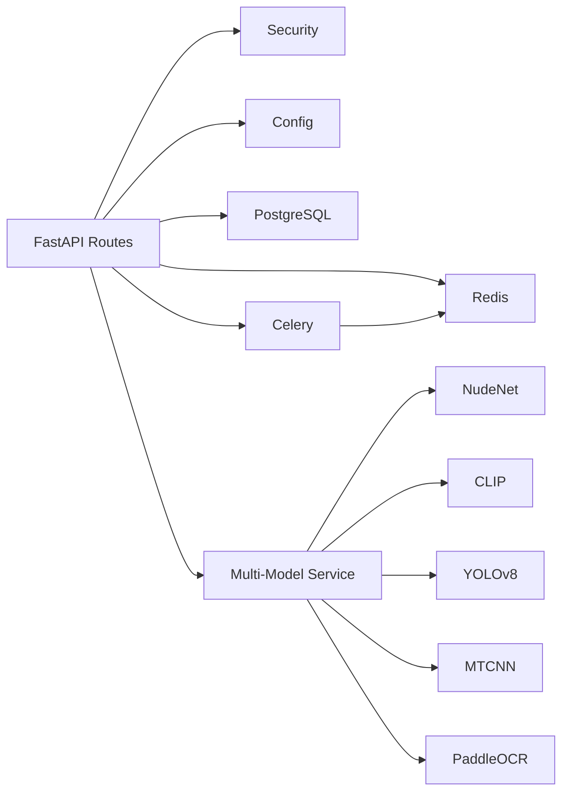

# Architecture & Design

<cite>
**Referenced Files in This Document**
- [README.md](file://nudenet_project/README.md)
- [ARCHITECTURE.md](file://nudenet_project/ARCHITECTURE.md)
- [docker-compose.yml](file://nudenet_project/docker-compose.yml)
- [main.py](file://nudenet_project/backend/app/main.py)
- [config.py](file://nudenet_project/backend/app/core/config.py)
- [security.py](file://nudenet_project/backend/app/core/security.py)
- [redis.py](file://nudenet_project/backend/app/core/redis.py)
- [moderate.py](file://nudenet_project/backend/app/api/moderate.py)
- [ai_moderation.py](file://nudenet_project/backend/app/services/ai_moderation.py)
- [multi_model_moderation.py](file://nudenet_project/backend/app/services/multi_model_moderation.py)
</cite>

## Table of Contents
1. Introduction
2. Project Structure
3. Core Components
4. Architecture Overview
5. Detailed Component Analysis
6. Dependency Analysis
7. Performance Considerations
8. Troubleshooting Guide
9. Conclusion
10. Appendices

## Introduction
OmniShield is an enterprise-grade, multi-model AI content moderation platform that orchestrates six specialized models to deliver comprehensive safety analysis for images and videos. The system combines NSFW detection (NudeNet), violence/gore classification (CLIP), weapon detection (YOLOv8), face detection (MTCNN), and text moderation (PaddleOCR with profanity filtering). It emphasizes high performance through async/await patterns, Redis-backed caching, and parallel model execution, while providing robust security via JWT and API key authentication, rate limiting, and secure input validation.

The platform exposes a FastAPI backend behind nginx, serves a Next.js frontend, persists data in PostgreSQL, caches results in Redis, and supports background processing via Celery workers.

## Project Structure
At a high level:
- Frontend: Next.js application served by nginx
- Backend: FastAPI application with modular layers (API routes, services, repositories, schemas, core utilities)
- Data: PostgreSQL for persistence, Redis for cache and task broker
- Workers: Celery workers for batch jobs and long-running tasks
- Orchestration: Docker Compose defines the runtime environment

**Diagram sources**
- [README.md:88-136](file://nudenet_project/README.md#L88-L136)
- [ARCHITECTURE.md:60-86](file://nudenet_project/ARCHITECTURE.md#L60-L86)

**Section sources**
- [README.md:139-172](file://nudenet_project/README.md#L139-L172)
- [ARCHITECTURE.md:44-56](file://nudenet_project/ARCHITECTURE.md#L44-L56)

## Core Components
- API Server (FastAPI): Handles routing, request validation, security middleware, and orchestration of services.
- Security Layer: Supports JWT Bearer tokens and API keys, role-based access control, and rate limiting.
- AI Engine: Orchestrates six models concurrently using async/await and thread pooling for CPU/GPU-bound inference.
- Cache Layer: Redis-backed SHA256 image hashing and result caching with TTLs.
- Database Layer: PostgreSQL stores users, API keys, and moderation logs with rich metadata.
- Background Processing: Celery workers handle batch moderation and scheduled tasks.

Key implementation anchors:
- Application bootstrap and middleware configuration
- Configuration management and environment-driven behavior
- Authentication and authorization dependencies
- Image upload validation and caching
- Comprehensive multi-model pipeline with parallel execution
- Background job queuing and status polling

**Section sources**
- [main.py:9-63](file://nudenet_project/backend/app/main.py#L9-L63)
- [config.py:6-148](file://nudenet_project/backend/app/core/config.py#L6-L148)
- [security.py:19-177](file://nudenet_project/backend/app/core/security.py#L19-L177)
- [redis.py:1-21](file://nudenet_project/backend/app/core/redis.py#L1-L21)
- [moderate.py:223-378](file://nudenet_project/backend/app/api/moderate.py#L223-L378)
- [multi_model_moderation.py:489-732](file://nudenet_project/backend/app/services/multi_model_moderation.py#L489-L732)

## Architecture Overview
The system follows a layered microservices-style architecture within containers:
- nginx terminates TLS and routes traffic to the FastAPI backend
- FastAPI enforces security, validates inputs, checks Redis cache, and invokes the AI engine
- The AI engine runs multiple models in parallel and aggregates results into a final risk assessment
- Results are cached and persisted; background workers process batch jobs asynchronously

**Diagram sources**
- [README.md:88-136](file://nudenet_project/README.md#L88-L136)
- [ARCHITECTURE.md:224-304](file://nudenet_project/ARCHITECTURE.md#L224-L304)
- [moderate.py:446-597](file://nudenet_project/backend/app/api/moderate.py#L446-L597)
- [multi_model_moderation.py:532-732](file://nudenet_project/backend/app/services/multi_model_moderation.py#L532-L732)

## Detailed Component Analysis

### API Layer and Routing
- FastAPI app initializes CORS, security headers, and mounts routers under /api/v1
- Health and root endpoints provide operational info
- Prometheus metrics endpoint is conditionally mounted based on configuration

**Diagram sources**
- [main.py:26-63](file://nudenet_project/backend/app/main.py#L26-L63)

**Section sources**
- [main.py:9-63](file://nudenet_project/backend/app/main.py#L9-L63)
- [main.py:98-107](file://nudenet_project/backend/app/main.py#L98-L107)

### Security Layer
- Dual authentication: JWT Bearer token and X-API-Key header
- Role-based access control helper
- Rate limiting integration per user/API key
- Graceful fallback when credentials are missing

**Diagram sources**
- [security.py:24-177](file://nudenet_project/backend/app/core/security.py#L24-L177)

**Section sources**
- [security.py:19-177](file://nudenet_project/backend/app/core/security.py#L19-L177)

### Configuration Management
- Centralized settings loaded from environment variables
- Environment-specific behaviors (production vs development)
- Validation for critical fields (e.g., JWT secret in production)
- Feature toggles for enabling/disabling specific models

**Section sources**
- [config.py:6-148](file://nudenet_project/backend/app/core/config.py#L6-L148)

### Redis Integration
- Shared Redis client initialized at startup
- Connection timeout and graceful degradation if Redis is unavailable

**Section sources**
- [redis.py:1-21](file://nudenet_project/backend/app/core/redis.py#L1-L21)

### Moderation Endpoints
- Single image moderation (NudeNet only) with SHA256 caching and DB logging
- Comprehensive multi-model moderation endpoint supporting query flags to enable/disable models
- Batch moderation endpoint queuing Celery tasks
- Video moderation endpoint queuing background jobs and returning status URLs

**Diagram sources**
- [moderate.py:446-597](file://nudenet_project/backend/app/api/moderate.py#L446-L597)
- [multi_model_moderation.py:532-732](file://nudenet_project/backend/app/services/multi_model_moderation.py#L532-L732)

**Section sources**
- [moderate.py:223-378](file://nudenet_project/backend/app/api/moderate.py#L223-L378)
- [moderate.py:380-443](file://nudenet_project/backend/app/api/moderate.py#L380-L443)
- [moderate.py:446-597](file://nudenet_project/backend/app/api/moderate.py#L446-L597)

### AI Engine and Multi-Model Orchestration
- Lazy loading of each model to minimize startup time
- Parallel execution via asyncio.gather and ThreadPoolExecutor
- Ensemble aggregation mapping individual risks to overall decision
- Professional portrait override reduces false positives for single-face images with low violence confidence

**Diagram sources**
- [multi_model_moderation.py:489-732](file://nudenet_project/backend/app/services/multi_model_moderation.py#L489-L732)

**Section sources**
- [multi_model_moderation.py:43-147](file://nudenet_project/backend/app/services/multi_model_moderation.py#L43-L147)
- [multi_model_moderation.py:179-486](file://nudenet_project/backend/app/services/multi_model_moderation.py#L179-L486)
- [multi_model_moderation.py:532-732](file://nudenet_project/backend/app/services/multi_model_moderation.py#L532-L732)

### NSFW Detection Service
- NudeNet detector lazy-loaded
- Close-up handling with padding to improve contextual detection
- Heuristic fallback rules for inferred nudity
- Mapping to risk levels and recommended actions

**Section sources**
- [ai_moderation.py:14-23](file://nudenet_project/backend/app/services/ai_moderation.py#L14-L23)
- [ai_moderation.py:44-118](file://nudenet_project/backend/app/services/ai_moderation.py#L44-L118)
- [ai_moderation.py:148-275](file://nudenet_project/backend/app/services/ai_moderation.py#L148-L275)

### Infrastructure and Container Orchestration
- Docker Compose defines services: PostgreSQL, Redis, Backend, Celery worker, Frontend
- Health checks ensure service readiness
- Persistent volumes for database and cache
- Network isolation via bridge network

**Diagram sources**
- [docker-compose.yml:1-108](file://nudenet_project/docker-compose.yml#L1-L108)

**Section sources**
- [docker-compose.yml:1-108](file://nudenet_project/docker-compose.yml#L1-L108)

## Dependency Analysis
- API layer depends on security, config, database, cache, and AI services
- AI engine depends on external ML libraries (NudeNet, Transformers/CLIP, Ultralytics/YOLOv8, facenet-pytorch/MTCNN, PaddleOCR, better-profanity)
- Background workers depend on Celery and Redis broker
- Frontend depends on backend APIs and is served via nginx

**Diagram sources**
- [moderate.py:1-22](file://nudenet_project/backend/app/api/moderate.py#L1-L22)
- [multi_model_moderation.py:43-147](file://nudenet_project/backend/app/services/multi_model_moderation.py#L43-L147)
- [docker-compose.yml:41-85](file://nudenet_project/docker-compose.yml#L41-L85)

**Section sources**
- [moderate.py:1-22](file://nudenet_project/backend/app/api/moderate.py#L1-L22)
- [multi_model_moderation.py:43-147](file://nudenet_project/backend/app/services/multi_model_moderation.py#L43-L147)
- [docker-compose.yml:41-85](file://nudenet_project/docker-compose.yml#L41-L85)

## Performance Considerations
- Async/await throughout the stack minimizes blocking I/O
- ThreadPoolExecutor enables concurrent CPU/GPU-bound model inference
- Redis caching with SHA256 deduplication yields sub-millisecond responses for repeated images
- Lazy model loading reduces startup overhead
- Optional GPU acceleration improves inference speed where available
- Connection pooling and read replicas can be leveraged for scale-out

[No sources needed since this section provides general guidance]

## Troubleshooting Guide
- Authentication failures: Verify JWT secret configuration and token format; confirm API key presence and validity
- Redis connectivity issues: Check connection URL and timeouts; system falls back gracefully but may lose caching benefits
- Model loading errors: Inspect logs for dependency availability (Transformers, Ultralytics, PaddleOCR); ensure required packages are installed
- File validation errors: Ensure MIME type matches extension and file size constraints are respected
- Background job status: Use task status endpoint to poll Celery results; verify worker health and queue connectivity

**Section sources**
- [security.py:53-93](file://nudenet_project/backend/app/core/security.py#L53-L93)
- [security.py:119-177](file://nudenet_project/backend/app/core/security.py#L119-L177)
- [redis.py:8-21](file://nudenet_project/backend/app/core/redis.py#L8-L21)
- [moderate.py:223-378](file://nudenet_project/backend/app/api/moderate.py#L223-L378)
- [moderate.py:380-443](file://nudenet_project/backend/app/api/moderate.py#L380-L443)

## Conclusion
OmniShield’s architecture delivers a scalable, secure, and high-performance moderation platform by combining a modern web stack with a robust multi-model AI pipeline. The design emphasizes parallelism, caching, and observability, while maintaining strong security controls and clear separation of concerns across components.

[No sources needed since this section summarizes without analyzing specific files]

## Appendices

### Technology Stack and Version Compatibility
- Backend: FastAPI, Uvicorn, SQLAlchemy async, Alembic, Pydantic v2
- Frontend: Next.js 16, React 19, TypeScript 5
- Database: PostgreSQL 15
- Cache: Redis 7
- Queue: Celery 5.4
- AI Models: NudeNet 3.4.2 (ONNX), CLIP (Transformers 4.37), YOLOv8 (Ultralytics 8.1), MTCNN (facenet-pytorch 2.5), PaddleOCR 2.7, better-profanity
- DevOps: Docker 24, Docker Compose, GitHub Actions, Prometheus, Grafana, nginx

**Section sources**
- [README.md:621-657](file://nudenet_project/README.md#L621-L657)
- [ARCHITECTURE.md:44-56](file://nudenet_project/ARCHITECTURE.md#L44-L56)