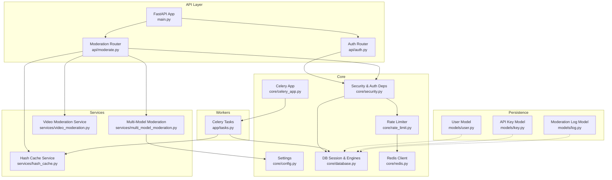
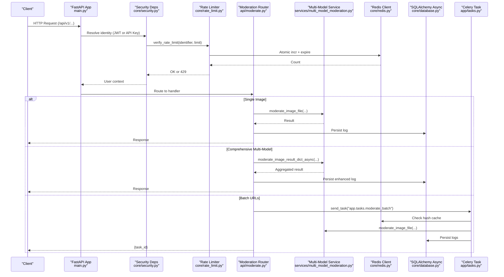
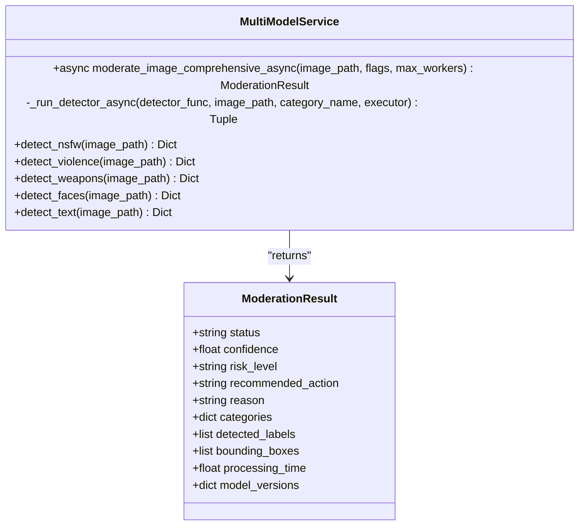
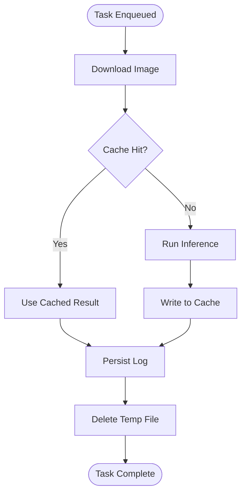
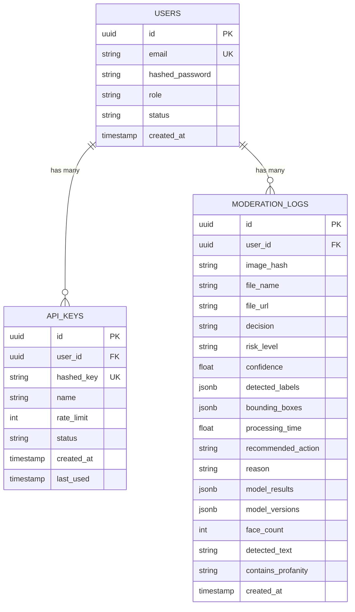
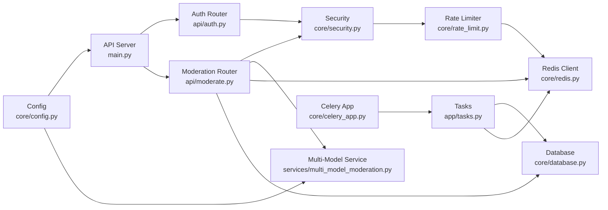

# Component Architecture

<cite>
**Referenced Files in This Document**
- [main.py](file://backend/app/main.py)
- [config.py](file://backend/app/core/config.py)
- [auth.py](file://backend/app/api/auth.py)
- [moderate.py](file://backend/app/api/moderate.py)
- [security.py](file://backend/app/core/security.py)
- [rate_limit.py](file://backend/app/core/rate_limit.py)
- [redis.py](file://backend/app/core/redis.py)
- [database.py](file://backend/app/core/database.py)
- [multi_model_moderation.py](file://backend/app/services/multi_model_moderation.py)
- [tasks.py](file://backend/app/tasks.py)
- [celery_app.py](file://backend/app/core/celery_app.py)
- [user.py](file://backend/app/models/user.py)
- [key.py](file://backend/app/models/key.py)
- [log.py](file://backend/app/models/log.py)
- [docker-compose.yml](file://docker-compose.yml)
</cite>

## Table of Contents
1. Introduction
2. Project Structure
3. Core Components
4. Architecture Overview
5. Detailed Component Analysis
6. Dependency Analysis
7. Performance Considerations
8. Troubleshooting Guide
9. Conclusion

## Introduction
This document describes the OmniShield platform’s component architecture with a focus on service responsibilities and interactions. The system is built around:
- API Server (FastAPI): central orchestration hub for authentication, input validation, routing, rate limiting, and response generation.
- AI Engine (Multi-Model Pipeline): comprehensive content detection across six categories using NudeNet, CLIP, YOLOv8, MTCNN, PaddleOCR, and custom CNNs.
- Background Workers (Celery): asynchronous processing for batch jobs, analytics aggregation, cleanup tasks, and notifications.
- Database (PostgreSQL): persistent storage for users, API keys, moderation logs, and video moderation records with indexing strategies.
- Cache (Redis): image hash caching, rate limiting, session storage, and task queuing.

The design emphasizes high concurrency, fault isolation, and clear data flows between services.

## Project Structure
At a high level, the backend is organized into:
- API layer: FastAPI routers for authentication, moderation, keys, and analytics.
- Core layer: configuration, database, Redis client, security, rate limiting, Celery app.
- Services: AI moderation orchestrator, multi-model pipeline, hashing cache, video moderation.
- Models and repositories: SQLAlchemy models and repository abstractions for persistence.
- Tasks: Celery background job definitions.

**Diagram sources**
- [main.py:1-126](file://backend/app/main.py#L1-L126)
- [auth.py:1-90](file://backend/app/api/auth.py#L1-L90)
- [moderate.py:1-615](file://backend/app/api/moderate.py#L1-L615)
- [config.py:1-148](file://backend/app/core/config.py#L1-L148)
- [database.py:1-50](file://backend/app/core/database.py#L1-L50)
- [security.py:1-177](file://backend/app/core/security.py#L1-L177)
- [rate_limit.py:1-44](file://backend/app/core/rate_limit.py#L1-L44)
- [redis.py:1-21](file://backend/app/core/redis.py#L1-L21)
- [multi_model_moderation.py:1-777](file://backend/app/services/multi_model_moderation.py#L1-L777)
- [tasks.py:1-142](file://backend/app/tasks.py#L1-L142)
- [celery_app.py:1-21](file://backend/app/core/celery_app.py#L1-L21)
- [user.py:1-28](file://backend/app/models/user.py#L1-L28)
- [key.py:1-23](file://backend/app/models/key.py#L1-L23)
- [log.py:1-51](file://backend/app/models/log.py#L1-L51)

**Section sources**
- [main.py:1-126](file://backend/app/main.py#L1-L126)
- [config.py:1-148](file://backend/app/core/config.py#L1-L148)

## Core Components
- API Server (FastAPI): Initializes middleware (CORS, security headers), mounts routers under /api/v1, exposes health and metrics endpoints, and coordinates request lifecycle.
- Authentication and Authorization: Supports JWT Bearer tokens and X-API-Key header authentication; enforces role-based access and per-key rate limits.
- Input Validation and Routing: Validates file types via magic bytes, enforces size limits, routes to single-image, comprehensive multi-model, batch, and video moderation endpoints.
- Rate Limiting: Sliding-window counting in Redis with graceful degradation when Redis is unavailable.
- AI Engine: Orchestrates parallel inference across NSFW (NudeNet), Violence (CLIP), Weapons (YOLOv8), Faces (MTCNN), Text (PaddleOCR + Profanity), and optional custom CNNs.
- Background Workers: Celery workers process batch URL moderation and other async tasks.
- Persistence: PostgreSQL-backed models for users, API keys, moderation logs, and video logs with appropriate indexes.
- Cache: Redis-backed image hash cache and rate limiter.

**Section sources**
- [main.py:1-126](file://backend/app/main.py#L1-L126)
- [auth.py:1-90](file://backend/app/api/auth.py#L1-L90)
- [moderate.py:1-615](file://backend/app/api/moderate.py#L1-L615)
- [security.py:1-177](file://backend/app/core/security.py#L1-L177)
- [rate_limit.py:1-44](file://backend/app/core/rate_limit.py#L1-L44)
- [multi_model_moderation.py:1-777](file://backend/app/services/multi_model_moderation.py#L1-L777)
- [tasks.py:1-142](file://backend/app/tasks.py#L1-L142)
- [database.py:1-50](file://backend/app/core/database.py#L1-L50)
- [redis.py:1-21](file://backend/app/core/redis.py#L1-L21)
- [user.py:1-28](file://backend/app/models/user.py#L1-L28)
- [key.py:1-23](file://backend/app/models/key.py#L1-L23)
- [log.py:1-51](file://backend/app/models/log.py#L1-L51)

## Architecture Overview
The API server acts as the central orchestration hub. It authenticates requests, validates inputs, applies rate limits, and delegates heavy work to either synchronous AI pipelines or asynchronous Celery workers. Results are cached in Redis and persisted to PostgreSQL.

**Diagram sources**
- [main.py:1-126](file://backend/app/main.py#L1-L126)
- [security.py:1-177](file://backend/app/core/security.py#L1-L177)
- [rate_limit.py:1-44](file://backend/app/core/rate_limit.py#L1-L44)
- [moderate.py:1-615](file://backend/app/api/moderate.py#L1-L615)
- [multi_model_moderation.py:1-777](file://backend/app/services/multi_model_moderation.py#L1-L777)
- [tasks.py:1-142](file://backend/app/tasks.py#L1-L142)
- [redis.py:1-21](file://backend/app/core/redis.py#L1-L21)
- [database.py:1-50](file://backend/app/core/database.py#L1-L50)

## Detailed Component Analysis

### API Server (FastAPI)
Responsibilities:
- Application bootstrap, CORS, security headers, versioning, and health checks.
- Router registration under /api/v1 for auth, moderation, keys, and analytics.
- Optional Prometheus metrics endpoint.

Key behaviors:
- Startup/shutdown logging and environment-aware behavior.
- Centralized error responses and structured metadata.

**Section sources**
- [main.py:1-126](file://backend/app/main.py#L1-L126)

### Authentication and Authorization
Responsibilities:
- Support for JWT Bearer tokens and X-API-Key header authentication.
- Role-based access control helper.
- Per-key rate limiting enforcement and last-used timestamp updates.

Flow highlights:
- get_current_client resolves identity from headers.
- get_api_key_user validates key, enforces RPM, and returns owner user.
- get_current_user decodes JWT, fetches user, and checks status.

**Section sources**
- [security.py:1-177](file://backend/app/core/security.py#L1-L177)
- [auth.py:1-90](file://backend/app/api/auth.py#L1-L90)

### Input Validation and Routing
Responsibilities:
- Validate uploads by extension and magic bytes.
- Enforce size limits and sanitize filenames.
- Provide endpoints for single image, comprehensive multi-model, batch URLs, and video moderation.

Processing logic:
- Single image: validate -> cache check -> NudeNet -> cache -> persist -> respond.
- Comprehensive: validate -> run all detectors concurrently -> aggregate -> persist enhanced fields -> respond.
- Batch: queue Celery task -> return task ID -> polling endpoint.
- Video: save upload -> create pending log -> background processing -> poll status.

**Section sources**
- [moderate.py:1-615](file://backend/app/api/moderate.py#L1-L615)

### Rate Limiting
Responsibilities:
- Windowed counting per minute using Redis.
- Graceful degradation if Redis is down.

Behavior:
- Increment atomic counter and set TTL within a pipeline.
- Return 429 with retry-after guidance when exceeded.

**Section sources**
- [rate_limit.py:1-44](file://backend/app/core/rate_limit.py#L1-L44)
- [redis.py:1-21](file://backend/app/core/redis.py#L1-L21)

### AI Engine (Multi-Model Pipeline)
Responsibilities:
- Orchestrate six detection categories: NSFW (NudeNet), Violence (CLIP), Weapons (YOLOv8), Faces (MTCNN), Text (PaddleOCR + Profanity), and optional custom CNNs.
- Lazy-load models and execute in parallel using asyncio.gather with ThreadPoolExecutor.
- Aggregate results into a unified verdict with risk levels and recommended actions.

Key implementation patterns:
- Lazy model loaders for each detector.
- Synchronous detector functions wrapped for async execution.
- Professional portrait override to reduce false positives.
- Robust error handling per category with fallbacks.

**Diagram sources**
- [multi_model_moderation.py:1-777](file://backend/app/services/multi_model_moderation.py#L1-L777)

**Section sources**
- [multi_model_moderation.py:1-777](file://backend/app/services/multi_model_moderation.py#L1-L777)

### Background Workers (Celery)
Responsibilities:
- Process batch URL moderation asynchronously.
- Download images, check cache, run inference, persist logs, and clean up temp files.

Integration points:
- Broker and result backend configured via settings.
- Uses sync DB session for worker processes.

**Diagram sources**
- [tasks.py:1-142](file://backend/app/tasks.py#L1-L142)
- [celery_app.py:1-21](file://backend/app/core/celery_app.py#L1-L21)

**Section sources**
- [tasks.py:1-142](file://backend/app/tasks.py#L1-L142)
- [celery_app.py:1-21](file://backend/app/core/celery_app.py#L1-L21)

### Database (PostgreSQL) Layer
Responsibilities:
- Store users, API keys, moderation logs, and video moderation logs.
- Provide both sync and async engines for different use cases.
- Index frequently queried columns to optimize performance.

Key tables and indexes:
- users: id (UUID PK), email (unique, indexed), hashed_password, role, status, created_at.
- api_keys: id (UUID PK), user_id (FK), hashed_key (unique, indexed), name, rate_limit, status, created_at, last_used.
- moderation_logs: id (UUID PK), user_id (indexed), image_hash (indexed), decision, risk_level, confidence, JSON labels/boxes, processing_time, recommended_action, reason, plus enhanced fields (model_results, model_versions, face_count, detected_text, contains_profanity), created_at (indexed).

**Diagram sources**
- [user.py:1-28](file://backend/app/models/user.py#L1-L28)
- [key.py:1-23](file://backend/app/models/key.py#L1-L23)
- [log.py:1-51](file://backend/app/models/log.py#L1-L51)

**Section sources**
- [database.py:1-50](file://backend/app/core/database.py#L1-L50)
- [user.py:1-28](file://backend/app/models/user.py#L1-L28)
- [key.py:1-23](file://backend/app/models/key.py#L1-L23)
- [log.py:1-51](file://backend/app/models/log.py#L1-L51)

### Cache (Redis) Implementation
Responsibilities:
- Image hash caching for repeated uploads.
- Rate limiting counters with TTL.
- Shared connection pool with short timeouts and graceful degradation.

Usage patterns:
- Hash-based keys for uploaded files.
- Atomic increments with expiration for per-minute windows.
- Fallback behavior when Redis is unavailable.

**Section sources**
- [redis.py:1-21](file://backend/app/core/redis.py#L1-L21)
- [rate_limit.py:1-44](file://backend/app/core/rate_limit.py#L1-L44)
- [moderate.py:1-615](file://backend/app/api/moderate.py#L1-L615)
- [tasks.py:1-142](file://backend/app/tasks.py#L1-L142)

## Dependency Analysis
Component coupling and external dependencies:
- API depends on Security, Rate Limiter, Moderation Router, and Services.
- Security depends on Database, Rate Limiter, and Models.
- Moderation Router depends on AI Service, Cache, and Database.
- AI Service depends on Configuration and ML libraries (lazy-loaded).
- Celery Workers depend on Redis broker/backend and Database.

**Diagram sources**
- [main.py:1-126](file://backend/app/main.py#L1-L126)
- [auth.py:1-90](file://backend/app/api/auth.py#L1-L90)
- [moderate.py:1-615](file://backend/app/api/moderate.py#L1-L615)
- [security.py:1-177](file://backend/app/core/security.py#L1-L177)
- [rate_limit.py:1-44](file://backend/app/core/rate_limit.py#L1-L44)
- [redis.py:1-21](file://backend/app/core/redis.py#L1-L21)
- [database.py:1-50](file://backend/app/core/database.py#L1-L50)
- [multi_model_moderation.py:1-777](file://backend/app/services/multi_model_moderation.py#L1-L777)
- [celery_app.py:1-21](file://backend/app/core/celery_app.py#L1-L21)
- [tasks.py:1-142](file://backend/app/tasks.py#L1-L142)
- [config.py:1-148](file://backend/app/core/config.py#L1-L148)

**Section sources**
- [docker-compose.yml:1-108](file://docker-compose.yml#L1-L108)

## Performance Considerations
- Concurrency: Multi-model moderation uses asyncio.gather with ThreadPoolExecutor to parallelize CPU/GPU-bound inference. Tune max_workers based on available cores/GPU memory.
- Caching: Image hash cache reduces redundant inference. Ensure TTL aligns with expected reuse patterns.
- Database: Leverage indexes on user_id, image_hash, and created_at for query efficiency. Consider partitioning logs over time if volumes grow large.
- Rate Limiting: Redis windowed counters provide low-latency throttling. Graceful degradation prevents blocking when Redis is down.
- I/O: Streaming uploads and temporary file cleanup minimize disk pressure. Consider moving to object storage for production scale.
- Observability: Health and metrics endpoints enable monitoring and alerting.

[No sources needed since this section provides general guidance]

## Troubleshooting Guide
Common issues and strategies:
- Authentication failures: Verify JWT secret and token format; ensure user status is active; confirm API key is valid and not revoked.
- Rate limit errors: Check Redis connectivity and counters; inspect retry-after values; consider increasing limits for admin roles.
- AI model loading failures: Inspect lazy-loader logs; ensure GPU availability and drivers; disable problematic detectors via configuration flags.
- Batch task failures: Review worker logs for download/inference errors; confirm Redis broker/backend connectivity; validate URLs and permissions.
- Database connectivity: Confirm DATABASE_URL and async driver configuration; check migrations and schema alignment.

**Section sources**
- [security.py:1-177](file://backend/app/core/security.py#L1-L177)
- [rate_limit.py:1-44](file://backend/app/core/rate_limit.py#L1-L44)
- [multi_model_moderation.py:1-777](file://backend/app/services/multi_model_moderation.py#L1-L777)
- [tasks.py:1-142](file://backend/app/tasks.py#L1-L142)
- [database.py:1-50](file://backend/app/core/database.py#L1-L50)

## Conclusion
OmniShield’s architecture separates concerns cleanly: the API server orchestrates requests, the AI engine performs robust multi-model detection, Celery workers handle long-running tasks, and Redis/PostgreSQL provide fast caching and durable storage. With careful tuning of concurrency, caching, and indexing, the system scales effectively while maintaining resilience through graceful degradation and failure isolation.

[No sources needed since this section summarizes without analyzing specific files]