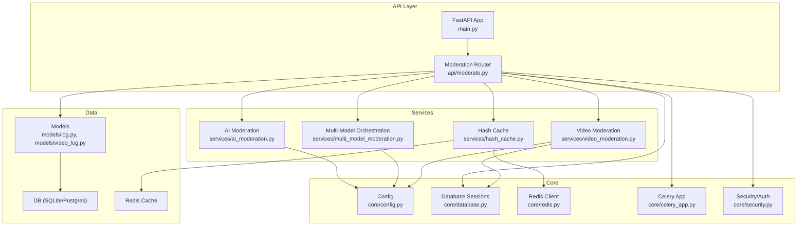
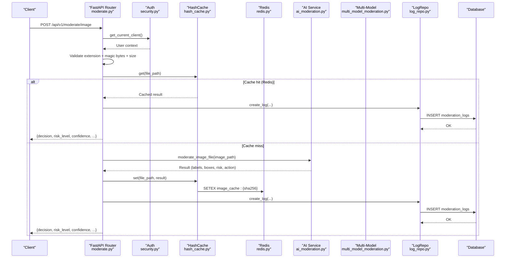
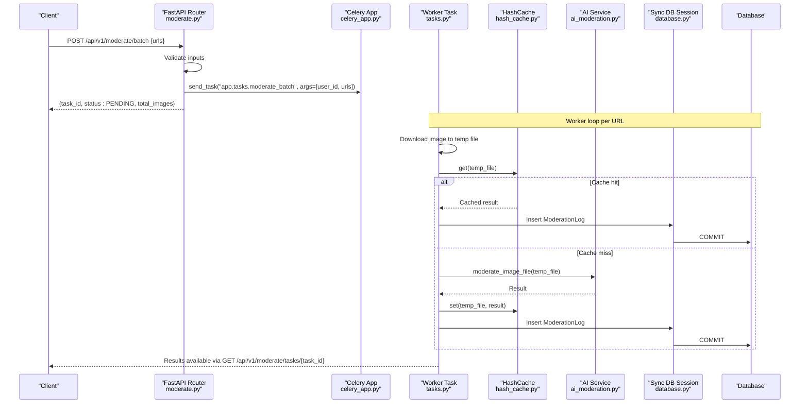
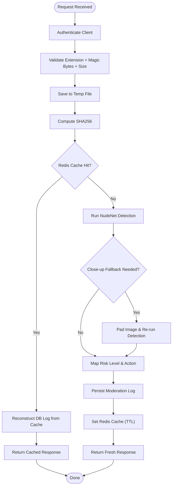
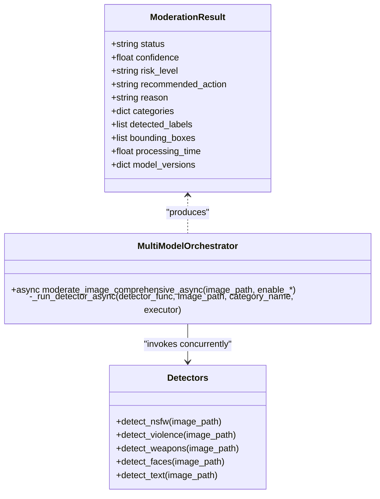
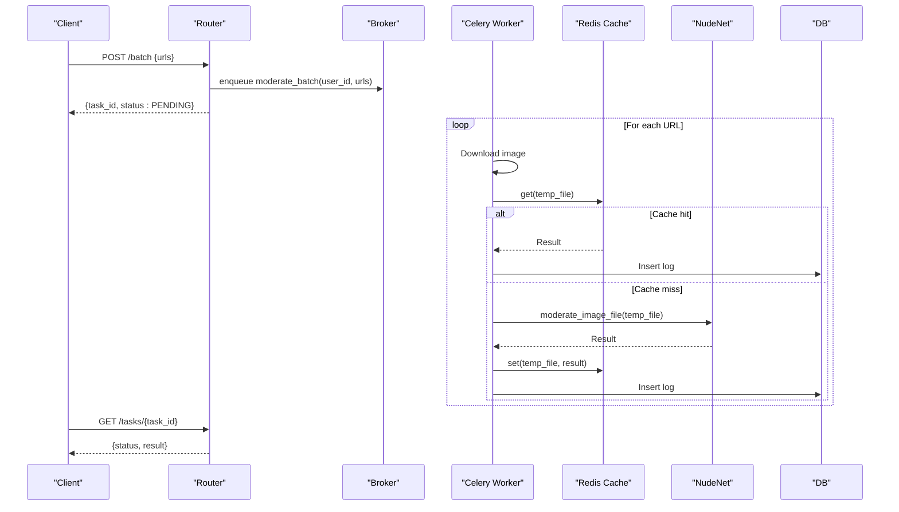
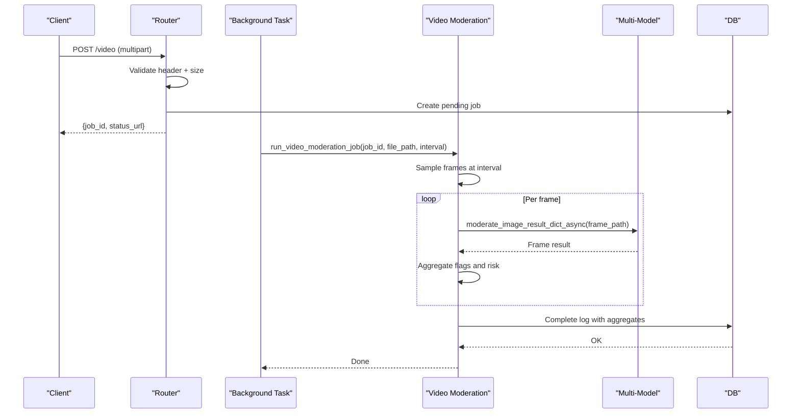
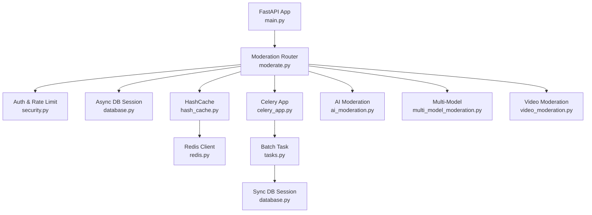

# Data Flow Patterns

<cite>
**Referenced Files in This Document**
- [main.py](file://backend/app/main.py)
- [moderate.py](file://backend/app/api/moderate.py)
- [ai_moderation.py](file://backend/app/services/ai_moderation.py)
- [multi_model_moderation.py](file://backend/app/services/multi_model_moderation.py)
- [hash_cache.py](file://backend/app/services/hash_cache.py)
- [redis.py](file://backend/app/core/redis.py)
- [database.py](file://backend/app/core/database.py)
- [config.py](file://backend/app/core/config.py)
- [tasks.py](file://backend/app/tasks.py)
- [celery_app.py](file://backend/app/core/celery_app.py)
- [log.py](file://backend/app/models/log.py)
- [video_log.py](file://backend/app/models/video_log.py)
- [security.py](file://backend/app/core/security.py)
- [moderate.py (schemas)](file://backend/app/schemas/moderate.py)
- [video_moderation.py](file://backend/app/services/video_moderation.py)
</cite>

## Table of Contents
1. [Introduction](#introduction)
2. [Project Structure](#project-structure)
3. [Core Components](#core-components)
4. [Architecture Overview](#architecture-overview)
5. [Detailed Component Analysis](#detailed-component-analysis)
6. [Dependency Analysis](#dependency-analysis)
7. [Performance Considerations](#performance-considerations)
8. [Troubleshooting Guide](#troubleshooting-guide)
9. [Conclusion](#conclusion)

## Introduction
This document explains the data flow patterns of the OmniShield platform, focusing on request processing workflows and data transformation pipelines for image moderation. It covers:
- Single image moderation from upload through authentication, MIME validation, SHA256 hashing, Redis cache lookup, parallel AI model execution, ensemble aggregation, cache persistence, and database logging.
- Batch processing with task enqueuing, worker assignment, distributed downloading, parallel inference, result collection, and status tracking.
- Sequence diagrams illustrating end-to-end lifecycles, timing considerations, error handling, and retry strategies.
- Data transformation patterns including preprocessing, input formatting, normalization, risk scoring, and decision logic.
- Performance optimizations such as lazy loading, connection pooling, caching strategies, and concurrency.
- Debugging approaches to trace requests and identify bottlenecks.

## Project Structure
The backend is a FastAPI application organized by feature layers:
- API layer: routers for moderation endpoints
- Services: AI moderation, multi-model orchestration, video moderation, hash-based caching
- Core: configuration, database sessions, Redis client, Celery app, security
- Models and repositories: SQLAlchemy models and async DB operations
- Tasks: Celery background tasks for batch processing

**Diagram sources**
- [main.py:1-126](file://backend/app/main.py#L1-L126)
- [moderate.py:1-615](file://backend/app/api/moderate.py#L1-L615)
- [ai_moderation.py:1-275](file://backend/app/services/ai_moderation.py#L1-L275)
- [multi_model_moderation.py:1-777](file://backend/app/services/multi_model_moderation.py#L1-L777)
- [video_moderation.py:1-254](file://backend/app/services/video_moderation.py#L1-L254)
- [hash_cache.py:1-59](file://backend/app/services/hash_cache.py#L1-L59)
- [config.py:1-148](file://backend/app/core/config.py#L1-L148)
- [database.py:1-50](file://backend/app/core/database.py#L1-L50)
- [redis.py:1-21](file://backend/app/core/redis.py#L1-L21)
- [celery_app.py:1-21](file://backend/app/core/celery_app.py#L1-L21)
- [security.py:1-177](file://backend/app/core/security.py#L1-L177)
- [log.py:1-51](file://backend/app/models/log.py#L1-L51)
- [video_log.py:1-66](file://backend/app/models/video_log.py#L1-L66)

**Section sources**
- [main.py:1-126](file://backend/app/main.py#L1-L126)
- [config.py:1-148](file://backend/app/core/config.py#L1-L148)

## Core Components
- Authentication and authorization:
  - Resolves client identity via X-API-Key or Authorization Bearer JWT, enforces rate limits, and returns current user context.
- Moderation router:
  - Validates uploads (extension + magic bytes), size limits, computes SHA256, checks Redis cache, runs single or comprehensive moderation, persists logs, and returns structured responses.
- AI moderation service:
  - Lazy-loads NudeNet, applies close-up padding fallbacks, thresholds, and maps detections to enterprise risk levels and recommended actions.
- Multi-model orchestration:
  - Parallel execution of NSFW (NudeNet), violence (CLIP), weapons (YOLOv8), faces (MTCNN), text (PaddleOCR + profanity). Aggregates results into unified verdicts with risk scoring and model versioning.
- Hash cache:
  - Computes file SHA256, reads/writes JSON results to Redis with TTL, and marks cached responses.
- Database and models:
  - Async session management; ModerationLog and VideoModerationLog schemas store decisions, labels, bounding boxes, and enhanced fields.
- Background tasks:
  - Celery task for batch URL moderation: downloads images, checks cache, runs inference, caches, and persists logs.

**Section sources**
- [security.py:1-177](file://backend/app/core/security.py#L1-L177)
- [moderate.py:1-615](file://backend/app/api/moderate.py#L1-L615)
- [ai_moderation.py:1-275](file://backend/app/services/ai_moderation.py#L1-L275)
- [multi_model_moderation.py:1-777](file://backend/app/services/multi_model_moderation.py#L1-L777)
- [hash_cache.py:1-59](file://backend/app/services/hash_cache.py#L1-L59)
- [database.py:1-50](file://backend/app/core/database.py#L1-L50)
- [log.py:1-51](file://backend/app/models/log.py#L1-L51)
- [video_log.py:1-66](file://backend/app/models/video_log.py#L1-L66)
- [tasks.py:1-142](file://backend/app/tasks.py#L1-L142)
- [celery_app.py:1-21](file://backend/app/core/celery_app.py#L1-L21)

## Architecture Overview
End-to-end flows for single image moderation and batch processing are illustrated below.

**Diagram sources**
- [moderate.py:223-378](file://backend/app/api/moderate.py#L223-L378)
- [security.py:153-177](file://backend/app/core/security.py#L153-L177)
- [hash_cache.py:21-56](file://backend/app/services/hash_cache.py#L21-L56)
- [redis.py:1-21](file://backend/app/core/redis.py#L1-L21)
- [ai_moderation.py:148-275](file://backend/app/services/ai_moderation.py#L148-L275)
- [log_repo.py:12-60](file://backend/app/repositories/log_repo.py#L12-L60)
- [log.py:13-51](file://backend/app/models/log.py#L13-L51)

**Diagram sources**
- [moderate.py:380-443](file://backend/app/api/moderate.py#L380-L443)
- [celery_app.py:1-21](file://backend/app/core/celery_app.py#L1-L21)
- [tasks.py:14-142](file://backend/app/tasks.py#L14-L142)
- [hash_cache.py:21-56](file://backend/app/services/hash_cache.py#L21-L56)
- [ai_moderation.py:148-275](file://backend/app/services/ai_moderation.py#L148-L275)
- [database.py:43-50](file://backend/app/core/database.py#L43-L50)
- [log.py:13-51](file://backend/app/models/log.py#L13-L51)

## Detailed Component Analysis

### Single Image Moderation Flow
- Authentication:
  - Resolves client via X-API-Key or JWT; enforces rate limiting and returns user context.
- Input validation:
  - Extension check against allowed list; magic byte validation for JPEG/PNG/WebP; size limit enforcement.
- Caching:
  - Compute SHA256 of uploaded file; query Redis cache; if present, reconstruct DB log and return immediately.
- Inference:
  - Run NudeNet detection with lazy initialization; apply close-up padding and heuristic fallbacks; map to risk level and recommended action.
- Persistence:
  - Persist moderation log with labels, bounding boxes, processing time, and metadata.
- Response:
  - Return structured response including decision, risk level, confidence, labels, boxes, and cached flag.

**Diagram sources**
- [moderate.py:223-378](file://backend/app/api/moderate.py#L223-L378)
- [ai_moderation.py:148-275](file://backend/app/services/ai_moderation.py#L148-L275)
- [hash_cache.py:21-56](file://backend/app/services/hash_cache.py#L21-L56)
- [redis.py:1-21](file://backend/app/core/redis.py#L1-L21)
- [log_repo.py:12-60](file://backend/app/repositories/log_repo.py#L12-L60)

**Section sources**
- [security.py:153-177](file://backend/app/core/security.py#L153-L177)
- [moderate.py:223-378](file://backend/app/api/moderate.py#L223-L378)
- [ai_moderation.py:148-275](file://backend/app/services/ai_moderation.py#L148-L275)
- [hash_cache.py:21-56](file://backend/app/services/hash_cache.py#L21-L56)
- [redis.py:1-21](file://backend/app/core/redis.py#L1-L21)
- [log_repo.py:12-60](file://backend/app/repositories/log_repo.py#L12-L60)

### Comprehensive Multi-Model Moderation Flow
- Entry point:
  - Endpoint accepts enable flags for each model category.
- Preprocessing:
  - Same validation and temporary storage as single image flow.
- Parallel execution:
  - Launch detectors concurrently using asyncio.gather with ThreadPoolExecutor:
    - NSFW (NudeNet)
    - Violence (CLIP zero-shot)
    - Weapons (YOLOv8)
    - Faces (MTCNN)
    - Text (PaddleOCR + Profanity)
- Aggregation:
  - Collect labels and bounding boxes; compute aggregate confidence and risk score; apply professional portrait override when appropriate.
- Decision logic:
  - Map aggregate risk score to risk level and recommended action; build reason string.
- Persistence:
  - Store detailed categories and model versions in enhanced fields.

**Diagram sources**
- [multi_model_moderation.py:28-41](file://backend/app/services/multi_model_moderation.py#L28-L41)
- [multi_model_moderation.py:491-732](file://backend/app/services/multi_model_moderation.py#L491-L732)
- [multi_model_moderation.py:179-486](file://backend/app/services/multi_model_moderation.py#L179-L486)

**Section sources**
- [moderate.py:446-615](file://backend/app/api/moderate.py#L446-L615)
- [multi_model_moderation.py:532-732](file://backend/app/services/multi_model_moderation.py#L532-L732)
- [multi_model_moderation.py:179-486](file://backend/app/services/multi_model_moderation.py#L179-L486)

### Batch Processing Flow
- Enqueue:
  - POST /api/v1/moderate/batch validates URLs and sends Celery task with user ID and list of URLs.
- Worker:
  - For each URL: download to temp file, check cache, run inference on miss, persist log, clean up temp file.
- Status polling:
  - GET /api/v1/moderate/tasks/{task_id} queries Celery AsyncResult for status and results.

**Diagram sources**
- [moderate.py:380-443](file://backend/app/api/moderate.py#L380-L443)
- [tasks.py:14-142](file://backend/app/tasks.py#L14-L142)
- [hash_cache.py:21-56](file://backend/app/services/hash_cache.py#L21-L56)
- [ai_moderation.py:148-275](file://backend/app/services/ai_moderation.py#L148-L275)
- [log.py:13-51](file://backend/app/models/log.py#L13-L51)

**Section sources**
- [moderate.py:380-443](file://backend/app/api/moderate.py#L380-L443)
- [tasks.py:14-142](file://backend/app/tasks.py#L14-L142)
- [celery_app.py:1-21](file://backend/app/core/celery_app.py#L1-L21)

### Video Moderation Pipeline
- Upload and queue:
  - POST /api/v1/moderate/video validates video headers, saves temporarily, creates pending job record, and schedules background processing.
- Frame sampling:
  - Extract one frame per second (configurable interval), convert BGR to RGB, write to transient temp directory.
- Concurrent moderation:
  - Run comprehensive multi-model moderation per frame concurrently; aggregate flags and overall risk.
- Persistence:
  - Update video log with aggregated status, risk, confidence, action, reason, frames sampled/flagged, and processing time.

**Diagram sources**
- [moderate.py:85-189](file://backend/app/api/moderate.py#L85-L189)
- [video_moderation.py:238-254](file://backend/app/services/video_moderation.py#L238-L254)
- [video_moderation.py:89-236](file://backend/app/services/video_moderation.py#L89-L236)
- [multi_model_moderation.py:532-732](file://backend/app/services/multi_model_moderation.py#L532-L732)
- [video_log.py:11-66](file://backend/app/models/video_log.py#L11-L66)

**Section sources**
- [moderate.py:85-189](file://backend/app/api/moderate.py#L85-L189)
- [video_moderation.py:89-236](file://backend/app/services/video_moderation.py#L89-L236)
- [video_log.py:11-66](file://backend/app/models/video_log.py#L11-L66)

## Dependency Analysis
Key runtime dependencies and integration points:
- FastAPI app registers routers under /api/v1 prefix and mounts optional Prometheus metrics endpoint.
- Security middleware adds production-grade headers and API versioning.
- Database engines provide both sync and async sessions; async used in routes, sync in workers/scripts.
- Redis client initializes with short connect timeout and graceful degradation if unavailable.
- Celery app configured with broker and result backend pointing to Redis.

**Diagram sources**
- [main.py:1-126](file://backend/app/main.py#L1-L126)
- [moderate.py:1-615](file://backend/app/api/moderate.py#L1-L615)
- [security.py:1-177](file://backend/app/core/security.py#L1-L177)
- [database.py:1-50](file://backend/app/core/database.py#L1-L50)
- [redis.py:1-21](file://backend/app/core/redis.py#L1-L21)
- [celery_app.py:1-21](file://backend/app/core/celery_app.py#L1-L21)
- [tasks.py:1-142](file://backend/app/tasks.py#L1-L142)
- [ai_moderation.py:1-275](file://backend/app/services/ai_moderation.py#L1-L275)
- [multi_model_moderation.py:1-777](file://backend/app/services/multi_model_moderation.py#L1-L777)
- [video_moderation.py:1-254](file://backend/app/services/video_moderation.py#L1-L254)

**Section sources**
- [main.py:1-126](file://backend/app/main.py#L1-L126)
- [database.py:1-50](file://backend/app/core/database.py#L1-L50)
- [redis.py:1-21](file://backend/app/core/redis.py#L1-L21)
- [celery_app.py:1-21](file://backend/app/core/celery_app.py#L1-L21)

## Performance Considerations
- Lazy loading:
  - NudeNet detector and multi-model components are initialized on first use to reduce startup latency and memory footprint.
- Concurrency:
  - Multi-model moderation uses asyncio.gather with ThreadPoolExecutor to run CPU/GPU-bound inference concurrently.
- Caching strategy:
  - SHA256-based Redis cache avoids redundant inference for identical files; TTL configurable via settings.
- Connection pooling:
  - Async and sync SQLAlchemy engines configured with pool_pre_ping for robustness.
- Graceful degradation:
  - Redis availability checked at startup; cache operations degrade gracefully if Redis is down.
- Compression and headers:
  - Production security headers added; compression can be enabled via reverse proxy or middleware depending on deployment.
- GPU utilization:
  - Optional GPU device selection and CUDA-aware model loaders where applicable.

[No sources needed since this section provides general guidance]

## Troubleshooting Guide
- Request tracing:
  - Use structured logging throughout the pipeline (router, services, cache, DB) to correlate request IDs and timings.
- Common errors:
  - Invalid file signature or unsupported extension: ensure magic byte validation passes and extensions match allowed lists.
  - Cache failures: verify Redis connectivity and TTL behavior; inspect cache key construction based on SHA256.
  - Model initialization failures: check lazy loader warnings and fallbacks; confirm dependencies (transformers, ultralytics, facenet_pytorch, paddleocr).
  - Batch worker issues: validate network access for remote URLs and temp file cleanup; monitor Celery broker/backend connectivity.
- Bottleneck identification:
  - Measure processing_time fields in responses and logs; compare single vs comprehensive moderation durations.
  - Monitor Redis hit rates and DB commit times; consider increasing max_workers for multi-model tasks if CPU-bound.
- Retry mechanisms:
  - Implement client-side retries for HTTP calls and Celery task retries for transient failures (network, model load).
  - Add exponential backoff for Redis and DB operations where appropriate.

**Section sources**
- [moderate.py:1-615](file://backend/app/api/moderate.py#L1-L615)
- [ai_moderation.py:1-275](file://backend/app/services/ai_moderation.py#L1-L275)
- [multi_model_moderation.py:1-777](file://backend/app/services/multi_model_moderation.py#L1-L777)
- [hash_cache.py:1-59](file://backend/app/services/hash_cache.py#L1-L59)
- [tasks.py:1-142](file://backend/app/tasks.py#L1-L142)

## Conclusion
OmniShield’s data flow patterns emphasize secure ingestion, robust validation, intelligent caching, and high-throughput parallel inference across multiple AI models. The architecture supports both real-time single-image moderation and scalable batch processing via Celery. Enhanced fields capture rich model outputs for analytics and auditing. With lazy loading, connection pooling, and Redis-backed caching, the system balances performance and reliability while providing clear pathways for debugging and optimization.