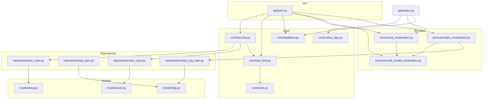
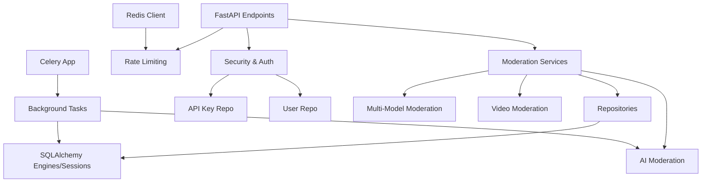
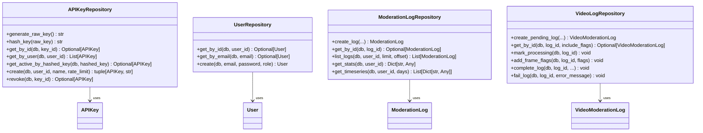
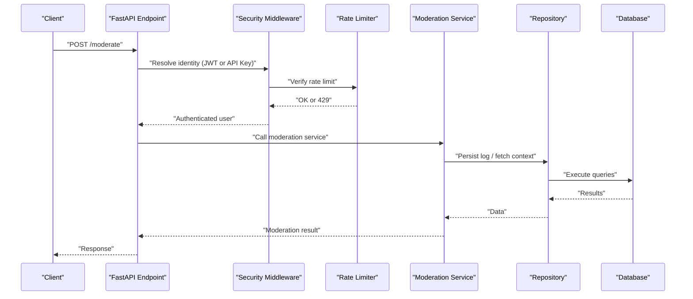
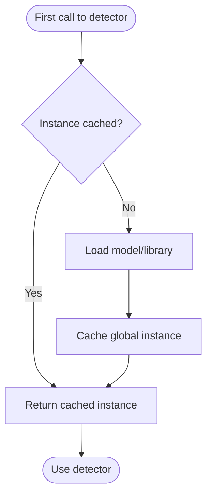
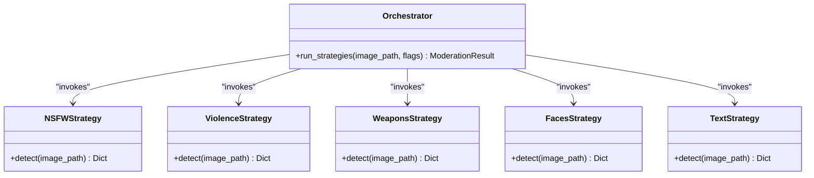
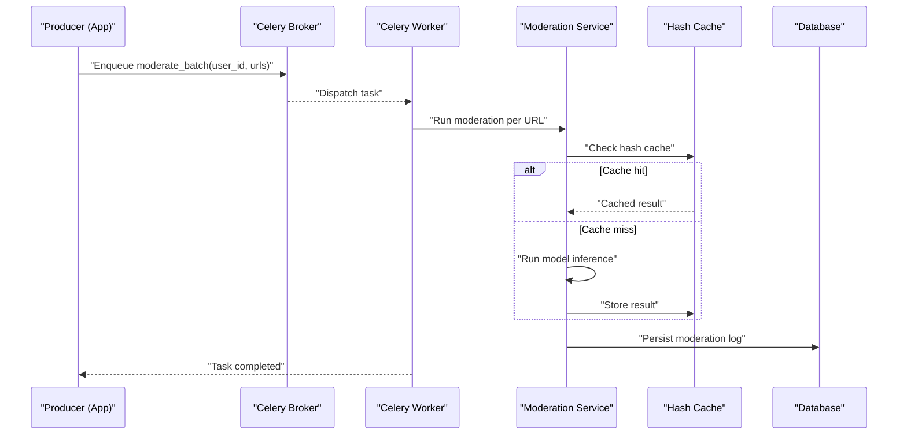
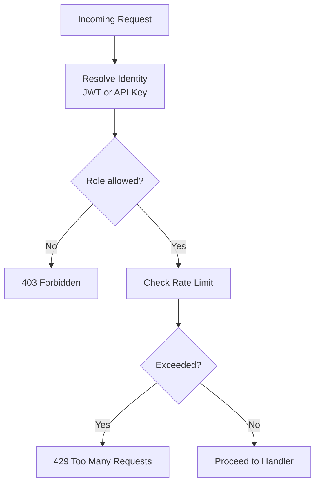
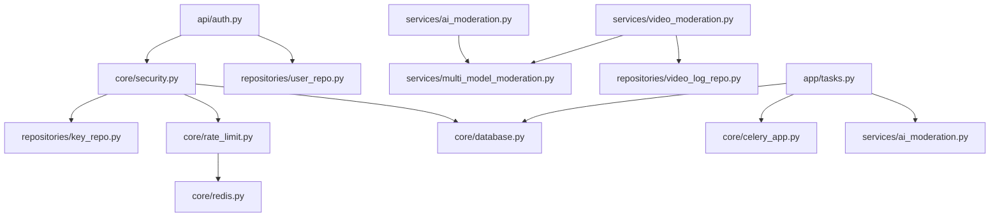

# Design Patterns

<cite>
**Referenced Files in This Document**
- [key_repo.py](file://backend/app/repositories/key_repo.py)
- [log_repo.py](file://backend/app/repositories/log_repo.py)
- [user_repo.py](file://backend/app/repositories/user_repo.py)
- [video_log_repo.py](file://backend/app/repositories/video_log_repo.py)
- [ai_moderation.py](file://backend/app/services/ai_moderation.py)
- [multi_model_moderation.py](file://backend/app/services/multi_model_moderation.py)
- [video_moderation.py](file://backend/app/services/video_moderation.py)
- [database.py](file://backend/app/core/database.py)
- [redis.py](file://backend/app/core/redis.py)
- [celery_app.py](file://backend/app/core/celery_app.py)
- [tasks.py](file://backend/app/tasks.py)
- [security.py](file://backend/app/core/security.py)
- [rate_limit.py](file://backend/app/core/rate_limit.py)
- [auth.py](file://backend/app/api/auth.py)
- [user.py](file://backend/app/models/user.py)
- [key.py](file://backend/app/models/key.py)
- [log.py](file://backend/app/models/log.py)
</cite>

## Table of Contents
1. [Introduction](#introduction)
2. [Project Structure](#project-structure)
3. [Core Components](#core-components)
4. [Architecture Overview](#architecture-overview)
5. [Detailed Component Analysis](#detailed-component-analysis)
6. [Dependency Analysis](#dependency-analysis)
7. [Performance Considerations](#performance-considerations)
8. [Troubleshooting Guide](#troubleshooting-guide)
9. [Conclusion](#conclusion)

## Introduction
This document explains the architectural design patterns used across the OmniShield platform’s backend to achieve clean separation, scalability, and testability. It focuses on:
- Repository Pattern for data access abstraction
- Service Layer Pattern for business logic encapsulation
- Factory Pattern for lazy model loading
- Strategy Pattern for pluggable AI detection strategies
- Observer Pattern via Celery for background job processing
- Singleton Pattern for shared resources (database connections, cache)
- Decorator Pattern for middleware-like functionality (authentication, rate limiting, logging)

The goal is to show how these patterns work together to create a maintainable and extensible moderation system.

## Project Structure
At a high level, the backend organizes code by layers:
- API layer: FastAPI routers and request/response handling
- Core layer: Shared infrastructure (database, Redis, Celery app, security, rate limiting)
- Services layer: Business logic and orchestration for moderation workflows
- Repositories layer: Data access abstractions over SQLAlchemy models
- Models layer: SQLAlchemy ORM entities

**Diagram sources**
- [auth.py:1-90](file://backend/app/api/auth.py#L1-L90)
- [database.py:1-50](file://backend/app/core/database.py#L1-L50)
- [redis.py:1-21](file://backend/app/core/redis.py#L1-L21)
- [celery_app.py:1-21](file://backend/app/core/celery_app.py#L1-L21)
- [security.py:1-177](file://backend/app/core/security.py#L1-L177)
- [rate_limit.py:1-44](file://backend/app/core/rate_limit.py#L1-L44)
- [ai_moderation.py:1-275](file://backend/app/services/ai_moderation.py#L1-L275)
- [multi_model_moderation.py:1-777](file://backend/app/services/multi_model_moderation.py#L1-L777)
- [video_moderation.py:1-254](file://backend/app/services/video_moderation.py#L1-L254)
- [key_repo.py:1-79](file://backend/app/repositories/key_repo.py#L1-L79)
- [log_repo.py:1-232](file://backend/app/repositories/log_repo.py#L1-L232)
- [user_repo.py:1-40](file://backend/app/repositories/user_repo.py#L1-L40)
- [video_log_repo.py:1-115](file://backend/app/repositories/video_log_repo.py#L1-L115)
- [user.py:1-28](file://backend/app/models/user.py#L1-L28)
- [key.py:1-23](file://backend/app/models/key.py#L1-L23)
- [log.py:1-51](file://backend/app/models/log.py#L1-L51)
- [tasks.py:1-142](file://backend/app/tasks.py#L1-L142)

**Section sources**
- [auth.py:1-90](file://backend/app/api/auth.py#L1-L90)
- [database.py:1-50](file://backend/app/core/database.py#L1-L50)
- [redis.py:1-21](file://backend/app/core/redis.py#L1-L21)
- [celery_app.py:1-21](file://backend/app/core/celery_app.py#L1-L21)
- [security.py:1-177](file://backend/app/core/security.py#L1-L177)
- [rate_limit.py:1-44](file://backend/app/core/rate_limit.py#L1-L44)
- [ai_moderation.py:1-275](file://backend/app/services/ai_moderation.py#L1-L275)
- [multi_model_moderation.py:1-777](file://backend/app/services/multi_model_moderation.py#L1-L777)
- [video_moderation.py:1-254](file://backend/app/services/video_moderation.py#L1-L254)
- [key_repo.py:1-79](file://backend/app/repositories/key_repo.py#L1-L79)
- [log_repo.py:1-232](file://backend/app/repositories/log_repo.py#L1-L232)
- [user_repo.py:1-40](file://backend/app/repositories/user_repo.py#L1-L40)
- [video_log_repo.py:1-115](file://backend/app/repositories/video_log_repo.py#L1-L115)
- [user.py:1-28](file://backend/app/models/user.py#L1-L28)
- [key.py:1-23](file://backend/app/models/key.py#L1-L23)
- [log.py:1-51](file://backend/app/models/log.py#L1-L51)
- [tasks.py:1-142](file://backend/app/tasks.py#L1-L142)

## Core Components
- Repository classes provide a consistent interface for database operations, isolating persistence details from business logic.
- Service modules implement moderation workflows, orchestrating multiple AI detectors and aggregating results.
- Core utilities manage shared resources like database sessions, Redis client, and Celery configuration.
- Security and rate limiting are implemented as reusable dependencies that can be composed into endpoints.

Key responsibilities:
- Repositories: CRUD and query helpers for users, keys, logs, and video logs
- Services: Image and video moderation pipelines with parallel execution and fallbacks
- Core: Database session management, caching, task queue setup, authentication, and throttling
- Tasks: Background batch moderation using Celery

**Section sources**
- [key_repo.py:1-79](file://backend/app/repositories/key_repo.py#L1-L79)
- [log_repo.py:1-232](file://backend/app/repositories/log_repo.py#L1-L232)
- [user_repo.py:1-40](file://backend/app/repositories/user_repo.py#L1-L40)
- [video_log_repo.py:1-115](file://backend/app/repositories/video_log_repo.py#L1-L115)
- [ai_moderation.py:1-275](file://backend/app/services/ai_moderation.py#L1-L275)
- [multi_model_moderation.py:1-777](file://backend/app/services/multi_model_moderation.py#L1-L777)
- [video_moderation.py:1-254](file://backend/app/services/video_moderation.py#L1-L254)
- [database.py:1-50](file://backend/app/core/database.py#L1-L50)
- [redis.py:1-21](file://backend/app/core/redis.py#L1-L21)
- [celery_app.py:1-21](file://backend/app/core/celery_app.py#L1-L21)
- [security.py:1-177](file://backend/app/core/security.py#L1-L177)
- [rate_limit.py:1-44](file://backend/app/core/rate_limit.py#L1-L44)
- [tasks.py:1-142](file://backend/app/tasks.py#L1-L142)

## Architecture Overview
The system follows a layered architecture with clear boundaries:
- API endpoints depend on services and core utilities
- Services depend on repositories and external AI libraries
- Repositories depend on SQLAlchemy models and async/sync engines
- Core provides singletons and shared configuration

**Diagram sources**
- [auth.py:1-90](file://backend/app/api/auth.py#L1-L90)
- [security.py:1-177](file://backend/app/core/security.py#L1-L177)
- [rate_limit.py:1-44](file://backend/app/core/rate_limit.py#L1-L44)
- [ai_moderation.py:1-275](file://backend/app/services/ai_moderation.py#L1-L275)
- [multi_model_moderation.py:1-777](file://backend/app/services/multi_model_moderation.py#L1-L777)
- [video_moderation.py:1-254](file://backend/app/services/video_moderation.py#L1-L254)
- [key_repo.py:1-79](file://backend/app/repositories/key_repo.py#L1-L79)
- [user_repo.py:1-40](file://backend/app/repositories/user_repo.py#L1-L40)
- [database.py:1-50](file://backend/app/core/database.py#L1-L50)
- [redis.py:1-21](file://backend/app/core/redis.py#L1-L21)
- [celery_app.py:1-21](file://backend/app/core/celery_app.py#L1-L21)
- [tasks.py:1-142](file://backend/app/tasks.py#L1-L142)

## Detailed Component Analysis

### Repository Pattern
Repositories abstract database interactions behind simple interfaces, enabling clean separation between business logic and persistence. They encapsulate queries, transactions, and type conversions while keeping models isolated.

Key implementations:
- API key lifecycle: generation, hashing, creation, retrieval, revocation
- Moderation log persistence and analytics aggregation
- User creation and lookup with password hashing integration
- Video moderation logs: state transitions, frame flags, completion/failure updates

**Diagram sources**
- [key_repo.py:1-79](file://backend/app/repositories/key_repo.py#L1-L79)
- [user_repo.py:1-40](file://backend/app/repositories/user_repo.py#L1-L40)
- [log_repo.py:1-232](file://backend/app/repositories/log_repo.py#L1-L232)
- [video_log_repo.py:1-115](file://backend/app/repositories/video_log_repo.py#L1-L115)
- [key.py:1-23](file://backend/app/models/key.py#L1-L23)
- [user.py:1-28](file://backend/app/models/user.py#L1-L28)
- [log.py:1-51](file://backend/app/models/log.py#L1-L51)

**Section sources**
- [key_repo.py:1-79](file://backend/app/repositories/key_repo.py#L1-L79)
- [user_repo.py:1-40](file://backend/app/repositories/user_repo.py#L1-L40)
- [log_repo.py:1-232](file://backend/app/repositories/log_repo.py#L1-L232)
- [video_log_repo.py:1-115](file://backend/app/repositories/video_log_repo.py#L1-L115)
- [key.py:1-23](file://backend/app/models/key.py#L1-L23)
- [user.py:1-28](file://backend/app/models/user.py#L1-L28)
- [log.py:1-51](file://backend/app/models/log.py#L1-L51)

### Service Layer Pattern
Service modules encapsulate business logic for moderation workflows, providing clear interfaces and improving testability. They orchestrate repositories, external libraries, and internal utilities.

Highlights:
- ai_moderation.py: Single-model image moderation with lazy NudeNet initialization, close-up padding, heuristic fallbacks, and enterprise metadata mapping
- multi_model_moderation.py: Multi-model orchestration with parallel execution, result aggregation, risk scoring, and professional portrait override
- video_moderation.py: Asynchronous video pipeline sampling frames at 1 FPS, concurrent moderation, flag extraction, and telemetry persistence

**Diagram sources**
- [auth.py:1-90](file://backend/app/api/auth.py#L1-L90)
- [security.py:1-177](file://backend/app/core/security.py#L1-L177)
- [rate_limit.py:1-44](file://backend/app/core/rate_limit.py#L1-L44)
- [ai_moderation.py:1-275](file://backend/app/services/ai_moderation.py#L1-L275)
- [multi_model_moderation.py:1-777](file://backend/app/services/multi_model_moderation.py#L1-L777)
- [video_moderation.py:1-254](file://backend/app/services/video_moderation.py#L1-L254)
- [log_repo.py:1-232](file://backend/app/repositories/log_repo.py#L1-L232)
- [database.py:1-50](file://backend/app/core/database.py#L1-L50)

**Section sources**
- [ai_moderation.py:1-275](file://backend/app/services/ai_moderation.py#L1-L275)
- [multi_model_moderation.py:1-777](file://backend/app/services/multi_model_moderation.py#L1-L777)
- [video_moderation.py:1-254](file://backend/app/services/video_moderation.py#L1-L254)
- [log_repo.py:1-232](file://backend/app/repositories/log_repo.py#L1-L232)
- [database.py:1-50](file://backend/app/core/database.py#L1-L50)

### Factory Pattern (Lazy Model Loading)
The multi-model moderation service uses factory functions to lazily initialize heavy AI models only when needed, optimizing memory usage and startup time. Each detector has a dedicated loader that caches the instance globally after first use.

Key behaviors:
- get_nsfw_detector: Initializes NudeDetector once
- get_violence_detector: Loads CLIP processor and model, optionally on GPU
- get_weapon_detector: Attempts YOLOv8; gracefully disables if unavailable
- get_face_detector: Loads MTCNN with device selection
- get_ocr_reader: Loads PaddleOCR with language settings
- get_profanity_filter: Loads profanity lexicon once

**Diagram sources**
- [multi_model_moderation.py:43-147](file://backend/app/services/multi_model_moderation.py#L43-L147)

**Section sources**
- [multi_model_moderation.py:43-147](file://backend/app/services/multi_model_moderation.py#L43-L147)

### Strategy Pattern (Pluggable AI Detection Strategies)
Each detection category (NSFW, violence, weapons, faces, text) is implemented as an independent strategy function returning a standardized result shape. The orchestrator composes these strategies and aggregates outcomes, allowing new detectors to be added without modifying core logic.

Strategy characteristics:
- Uniform input/output contracts per detector
- Independent error handling and graceful degradation
- Configurable enable/disable flags for selective execution
- Aggregation rules map individual risks to overall decisions

**Diagram sources**
- [multi_model_moderation.py:179-486](file://backend/app/services/multi_model_moderation.py#L179-L486)
- [multi_model_moderation.py:532-732](file://backend/app/services/multi_model_moderation.py#L532-L732)

**Section sources**
- [multi_model_moderation.py:179-486](file://backend/app/services/multi_model_moderation.py#L179-L486)
- [multi_model_moderation.py:532-732](file://backend/app/services/multi_model_moderation.py#L532-L732)

### Observer Pattern (Celery Task Processing)
Celery implements an event-driven architecture where tasks are published to a broker and executed by workers. The application publishes moderation jobs, and workers observe and process them asynchronously, updating status and persisting results.

Key elements:
- Celery app configured with broker and backend
- Background task for batch URL moderation
- Worker processes consume tasks, perform inference, update cache, and write logs

**Diagram sources**
- [celery_app.py:1-21](file://backend/app/core/celery_app.py#L1-L21)
- [tasks.py:1-142](file://backend/app/tasks.py#L1-L142)
- [ai_moderation.py:1-275](file://backend/app/services/ai_moderation.py#L1-L275)
- [log_repo.py:1-232](file://backend/app/repositories/log_repo.py#L1-L232)
- [database.py:1-50](file://backend/app/core/database.py#L1-L50)

**Section sources**
- [celery_app.py:1-21](file://backend/app/core/celery_app.py#L1-L21)
- [tasks.py:1-142](file://backend/app/tasks.py#L1-L142)
- [ai_moderation.py:1-275](file://backend/app/services/ai_moderation.py#L1-L275)
- [log_repo.py:1-232](file://backend/app/repositories/log_repo.py#L1-L232)
- [database.py:1-50](file://backend/app/core/database.py#L1-L50)

### Singleton Pattern (Shared Resources)
Singletons ensure a single instance of shared resources across the application:
- Database engines and session factories are module-level singletons
- Redis client is initialized once with connection pooling and availability flag
- Lazy-loaded AI models act as singletons within their respective modules

Benefits:
- Reduced resource overhead
- Consistent configuration and connection reuse
- Graceful degradation when optional services are unavailable

**Section sources**
- [database.py:1-50](file://backend/app/core/database.py#L1-L50)
- [redis.py:1-21](file://backend/app/core/redis.py#L1-L21)
- [multi_model_moderation.py:43-147](file://backend/app/services/multi_model_moderation.py#L43-L147)

### Decorator Pattern (Middleware Functionality)
Authentication and rate limiting are implemented as reusable dependencies that can be composed into endpoints, resembling decorator behavior:
- Authentication dependency resolves identity from JWT or API Key header
- Role-based access control wrapper restricts endpoints by roles
- Rate limiter enforces per-key RPM limits using Redis windowed counting
- Background tasks update last-used timestamps out-of-band

**Diagram sources**
- [security.py:53-177](file://backend/app/core/security.py#L53-L177)
- [rate_limit.py:1-44](file://backend/app/core/rate_limit.py#L1-L44)
- [auth.py:1-90](file://backend/app/api/auth.py#L1-L90)

**Section sources**
- [security.py:53-177](file://backend/app/core/security.py#L53-L177)
- [rate_limit.py:1-44](file://backend/app/core/rate_limit.py#L1-L44)
- [auth.py:1-90](file://backend/app/api/auth.py#L1-L90)

## Dependency Analysis
The following diagram highlights direct dependencies among core components:

**Diagram sources**
- [auth.py:1-90](file://backend/app/api/auth.py#L1-L90)
- [security.py:1-177](file://backend/app/core/security.py#L1-L177)
- [rate_limit.py:1-44](file://backend/app/core/rate_limit.py#L1-L44)
- [redis.py:1-21](file://backend/app/core/redis.py#L1-L21)
- [database.py:1-50](file://backend/app/core/database.py#L1-L50)
- [ai_moderation.py:1-275](file://backend/app/services/ai_moderation.py#L1-L275)
- [multi_model_moderation.py:1-777](file://backend/app/services/multi_model_moderation.py#L1-L777)
- [video_moderation.py:1-254](file://backend/app/services/video_moderation.py#L1-L254)
- [video_log_repo.py:1-115](file://backend/app/repositories/video_log_repo.py#L1-L115)
- [tasks.py:1-142](file://backend/app/tasks.py#L1-L142)
- [celery_app.py:1-21](file://backend/app/core/celery_app.py#L1-L21)

**Section sources**
- [auth.py:1-90](file://backend/app/api/auth.py#L1-L90)
- [security.py:1-177](file://backend/app/core/security.py#L1-L177)
- [rate_limit.py:1-44](file://backend/app/core/rate_limit.py#L1-L44)
- [redis.py:1-21](file://backend/app/core/redis.py#L1-L21)
- [database.py:1-50](file://backend/app/core/database.py#L1-L50)
- [ai_moderation.py:1-275](file://backend/app/services/ai_moderation.py#L1-L275)
- [multi_model_moderation.py:1-777](file://backend/app/services/multi_model_moderation.py#L1-L777)
- [video_moderation.py:1-254](file://backend/app/services/video_moderation.py#L1-L254)
- [video_log_repo.py:1-115](file://backend/app/repositories/video_log_repo.py#L1-L115)
- [tasks.py:1-142](file://backend/app/tasks.py#L1-L142)
- [celery_app.py:1-21](file://backend/app/core/celery_app.py#L1-L21)

## Performance Considerations
- Lazy model loading reduces startup latency and memory footprint by initializing heavy libraries only when invoked.
- Parallel execution of detectors via asyncio.gather and ThreadPoolExecutor maximizes throughput for CPU/GPU-bound inference.
- Frame sampling at 1 FPS balances accuracy and performance for video moderation.
- Redis-backed rate limiting uses atomic pipelines for efficient windowed counting.
- Graceful degradation ensures system stability when optional services (e.g., Redis, specific detectors) are unavailable.

## Troubleshooting Guide
Common issues and mitigations:
- Redis unavailability: Rate limiting degrades gracefully; requests proceed without throttling.
- Detector failures: Individual strategies return error states; orchestrator aggregates safely and continues with other detectors.
- Video processing errors: State transitions mark logs as failed with error messages; cleanup removes temporary files.
- Authentication failures: Clear HTTP exceptions indicate missing credentials or invalid tokens; role checks enforce permissions.

Operational tips:
- Monitor worker queues and task success rates
- Inspect moderation logs for risk breakdowns and reasons
- Validate detector availability and versions via aggregated model_versions
- Tune max_workers and frame intervals based on hardware capacity

**Section sources**
- [rate_limit.py:1-44](file://backend/app/core/rate_limit.py#L1-L44)
- [multi_model_moderation.py:489-732](file://backend/app/services/multi_model_moderation.py#L489-L732)
- [video_moderation.py:226-254](file://backend/app/services/video_moderation.py#L226-L254)
- [security.py:53-177](file://backend/app/core/security.py#L53-L177)

## Conclusion
By combining Repository, Service Layer, Factory, Strategy, Observer, Singleton, and Decorator patterns, the OmniShield platform achieves:
- Clean separation of concerns across layers
- Scalable and testable moderation workflows
- Efficient resource utilization through lazy loading and concurrency
- Robust background processing and event-driven architecture
- Secure and rate-limited APIs with flexible authentication strategies

These patterns collectively support maintainability, extensibility, and reliability in a production-grade content moderation system.