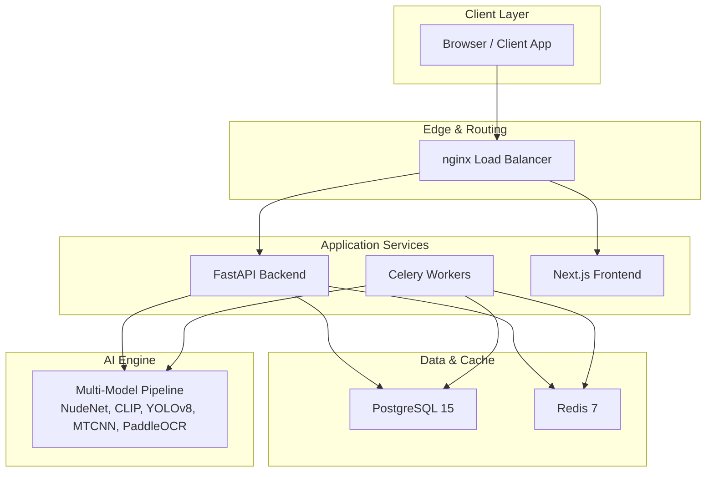
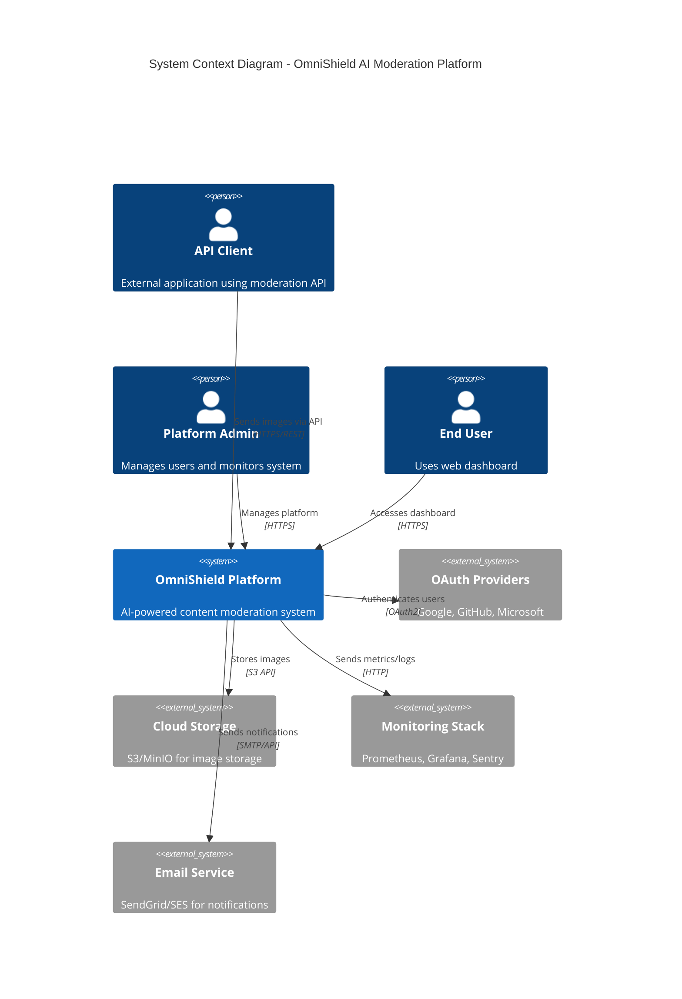
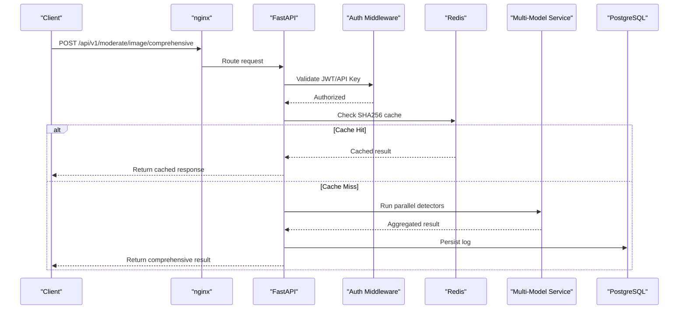
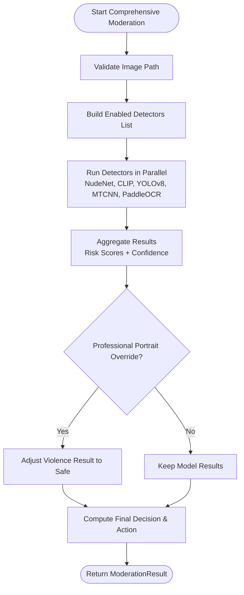
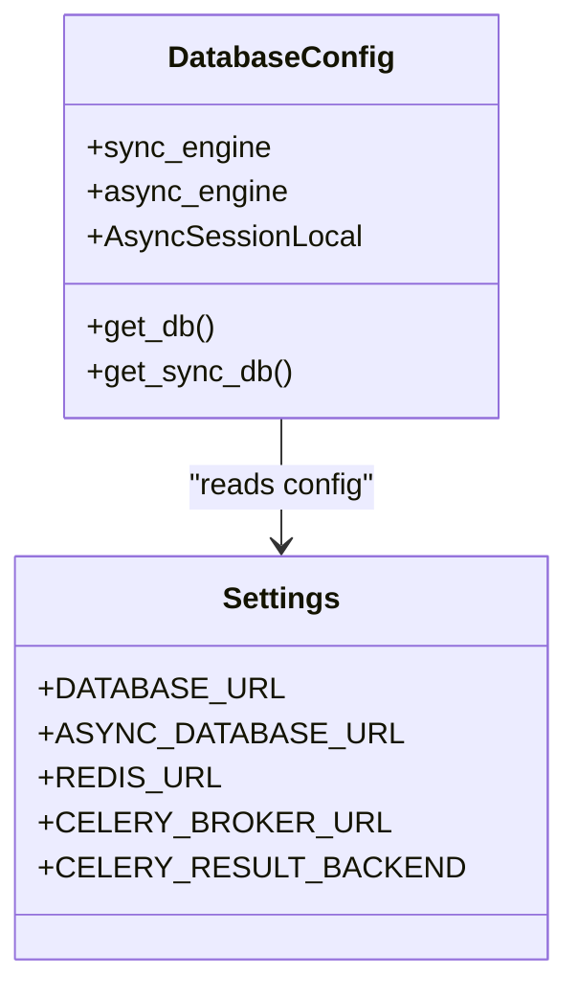
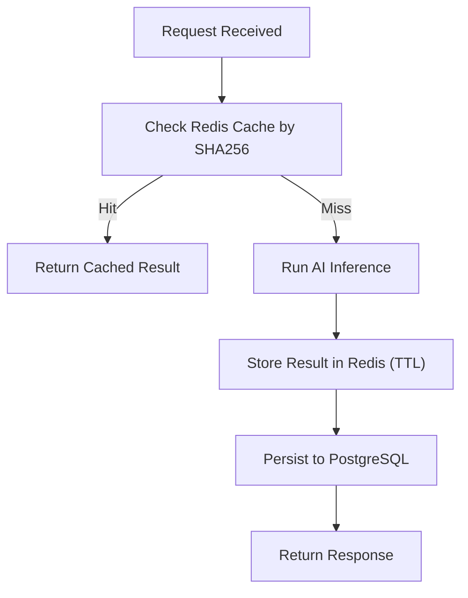
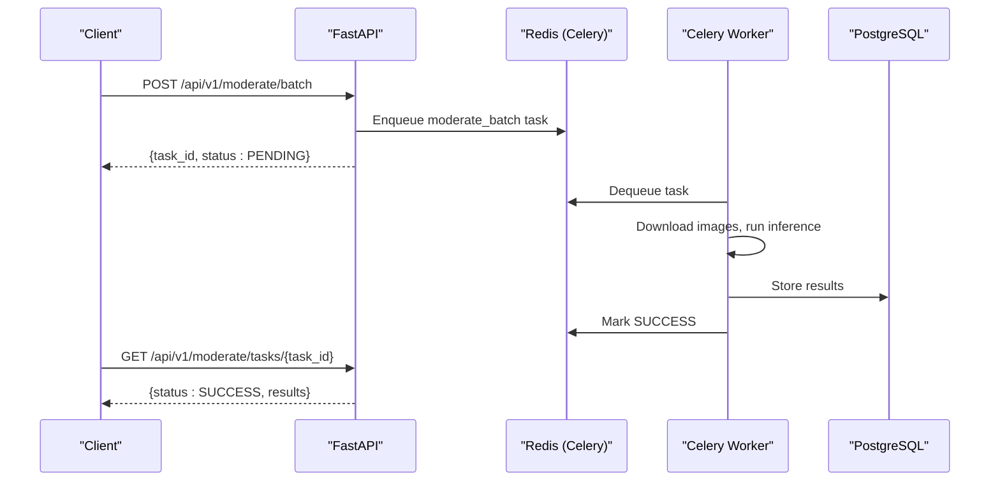
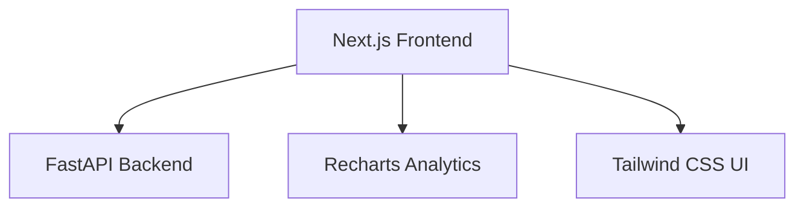
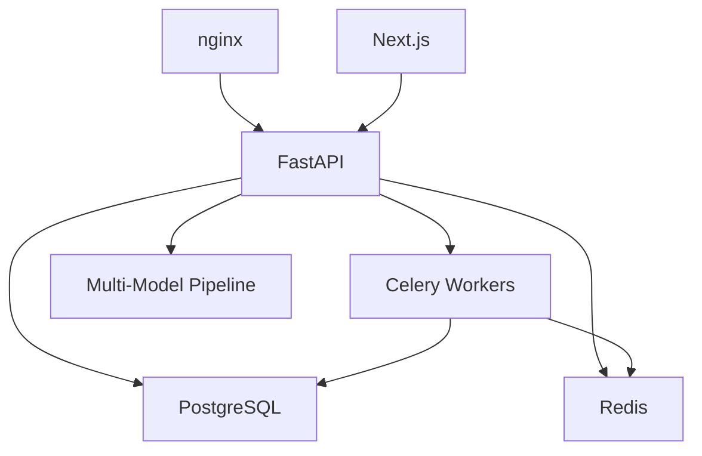

# System Overview

<cite>
**Referenced Files in This Document**
- [README.md](file://nudenet_project/README.md)
- [ARCHITECTURE.md](file://nudenet_project/ARCHITECTURE.md)
- [docker-compose.yml](file://nudenet_project/docker-compose.yml)
- [backend/app/main.py](file://nudenet_project/backend/app/main.py)
- [backend/app/core/config.py](file://nudenet_project/backend/app/core/config.py)
- [backend/app/api/moderate.py](file://nudenet_project/backend/app/api/moderate.py)
- [backend/app/services/multi_model_moderation.py](file://nudenet_project/backend/app/services/multi_model_moderation.py)
- [backend/app/core/database.py](file://nudenet_project/backend/app/core/database.py)
- [backend/app/core/redis.py](file://nudenet_project/backend/app/core/redis.py)
- [backend/Dockerfile](file://nudenet_project/backend/Dockerfile)
- [frontend-nextjs-backup/package.json](file://nudenet_project/frontend-nextjs-backup/package.json)
- [frontend-nextjs-backup/Dockerfile](file://nudenet_project/frontend-nextjs-backup/Dockerfile)
</cite>

## Table of Contents
1. [Introduction](#introduction)
2. [Project Structure](#project-structure)
3. [Core Components](#core-components)
4. [Architecture Overview](#architecture-overview)
5. [Detailed Component Analysis](#detailed-component-analysis)
6. [Dependency Analysis](#dependency-analysis)
7. [Performance Considerations](#performance-considerations)
8. [Troubleshooting Guide](#troubleshooting-guide)
9. [Conclusion](#conclusion)
10. [Appendices](#appendices)

## Introduction
OmniShield is an enterprise-grade AI content moderation platform that provides multi-model detection across six categories: NSFW, violence, weapons, faces, text, and gore. It serves three primary user types:
- API clients: Integrate via REST endpoints for real-time or batch moderation.
- Platform admins: Manage users, keys, analytics, and system health through the dashboard.
- End users: Use the web dashboard to upload images/videos and review moderation results.

The platform combines specialized models (NudeNet, CLIP, YOLOv8, MTCNN, PaddleOCR) with a robust microservices architecture (nginx load balancer, FastAPI backend, Next.js frontend, PostgreSQL, Redis, Celery workers) to deliver high-throughput, low-latency moderation at scale.

**Section sources**
- [README.md:19-31](file://nudenet_project/README.md#L19-L31)
- [ARCHITECTURE.md:44-56](file://nudenet_project/ARCHITECTURE.md#L44-L56)

## Project Structure
At a high level, the repository contains:
- Backend (FastAPI): API endpoints, services, repositories, core configuration, database, caching, and task orchestration.
- Frontend (Next.js 16): Dashboard UI for moderation, analytics, and administration.
- Infrastructure: Docker Compose for local development; production deployment guidance includes nginx, Prometheus, Grafana, and cloud storage integrations.

**Diagram sources**
- [docker-compose.yml:1-108](file://nudenet_project/docker-compose.yml#L1-L108)
- [ARCHITECTURE.md:62-86](file://nudenet_project/ARCHITECTURE.md#L62-L86)

**Section sources**
- [README.md:139-172](file://nudenet_project/README.md#L139-L172)
- [ARCHITECTURE.md:62-86](file://nudenet_project/ARCHITECTURE.md#L62-L86)

## Core Components
- API Gateway: nginx routes HTTPS traffic to FastAPI and Next.js, terminates TLS, and can enforce rate limiting and security headers.
- Backend: FastAPI application exposing REST endpoints for authentication, moderation, analytics, and key management. Uses async I/O, Pydantic v2 schemas, SQLAlchemy async sessions, and optional Prometheus metrics.
- Frontend: Next.js 16 app built with React 19 and Tailwind CSS, providing dashboards for moderation, analytics, and admin tasks.
- Database: PostgreSQL 15 stores users, API keys, moderation logs, and video moderation jobs.
- Cache: Redis 7 provides image hash cache, session data, rate limiting counters, and Celery broker/result backend.
- Queue: Celery workers process long-running tasks such as batch moderation and scheduled jobs.
- AI Engine: Multi-model pipeline orchestrates NudeNet (NSFW), CLIP (violence/gore), YOLOv8 (weapons), MTCNN (faces), and PaddleOCR + profanity filter (text). Results are aggregated using ensemble voting and risk scoring.

**Section sources**
- [backend/app/main.py:1-126](file://nudenet_project/backend/app/main.py#L1-L126)
- [backend/app/core/config.py:1-148](file://nudenet_project/backend/app/core/config.py#L1-L148)
- [backend/app/core/database.py:1-50](file://nudenet_project/backend/app/core/database.py#L1-L50)
- [backend/app/core/redis.py:1-21](file://nudenet_project/backend/app/core/redis.py#L1-L21)
- [backend/app/api/moderate.py:1-615](file://nudenet_project/backend/app/api/moderate.py#L1-L615)
- [backend/app/services/multi_model_moderation.py:1-777](file://nudenet_project/backend/app/services/multi_model_moderation.py#L1-L777)
- [frontend-nextjs-backup/package.json:1-32](file://nudenet_project/frontend-nextjs-backup/package.json#L1-L32)

## Architecture Overview
The C4 context diagram illustrates external integrations and actors interacting with OmniShield:

**Diagram sources**
- [ARCHITECTURE.md:19-42](file://nudenet_project/ARCHITECTURE.md#L19-L42)

## Detailed Component Analysis

### API Server (FastAPI)
- Entry point initializes CORS middleware, security headers, and mounts routers under /api/v1.
- Health and root endpoints provide operational metadata and feature flags.
- Optional Prometheus metrics endpoint exposed when enabled.

**Diagram sources**
- [backend/app/main.py:1-126](file://nudenet_project/backend/app/main.py#L1-L126)
- [backend/app/api/moderate.py:446-615](file://nudenet_project/backend/app/api/moderate.py#L446-L615)
- [backend/app/services/multi_model_moderation.py:532-732](file://nudenet_project/backend/app/services/multi_model_moderation.py#L532-L732)

**Section sources**
- [backend/app/main.py:1-126](file://nudenet_project/backend/app/main.py#L1-L126)
- [backend/app/api/moderate.py:1-615](file://nudenet_project/backend/app/api/moderate.py#L1-L615)

### Multi-Model AI Pipeline
- Orchestrates five detectors concurrently using asyncio.gather and ThreadPoolExecutor for CPU/GPU-bound inference.
- Implements lazy loading for each model to minimize startup time and memory footprint.
- Applies ensemble aggregation: maps per-model risk levels to scores, selects highest unsafe confidence, and determines final decision/action.
- Includes professional portrait override logic to reduce false positives on single-face images without weapons and low-confidence violence.

**Diagram sources**
- [backend/app/services/multi_model_moderation.py:532-732](file://nudenet_project/backend/app/services/multi_model_moderation.py#L532-L732)

**Section sources**
- [backend/app/services/multi_model_moderation.py:1-777](file://nudenet_project/backend/app/services/multi_model_moderation.py#L1-L777)

### Data Access Layer
- Async SQLAlchemy engine and session factory configured for high-performance FastAPI routes.
- Sync engine used for migrations and CLI tools.
- Dependency injection provides AsyncSession to endpoints.

**Diagram sources**
- [backend/app/core/database.py:1-50](file://nudenet_project/backend/app/core/database.py#L1-L50)
- [backend/app/core/config.py:30-47](file://nudenet_project/backend/app/core/config.py#L30-L47)

**Section sources**
- [backend/app/core/database.py:1-50](file://nudenet_project/backend/app/core/database.py#L1-L50)
- [backend/app/core/config.py:1-148](file://nudenet_project/backend/app/core/config.py#L1-L148)

### Caching and Rate Limiting
- Redis client initialized with connection timeout and graceful degradation if unavailable.
- Image hashing cache uses SHA256 to avoid redundant processing; TTL configurable.
- Rate limiting counters stored in Redis with short TTLs.

**Diagram sources**
- [backend/app/core/redis.py:1-21](file://nudenet_project/backend/app/core/redis.py#L1-L21)
- [backend/app/api/moderate.py:283-344](file://nudenet_project/backend/app/api/moderate.py#L283-L344)

**Section sources**
- [backend/app/core/redis.py:1-21](file://nudenet_project/backend/app/core/redis.py#L1-L21)
- [backend/app/api/moderate.py:283-344](file://nudenet_project/backend/app/api/moderate.py#L283-L344)

### Background Tasks (Celery)
- Batch moderation enqueues tasks via Celery and returns task IDs for polling.
- Workers consume tasks from Redis broker, perform inference, and store results in PostgreSQL.

**Diagram sources**
- [backend/app/api/moderate.py:380-443](file://nudenet_project/backend/app/api/moderate.py#L380-L443)

**Section sources**
- [backend/app/api/moderate.py:380-443](file://nudenet_project/backend/app/api/moderate.py#L380-L443)

### Frontend (Next.js 16)
- Built with Node 20, React 19, TypeScript, Tailwind CSS, Recharts, Axios, and Framer Motion.
- Provides dashboards for moderation, analytics, and admin functions.

**Diagram sources**
- [frontend-nextjs-backup/package.json:1-32](file://nudenet_project/frontend-nextjs-backup/package.json#L1-L32)

**Section sources**
- [frontend-nextjs-backup/package.json:1-32](file://nudenet_project/frontend-nextjs-backup/package.json#L1-L32)

## Dependency Analysis
High-level dependency relationships among components:

**Diagram sources**
- [docker-compose.yml:1-108](file://nudenet_project/docker-compose.yml#L1-L108)
- [ARCHITECTURE.md:62-86](file://nudenet_project/ARCHITECTURE.md#L62-L86)

**Section sources**
- [docker-compose.yml:1-108](file://nudenet_project/docker-compose.yml#L1-L108)
- [ARCHITECTURE.md:62-86](file://nudenet_project/ARCHITECTURE.md#L62-L86)

## Performance Considerations
- Cache hits return in <2ms; full multi-model inference typically takes seconds depending on hardware.
- GPU acceleration reduces inference latency where available; CPU fallback ensures availability.
- Lazy model loading minimizes startup overhead.
- Asynchronous I/O and connection pooling improve throughput.
- Horizontal scaling supported via multiple API pods and auto-scaling workers.

[No sources needed since this section provides general guidance]

## Troubleshooting Guide
- Redis connectivity failures trigger graceful degradation; ensure Redis is reachable and configured correctly.
- Validation errors for file types and sizes are returned early; verify MIME signatures and size limits.
- Health endpoint indicates service status and environment details; use it for readiness checks.
- Prometheus metrics endpoint (/metrics) is available when enabled; confirm dependencies and configuration.

**Section sources**
- [backend/app/core/redis.py:1-21](file://nudenet_project/backend/app/core/redis.py#L1-L21)
- [backend/app/api/moderate.py:32-61](file://nudenet_project/backend/app/api/moderate.py#L32-L61)
- [backend/app/main.py:84-96](file://nudenet_project/backend/app/main.py#L84-L96)
- [backend/app/main.py:98-107](file://nudenet_project/backend/app/main.py#L98-L107)

## Conclusion
OmniShield delivers a scalable, secure, and high-performance AI moderation platform combining six specialized models behind a modern microservices architecture. Its containerized design, robust caching and queuing layers, and observability features enable reliable operation at enterprise scale. The platform supports diverse user roles and integrates with OAuth providers, cloud storage, monitoring systems, and email services to meet production requirements.

[No sources needed since this section summarizes without analyzing specific files]

## Appendices

### Technology Stack Breakdown
- API Gateway: nginx (load balancing, SSL termination)
- Backend: FastAPI 0.137, Python 3.12, Uvicorn ASGI server
- Frontend: Next.js 16, React 19, TypeScript, Tailwind CSS, Recharts
- AI Models: NudeNet (ONNX), CLIP (Transformers), YOLOv8 (Ultralytics), MTCNN (facenet-pytorch), PaddleOCR + better-profanity
- Database: PostgreSQL 15
- Cache: Redis 7
- Queue: Celery 5.4 with Redis broker
- Monitoring: Prometheus, Grafana, Loguru

**Section sources**
- [README.md:621-657](file://nudenet_project/README.md#L621-L657)
- [ARCHITECTURE.md:44-56](file://nudenet_project/ARCHITECTURE.md#L44-L56)
- [backend/Dockerfile:1-27](file://nudenet_project/backend/Dockerfile#L1-L27)
- [frontend-nextjs-backup/Dockerfile:1-22](file://nudenet_project/frontend-nextjs-backup/Dockerfile#L1-L22)

### Infrastructure Requirements and Deployment Topology
- Local development: docker-compose runs PostgreSQL, Redis, FastAPI backend, Celery worker, and frontend containers.
- Production topology: Cloudflare CDN/WAF, nginx load balancer, multiple API pods, Celery workers, PostgreSQL cluster with read replicas, Redis cluster, and object storage (S3/MinIO).
- Resource guidelines provided for CPU, memory, storage, and replica counts.

**Section sources**
- [docker-compose.yml:1-108](file://nudenet_project/docker-compose.yml#L1-L108)
- [ARCHITECTURE.md:620-662](file://nudenet_project/ARCHITECTURE.md#L620-L662)