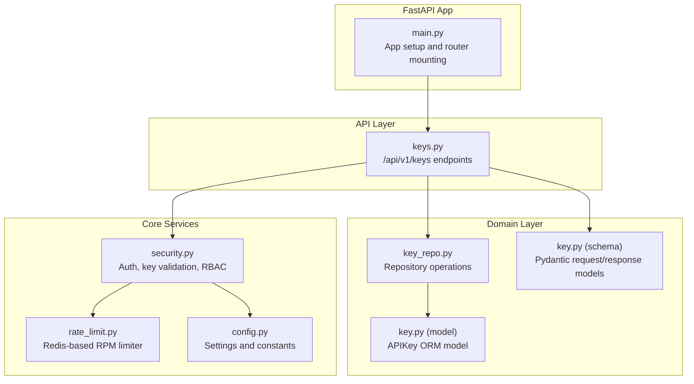
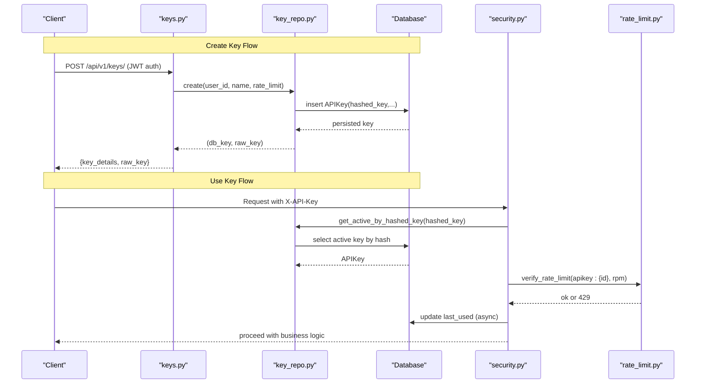
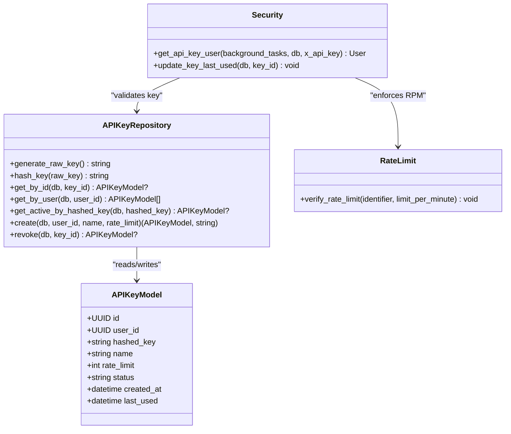

# API Key Management API

<cite>
**Referenced Files in This Document**
- [main.py](file://backend/app/main.py)
- [keys.py](file://backend/app/api/keys.py)
- [key_repo.py](file://backend/app/repositories/key_repo.py)
- [key.py](file://backend/app/models/key.py)
- [key.py](file://backend/app/schemas/key.py)
- [security.py](file://backend/app/core/security.py)
- [rate_limit.py](file://backend/app/core/rate_limit.py)
- [config.py](file://backend/app/core/config.py)
</cite>

## Table of Contents
1. [Introduction](#introduction)
2. [Project Structure](#project-structure)
3. [Core Components](#core-components)
4. [Architecture Overview](#architecture-overview)
5. [Detailed Component Analysis](#detailed-component-analysis)
6. [Dependency Analysis](#dependency-analysis)
7. [Performance Considerations](#performance-considerations)
8. [Troubleshooting Guide](#troubleshooting-guide)
9. [Conclusion](#conclusion)
10. [Appendices](#appendices)

## Introduction
This document provides comprehensive API documentation for the API key management endpoints, focusing on key creation, listing, revocation, and validation. It also covers request/response schemas, security best practices, rate limiting integration, usage tracking, and troubleshooting guidance.

The API is versioned under /api/v1 and supports two authentication mechanisms:
- X-API-Key header for programmatic access using API keys
- Authorization Bearer JWT for user sessions

Key capabilities include:
- Create a new API key with a name and per-key rate limit
- List all keys owned by the authenticated user
- Revoke an existing key (with ownership or admin checks)
- Validate API keys via the shared authentication pipeline used by protected endpoints

Note: There is no dedicated POST /api/v1/keys/validate endpoint; key validation is performed automatically when requests are made to protected endpoints using the X-API-Key header.

## Project Structure
The API key management functionality is implemented across routers, repositories, models, schemas, and core security utilities. The FastAPI application mounts routers under the /api/v1 prefix.

**Diagram sources**
- [main.py:59-63](file://backend/app/main.py#L59-L63)
- [keys.py:12-87](file://backend/app/api/keys.py#L12-L87)
- [key_repo.py:10-79](file://backend/app/repositories/key_repo.py#L10-L79)
- [key.py:9-23](file://backend/app/models/key.py#L9-L23)
- [key.py:7-25](file://backend/app/schemas/key.py#L7-L25)
- [security.py:119-150](file://backend/app/core/security.py#L119-L150)
- [rate_limit.py:7-44](file://backend/app/core/rate_limit.py#L7-L44)
- [config.py:15](file://backend/app/core/config.py#L15)

**Section sources**
- [main.py:59-63](file://backend/app/main.py#L59-L63)
- [config.py:15](file://backend/app/core/config.py#L15)

## Core Components
- Router: Defines endpoints under /api/v1/keys
  - POST /api/v1/keys/ — create a new API key
  - GET /api/v1/keys/ — list keys for the current user
  - DELETE /api/v1/keys/{key_id} — revoke a key
- Repository: Encapsulates database operations for API keys
  - Generate raw keys, hash them, create, fetch, and revoke
- Model: Defines the APIKey table schema and relationships
- Schemas: Pydantic models for request and response validation
- Security: Validates API keys, enforces rate limits, updates last_used, and resolves client identity
- Rate Limiting: Redis-backed per-minute counters with graceful degradation

**Section sources**
- [keys.py:14-86](file://backend/app/api/keys.py#L14-L86)
- [key_repo.py:10-79](file://backend/app/repositories/key_repo.py#L10-L79)
- [key.py:9-23](file://backend/app/models/key.py#L9-L23)
- [key.py:7-25](file://backend/app/schemas/key.py#L7-L25)
- [security.py:119-150](file://backend/app/core/security.py#L119-L150)
- [rate_limit.py:7-44](file://backend/app/core/rate_limit.py#L7-L44)

## Architecture Overview
The API key lifecycle flows through the router, repository, and security layers. Creation returns the raw key once; subsequent uses rely on hashed storage and header-based authentication.

**Diagram sources**
- [keys.py:14-38](file://backend/app/api/keys.py#L14-L38)
- [key_repo.py:50-68](file://backend/app/repositories/key_repo.py#L50-L68)
- [security.py:119-150](file://backend/app/core/security.py#L119-L150)
- [rate_limit.py:7-44](file://backend/app/core/rate_limit.py#L7-L44)

## Detailed Component Analysis

### Endpoints

#### Create API Key
- Method: POST
- Path: /api/v1/keys/
- Authentication: JWT Bearer token (user context required)
- Request body: CreateKeyRequest
  - name: string (required, length 1–100)
  - rate_limit: integer (optional, default 60, range 1–10000)
- Response: CreateKeyResponse
  - key_details: ApiKeyResponse
  - raw_key: string (returned only once at creation time)
- Status codes:
  - 201 Created on success
  - 500 Internal Server Error on unexpected failures

Notes:
- Keys are prefixed with ak_ and stored as SHA-256 hashes.
- Per-key rate limit is enforced during use.

**Section sources**
- [keys.py:14-38](file://backend/app/api/keys.py#L14-L38)
- [key.py:7-25](file://backend/app/schemas/key.py#L7-L25)
- [key_repo.py:50-68](file://backend/app/repositories/key_repo.py#L50-L68)

#### List API Keys
- Method: GET
- Path: /api/v1/keys/
- Authentication: JWT Bearer token (user context required)
- Response: Array of ApiKeyResponse
  - id: UUID
  - name: string
  - rate_limit: integer
  - status: string ("active", "revoked")
  - created_at: datetime
  - last_used: datetime or null
- Status codes:
  - 200 OK
  - 500 Internal Server Error on unexpected failures

**Section sources**
- [keys.py:40-54](file://backend/app/api/keys.py#L40-L54)
- [key.py:11-20](file://backend/app/schemas/key.py#L11-L20)

#### Revoke API Key
- Method: DELETE
- Path: /api/v1/keys/{key_id}
- Authentication: JWT Bearer token (user context required)
- Path parameter:
  - key_id: UUID string
- Response: ApiKeyResponse (updated status)
- Status codes:
  - 200 OK on successful revocation
  - 404 Not Found if key does not exist
  - 403 Forbidden if caller is not owner and not admin
  - 500 Internal Server Error on unexpected failures

Ownership enforcement:
- Only the key owner or an admin can revoke a key.

**Section sources**
- [keys.py:56-86](file://backend/app/api/keys.py#L56-L86)

#### Validate API Key
There is no dedicated validate endpoint. Validation occurs automatically when accessing protected endpoints using the X-API-Key header. The flow includes:
- Lookup by hashed key
- Enforce per-key rate limit
- Update last_used timestamp asynchronously
- Resolve owner user and ensure account is active

If you need explicit validation responses, implement a dedicated endpoint that reuses the same validation logic from the security layer.

**Section sources**
- [security.py:119-150](file://backend/app/core/security.py#L119-L150)
- [rate_limit.py:7-44](file://backend/app/core/rate_limit.py#L7-L44)

### Data Models and Schemas

#### CreateKeyRequest
- Fields:
  - name: string (required, min_length=1, max_length=100)
  - rate_limit: integer (default=60, ge=1, le=10000)

#### ApiKeyResponse
- Fields:
  - id: UUID
  - name: string
  - rate_limit: integer
  - status: string
  - created_at: datetime
  - last_used: datetime | null

#### CreateKeyResponse
- Fields:
  - key_details: ApiKeyResponse
  - raw_key: string

**Section sources**
- [key.py:7-25](file://backend/app/schemas/key.py#L7-L25)

### API Key Format and Storage
- Raw key format: ak_<base64url-safe random bytes>
- Storage: SHA-256 hex digest of the raw key
- Generation: Cryptographically secure random token generation
- Prefix: ak_

Security implications:
- Never store or log raw keys after creation
- Always transmit keys over HTTPS
- Rotate keys regularly and revoke compromised keys promptly

**Section sources**
- [key_repo.py:12-20](file://backend/app/repositories/key_repo.py#L12-L20)

### Access Control and Ownership
- Creating/listing keys requires a valid JWT Bearer token
- Revoking a key requires ownership or admin role
- Protected endpoints accept either:
  - X-API-Key header for service-to-service calls
  - Authorization: Bearer <JWT> for user sessions

**Section sources**
- [keys.py:14-86](file://backend/app/api/keys.py#L14-L86)
- [security.py:153-176](file://backend/app/core/security.py#L153-L176)

### Rate Limiting Integration
- Per-key rate limit (requests per minute) enforced during API key usage
- Uses Redis windowed counting; fails open if Redis is unavailable
- Returns 429 Too Many Requests with retry guidance when exceeded

**Section sources**
- [security.py:134-135](file://backend/app/core/security.py#L134-L135)
- [rate_limit.py:7-44](file://backend/app/core/rate_limit.py#L7-L44)

### Usage Tracking
- last_used updated asynchronously after successful key validation
- Timestamps recorded in UTC

**Section sources**
- [security.py:107-116](file://backend/app/core/security.py#L107-L116)
- [security.py:137-138](file://backend/app/core/security.py#L137-L138)

## Dependency Analysis

**Diagram sources**
- [key.py:9-23](file://backend/app/models/key.py#L9-L23)
- [key_repo.py:10-79](file://backend/app/repositories/key_repo.py#L10-L79)
- [security.py:107-150](file://backend/app/core/security.py#L107-L150)
- [rate_limit.py:7-44](file://backend/app/core/rate_limit.py#L7-L44)

**Section sources**
- [key_repo.py:10-79](file://backend/app/repositories/key_repo.py#L10-L79)
- [security.py:107-150](file://backend/app/core/security.py#L107-L150)
- [rate_limit.py:7-44](file://backend/app/core/rate_limit.py#L7-L44)

## Performance Considerations
- Asynchronous database operations reduce latency
- Background tasks update last_used without blocking responses
- Redis-based rate limiting is efficient; graceful fallback prevents outages from blocking traffic
- Avoid logging raw keys to prevent I/O overhead and security risks

[No sources needed since this section provides general guidance]

## Troubleshooting Guide
Common issues and resolutions:
- Invalid or revoked API key (401 Unauthorized)
  - Ensure the key exists, is active, and matches the provided value
  - Check for typos and confirm correct header X-API-Key
- Owner account suspended or inactive (401 Unauthorized)
  - Verify the owning user’s status is active
- Rate limit exceeded (429 Too Many Requests)
  - Reduce request frequency or increase per-key rate_limit
  - Inspect retry_after guidance in the error payload
- Not authorized to revoke this key (403 Forbidden)
  - Confirm the requester owns the key or has admin privileges
- Key not found (404 Not Found)
  - Verify key_id and ensure it belongs to the requesting user

Operational tips:
- Monitor logs for failed key validations and rate limit hits
- Ensure Redis availability for accurate rate limiting
- Keep raw keys secret and rotate periodically

**Section sources**
- [security.py:128-150](file://backend/app/core/security.py#L128-L150)
- [rate_limit.py:29-44](file://backend/app/core/rate_limit.py#L29-L44)
- [keys.py:63-86](file://backend/app/api/keys.py#L63-L86)

## Conclusion
The API key management system provides secure creation, listing, and revocation of keys, along with robust validation and rate limiting. By adhering to the documented schemas, headers, and security practices, clients can reliably integrate automated workflows and maintain strong access control.

[No sources needed since this section summarizes without analyzing specific files]

## Appendices

### Request/Response Schemas Summary
- CreateKeyRequest
  - name: string (required, 1–100 chars)
  - rate_limit: integer (default 60, 1–10000)
- ApiKeyResponse
  - id: UUID
  - name: string
  - rate_limit: integer
  - status: string
  - created_at: datetime
  - last_used: datetime | null
- CreateKeyResponse
  - key_details: ApiKeyResponse
  - raw_key: string

**Section sources**
- [key.py:7-25](file://backend/app/schemas/key.py#L7-L25)

### Example Usage (curl)
Create a new API key (requires JWT):
- curl -X POST https://your-api.example.com/api/v1/keys/ \
  -H "Authorization: Bearer YOUR_JWT_TOKEN" \
  -H "Content-Type: application/json" \
  -d '{"name":"my-service","rate_limit":120}'

List your API keys (requires JWT):
- curl -X GET https://your-api.example.com/api/v1/keys/ \
  -H "Authorization: Bearer YOUR_JWT_TOKEN"

Revoke an API key (requires JWT):
- curl -X DELETE https://your-api.example.com/api/v1/keys/{key_id} \
  -H "Authorization: Bearer YOUR_JWT_TOKEN"

Use an API key on a protected endpoint:
- curl -X GET https://your-api.example.com/api/v1/some-protected-endpoint \
  -H "X-API-Key: ak_your_raw_key_here"

Automated rotation script outline:
- Create a new key with a descriptive name and appropriate rate_limit
- Update dependent services to use the new key
- Wait for propagation and verify successful usage
- Revoke the old key

Bulk operations:
- Iterate over listed keys to perform batch revocations or audits
- Respect rate limits and add delays between requests

**Section sources**
- [keys.py:14-86](file://backend/app/api/keys.py#L14-L86)
- [security.py:153-176](file://backend/app/core/security.py#L153-L176)

### Security Best Practices
- Transmit keys only over HTTPS
- Store raw keys securely and never log them
- Rotate keys regularly and immediately revoke compromised keys
- Apply least-privilege principles and restrict per-key rate limits
- Monitor usage and set alerts for anomalies

[No sources needed since this section provides general guidance]