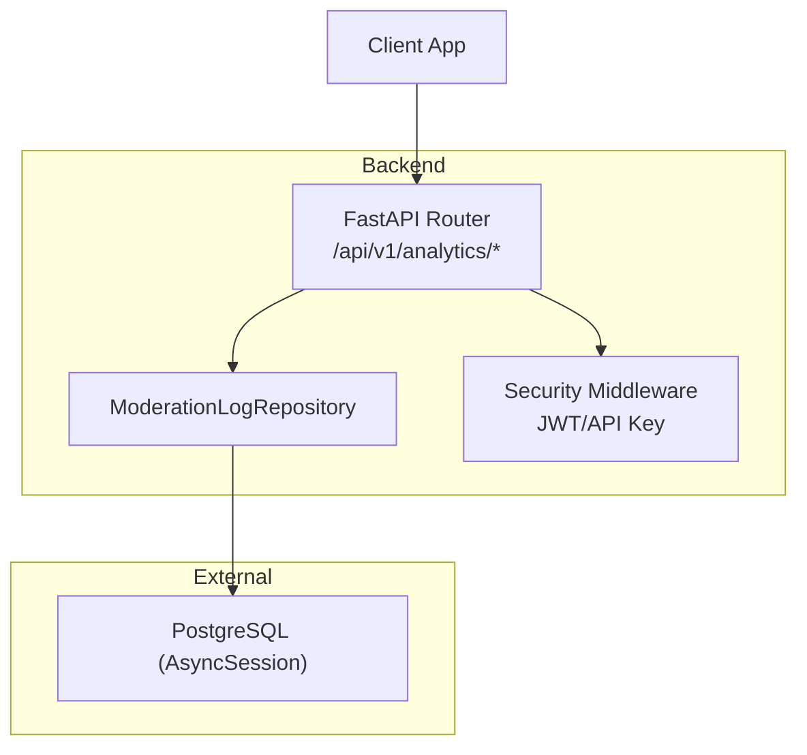
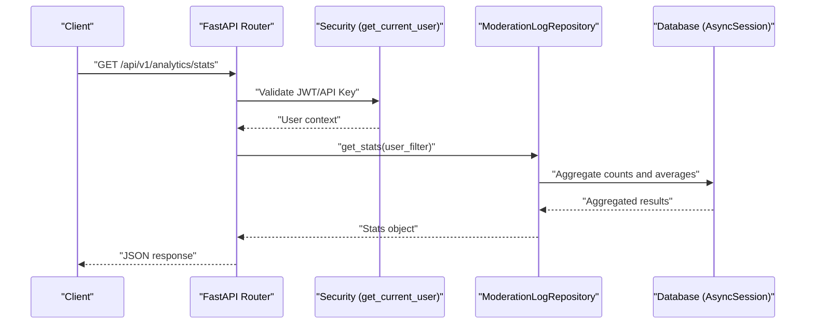
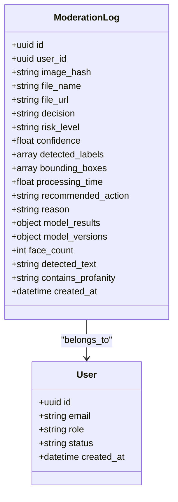
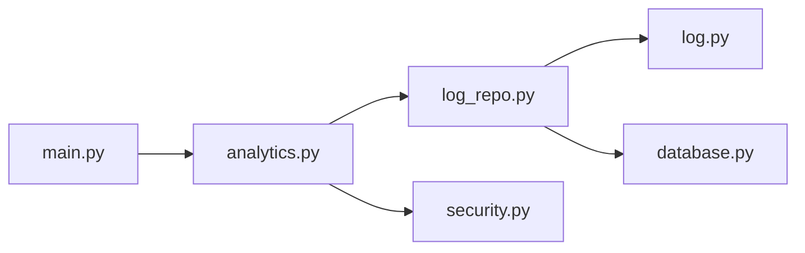

# Analytics & Reporting API

<cite>
**Referenced Files in This Document**
- [main.py](file://backend/app/main.py)
- [analytics.py](file://backend/app/api/analytics.py)
- [log_repo.py](file://backend/app/repositories/log_repo.py)
- [log.py](file://backend/app/models/log.py)
- [database.py](file://backend/app/core/database.py)
- [security.py](file://backend/app/core/security.py)
- [api.ts](file://frontend/src/lib/api.ts)
</cite>

## Table of Contents
1. [Introduction](#introduction)
2. [Project Structure](#project-structure)
3. [Core Components](#core-components)
4. [Architecture Overview](#architecture-overview)
5. [Detailed Component Analysis](#detailed-component-analysis)
6. [Dependency Analysis](#dependency-analysis)
7. [Performance Considerations](#performance-considerations)
8. [Troubleshooting Guide](#troubleshooting-guide)
9. [Conclusion](#conclusion)
10. [Appendices](#appendices)

## Introduction
This document provides comprehensive API documentation for analytics and reporting endpoints focused on usage statistics, performance metrics, audit logs, and custom reports. It covers:
- GET /api/v1/analytics/stats: High-level dashboard metrics (usage stats).
- GET /api/v1/analytics/timeseries: Time-based aggregations for charts.
- GET /api/v1/analytics/history: Paginated audit log retrieval.

It also documents query parameters, response schemas, authentication, error handling, data retention considerations, aggregation algorithms, performance optimization strategies, real-time monitoring via Prometheus, and guidance for webhook integrations.

Note: The repository implements /stats, /timeseries, and /history under the analytics router. A frontend client calls these endpoints to render dashboards and charts.

## Project Structure
The analytics feature is implemented as a FastAPI router with repository-backed queries against a PostgreSQL database using SQLAlchemy async sessions. Authentication is enforced via JWT or API key.

**Diagram sources**
- [main.py:59-63](file://backend/app/main.py#L59-L63)
- [analytics.py:12-70](file://backend/app/api/analytics.py#L12-L70)
- [log_repo.py:10-232](file://backend/app/repositories/log_repo.py#L10-L232)
- [database.py:19-41](file://backend/app/core/database.py#L19-L41)
- [security.py:53-93](file://backend/app/core/security.py#L53-L93)

**Section sources**
- [main.py:59-63](file://backend/app/main.py#L59-L63)
- [analytics.py:12-70](file://backend/app/api/analytics.py#L12-L70)
- [log_repo.py:10-232](file://backend/app/repositories/log_repo.py#L10-L232)
- [database.py:19-41](file://backend/app/core/database.py#L19-L41)
- [security.py:53-93](file://backend/app/core/security.py#L53-L93)

## Core Components
- Analytics Router: Defines endpoints for stats, history, and timeseries.
- ModerationLogRepository: Provides data access and aggregation logic for moderation logs.
- ModerationLog Model: Database schema for moderation events.
- Security: Enforces authentication via JWT or API key.
- Database: Async session management for high-performance queries.

Key responsibilities:
- Route handlers validate auth and delegate to repository methods.
- Repository executes SQL aggregates and returns structured responses.
- Models define persistent fields and relationships.

**Section sources**
- [analytics.py:12-70](file://backend/app/api/analytics.py#L12-L70)
- [log_repo.py:10-232](file://backend/app/repositories/log_repo.py#L10-L232)
- [log.py:13-51](file://backend/app/models/log.py#L13-L51)
- [security.py:53-93](file://backend/app/core/security.py#L53-L93)
- [database.py:19-41](file://backend/app/core/database.py#L19-L41)

## Architecture Overview
The analytics subsystem follows a layered architecture:
- Presentation layer: FastAPI routes.
- Business logic layer: Repository methods performing aggregation and filtering.
- Data layer: SQLAlchemy models and async database sessions.

**Diagram sources**
- [analytics.py:14-30](file://backend/app/api/analytics.py#L14-L30)
- [security.py:53-93](file://backend/app/core/security.py#L53-L93)
- [log_repo.py:89-136](file://backend/app/repositories/log_repo.py#L89-L136)
- [database.py:35-41](file://backend/app/core/database.py#L35-L41)

## Detailed Component Analysis

### Endpoint: GET /api/v1/analytics/stats
Purpose: Retrieve high-level dashboard metrics including total requests, safe/unsafe counts, average processing time, risk breakdown, and active API keys.

Authentication: Requires valid JWT or API key. Admin users can view global metrics; non-admins see their own metrics only.

Query Parameters: None.

Response Schema: UsageStats
- total_requests: integer
- total_scans: integer
- unsafe_count: integer
- unsafe_scans: integer
- safe_count: integer
- safe_scans: integer
- avg_processing_time: number
- risk_breakdown: object mapping risk_level to count
- active_keys: integer

Example curl:
- curl -H "Authorization: Bearer <TOKEN>" https://api.example.com/api/v1/analytics/stats
- curl -H "X-API-Key: <KEY>" https://api.example.com/api/v1/analytics/stats

Notes:
- For admin users, user_filter is omitted to aggregate across all users.
- For non-admin users, user_filter restricts to current user’s logs.

**Section sources**
- [analytics.py:14-30](file://backend/app/api/analytics.py#L14-L30)
- [log_repo.py:89-136](file://backend/app/repositories/log_repo.py#L89-L136)
- [security.py:53-93](file://backend/app/core/security.py#L53-L93)

### Endpoint: GET /api/v1/analytics/timeseries
Purpose: Retrieve daily aggregated counts for safe, unsafe, and total over a configurable number of days.

Authentication: Requires valid JWT or API key.

Query Parameters:
- days: integer, default 7, range 1–90.

Response Schema: Array of TimeSeriesEntry
- date: string (ISO format YYYY-MM-DD)
- safe_count: integer
- unsafe_count: integer
- total_count: integer

Algorithm:
- Compute start_date = today - (days - 1).
- Fetch logs within [start_date, today].
- Group by created_at.date() and aggregate counts.
- Fill missing dates with zero counts to ensure contiguous series.

Example curl:
- curl -H "Authorization: Bearer <TOKEN>" "https://api.example.com/api/v1/analytics/timeseries?days=7"
- curl -H "X-API-Key: <KEY>" "https://api.example.com/api/v1/analytics/timeseries?days=30"

**Section sources**
- [analytics.py:53-69](file://backend/app/api/analytics.py#L53-L69)
- [log_repo.py:139-232](file://backend/app/repositories/log_repo.py#L139-L232)

### Endpoint: GET /api/v1/analytics/history
Purpose: Retrieve paginated audit logs for the dashboard.

Authentication: Requires valid JWT or API key.

Query Parameters:
- limit: integer, default 50.
- offset: integer, default 0.

Response Schema: Array of AuditLogEntry
- id: string (UUID)
- user_id: string (UUID, nullable)
- image_hash: string
- file_name: string
- file_url: string (nullable)
- decision: string ("safe", "unsafe", "review")
- risk_level: string ("low", "medium", "high", "critical")
- confidence: number
- detected_labels: array of strings
- bounding_boxes: array of objects {label, box, score}
- processing_time: number
- recommended_action: string ("allow", "quarantine", "block")
- reason: string (nullable)
- model_results: object (nullable)
- model_versions: object (nullable)
- face_count: integer
- detected_text: string (nullable)
- contains_profanity: string (nullable)
- created_at: string (ISO datetime)

Sorting: Results are ordered by created_at descending.

Pagination: Controlled by limit and offset.

Example curl:
- curl -H "Authorization: Bearer <TOKEN>" "https://api.example.com/api/v1/analytics/history?limit=50&offset=0"
- curl -H "X-API-Key: <KEY>" "https://api.example.com/api/v1/analytics/history?limit=100&offset=0"

Note: The frontend client references an endpoint path /analytics/logs, but the backend defines /analytics/history. Ensure your client uses the correct route.

**Section sources**
- [analytics.py:33-50](file://backend/app/api/analytics.py#L33-L50)
- [log_repo.py:71-86](file://backend/app/repositories/log_repo.py#L71-86)
- [log.py:13-51](file://backend/app/models/log.py#L13-L51)
- [api.ts:86-95](file://frontend/src/lib/api.ts#L86-L95)

### Data Models

#### ModerationLog Entity
Fields include identifiers, classification results, metadata, multi-model outputs, and timestamps. Relationships link to User.

**Diagram sources**
- [log.py:13-51](file://backend/app/models/log.py#L13-L51)
- [user.py:10-28](file://backend/app/models/user.py#L10-L28)

**Section sources**
- [log.py:13-51](file://backend/app/models/log.py#L13-L51)
- [user.py:10-28](file://backend/app/models/user.py#L10-L28)

### Real-Time Monitoring and Webhooks
- Prometheus Metrics: If enabled, the application mounts a /metrics endpoint for Prometheus scraping.
- Webhook Integrations: Not implemented in the provided codebase. You can extend the system by adding background tasks that emit events to external webhooks upon moderation decisions or threshold breaches.

**Section sources**
- [main.py:98-107](file://backend/app/main.py#L98-L107)

## Dependency Analysis
The analytics module depends on security, database, and repository layers. The main app registers the analytics router under the API version prefix.

**Diagram sources**
- [main.py:59-63](file://backend/app/main.py#L59-L63)
- [analytics.py:12-70](file://backend/app/api/analytics.py#L12-L70)
- [log_repo.py:10-232](file://backend/app/repositories/log_repo.py#L10-L232)
- [log.py:13-51](file://backend/app/models/log.py#L13-L51)
- [database.py:19-41](file://backend/app/core/database.py#L19-L41)
- [security.py:53-93](file://backend/app/core/security.py#L53-L93)

**Section sources**
- [main.py:59-63](file://backend/app/main.py#L59-L63)
- [analytics.py:12-70](file://backend/app/api/analytics.py#L12-L70)
- [log_repo.py:10-232](file://backend/app/repositories/log_repo.py#L10-L232)
- [log.py:13-51](file://backend/app/models/log.py#L13-L51)
- [database.py:19-41](file://backend/app/core/database.py#L19-L41)
- [security.py:53-93](file://backend/app/core/security.py#L53-L93)

## Performance Considerations
- Indexing: created_at and user_id are indexed to optimize time-range and user-filtered queries.
- Aggregation Strategy:
  - Stats use COUNT and AVG aggregates directly in SQL for efficiency.
  - Timeseries fetches raw rows within the window and groups in Python to fill missing dates.
- Pagination: History uses LIMIT/OFFSET; consider keyset pagination for large datasets.
- Concurrency: Async sessions improve throughput for read-heavy analytics endpoints.
- Caching: Consider Redis caching for frequently accessed stats and timeseries windows.
- Retention Policies: Implement periodic cleanup of old logs based on business requirements to keep queries fast.

[No sources needed since this section provides general guidance]

## Troubleshooting Guide
Common issues and resolutions:
- Authentication failures: Ensure Authorization Bearer token or X-API-Key header is present and valid.
- Empty timeseries: Verify days parameter and that logs exist within the requested window.
- Incorrect history route: Frontend client may call /analytics/logs while backend exposes /analytics/history. Align client paths accordingly.
- Large dataset performance: Increase index coverage, reduce days window, or implement materialized views for heavy aggregations.

Error Handling:
- Endpoints return HTTP 500 with descriptive details when exceptions occur during aggregation or listing.

**Section sources**
- [analytics.py:25-30](file://backend/app/api/analytics.py#L25-L30)
- [analytics.py:45-50](file://backend/app/api/analytics.py#L45-L50)
- [analytics.py:64-69](file://backend/app/api/analytics.py#L64-L69)
- [log_repo.py:214-231](file://backend/app/repositories/log_repo.py#L214-L231)
- [api.ts:86-95](file://frontend/src/lib/api.ts#L86-L95)

## Conclusion
The analytics subsystem provides essential usage statistics, time-series aggregations, and paginated audit logs. It leverages async SQLAlchemy for performance and supports both JWT and API key authentication. To extend capabilities, consider adding advanced filtering, export formats, webhook notifications, and robust data retention policies.

[No sources needed since this section summarizes without analyzing specific files]

## Appendices

### Query Parameters Summary
- /analytics/stats: No parameters.
- /analytics/timeseries: days (integer, 1–90, default 7).
- /analytics/history: limit (integer, default 50), offset (integer, default 0).

### Response Schemas Summary
- UsageStats: total_requests, total_scans, unsafe_count, unsafe_scans, safe_count, safe_scans, avg_processing_time, risk_breakdown, active_keys.
- TimeSeriesEntry: date, safe_count, unsafe_count, total_count.
- AuditLogEntry: Comprehensive moderation log fields as defined in the ModerationLog model.

### Example Requests
- Stats:
  - curl -H "Authorization: Bearer <TOKEN>" https://api.example.com/api/v1/analytics/stats
- Timeseries:
  - curl -H "Authorization: Bearer <TOKEN>" "https://api.example.com/api/v1/analytics/timeseries?days=7"
- History:
  - curl -H "Authorization: Bearer <TOKEN>" "https://api.example.com/api/v1/analytics/history?limit=50&offset=0"

### Export Formats
- JSON is the native response format. For CSV or other exports, implement dedicated endpoints that serialize the same data structures.

### Data Retention Policies
- Define retention windows (e.g., 90 days) and schedule background jobs to archive or purge older logs.
- Use partitioning by date for efficient archival and deletion.

### Aggregation Algorithms
- Stats: SQL COUNT and AVG grouped by decision and risk_level.
- Timeseries: Date-windowed selection followed by in-memory grouping and zero-fill for missing dates.

### Real-Time Monitoring
- Prometheus metrics available at /metrics if enabled.

### Webhook Integrations
- Not implemented; add background tasks to publish events to configured webhook URLs upon moderation outcomes or metric thresholds.

**Section sources**
- [analytics.py:14-69](file://backend/app/api/analytics.py#L14-L69)
- [log_repo.py:89-232](file://backend/app/repositories/log_repo.py#L89-L232)
- [log.py:13-51](file://backend/app/models/log.py#L13-L51)
- [main.py:98-107](file://backend/app/main.py#L98-L107)