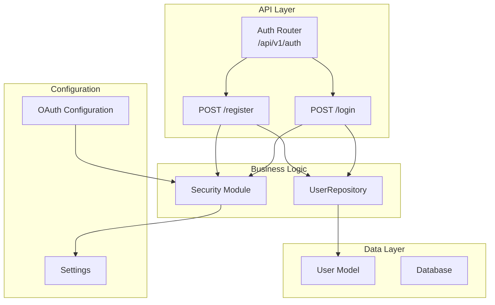
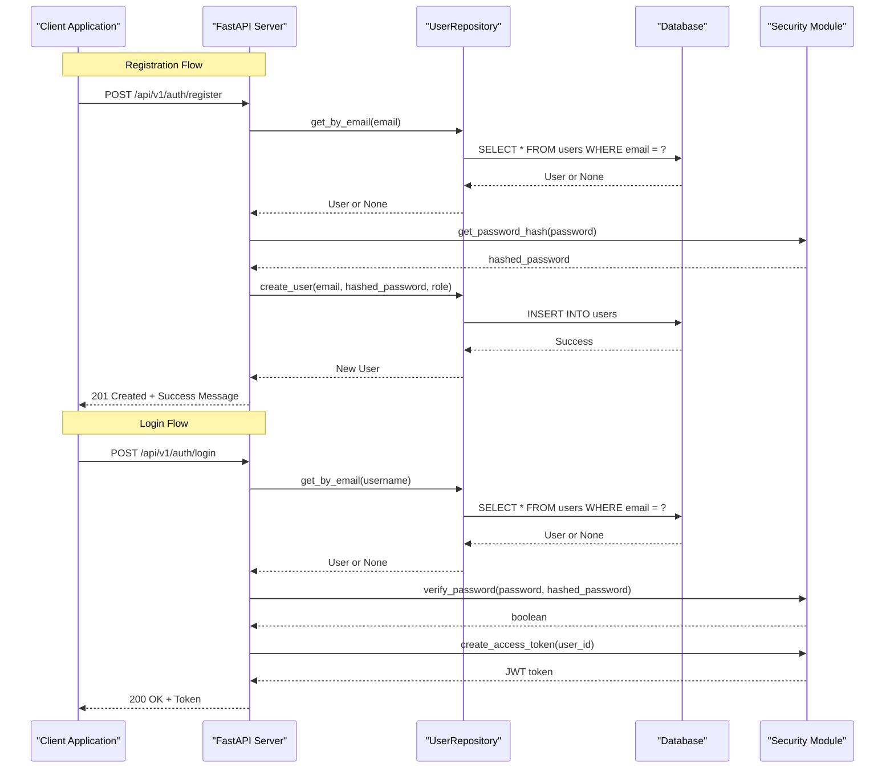
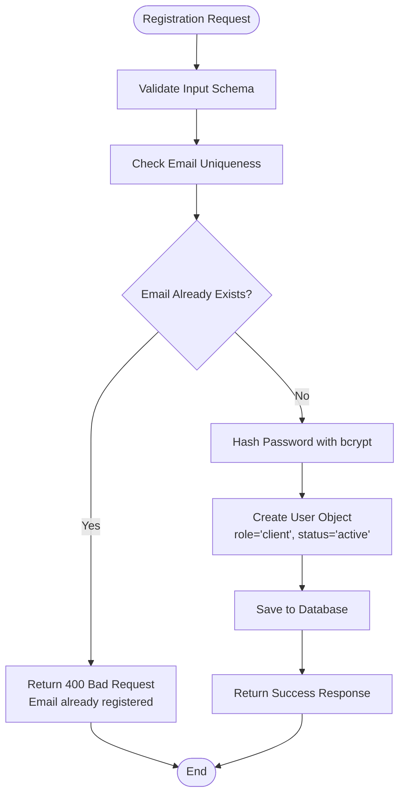
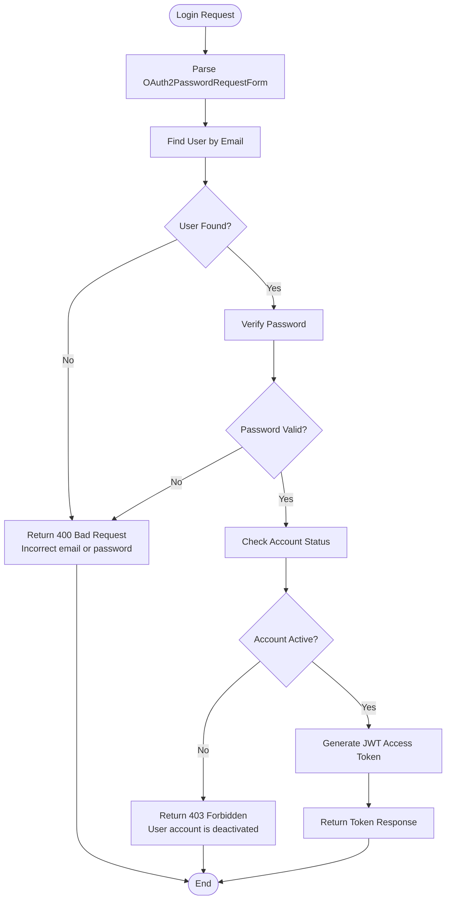
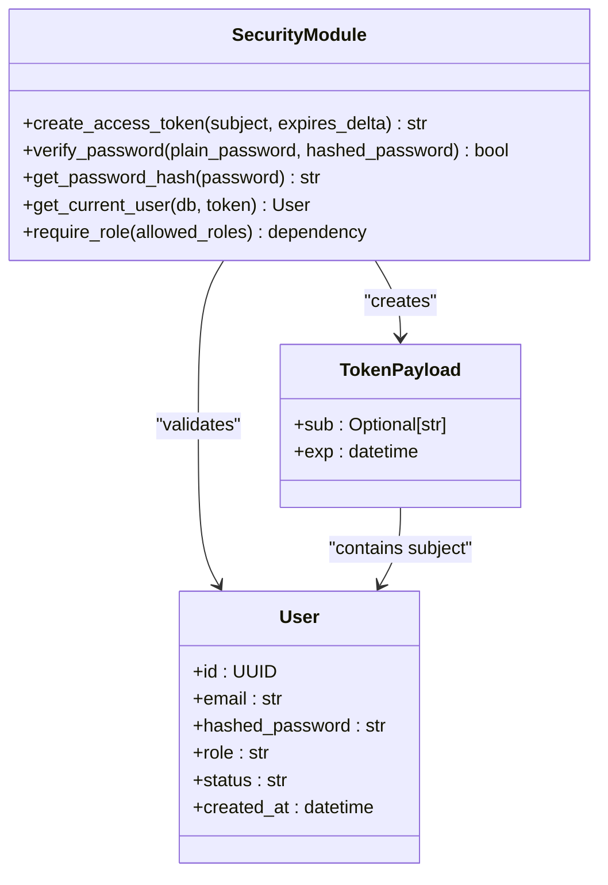
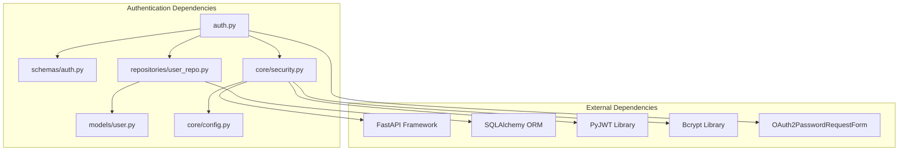

# Authentication & Authorization API

<cite>
**Referenced Files in This Document**
- [auth.py](file://backend/app/api/auth.py)
- [auth.py](file://backend/app/schemas/auth.py)
- [security.py](file://backend/app/core/security.py)
- [user.py](file://backend/app/models/user.py)
- [oauth.py](file://backend/app/core/oauth.py)
- [config.py](file://backend/app/core/config.py)
- [main.py](file://backend/app/main.py)
- [user_repo.py](file://backend/app/repositories/user_repo.py)
- [test_auth_routes.py](file://backend/tests/test_auth_routes.py)
</cite>

## Table of Contents
1. [Introduction](#introduction)
2. [Project Structure](#project-structure)
3. [Core Components](#core-components)
4. [Architecture Overview](#architecture-overview)
5. [Detailed Component Analysis](#detailed-component-analysis)
6. [Dependency Analysis](#dependency-analysis)
7. [Performance Considerations](#performance-considerations)
8. [Troubleshooting Guide](#troubleshooting-guide)
9. [Conclusion](#conclusion)
10. [Appendices](#appendices)

## Introduction
This document provides comprehensive API documentation for authentication and authorization endpoints, focusing on user registration, login, JWT token management, and OAuth2 integration. It covers:
- POST /api/v1/auth/register for user creation with email validation, password hashing, and role assignment
- POST /api/v1/auth/login for credential verification, JWT token generation, and OAuth2PasswordRequestForm handling
- Request/response schemas using UserRegisterSchema, Token, and UserResponse models
- Error handling for duplicate emails, invalid credentials, and deactivated accounts
- JWT token structure, expiration handling, and bearer token usage
- Security considerations including bcrypt hashing, input validation, and account status checks
- Client implementation guidelines for JavaScript/Python with token storage and automatic header injection

## Project Structure
The authentication system is implemented as a FastAPI application with modular components:
- API routes defined in the auth module
- Pydantic schemas for request/response validation
- Core security functions for JWT and password operations
- Database models and repositories for data persistence
- OAuth2 configuration for third-party providers

**Diagram sources**
- [auth.py:13-90](file://backend/app/api/auth.py#L13-L90)
- [user_repo.py:9-40](file://backend/app/repositories/user_repo.py#L9-L40)
- [security.py:19-177](file://backend/app/core/security.py#L19-L177)
- [user.py:10-28](file://backend/app/models/user.py#L10-L28)

**Section sources**
- [main.py:59-63](file://backend/app/main.py#L59-L63)
- [auth.py:13-90](file://backend/app/api/auth.py#L13-L90)

## Core Components

### Authentication Endpoints
The authentication system provides two primary endpoints for user management and access control.

#### Registration Endpoint
- **Method**: POST
- **Path**: /api/v1/auth/register
- **Purpose**: Create new user accounts with email validation and secure password storage
- **Request Body**: UserRegisterSchema containing email and password fields
- **Response**: Success message upon successful registration

#### Login Endpoint  
- **Method**: POST
- **Path**: /api/v1/auth/login
- **Purpose**: Authenticate users and issue JWT tokens
- **Request Body**: OAuth2PasswordRequestForm (username/email and password)
- **Response**: Token object containing access_token and token_type

### Data Models and Schemas
The system uses Pydantic models for request/response validation and serialization.

**Section sources**
- [auth.py:15-90](file://backend/app/api/auth.py#L15-L90)
- [auth.py:11-35](file://backend/app/schemas/auth.py#L11-L35)

## Architecture Overview

**Diagram sources**
- [auth.py:15-90](file://backend/app/api/auth.py#L15-L90)
- [user_repo.py:16-40](file://backend/app/repositories/user_repo.py#L16-L40)
- [security.py:28-51](file://backend/app/core/security.py#L28-L51)

## Detailed Component Analysis

### Registration Process
The registration endpoint implements comprehensive user validation and secure account creation.

**Diagram sources**
- [auth.py:15-40](file://backend/app/api/auth.py#L15-L40)
- [security.py:35-40](file://backend/app/core/security.py#L35-L40)

### Login Process
The login endpoint handles credential verification and JWT token generation.

**Diagram sources**
- [auth.py:41-90](file://backend/app/api/auth.py#L41-L90)
- [security.py:28-33](file://backend/app/core/security.py#L28-L33)

### JWT Token Management
The security module handles JWT token creation, validation, and user authentication.

**Diagram sources**
- [security.py:42-93](file://backend/app/core/security.py#L42-L93)
- [user.py:10-28](file://backend/app/models/user.py#L10-L28)
- [auth.py:29-35](file://backend/app/schemas/auth.py#L29-L35)

**Section sources**
- [auth.py:15-90](file://backend/app/api/auth.py#L15-L90)
- [security.py:42-93](file://backend/app/core/security.py#L42-L93)
- [user.py:10-28](file://backend/app/models/user.py#L10-L28)

## Dependency Analysis

**Diagram sources**
- [auth.py:1-12](file://backend/app/api/auth.py#L1-12)
- [security.py:1-18](file://backend/app/core/security.py#L1-18)
- [user_repo.py:1-8](file://backend/app/repositories/user_repo.py#L1-8)

**Section sources**
- [auth.py:1-12](file://backend/app/api/auth.py#L1-12)
- [security.py:1-18](file://backend/app/core/security.py#L1-18)

## Performance Considerations

### Password Hashing Optimization
- Uses bcrypt with automatic salt generation for secure password hashing
- Implements 72-byte truncation to comply with bcrypt limitations while maintaining security
- Asynchronous database operations prevent blocking during user lookups

### JWT Token Efficiency
- Short-lived access tokens (default 7 days) reduce security risks
- Stateless token validation eliminates database queries for each protected endpoint
- Efficient payload structure with minimal claims

### Database Query Optimization
- Indexed email column for fast user lookups
- Single query per authentication operation
- Connection pooling through async SQLAlchemy engine

## Troubleshooting Guide

### Common Registration Errors
- **Duplicate Email**: Returns 400 status with "Email already registered" message
- **Invalid Email Format**: Validation error from EmailStr schema
- **Password Too Short**: Minimum 6 characters required by schema validation

### Common Login Errors  
- **Invalid Credentials**: Returns 400 status with "Incorrect email or password" message
- **Deactivated Account**: Returns 403 status with "User account is deactivated" message
- **Missing Fields**: OAuth2 form validation errors

### JWT Authentication Issues
- **Expired Token**: Automatic rejection by JWT decoder
- **Invalid Signature**: Secret key mismatch causes decode failure
- **Malformed Token**: Missing or corrupted token format

**Section sources**
- [auth.py:18-39](file://backend/app/api/auth.py#L18-L39)
- [auth.py:52-71](file://backend/app/api/auth.py#L52-L71)
- [security.py:58-93](file://backend/app/core/security.py#L58-L93)

## Conclusion
The authentication system provides a robust foundation for user management and access control. The implementation follows security best practices with bcrypt password hashing, JWT token management, and comprehensive input validation. The modular architecture allows for easy extension with additional OAuth2 providers and enhanced security features.

## Appendices

### API Endpoint Reference

#### POST /api/v1/auth/register
Creates a new user account with validated email and secure password storage.

**Request Schema (UserRegisterSchema)**:
- email: string (validated email format)
- password: string (minimum 6 characters, maximum 200 characters)

**Success Response**: 
- HTTP 201 Created
- Body: {"success": true, "message": "User registered successfully"}

**Error Responses**:
- HTTP 400 Bad Request: Duplicate email or validation errors
- HTTP 422 Unprocessable Entity: Invalid request body

#### POST /api/v1/auth/login  
Authenticates user credentials and returns JWT access token.

**Request Schema (OAuth2PasswordRequestForm)**:
- username: string (email address)
- password: string

**Success Response**:
- HTTP 200 OK  
- Body: {"access_token": "jwt_token_string", "token_type": "bearer"}

**Error Responses**:
- HTTP 400 Bad Request: Invalid credentials
- HTTP 403 Forbidden: Deactivated account

### JWT Token Structure
Access tokens contain the following claims:
- sub: User ID (UUID string)
- exp: Expiration timestamp (UTC)
- iat: Issued at timestamp (UTC)

### Security Headers
Production deployments include security headers:
- Strict-Transport-Security
- X-Frame-Options: DENY
- X-Content-Type-Options: nosniff
- X-XSS-Protection: 1; mode=block
- Referrer-Policy: strict-origin-when-cross-origin

### OAuth2 Integration
The system supports Google and GitHub OAuth2 providers when configured with appropriate client credentials. Provider registration is conditional based on environment variables.

**Section sources**
- [auth.py:15-90](file://backend/app/api/auth.py#L15-L90)
- [auth.py:11-35](file://backend/app/schemas/auth.py#L11-L35)
- [security.py:42-51](file://backend/app/core/security.py#L42-L51)
- [oauth.py:17-41](file://backend/app/core/oauth.py#L17-L41)
- [main.py:42-57](file://backend/app/main.py#L42-L57)