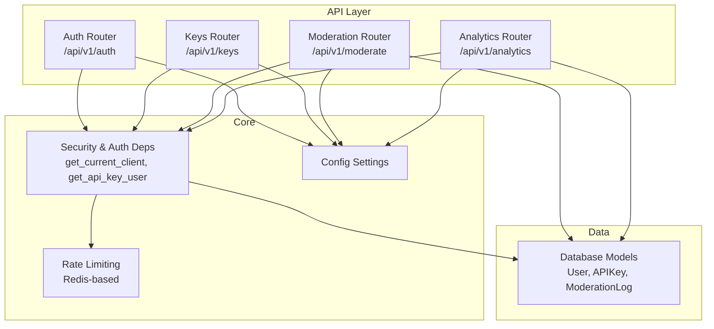
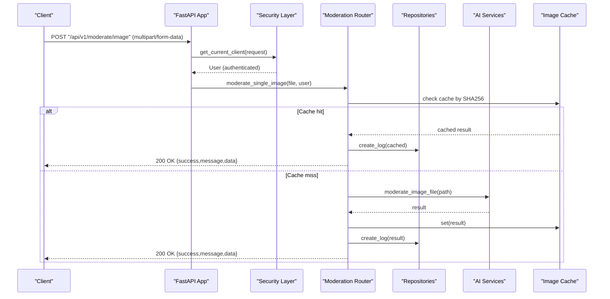
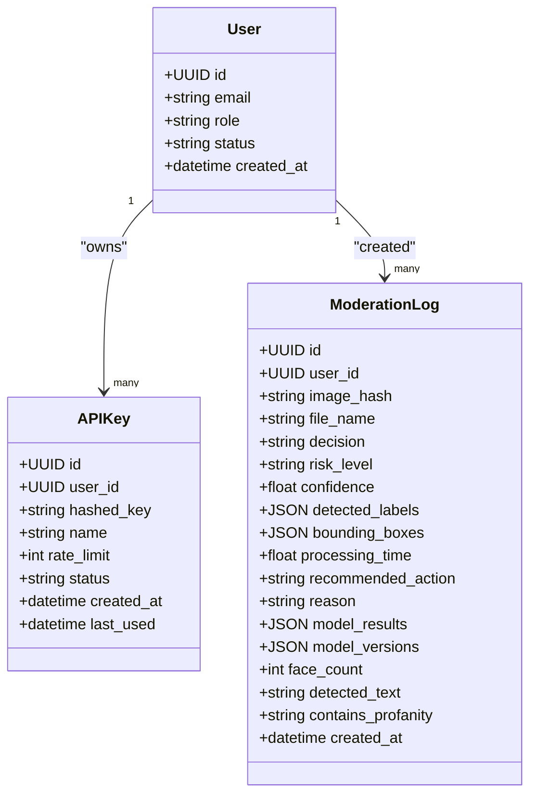

# Backend API Reference

<cite>
**Referenced Files in This Document**
- [main.py](file://backend/app/main.py)
- [auth.py](file://backend/app/api/auth.py)
- [keys.py](file://backend/app/api/keys.py)
- [moderate.py](file://backend/app/api/moderate.py)
- [analytics.py](file://backend/app/api/analytics.py)
- [security.py](file://backend/app/core/security.py)
- [config.py](file://backend/app/core/config.py)
- [rate_limit.py](file://backend/app/core/rate_limit.py)
- [advanced_rate_limit.py](file://backend/app/core/advanced_rate_limit.py)
- [auth.py](file://backend/app/schemas/auth.py)
- [moderate.py](file://backend/app/schemas/moderate.py)
- [video.py](file://backend/app/schemas/video.py)
- [key.py](file://backend/app/schemas/key.py)
- [user.py](file://backend/app/models/user.py)
- [key.py](file://backend/app/models/key.py)
- [log.py](file://backend/app/models/log.py)
</cite>

## Table of Contents
1. Introduction
2. Project Structure
3. Core Components
4. Architecture Overview
5. Detailed Component Analysis
6. Dependency Analysis
7. Performance Considerations
8. Troubleshooting Guide
9. Conclusion
10. Appendices

## Introduction
This document provides comprehensive API documentation for the OmniShield backend RESTful endpoints, focusing on authentication, content moderation (images and video), analytics, and management interfaces. It covers HTTP methods, URL patterns, request/response schemas, JWT token management, API key administration, rate limiting headers, error handling strategies, and client implementation guidelines with examples.

## Project Structure
The backend is a FastAPI application organized by feature modules:
- Authentication and authorization under /api/v1/auth
- API key management under /api/v1/keys
- Content moderation (images, batch, video) under /api/v1/moderate
- Analytics and reporting under /api/v1/analytics
- Security utilities, configuration, and rate limiting in core
- Pydantic schemas define request/response contracts
- SQLAlchemy models represent persistent entities

**Diagram sources**
- [main.py:59-63](file://backend/app/main.py#L59-L63)
- [security.py:153-176](file://backend/app/core/security.py#L153-L176)
- [config.py:13-16](file://backend/app/core/config.py#L13-L16)
- [rate_limit.py:7-44](file://backend/app/core/rate_limit.py#L7-L44)
- [user.py:10-28](file://backend/app/models/user.py#L10-L28)
- [key.py:9-23](file://backend/app/models/key.py#L9-L23)
- [log.py:13-51](file://backend/app/models/log.py#L13-L51)

**Section sources**
- [main.py:9-24](file://backend/app/main.py#L9-L24)
- [main.py:59-63](file://backend/app/main.py#L59-L63)
- [config.py:13-16](file://backend/app/core/config.py#L13-L16)

## Core Components
- Authentication: User registration and login returning JWT bearer tokens; role checks and account status validation.
- API Key Management: Create, list, and revoke API keys with per-key rate limits.
- Moderation: Single image moderation, comprehensive multi-model analysis, batch processing via Celery, and asynchronous video moderation with polling.
- Analytics: Dashboard stats, paginated history, and time series data.
- Security: Dual auth support (JWT Bearer and X-API-Key), password hashing, token decoding, and user resolution.
- Rate Limiting: Redis-backed per-minute counters with graceful degradation and structured 429 responses.

**Section sources**
- [auth.py:15-90](file://backend/app/api/auth.py#L15-L90)
- [keys.py:14-87](file://backend/app/api/keys.py#L14-L87)
- [moderate.py:223-615](file://backend/app/api/moderate.py#L223-L615)
- [analytics.py:14-70](file://backend/app/api/analytics.py#L14-L70)
- [security.py:28-93](file://backend/app/core/security.py#L28-L93)
- [security.py:119-176](file://backend/app/core/security.py#L119-L176)
- [rate_limit.py:7-44](file://backend/app/core/rate_limit.py#L7-L44)

## Architecture Overview
The API exposes versioned routes under /api/v1. Requests are authenticated either via Authorization: Bearer <JWT> or X-API-Key header. The security layer resolves the current user, enforces rate limits, and delegates to routers that interact with repositories and services.

**Diagram sources**
- [moderate.py:223-378](file://backend/app/api/moderate.py#L223-L378)
- [security.py:153-176](file://backend/app/core/security.py#L153-L176)

## Detailed Component Analysis

### Authentication Endpoints
Base path: /api/v1/auth

- Register
  - Method: POST
  - Path: /api/v1/auth/register
  - Request body: JSON with email and password fields
  - Response: success message
  - Notes: Validates uniqueness of email; hashes password before storage

- Login
  - Method: POST
  - Path: /api/v1/auth/login
  - Request: OAuth2-compatible form (username=email, password)
  - Response: Token object with access_token and token_type=bearer
  - Notes: Verifies credentials, active account status, returns JWT

Authentication Methods
- JWT Bearer: Include Authorization: Bearer <token> in subsequent requests
- API Key: Include X-API-Key: <key> in subsequent requests
- Token lifecycle: Expiration configured via settings; decode validates subject and existence of user

Example curl commands
- Register
  - curl -X POST https://api.example.com/api/v1/auth/register -H "Content-Type: application/json" -d '{"email":"user@example.com","password":"SecurePass123"}'
- Login
  - curl -X POST https://api.example.com/api/v1/auth/login -H "Content-Type: application/x-www-form-urlencoded" -d "username=user@example.com&password=SecurePass123"

Error handling
- 400 Bad Request: Invalid credentials, duplicate email, malformed input
- 403 Forbidden: Inactive/deactivated account
- 401 Unauthorized: Missing or invalid credentials

Security considerations
- Passwords hashed with bcrypt
- JWT signed with HS256 using secret from config
- Account status enforced at login and during token validation

**Section sources**
- [auth.py:15-40](file://backend/app/api/auth.py#L15-L40)
- [auth.py:41-90](file://backend/app/api/auth.py#L41-L90)
- [security.py:42-93](file://backend/app/core/security.py#L42-L93)
- [auth.py:7-35](file://backend/app/schemas/auth.py#L7-L35)

### API Key Management Endpoints
Base path: /api/v1/keys

- Create Key
  - Method: POST
  - Path: /api/v1/keys/
  - Request body: name (string), rate_limit (int, 1..10000)
  - Response: key_details (metadata) and raw_key (returned once)
  - Notes: Per-key rate limit applied at runtime

- List Keys
  - Method: GET
  - Path: /api/v1/keys/
  - Response: array of key metadata (no raw key)

- Revoke Key
  - Method: DELETE
  - Path: /api/v1/keys/{key_id}
  - Response: revoked key metadata
  - Notes: Ownership check enforced; admin can revoke any key

Example curl commands
- Create
  - curl -X POST https://api.example.com/api/v1/keys/ -H "Authorization: Bearer <jwt>" -H "Content-Type: application/json" -d '{"name":"prod-service","rate_limit":120}'
- List
  - curl -X GET https://api.example.com/api/v1/keys/ -H "Authorization: Bearer <jwt>"
- Revoke
  - curl -X DELETE https://api.example.com/api/v1/keys/<key_id> -H "Authorization: Bearer <jwt>"

Error handling
- 401 Unauthorized: Missing or invalid credentials
- 403 Forbidden: Not authorized to manage this key
- 404 Not Found: Key not found
- 500 Internal Server Error: Unexpected failures

Security considerations
- Keys stored hashed; only raw key returned upon creation
- Rate limiting enforced per key identifier

**Section sources**
- [keys.py:14-87](file://backend/app/api/keys.py#L14-L87)
- [key.py:7-25](file://backend/app/schemas/key.py#L7-L25)
- [key.py:9-23](file://backend/app/models/key.py#L9-L23)
- [security.py:119-150](file://backend/app/core/security.py#L119-L150)

### Moderation Endpoints
Base path: /api/v1/moderate

- Single Image Moderation
  - Method: POST
  - Path: /api/v1/moderate/image
  - Request: multipart/form-data with file field
  - Allowed extensions: .jpg, .jpeg, .png, .webp
  - Max size: configurable (default 10MB)
  - Response: decision, risk_level, confidence, detected_labels, bounding_boxes, processing_time, recommended_action, reason, cached flag
  - Notes: Validates magic bytes, caches results by SHA256, logs transaction

- Comprehensive Multi-Model Image Moderation
  - Method: POST
  - Path: /api/v1/moderate/image/comprehensive
  - Query params: enable_nsfw, enable_violence, enable_weapons, enable_faces, enable_text (booleans)
  - Request: multipart/form-data with file field
  - Response: same base fields plus categories, model_versions, face_count, detected_text, contains_profanity
  - Notes: Runs multiple AI models asynchronously; enhanced metadata persisted

- Batch Image Moderation
  - Method: POST
  - Path: /api/v1/moderate/batch
  - Request body: JSON array of URLs
  - Response: task_id, status=PENDING, total_images, message
  - Polling: GET /api/v1/moderate/tasks/{task_id} returns status and result when ready

- Video Moderation
  - Method: POST
  - Path: /api/v1/moderate/video
  - Request: multipart/form-data with file field
  - Allowed extensions: .mp4, .avi, .mov, .webm, .mkv
  - Max size: configurable (default 100MB)
  - Optional query param: frame_interval_seconds (must be > 0)
  - Response: job_id, status, filename, message, status_url
  - Polling: GET /api/v1/moderate/video/{job_id} returns aggregated results and optional frame flags

Example curl commands
- Single image
  - curl -X POST https://api.example.com/api/v1/moderate/image -H "Authorization: Bearer <jwt>" -F "file=@image.jpg"
- Comprehensive
  - curl -X POST "https://api.example.com/api/v1/moderate/image/comprehensive?enable_nsfw=true&enable_violence=true&enable_weapons=true&enable_faces=true&enable_text=true" -H "Authorization: Bearer <jwt>" -F "file=@image.png"
- Batch
  - curl -X POST https://api.example.com/api/v1/moderate/batch -H "Authorization: Bearer <jwt>" -H "Content-Type: application/json" -d '["https://example.com/img1.jpg","https://example.com/img2.jpg"]'
- Video
  - curl -X POST "https://api.example.com/api/v1/moderate/video?frame_interval_seconds=2.0" -H "Authorization: Bearer <jwt>" -F "file=@clip.mp4"
- Poll batch
  - curl -X GET https://api.example.com/api/v1/moderate/tasks/<task_id> -H "Authorization: Bearer <jwt>"
- Poll video
  - curl -X GET https://api.example.com/api/v1/moderate/video/<job_id> -H "Authorization: Bearer <jwt>"

Error handling
- 400 Bad Request: Unsupported extension, empty file, invalid parameters, spoofed signatures
- 413 Request Entity Too Large: File exceeds configured maximum
- 404 Not Found: Job/task not found
- 403 Forbidden: Unauthorized access to job
- 500 Internal Server Error: Inference pipeline or server errors

Security considerations
- Magic number validation prevents extension spoofing
- Size limits enforced during streaming write
- Temporary files cleaned up after processing
- Access control ensures users can only view their own jobs unless admin

**Section sources**
- [moderate.py:32-61](file://backend/app/api/moderate.py#L32-L61)
- [moderate.py:223-378](file://backend/app/api/moderate.py#L223-L378)
- [moderate.py:446-615](file://backend/app/api/moderate.py#L446-L615)
- [moderate.py:380-444](file://backend/app/api/moderate.py#L380-L444)
- [moderate.py:85-221](file://backend/app/api/moderate.py#L85-L221)
- [moderate.py:10-31](file://backend/app/schemas/moderate.py#L10-L31)
- [video.py:8-54](file://backend/app/schemas/video.py#L8-L54)

### Analytics Endpoints
Base path: /api/v1/analytics

- Dashboard Stats
  - Method: GET
  - Path: /api/v1/analytics/stats
  - Response: aggregated metrics (admin sees global; clients see own)

- Scans History
  - Method: GET
  - Path: /api/v1/analytics/history
  - Query params: limit (default 50), offset (default 0)
  - Response: paginated list of moderation logs

- Time Series Data
  - Method: GET
  - Path: /api/v1/analytics/timeseries
  - Query params: days (1..90, default 7)
  - Response: time series points for charts

Example curl commands
- Stats
  - curl -X GET https://api.example.com/api/v1/analytics/stats -H "Authorization: Bearer <jwt>"
- History
  - curl -X GET "https://api.example.com/api/v1/analytics/history?limit=100&offset=0" -H "Authorization: Bearer <jwt>"
- Timeseries
  - curl -X GET "https://api.example.com/api/v1/analytics/timeseries?days=30" -H "Authorization: Bearer <jwt>"

Error handling
- 500 Internal Server Error: Database or repository failures

Access control
- Admins retrieve global metrics; clients restricted to their own data

**Section sources**
- [analytics.py:14-70](file://backend/app/api/analytics.py#L14-L70)

## Dependency Analysis
- Routers depend on security dependencies for authentication and authorization.
- Moderation endpoints rely on repositories for logging and caching for performance.
- Configuration drives allowed extensions, sizes, thresholds, and feature toggles.
- Rate limiting uses Redis for windowed counting; advanced limiter supports IP-based constraints.

**Diagram sources**
- [user.py:10-28](file://backend/app/models/user.py#L10-L28)
- [key.py:9-23](file://backend/app/models/key.py#L9-L23)
- [log.py:13-51](file://backend/app/models/log.py#L13-L51)

**Section sources**
- [security.py:153-176](file://backend/app/core/security.py#L153-L176)
- [config.py:53-86](file://backend/app/core/config.py#L53-L86)
- [rate_limit.py:7-44](file://backend/app/core/rate_limit.py#L7-L44)
- [advanced_rate_limit.py:16-21](file://backend/app/core/advanced_rate_limit.py#L16-L21)

## Performance Considerations
- Image caching: Results cached by SHA256 to avoid redundant inference; reduces latency and compute cost.
- Asynchronous processing: Video moderation queued and polled; batch tasks use Celery for scalability.
- Streaming uploads: Files streamed to disk with size checks to prevent memory spikes.
- Rate limiting: Redis-based counters provide precise per-minute throttling with graceful fallback.
- Model toggles: Feature flags allow enabling/disabling specific models to optimize throughput.

[No sources needed since this section provides general guidance]

## Troubleshooting Guide
Common issues and resolutions:
- 401 Unauthorized: Ensure Authorization header format is correct or provide valid X-API-Key. Verify token expiration and user status.
- 403 Forbidden: Check ownership permissions for resources or insufficient roles.
- 400 Bad Request: Validate file extensions, ensure non-empty payloads, and confirm parameter ranges.
- 413 Request Entity Too Large: Reduce file size below configured limits.
- 429 Too Many Requests: Respect Retry-After header and backoff strategy; verify per-key rate limits.
- 500 Internal Server Error: Review server logs for inference pipeline or database errors.

Rate limit response example
- Status: 429
- Body includes retry_after and limit details
- Headers include Retry-After and X-RateLimit-* fields

**Section sources**
- [rate_limit.py:29-44](file://backend/app/core/rate_limit.py#L29-L44)
- [advanced_rate_limit.py:24-49](file://backend/app/core/advanced_rate_limit.py#L24-L49)

## Conclusion
OmniShield’s backend offers robust authentication, flexible moderation capabilities across images and video, scalable batch processing, and comprehensive analytics. With dual authentication mechanisms, strict input validation, and efficient caching, it balances security and performance. Clients should implement proper error handling, respect rate limits, and leverage polling for asynchronous operations.

[No sources needed since this section summarizes without analyzing specific files]

## Appendices

### Request/Response Schemas Summary
- Authentication
  - Token: access_token (string), token_type (string="bearer")
- Moderation
  - ModerationResponse: success (bool), message (string), data (object with decision, risk_level, confidence, detected_labels, bounding_boxes, processing_time, recommended_action, reason, cached)
  - BatchTaskResponse: task_id (string), status (string), total_images (int), message (string)
  - VideoModerationJobResponse: job_id (UUID), status (string), filename (string), message (string), status_url (string)
  - VideoModerationStatusResponse: success (bool), message (string), data (aggregated status and optional frame_flags)
- API Keys
  - APIKeyCreate: name (string), rate_limit (int)
  - APIKeyResponse: id (UUID), name (string), rate_limit (int), status (string), created_at (datetime), last_used (datetime?)
  - APIKeyNewResponse: key_details (APIKeyResponse), raw_key (string)

**Section sources**
- [auth.py:29-35](file://backend/app/schemas/auth.py#L29-L35)
- [moderate.py:10-31](file://backend/app/schemas/moderate.py#L10-L31)
- [video.py:8-54](file://backend/app/schemas/video.py#L8-L54)
- [key.py:7-25](file://backend/app/schemas/key.py#L7-L25)

### Client Implementation Guidelines
- JavaScript (fetch)
  - Single image moderation
    - const formData = new FormData(); formData.append("file", file); await fetch("/api/v1/moderate/image", { method: "POST", headers: { "Authorization": `Bearer ${token}` }, body: formData });
  - Comprehensive moderation
    - Add query params enable_nsfw, enable_violence, etc., and send multipart/form-data with file.
  - Batch moderation
    - Send JSON array of URLs; poll /api/v1/moderate/tasks/{task_id}.
  - Video moderation
    - Upload video; poll /api/v1/moderate/video/{job_id}.
- Python (requests)
  - Single image moderation
    - import requests; r = requests.post("/api/v1/moderate/image", headers={"Authorization": f"Bearer {token}"}, files={"file": open("image.jpg","rb")})
  - Comprehensive moderation
    - Use params for model toggles and upload file similarly.
  - Batch moderation
    - payload = {"urls": ["..."]}; r = requests.post("/api/v1/moderate/batch", json=payload, headers={"Authorization": f"Bearer {token}"}); then poll task endpoint.
  - Video moderation
    - Upload video; poll status endpoint.

Performance optimization tips
- Implement client-side retries with exponential backoff for 429 responses.
- Cache repeated image hashes locally if appropriate to reduce network calls.
- Use connection pooling and keep-alive for high-throughput scenarios.
- Prefer comprehensive moderation only when necessary due to higher compute cost.

Security best practices
- Store tokens securely and rotate them regularly.
- Keep API keys confidential; revoke immediately if compromised.
- Enforce HTTPS and validate server certificates.
- Apply least privilege: restrict CORS origins and enforce role-based access where applicable.

**Section sources**
- [moderate.py:223-378](file://backend/app/api/moderate.py#L223-L378)
- [moderate.py:446-615](file://backend/app/api/moderate.py#L446-L615)
- [moderate.py:380-444](file://backend/app/api/moderate.py#L380-L444)
- [moderate.py:85-221](file://backend/app/api/moderate.py#L85-L221)
- [security.py:153-176](file://backend/app/core/security.py#L153-L176)
- [rate_limit.py:29-44](file://backend/app/core/rate_limit.py#L29-L44)