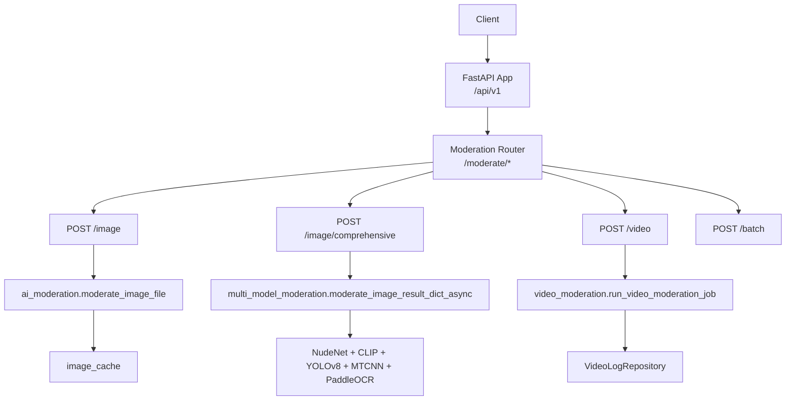
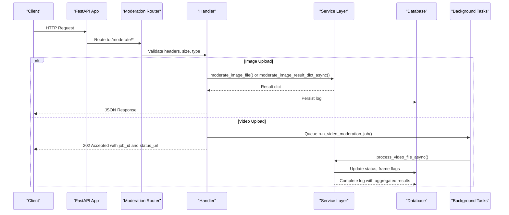

# Content Moderation API

<cite>
**Referenced Files in This Document**
- [main.py](file://backend/app/main.py)
- [moderate.py](file://backend/app/api/moderate.py)
- [config.py](file://backend/app/core/config.py)
- [ai_moderation.py](file://backend/app/services/ai_moderation.py)
- [multi_model_moderation.py](file://backend/app/services/multi_model_moderation.py)
- [video_moderation.py](file://backend/app/services/video_moderation.py)
- [moderate.py (schemas)](file://backend/app/schemas/moderate.py)
- [video.py (schemas)](file://backend/app/schemas/video.py)
</cite>

## Table of Contents
1. [Introduction](#introduction)
2. [Project Structure](#project-structure)
3. [Core Components](#core-components)
4. [Architecture Overview](#architecture-overview)
5. [Detailed Component Analysis](#detailed-component-analysis)
6. [Dependency Analysis](#dependency-analysis)
7. [Performance Considerations](#performance-considerations)
8. [Troubleshooting Guide](#troubleshooting-guide)
9. [Conclusion](#conclusion)
10. [Appendices](#appendices)

## Introduction
This document provides comprehensive API documentation for the content moderation endpoints focused on image analysis, multi-model detection, video processing, and batch operations. It covers:
- Single image moderation with file upload handling, format validation, and NSFW detection
- Comprehensive multi-model analysis including NudeNet NSFW, CLIP violence, YOLOv8 weapons, MTCNN faces, and PaddleOCR text moderation
- Video processing with frame extraction, background task queuing, and progress tracking
- Batch operations via asynchronous task queueing
- Request/response schemas, curl examples, performance considerations, and error handling

## Project Structure
The backend is a FastAPI application that exposes moderation endpoints under /api/v1/moderate. Core components include:
- API router for moderation endpoints
- Services for single-image moderation, multi-model moderation, and video moderation
- Pydantic schemas for request/response models
- Configuration for allowed formats, sizes, thresholds, and feature flags



**Diagram sources**
- [main.py:59-63](file://backend/app/main.py#L59-L63)
- [moderate.py:23-29](file://backend/app/api/moderate.py#L23-L29)
- [ai_moderation.py:148-275](file://backend/app/services/ai_moderation.py#L148-L275)
- [multi_model_moderation.py:532-732](file://backend/app/services/multi_model_moderation.py#L532-L732)
- [video_moderation.py:238-254](file://backend/app/services/video_moderation.py#L238-L254)

**Section sources**
- [main.py:1-126](file://backend/app/main.py#L1-L126)
- [moderate.py:1-615](file://backend/app/api/moderate.py#L1-L615)
- [config.py:1-148](file://backend/app/core/config.py#L1-L148)

## Core Components
- Image moderation service: Validates uploads, checks cache, runs NudeNet-based NSFW detection, persists logs, and returns structured results.
- Multi-model moderation service: Orchestrates parallel execution of multiple detectors (NSFW, violence, weapons, faces, text), aggregates results, and computes risk levels.
- Video moderation service: Extracts frames at configurable intervals, runs multi-model moderation per frame concurrently, aggregates flags, and updates job status.
- Schemas: Define response structures for moderation results and video jobs/status.

Key behaviors:
- File validation via magic bytes to prevent extension spoofing
- Size limits enforced during streaming writes
- Background processing for videos using FastAPI BackgroundTasks
- Asynchronous model execution via asyncio.gather with ThreadPoolExecutor

**Section sources**
- [moderate.py:223-378](file://backend/app/api/moderate.py#L223-L378)
- [moderate.py:446-615](file://backend/app/api/moderate.py#L446-L615)
- [moderate.py:85-189](file://backend/app/api/moderate.py#L85-L189)
- [ai_moderation.py:148-275](file://backend/app/services/ai_moderation.py#L148-L275)
- [multi_model_moderation.py:532-732](file://backend/app/services/multi_model_moderation.py#L532-L732)
- [video_moderation.py:89-236](file://backend/app/services/video_moderation.py#L89-L236)
- [moderate.py (schemas):1-31](file://backend/app/schemas/moderate.py#L1-L31)
- [video.py (schemas):1-54](file://backend/app/schemas/video.py#L1-L54)

## Architecture Overview
The moderation system integrates multiple AI models and services behind a unified API surface. Requests are validated, routed to appropriate handlers, and processed either synchronously (images) or asynchronously (videos). Results are cached where applicable and persisted to the database.



**Diagram sources**
- [moderate.py:85-189](file://backend/app/api/moderate.py#L85-L189)
- [moderate.py:223-378](file://backend/app/api/moderate.py#L223-L378)
- [moderate.py:446-615](file://backend/app/api/moderate.py#L446-L615)
- [video_moderation.py:238-254](file://backend/app/services/video_moderation.py#L238-L254)

## Detailed Component Analysis

### POST /api/v1/moderate/image
Single image moderation with file upload handling, format validation, and basic NSFW detection.

- Path: /api/v1/moderate/image
- Method: POST
- Authentication: Required (JWT Bearer or API Key)
- Request:
  - multipart/form-data
  - Field: file (required)
  - Supported formats: JPEG (.jpg/.jpeg), PNG (.png), WebP (.webp)
  - Max size: configured by settings.MAX_FILE_SIZE_MB
- Validation:
  - Extension check against ALLOWED_EXTENSIONS
  - Magic byte header validation for JPEG/PNG/WebP
  - Streaming write with size enforcement
- Processing:
  - Check SHA256-based cache; if hit, return cached result
  - Run NudeNet-based NSFW detection
  - Persist moderation log
- Response:
  - success: boolean
  - message: string
  - data: ModerationResponseData
    - decision: "safe" | "unsafe"
    - risk_level: "low" | "medium" | "high" | "critical"
    - confidence: float
    - detected_labels: List[str]
    - bounding_boxes: List[BoundingBoxSchema]
    - processing_time: float
    - recommended_action: "allow" | "quarantine" | "block"
    - reason: Optional[str]
    - cached: bool

Example curl:
- Basic upload:
  - curl -X POST "http://localhost:8000/api/v1/moderate/image" -H "Authorization: Bearer YOUR_TOKEN" -F "file=@image.jpg"
- Using API key:
  - curl -X POST "http://localhost:8000/api/v1/moderate/image" -H "X-API-Key: ak_..." -F "file=@image.png"

Error handling:
- 400 Bad Request: unsupported extension, invalid magic bytes, empty file
- 413 Request Entity Too Large: exceeds MAX_FILE_SIZE_MB
- 500 Internal Server Error: inference pipeline error or unexpected exception

**Section sources**
- [moderate.py:223-378](file://backend/app/api/moderate.py#L223-L378)
- [moderate.py:32-41](file://backend/app/api/moderate.py#L32-L41)
- [config.py:54-62](file://backend/app/core/config.py#L54-L62)
- [ai_moderation.py:148-275](file://backend/app/services/ai_moderation.py#L148-L275)
- [moderate.py (schemas):1-31](file://backend/app/schemas/moderate.py#L1-L31)

### POST /api/v1/moderate/image/comprehensive
Comprehensive multi-model analysis including NudeNet NSFW, CLIP violence, YOLOv8 weapons, MTCNN faces, and PaddleOCR text moderation.

- Path: /api/v1/moderate/image/comprehensive
- Method: POST
- Authentication: Required (JWT Bearer or API Key)
- Query parameters:
  - enable_nsfw: bool (default True)
  - enable_violence: bool (default True)
  - enable_weapons: bool (default True)
  - enable_faces: bool (default True)
  - enable_text: bool (default True)
- Request:
  - multipart/form-data
  - Field: file (required)
  - Supported formats: same as single image endpoint
- Validation:
  - Extension and magic byte checks
  - Size limit enforcement
- Processing:
  - Async parallel execution of enabled detectors via ThreadPoolExecutor and asyncio.gather
  - Aggregation of categories, labels, bounding boxes, and risk scores
  - Professional portrait override logic reduces false positives when one face is present and violence confidence is below threshold
- Response:
  - success: boolean
  - message: string
  - data: ModerationResponseData plus enhanced fields
    - decision, risk_level, confidence, detected_labels, bounding_boxes, processing_time, recommended_action, reason, cached
    - categories: Dict mapping each detector to its result
    - model_versions: Dict mapping category to model version
    - face_count: int
    - detected_text: Optional[str]
    - contains_profanity: "yes" | "no"

Example curl:
- Enable all models:
  - curl -X POST "http://localhost:8000/api/v1/moderate/image/comprehensive?enable_nsfw=true&enable_violence=true&enable_weapons=true&enable_faces=true&enable_text=true" -H "Authorization: Bearer YOUR_TOKEN" -F "file=@image.jpg"
- Disable specific models:
  - curl -X POST "http://localhost:8000/api/v1/moderate/image/comprehensive?enable_weapons=false&enable_text=false" -H "Authorization: Bearer YOUR_TOKEN" -F "file=@image.webp"

Error handling:
- 400 Bad Request: unsupported extension, invalid magic bytes, empty file
- 413 Request Entity Too Large: exceeds MAX_FILE_SIZE_MB
- 500 Internal Server Error: inference pipeline error or unexpected exception

**Section sources**
- [moderate.py:446-615](file://backend/app/api/moderate.py#L446-L615)
- [multi_model_moderation.py:532-732](file://backend/app/services/multi_model_moderation.py#L532-L732)
- [config.py:74-78](file://backend/app/core/config.py#L74-L78)
- [moderate.py (schemas):1-31](file://backend/app/schemas/moderate.py#L1-L31)

### POST /api/v1/moderate/video
Asynchronous video processing with frame extraction, background task queuing, and progress tracking.

- Path: /api/v1/moderate/video
- Method: POST
- Authentication: Required (JWT Bearer or API Key)
- Request:
  - multipart/form-data
  - Field: file (required)
  - Query parameter: frame_interval_seconds (optional float > 0; defaults to settings.VIDEO_FRAME_INTERVAL_SECONDS)
  - Supported formats: MP4 (.mp4), AVI (.avi), MOV (.mov), WebM (.webm), MKV (.mkv)
  - Max size: configured by settings.MAX_VIDEO_SIZE_MB
- Validation:
  - Extension check against ALLOWED_VIDEO_EXTENSIONS
  - Magic byte header validation for common containers
  - Streaming write with size enforcement
- Processing:
  - Creates pending job record
  - Queues background task run_video_moderation_job
  - Returns 202 Accepted with job_id and status_url
- Progress tracking:
  - GET /api/v1/moderate/video/{job_id}
  - Returns aggregated status, risk level, confidence, recommended action, reason, total duration, frames sampled/flagged, frame interval, processing time, error message, timestamps, and frame_flags list
- Response (queue):
  - job_id: UUID
  - status: string
  - filename: string
  - message: string
  - status_url: string
- Response (status):
  - success: boolean
  - message: string
  - data: VideoModerationStatusData
    - job_id, filename, status, overall_status, risk_level, overall_confidence, recommended_action, reason, total_duration, frames_sampled, frames_flagged, frame_interval_seconds, processing_time, error_message, created_at, completed_at, frame_flags

Example curl:
- Queue video moderation:
  - curl -X POST "http://localhost:8000/api/v1/moderate/video?frame_interval_seconds=2.0" -H "Authorization: Bearer YOUR_TOKEN" -F "file=@video.mp4"
- Poll status:
  - curl -X GET "http://localhost:8000/api/v1/moderate/video/{job_id}" -H "Authorization: Bearer YOUR_TOKEN"

Error handling:
- 400 Bad Request: unsupported extension, invalid magic bytes, empty file, invalid frame interval
- 413 Request Entity Too Large: exceeds MAX_VIDEO_SIZE_MB
- 404 Not Found: job not found
- 403 Forbidden: unauthorized to view job
- 500 Internal Server Error: failed to queue job or internal processing error

**Section sources**
- [moderate.py:85-189](file://backend/app/api/moderate.py#L85-L189)
- [moderate.py:191-221](file://backend/app/api/moderate.py#L191-L221)
- [video_moderation.py:89-236](file://backend/app/services/video_moderation.py#L89-L236)
- [video_moderation.py:238-254](file://backend/app/services/video_moderation.py#L238-L254)
- [config.py:64-68](file://backend/app/core/config.py#L64-L68)
- [video.py (schemas):1-54](file://backend/app/schemas/video.py#L1-L54)

### POST /api/v1/moderate/batch
Batch moderation of image URLs via asynchronous task queue.

- Path: /api/v1/moderate/batch
- Method: POST
- Authentication: Required (JWT Bearer or API Key)
- Request:
  - application/json
  - Body: { "urls": ["https://example.com/img1.jpg", ...] }
- Processing:
  - Sends Celery task "app.tasks.moderate_batch" with user id and urls
- Response:
  - task_id: string
  - status: "PENDING"
  - total_images: int
  - message: string
- Status polling:
  - GET /api/v1/moderate/tasks/{task_id}
  - Returns task status and result when ready

Example curl:
- Submit batch:
  - curl -X POST "http://localhost:8000/api/v1/moderate/batch" -H "Authorization: Bearer YOUR_TOKEN" -H "Content-Type: application/json" -d '{"urls":["https://example.com/a.jpg","https://example.com/b.png"]}'
- Check status:
  - curl -X GET "http://localhost:8000/api/v1/moderate/tasks/{task_id}" -H "Authorization: Bearer YOUR_TOKEN"

Error handling:
- 400 Bad Request: empty urls list
- 500 Internal Server Error: queueing failure or query failure

**Section sources**
- [moderate.py:380-443](file://backend/app/api/moderate.py#L380-L443)

## Dependency Analysis
The moderation endpoints depend on configuration, services, and repositories. The following diagram shows key relationships:

```mermaid
classDiagram
class Settings {
+ALLOWED_EXTENSIONS
+ALLOWED_VIDEO_EXTENSIONS
+MAX_FILE_SIZE_MB
+MAX_VIDEO_SIZE_MB
+VIDEO_FRAME_INTERVAL_SECONDS
+ENABLE_NSFW_DETECTION
+ENABLE_VIOLENCE_DETECTION
+ENABLE_WEAPON_DETECTION
+ENABLE_FACE_DETECTION
+ENABLE_TEXT_MODERATION
}
class ModerationRouter {
+POST /image
+POST /image/comprehensive
+POST /video
+GET /video/{job_id}
+POST /batch
+GET /tasks/{task_id}
}
class AIService {
+moderate_image_file(image_path)
}
class MultiModelService {
+moderate_image_result_dict_async(image_path, **kwargs)
}
class VideoService {
+run_video_moderation_job(video_log_id, file_path, interval)
+process_video_file_async(db, video_log_id, file_path, interval)
}
class Repositories {
+VideoLogRepository
+ModerationLogRepository
}
ModerationRouter --> AIService : "uses"
ModerationRouter --> MultiModelService : "uses"
ModerationRouter --> VideoService : "queues"
VideoService --> Repositories : "updates"
ModerationRouter --> Settings : "reads"
```

**Diagram sources**
- [config.py:54-78](file://backend/app/core/config.py#L54-L78)
- [moderate.py:23-29](file://backend/app/api/moderate.py#L23-L29)
- [ai_moderation.py:148-275](file://backend/app/services/ai_moderation.py#L148-L275)
- [multi_model_moderation.py:532-732](file://backend/app/services/multi_model_moderation.py#L532-L732)
- [video_moderation.py:89-236](file://backend/app/services/video_moderation.py#L89-L236)

**Section sources**
- [config.py:1-148](file://backend/app/core/config.py#L1-L148)
- [moderate.py:1-615](file://backend/app/api/moderate.py#L1-L615)

## Performance Considerations
- Parallel model execution:
  - Multi-model moderation uses ThreadPoolExecutor and asyncio.gather to run detectors concurrently, minimizing latency.
  - Frame-level moderation in video processing also leverages concurrent tasks for each sampled frame.
- Caching strategies:
  - Single image moderation caches results by SHA256 of the uploaded file path; comprehensive moderation currently bypasses caching for simplicity but can be extended with composite keys.
- Rate limiting:
  - Configuration includes rate limit settings; ensure middleware integration aligns with deployment environment.
- Model loading:
  - Lazy initialization prevents slow startup; GPU availability is checked and used when available.
- Resource constraints:
  - Enforced file size limits and streaming writes reduce memory pressure.
  - Temporary directories are cleaned up after processing.

[No sources needed since this section provides general guidance]

## Troubleshooting Guide
Common issues and resolutions:
- Unsupported format:
  - Ensure file extensions match ALLOWED_EXTENSIONS or ALLOWED_VIDEO_EXTENSIONS.
  - Verify magic bytes; some files may have mismatched signatures.
- Processing timeouts:
  - For large images/videos, increase client-side timeout values.
  - Adjust VIDEO_FRAME_INTERVAL_SECONDS to reduce frame count for long videos.
- Model failures:
  - Individual detectors return "error" status; comprehensive aggregation continues with other models.
  - Check logs for missing dependencies (e.g., YOLOv8, MTCNN, PaddleOCR).
- Job not found or unauthorized:
  - Confirm job_id exists and user has permission to access it.
- Exceeded size limits:
  - Reduce file size or adjust MAX_FILE_SIZE_MB/MAX_VIDEO_SIZE_MB in settings.

**Section sources**
- [moderate.py:32-61](file://backend/app/api/moderate.py#L32-L61)
- [moderate.py:85-189](file://backend/app/api/moderate.py#L85-L189)
- [moderate.py:223-378](file://backend/app/api/moderate.py#L223-L378)
- [moderate.py:446-615](file://backend/app/api/moderate.py#L446-L615)
- [video_moderation.py:226-236](file://backend/app/services/video_moderation.py#L226-L236)

## Conclusion
The Content Moderation API provides robust, scalable endpoints for single and comprehensive image moderation, asynchronous video processing, and batch operations. It integrates multiple AI models with parallel execution, caching, and persistent logging. Proper authentication, input validation, and error handling ensure reliability and security across environments.

[No sources needed since this section summarizes without analyzing specific files]

## Appendices

### Request/Response Schemas

- ModerationResponseData
  - Fields: decision, risk_level, confidence, detected_labels, bounding_boxes, processing_time, recommended_action, reason, cached
- BoundingBoxSchema
  - Fields: label, box (List[int]), score
- VideoModerationJobResponse
  - Fields: job_id, status, filename, message, status_url
- VideoModerationStatusData
  - Fields: job_id, filename, status, overall_status, risk_level, overall_confidence, recommended_action, reason, total_duration, frames_sampled, frames_flagged, frame_interval_seconds, processing_time, error_message, created_at, completed_at, frame_flags
- VideoFrameFlagSchema
  - Fields: id, timestamp_seconds, frame_index, flag_category, confidence, decision, detected_labels, created_at

**Section sources**
- [moderate.py (schemas):1-31](file://backend/app/schemas/moderate.py#L1-L31)
- [video.py (schemas):1-54](file://backend/app/schemas/video.py#L1-L54)

### Curl Examples Summary

- Single image moderation:
  - curl -X POST "http://localhost:8000/api/v1/moderate/image" -H "Authorization: Bearer YOUR_TOKEN" -F "file=@image.jpg"
- Comprehensive moderation:
  - curl -X POST "http://localhost:8000/api/v1/moderate/image/comprehensive?enable_nsfw=true&enable_violence=true&enable_weapons=true&enable_faces=true&enable_text=true" -H "Authorization: Bearer YOUR_TOKEN" -F "file=@image.png"
- Video moderation:
  - curl -X POST "http://localhost:8000/api/v1/moderate/video?frame_interval_seconds=1.0" -H "Authorization: Bearer YOUR_TOKEN" -F "file=@video.mp4"
- Batch moderation:
  - curl -X POST "http://localhost:8000/api/v1/moderate/batch" -H "Authorization: Bearer YOUR_TOKEN" -H "Content-Type: application/json" -d '{"urls":["https://example.com/a.jpg","https://example.com/b.png"]}'

**Section sources**
- [README.md:280-479](file://README.md#L280-L479)