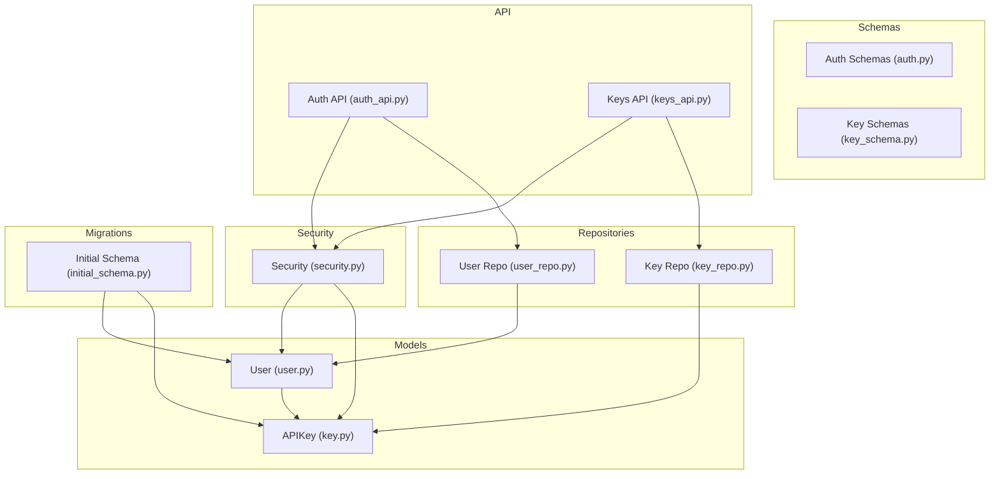
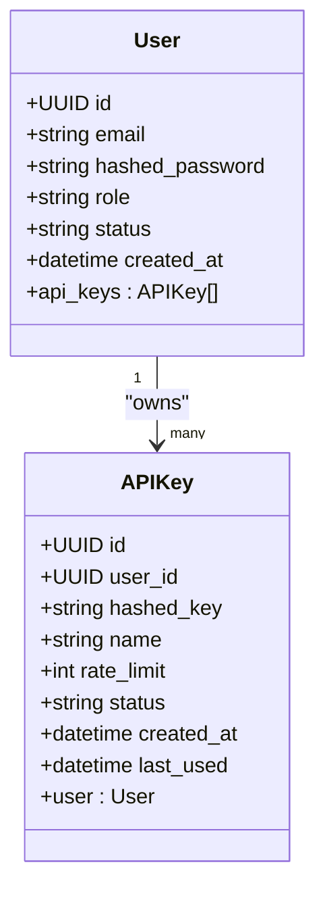
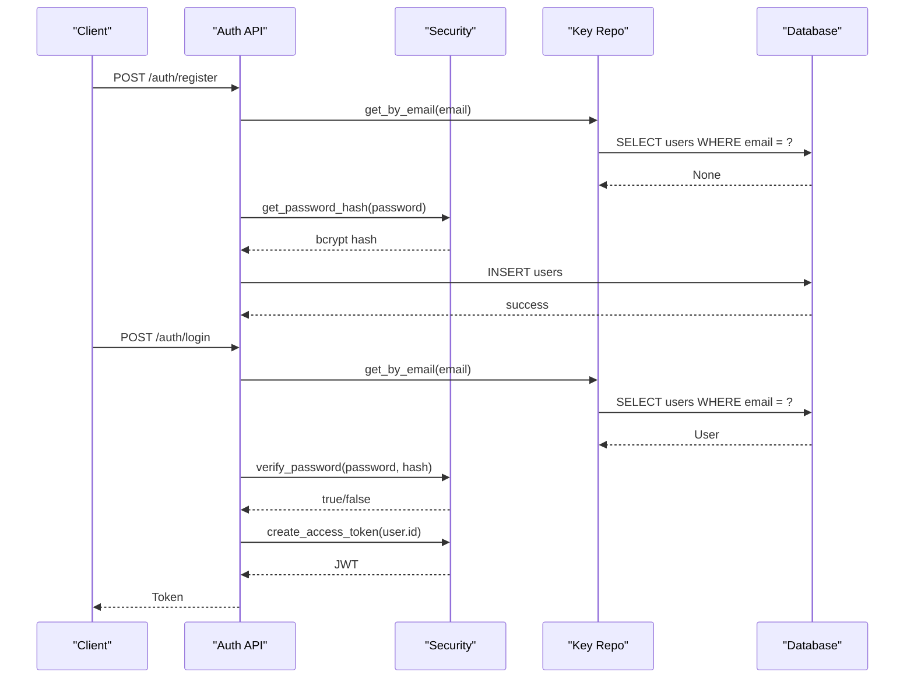
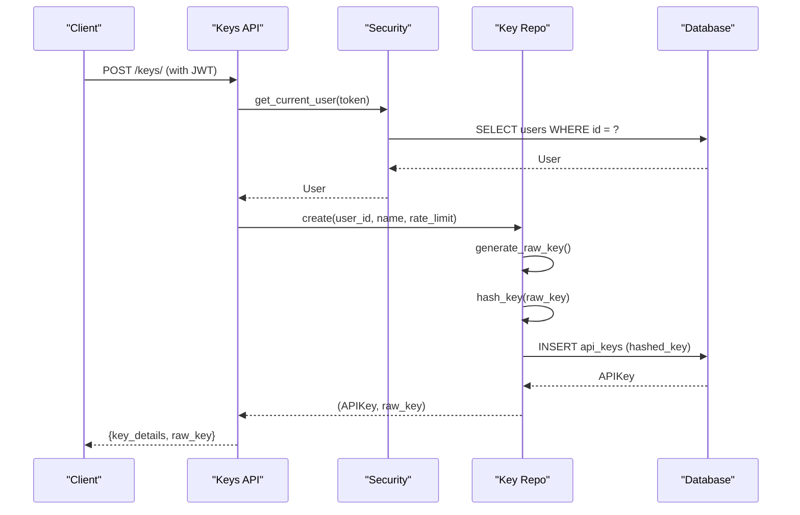
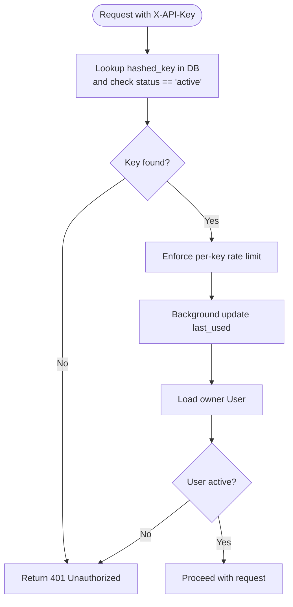
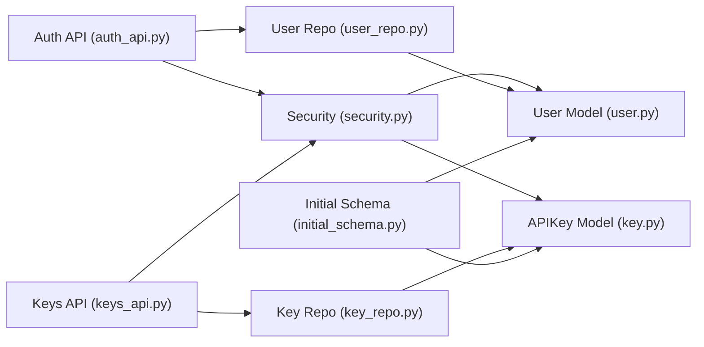

# Core Entities

<cite>
**Referenced Files in This Document**
- [user.py](file://backend/app/models/user.py)
- [key.py](file://backend/app/models/key.py)
- [auth.py](file://backend/app/schemas/auth.py)
- [key_schema.py](file://backend/app/schemas/key.py)
- [security.py](file://backend/app/core/security.py)
- [auth_api.py](file://backend/app/api/auth.py)
- [keys_api.py](file://backend/app/api/keys.py)
- [key_repo.py](file://backend/app/repositories/key_repo.py)
- [user_repo.py](file://backend/app/repositories/user_repo.py)
- [initial_schema.py](file://backend/migrations/versions/6e11f0856190_initial_schema.py)
</cite>

## Table of Contents
1. Introduction
2. Project Structure
3. Core Components
4. Architecture Overview
5. Detailed Component Analysis
6. Dependency Analysis
7. Performance Considerations
8. Troubleshooting Guide
9. Conclusion

## Introduction
This document provides comprehensive data model documentation for the core entities User and APIKey. It covers field definitions, data types, constraints, indexes, relationships, business rules, security considerations, and usage patterns as implemented in the codebase. The goal is to help both technical and non-technical readers understand how users and API keys are modeled, secured, and managed throughout the application lifecycle.

## Project Structure
The relevant parts of the project structure for this documentation include:
- Models: user.py, key.py
- Schemas: auth.py, key_schema.py
- Security utilities: security.py
- API endpoints: auth_api.py, keys_api.py
- Repositories: user_repo.py, key_repo.py
- Database migrations: initial_schema.py

**Diagram sources**
- [user.py:1-28](file://backend/app/models/user.py#L1-L28)
- [key.py:1-23](file://backend/app/models/key.py#L1-L23)
- [auth.py:1-35](file://backend/app/schemas/auth.py#L1-L35)
- [key_schema.py:1-25](file://backend/app/schemas/key.py#L1-L25)
- [security.py:1-177](file://backend/app/core/security.py#L1-L177)
- [auth_api.py:1-90](file://backend/app/api/auth.py#L1-L90)
- [keys_api.py:1-87](file://backend/app/api/keys.py#L1-L87)
- [user_repo.py:1-40](file://backend/app/repositories/user_repo.py#L1-L40)
- [key_repo.py:1-79](file://backend/app/repositories/key_repo.py#L1-L79)
- [initial_schema.py:1-81](file://backend/migrations/versions/6e11f0856190_initial_schema.py#L1-L81)

**Section sources**
- [user.py:1-28](file://backend/app/models/user.py#L1-L28)
- [key.py:1-23](file://backend/app/models/key.py#L1-L23)
- [auth.py:1-35](file://backend/app/schemas/auth.py#L1-L35)
- [key_schema.py:1-25](file://backend/app/schemas/key.py#L1-L25)
- [security.py:1-177](file://backend/app/core/security.py#L1-L177)
- [auth_api.py:1-90](file://backend/app/api/auth.py#L1-L90)
- [keys_api.py:1-87](file://backend/app/api/keys.py#L1-L87)
- [user_repo.py:1-40](file://backend/app/repositories/user_repo.py#L1-L40)
- [key_repo.py:1-79](file://backend/app/repositories/key_repo.py#L1-L79)
- [initial_schema.py:1-81](file://backend/migrations/versions/6e11f0856190_initial_schema.py#L1-L81)

## Core Components
This section summarizes the two primary entities and their roles:
- User: Represents a system account with identity, authentication, role-based access control, status management, and timestamps.
- APIKey: Represents an API credential bound to a user, with secure storage, rate limiting metadata, status, and usage tracking.

Key implementation highlights:
- User uses UUID primary key, unique email index, bcrypt-hashed password, role and status fields, and created_at timestamp.
- APIKey uses UUID primary key, foreign key to User with cascade delete, SHA256-hashed key stored uniquely, name, per-key rate limit, status, created_at, and last_used timestamp.

**Section sources**
- [user.py:10-28](file://backend/app/models/user.py#L10-L28)
- [key.py:9-23](file://backend/app/models/key.py#L9-L23)

## Architecture Overview
The following diagram shows how the models relate to schemas, repositories, security utilities, and API endpoints.

**Diagram sources**
- [user.py:10-28](file://backend/app/models/user.py#L10-L28)
- [key.py:9-23](file://backend/app/models/key.py#L9-L23)

## Detailed Component Analysis

### User Entity
- Primary Key: UUID generated automatically.
- Email: Unique string with database-level index; validated at schema layer using email format validation.
- Password: Stored as bcrypt hash; plain text is truncated to 72 bytes before hashing to comply with bcrypt limits.
- Role: String field used for RBAC; default value is client.
- Status: String field for account lifecycle; default active.
- Timestamps: created_at set by server default on creation.
- Relationships: One-to-many with APIKey via back_populates and cascade delete-orphan.

Field definitions and constraints:
- id: UUID, PK, auto-generated.
- email: String(255), unique, not null, indexed.
- hashed_password: String(255), not null.
- role: String(50), default "client", not null.
- status: String(50), default "active", not null.
- created_at: DateTime(timezone=True), server default now(), not null.

Indexes:
- Unique index on email for fast lookups and uniqueness enforcement.

Business rules:
- Unique email enforced at DB level; registration endpoint checks for existing email and returns error if duplicate.
- Password strength: minimum length enforced at schema layer; bcrypt truncation warning logged when exceeding 72 bytes.
- Account status: login and current-user resolution reject inactive accounts.

Security considerations:
- Passwords are never stored in plaintext; bcrypt is used for hashing and verification.
- JWT tokens are issued upon successful login; token payload contains user ID subject.

Sample data structures (schema-level):
- Registration input includes email and password with min/max length constraints.
- Login input uses OAuth2-compatible form fields.
- Response excludes sensitive fields like hashed_password.

**Section sources**
- [user.py:10-28](file://backend/app/models/user.py#L10-L28)
- [auth.py:7-27](file://backend/app/schemas/auth.py#L7-L27)
- [auth_api.py:15-39](file://backend/app/api/auth.py#L15-L39)
- [auth_api.py:41-90](file://backend/app/api/auth.py#L41-L90)
- [security.py:24-40](file://backend/app/core/security.py#L24-L40)
- [security.py:53-93](file://backend/app/core/security.py#L53-L93)
- [user_repo.py:23-39](file://backend/app/repositories/user_repo.py#L23-L39)
- [initial_schema.py:23-32](file://backend/migrations/versions/6e11f0856190_initial_schema.py#L23-L32)

### APIKey Entity
- Primary Key: UUID generated automatically.
- User Relationship: Foreign key to User.id with ondelete=CASCADE; ensures deletion of keys when user is deleted.
- Key Storage: Raw key is never stored; only SHA256 hash is persisted with unique constraint.
- Name: Human-readable label for the key.
- Rate Limit: Integer representing requests per minute; validated at schema layer within bounds.
- Status: String field for lifecycle; supports active and revoked states.
- Timestamps: created_at set by server default; last_used updated asynchronously after use.

Field definitions and constraints:
- id: UUID, PK, auto-generated.
- user_id: UUID, FK to users.id, not null, cascade delete.
- hashed_key: String(64), unique, not null, indexed.
- name: String(100), not null.
- rate_limit: Integer, default 60, not null.
- status: String(50), default "active", not null.
- created_at: DateTime(timezone=True), server default now(), not null.
- last_used: DateTime(timezone=True), nullable.

Indexes:
- Unique index on hashed_key for fast lookup during authentication.

Key generation and hashing:
- Raw key generation uses cryptographically secure random token with a fixed prefix.
- Hashing uses SHA256 hex digest for secure storage.

Usage tracking:
- last_used is updated asynchronously after successful authentication via background task.

Business rules:
- Keys can be created, listed, and revoked by the owner or admin.
- Revocation changes status to revoked; revoked keys cannot authenticate.
- Per-key rate limiting is enforced at request time.

Security considerations:
- Only hashed keys are stored; raw keys are returned once at creation time.
- Authentication flow validates active status and owner account status.

Sample data structures (schema-level):
- Create input includes name and rate_limit with validation bounds.
- Response includes metadata without exposing raw key.
- New key response includes both key details and raw key for one-time display.

**Section sources**
- [key.py:9-23](file://backend/app/models/key.py#L9-L23)
- [key_schema.py:7-25](file://backend/app/schemas/key.py#L7-L25)
- [key_repo.py:10-79](file://backend/app/repositories/key_repo.py#L10-L79)
- [keys_api.py:14-38](file://backend/app/api/keys.py#L14-L38)
- [keys_api.py:40-54](file://backend/app/api/keys.py#L40-L54)
- [keys_api.py:56-87](file://backend/app/api/keys.py#L56-L87)
- [security.py:119-150](file://backend/app/core/security.py#L119-L150)
- [initial_schema.py:33-45](file://backend/migrations/versions/6e11f0856190_initial_schema.py#L33-L45)

### Relationship Between User and APIKey
- One-to-many relationship: A user can have many API keys.
- Cascade behavior: Deleting a user cascades deletes to related API keys.
- Back-population: ORM relationships allow navigation from User.api_keys and APIKey.user.

**Diagram sources**
- [auth_api.py:15-39](file://backend/app/api/auth.py#L15-L39)
- [auth_api.py:41-90](file://backend/app/api/auth.py#L41-L90)
- [security.py:24-51](file://backend/app/core/security.py#L24-L51)
- [user_repo.py:16-20](file://backend/app/repositories/user_repo.py#L16-L20)

**Diagram sources**
- [keys_api.py:14-38](file://backend/app/api/keys.py#L14-L38)
- [security.py:53-93](file://backend/app/core/security.py#L53-L93)
- [key_repo.py:50-68](file://backend/app/repositories/key_repo.py#L50-L68)

**Diagram sources**
- [security.py:119-150](file://backend/app/core/security.py#L119-L150)
- [key_repo.py:39-47](file://backend/app/repositories/key_repo.py#L39-L47)

## Dependency Analysis
The following diagram maps dependencies between components involved in user and API key operations.

**Diagram sources**
- [auth_api.py:1-90](file://backend/app/api/auth.py#L1-L90)
- [keys_api.py:1-87](file://backend/app/api/keys.py#L1-L87)
- [security.py:1-177](file://backend/app/core/security.py#L1-L177)
- [user_repo.py:1-40](file://backend/app/repositories/user_repo.py#L1-L40)
- [key_repo.py:1-79](file://backend/app/repositories/key_repo.py#L1-L79)
- [user.py:1-28](file://backend/app/models/user.py#L1-L28)
- [key.py:1-23](file://backend/app/models/key.py#L1-L23)
- [initial_schema.py:1-81](file://backend/migrations/versions/6e11f0856190_initial_schema.py#L1-L81)

**Section sources**
- [auth_api.py:1-90](file://backend/app/api/auth.py#L1-L90)
- [keys_api.py:1-87](file://backend/app/api/keys.py#L1-L87)
- [security.py:1-177](file://backend/app/core/security.py#L1-L177)
- [user_repo.py:1-40](file://backend/app/repositories/user_repo.py#L1-L40)
- [key_repo.py:1-79](file://backend/app/repositories/key_repo.py#L1-L79)
- [user.py:1-28](file://backend/app/models/user.py#L1-L28)
- [key.py:1-23](file://backend/app/models/key.py#L1-L23)
- [initial_schema.py:1-81](file://backend/migrations/versions/6e11f0856190_initial_schema.py#L1-L81)

## Performance Considerations
- Indexes:
  - users.email unique index accelerates login and registration lookups.
  - api_keys.hashed_key unique index accelerates API key authentication.
- Asynchronous updates:
  - last_used timestamp is updated asynchronously to avoid blocking request paths.
- Rate limiting:
  - Per-key rate limits are enforced at request time; ensure underlying rate limiter is performant and scalable.
- Database engine:
  - Async engine configured for high-performance routes; consider connection pooling and query optimization.

[No sources needed since this section provides general guidance]

## Troubleshooting Guide
Common issues and resolutions:
- Duplicate email during registration:
  - Cause: Existing user with same email.
  - Resolution: Use a different email or manage existing account.
- Invalid credentials:
  - Cause: Incorrect email/password or inactive account.
  - Resolution: Verify credentials and account status.
- Inactive user account:
  - Cause: Account status not active.
  - Resolution: Reactivate account or contact administrator.
- Invalid or revoked API key:
  - Cause: Key not found, revoked, or owner inactive.
  - Resolution: Generate a new key or reactivate owner account.
- Rate limit exceeded:
  - Cause: Per-key RPM limit reached.
  - Resolution: Reduce request frequency or adjust rate_limit for the key.

Operational notes:
- Password truncation warning may appear if password exceeds 72 bytes; consider using shorter passwords or rely on application-level handling.
- Ensure background tasks are running to update last_used reliably.

**Section sources**
- [auth_api.py:15-39](file://backend/app/api/auth.py#L15-L39)
- [auth_api.py:41-90](file://backend/app/api/auth.py#L41-L90)
- [security.py:53-93](file://backend/app/core/security.py#L53-L93)
- [security.py:119-150](file://backend/app/core/security.py#L119-L150)
- [key_repo.py:70-79](file://backend/app/repositories/key_repo.py#L70-L79)

## Conclusion
The User and APIKey entities are designed with strong security and performance in mind. Users are identified by UUIDs, authenticated via bcrypt-hashed passwords, and controlled through role-based permissions and account status. API keys are securely stored as SHA256 hashes, linked to users with cascade delete, and support per-key rate limiting and usage tracking. Together, these models provide a robust foundation for secure authentication and authorization across the platform.