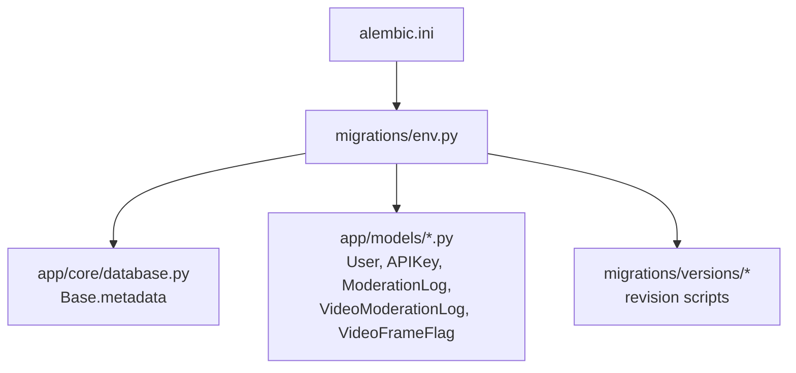
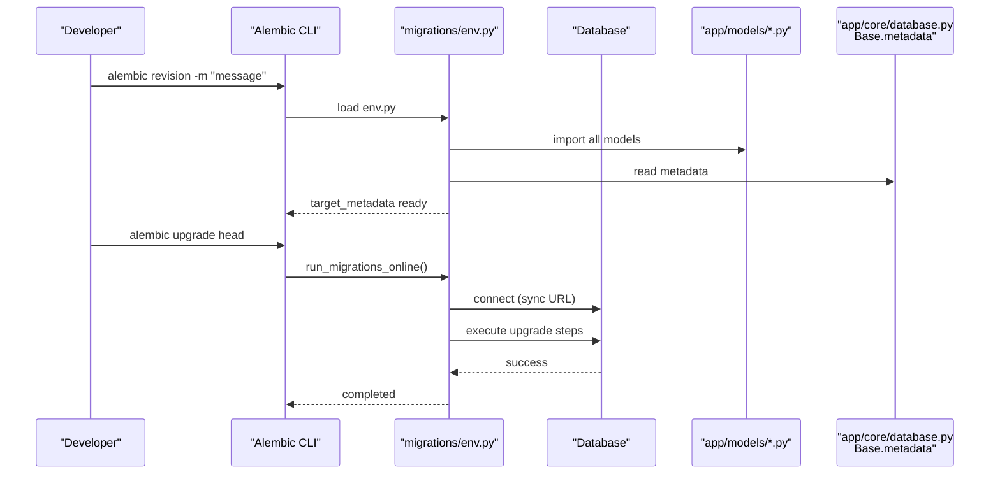
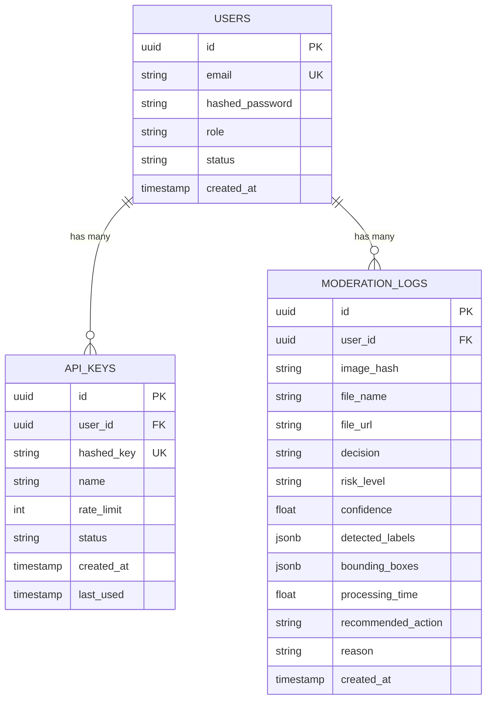
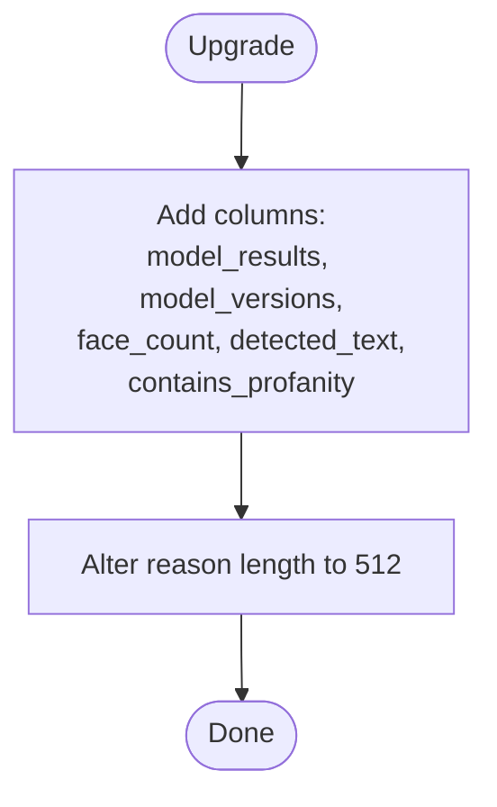
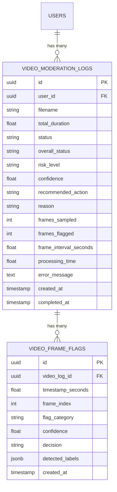
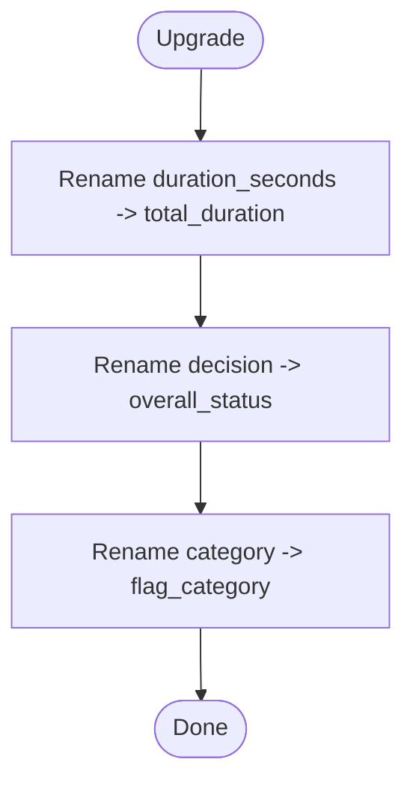
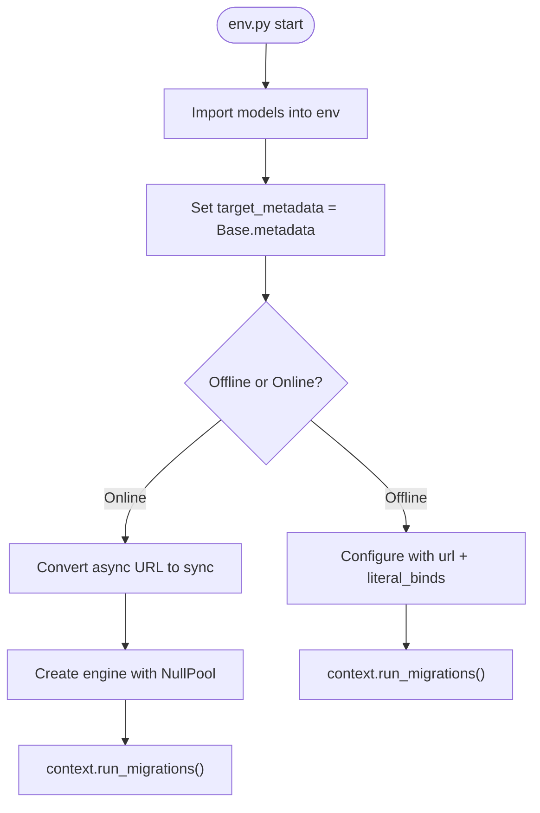
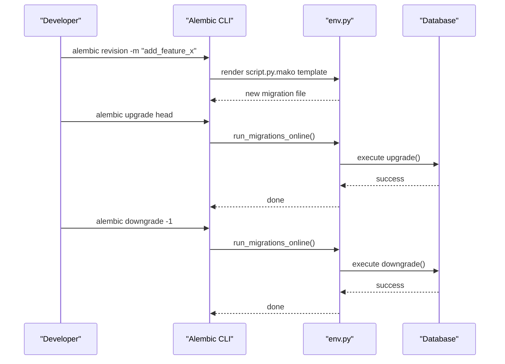
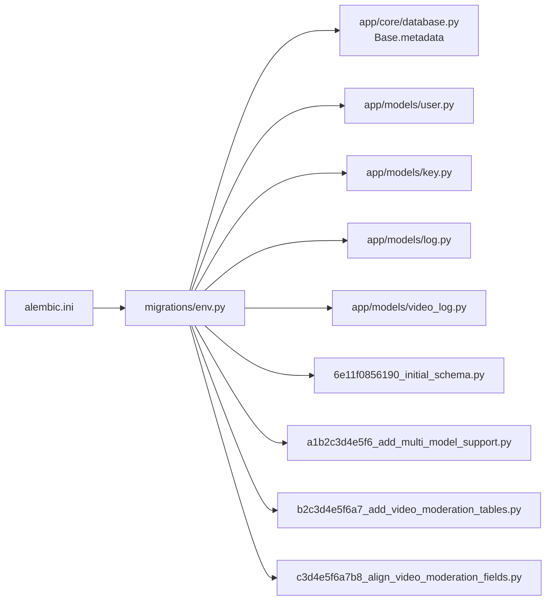
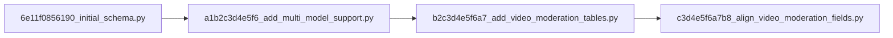

# Database Migrations

<cite>
**Referenced Files in This Document**
- [alembic.ini](file://backend/alembic.ini)
- [env.py](file://backend/migrations/env.py)
- [script.py.mako](file://backend/migrations/script.py.mako)
- [database.py](file://backend/app/core/database.py)
- [user.py](file://backend/app/models/user.py)
- [key.py](file://backend/app/models/key.py)
- [log.py](file://backend/app/models/log.py)
- [video_log.py](file://backend/app/models/video_log.py)
- [6e11f0856190_initial_schema.py](file://backend/migrations/versions/6e11f0856190_initial_schema.py)
- [a1b2c3d4e5f6_add_multi_model_support.py](file://backend/migrations/versions/a1b2c3d4e5f6_add_multi_model_support.py)
- [b2c3d4e5f6a7_add_video_moderation_tables.py](file://backend/migrations/versions/b2c3d4e5f6a7_add_video_moderation_tables.py)
- [c3d4e5f6a7b8_align_video_moderation_fields.py](file://backend/migrations/versions/c3d4e5f6a7b8_align_video_moderation_fields.py)
</cite>

## Table of Contents
1. Introduction
2. Project Structure
3. Core Components
4. Architecture Overview
5. Detailed Component Analysis
6. Dependency Analysis
7. Performance Considerations
8. Troubleshooting Guide
9. Conclusion
10. Appendices

## Introduction
This document explains how database migrations are managed using Alembic for schema evolution and version control in the project. It covers the initial schema setup, migration history (including multi-model support and video moderation), the migration workflow (create, apply, rollback), best practices for naming and dependencies, environment configuration, testing strategies, production deployment considerations, and common migration patterns with references to actual implementation files.

## Project Structure
The migration system is centered under backend/migrations with Alembic configuration in backend/alembic.ini. The runtime environment imports models so that autogenerate can detect changes against SQLAlchemy metadata.

**Diagram sources**
- [alembic.ini:1-117](file://backend/alembic.ini#L1-L117)
- [env.py:1-96](file://backend/migrations/env.py#L1-L96)
- [database.py:1-50](file://backend/app/core/database.py#L1-L50)
- [user.py:1-28](file://backend/app/models/user.py#L1-L28)
- [key.py:1-23](file://backend/app/models/key.py#L1-L23)
- [log.py:1-51](file://backend/app/models/log.py#L1-L51)
- [video_log.py:1-66](file://backend/app/models/video_log.py#L1-L66)

**Section sources**
- [alembic.ini:1-117](file://backend/alembic.ini#L1-L117)
- [env.py:1-96](file://backend/migrations/env.py#L1-L96)
- [database.py:1-50](file://backend/app/core/database.py#L1-L50)

## Core Components
- Alembic configuration: script_location, logging, and optional hooks are defined in alembic.ini.
- Migration environment: env.py sets target_metadata from Base.metadata, imports all models, configures offline and online modes, and normalizes async drivers to sync URLs for migrations.
- Model layer: Declarative models define tables, columns, indexes, foreign keys, and relationships; they drive autogeneration.
- Versioned migrations: Each file under versions/ defines upgrade() and downgrade() operations and revision graph metadata.

Key responsibilities:
- env.py ensures Alembic sees the current ORM metadata and uses a synchronous connection suitable for migrations.
- Models provide the canonical schema definition used by both application code and migration generation.
- alembic.ini centralizes Alembic behavior and logging.

**Section sources**
- [alembic.ini:1-117](file://backend/alembic.ini#L1-L117)
- [env.py:1-96](file://backend/migrations/env.py#L1-L96)
- [database.py:1-50](file://backend/app/core/database.py#L1-L50)
- [user.py:1-28](file://backend/app/models/user.py#L1-L28)
- [key.py:1-23](file://backend/app/models/key.py#L1-L23)
- [log.py:1-51](file://backend/app/models/log.py#L1-L51)
- [video_log.py:1-66](file://backend/app/models/video_log.py#L1-L66)

## Architecture Overview
The migration runtime integrates Alembic with the application’s SQLAlchemy metadata and configuration.

**Diagram sources**
- [env.py:1-96](file://backend/migrations/env.py#L1-L96)
- [database.py:1-50](file://backend/app/core/database.py#L1-L50)
- [user.py:1-28](file://backend/app/models/user.py#L1-L28)
- [key.py:1-23](file://backend/app/models/key.py#L1-L23)
- [log.py:1-51](file://backend/app/models/log.py#L1-L51)
- [video_log.py:1-66](file://backend/app/models/video_log.py#L1-L66)

## Detailed Component Analysis

### Initial Schema Setup
The first migration creates core tables, indexes, and foreign key constraints:
- users: primary key UUID, unique email index, timestamps.
- api_keys: FK to users with CASCADE delete, unique hashed_key index.
- moderation_logs: FK to users with SET NULL on delete, JSONB fields for labels and bounding boxes, indexes on created_at, image_hash, user_id.

**Diagram sources**
- [6e11f0856190_initial_schema.py:1-81](file://backend/migrations/versions/6e11f0856190_initial_schema.py#L1-L81)
- [user.py:1-28](file://backend/app/models/user.py#L1-L28)
- [key.py:1-23](file://backend/app/models/key.py#L1-L23)
- [log.py:1-51](file://backend/app/models/log.py#L1-L51)

**Section sources**
- [6e11f0856190_initial_schema.py:1-81](file://backend/migrations/versions/6e11f0856190_initial_schema.py#L1-L81)
- [user.py:1-28](file://backend/app/models/user.py#L1-L28)
- [key.py:1-23](file://backend/app/models/key.py#L1-L23)
- [log.py:1-51](file://backend/app/models/log.py#L1-L51)

### Multi-Model Support Addition
A subsequent migration adds new columns to moderation_logs to store per-model results, model versions, face detection counts, extracted text, and profanity flags. It also increases the length of the reason column.

**Diagram sources**
- [a1b2c3d4e5f6_add_multi_model_support.py:1-47](file://backend/migrations/versions/a1b2c3d4e5f6_add_multi_model_support.py#L1-L47)
- [log.py:1-51](file://backend/app/models/log.py#L1-L51)

**Section sources**
- [a1b2c3d4e5f6_add_multi_model_support.py:1-47](file://backend/migrations/versions/a1b2c3d4e5f6_add_multi_model_support.py#L1-L47)
- [log.py:1-51](file://backend/app/models/log.py#L1-L51)

### Video Moderation Tables Implementation
Another migration introduces two new tables:
- video_moderation_logs: tracks overall video analysis state, sampling metrics, timing, and reasons.
- video_frame_flags: stores flagged frames with timestamps, categories, decisions, and labels.

Indexes are added for efficient querying by user, status, and time.

**Diagram sources**
- [b2c3d4e5f6a7_add_video_moderation_tables.py:1-69](file://backend/migrations/versions/b2c3d4e5f6a7_add_video_moderation_tables.py#L1-L69)
- [video_log.py:1-66](file://backend/app/models/video_log.py#L1-L66)

**Section sources**
- [b2c3d4e5f6a7_add_video_moderation_tables.py:1-69](file://backend/migrations/versions/b2c3d4e5f6a7_add_video_moderation_tables.py#L1-L69)
- [video_log.py:1-66](file://backend/app/models/video_log.py#L1-L66)

### Field Alignment Updates
A follow-up migration renames columns for clarity and consistency across video-related tables using batch_alter_table for cross-dialect compatibility.

**Diagram sources**
- [c3d4e5f6a7b8_align_video_moderation_fields.py:1-33](file://backend/migrations/versions/c3d4e5f6a7b8_align_video_moderation_fields.py#L1-L33)

**Section sources**
- [c3d4e5f6a7b8_align_video_moderation_fields.py:1-33](file://backend/migrations/versions/c3d4e5f6a7b8_align_video_moderation_fields.py#L1-L33)

### Migration Environment Configuration
- env.py imports all models to register them with Base.metadata before autogenerate.
- Offline mode configures context with a URL and literal binds.
- Online mode overrides sqlalchemy.url with a synchronous driver derived from settings.DATABASE_URL, ensuring compatibility with async-only drivers.
- Logging is configured via alembic.ini sections.

**Diagram sources**
- [env.py:1-96](file://backend/migrations/env.py#L1-L96)
- [alembic.ini:83-117](file://backend/alembic.ini#L83-L117)

**Section sources**
- [env.py:1-96](file://backend/migrations/env.py#L1-L96)
- [alembic.ini:1-117](file://backend/alembic.ini#L1-L117)

### Migration Workflow
- Create a new migration:
  - Use the Alembic CLI to generate a revision with a descriptive message. The template is provided by script.py.mako.
- Apply schema changes:
  - Upgrade to the latest revision or a specific one.
- Rollback:
  - Downgrade to a previous revision or step back one revision.

**Diagram sources**
- [script.py.mako:1-27](file://backend/migrations/script.py.mako#L1-L27)
- [env.py:1-96](file://backend/migrations/env.py#L1-L96)

**Section sources**
- [script.py.mako:1-27](file://backend/migrations/script.py.mako#L1-L27)
- [env.py:1-96](file://backend/migrations/env.py#L1-L96)

### Best Practices
- Naming conventions:
  - Use clear, imperative messages for revisions (e.g., “add_multi_model_support”, “align_video_moderation_fields”).
- Dependency management:
  - Keep linear history where possible; set down_revision explicitly to maintain a clear chain.
- Handling breaking changes:
  - Prefer additive changes (new columns, tables). For destructive changes, plan data migrations and ensure robust downgrade paths.
- Cross-database compatibility:
  - Use batch_alter_table when renaming or altering columns to support SQLite and PostgreSQL.

[No sources needed since this section provides general guidance]

### Testing Strategies for Schema Changes
- Use an isolated test database and run alembic upgrade head before tests.
- Validate that downgrade paths succeed by running alembic downgrade -1 after tests.
- Test both online and offline modes if your CI runs in environments without live connections.

[No sources needed since this section provides general guidance]

### Production Deployment Considerations
- Zero-downtime strategy:
  - Make backward-compatible changes first (add columns/tables), deploy application updates, then perform data migrations, and finally remove old columns.
- Backups:
  - Take a snapshot or logical backup before applying migrations.
- Monitoring:
  - Log Alembic output and track migration execution times. Ensure errors surface to observability systems.

[No sources needed since this section provides general guidance]

### Common Migration Patterns
- Adding new columns:
  - See the multi-model support migration adding multiple columns to moderation_logs.
- Modifying existing tables:
  - Column length adjustments and renames using batch_alter_table.
- Data transformation scripts:
  - Use op.execute() within upgrade/downgrade to run raw SQL when necessary.
- Indexes and constraints:
  - Create/drop indexes and alter constraints as part of upgrades/downgrades.

**Section sources**
- [a1b2c3d4e5f6_add_multi_model_support.py:1-47](file://backend/migrations/versions/a1b2c3d4e5f6_add_multi_model_support.py#L1-L47)
- [c3d4e5f6a7b8_align_video_moderation_fields.py:1-33](file://backend/migrations/versions/c3d4e5f6a7b8_align_video_moderation_fields.py#L1-L33)

## Dependency Analysis
The dependency chain between components is straightforward:
- alembic.ini points to migrations directory and logging configuration.
- env.py depends on app.core.database.Base.metadata and imports all models.
- Each migration file declares its revision graph via revision and down_revision.

**Diagram sources**
- [alembic.ini:1-117](file://backend/alembic.ini#L1-L117)
- [env.py:1-96](file://backend/migrations/env.py#L1-L96)
- [database.py:1-50](file://backend/app/core/database.py#L1-L50)
- [user.py:1-28](file://backend/app/models/user.py#L1-L28)
- [key.py:1-23](file://backend/app/models/key.py#L1-L23)
- [log.py:1-51](file://backend/app/models/log.py#L1-L51)
- [video_log.py:1-66](file://backend/app/models/video_log.py#L1-L66)
- [6e11f0856190_initial_schema.py:1-81](file://backend/migrations/versions/6e11f0856190_initial_schema.py#L1-L81)
- [a1b2c3d4e5f6_add_multi_model_support.py:1-47](file://backend/migrations/versions/a1b2c3d4e5f6_add_multi_model_support.py#L1-L47)
- [b2c3d4e5f6a7_add_video_moderation_tables.py:1-69](file://backend/migrations/versions/b2c3d4e5f6a7_add_video_moderation_tables.py#L1-L69)
- [c3d4e5f6a7b8_align_video_moderation_fields.py:1-33](file://backend/migrations/versions/c3d4e5f6a7b8_align_video_moderation_fields.py#L1-L33)

**Section sources**
- [alembic.ini:1-117](file://backend/alembic.ini#L1-L117)
- [env.py:1-96](file://backend/migrations/env.py#L1-L96)

## Performance Considerations
- Use appropriate indexes for frequently queried columns (e.g., created_at, user_id, status).
- Avoid heavy data transformations during peak hours; schedule large migrations off-peak.
- Prefer batch operations and server-side defaults where possible to reduce round-trips.

[No sources needed since this section provides general guidance]

## Troubleshooting Guide
- Async driver not supported in migrations:
  - env.py converts async URLs to sync equivalents before creating the engine. Ensure DATABASE_URL is correctly set.
- Missing model imports:
  - All models must be imported in env.py so Alembic can detect changes.
- Dialect-specific issues:
  - Use batch_alter_table for renames and alterations to remain compatible with SQLite and PostgreSQL.
- Logging:
  - Adjust log levels in alembic.ini to capture detailed migration logs.

**Section sources**
- [env.py:57-96](file://backend/migrations/env.py#L57-L96)
- [alembic.ini:83-117](file://backend/alembic.ini#L83-L117)

## Conclusion
The Alembic-based migration system provides a clear, versioned path for evolving the schema. With well-defined models, explicit revision graphs, and careful handling of dialect differences, the project supports safe, repeatable deployments. Following the outlined best practices and workflows will help maintain reliability and performance as the schema continues to evolve.

[No sources needed since this section summarizes without analyzing specific files]

## Appendices

### Revision Graph

**Diagram sources**
- [6e11f0856190_initial_schema.py:1-81](file://backend/migrations/versions/6e11f0856190_initial_schema.py#L1-L81)
- [a1b2c3d4e5f6_add_multi_model_support.py:1-47](file://backend/migrations/versions/a1b2c3d4e5f6_add_multi_model_support.py#L1-L47)
- [b2c3d4e5f6a7_add_video_moderation_tables.py:1-69](file://backend/migrations/versions/b2c3d4e5f6a7_add_video_moderation_tables.py#L1-L69)
- [c3d4e5f6a7b8_align_video_moderation_fields.py:1-33](file://backend/migrations/versions/c3d4e5f6a7b8_align_video_moderation_fields.py#L1-L33)