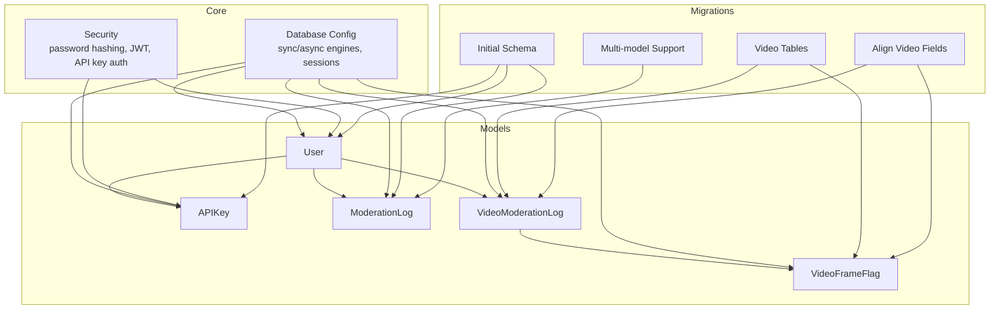
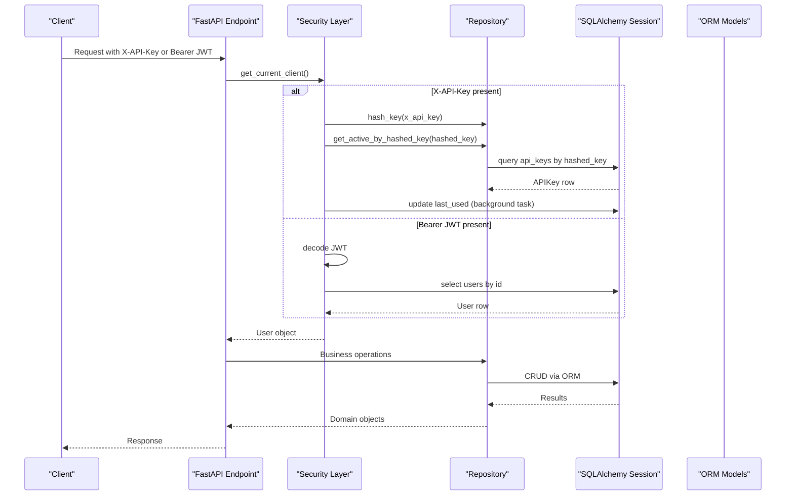
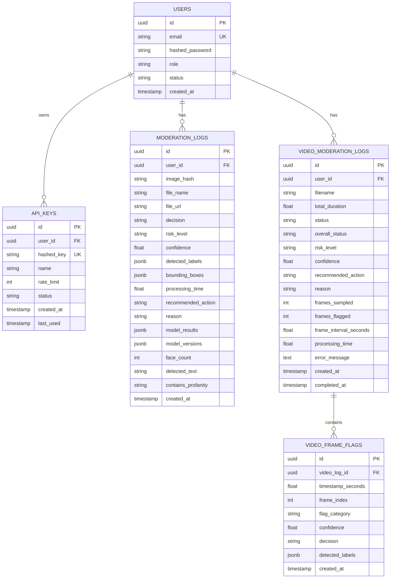
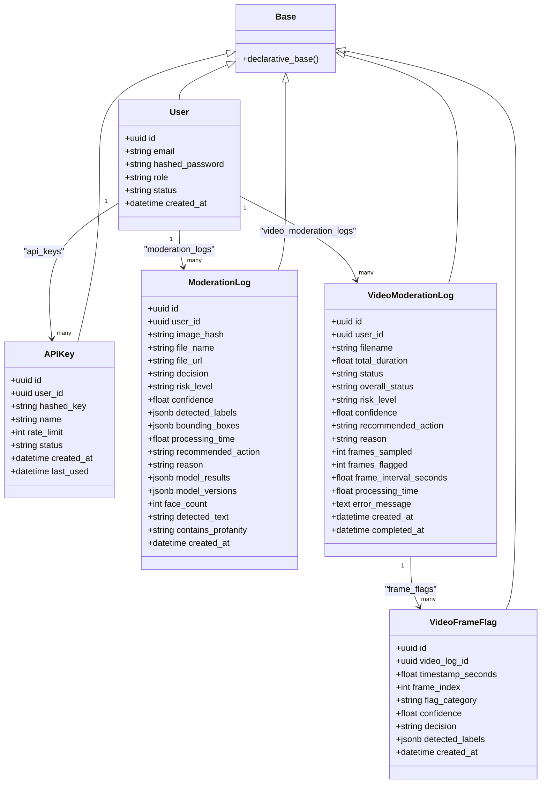

# Database Schema & Data Models

<cite>
**Referenced Files in This Document**
- [user.py](file://backend/app/models/user.py)
- [key.py](file://backend/app/models/key.py)
- [log.py](file://backend/app/models/log.py)
- [video_log.py](file://backend/app/models/video_log.py)
- [database.py](file://backend/app/core/database.py)
- [security.py](file://backend/app/core/security.py)
- [6e11f0856190_initial_schema.py](file://backend/migrations/versions/6e11f0856190_initial_schema.py)
- [a1b2c3d4e5f6_add_multi_model_support.py](file://backend/migrations/versions/a1b2c3d4e5f6_add_multi_model_support.py)
- [b2c3d4e5f6a7_add_video_moderation_tables.py](file://backend/migrations/versions/b2c3d4e5f6a7_add_video_moderation_tables.py)
- [c3d4e5f6a7b8_align_video_moderation_fields.py](file://backend/migrations/versions/c3d4e5f6a7b8_align_video_moderation_fields.py)
</cite>

## Table of Contents
1. Introduction
2. Project Structure
3. Core Components
4. Architecture Overview
5. Detailed Component Analysis
6. Dependency Analysis
7. Performance Considerations
8. Troubleshooting Guide
9. Conclusion

## Introduction
This document describes the OmniShield database schema and data models with a focus on core entities: User, APIKey, ModerationLog, and VideoModerationLog (and its related frame flags). It details field definitions, types, keys, indexes, constraints, validation rules, security practices, caching strategies, performance considerations, lifecycle policies, and migration paths using Alembic. The goal is to provide both high-level understanding and code-level traceability for developers and operators.

## Project Structure
The database layer is implemented with SQLAlchemy ORM models under app/models, configured via app/core/database, secured through app/core/security, and evolved with Alembic migrations under backend/migrations/versions.

**Diagram sources**
- [user.py:10-28](file://backend/app/models/user.py#L10-L28)
- [key.py:9-23](file://backend/app/models/key.py#L9-L23)
- [log.py:13-51](file://backend/app/models/log.py#L13-L51)
- [video_log.py:11-66](file://backend/app/models/video_log.py#L11-L66)
- [database.py:1-50](file://backend/app/core/database.py#L1-L50)
- [security.py:1-177](file://backend/app/core/security.py#L1-L177)
- [6e11f0856190_initial_schema.py:21-67](file://backend/migrations/versions/6e11f0856190_initial_schema.py#L21-L67)
- [a1b2c3d4e5f6_add_multi_model_support.py:19-31](file://backend/migrations/versions/a1b2c3d4e5f6_add_multi_model_support.py#L19-L31)
- [b2c3d4e5f6a7_add_video_moderation_tables.py:18-58](file://backend/migrations/versions/b2c3d4e5f6a7_add_video_moderation_tables.py#L18-L58)
- [c3d4e5f6a7b8_align_video_moderation_fields.py:16-24](file://backend/migrations/versions/c3d4e5f6a7b8_align_video_moderation_fields.py#L16-L24)

**Section sources**
- [user.py:10-28](file://backend/app/models/user.py#L10-L28)
- [key.py:9-23](file://backend/app/models/key.py#L9-L23)
- [log.py:13-51](file://backend/app/models/log.py#L13-L51)
- [video_log.py:11-66](file://backend/app/models/video_log.py#L11-L66)
- [database.py:1-50](file://backend/app/core/database.py#L1-L50)
- [security.py:1-177](file://backend/app/core/security.py#L1-L177)
- [6e11f0856190_initial_schema.py:21-67](file://backend/migrations/versions/6e11f0856190_initial_schema.py#L21-L67)
- [a1b2c3d4e5f6_add_multi_model_support.py:19-31](file://backend/migrations/versions/a1b2c3d4e5f6_add_multi_model_support.py#L19-L31)
- [b2c3d4e5f6a7_add_video_moderation_tables.py:18-58](file://backend/migrations/versions/b2c3d4e5f6a7_add_video_moderation_tables.py#L18-L58)
- [c3d4e5f6a7b8_align_video_moderation_fields.py:16-24](file://backend/migrations/versions/c3d4e5f6a7b8_align_video_moderation_fields.py#L16-L24)

## Core Components
This section summarizes the primary tables and their roles:
- users: Identity and account state for clients and admins.
- api_keys: Per-user API credentials with rate limiting metadata.
- moderation_logs: Image/text moderation results with model outputs and optional face/text metadata.
- video_moderation_logs: Asynchronous video processing jobs with sampling parameters and outcomes.
- video_frame_flags: Per-frame flagging details tied to a video log.

Key relationships:
- One user owns many API keys.
- One user can have many moderation logs and video moderation logs.
- One video moderation log has many frame flags.

Indexes and constraints are defined at the model and migration layers to optimize lookups and enforce referential integrity.

**Section sources**
- [user.py:10-28](file://backend/app/models/user.py#L10-L28)
- [key.py:9-23](file://backend/app/models/key.py#L9-L23)
- [log.py:13-51](file://backend/app/models/log.py#L13-L51)
- [video_log.py:11-66](file://backend/app/models/video_log.py#L11-L66)

## Architecture Overview
The data access architecture uses both synchronous and asynchronous SQLAlchemy engines. Async sessions power FastAPI endpoints; sync sessions support migrations and background tasks. Security utilities handle password hashing, JWT issuance/validation, and API key authentication.

**Diagram sources**
- [security.py:119-177](file://backend/app/core/security.py#L119-L177)
- [database.py:19-50](file://backend/app/core/database.py#L19-L50)
- [key.py:9-23](file://backend/app/models/key.py#L9-L23)
- [user.py:10-28](file://backend/app/models/user.py#L10-L28)

## Detailed Component Analysis

### Entity Relationship Diagram

**Diagram sources**
- [user.py:10-28](file://backend/app/models/user.py#L10-L28)
- [key.py:9-23](file://backend/app/models/key.py#L9-L23)
- [log.py:13-51](file://backend/app/models/log.py#L13-L51)
- [video_log.py:11-66](file://backend/app/models/video_log.py#L11-L66)

#### Users
- Purpose: Store client identity, role, and account status.
- Primary key: UUID id.
- Unique constraint: email.
- Indexes: email.
- Timestamps: created_at defaults to server time.
- Relationships: one-to-many with api_keys, moderation_logs, video_moderation_logs.

Validation and security:
- Email uniqueness enforced at DB level.
- Password stored as bcrypt hash via security utilities.
- Role and status control access and behavior.

**Section sources**
- [user.py:10-28](file://backend/app/models/user.py#L10-L28)
- [security.py:24-41](file://backend/app/core/security.py#L24-L41)
- [6e11f0856190_initial_schema.py:23-32](file://backend/migrations/versions/6e11f0856190_initial_schema.py#L23-L32)

#### API Keys
- Purpose: Represent per-user API credentials with rate limiting and usage tracking.
- Primary key: UUID id.
- Foreign key: user_id references users.id with CASCADE delete.
- Unique constraint: hashed_key.
- Indexes: hashed_key.
- Timestamps: created_at defaults to server time; last_used updated asynchronously.

Generation and storage:
- Raw API keys are hashed before storage using SHA-256 via repository helper.
- Rate limit is per-key (requests per minute).
- Status controls activation.

Access control:
- Authentication flow validates hashed_key and enforces per-key rate limits.
- Owner account must be active.

**Section sources**
- [key.py:9-23](file://backend/app/models/key.py#L9-L23)
- [security.py:119-151](file://backend/app/core/security.py#L119-L151)
- [6e11f0856190_initial_schema.py:33-45](file://backend/migrations/versions/6e11f0856190_initial_schema.py#L33-L45)

#### Moderation Logs
- Purpose: Persist image/text moderation decisions, confidence, labels, bounding boxes, and multi-model outputs.
- Primary key: UUID id.
- Foreign key: user_id references users.id with SET NULL.
- Indexes: image_hash, user_id, created_at.
- JSON fields: detected_labels, bounding_boxes, model_results, model_versions.
- Additional metadata: face_count, detected_text, contains_profanity.
- Decision space: decision values include safe, unsafe, review; risk_level includes low, medium, high, critical; recommended_action includes allow, quarantine, block.

Evolution:
- Initial schema included core moderation fields.
- Multi-model support added model_results, model_versions, face_count, detected_text, contains_profanity, and extended reason length.

**Section sources**
- [log.py:13-51](file://backend/app/models/log.py#L13-L51)
- [6e11f0856190_initial_schema.py:46-66](file://backend/migrations/versions/6e11f0856190_initial_schema.py#L46-L66)
- [a1b2c3d4e5f6_add_multi_model_support.py:19-31](file://backend/migrations/versions/a1b2c3d4e5f6_add_multi_model_support.py#L19-L31)

#### Video Moderation Logs and Frame Flags
- VideoModerationLog:
  - Tracks asynchronous video processing jobs, sampling configuration, and outcomes.
  - Primary key: UUID id.
  - Foreign key: user_id references users.id with SET NULL.
  - Indexes: user_id, status, created_at.
  - Status values: pending, processing, completed, failed.
  - Overall outcome fields: overall_status, risk_level, confidence, recommended_action, reason.
  - Sampling: frames_sampled, frames_flagged, frame_interval_seconds.
  - Timing: created_at, completed_at, processing_time.
  - Errors: error_message.

- VideoFrameFlag:
  - Stores per-frame flagging details including timestamp, index, category, confidence, decision, and labels.
  - Primary key: UUID id.
  - Foreign key: video_log_id references video_moderation_logs.id with CASCADE delete.
  - Index: video_log_id.

Field alignment:
- Migration renamed duration_seconds to total_duration, decision to overall_status, and category to flag_category to align naming conventions.

**Section sources**
- [video_log.py:11-66](file://backend/app/models/video_log.py#L11-L66)
- [b2c3d4e5f6a7_add_video_moderation_tables.py:18-58](file://backend/migrations/versions/b2c3d4e5f6a7_add_video_moderation_tables.py#L18-L58)
- [c3d4e5f6a7b8_align_video_moderation_fields.py:16-24](file://backend/migrations/versions/c3d4e5f6a7b8_align_video_moderation_fields.py#L16-L24)

### Data Validation Rules
- Email format:
  - Uniqueness enforced at DB level via unique index on users.email.
  - Application-level validation should ensure RFC-compliant email formats prior to insertion.

- Password hashing:
  - Passwords are hashed with bcrypt before storage.
  - Hashing truncates input to 72 bytes to comply with bcrypt limitations.
  - Verification uses constant-time comparison.

- API key generation and storage:
  - Raw API keys are hashed with SHA-256 before persistence.
  - Only hashed values are stored; raw keys are never persisted.
  - Key lookup uses hashed_key with unique constraint.

- Moderation result categorization:
  - decision: safe, unsafe, review.
  - risk_level: low, medium, high, critical.
  - recommended_action: allow, quarantine, block.
  - contains_profanity: yes, no, null.

**Section sources**
- [user.py:14](file://backend/app/models/user.py#L14)
- [security.py:24-41](file://backend/app/core/security.py#L24-L41)
- [security.py:119-151](file://backend/app/core/security.py#L119-L151)
- [log.py:22-46](file://backend/app/models/log.py#L22-L46)

### Data Access Patterns (SQLAlchemy ORM)
- Engines and sessions:
  - Sync engine and session factory for migrations and CLI tools.
  - Async engine and async session factory for FastAPI routes.
  - Base declarative class shared across models.

- Typical patterns:
  - Endpoints depend on async session provider to execute queries.
  - Repositories encapsulate CRUD and complex queries against models.
  - Background tasks update timestamps out-of-band to avoid request latency.

**Section sources**
- [database.py:1-50](file://backend/app/core/database.py#L1-L50)
- [security.py:53-93](file://backend/app/core/security.py#L53-L93)

### Caching Strategies (Redis)
- While Redis integration exists in the codebase, this document focuses on the database schema. For frequently accessed data such as active API keys or user profiles, consider:
  - Cache API key presence and owner mapping keyed by hashed_key.
  - Cache user profile attributes (id, role, status) keyed by user id.
  - Use short TTLs and invalidation on account/key updates.
  - Ensure cache consistency with DB writes and handle cache misses gracefully.

[No sources needed since this section provides general guidance]

### Performance Considerations
- Query optimization:
  - Leverage existing indexes on email, hashed_key, image_hash, user_id, status, and created_at.
  - Prefer selective filters and pagination for large moderation logs and video logs.
  - Use JSONB indexing strategies (PostgreSQL) for frequent JSON queries if needed.

- Connection pooling:
  - Both sync and async engines use pool_pre_ping for resilience.
  - Tune pool sizes based on concurrency and workload characteristics.

- Write amplification:
  - Update API key last_used asynchronously to reduce request latency.

**Section sources**
- [database.py:9-29](file://backend/app/core/database.py#L9-L29)
- [security.py:106-117](file://backend/app/core/security.py#L106-L117)

### Data Lifecycle and Retention
- Moderation logs retention:
  - Implement periodic archival or deletion of old records based on business policy.
  - Consider partitioning by created_at for efficient purging.

- User account management:
  - Deactivation sets status to inactive; associated API keys remain but cannot authenticate until reactivated.
  - Cascading deletes remove orphaned API keys when users are deleted.

- Video processing metadata:
  - Completed or failed videos may be archived after a retention window.
  - Frame flags are tightly coupled to their parent video log and cascade-delete accordingly.

[No sources needed since this section provides general guidance]

### Data Migration Paths (Alembic)
- Initial schema:
  - Creates users, api_keys, moderation_logs with core columns and indexes.

- Multi-model support:
  - Adds model_results, model_versions, face_count, detected_text, contains_profanity to moderation_logs.
  - Extends reason column length.

- Video moderation tables:
  - Introduces video_moderation_logs and video_frame_flags with appropriate foreign keys and indexes.

- Field alignment:
  - Renames duration_seconds to total_duration, decision to overall_status, and category to flag_category for consistency.

Operational notes:
- Downgrade functions are provided for each migration to reverse changes safely.
- Batch alter used for SQLite compatibility during renames.

**Section sources**
- [6e11f0856190_initial_schema.py:21-67](file://backend/migrations/versions/6e11f0856190_initial_schema.py#L21-L67)
- [a1b2c3d4e5f6_add_multi_model_support.py:19-46](file://backend/migrations/versions/a1b2c3d4e5f6_add_multi_model_support.py#L19-L46)
- [b2c3d4e5f6a7_add_video_moderation_tables.py:18-68](file://backend/migrations/versions/b2c3d4e5f6a7_add_video_moderation_tables.py#L18-L68)
- [c3d4e5f6a7b8_align_video_moderation_fields.py:16-32](file://backend/migrations/versions/c3d4e5f6a7b8_align_video_moderation_fields.py#L16-L32)

### Data Security
- Password hashing:
  - bcrypt with salt generation and constant-time verification.
  - Input truncated to 72 bytes to meet bcrypt constraints.

- API key storage:
  - SHA-256 hashing of raw keys before storage.
  - Unique constraint on hashed_key prevents duplicates.

- Access control:
  - JWT-based authorization for web clients.
  - API key header-based authentication for service clients.
  - Role checks supported via dependency wrapper.

- Account status enforcement:
  - Inactive users are rejected during authentication flows.

**Section sources**
- [security.py:24-41](file://backend/app/core/security.py#L24-L41)
- [security.py:119-177](file://backend/app/core/security.py#L119-L177)
- [key.py:14](file://backend/app/models/key.py#L14)

## Dependency Analysis
The following diagram shows how models depend on the database base and how security interacts with models.

**Diagram sources**
- [user.py:10-28](file://backend/app/models/user.py#L10-L28)
- [key.py:9-23](file://backend/app/models/key.py#L9-L23)
- [log.py:13-51](file://backend/app/models/log.py#L13-L51)
- [video_log.py:11-66](file://backend/app/models/video_log.py#L11-L66)
- [database.py:31-32](file://backend/app/core/database.py#L31-L32)

**Section sources**
- [user.py:10-28](file://backend/app/models/user.py#L10-L28)
- [key.py:9-23](file://backend/app/models/key.py#L9-L23)
- [log.py:13-51](file://backend/app/models/log.py#L13-L51)
- [video_log.py:11-66](file://backend/app/models/video_log.py#L11-L66)
- [database.py:31-32](file://backend/app/core/database.py#L31-L32)

## Performance Considerations
- Use async sessions for high-throughput endpoints.
- Keep transactions small and commit promptly.
- Add application-level indexes for JSONB fields if querying deeply nested structures.
- Monitor slow queries and adjust pool settings based on load.
- Offload heavy computations to background tasks where possible.

[No sources needed since this section provides general guidance]

## Troubleshooting Guide
Common issues and resolutions:
- Authentication failures:
  - Verify JWT secret and algorithm configuration.
  - Ensure user status is active and credentials are correct.
  - Confirm API key header is present and valid.

- API key not found:
  - Check that hashed_key matches the stored value.
  - Validate key status and expiration policies.

- Moderation log insertions:
  - Ensure JSON fields conform to expected schemas.
  - Validate decision/risk_level/recommended_action enums.

- Video processing errors:
  - Inspect error_message in video_moderation_logs.
  - Review frame_flags for anomalies and confidence thresholds.

**Section sources**
- [security.py:53-93](file://backend/app/core/security.py#L53-L93)
- [security.py:119-151](file://backend/app/core/security.py#L119-L151)
- [video_log.py:31](file://backend/app/models/video_log.py#L31)

## Conclusion
The OmniShield data model centers around secure user management, robust API key handling, comprehensive moderation logging, and scalable video processing metadata. With clear relationships, well-defined constraints, and thoughtful indexing, the schema supports both operational efficiency and extensibility. Security measures like bcrypt and SHA-256 hashing, combined with Alembic-driven evolution, ensure a resilient and maintainable system.