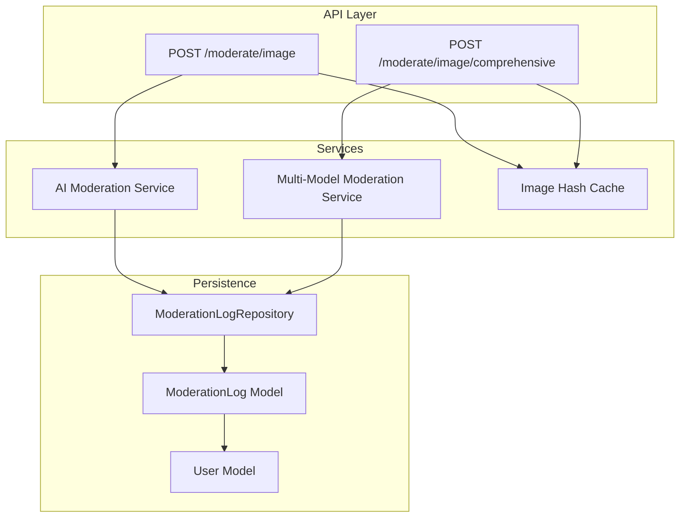
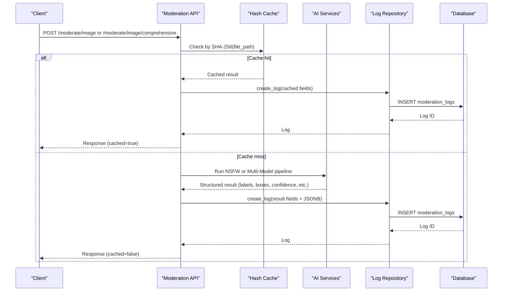
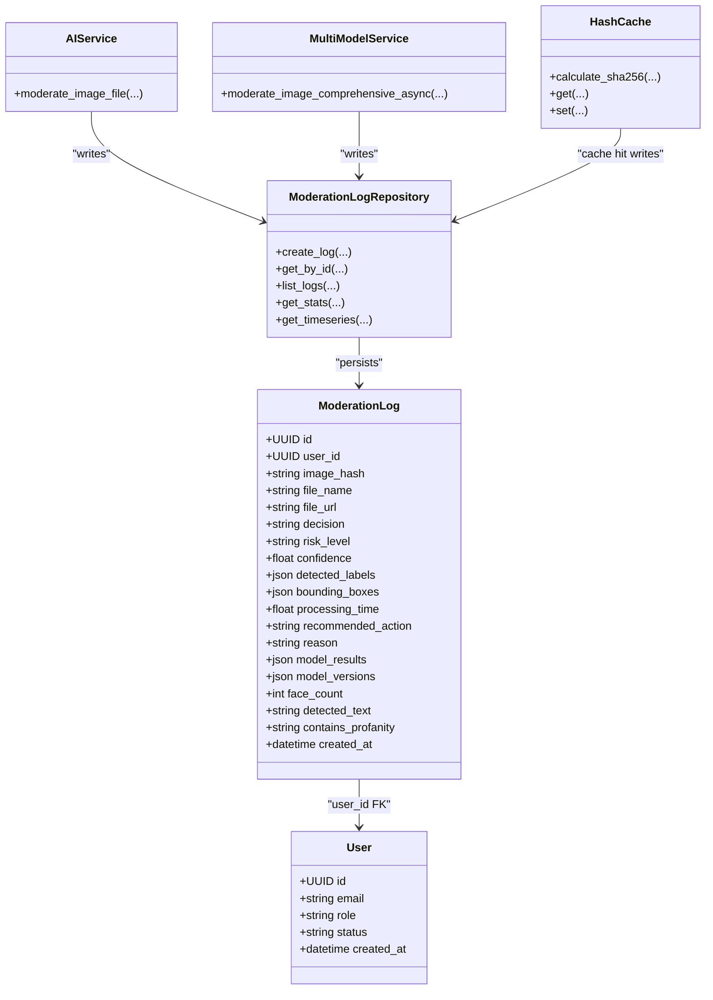

# Moderation Logs

<cite>
**Referenced Files in This Document**
- [log.py](file://backend/app/models/log.py)
- [user.py](file://backend/app/models/user.py)
- [6e11f0856190_initial_schema.py](file://backend/migrations/versions/6e11f0856190_initial_schema.py)
- [a1b2c3d4e5f6_add_multi_model_support.py](file://backend/migrations/versions/a1b2c3d4e5f6_add_multi_model_support.py)
- [moderate.py](file://backend/app/api/moderate.py)
- [log_repo.py](file://backend/app/repositories/log_repo.py)
- [ai_moderation.py](file://backend/app/services/ai_moderation.py)
- [multi_model_moderation.py](file://backend/app/services/multi_model_moderation.py)
- [hash_cache.py](file://backend/app/services/hash_cache.py)
</cite>

## Table of Contents
1. [Introduction](#introduction)
2. [Project Structure](#project-structure)
3. [Core Components](#core-components)
4. [Architecture Overview](#architecture-overview)
5. [Detailed Component Analysis](#detailed-component-analysis)
6. [Dependency Analysis](#dependency-analysis)
7. [Performance Considerations](#performance-considerations)
8. [Troubleshooting Guide](#troubleshooting-guide)
9. [Conclusion](#conclusion)
10. [Appendices](#appendices)

## Introduction
This document provides detailed data model documentation for the ModerationLog entity, which records content moderation results for images and videos. It covers:
- The comprehensive log structure including image hash for deduplication, original filename and path storage, file size tracking, and processing timestamps.
- Multi-model result storage with confidence scores, detection categories (NSFW, violence, weapons, faces, text), and decision outcomes.
- Relationship with the User entity for audit trails.
- JSONB field structures for storing complex moderation results from multiple AI models.
- Data validation rules for confidence score ranges, category classifications, and result format consistency.
- Indexing strategies for query optimization including hash-based lookups, timestamp filtering, and user-specific queries.
- Data retention policies, archival procedures, and storage optimization for large moderation datasets.
- Sample log entries showing different moderation scenarios and result formats.

## Project Structure
The ModerationLog data model is defined in the backend application layer and persisted via SQLAlchemy migrations. The API endpoints orchestrate moderation flows and persist logs through a repository.

**Diagram sources**
- [moderate.py:223-371](file://backend/app/api/moderate.py#L223-L371)
- [moderate.py:446-615](file://backend/app/api/moderate.py#L446-L615)
- [ai_moderation.py:148-275](file://backend/app/services/ai_moderation.py#L148-L275)
- [multi_model_moderation.py:532-732](file://backend/app/services/multi_model_moderation.py#L532-L732)
- [hash_cache.py:8-59](file://backend/app/services/hash_cache.py#L8-L59)
- [log_repo.py:10-61](file://backend/app/repositories/log_repo.py#L10-L61)
- [log.py:13-51](file://backend/app/models/log.py#L13-L51)
- [user.py:10-28](file://backend/app/models/user.py#L10-L28)

**Section sources**
- [moderate.py:223-371](file://backend/app/api/moderate.py#L223-L371)
- [moderate.py:446-615](file://backend/app/api/moderate.py#L446-L615)
- [log.py:13-51](file://backend/app/models/log.py#L13-L51)
- [user.py:10-28](file://backend/app/models/user.py#L10-L28)
- [log_repo.py:10-61](file://backend/app/repositories/log_repo.py#L10-L61)
- [ai_moderation.py:148-275](file://backend/app/services/ai_moderation.py#L148-L275)
- [multi_model_moderation.py:532-732](file://backend/app/services/multi_model_moderation.py#L532-L732)
- [hash_cache.py:8-59](file://backend/app/services/hash_cache.py#L8-L59)

## Core Components
- ModerationLog: Core entity capturing moderation decisions, risk levels, confidence, labels, bounding boxes, processing time, recommended actions, reasons, multi-model results, face/text metadata, and timestamps.
- User: Audit trail linkage to the user who triggered moderation.
- ModerationLogRepository: Persistence operations for creating and querying logs.
- AI Moderation Service: Single-model NSFW pipeline producing structured results.
- Multi-Model Moderation Service: Parallel execution across NSFW, violence, weapons, faces, and text detectors with aggregated results.
- Image Hash Cache: Deduplication using SHA-256 checksums stored in Redis.

Key responsibilities:
- Normalize and validate outputs from AI services into consistent schema fields.
- Persist comprehensive results including JSONB payloads for per-model details.
- Provide indexes and query patterns for efficient retrieval and analytics.

**Section sources**
- [log.py:13-51](file://backend/app/models/log.py#L13-L51)
- [user.py:10-28](file://backend/app/models/user.py#L10-L28)
- [log_repo.py:10-61](file://backend/app/repositories/log_repo.py#L10-L61)
- [ai_moderation.py:148-275](file://backend/app/services/ai_moderation.py#L148-L275)
- [multi_model_moderation.py:532-732](file://backend/app/services/multi_model_moderation.py#L532-L732)
- [hash_cache.py:8-59](file://backend/app/services/hash_cache.py#L8-L59)

## Architecture Overview
End-to-end flow for single-image moderation and comprehensive multi-model moderation:

**Diagram sources**
- [moderate.py:223-371](file://backend/app/api/moderate.py#L223-L371)
- [moderate.py:446-615](file://backend/app/api/moderate.py#L446-L615)
- [hash_cache.py:8-59](file://backend/app/services/hash_cache.py#L8-L59)
- [ai_moderation.py:148-275](file://backend/app/services/ai_moderation.py#L148-L275)
- [multi_model_moderation.py:532-732](file://backend/app/services/multi_model_moderation.py#L532-L732)
- [log_repo.py:10-61](file://backend/app/repositories/log_repo.py#L10-L61)

## Detailed Component Analysis

### ModerationLog Entity
- Primary key: UUID id
- Audit link: user_id (nullable; foreign key to users.id)
- Deduplication: image_hash (SHA-256 hex digest)
- File identity: file_name, file_url (optional)
- Decision fields: decision (safe/unsafe), risk_level (low/medium/high/critical), confidence (float)
- Detection payload: detected_labels (JSON array), bounding_boxes (JSON array)
- Performance: processing_time (seconds)
- Actionability: recommended_action (allow/quarantine/block), reason (string)
- Multi-model support: model_results (JSONB), model_versions (JSONB)
- Face/text metadata: face_count (integer), detected_text (string), contains_profanity (yes/no/null)
- Timestamp: created_at (UTC)

Relationships:
- One-to-many with User via user_id.

Indexes:
- image_hash
- user_id
- created_at

Validation and constraints:
- decision must be one of safe/unsafe.
- risk_level must be one of low/medium/high/critical.
- confidence must be within [0.0, 1.0].
- recommended_action must be one of allow/quarantine/block.
- detected_labels must be an array of strings.
- bounding_boxes must be an array of objects with label, box (array of integers), and score (float).
- model_results must be a JSON object keyed by category (nsfw, violence, weapons, faces, text).
- model_versions must be a JSON object mapping category to version string.
- contains_profanity must be 'yes', 'no', or null.

Data types and dialect considerations:
- JSONB used for PostgreSQL; fallback to JSON for SQLite via variant configuration.

**Section sources**
- [log.py:13-51](file://backend/app/models/log.py#L13-L51)
- [6e11f0856190_initial_schema.py:46-66](file://backend/migrations/versions/6e11f0856190_initial_schema.py#L46-L66)
- [a1b2c3d4e5f6_add_multi_model_support.py:19-31](file://backend/migrations/versions/a1b2c3d4e5f6_add_multi_model_support.py#L19-L31)

### User Entity
- Primary key: UUID id
- Identity: email (unique)
- Role and status: role, status
- Timestamp: created_at
- Relationships: moderation_logs (one-to-many)

Audit trail usage:
- ModerationLog.user_id links each moderation event to the originating user.
- Deletion policy on user deletion sets moderation_logs.user_id to NULL rather than cascading deletes, preserving audit history.

**Section sources**
- [user.py:10-28](file://backend/app/models/user.py#L10-L28)
- [log.py:17](file://backend/app/models/log.py#L17)

### ModerationLogRepository
Responsibilities:
- Create log entries with all fields including enhanced multi-model fields.
- Retrieve logs by id, list with pagination and optional user filter.
- Aggregate stats and timeseries for analytics.

Query patterns:
- By user_id with ordering by created_at desc.
- Time-range queries for last N days.

**Section sources**
- [log_repo.py:10-61](file://backend/app/repositories/log_repo.py#L10-L61)
- [log_repo.py:71-86](file://backend/app/repositories/log_repo.py#L71-L86)
- [log_repo.py:89-136](file://backend/app/repositories/log_repo.py#L89-L136)
- [log_repo.py:139-232](file://backend/app/repositories/log_repo.py#L139-L232)

### AI Moderation Service (Single-Model NSFW)
Outputs:
- status (safe/unsafe/error), confidence (float), detected_labels (list), bounding_boxes (list), processing_time (float), risk_level, recommended_action, reason.

Validation rules applied:
- Label thresholds per category determine inclusion in detected_labels.
- Confidence mapped to risk_level and recommended_action via deterministic rules.

Integration:
- Used by single-image moderation endpoint and cached results.

**Section sources**
- [ai_moderation.py:148-275](file://backend/app/services/ai_moderation.py#L148-L275)
- [ai_moderation.py:25-41](file://backend/app/services/ai_moderation.py#L25-L41)
- [ai_moderation.py:121-145](file://backend/app/services/ai_moderation.py#L121-L145)

### Multi-Model Moderation Service
Categories:
- nsfw, violence, weapons, faces, text.

Parallel execution:
- Uses asyncio.gather with ThreadPoolExecutor to run detectors concurrently.

Aggregation logic:
- Combines labels and bounding boxes across categories.
- Computes aggregate confidence and risk level based on unsafe categories and risk mapping.
- Applies professional portrait override to reduce false positives when appropriate.

Output:
- categories (dict per detector), model_versions (dict), face_count, detected_text, contains_profanity.

**Section sources**
- [multi_model_moderation.py:532-732](file://backend/app/services/multi_model_moderation.py#L532-L732)
- [multi_model_moderation.py:218-301](file://backend/app/services/multi_model_moderation.py#L218-L301)
- [multi_model_moderation.py:304-377](file://backend/app/services/multi_model_moderation.py#L304-L377)
- [multi_model_moderation.py:380-431](file://backend/app/services/multi_model_moderation.py#L380-L431)
- [multi_model_moderation.py:434-486](file://backend/app/services/multi_model_moderation.py#L434-L486)

### Image Hash Cache
Purpose:
- Deduplicate identical files using SHA-256 checksums.
- Store moderation results in Redis with TTL to avoid repeated inference.

Behavior:
- Skips caching error results.
- Adds cached flag to distinguish cache hits.

**Section sources**
- [hash_cache.py:8-59](file://backend/app/services/hash_cache.py#L8-L59)

### API Endpoints and Data Flow
Endpoints:
- POST /moderate/image: Validates upload, checks cache, runs NSFW service, persists log.
- POST /moderate/image/comprehensive: Runs multi-model pipeline, persists comprehensive log with JSONB fields.

Flow highlights:
- File validation via magic bytes and extension checks.
- Size limits enforced during streaming write.
- Comprehensive endpoint extracts face_count, detected_text, contains_profanity and stores them alongside JSONB model_results and model_versions.

**Section sources**
- [moderate.py:223-371](file://backend/app/api/moderate.py#L223-L371)
- [moderate.py:446-615](file://backend/app/api/moderate.py#L446-L615)

## Dependency Analysis

**Diagram sources**
- [log.py:13-51](file://backend/app/models/log.py#L13-L51)
- [user.py:10-28](file://backend/app/models/user.py#L10-L28)
- [log_repo.py:10-61](file://backend/app/repositories/log_repo.py#L10-L61)
- [ai_moderation.py:148-275](file://backend/app/services/ai_moderation.py#L148-L275)
- [multi_model_moderation.py:532-732](file://backend/app/services/multi_model_moderation.py#L532-L732)
- [hash_cache.py:8-59](file://backend/app/services/hash_cache.py#L8-L59)

**Section sources**
- [log.py:13-51](file://backend/app/models/log.py#L13-L51)
- [user.py:10-28](file://backend/app/models/user.py#L10-L28)
- [log_repo.py:10-61](file://backend/app/repositories/log_repo.py#L10-L61)
- [ai_moderation.py:148-275](file://backend/app/services/ai_moderation.py#L148-L275)
- [multi_model_moderation.py:532-732](file://backend/app/services/multi_model_moderation.py#L532-L732)
- [hash_cache.py:8-59](file://backend/app/services/hash_cache.py#L8-L59)

## Performance Considerations
- Indexes:
  - image_hash: fast deduplication lookups and duplicate prevention.
  - user_id: efficient user-scoped queries and dashboards.
  - created_at: time-series analytics and recent logs retrieval.
- JSONB fields:
  - model_results and model_versions store rich per-model details without schema changes.
  - Use GIN indexes on JSONB if frequent JSON queries are required (recommendation).
- Caching:
  - Redis-backed hash cache reduces redundant inference for identical files.
- Processing time:
  - processing_time recorded per log entry supports performance monitoring.

[No sources needed since this section provides general guidance]

## Troubleshooting Guide
Common issues and resolutions:
- Validation errors:
  - Ensure confidence is within [0.0, 1.0].
  - Verify decision values are safe/unsafe.
  - Confirm risk_level values are low/medium/high/critical.
  - Validate recommended_action values are allow/quarantine/block.
  - Ensure detected_labels is an array of strings and bounding_boxes is an array of objects with integer coordinates and float scores.
- Missing or inconsistent JSONB:
  - For comprehensive moderation, confirm model_results keys match expected categories (nsfw, violence, weapons, faces, text).
  - Ensure model_versions maps categories to version strings.
- Cache behavior:
  - Error results are not cached; re-run inference if previous attempts failed.
- Large datasets:
  - Monitor index usage and consider partitioning by created_at for very large tables.
  - Archive older logs to cold storage and maintain summary aggregates.

**Section sources**
- [log.py:13-51](file://backend/app/models/log.py#L13-L51)
- [hash_cache.py:37-59](file://backend/app/services/hash_cache.py#L37-L59)
- [log_repo.py:89-136](file://backend/app/repositories/log_repo.py#L89-L136)

## Conclusion
The ModerationLog entity provides a robust foundation for tracking content moderation outcomes, supporting both single-model and multi-model pipelines. Its design emphasizes deduplication via image hashes, comprehensive result storage using JSONB, and strong indexing for efficient queries. With clear validation rules and relationships to the User entity, it enables reliable audit trails and analytics while accommodating future enhancements such as additional detectors and advanced JSONB querying.

[No sources needed since this section summarizes without analyzing specific files]

## Appendices

### Data Model Schema Summary
- Table: moderation_logs
  - Columns:
    - id: UUID PK
    - user_id: UUID FK -> users.id (nullable)
    - image_hash: String(64) NOT NULL
    - file_name: String(255) NOT NULL
    - file_url: String(512) nullable
    - decision: String(50) NOT NULL
    - risk_level: String(50) NOT NULL
    - confidence: Float NOT NULL
    - detected_labels: JSONB NOT NULL
    - bounding_boxes: JSONB NOT NULL
    - processing_time: Float NOT NULL
    - recommended_action: String(50) NOT NULL
    - reason: String(512) nullable
    - model_results: JSONB nullable
    - model_versions: JSONB nullable
    - face_count: Integer nullable default 0
    - detected_text: String(1000) nullable
    - contains_profanity: String(10) nullable
    - created_at: DateTime timezone NOT NULL
  - Indexes:
    - ix_moderation_logs_image_hash
    - ix_moderation_logs_user_id
    - ix_moderation_logs_created_at

**Section sources**
- [6e11f0856190_initial_schema.py:46-66](file://backend/migrations/versions/6e11f0856190_initial_schema.py#L46-L66)
- [a1b2c3d4e5f6_add_multi_model_support.py:19-31](file://backend/migrations/versions/a1b2c3d4e5f6_add_multi_model_support.py#L19-L31)

### JSONB Structures

model_results:
- Keys: nsfw, violence, weapons, faces, text
- Example shape per category:
  - nsfw: {status, confidence, risk_level, detected_labels, bounding_boxes, reason, model}
  - violence: {status, confidence, risk_level, detected_labels, bounding_boxes, reason, model, _debug_violence_prob, _debug_safe_prob, _debug_margin}
  - weapons: {status, confidence, risk_level, detected_labels, bounding_boxes, reason, model}
  - faces: {status, confidence, face_count, bounding_boxes, reason, model}
  - text: {status, confidence, detected_text, contains_profanity, text_count, reason, model, risk_level}

model_versions:
- Keys: nsfw, violence, weapons, faces, text
- Values: version strings (e.g., nudenet-v3.4.2, clip-vit-base-patch32, yolov8n, mtcnn, paddleocr+profanity)

**Section sources**
- [multi_model_moderation.py:179-215](file://backend/app/services/multi_model_moderation.py#L179-L215)
- [multi_model_moderation.py:218-301](file://backend/app/services/multi_model_moderation.py#L218-L301)
- [multi_model_moderation.py:304-377](file://backend/app/services/multi_model_moderation.py#L304-L377)
- [multi_model_moderation.py:380-431](file://backend/app/services/multi_model_moderation.py#L380-L431)
- [multi_model_moderation.py:434-486](file://backend/app/services/multi_model_moderation.py#L434-L486)

### Validation Rules

Confidence:
- Range: [0.0, 1.0]
- Derived from highest unsafe category confidence or average safe confidences depending on outcome.

Risk Level Mapping:
- low, medium, high, critical based on category risk scores and thresholds.

Decision Outcomes:
- safe: no unsafe categories detected.
- unsafe: any unsafe category detected.

Recommended Actions:
- allow: low risk.
- quarantine: medium risk.
- block: high or critical risk.

Category Classifications:
- nsfw: NudeNet-detected explicit content.
- violence: CLIP zero-shot classification with strict thresholds.
- weapons: YOLOv8 detections mapped to weapon classes.
- faces: MTCNN face count and bounding boxes.
- text: PaddleOCR extraction plus profanity detection.

Result Format Consistency:
- All services return standardized fields for status, confidence, risk_level, detected_labels, bounding_boxes, reason, and model identifiers.

**Section sources**
- [ai_moderation.py:121-145](file://backend/app/services/ai_moderation.py#L121-L145)
- [ai_moderation.py:148-275](file://backend/app/services/ai_moderation.py#L148-L275)
- [multi_model_moderation.py:532-732](file://backend/app/services/multi_model_moderation.py#L532-L732)

### Indexing Strategies

- Hash-based lookups:
  - Index on image_hash for deduplication and quick duplicate detection.
- Timestamp filtering:
  - Index on created_at for time-range queries and analytics.
- User-specific queries:
  - Index on user_id for per-user dashboards and audit trails.
- Optional JSONB indexes:
  - Consider GIN indexes on model_results if frequently querying nested fields.

**Section sources**
- [6e11f0856190_initial_schema.py:64-66](file://backend/migrations/versions/6e11f0856190_initial_schema.py#L64-L66)

### Data Retention and Archival

Policies:
- Keep active logs for operational use (e.g., last 90 days).
- Archive older logs to cold storage (object storage or separate database) while retaining summary aggregates.

Procedures:
- Periodic job to export logs older than threshold to archive.
- Maintain referential integrity by keeping user_id even if user deleted (SET NULL policy).
- Update analytics summaries after archival to preserve dashboard accuracy.

Optimization:
- Partition moderation_logs by created_at (monthly or quarterly) for large-scale deployments.
- Compress archived rows and remove redundant JSONB payloads if only summaries are needed.

[No sources needed since this section provides general guidance]

### Sample Log Entries

Safe image (single-model):
- decision: safe
- risk_level: low
- confidence: ~0.95
- detected_labels: []
- bounding_boxes: []
- processing_time: seconds
- recommended_action: allow
- reason: No inappropriate content detected.
- model_results: null
- model_versions: null
- face_count: 0
- detected_text: null
- contains_profanity: null

Unsafe image (single-model):
- decision: unsafe
- risk_level: high or critical
- confidence: >0.6
- detected_labels: ["FEMALE_BREAST_EXPOSED", ...]
- bounding_boxes: [{"label": "...", "box": [x1,y1,x2,y2], "score": 0.xx}]
- processing_time: seconds
- recommended_action: block or quarantine
- reason: Exposed sexual anatomy detected.
- model_results: null
- model_versions: null
- face_count: 0
- detected_text: null
- contains_profanity: null

Comprehensive multi-model (mixed results):
- decision: unsafe
- risk_level: high
- confidence: max unsafe category confidence
- detected_labels: union of labels across categories
- bounding_boxes: union of boxes across categories
- processing_time: total parallel execution time
- recommended_action: block
- reason: Combined reasons from unsafe categories
- model_results: {nsfw:{...}, violence:{...}, weapons:{...}, faces:{face_count,...}, text:{detected_text,contains_profanity,...}}
- model_versions: {nsfw:"nudenet-v3.4.2", violence:"clip-vit-base-patch32", weapons:"yolov8n", faces:"mtcnn", text:"paddleocr+profanity"}
- face_count: number of faces detected
- detected_text: extracted text (censored if profanity found)
- contains_profanity: yes/no

**Section sources**
- [ai_moderation.py:148-275](file://backend/app/services/ai_moderation.py#L148-L275)
- [multi_model_moderation.py:532-732](file://backend/app/services/multi_model_moderation.py#L532-L732)
- [moderate.py:446-615](file://backend/app/api/moderate.py#L446-L615)