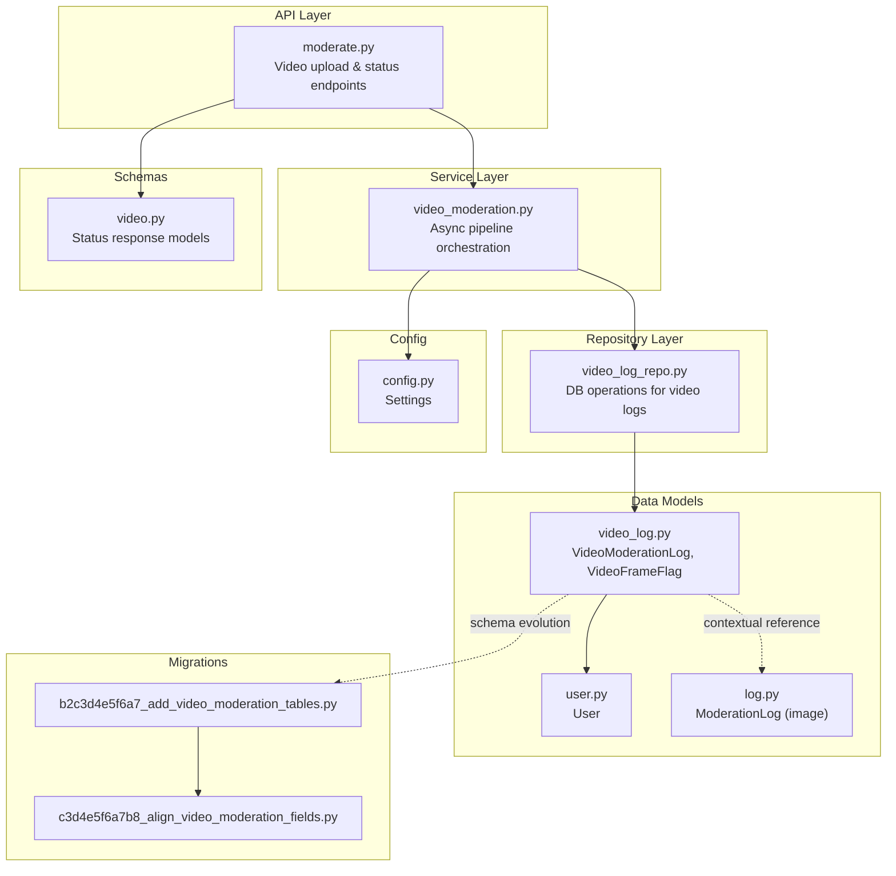
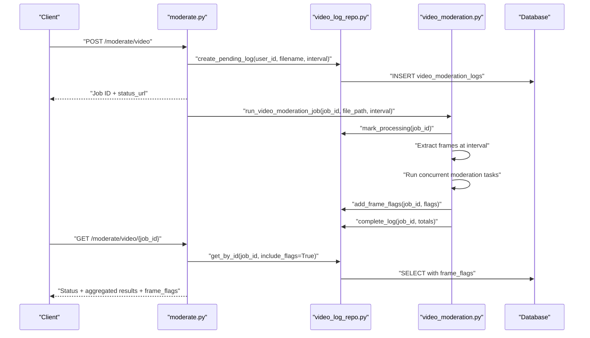
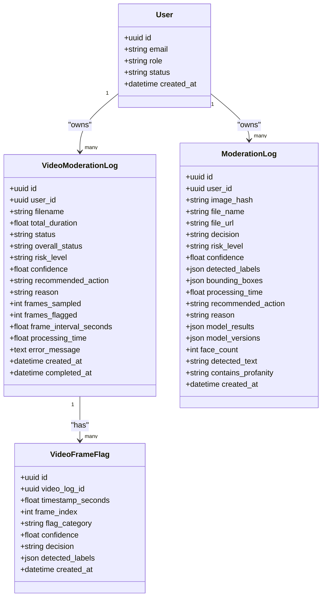
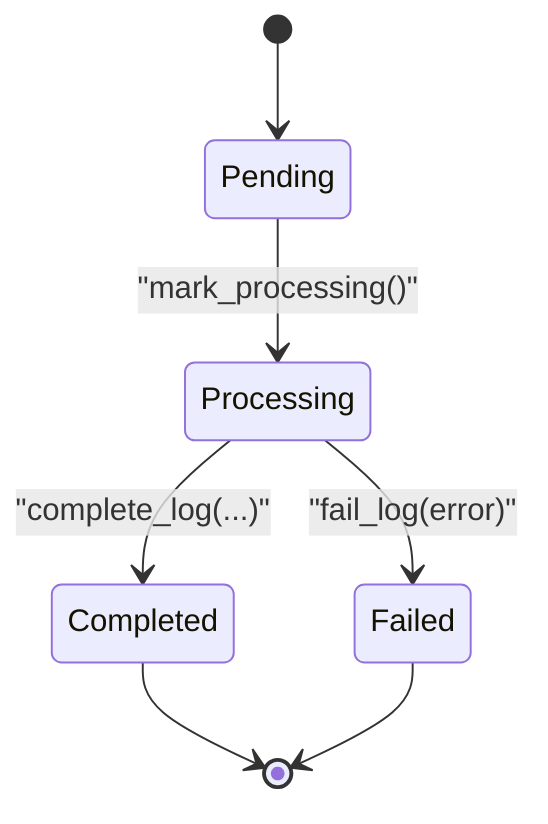
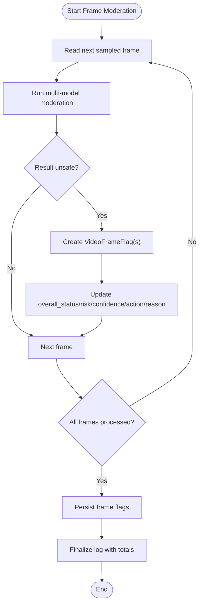
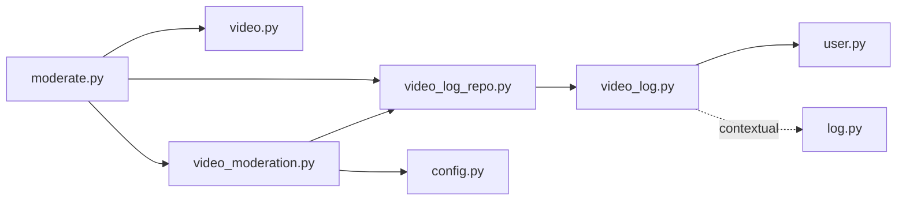

# Video Processing Logs

<cite>
**Referenced Files in This Document**
- [video_log.py](file://backend/app/models/video_log.py)
- [user.py](file://backend/app/models/user.py)
- [log.py](file://backend/app/models/log.py)
- [video.py](file://backend/app/schemas/video.py)
- [video_moderation.py](file://backend/app/services/video_moderation.py)
- [video_log_repo.py](file://backend/app/repositories/video_log_repo.py)
- [moderate.py](file://backend/app/api/moderate.py)
- [b2c3d4e5f6a7_add_video_moderation_tables.py](file://backend/migrations/versions/b2c3d4e5f6a7_add_video_moderation_tables.py)
- [c3d4e5f6a7b8_align_video_moderation_fields.py](file://backend/migrations/versions/c3d4e5f6a7b8_align_video_moderation_fields.py)
- [config.py](file://backend/app/core/config.py)
</cite>

## Table of Contents
1. Introduction
2. Project Structure
3. Core Components
4. Architecture Overview
5. Detailed Component Analysis
6. Dependency Analysis
7. Performance Considerations
8. Troubleshooting Guide
9. Conclusion

## Introduction
This document provides comprehensive data model documentation for the VideoModerationLog entity and its related structures used to track video content analysis. It covers:
- Video processing metadata (file information, duration tracking, frame extraction details, pipeline status)
- Relationships with User for auditability and with ModerationLog for context on image moderation patterns
- Status tracking system for long-running jobs, progress indicators, and error handling states
- Field definitions for video-specific attributes (resolution is not stored; codec information is not stored; timestamps are captured)
- Relationship between video logs and frame-level moderation results
- Performance considerations for large videos, storage optimization strategies, and cleanup procedures
- Example workflows and status transitions through the moderation pipeline

## Project Structure
The video moderation feature spans models, repositories, services, API endpoints, schemas, migrations, and configuration:
- Models define persistent entities and relationships
- Repositories encapsulate database operations
- Services implement the asynchronous video processing pipeline
- API endpoints expose job submission and status polling
- Schemas define request/response contracts
- Migrations capture schema evolution
- Configuration controls behavior such as sampling interval and allowed formats

**Diagram sources**
- [moderate.py](file://backend/app/api/moderate.py)
- [video_moderation.py](file://backend/app/services/video_moderation.py)
- [video_log_repo.py](file://backend/app/repositories/video_log_repo.py)
- [video_log.py](file://backend/app/models/video_log.py)
- [user.py](file://backend/app/models/user.py)
- [log.py](file://backend/app/models/log.py)
- [video.py](file://backend/app/schemas/video.py)
- [b2c3d4e5f6a7_add_video_moderation_tables.py](file://backend/migrations/versions/b2c3d4e5f6a7_add_video_moderation_tables.py)
- [c3d4e5f6a7b8_align_video_moderation_fields.py](file://backend/migrations/versions/c3d4e5f6a7b8_align_video_moderation_fields.py)
- [config.py](file://backend/app/core/config.py)

**Section sources**
- [video_log.py](file://backend/app/models/video_log.py)
- [user.py](file://backend/app/models/user.py)
- [log.py](file://backend/app/models/log.py)
- [video.py](file://backend/app/schemas/video.py)
- [video_moderation.py](file://backend/app/services/video_moderation.py)
- [video_log_repo.py](file://backend/app/repositories/video_log_repo.py)
- [moderate.py](file://backend/app/api/moderate.py)
- [b2c3d4e5f6a7_add_video_moderation_tables.py](file://backend/migrations/versions/b2c3d4e5f6a7_add_video_moderation_tables.py)
- [c3d4e5f6a7b8_align_video_moderation_fields.py](file://backend/migrations/versions/c3d4e5f6a7b8_align_video_moderation_fields.py)
- [config.py](file://backend/app/core/config.py)

## Core Components
- VideoModerationLog: Represents a video moderation job record with overall status, risk, confidence, recommended action, reason, sampling metrics, and timestamps.
- VideoFrameFlag: Represents per-frame flagging results including timestamp, frame index, category, confidence, decision, and detected labels.
- User: The owner of the video moderation job for audit purposes.
- ModerationLog: Image moderation log; included here to clarify contextual differences and similarities with video logs.

Key responsibilities:
- Persist job lifecycle and outcomes
- Track sampled frames and flagged frames
- Maintain user association for auditing
- Provide ordered frame flags for timeline inspection

**Section sources**
- [video_log.py](file://backend/app/models/video_log.py)
- [user.py](file://backend/app/models/user.py)
- [log.py](file://backend/app/models/log.py)

## Architecture Overview
The video moderation pipeline is asynchronous:
- Client uploads a video via POST /moderate/video
- Server validates headers and size, persists a pending VideoModerationLog, and returns a job token with a status URL
- Background task extracts frames at a configured interval, runs multi-model moderation concurrently, aggregates results, and updates the log
- Client polls GET /moderate/video/{job_id} to retrieve status and aggregated results, including frame flags

**Diagram sources**
- [moderate.py](file://backend/app/api/moderate.py)
- [video_log_repo.py](file://backend/app/repositories/video_log_repo.py)
- [video_moderation.py](file://backend/app/services/video_moderation.py)

## Detailed Component Analysis

### Data Model: VideoModerationLog
- Purpose: Tracks a single video moderation job’s lifecycle, inputs, outputs, and performance metrics.
- Key fields:
  - id: Primary key (UUID)
  - user_id: Optional foreign key to users.id for auditability
  - filename: Original uploaded filename
  - total_duration: Estimated duration derived from FPS and frame count
  - status: Job state machine (pending, processing, completed, failed)
  - overall_status: Aggregated safety outcome (safe, unsafe)
  - risk_level: Highest risk across frames (low, medium, high, critical)
  - confidence: Overall confidence score
  - recommended_action: Policy recommendation (allow, quarantine, block)
  - reason: Human-readable summary
  - frames_sampled: Number of frames extracted
  - frames_flagged: Number of flagged frames
  - frame_interval_seconds: Sampling interval used
  - processing_time: End-to-end processing time in seconds
  - error_message: Error details if failed
  - created_at, completed_at: Timestamps
- Relationships:
  - One-to-many with VideoFrameFlag (ordered by timestamp_seconds)
  - Many-to-one with User (back_populates)

Notes on missing attributes:
- Resolution and codec information are not persisted in this model. Duration is inferred from FPS and frame count rather than container metadata.

**Section sources**
- [video_log.py](file://backend/app/models/video_log.py)
- [b2c3d4e5f6a7_add_video_moderation_tables.py](file://backend/migrations/versions/b2c3d4e5f6a7_add_video_moderation_tables.py)
- [c3d4e5f6a7b8_align_video_moderation_fields.py](file://backend/migrations/versions/c3d4e5f6a7b8_align_video_moderation_fields.py)

### Data Model: VideoFrameFlag
- Purpose: Captures per-frame moderation findings.
- Key fields:
  - id: Primary key (UUID)
  - video_log_id: Foreign key to video_moderation_logs.id
  - timestamp_seconds: Time offset of the frame
  - frame_index: Sequential frame number
  - flag_category: Category label (e.g., NSFW, violence, weapons, faces, text)
  - confidence: Confidence score for the flag
  - decision: Decision for the frame (unsafe)
  - detected_labels: List of labels associated with the flag
  - created_at: Creation timestamp
- Ordering: Ordered by timestamp_seconds when loaded via relationship.

**Section sources**
- [video_log.py](file://backend/app/models/video_log.py)

### Data Model: User
- Purpose: Owner of moderation jobs for audit and access control.
- Key fields:
  - id: Primary key (UUID)
  - email, hashed_password, role, status, created_at
- Relationships:
  - One-to-many with VideoModerationLog (via back_populates)

**Section sources**
- [user.py](file://backend/app/models/user.py)

### Contextual Model: ModerationLog (Image)
- Purpose: Stores image moderation results. Included to contrast with video logs and highlight that video logs aggregate multiple frames into an overall decision.
- Not directly linked to VideoModerationLog; they share a common User relationship.

**Section sources**
- [log.py](file://backend/app/models/log.py)

### Repository: VideoLogRepository
- Responsibilities:
  - Create pending logs
  - Mark processing
  - Add frame flags
  - Complete or fail logs with aggregated metrics
  - Retrieve logs with optional eager loading of frame flags
- Notes:
  - Uses async SQLAlchemy sessions
  - Ensures consistent status transitions and timestamps

**Section sources**
- [video_log_repo.py](file://backend/app/repositories/video_log_repo.py)

### Service: Video Moderation Pipeline
- Responsibilities:
  - Open video file and compute FPS/frame count/duration
  - Extract exactly one frame per configured interval
  - Convert frames to RGB and write to temporary directory
  - Run concurrent multi-model moderation tasks per frame
  - Aggregate overall status, risk, confidence, recommended action, and reason
  - Persist frame flags and update log completion metrics
  - Clean up temporary files and release resources
- Error handling:
  - Marks log as failed with error message on exceptions
  - Handles individual frame errors gracefully without failing entire job

**Section sources**
- [video_moderation.py](file://backend/app/services/video_moderation.py)

### API: Video Moderation Endpoints
- POST /moderate/video:
  - Validates extension and magic bytes
  - Enforces maximum size
  - Creates pending log and enqueues background processing
  - Returns job_id and status_url
- GET /moderate/video/{job_id}:
  - Retrieves log with frame flags
  - Enforces ownership/admin access
  - Serializes status and aggregated results

**Section sources**
- [moderate.py](file://backend/app/api/moderate.py)

### Schema: Video Status Response
- Defines structured responses for job status and frame flags.
- Includes fields mirroring VideoModerationLog plus frame_flags list.

**Section sources**
- [video.py](file://backend/app/schemas/video.py)

### Migrations: Schema Evolution
- Initial creation of video_moderation_logs and video_frame_flags tables with indexes.
- Alignment migration renames columns for consistency (duration_seconds -> total_duration, decision -> overall_status, category -> flag_category).

**Section sources**
- [b2c3d4e5f6a7_add_video_moderation_tables.py](file://backend/migrations/versions/b2c3d4e5f6a7_add_video_moderation_tables.py)
- [c3d4e5f6a7b8_align_video_moderation_fields.py](file://backend/migrations/versions/c3d4e5f6a7b8_align_video_moderation_fields.py)

### Configuration: Settings
- Controls:
  - VIDEO_UPLOAD_DIR
  - ALLOWED_VIDEO_EXTENSIONS
  - MAX_VIDEO_SIZE_MB
  - VIDEO_FRAME_INTERVAL_SECONDS
  - Multi-model toggles (NSFW, violence, weapons, faces, text)
  - GPU usage flags

**Section sources**
- [config.py](file://backend/app/core/config.py)

## Architecture Overview

**Diagram sources**
- [video_log.py](file://backend/app/models/video_log.py)
- [user.py](file://backend/app/models/user.py)
- [log.py](file://backend/app/models/log.py)

## Detailed Component Analysis

### Status Tracking System and Transitions
- States:
  - pending: Created upon upload
  - processing: Extraction and moderation started
  - completed: All frames processed; aggregated results available
  - failed: Unrecoverable error occurred
- Progress Indicators:
  - frames_sampled increases during extraction
  - frames_flagged reflects number of flagged frames
  - processing_time indicates total elapsed time
  - error_message populated on failure
- Transition Logic:
  - pending -> processing: When pipeline begins
  - processing -> completed: After aggregation and persistence
  - processing -> failed: On exception or unrecoverable error

**Diagram sources**
- [video_log_repo.py](file://backend/app/repositories/video_log_repo.py)
- [video_moderation.py](file://backend/app/services/video_moderation.py)

**Section sources**
- [video_log_repo.py](file://backend/app/repositories/video_log_repo.py)
- [video_moderation.py](file://backend/app/services/video_moderation.py)

### Frame-Level Moderation Results
- Each flagged frame produces a VideoFrameFlag entry with:
  - timestamp_seconds and frame_index for timeline alignment
  - flag_category and confidence for categorization
  - decision and detected_labels for actionable insights
- Aggregation:
  - Overall status becomes unsafe if any frame is unsafe
  - Risk level is the highest among frames
  - Confidence is the maximum observed
  - Recommended action and reason reflect the most severe finding

**Diagram sources**
- [video_moderation.py](file://backend/app/services/video_moderation.py)
- [video_log_repo.py](file://backend/app/repositories/video_log_repo.py)

**Section sources**
- [video_moderation.py](file://backend/app/services/video_moderation.py)
- [video_log_repo.py](file://backend/app/repositories/video_log_repo.py)

### Relationship with User Entity
- Auditability:
  - user_id links each video log to a specific user
  - Access control ensures only owners or admins can view job status
- Cascade behavior:
  - Deleting a user cascades to their video logs and frame flags

**Section sources**
- [user.py](file://backend/app/models/user.py)
- [video_log.py](file://backend/app/models/video_log.py)
- [moderate.py](file://backend/app/api/moderate.py)

### Relationship with ModerationLog (Context)
- Both share a User relationship but serve different modalities:
  - ModerationLog captures single-image decisions
  - VideoModerationLog aggregates multi-frame decisions
- No direct foreign key link exists between them; they are independent records.

**Section sources**
- [log.py](file://backend/app/models/log.py)
- [video_log.py](file://backend/app/models/video_log.py)

## Dependency Analysis

**Diagram sources**
- [moderate.py](file://backend/app/api/moderate.py)
- [video_log_repo.py](file://backend/app/repositories/video_log_repo.py)
- [video.py](file://backend/app/schemas/video.py)
- [video_log.py](file://backend/app/models/video_log.py)
- [user.py](file://backend/app/models/user.py)
- [log.py](file://backend/app/models/log.py)
- [video_moderation.py](file://backend/app/services/video_moderation.py)
- [config.py](file://backend/app/core/config.py)

**Section sources**
- [moderate.py](file://backend/app/api/moderate.py)
- [video_log_repo.py](file://backend/app/repositories/video_log_repo.py)
- [video.py](file://backend/app/schemas/video.py)
- [video_log.py](file://backend/app/models/video_log.py)
- [user.py](file://backend/app/models/user.py)
- [log.py](file://backend/app/models/log.py)
- [video_moderation.py](file://backend/app/services/video_moderation.py)
- [config.py](file://backend/app/core/config.py)

## Performance Considerations
- Frame sampling strategy:
  - Exactly one frame per configured interval reduces computational load for long videos
  - Interval controlled by settings.VIDEO_FRAME_INTERVAL_SECONDS
- Concurrency:
  - Frames are moderated concurrently using asyncio.gather to maximize throughput
- Temporary storage:
  - Frames written to a temporary directory and deleted after processing
- Cleanup:
  - Uploaded video file is removed after processing completes or fails
  - Temp directories are automatically cleaned up by Python’s TemporaryDirectory
- Storage optimization:
  - Avoid persisting raw frames; store only flags and aggregated metrics
  - Use JSONB for detected_labels where supported
- Scalability:
  - For very large videos, consider reducing frame intervals or implementing chunked processing
  - Monitor processing_time and frames_sampled to tune intervals based on resource constraints

[No sources needed since this section provides general guidance]

## Troubleshooting Guide
Common issues and resolutions:
- Unable to open video file:
  - Cause: Corrupted or unsupported container
  - Action: Check file integrity and supported extensions; review error_message
- Unsupported extension:
  - Cause: File suffix not in ALLOWED_VIDEO_EXTENSIONS
  - Action: Convert to a supported format (.mp4, .avi, .mov, .webm, .mkv)
- Exceeds maximum size:
  - Cause: Larger than MAX_VIDEO_SIZE_MB
  - Action: Compress or trim the video before upload
- Empty file:
  - Cause: Zero-byte upload
  - Action: Re-upload a valid file
- Frame moderation errors:
  - Cause: Individual frame inference failures
  - Action: Inspect logs; these do not fail the entire job unless unhandled exceptions occur
- Unauthorized access:
  - Cause: Non-owner attempting to poll status
  - Action: Ensure correct authentication or admin privileges

**Section sources**
- [moderate.py](file://backend/app/api/moderate.py)
- [video_moderation.py](file://backend/app/services/video_moderation.py)
- [config.py](file://backend/app/core/config.py)

## Conclusion
The VideoModerationLog data model and supporting components provide a robust foundation for tracking asynchronous video moderation jobs. They capture essential metadata, maintain clear status transitions, and associate detailed frame-level findings with an overall decision. While resolution and codec information are not stored, the design balances accuracy and performance by sampling frames and aggregating results. Proper cleanup and concurrency ensure efficient handling of large videos, while user associations enable auditability and access control.