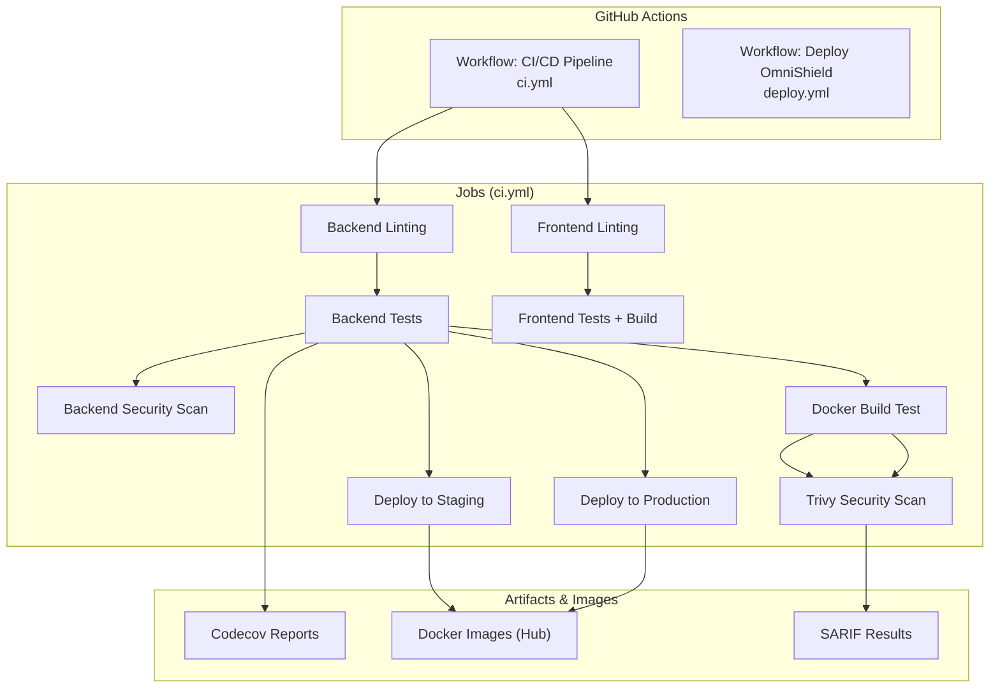
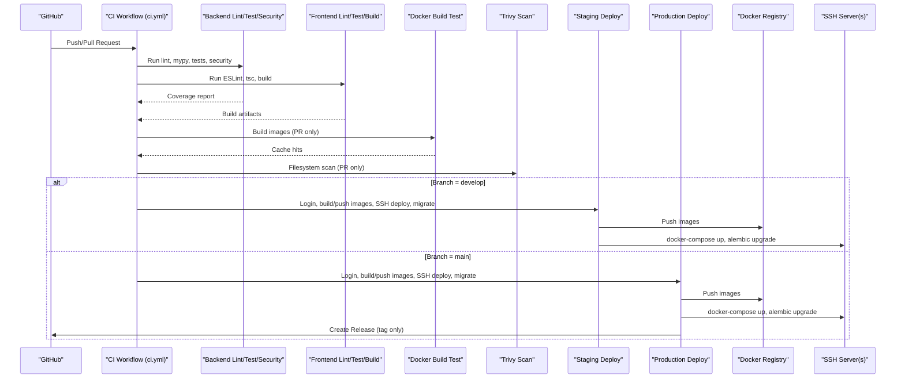
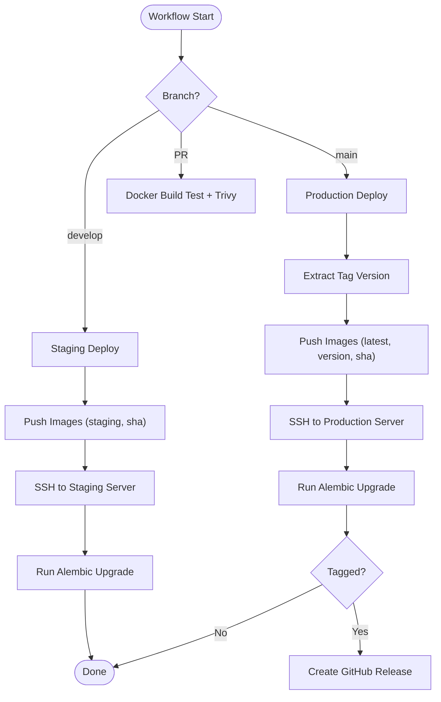
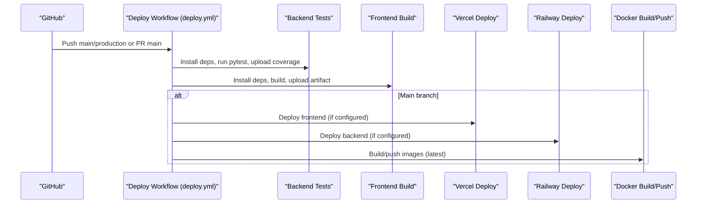
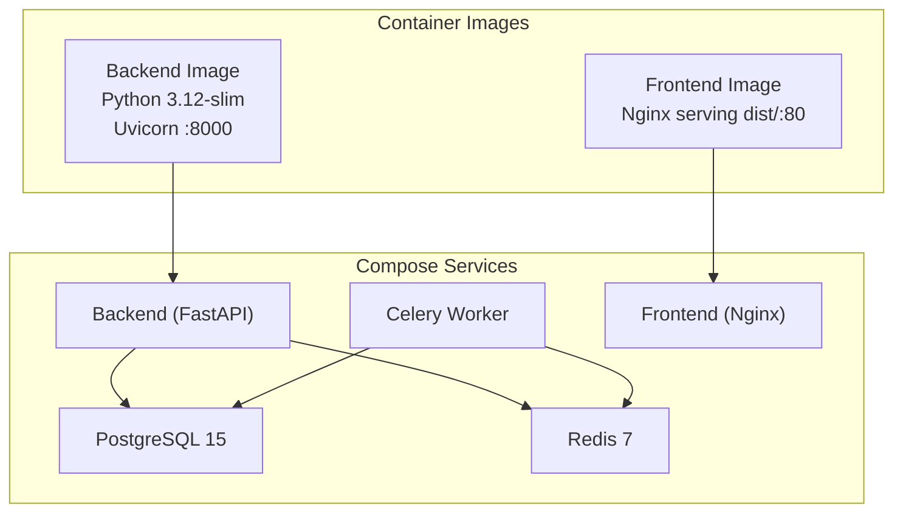
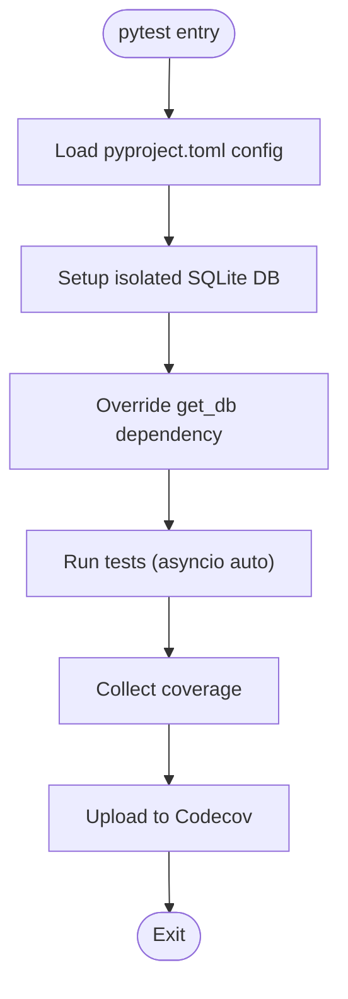
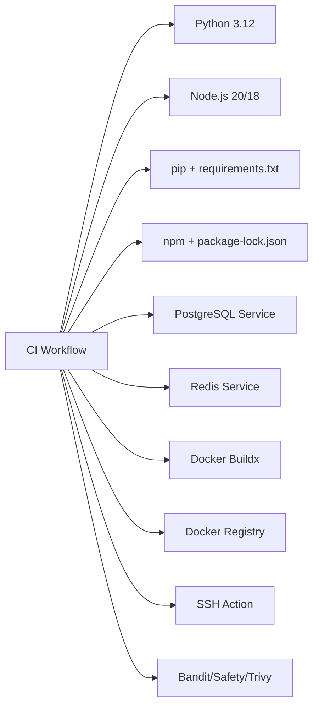

# CI/CD Pipeline

<cite>
**Referenced Files in This Document**
- [ci.yml](file://.github/workflows/ci.yml)
- [deploy.yml](file://.github/workflows/deploy.yml)
- [Dockerfile (backend)](file://backend/Dockerfile)
- [Dockerfile (frontend)](file://frontend/Dockerfile)
- [docker-compose.yml](file://docker-compose.yml)
- [pyproject.toml](file://backend/pyproject.toml)
- [requirements.txt](file://backend/requirements.txt)
- [package.json (frontend)](file://frontend/package.json)
- [conftest.py](file://backend/tests/conftest.py)
- [test_auth_routes.py](file://backend/tests/test_auth_routes.py)
- [test_moderation_engine.py](file://backend/tests/test_moderation_engine.py)
</cite>

## Table of Contents
1. [Introduction](#introduction)
2. [Project Structure](#project-structure)
3. [Core Components](#core-components)
4. [Architecture Overview](#architecture-overview)
5. [Detailed Component Analysis](#detailed-component-analysis)
6. [Dependency Analysis](#dependency-analysis)
7. [Performance Considerations](#performance-considerations)
8. [Troubleshooting Guide](#troubleshooting-guide)
9. [Conclusion](#conclusion)
10. [Appendices](#appendices)

## Introduction
This document describes the end-to-end CI/CD pipeline for OmniShield, covering continuous integration, automated testing, code quality and security checks, Docker image builds, and deployment to staging and production environments. It also explains artifact management, versioning strategies, release automation, optimization techniques, monitoring, debugging, and extensibility with external tools such as Slack notifications or monitoring systems.

## Project Structure
The repository includes two GitHub Actions workflows:
- ci.yml: Primary workflow for pull requests and pushes to main/develop, including linting, type checking, tests, security scans, Docker build validation, and environment-specific deployments.
- deploy.yml: Alternative workflow targeting main/production branches with separate test/build steps and optional cloud platform integrations.

**Diagram sources**
- [ci.yml:1-379](file://.github/workflows/ci.yml#L1-L379)

**Section sources**
- [ci.yml:1-379](file://.github/workflows/ci.yml#L1-L379)
- [deploy.yml:1-137](file://.github/workflows/deploy.yml#L1-L137)

## Core Components
- Continuous Integration Jobs
  - Backend linting and formatting (Black), linter (Ruff), and type checker (mypy).
  - Backend unit/integration tests using pytest with async support and coverage reporting.
  - Frontend linting (ESLint) and TypeScript type check; frontend build step.
  - Security scanning: Bandit and Safety for Python dependencies; Trivy filesystem scan for both backend and frontend directories.
  - Docker build validation on PRs using Buildx and GitHub Actions cache.
- Deployment Jobs
  - Staging deployment on develop branch push: login to Docker Hub, build/push images tagged with staging and commit SHA, SSH into server, run docker-compose, and apply migrations.
  - Production deployment on main branch push: tag images with latest, semantic version from tags, and commit SHA; SSH into server, update services, and create a GitHub Release when triggered by a tag.
- Environment and Secrets
  - Environment-scoped secrets for Docker registry credentials, SSH access to servers, and optional third-party tokens.
  - Environment variables injected at runtime for database, Redis, and JWT during tests.

**Section sources**
- [ci.yml:16-379](file://.github/workflows/ci.yml#L16-L379)
- [deploy.yml:1-137](file://.github/workflows/deploy.yml#L1-L137)

## Architecture Overview
The CI/CD architecture orchestrates parallel jobs across backend and frontend, performs security scans, validates container builds, and deploys to target environments based on branch and tag triggers.

**Diagram sources**
- [ci.yml:192-379](file://.github/workflows/ci.yml#L192-L379)

## Detailed Component Analysis

### Continuous Integration (ci.yml)
- Triggers
  - Push to main and develop; Pull Requests to main and develop.
- Environments
  - Global Python and Node versions defined at workflow level.
- Backend Quality Gates
  - Black format check, Ruff linting, mypy type checks.
- Backend Testing
  - PostgreSQL and Redis service containers provisioned per job.
  - System dependencies installed for OpenCV/NudeNet.
  - Pytest runs with asyncio mode and coverage; results uploaded to Codecov.
- Backend Security Scanning
  - Bandit static analysis outputting JSON report.
  - Safety vulnerability scan against requirements.txt.
- Frontend Quality Gates
  - ESLint and TypeScript type check; npm ci for deterministic installs.
- Frontend Testing and Build
  - Runs tests (with passWithNoTests fallback) and builds the app.
- Docker Build Validation (PR-only)
  - Uses Buildx and caches layers via GitHub Actions cache.
- Trivy Security Scan (PR-only)
  - Scans backend and frontend directories; uploads SARIF to GitHub Security.
- Staging Deployment (develop push)
  - Builds and pushes images tagged with staging and commit SHA.
  - SSH into server, pulls images, restarts services, runs Alembic migrations.
- Production Deployment (main push)
  - Extracts version from tags if present; otherwise uses latest.
  - Tags images with latest, version, and commit SHA.
  - SSH into server, updates services, runs migrations.
  - Creates a GitHub Release when triggered by a tag.

**Diagram sources**
- [ci.yml:256-379](file://.github/workflows/ci.yml#L256-L379)

**Section sources**
- [ci.yml:1-379](file://.github/workflows/ci.yml#L1-L379)

### Alternative Deployment Workflow (deploy.yml)
- Triggers
  - Push to main and production; Pull Requests to main.
- Jobs
  - Backend tests with pip caching and coverage upload.
  - Frontend build and artifact upload.
  - Optional Vercel deployment for frontend.
  - Optional Railway deployment for backend.
  - Docker build and push to registry with GitHub Actions cache.

**Diagram sources**
- [deploy.yml:1-137](file://.github/workflows/deploy.yml#L1-L137)

**Section sources**
- [deploy.yml:1-137](file://.github/workflows/deploy.yml#L1-L137)

### Containerization and Runtime
- Backend Image
  - Multi-stage not used; slim Python base with system libs for OpenCV/NudeNet.
  - Dependencies installed from requirements.txt.
  - NudeNet model pre-cached during build to reduce cold start time.
  - Exposes port 8000 and starts Uvicorn.
- Frontend Image
  - Two-stage build: Node builder compiles assets; Nginx serves static files.
  - Custom nginx config copied; healthcheck included.
- Local Orchestration
  - docker-compose defines Postgres, Redis, backend, Celery worker, and frontend services with networking and volumes.

**Diagram sources**
- [Dockerfile (backend):1-27](file://backend/Dockerfile#L1-L27)
- [Dockerfile (frontend):1-36](file://frontend/Dockerfile#L1-L36)
- [docker-compose.yml:1-108](file://docker-compose.yml#L1-L108)

**Section sources**
- [Dockerfile (backend):1-27](file://backend/Dockerfile#L1-L27)
- [Dockerfile (frontend):1-36](file://frontend/Dockerfile#L1-L36)
- [docker-compose.yml:1-108](file://docker-compose.yml#L1-L108)

### Testing Strategy and Configuration
- Backend
  - Pytest configuration in pyproject.toml sets asyncio auto mode and test paths.
  - conftest.py provides an isolated SQLite-based session and overrides FastAPI dependency injection for tests.
  - Example tests cover auth routes and moderation engine logic with mocked AI components.
- Coverage
  - Coverage collected over app source; reports uploaded to Codecov in CI.

**Diagram sources**
- [pyproject.toml:66-95](file://backend/pyproject.toml#L66-L95)
- [conftest.py:1-72](file://backend/tests/conftest.py#L1-L72)
- [test_auth_routes.py:1-46](file://backend/tests/test_auth_routes.py#L1-L46)
- [test_moderation_engine.py:1-92](file://backend/tests/test_moderation_engine.py#L1-L92)

**Section sources**
- [pyproject.toml:1-95](file://backend/pyproject.toml#L1-L95)
- [conftest.py:1-72](file://backend/tests/conftest.py#L1-L72)
- [test_auth_routes.py:1-46](file://backend/tests/test_auth_routes.py#L1-L46)
- [test_moderation_engine.py:1-92](file://backend/tests/test_moderation_engine.py#L1-L92)

### Code Quality and Type Checking
- Python
  - Black enforces consistent formatting.
  - Ruff applies pycodestyle, isort, flake8-comprehensions, bugbear, and pyupgrade rules.
  - mypy performs type checks with strictness options and module-level overrides for third-party packages.
- JavaScript/TypeScript
  - ESLint configured via package.json scripts; TypeScript type check via npx tsc --noEmit.

**Section sources**
- [pyproject.toml:1-65](file://backend/pyproject.toml#L1-L65)
- [package.json (frontend):1-38](file://frontend/package.json#L1-L38)

### Security Scanning
- Static Application Security Testing (SAST)
  - Bandit scans Python application code and outputs JSON report.
- Dependency Vulnerability Scanning
  - Safety checks requirements.txt for known vulnerabilities.
- Container/Filesystem Scanning
  - Trivy scans backend and frontend directories and uploads SARIF results to GitHub Security.

**Section sources**
- [ci.yml:114-131](file://.github/workflows/ci.yml#L114-L131)
- [ci.yml:224-253](file://.github/workflows/ci.yml#L224-L253)

### Artifact Management and Versioning
- Artifacts
  - Codecov coverage reports uploaded from backend tests.
  - Frontend build artifacts can be uploaded in alternative workflow.
  - SARIF security results uploaded to GitHub Security.
- Versioning Strategy
  - Staging images tagged with staging and commit SHA.
  - Production images tagged with latest, semantic version extracted from tags, and commit SHA.
  - GitHub Releases created automatically when pushing tags.

**Section sources**
- [ci.yml:256-379](file://.github/workflows/ci.yml#L256-L379)

### Deployment Pipelines and Environment-Specific Configurations
- Staging
  - Triggered on push to develop.
  - Uses environment scope with URL metadata.
  - Deploys backend, frontend, and worker services; runs Alembic migrations.
- Production
  - Triggered on push to main.
  - Uses environment scope with URL metadata.
  - Supports tag-based versioning and creates GitHub Releases.
- Secrets and Credentials
  - Docker registry credentials, SSH host/user/key for staging and production are referenced via GitHub Secrets.

**Section sources**
- [ci.yml:256-379](file://.github/workflows/ci.yml#L256-L379)

### External Integrations and Notifications
- Codecov
  - Coverage reports uploaded for visibility and trend tracking.
- GitHub Security
  - SARIF results from Trivy uploaded for centralized vulnerability tracking.
- Optional Cloud Platforms (alternative workflow)
  - Vercel deployment for frontend.
  - Railway deployment for backend.

**Section sources**
- [ci.yml:107-113](file://.github/workflows/ci.yml#L107-L113)
- [ci.yml:249-253](file://.github/workflows/ci.yml#L249-L253)
- [deploy.yml:74-102](file://.github/workflows/deploy.yml#L74-L102)

## Dependency Analysis
The CI/CD pipeline depends on:
- Language toolchains: Python 3.12 and Node.js 20 (or 18 in alternative workflow).
- Package managers: pip and npm with lockfiles for deterministic installs.
- Service containers: PostgreSQL and Redis for backend tests.
- Docker Buildx and registry authentication for image builds and pushes.
- SSH action for remote deployments.
- Third-party scanners: Bandit, Safety, Trivy.

**Diagram sources**
- [ci.yml:1-379](file://.github/workflows/ci.yml#L1-L379)
- [requirements.txt:1-142](file://backend/requirements.txt#L1-L142)
- [package.json (frontend):1-38](file://frontend/package.json#L1-L38)

**Section sources**
- [ci.yml:1-379](file://.github/workflows/ci.yml#L1-L379)
- [requirements.txt:1-142](file://backend/requirements.txt#L1-L142)
- [package.json (frontend):1-38](file://frontend/package.json#L1-L38)

## Performance Considerations
Optimization techniques implemented and recommended:
- Caching
  - pip cache enabled in setup-python steps.
  - npm cache enabled with explicit cache-dependency-path.
  - Docker layer caching via GitHub Actions cache (type=gha).
- Parallel Execution
  - Independent jobs (lint, test, security) execute concurrently by default.
- Incremental Builds
  - Use lockfiles (requirements.txt, package-lock.json) to speed up dependency resolution.
  - Pre-cache NudeNet model in backend image to reduce startup latency.
- Build Efficiency
  - Separate lint/type-check jobs to fail fast before heavy tests.
  - Limit Docker builds to PRs where appropriate.

[No sources needed since this section provides general guidance]

## Troubleshooting Guide
Common issues and remediation:
- Database Connectivity in Tests
  - Ensure PostgreSQL service is healthy and DATABASE_URL points to localhost within the runner.
  - Verify migration state and schema alignment with models.
- Redis Availability
  - Confirm Redis service is reachable on expected port and REDIS_URL is set correctly.
- Model Loading Failures
  - Validate that required system libraries are installed and NudeNet model is cached in the image.
- Docker Build Failures
  - Check context paths and Dockerfile correctness; ensure Buildx is available.
- SSH Deployment Errors
  - Validate host, user, and key secrets; confirm server accessibility and correct working directory.
- Security Scan Findings
  - Review Bandit/Safety/Trivy reports; prioritize high-severity issues and update dependencies accordingly.

**Section sources**
- [ci.yml:49-113](file://.github/workflows/ci.yml#L49-L113)
- [ci.yml:114-131](file://.github/workflows/ci.yml#L114-L131)
- [ci.yml:224-253](file://.github/workflows/ci.yml#L224-L253)
- [Dockerfile (backend):1-27](file://backend/Dockerfile#L1-L27)

## Conclusion
OmniShield’s CI/CD pipeline integrates robust quality gates, comprehensive testing, security scanning, and reliable deployment flows for staging and production. The design emphasizes parallelism, caching, and clear separation of concerns to deliver fast feedback and safe releases. With environment-scoped configurations, secret management, and optional cloud integrations, the pipeline supports scalable and maintainable delivery practices.

[No sources needed since this section summarizes without analyzing specific files]

## Appendices

### Examples of Custom Triggers and Conditional Logic
- Branch-based triggers:
  - Push to develop triggers staging deployment.
  - Push to main triggers production deployment.
- Tag-based releases:
  - When a tag is pushed, extract semantic version and create a GitHub Release.
- PR-only validations:
  - Docker build and Trivy scans run only on pull requests to avoid unnecessary work on merges.

**Section sources**
- [ci.yml:256-379](file://.github/workflows/ci.yml#L256-L379)

### Secret Management Checklist
- Docker registry credentials (username/password).
- SSH keys and hosts for staging and production servers.
- Optional tokens for Vercel/Railway if using the alternative workflow.
- Environment-specific variables for tests (database, redis, JWT).

**Section sources**
- [ci.yml:271-306](file://.github/workflows/ci.yml#L271-L306)
- [ci.yml:322-367](file://.github/workflows/ci.yml#L322-L367)

### Monitoring and Debugging Pipeline Performance
- Track job durations and failures in GitHub Actions UI.
- Inspect logs for each step; focus on failing steps first.
- Use Codecov dashboards to monitor coverage trends.
- Review SARIF results in GitHub Security tab for vulnerabilities.
- For deployments, verify SSH connectivity and docker-compose status on target servers.

**Section sources**
- [ci.yml:107-113](file://.github/workflows/ci.yml#L107-L113)
- [ci.yml:249-253](file://.github/workflows/ci.yml#L249-L253)