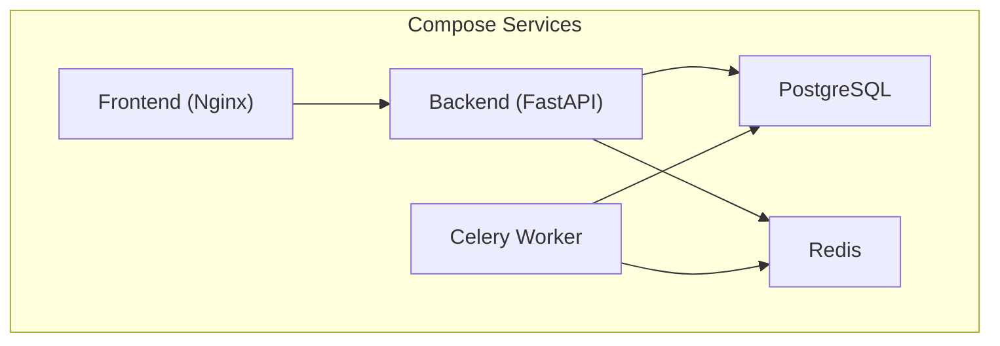
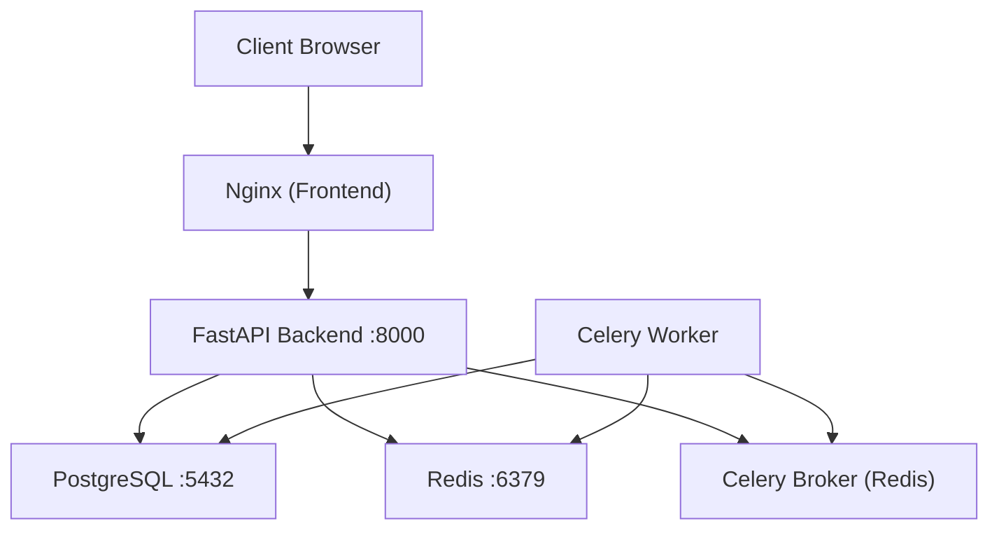
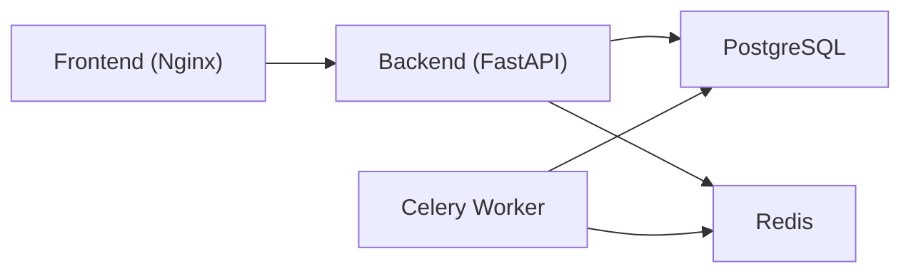

# Deployment & Infrastructure

<cite>
**Referenced Files in This Document**
- [docker-compose.yml](file://nudenet_project/docker-compose.yml)
- [backend/Dockerfile](file://nudenet_project/backend/Dockerfile)
- [frontend/Dockerfile](file://nudenet_project/frontend/Dockerfile)
- [frontend-nextjs-backup/Dockerfile](file://nudenet_project/frontend-nextjs-backup/Dockerfile)
- [.github/workflows/ci.yml](file://nudenet_project/.github/workflows/ci.yml)
- [.github/workflows/deploy.yml](file://nudenet_project/.github/workflows/deploy.yml)
- [backend/app/core/config.py](file://nudenet_project/backend/app/core/config.py)
- [backend/app/core/celery_app.py](file://nudenet_project/backend/app/core/celery_app.py)
- [DEPLOYMENT.md](file://nudenet_project/DEPLOYMENT.md)
- [ARCHITECTURE.md](file://nudenet_project/ARCHITECTURE.md)
- [README.md](file://nudenet_project/README.md)
</cite>

## Table of Contents
1. [Introduction](#introduction)
2. [Project Structure](#project-structure)
3. [Core Components](#core-components)
4. [Architecture Overview](#architecture-overview)
5. [Detailed Component Analysis](#detailed-component-analysis)
6. [Dependency Analysis](#dependency-analysis)
7. [Performance Considerations](#performance-considerations)
8. [Troubleshooting Guide](#troubleshooting-guide)
9. [Conclusion](#conclusion)
10. [Appendices](#appendices)

## Introduction
This document provides comprehensive deployment and infrastructure guidance for the OmniShield platform, focusing on containerized orchestration with Docker Compose, production-grade container images, Kubernetes patterns, CI/CD automation via GitHub Actions, monitoring and observability, backup and disaster recovery, and scaling strategies including load balancing, SSL termination, and CDN integration. It synthesizes repository-provided configurations and documentation to enable reliable, secure, and scalable deployments across staging and production environments.

## Project Structure
The project is organized into distinct services:
- Backend (FastAPI + Celery workers)
- Frontend (React build served by Nginx; a Next.js backup image exists)
- Data plane (PostgreSQL and Redis)
- Orchestration (Docker Compose)
- CI/CD (GitHub Actions workflows)
- Documentation (deployment guides, architecture notes, environment variables)

**Diagram sources**
- [docker-compose.yml:1-108](file://nudenet_project/docker-compose.yml#L1-L108)

**Section sources**
- [docker-compose.yml:1-108](file://nudenet_project/docker-compose.yml#L1-L108)

## Core Components
- Docker Compose orchestrates PostgreSQL, Redis, FastAPI backend, Celery worker, and a React frontend served by Nginx. Health checks and dependency ordering ensure stable startup.
- Backend image installs system dependencies required by AI libraries, pre-caches models at build time, and runs Uvicorn.
- Frontend image uses a multi-stage build to produce static assets and serve them via Nginx with a health check.
- Configuration is centralized in a settings module that validates environment-specific values and exposes Prometheus metrics toggles.
- Celery app is configured with broker and result backend pointing to Redis.

Key responsibilities:
- docker-compose.yml: service definitions, networking, volumes, health checks, environment injection, restart policies.
- backend/Dockerfile: Python runtime, OS libs, pip install, model pre-cache, Uvicorn entrypoint.
- frontend/Dockerfile: Node builder stage, Nginx runtime, health check, static asset serving.
- config.py: typed configuration with validators, CORS, rate limits, storage paths, feature flags, and metrics toggle.
- celery_app.py: Celery initialization and task imports.

**Section sources**
- [docker-compose.yml:1-108](file://nudenet_project/docker-compose.yml#L1-L108)
- [backend/Dockerfile:1-27](file://nudenet_project/backend/Dockerfile#L1-L27)
- [frontend/Dockerfile:1-36](file://nudenet_project/frontend/Dockerfile#L1-L36)
- [backend/app/core/config.py:1-148](file://nudenet_project/backend/app/core/config.py#L1-L148)
- [backend/app/core/celery_app.py:1-21](file://nudenet_project/backend/app/core/celery_app.py#L1-L21)

## Architecture Overview
The platform follows a microservice-style composition within a single host or cluster:
- Ingress/Nginx serves the frontend and can be extended to reverse-proxy API calls.
- FastAPI handles HTTP requests, interacts with PostgreSQL and Redis, and enqueues background tasks via Celery.
- Celery workers consume tasks from Redis and persist results back to the database.
- Observability components (Prometheus/Grafana) are recommended as external collectors.

**Diagram sources**
- [docker-compose.yml:1-108](file://nudenet_project/docker-compose.yml#L1-L108)
- [backend/app/core/celery_app.py:1-21](file://nudenet_project/backend/app/core/celery_app.py#L1-L21)

## Detailed Component Analysis

### Docker Compose Orchestration
- Services:
  - postgres: Alpine-based Postgres with persistent volume and health check using pg_isready.
  - redis: Alpine-based Redis with AOF enabled and health check using redis-cli ping.
  - backend: FastAPI built from backend/Dockerfile, depends on healthy postgres and redis, mounts upload directories, sets environment for DB, Redis, Celery, CORS, and environment mode.
  - celery: Same image as backend but runs Celery worker process, depends on redis and postgres.
  - frontend: Built from frontend/Dockerfile, maps port 80, depends on backend.
- Networking: All services share omnishield-network bridge network.
- Volumes: Persistent data for postgres and redis.
- Restart policy: unless-stopped for resilience.

Operational notes:
- Ensure DATABASE_URL uses async driver when targeting Postgres.
- Use separate Redis databases for cache and Celery broker/result backend.
- Mount only necessary directories for uploads/datasets.

**Section sources**
- [docker-compose.yml:1-108](file://nudenet_project/docker-compose.yml#L1-L108)

### Backend Container Image
- Base image: python:3.12-slim
- Installs system libraries needed by OpenCV/AI workloads
- Copies requirements.txt and installs Python dependencies
- Pre-caches NudeNet ONNX model during build to reduce cold-start latency
- Exposes port 8000 and starts Uvicorn bound to 0.0.0.0

Optimization opportunities:
- Multi-stage builds to separate build-time tools from runtime
- Pin exact versions in requirements.txt and use --no-deps where safe
- Consider distroless or minimal base if GPU not required

**Section sources**
- [backend/Dockerfile:1-27](file://nudenet_project/backend/Dockerfile#L1-L27)

### Frontend Container Image
- Multi-stage build:
  - Builder stage: node:18-alpine installs deps and builds static assets
  - Runtime stage: nginx:alpine serves /usr/share/nginx/html
- Custom Nginx config is copied into the image
- Health check probes http://localhost/
- Exposes port 80

Notes:
- The compose file references a different frontend context path than the current frontend directory; verify consistency between compose and actual source layout.
- For Next.js, an alternative image exists in frontend-nextjs-backup/Dockerfile.

**Section sources**
- [frontend/Dockerfile:1-36](file://nudenet_project/frontend/Dockerfile#L1-L36)
- [frontend-nextjs-backup/Dockerfile:1-22](file://nudenet_project/frontend-nextjs-backup/Dockerfile#L1-L22)

### Configuration and Environment Management
- Centralized Settings class with Pydantic validation:
  - Enforces ENVIRONMENT enum and JWT_SECRET change in production
  - Converts postgresql:// to postgresql+asyncpg:// for async usage
  - Configures Redis URLs, Celery broker/backend, cache TTLs
  - Defines upload/video directories, allowed types/sizes, thresholds
  - Feature flags for multiple AI detection modules
  - Optional Cloudinary/S3 integrations
  - Prometheus metrics toggle and Sentry DSN placeholder
- Celery app initializes with broker and backend from settings and auto-imports tasks.

Best practices:
- Provide environment variables via secrets management in production
- Validate CORS_ORIGINS strictly in production
- Separate Redis instances or databases for cache vs queue

**Section sources**
- [backend/app/core/config.py:1-148](file://nudenet_project/backend/app/core/config.py#L1-L148)
- [backend/app/core/celery_app.py:1-21](file://nudenet_project/backend/app/core/celery_app.py#L1-L21)

### CI/CD Pipelines (GitHub Actions)
Two workflows are provided:

- ci.yml:
  - Linting and type checks for backend (Black, Ruff, mypy)
  - Backend tests with Postgres and Redis services, coverage upload
  - Security scans (Bandit, Safety)
  - Frontend linting, TypeScript checks, tests, and build
  - Docker build test with Buildx caching
  - Trivy filesystem scan and SARIF upload
  - Deploy-to-staging and deploy-to-production jobs using SSH to run docker-compose pull/up and Alembic migrations

- deploy.yml:
  - Backend tests and coverage
  - Frontend build and artifact upload
  - Optional deployments to Vercel (frontend) and Railway (backend)
  - Docker build and push to Docker Hub with GHA cache

Operational considerations:
- Secrets required include Docker credentials, SSH keys for target hosts, and optional platform tokens
- Migrations are executed post-deploy against the running database
- Tagging strategy supports latest, version tags, and commit SHAs

**Section sources**
- [.github/workflows/ci.yml:1-379](file://nudenet_project/.github/workflows/ci.yml#L1-L379)
- [.github/workflows/deploy.yml:1-137](file://nudenet_project/.github/workflows/deploy.yml#L1-L137)

### Kubernetes Deployment Patterns
Recommended patterns based on repository documentation:
- Secrets management via Kubernetes Secret objects
- StatefulSet for PostgreSQL with PersistentVolumeClaim templates
- Deployment for backend with resource requests/limits and liveness/readiness probes
- Service resources for internal DNS-based discovery
- HorizontalPodAutoscaler targeting CPU and memory utilization thresholds

Example artifacts referenced:
- k8s/secrets.yaml
- k8s/postgres.yaml
- k8s/backend.yaml
- HPA manifest

Apply manifests with kubectl apply -f k8s/.

**Section sources**
- [DEPLOYMENT.md:430-617](file://nudenet_project/DEPLOYMENT.md#L430-L617)

### Monitoring and Observability
- Metrics exposure is configurable via ENABLE_PROMETHEUS_METRICS
- Recommended metrics categories include HTTP performance, AI inference, database pool, cache hit rates, and business KPIs
- Alert rules examples cover error rates, slow inference, and database availability
- Grafana dashboards should visualize request rates, errors, latency percentiles, resource usage, and AI performance

Implementation guidance:
- Export Prometheus metrics from FastAPI endpoints
- Scrape metrics with Prometheus and visualize in Grafana
- Configure alerting rules to notify on SLO breaches

**Section sources**
- [ARCHITECTURE.md:653-723](file://nudenet_project/ARCHITECTURE.md#L653-L723)
- [README.md:541-620](file://nudenet_project/README.md#L541-L620)

### Backup and Disaster Recovery
Strategies aligned with repository guidance:
- Database backups:
  - Use pg_dump/pg_restore or native cloud snapshots for PostgreSQL
  - Schedule periodic backups and retain multiple generations
- File storage replication:
  - For local uploads, replicate mounted volumes or migrate to object storage (Cloudinary/S3)
  - Ensure consistent snapshots of upload directories
- Rollback procedures:
  - Maintain tagged images and rollback by redeploying previous tag
  - Keep migration history; avoid destructive downgrades without testing
  - Use blue/green or rolling updates to minimize downtime

Operational checklist:
- Verify backup integrity regularly
- Test restore procedures in staging
- Document runbooks for incident response and rollback steps

[No sources needed since this section provides general guidance]

### Scaling and High-Traffic Considerations
- Horizontal scaling:
  - Increase replicas for backend and Celery workers based on CPU/memory utilization
  - Use HPA to auto-scale pods under load
- Load balancing:
  - Place Nginx or an ingress controller in front of backend services
  - Distribute traffic across multiple backend replicas
- SSL termination:
  - Terminate TLS at ingress/Nginx or use a managed certificate provider (e.g., Let’s Encrypt via cert-manager)
- CDN integration:
  - Serve static assets through a CDN for global distribution
  - Offload media files to object storage with CDN-backed URLs
- Caching:
  - Tune Redis cache TTLs and consider read replicas for high-read workloads
- Queues:
  - Scale Celery workers horizontally; monitor queue depth and adjust concurrency

[No sources needed since this section provides general guidance]

## Dependency Analysis
Service-level dependencies and interactions:

**Diagram sources**
- [docker-compose.yml:1-108](file://nudenet_project/docker-compose.yml#L1-L108)
- [backend/app/core/celery_app.py:1-21](file://nudenet_project/backend/app/core/celery_app.py#L1-L21)

**Section sources**
- [docker-compose.yml:1-108](file://nudenet_project/docker-compose.yml#L1-L108)

## Performance Considerations
- Container image optimization:
  - Use multi-stage builds to minimize runtime image size
  - Pre-warm heavy models at build time to reduce cold starts
- Resource allocation:
  - Set appropriate requests/limits for CPU and memory
  - Monitor and right-size based on observed utilization
- Database tuning:
  - Configure connection pools and timeouts
  - Use read replicas for read-heavy workloads
- Cache strategy:
  - Leverage Redis for session/cache and Celery broker/backend separation
- I/O and storage:
  - Prefer object storage for large media files
  - Use SSD-backed volumes for databases

[No sources needed since this section provides general guidance]

## Troubleshooting Guide
Common issues and resolutions:
- Startup failures due to missing dependencies:
  - Ensure system libraries are installed in the backend image
  - Validate pip install succeeds and model pre-cache completes
- Database connectivity:
  - Confirm DATABASE_URL uses async driver for Postgres
  - Check health checks and network reachability
- Redis connectivity:
  - Verify REDIS_URL and Celery URLs point to correct databases
  - Ensure AOF persistence is enabled if durability is required
- CORS misconfiguration:
  - Restrict CORS_ORIGINS in production and validate client origins
- Migration errors:
  - Run Alembic upgrade head after deploying new schema changes
- Health checks failing:
  - Inspect Nginx health endpoint and backend /health route

**Section sources**
- [backend/Dockerfile:1-27](file://nudenet_project/backend/Dockerfile#L1-L27)
- [frontend/Dockerfile:1-36](file://nudenet_project/frontend/Dockerfile#L1-L36)
- [docker-compose.yml:1-108](file://nudenet_project/docker-compose.yml#L1-L108)
- [backend/app/core/config.py:1-148](file://nudenet_project/backend/app/core/config.py#L1-L148)

## Conclusion
OmniShield’s deployment stack combines Docker Compose for local and simple deployments, robust CI/CD pipelines for automated quality and release processes, and Kubernetes patterns for scalable production operations. With careful configuration of environment variables, secrets, and observability, the platform can be reliably scaled, monitored, and maintained across environments.

[No sources needed since this section summarizes without analyzing specific files]

## Appendices

### Environment Variables Reference
- ENVIRONMENT: development, staging, production
- JWT_SECRET: secure secret for token signing
- DATABASE_URL: Postgres connection string (async driver for Postgres)
- REDIS_URL: Redis connection string
- CELERY_BROKER_URL and CELERY_RESULT_BACKEND: Redis queues
- CORS_ORIGINS: comma-separated list of allowed origins
- MAX_FILE_SIZE_MB, DEFAULT_RATE_LIMIT_PER_MINUTE, USE_GPU, ENABLE_PROMETHEUS_METRICS, SENTRY_DSN

**Section sources**
- [backend/app/core/config.py:1-148](file://nudenet_project/backend/app/core/config.py#L1-L148)
- [README.md:541-620](file://nudenet_project/README.md#L541-L620)

### Kubernetes Manifests Summary
- Secrets: store sensitive values like JWT and DB credentials
- StatefulSet: PostgreSQL with PVC templates
- Deployment: backend with probes and resource constraints
- Service: internal DNS for service discovery
- HPA: autoscale based on CPU and memory targets

**Section sources**
- [DEPLOYMENT.md:430-617](file://nudenet_project/DEPLOYMENT.md#L430-L617)