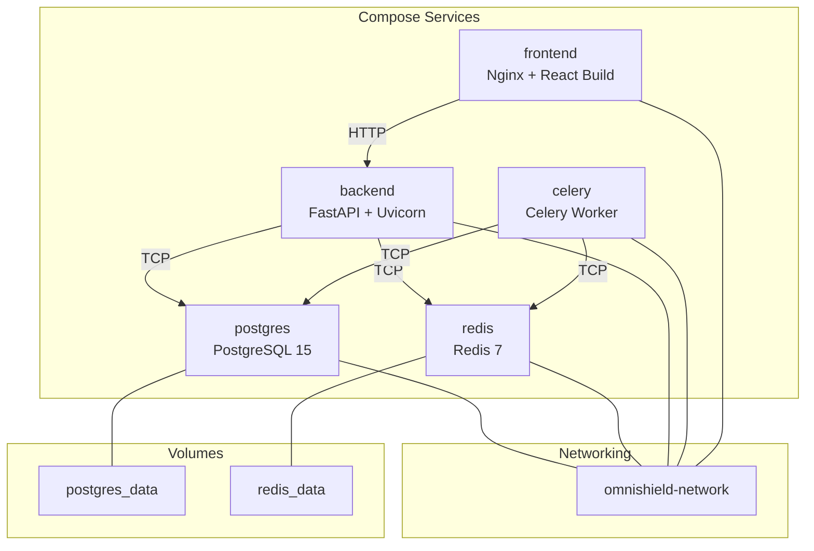
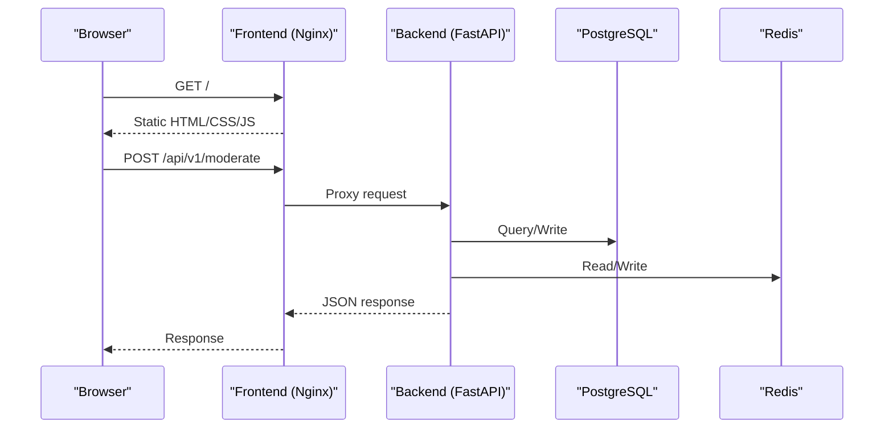
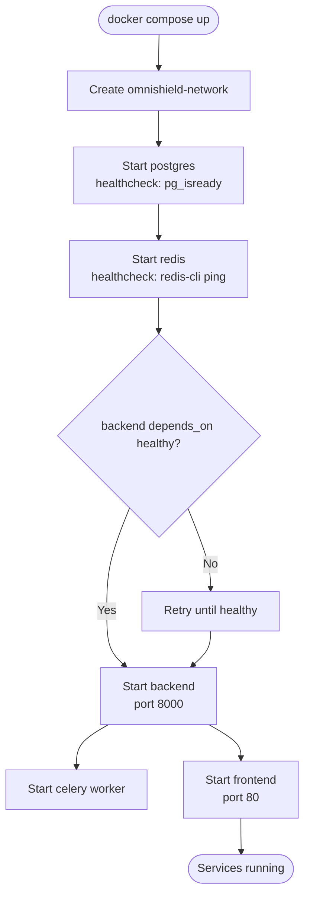
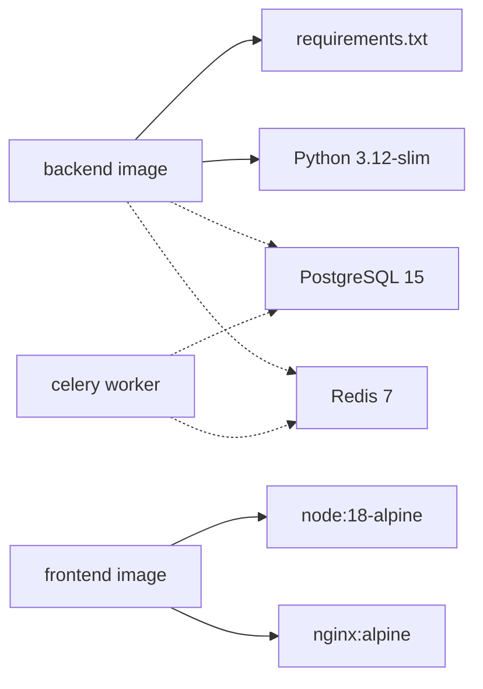

# Docker & Containerization

<cite>
**Referenced Files in This Document**
- [docker-compose.yml](file://nudenet_project/docker-compose.yml)
- [backend/Dockerfile](file://nudenet_project/backend/Dockerfile)
- [frontend/Dockerfile](file://nudenet_project/frontend/Dockerfile)
- [frontend/nginx.conf](file://nudenet_project/frontend/nginx.conf)
- [backend/requirements.txt](file://nudenet_project/backend/requirements.txt)
- [backend/app/core/config.py](file://nudenet_project/backend/app/core/config.py)
- [backend/app/core/celery_app.py](file://nudenet_project/backend/app/core/celery_app.py)
- [backend/app/main.py](file://nudenet_project/backend/app/main.py)
- [DEPLOYMENT.md](file://nudenet_project/DEPLOYMENT.md)
</cite>

## Table of Contents
1. [Introduction](#introduction)
2. [Project Structure](#project-structure)
3. [Core Components](#core-components)
4. [Architecture Overview](#architecture-overview)
5. [Detailed Component Analysis](#detailed-component-analysis)
6. [Dependency Analysis](#dependency-analysis)
7. [Performance Considerations](#performance-considerations)
8. [Troubleshooting Guide](#troubleshooting-guide)
9. [Conclusion](#conclusion)
10. [Appendices](#appendices)

## Introduction
This document provides comprehensive containerization guidance for the OmniShield platform using Docker and Docker Compose. It covers multi-service orchestration (PostgreSQL, Redis, FastAPI backend, Celery workers, React frontend), health checks, dependency management, networking, volume persistence, environment-specific configuration, security best practices, scaling strategies, and troubleshooting techniques.

## Project Structure
The repository includes:
- A Docker Compose file that defines all services, networks, volumes, and dependencies.
- Backend and frontend Dockerfiles optimized for production builds.
- Nginx configuration for serving the static React build.
- Backend configuration and task queue setup used by containers.
- Deployment documentation with examples for production and Kubernetes.

**Diagram sources**
- [docker-compose.yml:1-108](file://nudenet_project/docker-compose.yml#L1-L108)

**Section sources**
- [docker-compose.yml:1-108](file://nudenet_project/docker-compose.yml#L1-L108)

## Core Components
- PostgreSQL service: persistent relational database with health check and named volume.
- Redis service: cache and message broker with append-only mode and health check.
- FastAPI backend: Python application built from a slim image, exposing port 8000, with environment-driven configuration.
- Celery worker: background tasks consuming from Redis broker and storing results in Redis.
- React frontend: statically built app served by Nginx with a health check.

Key behaviors:
- Health checks ensure dependent services are ready before starting others.
- Named volumes persist database and cache data across restarts.
- A shared bridge network isolates inter-service communication.
- Environment variables configure database, cache, CORS, and runtime behavior.

**Section sources**
- [docker-compose.yml:1-108](file://nudenet_project/docker-compose.yml#L1-L108)
- [backend/app/core/config.py:1-148](file://nudenet_project/backend/app/core/config.py#L1-L148)
- [backend/app/core/celery_app.py:1-21](file://nudenet_project/backend/app/core/celery_app.py#L1-L21)

## Architecture Overview
The system follows a microservices-style architecture orchestrated by Docker Compose:
- Frontend serves static assets via Nginx and proxies API calls to the backend.
- Backend exposes REST endpoints and integrates with PostgreSQL and Redis.
- Celery workers process asynchronous jobs using Redis as broker and result backend.

**Diagram sources**
- [frontend/Dockerfile:1-36](file://nudenet_project/frontend/Dockerfile#L1-L36)
- [frontend/nginx.conf](file://nudenet_project/frontend/nginx.conf)
- [backend/app/main.py:1-126](file://nudenet_project/backend/app/main.py#L1-L126)
- [docker-compose.yml:1-108](file://nudenet_project/docker-compose.yml#L1-L108)

## Detailed Component Analysis

### Docker Compose Orchestration
- Services: postgres, redis, backend, celery, frontend.
- Networking: omnishield-network bridge network for internal communication.
- Volumes: postgres_data and redis_data for persistence.
- Dependencies: backend depends on healthy postgres and redis; celery depends on redis and postgres; frontend depends on backend.
- Ports: 5432 (postgres), 6379 (redis), 8000 (backend), 80 (frontend).
- Health checks: postgres uses pg_isready; redis uses redis-cli ping; frontend uses wget against root path.

**Diagram sources**
- [docker-compose.yml:1-108](file://nudenet_project/docker-compose.yml#L1-L108)

**Section sources**
- [docker-compose.yml:1-108](file://nudenet_project/docker-compose.yml#L1-L108)

### Backend Image and Runtime
- Base image: python:3.12-slim.
- System dependencies installed for OpenCV/NudeNet runtime.
- Requirements installed once per layer to leverage Docker cache.
- NudeNet model pre-cached during build to reduce startup time.
- Application code copied last to maximize cache efficiency.
- Exposes port 8000 and runs uvicorn.

Security and optimization notes:
- Slim base reduces attack surface and image size.
- Pre-caching heavy models avoids repeated downloads at runtime.
- Layer ordering optimizes rebuild speed when only source changes.

Environment integration:
- DATABASE_URL, REDIS_URL, CELERY_BROKER_URL, CELERY_RESULT_BACKEND configured via compose.
- ENVIRONMENT controls CORS and security headers.

**Section sources**
- [backend/Dockerfile:1-27](file://nudenet_project/backend/Dockerfile#L1-L27)
- [backend/requirements.txt:1-142](file://nudenet_project/backend/requirements.txt#L1-L142)
- [backend/app/core/config.py:1-148](file://nudenet_project/backend/app/core/config.py#L1-L148)
- [backend/app/main.py:1-126](file://nudenet_project/backend/app/main.py#L1-L126)

### Celery Worker Configuration
- Uses the same backend image but overrides command to run Celery worker.
- Broker and result backend point to Redis.
- Auto-imports tasks from app.tasks.

Operational considerations:
- Scale workers independently via compose or orchestrator.
- Ensure sufficient CPU/memory for AI workloads.

**Section sources**
- [docker-compose.yml:68-85](file://nudenet_project/docker-compose.yml#L68-L85)
- [backend/app/core/celery_app.py:1-21](file://nudenet_project/backend/app/core/celery_app.py#L1-L21)

### Frontend Image and Nginx Serving
- Multi-stage build: Node builder compiles React app; Nginx serves static files.
- Production dependencies only during build to minimize image size.
- Custom nginx.conf mounted into container.
- Health check probes HTTP root endpoint.

Best practices:
- Separate build and runtime stages reduce final image size.
- Using alpine-based images minimizes footprint.

**Section sources**
- [frontend/Dockerfile:1-36](file://nudenet_project/frontend/Dockerfile#L1-L36)
- [frontend/nginx.conf](file://nudenet_project/frontend/nginx.conf)

### Database and Cache Persistence
- PostgreSQL data stored in named volume postgres_data.
- Redis data persisted via named volume redis_data with append-only enabled.
- Data survives container restarts and can be backed up externally.

**Section sources**
- [docker-compose.yml:4-39](file://nudenet_project/docker-compose.yml#L4-L39)

### Networking and Isolation
- All services attached to omnishield-network bridge network.
- Internal DNS resolution by service name (e.g., postgres, redis).
- Only necessary ports exposed to host machine.

**Section sources**
- [docker-compose.yml:105-108](file://nudenet_project/docker-compose.yml#L105-L108)

### Health Checks and Dependency Management
- Postgres healthcheck uses pg_isready.
- Redis healthcheck uses redis-cli ping.
- Frontend healthcheck uses wget against root path.
- Backend depends_on conditions ensure readiness before start.

Operational impact:
- Prevents race conditions during startup.
- Enables orchestrators to detect unhealthy services.

**Section sources**
- [docker-compose.yml:16-39](file://nudenet_project/docker-compose.yml#L16-L39)
- [docker-compose.yml:56-66](file://nudenet_project/docker-compose.yml#L56-L66)

### Security Best Practices
- Use slim/alpine base images to reduce attack surface.
- Avoid mounting secrets directly; prefer environment injection or secret managers.
- Restrict CORS_ORIGINS in production.
- Add resource limits and restart policies for resilience.
- Consider non-root users in custom images where feasible.

Configuration enforcement:
- ENVIRONMENT validation and warnings for insecure defaults.

**Section sources**
- [backend/app/core/config.py:117-148](file://nudenet_project/backend/app/core/config.py#L117-L148)
- [backend/app/main.py:26-57](file://nudenet_project/backend/app/main.py#L26-L57)

## Dependency Analysis
Service-level dependencies and external libraries:
- Backend depends on asyncpg, psycopg2-binary, SQLAlchemy, alembic, redis, celery, fastapi, uvicorn, and AI libraries (torch, opencv, nudenet).
- Frontend build depends on Node toolchain and React/Vite stack.

**Diagram sources**
- [backend/Dockerfile:1-27](file://nudenet_project/backend/Dockerfile#L1-L27)
- [frontend/Dockerfile:1-36](file://nudenet_project/frontend/Dockerfile#L1-L36)
- [backend/requirements.txt:1-142](file://nudenet_project/backend/requirements.txt#L1-L142)
- [docker-compose.yml:1-108](file://nudenet_project/docker-compose.yml#L1-L108)

**Section sources**
- [backend/requirements.txt:1-142](file://nudenet_project/backend/requirements.txt#L1-L142)
- [docker-compose.yml:1-108](file://nudenet_project/docker-compose.yml#L1-L108)

## Performance Considerations
- Image size:
  - Use slim/alpine bases and multi-stage builds.
  - Pre-cache large models during build to avoid runtime overhead.
- Startup time:
  - Leverage Docker layer caching by copying requirements first.
  - Keep HEALTHCHECK intervals reasonable to avoid flapping.
- Resource allocation:
  - Set CPU/memory limits for AI-heavy services (backend, celery).
  - Tune Celery concurrency based on available resources.
- I/O:
  - Prefer named volumes over bind mounts for databases.
  - Enable Redis append-only for durability vs performance trade-offs.
- Network:
  - Keep services on an internal network; expose only required ports.
- Observability:
  - Use Prometheus metrics endpoint if enabled.
  - Centralize logs and set log levels appropriately per environment.

[No sources needed since this section provides general guidance]

## Troubleshooting Guide
Common issues and diagnostics:
- Database connectivity:
  - Verify postgres is healthy and reachable by service name.
  - Check connection strings and credentials.
- Redis connectivity:
  - Confirm redis-cli ping succeeds inside the network.
  - Validate broker/result URLs for Celery.
- Model loading errors:
  - Ensure NudeNet model is cached in the image or accessible at runtime.
- High memory usage:
  - Inspect container stats and adjust resource limits.
  - Scale down Celery workers if overloaded.
- Slow API responses:
  - Review database query performance and Redis cache hit rates.
  - Inspect backend logs for bottlenecks.

Useful commands:
- docker compose ps, logs, exec, stats.
- docker compose down -v to reset persistent volumes (with caution).

**Section sources**
- [DEPLOYMENT.md:718-800](file://nudenet_project/DEPLOYMENT.md#L718-L800)

## Conclusion
OmniShield’s containerized deployment leverages Docker Compose to orchestrate a robust, scalable stack. The provided Dockerfiles emphasize small image sizes and fast startup through multi-stage builds and dependency pre-caching. Health checks, named volumes, and isolated networking improve reliability and maintainability. With environment-driven configuration and clear scaling paths, the platform supports both development and production needs.

[No sources needed since this section summarizes without analyzing specific files]

## Appendices

### Environment-Specific Configuration Examples
- Development:
  - Allow broad CORS origins and verbose logging.
  - Bind database/cache ports to host for local debugging.
- Staging/Production:
  - Restrict CORS_ORIGINS to trusted domains.
  - Inject secrets via environment or secret managers.
  - Apply resource limits and restart policies.
  - Use health checks and readiness probes.

Reference patterns:
- See production-oriented compose example and environment variable table.

**Section sources**
- [DEPLOYMENT.md:162-247](file://nudenet_project/DEPLOYMENT.md#L162-L247)
- [DEPLOYMENT.md:620-648](file://nudenet_project/DEPLOYMENT.md#L620-L648)

### Scaling Individual Services
- Scale Celery workers horizontally to handle increased background job throughput.
- Run multiple backend replicas behind a reverse proxy or load balancer.
- Adjust replica counts based on observed CPU/memory utilization.

Example references:
- Compose scaling and resource definitions in deployment docs.

**Section sources**
- [DEPLOYMENT.md:162-247](file://nudenet_project/DEPLOYMENT.md#L162-L247)

### Volume Management
- Persistent storage:
  - postgres_data for PostgreSQL data directory.
  - redis_data for Redis data directory.
- Backup strategy:
  - Periodically snapshot named volumes or use native tools (pg_dump, Redis RDB/AOF).

**Section sources**
- [docker-compose.yml:101-104](file://nudenet_project/docker-compose.yml#L101-L104)

### Health Check Endpoints
- Backend exposes a health endpoint for liveness/readiness checks.
- Frontend health check validates Nginx serving static content.

**Section sources**
- [backend/app/main.py:84-96](file://nudenet_project/backend/app/main.py#L84-L96)
- [frontend/Dockerfile:30-32](file://nudenet_project/frontend/Dockerfile#L30-L32)