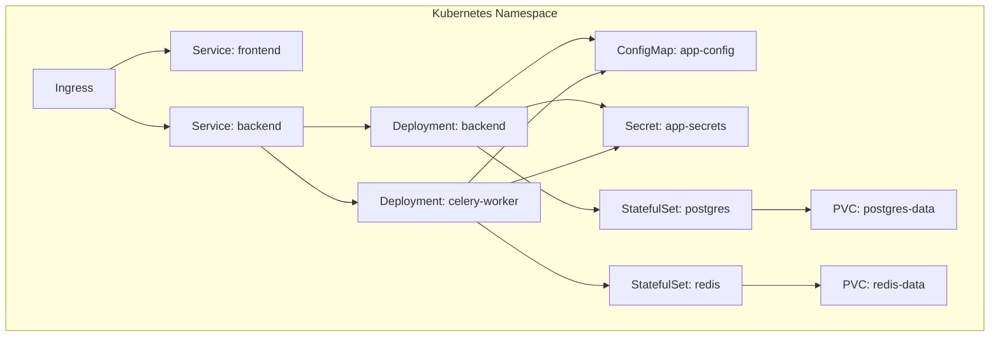
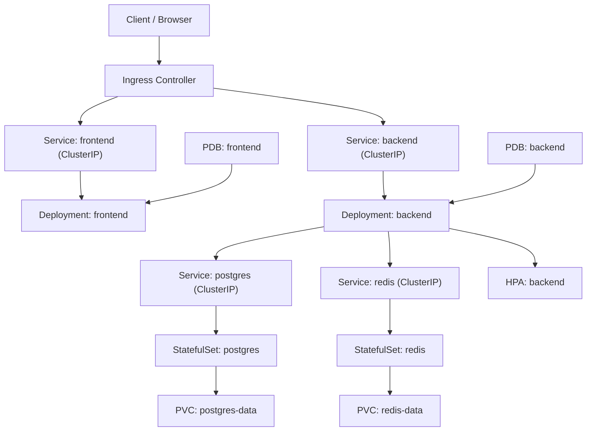
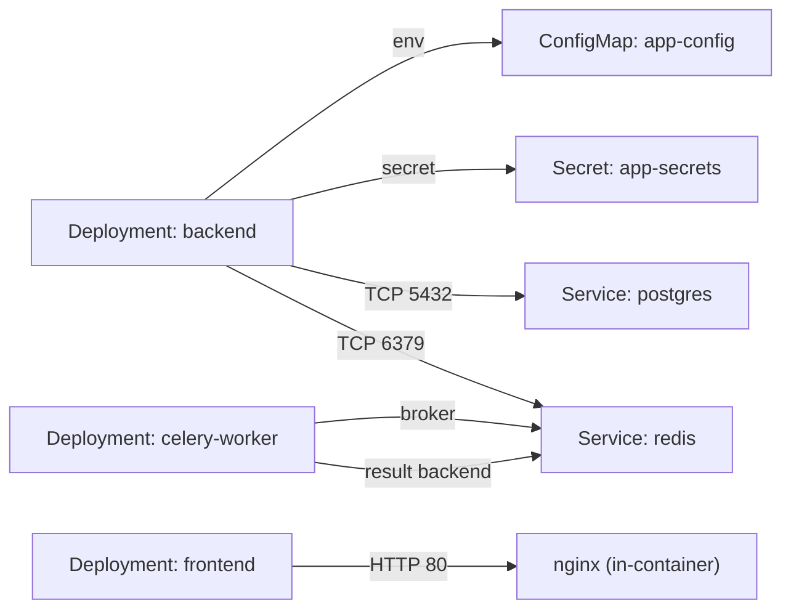
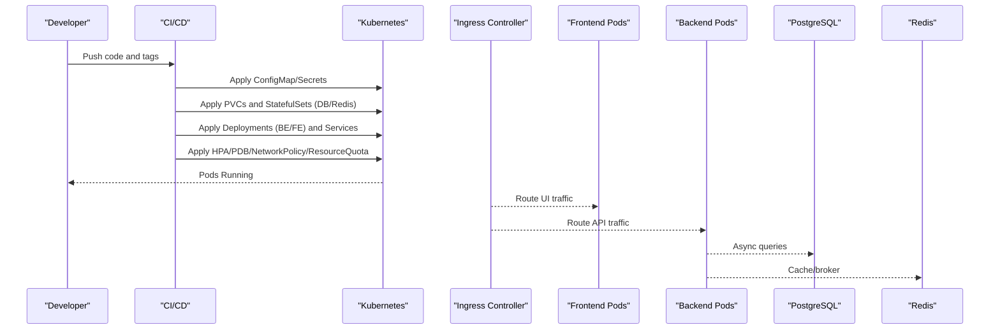

# Kubernetes Deployment

<cite>
**Referenced Files in This Document**
- [README.md](file://nudenet_project/README.md)
- [DEPLOYMENT.md](file://nudenet_project/DEPLOYMENT.md)
- [docker-compose.yml](file://nudenet_project/docker-compose.yml)
- [backend/Dockerfile](file://nudenet_project/backend/Dockerfile)
- [frontend/Dockerfile](file://nudenet_project/frontend/Dockerfile)
- [backend/app/core/config.py](file://nudenet_project/backend/app/core/config.py)
- [backend/app/core/database.py](file://nudenet_project/backend/app/core/database.py)
- [backend/app/core/redis.py](file://nudenet_project/backend/app/core/redis.py)
- [backend/app/core/celery_app.py](file://nudenet_project/backend/app/core/celery_app.py)
</cite>

## Table of Contents
1. Introduction
2. Project Structure
3. Core Components
4. Architecture Overview
5. Detailed Component Analysis
6. Dependency Analysis
7. Performance Considerations
8. Troubleshooting Guide
9. Conclusion
10. Appendices

## Introduction
This document provides a production-grade Kubernetes deployment guide for the OmniShield platform, covering all required resources: Deployments (backend API and Celery workers), Services, Ingress, ConfigMaps, Secrets, PersistentVolumeClaims for PostgreSQL and Redis, HorizontalPodAutoscaler, PodDisruptionBudgets, NetworkPolicy, ResourceQuotas, and HealthCheck probes. It also includes rolling update strategies, rollback procedures, zero-downtime deployment practices, cluster setup recommendations, node requirements, and performance tuning guidelines tailored to AI model workloads.

The guidance is grounded in the repository’s architecture, container definitions, configuration, and existing deployment documentation.

## Project Structure
OmniShield consists of:
- Backend API (FastAPI + Uvicorn) with async SQLAlchemy and Redis caching
- Celery workers for background processing
- Frontend (Next.js) served by nginx
- External dependencies: PostgreSQL and Redis

[No sources needed since this diagram shows conceptual workflow, not actual code structure]

## Core Components
- Backend API: FastAPI application exposing REST endpoints, health checks, metrics, and moderation APIs.
- Celery Workers: Background tasks consuming from Redis broker for batch processing and heavy operations.
- Frontend: Next.js static build served via nginx.
- Data Stores:
  - PostgreSQL for persistent data (users, logs, analytics).
  - Redis for caching, rate limiting, and Celery broker/backend.

Key runtime characteristics:
- Async database access via SQLAlchemy async engine.
- Graceful Redis fallback when unavailable.
- Pre-cached ONNX models during image build for faster startup.

**Section sources**
- [backend/app/core/config.py:1-148](file://nudenet_project/backend/app/core/config.py#L1-L148)
- [backend/app/core/database.py:1-50](file://nudenet_project/backend/app/core/database.py#L1-L50)
- [backend/app/core/redis.py:1-21](file://nudenet_project/backend/app/core/redis.py#L1-L21)
- [backend/app/core/celery_app.py:1-21](file://nudenet_project/backend/app/core/celery_app.py#L1-L21)
- [backend/Dockerfile:1-27](file://nudenet_project/backend/Dockerfile#L1-L27)
- [frontend/Dockerfile:1-36](file://nudenet_project/frontend/Dockerfile#L1-L36)

## Architecture Overview
High-level Kubernetes architecture mapping to actual components:

**Diagram sources**
- [DEPLOYMENT.md:416-616](file://nudenet_project/DEPLOYMENT.md#L416-L616)
- [docker-compose.yml:1-108](file://nudenet_project/docker-compose.yml#L1-L108)

## Detailed Component Analysis

### Configuration and Secrets Management
- Use a ConfigMap for non-sensitive settings (e.g., environment flags, thresholds, CORS origins).
- Use a Secret for sensitive values (JWT secret, database URL, Redis URLs).
- Reference secrets and config maps in Deployments via envFrom or individual env entries.

Recommended keys (align with application settings):
- ENVIRONMENT, JWT_SECRET, DATABASE_URL, REDIS_URL, CELERY_BROKER_URL, CELERY_RESULT_BACKEND, CORS_ORIGINS, ENABLE_PROMETHEUS_METRICS, USE_GPU, GPU_DEVICE_ID, IMAGE_CACHE_TTL, DEFAULT_THRESHOLD, MAX_FILE_SIZE_MB, ALLOWED_EXTENSIONS, VIDEO_UPLOAD_DIR, ENABLE_*_DETECTION flags.

Validation and defaults are enforced at runtime by the application settings class.

**Section sources**
- [backend/app/core/config.py:1-148](file://nudenet_project/backend/app/core/config.py#L1-L148)

### Database and Cache Persistence
- PostgreSQL StatefulSet with a single replica for simplicity; attach a PVC for data durability.
- Redis StatefulSet with append-only enabled; attach a PVC for persistence.
- Ensure storageClass supports ReadWriteOnce and appropriate capacity for expected growth.

Health checks:
- PostgreSQL readiness via pg_isready.
- Redis readiness via redis-cli ping.

**Section sources**
- [docker-compose.yml:1-108](file://nudenet_project/docker-compose.yml#L1-L108)
- [DEPLOYMENT.md:451-507](file://nudenet_project/DEPLOYMENT.md#L451-L507)

### Backend API Deployment
- Deployment with multiple replicas behind a ClusterIP Service.
- Liveness and readiness probes pointing to the HTTP health endpoint.
- Resource requests/limits sized for CPU-bound AI inference and memory-heavy models.
- Environment variables sourced from ConfigMap and Secret.
- Optional GPU node selectors/tolerations if USE_GPU=true.

Horizontal scaling:
- HPA targets CPU and memory utilization thresholds.

Zero-downtime updates:
- RollingUpdate strategy with maxUnavailable=0 and maxSurge=1.

**Section sources**
- [DEPLOYMENT.md:509-581](file://nudenet_project/DEPLOYMENT.md#L509-L581)
- [DEPLOYMENT.md:589-616](file://nudenet_project/DEPLOYMENT.md#L589-L616)
- [backend/app/core/database.py:1-50](file://nudenet_project/backend/app/core/database.py#L1-L50)
- [backend/app/core/redis.py:1-21](file://nudenet_project/backend/app/core/redis.py#L1-L21)

### Celery Worker Deployment
- Separate Deployment for Celery workers using the same image but different command.
- Connects to Redis broker and result backend.
- Scale horizontally based on queue depth or resource usage.

**Section sources**
- [docker-compose.yml:68-85](file://nudenet_project/docker-compose.yml#L68-L85)
- [backend/app/core/celery_app.py:1-21](file://nudenet_project/backend/app/core/celery_app.py#L1-L21)

### Frontend Deployment
- Static Next.js build served by nginx.
- Exposed via a ClusterIP Service and routed through Ingress.
- Health check probe configured in the container.

**Section sources**
- [frontend/Dockerfile:1-36](file://nudenet_project/frontend/Dockerfile#L1-L36)

### Ingress and External Access
- Ingress routes external HTTPS traffic to frontend and backend services.
- TLS termination at Ingress controller.
- Path-based routing for API and UI.

**Section sources**
- [DEPLOYMENT.md:416-449](file://nudenet_project/DEPLOYMENT.md#L416-L449)

### Autoscaling and Availability
- HPA for backend based on CPU/memory utilization.
- PDBs to ensure minimum available pods during disruptions.
- Recommended minReplicas aligned with HPA minReplicas.

**Section sources**
- [DEPLOYMENT.md:589-616](file://nudenet_project/DEPLOYMENT.md#L589-L616)

### Security Policies
- NetworkPolicy restricting ingress/egress to only necessary ports and namespaces.
- RBAC least privilege for service accounts used by jobs (e.g., migrations).
- Secrets stored securely and mounted as env vars or files.

[No sources needed since this section provides general guidance]

### Resource Quotas and Limit Ranges
- Namespace ResourceQuota to cap total CPU/memory.
- LimitRange to enforce default requests/limits per container.

[No sources needed since this section provides general guidance]

### Health Checks and Probes
- LivenessProbe: restart unhealthy containers.
- ReadinessProbe: remove pod from service endpoints until ready.
- StartupProbe: allow longer initialization for model loading.

**Section sources**
- [DEPLOYMENT.md:558-569](file://nudenet_project/DEPLOYMENT.md#L558-L569)
- [frontend/Dockerfile:30-32](file://nudenet_project/frontend/Dockerfile#L30-L32)

## Dependency Analysis
Runtime dependencies and their Kubernetes representations:

**Diagram sources**
- [docker-compose.yml:1-108](file://nudenet_project/docker-compose.yml#L1-L108)
- [backend/app/core/config.py:1-148](file://nudenet_project/backend/app/core/config.py#L1-L148)
- [backend/app/core/redis.py:1-21](file://nudenet_project/backend/app/core/redis.py#L1-L21)
- [backend/app/core/celery_app.py:1-21](file://nudenet_project/backend/app/core/celery_app.py#L1-L21)

**Section sources**
- [docker-compose.yml:1-108](file://nudenet_project/docker-compose.yml#L1-L108)
- [backend/app/core/config.py:1-148](file://nudenet_project/backend/app/core/config.py#L1-L148)

## Performance Considerations
- Model warm-up: The backend image pre-caches the NudeNet ONNX model to reduce cold-start latency.
- GPU acceleration: Enable USE_GPU and schedule pods on GPU-enabled nodes with appropriate tolerations and device plugins.
- Connection pooling: Tune SQLAlchemy pool sizes and timeouts for high concurrency.
- Redis tuning: Increase maxmemory and eviction policies according to cache workload.
- HPA thresholds: Set CPU target around 60–70% and memory around 75–85% for responsive scaling.
- Storage I/O: Use SSD-backed storageClass for PostgreSQL and Redis volumes.
- Batch sizing: Adjust MAX_BATCH_SIZE and worker concurrency to match cluster capacity.

**Section sources**
- [backend/Dockerfile:16-17](file://nudenet_project/backend/Dockerfile#L16-L17)
- [backend/app/core/config.py:44-82](file://nudenet_project/backend/app/core/config.py#L44-L82)
- [DEPLOYMENT.md:589-616](file://nudenet_project/DEPLOYMENT.md#L589-L616)

## Troubleshooting Guide
Common issues and remediation steps:
- Database connectivity failures: verify credentials, network policies, and readiness probes.
- Redis connection failures: confirm broker/backend URLs and availability; application gracefully degrades when Redis is down.
- High memory usage: monitor HPA behavior, adjust limits, and scale workers.
- Slow API responses: inspect DB query performance, Redis hit rates, and model inference times.

Useful commands:
- Inspect pod logs and events.
- Exec into pods to run diagnostics.
- Check HPA status and metrics.

**Section sources**
- [backend/app/core/redis.py:18-21](file://nudenet_project/backend/app/core/redis.py#L18-L21)
- [DEPLOYMENT.md:718-800](file://nudenet_project/DEPLOYMENT.md#L718-L800)

## Conclusion
This guide consolidates production-ready Kubernetes manifests and operational practices for deploying OmniShield at scale. By combining robust configurations, autoscaling, resilience patterns, and security controls, you can achieve reliable, high-performance deployments suitable for AI-driven moderation workloads.

[No sources needed since this section summarizes without analyzing specific files]

## Appendices

### Appendix A: End-to-End Deployment Sequence

[No sources needed since this diagram shows conceptual workflow, not actual code structure]

### Appendix B: Cluster Setup Recommendations
- Kubernetes version: 1.24+
- Node types:
  - General-purpose nodes for API and frontend.
  - GPU-enabled nodes for AI inference if USE_GPU=true.
- Storage:
  - SSD-backed storageClass for PostgreSQL and Redis.
  - Sufficient IOPS for concurrent reads/writes.
- Networking:
  - Ingress controller with TLS termination.
  - NetworkPolicy enforcement across namespaces.
- Monitoring:
  - Metrics server enabled for HPA.
  - Prometheus/Grafana stack for observability.

[No sources needed since this section provides general guidance]

### Appendix C: Zero-Downtime Rollout and Rollback Procedures
- Rolling updates:
  - Strategy: RollingUpdate with maxUnavailable=0 and maxSurge=1.
  - Ensure readiness probes pass before traffic is routed.
- Rollbacks:
  - Use kubectl rollout undo to revert to previous revision.
  - Validate health and metrics post-rollback.
- Database migrations:
  - Run migrations as a Job with backoff limits and retries.
  - Ensure backward-compatible schema changes where possible.

**Section sources**
- [DEPLOYMENT.md:558-569](file://nudenet_project/DEPLOYMENT.md#L558-L569)

### Appendix D: Health Check Probes Reference
- LivenessProbe: HTTP GET /health on backend port.
- ReadinessProbe: HTTP GET /health on backend port.
- StartupProbe: Allow extended startup time for model loading.
- Frontend health: nginx root path check.

**Section sources**
- [DEPLOYMENT.md:558-569](file://nudenet_project/DEPLOYMENT.md#L558-L569)
- [frontend/Dockerfile:30-32](file://nudenet_project/frontend/Dockerfile#L30-L32)

### Appendix E: Environment Variables Summary
- Application: ENVIRONMENT, PROJECT_NAME, VERSION, API_V1_STR
- Security: JWT_SECRET, JWT_ALGORITHM, ACCESS_TOKEN_EXPIRE_MINUTES, REFRESH_TOKEN_EXPIRE_DAYS
- Database: DATABASE_URL (async variant handled internally)
- Cache/Queue: REDIS_URL, CELERY_BROKER_URL, CELERY_RESULT_BACKEND
- AI Flags: ENABLE_NSFW_DETECTION, ENABLE_VIOLENCE_DETECTION, ENABLE_WEAPON_DETECTION, ENABLE_FACE_DETECTION, ENABLE_TEXT_MODERATION, USE_GPU, GPU_DEVICE_ID
- Rate Limiting: DEFAULT_RATE_LIMIT_PER_MINUTE, ADMIN_RATE_LIMIT_PER_MINUTE
- CORS: CORS_ORIGINS
- Monitoring: ENABLE_PROMETHEUS_METRICS, SENTRY_DSN

**Section sources**
- [backend/app/core/config.py:1-148](file://nudenet_project/backend/app/core/config.py#L1-L148)

### Appendix F: Docker Images and Build Notes
- Backend image:
  - Python 3.12 slim base.
  - System libraries for OpenCV/NudeNet.
  - Pre-caches NudeNet ONNX model during build.
- Frontend image:
  - Multi-stage build with Node builder and nginx runtime.
  - Healthcheck included.

**Section sources**
- [backend/Dockerfile:1-27](file://nudenet_project/backend/Dockerfile#L1-L27)
- [frontend/Dockerfile:1-36](file://nudenet_project/frontend/Dockerfile#L1-L36)

### Appendix G: Local Development vs Production Alignment
- docker-compose defines core services and networking for local development.
- Kubernetes manifests mirror these services with production-grade features (autoscaling, PDBs, NetworkPolicy, etc.).

**Section sources**
- [docker-compose.yml:1-108](file://nudenet_project/docker-compose.yml#L1-L108)
- [DEPLOYMENT.md:416-616](file://nudenet_project/DEPLOYMENT.md#L416-L616)