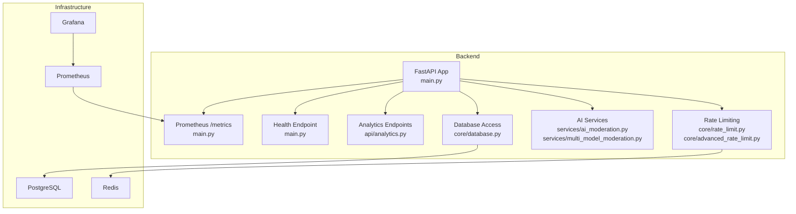
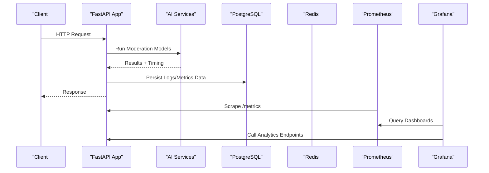
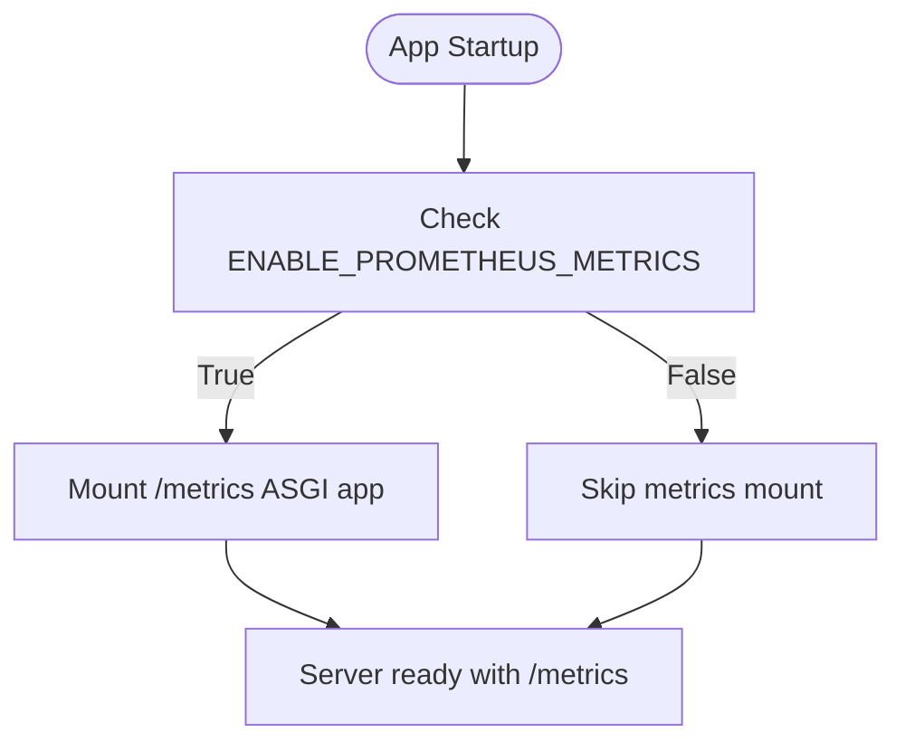
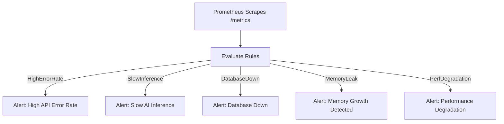
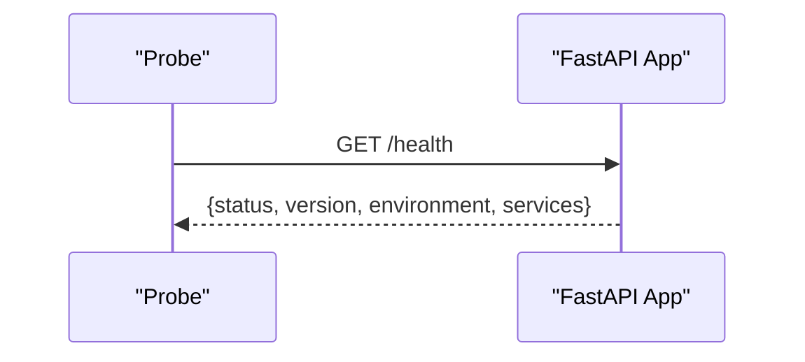
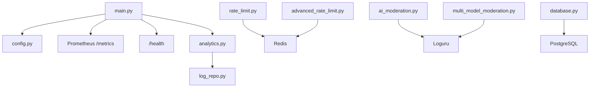

# Monitoring & Observability

<cite>
**Referenced Files in This Document**
- [main.py](file://backend/app/main.py)
- [config.py](file://backend/app/core/config.py)
- [analytics.py](file://backend/app/api/analytics.py)
- [log_repo.py](file://backend/app/repositories/log_repo.py)
- [ai_moderation.py](file://backend/app/services/ai_moderation.py)
- [multi_model_moderation.py](file://backend/app/services/multi_model_moderation.py)
- [database.py](file://backend/app/core/database.py)
- [rate_limit.py](file://backend/app/core/rate_limit.py)
- [advanced_rate_limit.py](file://backend/app/core/advanced_rate_limit.py)
- [docker-compose.yml](file://docker-compose.yml)
- [ARCHITECTURE.md](file://ARCHITECTURE.md)
- [DEPLOYMENT_GUIDE.md](file://DEPLOYMENT_GUIDE.md)
</cite>

## Table of Contents
1. Introduction
2. Project Structure
3. Core Components
4. Architecture Overview
5. Detailed Component Analysis
6. Dependency Analysis
7. Performance Considerations
8. Troubleshooting Guide
9. Conclusion
10. Appendices

## Introduction
This document provides comprehensive monitoring and observability guidance for the OmniShield platform. It covers:
- Prometheus metrics collection setup, including custom application metrics for AI model performance, API response times, error rates, and system resource utilization
- Grafana dashboard configuration for real-time visualization of key performance indicators
- Alerting rules for critical system events (database connectivity issues, AI model failures, memory leaks, performance degradation)
- Log aggregation with structured logging using Loguru
- Distributed tracing implementation for request flow tracking across microservices
- Health check endpoints for service monitoring
- Log analysis strategies, rotation, retention policies, and compliance requirements for audit trails
- Troubleshooting guides for common monitoring scenarios and performance optimization based on observability data

## Project Structure
The backend exposes a FastAPI application with health checks, optional Prometheus metrics endpoint, analytics endpoints, and structured logging via Loguru. The project includes rate limiting, database access patterns, and multi-model AI services that are ideal candidates for instrumentation.

**Diagram sources**
- [main.py:1-126](file://backend/app/main.py#L1-L126)
- [analytics.py:1-30](file://backend/app/api/analytics.py#L1-L30)
- [rate_limit.py:1-43](file://backend/app/core/rate_limit.py#L1-L43)
- [advanced_rate_limit.py:1-112](file://backend/app/core/advanced_rate_limit.py#L1-L112)
- [ai_moderation.py:1-275](file://backend/app/services/ai_moderation.py#L1-L275)
- [multi_model_moderation.py:1-777](file://backend/app/services/multi_model_moderation.py#L1-L777)
- [database.py:1-50](file://backend/app/core/database.py#L1-L50)

**Section sources**
- [main.py:1-126](file://backend/app/main.py#L1-L126)
- [config.py:1-148](file://backend/app/core/config.py#L1-L148)

## Core Components
- Prometheus Metrics Endpoint: Conditionally mounted at /metrics when enabled by settings.
- Health Check Endpoint: Provides operational status and environment details.
- Analytics Endpoints: Provide aggregated moderation stats and time series data for dashboards.
- Structured Logging: Loguru is used throughout services and middleware for consistent log output.
- Rate Limiting: Redis-backed windowed counting and SlowAPI-based IP/user/key-based limits.
- Database Access: Async SQLAlchemy engines and session providers for high-performance routes.

Key responsibilities:
- Expose metrics and health endpoints for external monitoring systems
- Emit structured logs for requests, errors, and business events
- Provide analytics APIs to power internal dashboards
- Enforce rate limits and record relevant events for observability

**Section sources**
- [main.py:65-126](file://backend/app/main.py#L65-L126)
- [analytics.py:1-30](file://backend/app/api/analytics.py#L1-L30)
- [log_repo.py:88-109](file://backend/app/repositories/log_repo.py#L88-L109)
- [log_repo.py:138-201](file://backend/app/repositories/log_repo.py#L138-L201)
- [rate_limit.py:1-43](file://backend/app/core/rate_limit.py#L1-L43)
- [advanced_rate_limit.py:1-112](file://backend/app/core/advanced_rate_limit.py#L1-L112)
- [database.py:1-50](file://backend/app/core/database.py#L1-L50)

## Architecture Overview
The monitoring architecture integrates application-level metrics, structured logs, and infrastructure telemetry into a unified observability stack.

**Diagram sources**
- [main.py:65-126](file://backend/app/main.py#L65-L126)
- [ai_moderation.py:148-275](file://backend/app/services/ai_moderation.py#L148-L275)
- [multi_model_moderation.py:532-732](file://backend/app/services/multi_model_moderation.py#L532-L732)
- [database.py:35-50](file://backend/app/core/database.py#L35-L50)
- [analytics.py:14-30](file://backend/app/api/analytics.py#L14-L30)

## Detailed Component Analysis

### Prometheus Metrics Collection Setup
- Enablement: Controlled by ENABLE_PROMETHEUS_METRICS setting; mounts /metrics ASGI app if available.
- Custom Application Metrics:
  - Instrument AI inference durations per model category
  - Track API request counts, latencies, and error rates per endpoint
  - Record database connection pool usage and query durations
  - Capture cache hit/miss ratios and memory usage
- Implementation Guidance:
  - Use prometheus_client counters, histograms, and gauges around hot paths
  - Add labels for endpoint, method, status code, model name, decision outcome
  - Export process/system metrics (CPU, memory, GC) via collector defaults

**Diagram sources**
- [main.py:98-107](file://backend/app/main.py#L98-L107)
- [config.py:113-115](file://backend/app/core/config.py#L113-L115)

**Section sources**
- [main.py:98-107](file://backend/app/main.py#L98-L107)
- [config.py:113-115](file://backend/app/core/config.py#L113-L115)
- [ARCHITECTURE.md:665-716](file://ARCHITECTURE.md#L665-L716)

### Grafana Dashboard Configuration
- Recommended Panels:
  - API Performance: request rate, latency percentiles, error rate
  - AI Model Metrics: inference duration, prediction counts, risk distribution
  - Database: active connections, query latency, pool size
  - Cache: hits/misses, memory usage
  - Business KPIs: scans total by decision/risk level, users registered, keys generated
- Data Sources:
  - Prometheus for time-series metrics
  - Direct queries to analytics endpoints for business aggregates
- Example Queries:
  - Error rate: rate(http_requests_total{status=~"5.."}[5m])
  - Inference latency: histogram_quantile(0.95, ai_inference_duration_seconds)
  - DB down: up{job="postgresql"} == 0

**Section sources**
- [ARCHITECTURE.md:665-716](file://ARCHITECTURE.md#L665-L716)

### Alerting Rules
- HighErrorRate: Triggers on sustained 5xx spikes
- SlowInference: Alerts when p95 inference time exceeds threshold
- DatabaseDown: Alerts when PostgreSQL becomes unreachable
- Additional Recommendations:
  - Memory leak detection: monitor process memory growth over time
  - Performance degradation: alert on increased latency or decreased throughput
  - AI model failures: alert on error states from model detectors

**Diagram sources**
- [ARCHITECTURE.md:696-716](file://ARCHITECTURE.md#L696-L716)

**Section sources**
- [ARCHITECTURE.md:696-716](file://ARCHITECTURE.md#L696-L716)

### Structured Logging with Loguru
- Usage Across Services:
  - AI services log initialization, detection results, fallback rules, and errors
  - Rate limiters log warnings and exceptions
  - Analytics endpoints log errors during stats retrieval
- Best Practices:
  - Include contextual fields (user_id, endpoint, model_name, decision)
  - Use consistent levels (info for normal flows, warning for recoverable issues, error for failures)
  - Avoid sensitive data in logs; mask tokens and keys

**Section sources**
- [ai_moderation.py:148-275](file://backend/app/services/ai_moderation.py#L148-L275)
- [multi_model_moderation.py:532-732](file://backend/app/services/multi_model_moderation.py#L532-L732)
- [rate_limit.py:1-43](file://backend/app/core/rate_limit.py#L1-L43)
- [analytics.py:14-30](file://backend/app/api/analytics.py#L14-L30)

### Distributed Tracing Implementation
- Strategy:
  - Propagate trace context across FastAPI routes and Celery tasks
  - Inject trace IDs into structured logs for correlation
  - Use OpenTelemetry or Jaeger client to export spans
- Integration Points:
  - Middleware to start spans for incoming requests
  - Service calls to AI models wrapped in spans
  - Database and Redis operations instrumented with spans
- Visualization:
  - Trace view in Jaeger UI
  - Correlate traces with Prometheus metrics and logs

[No sources needed since this section provides conceptual guidance]

### Health Check Endpoints
- Root Endpoint: Returns API metadata and feature flags
- Health Endpoint: Reports operational status and component health
- External Probes:
  - Liveness: /health
  - Readiness: Optional endpoint checking DB/Redis availability

**Diagram sources**
- [main.py:65-96](file://backend/app/main.py#L65-L96)

**Section sources**
- [main.py:65-96](file://backend/app/main.py#L65-L96)

### Log Aggregation and Analysis Strategies
- Centralized Collection:
  - Ship container logs to a log aggregator (e.g., Loki, Elasticsearch)
  - Parse JSON logs for structured fields
- Analysis Techniques:
  - Filter by user_id, endpoint, model_name, decision
  - Build dashboards for error trends and slow paths
  - Set up alerts on specific log patterns (e.g., “Too many requests”, “Unexpected error”)

**Section sources**
- [ai_moderation.py:148-275](file://backend/app/services/ai_moderation.py#L148-L275)
- [advanced_rate_limit.py:24-49](file://backend/app/core/advanced_rate_limit.py#L24-L49)

### Log Rotation, Retention Policies, and Compliance
- Rotation:
  - Configure file rotation by size/time in production environments
  - Compress rotated files and offload to object storage
- Retention:
  - Define retention windows aligned with compliance needs
  - Archive historical logs for audit purposes
- Compliance:
  - Ensure PII is not logged; mask sensitive headers and payloads
  - Maintain immutable audit trails for moderation decisions

[No sources needed since this section provides general guidance]

## Dependency Analysis
The following diagram shows core dependencies between components involved in monitoring and observability.

**Diagram sources**
- [main.py:1-126](file://backend/app/main.py#L1-L126)
- [config.py:1-148](file://backend/app/core/config.py#L1-L148)
- [analytics.py:1-30](file://backend/app/api/analytics.py#L1-L30)
- [log_repo.py:88-109](file://backend/app/repositories/log_repo.py#L88-L109)
- [rate_limit.py:1-43](file://backend/app/core/rate_limit.py#L1-L43)
- [advanced_rate_limit.py:1-112](file://backend/app/core/advanced_rate_limit.py#L1-L112)
- [ai_moderation.py:1-275](file://backend/app/services/ai_moderation.py#L1-L275)
- [multi_model_moderation.py:1-777](file://backend/app/services/multi_model_moderation.py#L1-L777)
- [database.py:1-50](file://backend/app/core/database.py#L1-L50)

**Section sources**
- [docker-compose.yml:1-108](file://docker-compose.yml#L1-L108)

## Performance Considerations
- Instrument Hot Paths:
  - Wrap AI model inference with histograms to capture latency distributions
  - Track per-endpoint request counts and error rates
- Resource Utilization:
  - Monitor CPU and memory usage for workers running heavy models
  - Observe database connection pool saturation and query latency
- Concurrency:
  - Use ThreadPoolExecutor for synchronous model inference to avoid blocking the event loop
  - Tune max_workers based on hardware capabilities
- Caching:
  - Measure cache hit/miss ratios and adjust TTLs accordingly
- Scaling:
  - Replicate stateless services behind load balancers
  - Scale workers independently based on queue depth and processing time

[No sources needed since this section provides general guidance]

## Troubleshooting Guide
Common scenarios and resolutions:
- Metrics endpoint not available:
  - Verify ENABLE_PROMETHEUS_METRICS is True and prometheus-client is installed
  - Confirm /metrics route is mounted successfully
- High error rates:
  - Inspect structured logs for exceptions and rate limit rejections
  - Check database connectivity and Redis availability
- Slow inference:
  - Review per-model latency histograms and GPU/CPU utilization
  - Validate model loading and warm-up behavior
- Memory growth:
  - Monitor process memory over time; investigate large caches or unclosed resources
- Database connectivity issues:
  - Check health endpoints and connection pool metrics
  - Validate credentials and network reachability

**Section sources**
- [main.py:98-107](file://backend/app/main.py#L98-L107)
- [rate_limit.py:1-43](file://backend/app/core/rate_limit.py#L1-L43)
- [ai_moderation.py:148-275](file://backend/app/services/ai_moderation.py#L148-L275)
- [multi_model_moderation.py:532-732](file://backend/app/services/multi_model_moderation.py#L532-L732)

## Conclusion
By integrating Prometheus metrics, structured logging with Loguru, robust health checks, and well-defined alerting rules, the OmniShield platform achieves comprehensive observability. Extending this foundation with distributed tracing and centralized log aggregation enables precise troubleshooting, proactive alerting, and data-driven performance optimization.

[No sources needed since this section summarizes without analyzing specific files]

## Appendices

### Deployment Notes for Monitoring
- Backend exposes metrics at /metrics when enabled
- Docker Compose defines PostgreSQL and Redis services with health checks
- Frontend can call analytics endpoints for internal dashboards

**Section sources**
- [DEPLOYMENT_GUIDE.md:283-292](file://DEPLOYMENT_GUIDE.md#L283-L292)
- [docker-compose.yml:1-108](file://docker-compose.yml#L1-L108)