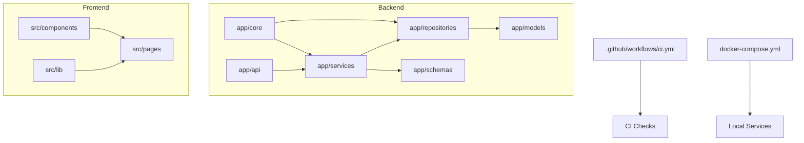
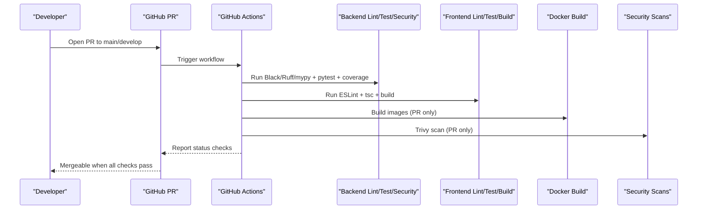
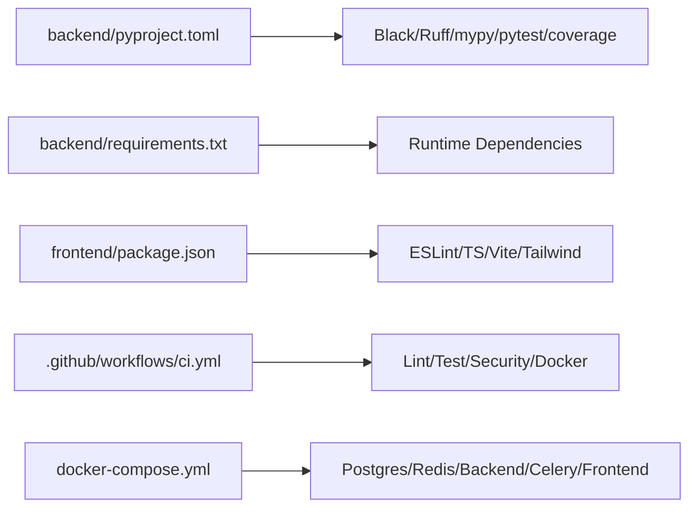

# Contribution Guidelines

<cite>
**Referenced Files in This Document**
- [README.md](file://nudenet_project/README.md)
- [ARCHITECTURE.md](file://nudenet_project/ARCHITECTURE.md)
- [pyproject.toml](file://nudenet_project/backend/pyproject.toml)
- [requirements.txt](file://nudenet_project/backend/requirements.txt)
- [package.json](file://nudenet_project/frontend/package.json)
- [ci.yml](file://nudenet_project/.github/workflows/ci.yml)
- [docker-compose.yml](file://nudenet_project/docker-compose.yml)
</cite>

## Table of Contents
1. Introduction
2. Project Structure
3. Core Components
4. Architecture Overview
5. Detailed Component Analysis
6. Dependency Analysis
7. Performance Considerations
8. Troubleshooting Guide
9. Conclusion
10. Appendices

## Introduction
This document defines the contribution guidelines for the OmniShield platform. It covers code standards, development workflow, collaboration processes, testing requirements, security considerations, and environment configuration to ensure consistent, secure, and high-quality contributions across the backend (Python/FastAPI) and frontend (TypeScript/React).

## Project Structure
OmniShield follows a layered architecture with clear separation between API endpoints, services, repositories, schemas, models, and core infrastructure. The repository includes:
- Backend: FastAPI application under backend/app with api, core, models, repositories, schemas, and services layers.
- Frontend: TypeScript/React app under frontend/src with components, pages, and lib modules.
- CI/CD: GitHub Actions pipeline orchestrating linting, tests, security scans, Docker builds, and deployments.
- Orchestration: docker-compose for local development and service dependencies.

**Diagram sources**
- [README.md](file://nudenet_project/README.md)
- [ARCHITECTURE.md](file://nudenet_project/ARCHITECTURE.md)
- [ci.yml](file://nudenet_project/.github/workflows/ci.yml)
- [docker-compose.yml](file://nudenet_project/docker-compose.yml)

**Section sources**
- [README.md](file://nudenet_project/README.md)
- [ARCHITECTURE.md](file://nudenet_project/ARCHITECTURE.md)

## Core Components
- Backend Layering
  - API layer: HTTP endpoints and request/response handling.
  - Services layer: Business logic orchestration.
  - Repositories layer: Data access abstraction.
  - Models layer: ORM entities.
  - Schemas layer: Pydantic validation schemas.
  - Core: Configuration, database, Redis, security, rate limiting, Celery app.
- Frontend Layering
  - Pages: Route-level UI.
  - Components: Reusable UI elements.
  - Lib: API client and shared utilities.

Contribution expectations:
- Keep responsibilities single-purpose and cohesive within each layer.
- Prefer dependency injection via core services where applicable.
- Use schemas for all external inputs and outputs.

**Section sources**
- [ARCHITECTURE.md](file://nudenet_project/ARCHITECTURE.md)

## Architecture Overview
The CI/CD pipeline enforces quality gates before merging or deploying. The following sequence shows a typical pull request flow:

**Diagram sources**
- [ci.yml](file://nudenet_project/.github/workflows/ci.yml)

**Section sources**
- [ci.yml](file://nudenet_project/.github/workflows/ci.yml)

## Detailed Component Analysis

### Code Standards and Tooling

#### Python (Backend)
- Formatting: Black configured with line length and target version.
- Linting: Ruff with selected rule sets; ignores handled by Black.
- Type Checking: mypy with strictness options and overrides for third-party packages.
- Testing: pytest with asyncio auto mode and coverage settings.

Key references:
- Formatter and linter configuration: [pyproject.toml](file://nudenet_project/backend/pyproject.toml)
- Test runner and coverage config: [pyproject.toml](file://nudenet_project/backend/pyproject.toml)

Practical guidance:
- Run formatters and linters locally before committing.
- Ensure type annotations are present where feasible; address mypy warnings.
- Add tests for new features and bug fixes.

**Section sources**
- [pyproject.toml](file://nudenet_project/backend/pyproject.toml)

#### TypeScript/React (Frontend)
- Linting: ESLint configured for TypeScript and React hooks.
- Build: TypeScript compiler invoked during build.
- Scripts: npm scripts for dev, build, preview, and lint.

Key references:
- Frontend scripts and dependencies: [package.json](file://nudenet_project/frontend/package.json)

Practical guidance:
- Fix all ESLint errors and warnings before submitting.
- Ensure the project builds successfully with TypeScript.

**Section sources**
- [package.json](file://nudenet_project/frontend/package.json)

#### Commit Messages
- Adopt Conventional Commits for consistency and automation-friendly changelogs.
- Examples: feat:, fix:, docs:, refactor:, test:, chore:.

Note: No specific commit hook is defined in this repository; enforce via team process and PR checks.

[No sources needed since this section provides general guidance]

### Development Workflow and Branching

Branch naming conventions:
- feature/<short-description>
- bugfix/<short-description>
- hotfix/<short-description>

Workflow:
- Create a branch from main or develop depending on scope.
- Implement changes adhering to code standards.
- Add/update tests and documentation.
- Push and open a Pull Request targeting main or develop.

Required CI checks (automated):
- Backend: Black check, Ruff lint, mypy type check, pytest with coverage.
- Frontend: ESLint, TypeScript type check, build.
- Security: Bandit and Safety for Python; Trivy filesystem scans for both backend and frontend.
- Docker: Image build verification on PRs.

Merge requirements:
- All required checks must pass.
- At least one approving review (team policy).
- Resolve all comments and update PR accordingly.

**Section sources**
- [ci.yml](file://nudenet_project/.github/workflows/ci.yml)

### Testing Requirements

Unit tests:
- Use pytest for backend; enable asyncio auto mode.
- Maintain meaningful assertions and isolate external dependencies.

Integration tests:
- Use provided CI services for PostgreSQL and Redis during tests.
- Seed minimal data necessary for integration scenarios.

Coverage:
- Generate coverage reports; upload to Codecov in CI.
- Target minimum coverage thresholds per module (define in team policy).

Performance benchmarking:
- Include baseline benchmarks for critical paths (e.g., moderation endpoint latency).
- Compare against documented baselines when introducing performance-sensitive changes.

**Section sources**
- [ci.yml](file://nudenet_project/.github/workflows/ci.yml)
- [README.md](file://nudenet_project/README.md)

### Code Organization Examples (Layered Architecture)

Recommended structure for new features:
- API: Define endpoints in app/api/* using Pydantic schemas.
- Services: Implement business logic in app/services/*.
- Repositories: Encapsulate DB operations in app/repositories/*.
- Models: Define SQLAlchemy models in app/models/*.
- Schemas: Validate requests/responses in app/schemas/*.
- Core: Use shared configuration, DB, Redis, and security utilities from app/core/*.

Example reference points:
- API routes and orchestration: [ARCHITECTURE.md](file://nudenet_project/ARCHITECTURE.md)
- Service and repository patterns: [ARCHITECTURE.md](file://nudenet_project/ARCHITECTURE.md)

**Section sources**
- [ARCHITECTURE.md](file://nudenet_project/ARCHITECTURE.md)

### Dependency Management

Backend:
- Dependencies are pinned in requirements.txt.
- Install via pip for local development and CI.

Frontend:
- Dependencies managed via npm; lockfile used in CI for reproducibility.

Environment variables:
- Configure via .env or container environment.
- docker-compose exposes DATABASE_URL, REDIS_URL, CELERY_* URLs, CORS_ORIGINS, and ENVIRONMENT.

Operational notes:
- Do not commit secrets; use CI/CD secrets for deployment.
- Validate environment variables at startup and fail fast if missing.

**Section sources**
- [requirements.txt](file://nudenet_project/backend/requirements.txt)
- [package.json](file://nudenet_project/frontend/package.json)
- [docker-compose.yml](file://nudenet_project/docker-compose.yml)

### Security Considerations in Contributions

Input validation:
- Always validate and sanitize user inputs using Pydantic schemas.
- Enforce MIME type checks and file size limits for uploads.

Authentication and authorization:
- Protect endpoints with JWT/API key middleware.
- Apply RBAC checks for admin-only routes.

Vulnerability scanning:
- Python: Bandit for static analysis; Safety for dependency vulnerabilities.
- Frontend/Backend: Trivy filesystem scans in CI.

Secrets management:
- Never hardcode secrets; use environment variables and CI secrets.
- Rotate secrets regularly and follow least privilege principles.

**Section sources**
- [ci.yml](file://nudenet_project/.github/workflows/ci.yml)
- [ARCHITECTURE.md](file://nudenet_project/ARCHITECTURE.md)

## Dependency Analysis

**Diagram sources**
- [pyproject.toml](file://nudenet_project/backend/pyproject.toml)
- [requirements.txt](file://nudenet_project/backend/requirements.txt)
- [package.json](file://nudenet_project/frontend/package.json)
- [ci.yml](file://nudenet_project/.github/workflows/ci.yml)
- [docker-compose.yml](file://nudenet_project/docker-compose.yml)

**Section sources**
- [pyproject.toml](file://nudenet_project/backend/pyproject.toml)
- [requirements.txt](file://nudenet_project/backend/requirements.txt)
- [package.json](file://nudenet_project/frontend/package.json)
- [ci.yml](file://nudenet_project/.github/workflows/ci.yml)
- [docker-compose.yml](file://nudenet_project/docker-compose.yml)

## Performance Considerations
- Cache frequently accessed results (e.g., image hashes) to reduce AI inference overhead.
- Use async I/O for database and cache interactions.
- Monitor P95/P99 latencies and throughput; add metrics for critical endpoints.
- Profile AI model inference paths and consider quantization or GPU acceleration where appropriate.

[No sources needed since this section provides general guidance]

## Troubleshooting Guide
Common issues and resolutions:
- Linting failures: Run Black and Ruff locally; fix reported issues.
- Type errors: Address mypy warnings; add type hints where possible.
- Test failures: Ensure Postgres and Redis are reachable; verify environment variables.
- Build failures: Confirm TypeScript compiles and frontend assets build.
- Security alerts: Review Bandit/Safety/Trivy reports and remediate findings.

**Section sources**
- [ci.yml](file://nudenet_project/.github/workflows/ci.yml)

## Conclusion
By following these contribution guidelines—adhering to code standards, branching and PR workflows, testing and security practices—you help maintain OmniShield’s reliability, performance, and security posture. Continuous integration ensures that every change meets the bar before merging.

[No sources needed since this section summarizes without analyzing specific files]

## Appendices

### Quick Local Setup
- Start services with docker-compose.
- Run backend tests with pytest and generate coverage.
- Run frontend lint and build.

**Section sources**
- [docker-compose.yml](file://nudenet_project/docker-compose.yml)
- [README.md](file://nudenet_project/README.md)