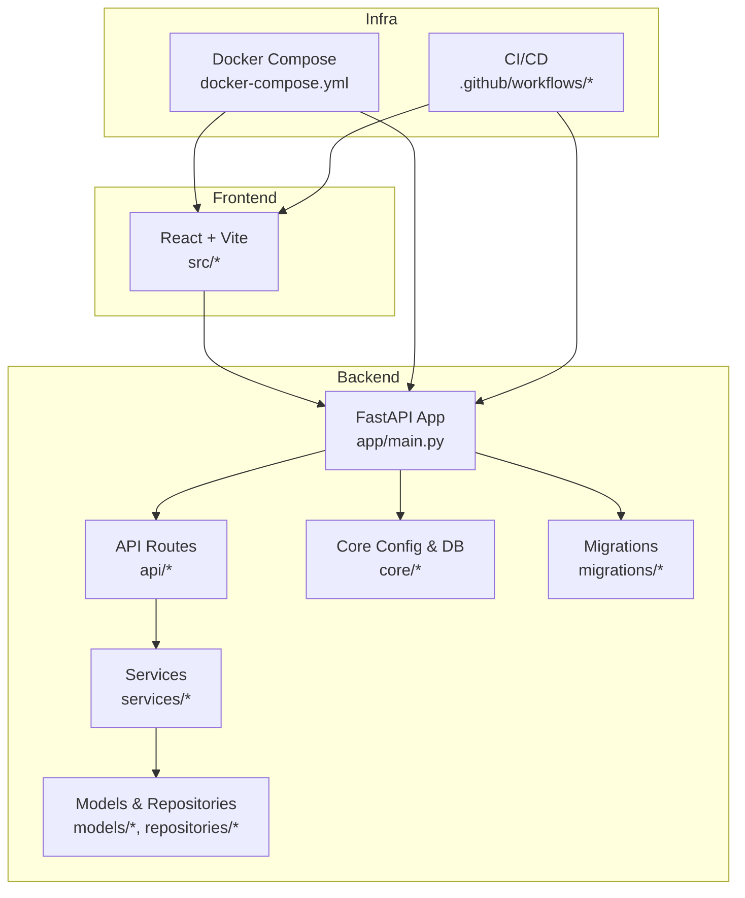
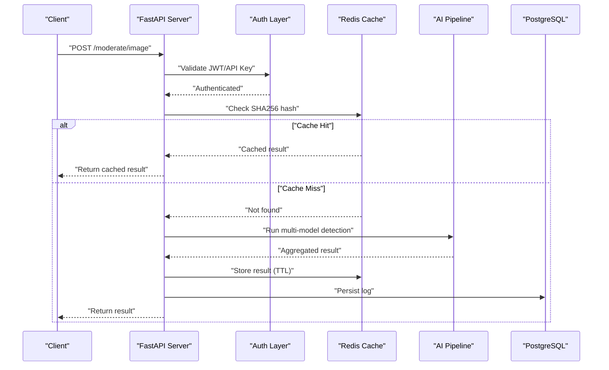
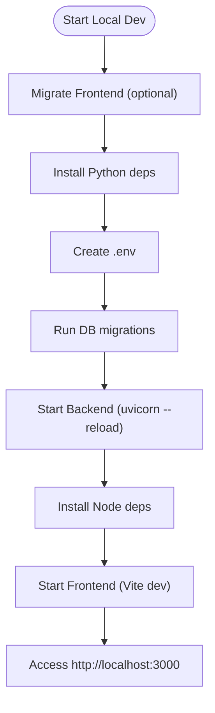
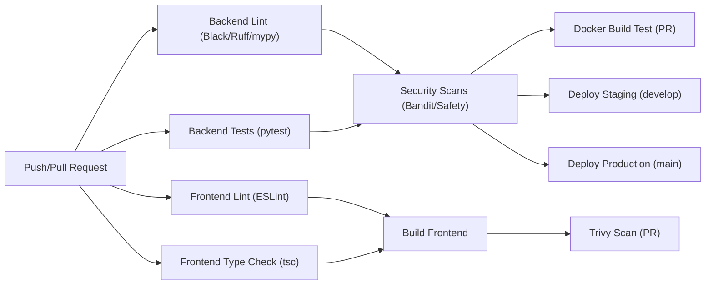
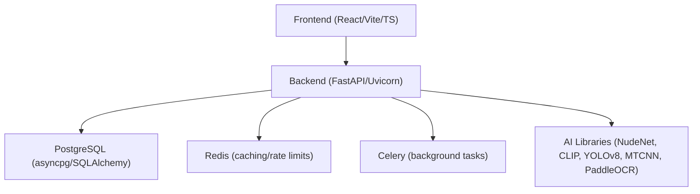

# Developer Guide

<cite>
**Referenced Files in This Document**
- [README.md](file://nudenet_project/README.md)
- [QUICK_START.md](file://nudenet_project/QUICK_START.md)
- [ARCHITECTURE.md](file://nudenet_project/ARCHITECTURE.md)
- [DEPLOYMENT.md](file://nudenet_project/DEPLOYMENT.md)
- [docker-compose.yml](file://nudenet_project/docker-compose.yml)
- [pyproject.toml](file://nudenet_project/backend/pyproject.toml)
- [requirements.txt](file://nudenet_project/backend/requirements.txt)
- [package.json](file://nudenet_project/frontend/package.json)
- [ci.yml](file://nudenet_project/.github/workflows/ci.yml)
- [deploy.yml](file://nudenet_project/.github/workflows/deploy.yml)
</cite>

## Table of Contents
1. Introduction
2. Project Structure
3. Core Components
4. Architecture Overview
5. Detailed Component Analysis
6. Dependency Analysis
7. Performance Considerations
8. Troubleshooting Guide
9. Conclusion
10. Appendices

## Introduction
This Developer Guide provides a comprehensive, contributor-focused overview of the OmniShield platform. It covers development workflow, code standards, local setup, CI/CD configuration, troubleshooting, performance optimization, and extension patterns for adding new AI models, API endpoints, and authentication providers. The goal is to enable contributors to set up a productive environment, follow consistent quality practices, and safely extend functionality.

## Project Structure
OmniShield is a multi-service application with:
- Backend (FastAPI + Python): REST API, security, moderation services, background workers, database access, caching, and migrations.
- Frontend (React + Vite + TypeScript): Dashboard UI consuming backend APIs.
- Infrastructure: Docker Compose for local orchestration; GitHub Actions for CI/CD and deployment automation.

**Diagram sources**
- [docker-compose.yml:1-108](file://nudenet_project/docker-compose.yml#L1-L108)
- [ci.yml:1-379](file://nudenet_project/.github/workflows/ci.yml#L1-L379)
- [deploy.yml:1-137](file://nudenet_project/.github/workflows/deploy.yml#L1-L137)

**Section sources**
- [README.md:139-172](file://nudenet_project/README.md#L139-L172)
- [ARCHITECTURE.md:60-86](file://nudenet_project/ARCHITECTURE.md#L60-L86)

## Core Components
- Backend
  - FastAPI application entrypoint and routing
  - Security layer (JWT, API keys, OAuth helpers)
  - Moderation services (single and multi-model pipelines)
  - Data access via SQLAlchemy models and repositories
  - Redis cache and Celery worker integration
  - Alembic migrations
- Frontend
  - React + Vite app with TypeScript
  - Axios-based API client
  - Pages for auth, moderation, analytics, and API key management
- Dev tooling
  - Python: Black, Ruff, mypy, pytest, coverage
  - TypeScript: ESLint, TypeScript compiler
  - CI/CD: lint, type checks, tests, Docker builds, deployments

**Section sources**
- [README.md:139-172](file://nudenet_project/README.md#L139-L172)
- [ARCHITECTURE.md:88-118](file://nudenet_project/ARCHITECTURE.md#L88-L118)
- [pyproject.toml:1-95](file://nudenet_project/backend/pyproject.toml#L1-L95)
- [package.json:1-38](file://nudenet_project/frontend/package.json#L1-L38)

## Architecture Overview
High-level system flow includes request ingestion, authentication, caching, parallel AI inference across multiple models, ensemble aggregation, persistence, and response delivery. Background jobs are handled by Celery workers.

**Diagram sources**
- [ARCHITECTURE.md:224-304](file://nudenet_project/ARCHITECTURE.md#L224-L304)

## Detailed Component Analysis

### Development Workflow and Code Standards
- Python
  - Formatter: Black (line length 100, target py312)
  - Linter: Ruff (selects pycodestyle, pyflakes, isort, comprehensions, bugbear, pyupgrade)
  - Type checker: mypy (Python 3.12, strictness flags configured)
  - Tests: pytest with asyncio auto mode and coverage
- TypeScript
  - Linting: ESLint with React hooks and refresh plugins
  - Build: TypeScript compiler and Vite build pipeline
- Commits
  - Conventional Commits recommended
- Pull Requests
  - Ensure all CI checks pass (lint, type check, tests, security scans)
  - Keep PRs focused; include test updates where applicable

**Section sources**
- [pyproject.toml:1-95](file://nudenet_project/backend/pyproject.toml#L1-L95)
- [package.json:1-38](file://nudenet_project/frontend/package.json#L1-L38)
- [README.md:660-686](file://nudenet_project/README.md#L660-L686)

### Local Environment Setup
- Prerequisites
  - Python 3.12+, Node.js 20+, PostgreSQL 15+, Redis 7+
- Quick start options
  - Automated script to migrate frontend, install deps, create env files, start servers
  - Manual steps for backend and frontend
- Hot reload
  - Backend: uvicorn with --reload
  - Frontend: Vite dev server
- Database seeding
  - Use provided scripts or migration tools to initialize schema and seed data

**Diagram sources**
- [QUICK_START.md:1-205](file://nudenet_project/QUICK_START.md#L1-L205)
- [DEPLOYMENT.md:17-84](file://nudenet_project/DEPLOYMENT.md#L17-L84)

**Section sources**
- [QUICK_START.md:1-205](file://nudenet_project/QUICK_START.md#L1-L205)
- [DEPLOYMENT.md:17-84](file://nudenet_project/DEPLOYMENT.md#L17-L84)
- [README.md:176-240](file://nudenet_project/README.md#L176-L240)

### CI/CD Pipeline Configuration
- Triggers
  - Push and pull requests on main/develop branches
- Jobs
  - Backend lint (Black, Ruff, mypy), tests (with Postgres and Redis services), security scans (Bandit, Safety)
  - Frontend lint (ESLint), type check (tsc), tests, build
  - Docker build test (PR only)
  - Trivy filesystem scan (PR only)
  - Deploy staging (on develop push)
  - Deploy production (on main push)
- Artifacts and reporting
  - Coverage upload to Codecov
  - SARIF uploads to GitHub Security for Trivy results

**Diagram sources**
- [ci.yml:1-379](file://nudenet_project/.github/workflows/ci.yml#L1-L379)
- [deploy.yml:1-137](file://nudenet_project/.github/workflows/deploy.yml#L1-L137)

**Section sources**
- [ci.yml:1-379](file://nudenet_project/.github/workflows/ci.yml#L1-L379)
- [deploy.yml:1-137](file://nudenet_project/.github/workflows/deploy.yml#L1-L137)

### Extending Functionality

#### Adding a New AI Model
- Service integration
  - Implement model loader and inference method within services
  - Add lazy loading and GPU/CPU fallback if applicable
- Orchestration
  - Integrate into the multi-model pipeline to run in parallel
  - Update ensemble aggregation logic to incorporate new risk scoring
- Persistence
  - Extend moderation logs schema and repository to store model outputs
- Testing
  - Add unit/integration tests for the new model path
- Documentation
  - Update README and architecture docs with model details

[No sources needed since this section provides general guidance]

#### Creating Custom API Endpoints
- Define route handlers under api/
- Validate inputs using Pydantic schemas
- Apply security middleware (JWT/API key)
- Use services for business logic
- Persist results and return structured responses
- Add tests and update OpenAPI docs automatically

[No sources needed since this section provides general guidance]

#### Implementing New Authentication Providers
- Configure provider credentials in environment variables
- Implement OAuth callback handler and token exchange
- Map provider profile to internal user record
- Issue JWT tokens and manage sessions
- Securely store secrets and rotate regularly

[No sources needed since this section provides general guidance]

## Dependency Analysis
Key runtime dependencies include FastAPI, SQLAlchemy, asyncpg, Redis, Celery, Pydantic, Uvicorn, and various AI libraries. Frontend depends on React, Vite, TypeScript, and Axios.

**Diagram sources**
- [requirements.txt:1-142](file://nudenet_project/backend/requirements.txt#L1-L142)
- [package.json:1-38](file://nudenet_project/frontend/package.json#L1-L38)

**Section sources**
- [requirements.txt:1-142](file://nudenet_project/backend/requirements.txt#L1-L142)
- [package.json:1-38](file://nudenet_project/frontend/package.json#L1-L38)

## Performance Considerations
- Caching strategy
  - SHA256-based image deduplication with Redis TTL
  - Response caching for repeated requests
- Database optimization
  - Connection pooling and appropriate indexing
  - Partitioning and materialized views for analytics
- AI model tuning
  - Lazy loading and quantization
  - GPU acceleration when available
- API efficiency
  - Async I/O throughout
  - Compression and pagination

[No sources needed since this section provides general guidance]

## Troubleshooting Guide
Common issues and resolutions:
- CORS configuration problems
  - Verify allowed origins in environment variables and ensure frontend uses correct API URL
- Database connection issues
  - Confirm DATABASE_URL, service health, and network connectivity
  - Run migrations and verify schema version
- AI model loading failures
  - Validate model artifacts availability and permissions
  - Test model initialization independently
- Performance bottlenecks
  - Inspect slow queries and cache hit rates
  - Monitor CPU/memory usage and scale workers accordingly

Debugging procedures:
- Browser developer tools
  - Network tab for API calls, console for errors
- Backend logging analysis
  - Structured logs via Loguru; review request traces and error stacks
- Database query profiling
  - Use pg_stat_activity and query execution plans
- Memory leak detection
  - Monitor container stats and restart workers if necessary

**Section sources**
- [DEPLOYMENT.md:718-800](file://nudenet_project/DEPLOYMENT.md#L718-L800)
- [QUICK_START.md:107-149](file://nudenet_project/QUICK_START.md#L107-L149)

## Conclusion
This guide consolidates the essential information for contributing to OmniShield: development setup, code standards, CI/CD workflows, troubleshooting, performance optimization, and extension patterns. Following these practices ensures reliable, secure, and scalable contributions aligned with the platform’s architecture and goals.

## Appendices

### Upgrade Procedures
- Dependency updates
  - Review requirements.txt and package.json changes
  - Run linters, type checks, and tests before merging
- Database migrations
  - Generate Alembic revisions, review SQL, apply to staging first
- Breaking changes management
  - Document deprecations and migration paths
  - Coordinate frontend/backend compatibility windows

[No sources needed since this section provides general guidance]