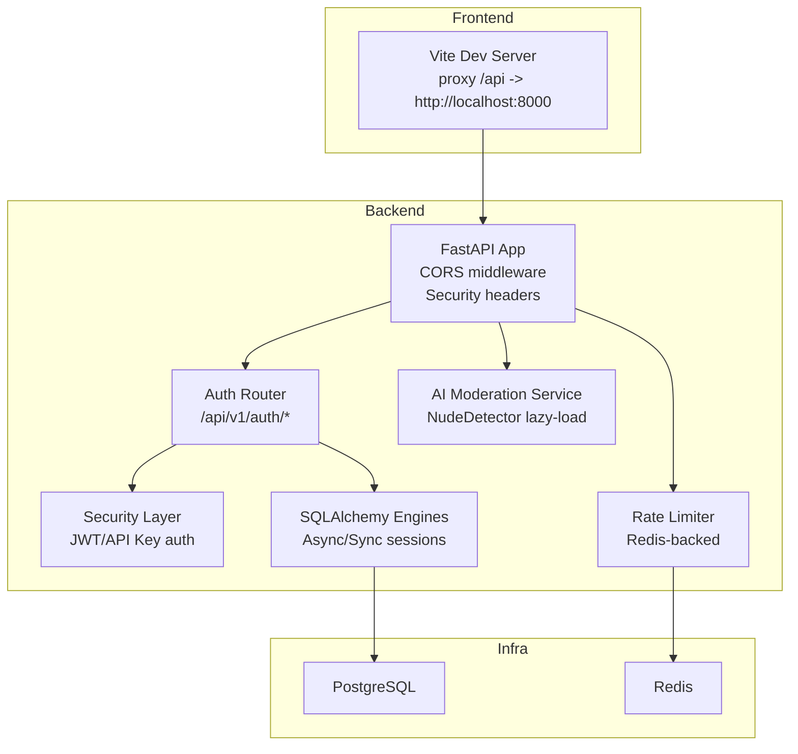
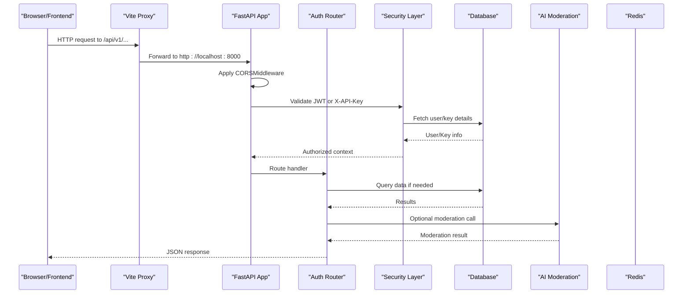
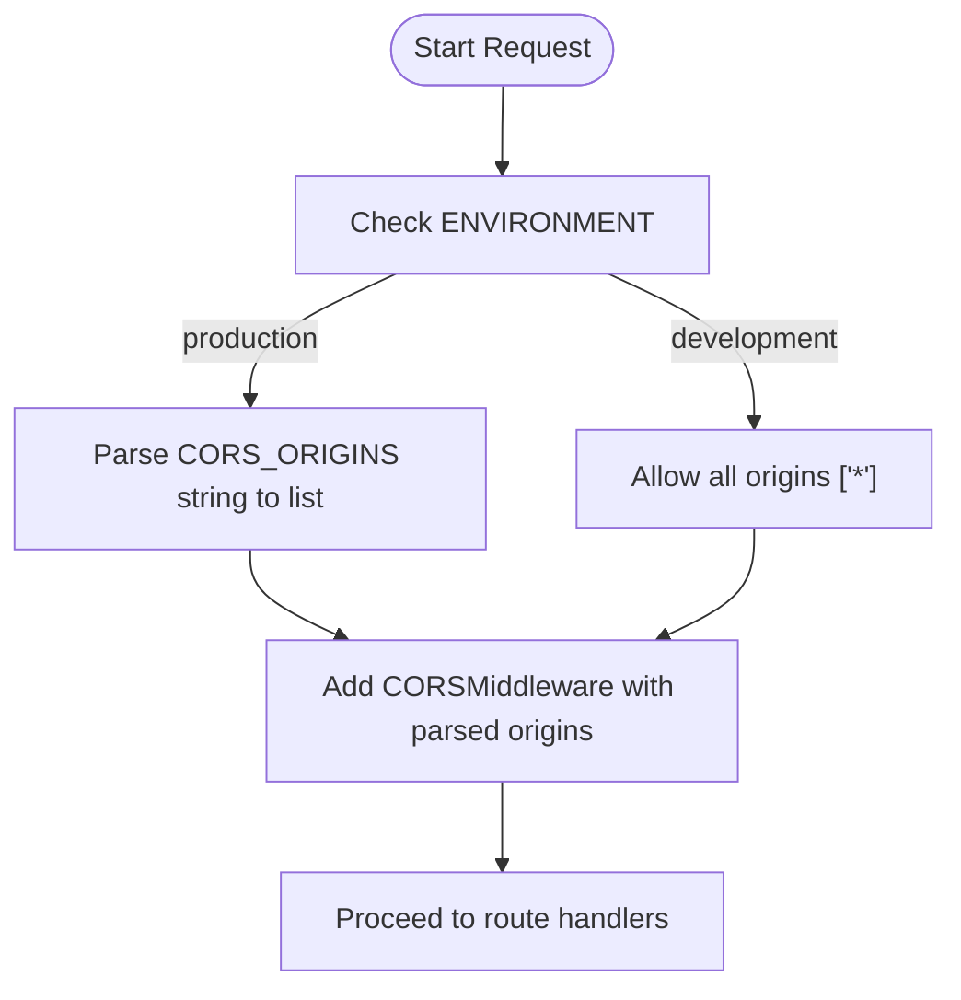
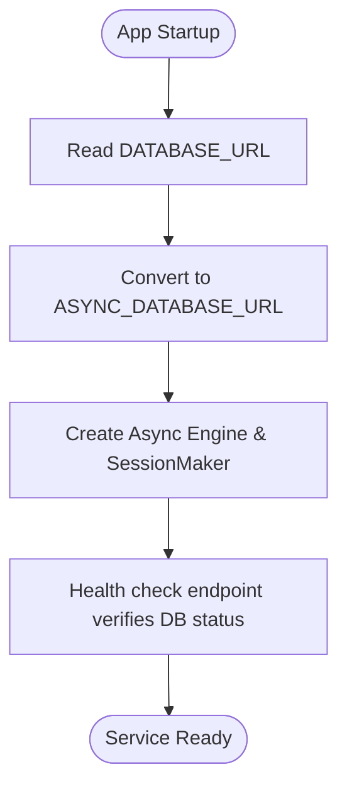
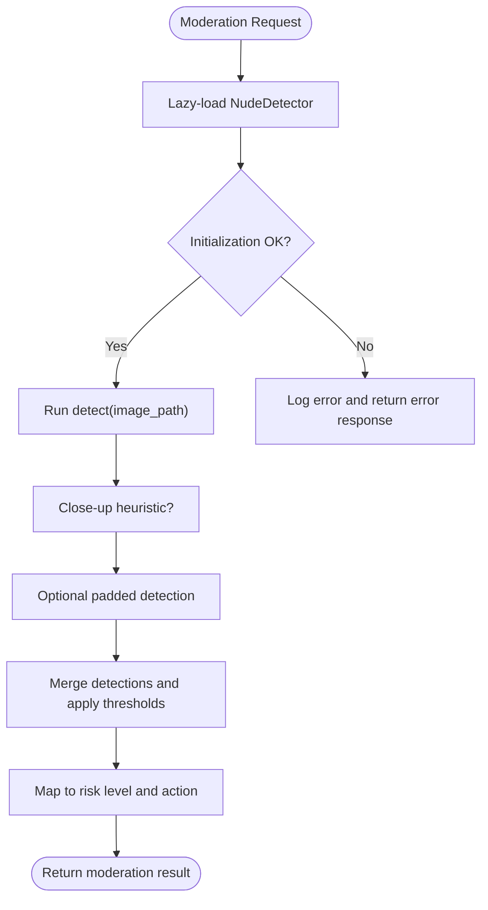
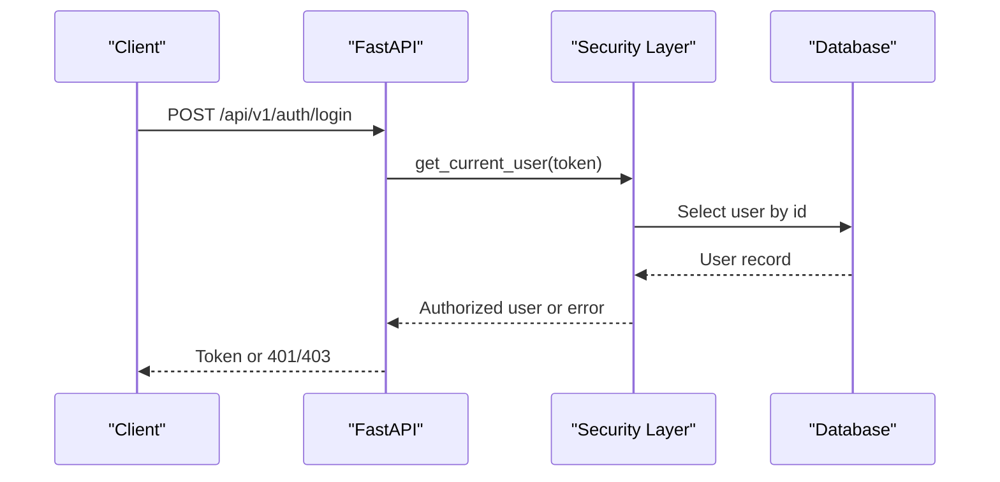
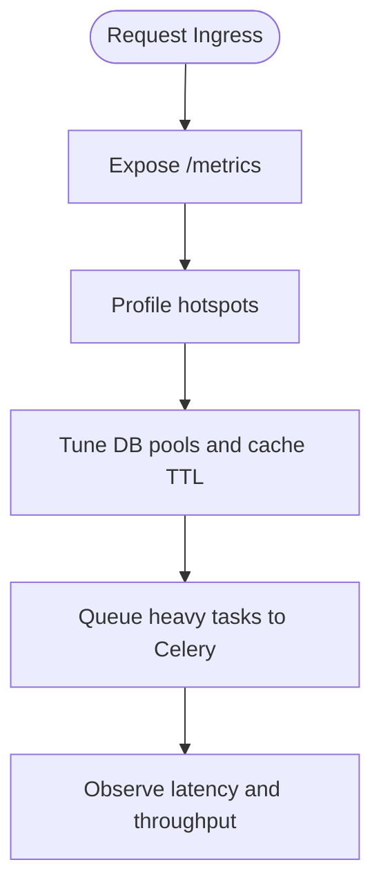
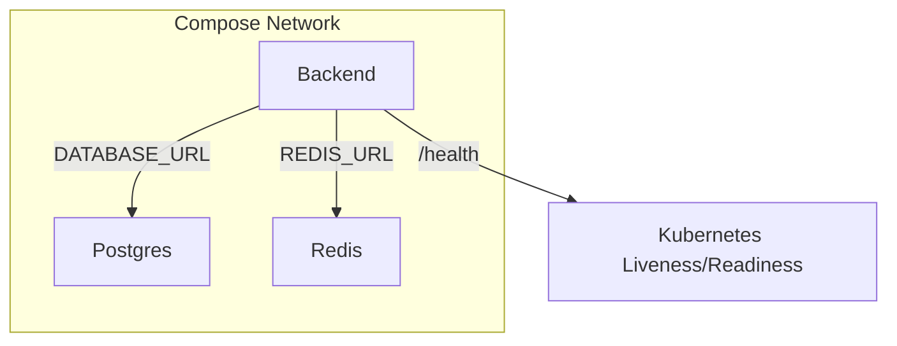
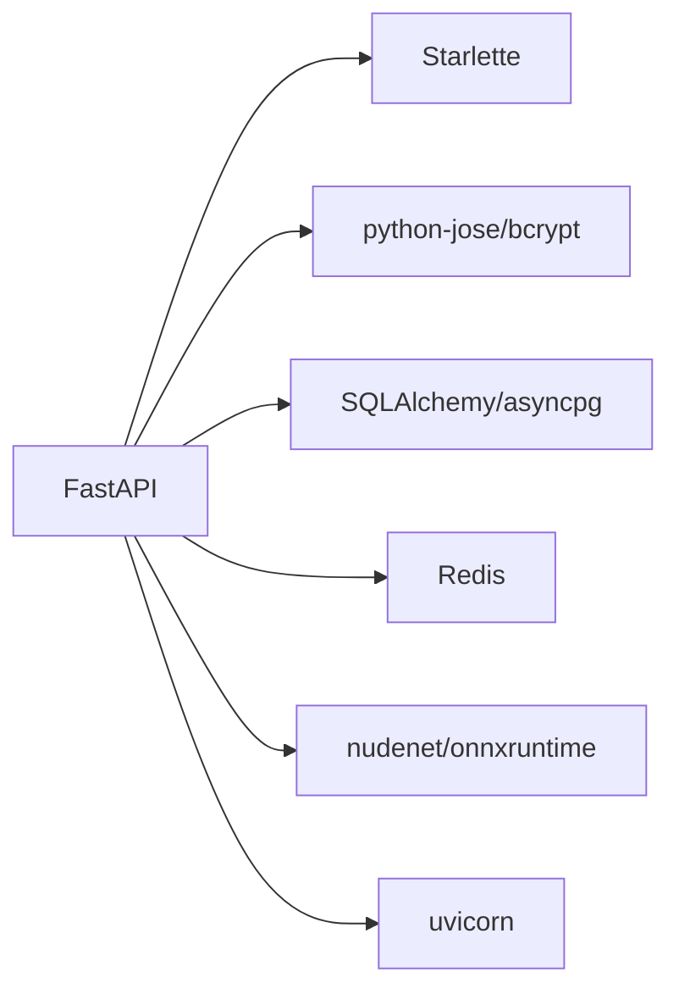

# Troubleshooting Guide

<cite>
**Referenced Files in This Document**
- [CORS_FIX_EXPLANATION.md](file://CORS_FIX_EXPLANATION.md)
- [config.py](file://backend/app/core/config.py)
- [main.py](file://backend/app/main.py)
- [database.py](file://backend/app/core/database.py)
- [auth.py](file://backend/app/api/auth.py)
- [security.py](file://backend/app/core/security.py)
- [ai_moderation.py](file://backend/app/services/ai_moderation.py)
- [Dockerfile](file://backend/Dockerfile)
- [docker-compose.yml](file://docker-compose.yml)
- [DEPLOYMENT.md](file://DEPLOYMENT.md)
- [vite.config.ts](file://frontend/vite.config.ts)
- [rate_limit.py](file://backend/app/core/rate_limit.py)
- [requirements.txt](file://backend/requirements.txt)
</cite>

## Table of Contents
1. Introduction
2. Project Structure
3. Core Components
4. Architecture Overview
5. Detailed Component Analysis
6. Dependency Analysis
7. Performance Considerations
8. Troubleshooting Guide
9. Conclusion

## Introduction
This guide provides comprehensive troubleshooting for the OmniShield platform across common areas: CORS configuration, database connectivity, AI model loading, authentication and authorization, performance bottlenecks, and deployment-specific issues. It includes step-by-step diagnostics, log analysis techniques, and resolution strategies with concrete examples mapped to actual source files.

## Project Structure
The project is a full-stack application with:
- Backend (FastAPI): API endpoints, security, database access, AI moderation services, rate limiting, and configuration.
- Frontend (React + Vite): UI with proxy configuration for local development.
- Infrastructure: Docker Compose orchestration for PostgreSQL, Redis, backend, Celery worker, and frontend.

**Diagram sources**
- [main.py:26-39](file://backend/app/main.py#L26-L39)
- [auth.py:13-90](file://backend/app/api/auth.py#L13-L90)
- [security.py:19-177](file://backend/app/core/security.py#L19-L177)
- [database.py:1-50](file://backend/app/core/database.py#L1-L50)
- [ai_moderation.py:14-22](file://backend/app/services/ai_moderation.py#L14-L22)
- [rate_limit.py:7-44](file://backend/app/core/rate_limit.py#L7-L44)
- [vite.config.ts:16-26](file://frontend/vite.config.ts#L16-L26)

**Section sources**
- [main.py:1-126](file://backend/app/main.py#L1-L126)
- [docker-compose.yml:1-108](file://docker-compose.yml#L1-L108)

## Core Components
- Configuration: Centralized settings including CORS origins parsing, environment validation, JWT secrets, database URLs, and feature flags.
- Database: Async engine for FastAPI routes; sync engine for migrations and scripts.
- Authentication: JWT-based login and API key support with role checks.
- AI Moderation: Lazy-loaded NudeDetector with fallback heuristics and metadata mapping.
- Rate Limiting: Redis-backed per-minute windowed counting with graceful degradation.
- Deployment: Docker Compose with healthchecks, environment variables, and production-ready configurations.

**Section sources**
- [config.py:6-148](file://backend/app/core/config.py#L6-L148)
- [database.py:1-50](file://backend/app/core/database.py#L1-L50)
- [auth.py:13-90](file://backend/app/api/auth.py#L13-L90)
- [security.py:19-177](file://backend/app/core/security.py#L19-L177)
- [ai_moderation.py:14-275](file://backend/app/services/ai_moderation.py#L14-L275)
- [rate_limit.py:7-44](file://backend/app/core/rate_limit.py#L7-L44)
- [docker-compose.yml:41-85](file://docker-compose.yml#L41-L85)

## Architecture Overview
The request flow integrates CORS handling, authentication, database operations, and optional AI processing.

**Diagram sources**
- [main.py:26-39](file://backend/app/main.py#L26-L39)
- [auth.py:41-90](file://backend/app/api/auth.py#L41-L90)
- [security.py:53-177](file://backend/app/core/security.py#L53-L177)
- [database.py:34-50](file://backend/app/core/database.py#L34-L50)
- [ai_moderation.py:148-275](file://backend/app/services/ai_moderation.py#L148-L275)
- [rate_limit.py:7-44](file://backend/app/core/rate_limit.py#L7-L44)

## Detailed Component Analysis

### CORS Configuration Issues
Common symptoms:
- Browser blocks cross-origin requests with “No Access-Control-Allow-Origin header”.
- Credentials flag mismatch when using wildcard origins.
- Method not allowed by CORS policy.

Root causes and resolutions:
- Port mismatch between frontend dev server and backend.
- Incorrect format of CORS_ORIGINS environment variable.
- Missing or misordered CORS middleware.

Diagnostic steps:
- Verify frontend dev server port and proxy configuration.
- Confirm backend CORS origins list parsing and middleware setup.
- Check browser Network tab for missing CORS headers.

Resolution strategies:
- Use flexible CORS_ORIGINS parsing supporting wildcard and comma-separated domains.
- Ensure CORS middleware is added before route handlers.
- In production, restrict CORS_ORIGINS to specific domains.

**Diagram sources**
- [main.py:26-39](file://backend/app/main.py#L26-L39)
- [config.py:88-99](file://backend/app/core/config.py#L88-L99)

**Section sources**
- [CORS_FIX_EXPLANATION.md:1-223](file://CORS_FIX_EXPLANATION.md#L1-L223)
- [config.py:88-99](file://backend/app/core/config.py#L88-L99)
- [main.py:26-39](file://backend/app/main.py#L26-L39)
- [vite.config.ts:16-26](file://frontend/vite.config.ts#L16-L26)

### Database Connectivity Issues
Symptoms:
- Connection refused or timeout errors on startup.
- Migration failures due to driver mismatches.
- Slow queries under load.

Root causes and resolutions:
- DATABASE_URL format differences between async runtime and migration tooling.
- Missing or incorrect credentials in container environments.
- Insufficient connection pool tuning for high concurrency.

Diagnostic steps:
- Validate DATABASE_URL and ASYNC_DATABASE_URL conversions.
- Test connectivity from backend container to PostgreSQL.
- Review Alembic env configuration for synchronous URL conversion.

Resolution strategies:
- Ensure asyncpg driver is used for async connections and convert to sync driver for migrations.
- Configure pool_pre_ping and appropriate pool sizes based on workload.
- Use healthcheck endpoints and logs to verify service readiness.

**Diagram sources**
- [config.py:30-42](file://backend/app/core/config.py#L30-L42)
- [database.py:19-29](file://backend/app/core/database.py#L19-L29)
- [main.py:84-96](file://backend/app/main.py#L84-L96)

**Section sources**
- [config.py:30-42](file://backend/app/core/config.py#L30-L42)
- [database.py:1-50](file://backend/app/core/database.py#L1-L50)
- [DEPLOYMENT.md:720-780](file://DEPLOYMENT.md#L720-L780)

### AI Model Loading Failures
Symptoms:
- GPU memory allocation errors during detection.
- Model file path issues or missing ONNX models.
- Dependency version conflicts causing import failures.

Root causes and resolutions:
- GPU availability and memory constraints.
- Model caching during build vs runtime initialization.
- Conflicting versions of OpenCV, ONNX Runtime, or PyTorch.

Diagnostic steps:
- Inspect logs for NudeDetector initialization messages.
- Verify system libraries installed in the image.
- Test model loading via a simple script inside the container.

Resolution strategies:
- Pre-cache models during Docker build to avoid runtime downloads.
- Adjust USE_GPU and GPU_DEVICE_ID settings appropriately.
- Pin compatible dependency versions in requirements.txt.

**Diagram sources**
- [ai_moderation.py:14-22](file://backend/app/services/ai_moderation.py#L14-L22)
- [ai_moderation.py:148-275](file://backend/app/services/ai_moderation.py#L148-L275)
- [Dockerfile:16-17](file://backend/Dockerfile#L16-L17)

**Section sources**
- [ai_moderation.py:14-275](file://backend/app/services/ai_moderation.py#L14-L275)
- [Dockerfile:1-27](file://backend/Dockerfile#L1-L27)
- [requirements.txt:67-73](file://backend/requirements.txt#L67-L73)

### Authentication and Authorization Problems
Symptoms:
- JWT token validation errors (expired, invalid signature).
- API key permission issues or revoked keys.
- OAuth2 provider configuration gaps.

Root causes and resolutions:
- Mismatched JWT_SECRET or algorithm.
- Expired tokens or inactive user accounts.
- Missing or incorrect OAuth client IDs/secrets.

Diagnostic steps:
- Check token decode logs and WWW-Authenticate headers.
- Validate user status and roles.
- Confirm API key hashing and lookup logic.

Resolution strategies:
- Enforce strong JWT secrets in production with validators.
- Implement proper token refresh flows.
- Configure OAuth providers only when required.

**Diagram sources**
- [auth.py:41-90](file://backend/app/api/auth.py#L41-L90)
- [security.py:53-93](file://backend/app/core/security.py#L53-L93)

**Section sources**
- [auth.py:13-90](file://backend/app/api/auth.py#L13-L90)
- [security.py:19-177](file://backend/app/core/security.py#L19-L177)
- [config.py:18-28](file://backend/app/core/config.py#L18-L28)

### Performance Bottleneck Identification
Symptoms:
- High CPU/memory usage during moderation.
- Slow API responses under load.
- Rate limiting rejections due to Redis pipeline failures.

Diagnostic steps:
- Monitor Prometheus metrics at /metrics.
- Profile Python code paths and database queries.
- Inspect Redis availability and pipeline errors.

Resolution strategies:
- Tune connection pools and cache TTLs.
- Offload heavy tasks to Celery workers.
- Optimize moderation heuristics and batching.

**Diagram sources**
- [main.py:98-107](file://backend/app/main.py#L98-L107)
- [rate_limit.py:7-44](file://backend/app/core/rate_limit.py#L7-L44)

**Section sources**
- [main.py:98-107](file://backend/app/main.py#L98-L107)
- [rate_limit.py:7-44](file://backend/app/core/rate_limit.py#L7-L44)

### Deployment-Specific Issues
Symptoms:
- Container networking problems preventing inter-service communication.
- Environment variable injection failures.
- Health check endpoint misconfigurations.

Root causes and resolutions:
- Incorrect hostnames or ports in docker-compose environment variables.
- Missing or overridden environment variables in production configs.
- Health checks pointing to wrong paths or ports.

Diagnostic steps:
- Verify network topology and service names in compose.
- Inspect container logs for startup errors.
- Test health endpoints from within containers.

Resolution strategies:
- Align DATABASE_URL and REDIS_URL with service names.
- Use healthcheck conditions in depends_on.
- Provide explicit health endpoints and probes.

**Diagram sources**
- [docker-compose.yml:41-85](file://docker-compose.yml#L41-L85)
- [main.py:84-96](file://backend/app/main.py#L84-L96)

**Section sources**
- [docker-compose.yml:1-108](file://docker-compose.yml#L1-L108)
- [DEPLOYMENT.md:162-247](file://DEPLOYMENT.md#L162-L247)

## Dependency Analysis
Key dependencies and their roles:
- FastAPI and Starlette: Web framework and ASGI server integration.
- SQLAlchemy and asyncpg: Async database access.
- Redis: Caching and rate limiting.
- NudeNet and ONNX Runtime: AI model inference.
- Uvicorn: Production server.

**Diagram sources**
- [requirements.txt:37-37](file://backend/requirements.txt#L37-L37)
- [requirements.txt:88-88](file://backend/requirements.txt#L88-L88)
- [requirements.txt:107-107](file://backend/requirements.txt#L107-L107)
- [requirements.txt:67-70](file://backend/requirements.txt#L67-L70)
- [requirements.txt:137-137](file://backend/requirements.txt#L137-L137)

**Section sources**
- [requirements.txt:1-142](file://backend/requirements.txt#L1-L142)

## Performance Considerations
- Use async engines and session makers for high-throughput routes.
- Enable Prometheus metrics and monitor latency percentiles.
- Tune Redis pipelines and rate limits to prevent overload.
- Pre-warm AI models during build to reduce cold start times.
- Scale Celery workers for background jobs and moderate large batches.

[No sources needed since this section provides general guidance]

## Troubleshooting Guide

### CORS Configuration Problems
- Cross-origin request failures:
  - Symptom: Browser console shows blocked request due to missing CORS headers.
  - Diagnostics: Check frontend port and proxy config; inspect backend CORS middleware.
  - Resolution: Set CORS_ORIGINS to allow specific origins; ensure middleware is applied.
- Middleware ordering issues:
  - Symptom: Custom headers not present or security headers missing.
  - Diagnostics: Review middleware registration order in main app.
  - Resolution: Register CORSMiddleware before custom security headers.
- Production deployment CORS settings:
  - Symptom: Overly permissive CORS in production.
  - Diagnostics: Validate ENVIRONMENT and CORS_ORIGINS values.
  - Resolution: Restrict CORS_ORIGINS to trusted domains; remove wildcard.

**Section sources**
- [CORS_FIX_EXPLANATION.md:1-223](file://CORS_FIX_EXPLANATION.md#L1-L223)
- [main.py:26-39](file://backend/app/main.py#L26-L39)
- [config.py:88-99](file://backend/app/core/config.py#L88-L99)
- [vite.config.ts:16-26](file://frontend/vite.config.ts#L16-L26)

### Database Connectivity Issues
- PostgreSQL connection pooling problems:
  - Symptom: Connection timeouts or exhausted pool errors.
  - Diagnostics: Check pool_pre_ping and pool size settings; validate ASYNC_DATABASE_URL.
  - Resolution: Increase pool sizes and tune timeouts; ensure correct driver suffix.
- Migration failures:
  - Symptom: Alembic cannot connect or schema drift.
  - Diagnostics: Verify sync URL conversion in env.py; confirm migrations exist.
  - Resolution: Fix URL conversion and run alembic upgrade head.
- Query performance optimization:
  - Symptom: Slow endpoints under load.
  - Diagnostics: Analyze slow queries and indexes; review N+1 patterns.
  - Resolution: Add indexes, optimize joins, use eager loading where appropriate.

**Section sources**
- [database.py:1-50](file://backend/app/core/database.py#L1-L50)
- [config.py:30-42](file://backend/app/core/config.py#L30-L42)
- [DEPLOYMENT.md:720-780](file://DEPLOYMENT.md#L720-L780)

### AI Model Loading Failures
- GPU memory allocation errors:
  - Symptom: Out-of-memory exceptions during detection.
  - Diagnostics: Inspect GPU device ID and memory usage; check USE_GPU setting.
  - Resolution: Reduce batch sizes, adjust device ID, or disable GPU if unavailable.
- Model file path issues:
  - Symptom: Missing model files or download failures.
  - Diagnostics: Verify pre-cached model in image; test NudeDetector init.
  - Resolution: Rebuild image to pre-cache models; ensure filesystem permissions.
- Dependency version conflicts:
  - Symptom: Import errors for OpenCV or ONNX Runtime.
  - Diagnostics: Compare pinned versions in requirements.txt.
  - Resolution: Align versions and rebuild container.

**Section sources**
- [ai_moderation.py:14-275](file://backend/app/services/ai_moderation.py#L14-L275)
- [Dockerfile:16-17](file://backend/Dockerfile#L16-L17)
- [requirements.txt:67-73](file://backend/requirements.txt#L67-L73)

### Authentication and Authorization Problems
- JWT token validation errors:
  - Symptom: 401 Unauthorized with decode failures.
  - Diagnostics: Check JWT_SECRET and algorithm; inspect token expiry.
  - Resolution: Regenerate secure secret; implement token refresh.
- API key permission issues:
  - Symptom: Invalid or revoked API key errors.
  - Diagnostics: Validate hashed key lookup and last_used updates.
  - Resolution: Ensure active keys and correct header X-API-Key.
- OAuth2 provider configuration:
  - Symptom: Missing OAuth clients or redirect URI mismatches.
  - Diagnostics: Verify GOOGLE_CLIENT_ID/SECRET and GITHUB_CLIENT_ID/SECRET.
  - Resolution: Configure providers and update callback URLs.

**Section sources**
- [security.py:53-177](file://backend/app/core/security.py#L53-L177)
- [auth.py:41-90](file://backend/app/api/auth.py#L41-L90)
- [config.py:18-28](file://backend/app/core/config.py#L18-L28)

### Performance Bottleneck Identification
- Profiling tools:
  - Symptom: High latency spikes.
  - Diagnostics: Enable /metrics and analyze Prometheus dashboards.
  - Resolution: Identify hotspots and optimize critical paths.
- Memory leak detection:
  - Symptom: Gradual memory growth in long-running processes.
  - Diagnostics: Monitor container stats and heap profiles.
  - Resolution: Release temporary resources; restart workers periodically.
- Caching strategy optimization:
  - Symptom: Excessive DB hits or stale responses.
  - Diagnostics: Review cache TTLs and hit rates.
  - Resolution: Tune IMAGE_CACHE_TTL and API_RESPONSE_CACHE_TTL.

**Section sources**
- [main.py:98-107](file://backend/app/main.py#L98-L107)
- [config.py:44-51](file://backend/app/core/config.py#L44-L51)
- [rate_limit.py:7-44](file://backend/app/core/rate_limit.py#L7-L44)

### Deployment-Specific Issues
- Docker container networking problems:
  - Symptom: Backend cannot reach Postgres or Redis.
  - Diagnostics: Verify service names and ports in docker-compose.
  - Resolution: Correct DATABASE_URL and REDIS_URL hostnames.
- Environment variable injection failures:
  - Symptom: Missing or default values in production.
  - Diagnostics: Inspect container environment and .env overrides.
  - Resolution: Pass explicit environment variables and validate at startup.
- Health check endpoint misconfigurations:
  - Symptom: Probes failing or pods restarting.
  - Diagnostics: Test /health endpoint manually; align liveness/readiness probes.
  - Resolution: Ensure /health returns operational status and correct ports.

**Section sources**
- [docker-compose.yml:41-85](file://docker-compose.yml#L41-L85)
- [main.py:84-96](file://backend/app/main.py#L84-L96)
- [DEPLOYMENT.md:162-247](file://DEPLOYMENT.md#L162-L247)

## Conclusion
By systematically diagnosing CORS, database, AI model, authentication, performance, and deployment issues—and applying targeted fixes—you can maintain a robust and scalable OmniShield platform. Use the provided diagrams and section sources to trace behaviors back to concrete implementation points and resolve issues efficiently.