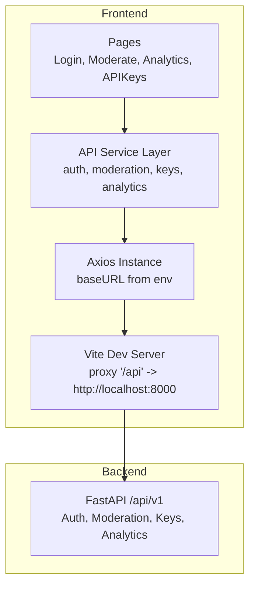
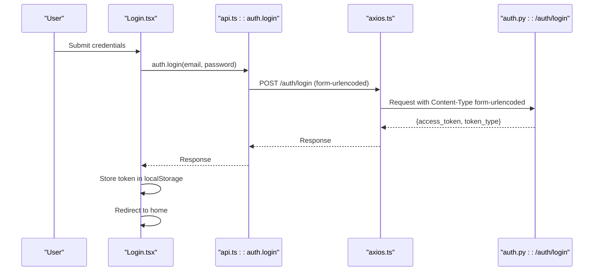
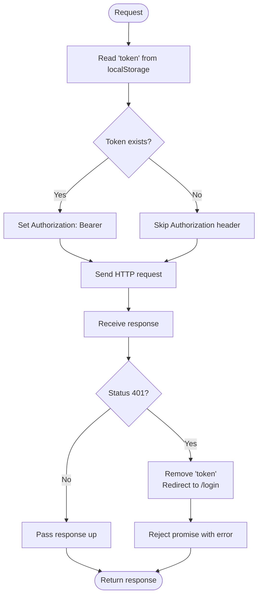
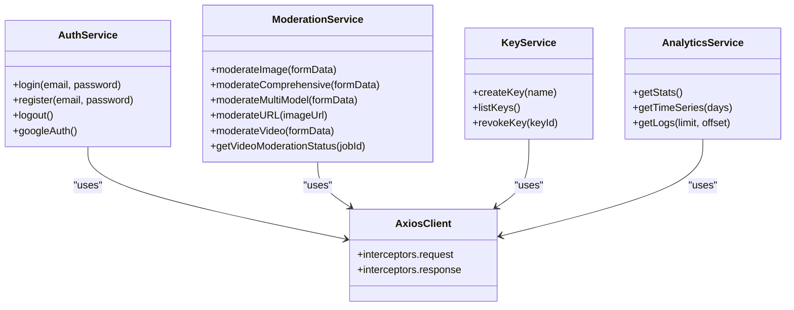
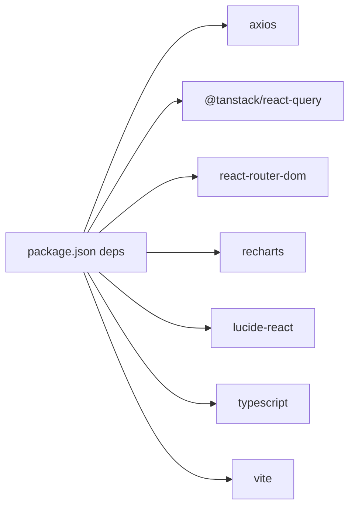

# API Integration & Client

<cite>
**Referenced Files in This Document**
- [axios.ts](file://frontend/src/lib/axios.ts)
- [api.ts](file://frontend/src/lib/api.ts)
- [vite.config.ts](file://frontend/vite.config.ts)
- [.env](file://frontend/.env)
- [package.json](file://frontend/package.json)
- [Login.tsx](file://frontend/src/pages/Login.tsx)
- [Moderate.tsx](file://frontend/src/pages/Moderate.tsx)
- [Analytics.tsx](file://frontend/src/pages/Analytics.tsx)
- [APIKeys.tsx](file://frontend/src/pages/APIKeys.tsx)
- [auth.py](file://backend/app/api/auth.py)
- [moderate.py](file://backend/app/api/moderate.py)
</cite>

## Table of Contents
1. [Introduction](#introduction)
2. [Project Structure](#project-structure)
3. [Core Components](#core-components)
4. [Architecture Overview](#architecture-overview)
5. [Detailed Component Analysis](#detailed-component-analysis)
6. [Dependency Analysis](#dependency-analysis)
7. [Performance Considerations](#performance-considerations)
8. [Troubleshooting Guide](#troubleshooting-guide)
9. [Security Considerations](#security-considerations)
10. [Guidelines for Adding New Endpoints](#guidelines-for-adding-new-endpoints)
11. [Conclusion](#conclusion)

## Introduction
This document explains the frontend API integration layer that communicates with the backend moderation service. It covers Axios client configuration, request/response interceptors, authentication token handling, error processing, and the typed API service layer for authentication, moderation, analytics, and key management. It also provides usage examples, retry strategies, loading state patterns, cancellation approaches, timeout configuration, and security considerations such as token storage, CORS, and input validation.

## Project Structure
The frontend uses Vite with React and TypeScript. The API integration is implemented via a dedicated Axios instance and a thin service layer that exposes typed endpoints. Pages consume these services to perform authenticated operations and render results.

**Diagram sources**
- [vite.config.ts:16-26](file://frontend/vite.config.ts#L16-L26)
- [axios.ts:1-37](file://frontend/src/lib/axios.ts#L1-L37)
- [api.ts:1-103](file://frontend/src/lib/api.ts#L1-L103)

**Section sources**
- [vite.config.ts:16-26](file://frontend/vite.config.ts#L16-L26)
- [.env:1-2](file://frontend/.env#L1-L2)
- [package.json:12-21](file://frontend/package.json#L12-L21)

## Core Components
- Axios client: Centralized HTTP client with base URL, request interceptor for JWT, and response interceptor for 401 handling.
- API service layer: Typed functions grouped by domain (auth, moderation, keys, analytics).
- Pages: Consume services, manage UI state, and handle errors.

Key responsibilities:
- Base URL resolution from environment variables.
- Automatic Authorization header injection on requests.
- Redirect to login on 401 responses.
- Consistent content-type headers per endpoint (form-urlencoded, JSON, multipart).
- Centralized error extraction for user-facing messages.

**Section sources**
- [axios.ts:1-37](file://frontend/src/lib/axios.ts#L1-L37)
- [api.ts:1-103](file://frontend/src/lib/api.ts#L1-L103)
- [Login.tsx:22-50](file://frontend/src/pages/Login.tsx#L22-L50)
- [Moderate.tsx:141-174](file://frontend/src/pages/Moderate.tsx#L141-L174)
- [Analytics.tsx:7-40](file://frontend/src/pages/Analytics.tsx#L7-L40)
- [APIKeys.tsx:28-60](file://frontend/src/pages/APIKeys.tsx#L28-L60)

## Architecture Overview
The frontend integrates with the backend through a proxied development server or direct calls when configured. Authentication is handled via OAuth2-compatible login returning a bearer token stored in localStorage. Subsequent requests attach the token automatically.

**Diagram sources**
- [Login.tsx:22-50](file://frontend/src/pages/Login.tsx#L22-L50)
- [api.ts:4-28](file://frontend/src/lib/api.ts#L4-L28)
- [axios.ts:10-22](file://frontend/src/lib/axios.ts#L10-L22)
- [auth.py:41-76](file://backend/app/api/auth.py#L41-L76)

## Detailed Component Analysis

### Axios Client Configuration
- Base URL: Resolved from environment variable; defaults to local backend path.
- Interceptors:
  - Request: Reads token from localStorage and attaches Authorization header if present.
  - Response: On 401, clears token and redirects to login.
- Headers: Default Content-Type is not set globally; each endpoint sets appropriate headers.

**Diagram sources**
- [axios.ts:10-34](file://frontend/src/lib/axios.ts#L10-L34)

**Section sources**
- [axios.ts:1-37](file://frontend/src/lib/axios.ts#L1-L37)
- [.env:1-2](file://frontend/.env#L1-L2)

### API Service Layer Abstraction
The service layer groups endpoints by domain and enforces correct content types and payloads.

- Authentication
  - Login: Sends form-encoded username/password; expects access_token in response.
  - Register: JSON payload.
  - Logout: Simple POST.
  - Google Auth: GET redirect initiation.
- Moderation
  - Image upload: Multipart/form-data.
  - Comprehensive image moderation: Multipart/form-data with richer result shape.
  - Multi-model moderation: Multipart/form-data.
  - URL-based moderation: JSON body with image_url.
  - Video moderation: Multipart/form-data; status polling endpoint provided.
- Key Management
  - Create, list, revoke keys.
- Analytics
  - Stats, time series, logs.

**Diagram sources**
- [api.ts:1-103](file://frontend/src/lib/api.ts#L1-L103)
- [axios.ts:1-37](file://frontend/src/lib/axios.ts#L1-L37)

**Section sources**
- [api.ts:1-103](file://frontend/src/lib/api.ts#L1-L103)

### Usage Examples

- Make an authenticated request
  - After login, tokens are stored in localStorage and automatically attached to subsequent requests via the request interceptor.
  - Example paths:
    - [api.ts:4-28](file://frontend/src/lib/api.ts#L4-L28)
    - [axios.ts:10-22](file://frontend/src/lib/axios.ts#L10-L22)

- Handle different response types
  - JSON responses: Access data via response.data.
  - Multipart uploads: Ensure FormData is used and Content-Type is omitted so the browser sets it correctly.
  - Example paths:
    - [Moderate.tsx:155-174](file://frontend/src/pages/Moderate.tsx#L155-L174)
    - [api.ts:31-69](file://frontend/src/lib/api.ts#L31-L69)

- Implement retry logic
  - Use a wrapper around axios calls with exponential backoff and jitter.
  - Only retry on transient errors (e.g., network failures or specific server codes like 429/5xx).
  - Avoid retrying idempotent mutations unless safe.

- Manage loading states
  - Toggle a boolean flag before and after async calls.
  - For read-heavy pages, use React Query’s isLoading and refetchInterval where appropriate.
  - Example paths:
    - [Login.tsx:22-50](file://frontend/src/pages/Login.tsx#L22-L50)
    - [Analytics.tsx:7-40](file://frontend/src/pages/Analytics.tsx#L7-L40)

- Cancel long-running requests
  - Use AbortController with axios cancel tokens or the newer signal option.
  - Cancel on component unmount or when navigating away.

- Configure timeouts
  - Set a global timeout on the Axios instance or per-request options.
  - Provide user feedback for slow operations.

**Section sources**
- [api.ts:1-103](file://frontend/src/lib/api.ts#L1-L103)
- [axios.ts:1-37](file://frontend/src/lib/axios.ts#L1-L37)
- [Moderate.tsx:141-174](file://frontend/src/pages/Moderate.tsx#L141-L174)
- [Analytics.tsx:7-40](file://frontend/src/pages/Analytics.tsx#L7-L40)

### Error Handling Strategies
- Global 401 handling: Clears token and redirects to login.
- Per-call error parsing: Extract detail strings or arrays from backend responses to display meaningful messages.
- Network vs server errors: Differentiate between connectivity issues and application-level errors.

Example paths:
- [axios.ts:24-34](file://frontend/src/lib/axios.ts#L24-L34)
- [Login.tsx:32-49](file://frontend/src/pages/Login.tsx#L32-L49)
- [Moderate.tsx:167-173](file://frontend/src/pages/Moderate.tsx#L167-L173)

**Section sources**
- [axios.ts:24-34](file://frontend/src/lib/axios.ts#L24-L34)
- [Login.tsx:32-49](file://frontend/src/pages/Login.tsx#L32-L49)
- [Moderate.tsx:167-173](file://frontend/src/pages/Moderate.tsx#L167-L173)

### Timeout Configurations
- Add a default timeout to the Axios instance to fail fast on slow networks.
- Optionally override per request for long-running tasks.

Implementation guidance:
- Set timeout in the Axios create config.
- Surface user-friendly messages when timeouts occur.

**Section sources**
- [axios.ts:5-8](file://frontend/src/lib/axios.ts#L5-L8)

### Request Cancellation Patterns
- Use AbortController to cancel pending requests on navigation or unmount.
- Integrate with React Query’s ability to cancel queries when dependencies change.

**Section sources**
- [Analytics.tsx:7-29](file://frontend/src/pages/Analytics.tsx#L7-L29)

## Dependency Analysis
The frontend depends on Axios for HTTP, React Query for caching and background updates, and Vite for dev proxying.

**Diagram sources**
- [package.json:12-36](file://frontend/package.json#L12-L36)

**Section sources**
- [package.json:12-36](file://frontend/package.json#L12-L36)

## Performance Considerations
- Prefer React Query for caching and deduplication of identical requests.
- Use refetchInterval sparingly; consider debouncing or throttling heavy charts.
- Avoid unnecessary re-renders by memoizing derived data.
- For large file uploads, show progress indicators and validate sizes early.

[No sources needed since this section provides general guidance]

## Troubleshooting Guide
Common issues and resolutions:
- 401 Unauthorized: Token missing/expired; ensure login flow stores token and interceptor adds Authorization header.
- CORS errors during development: Confirm Vite proxy routes /api to backend origin.
- Upload failures: Verify multipart/form-data usage and allowed file types/sizes on the backend.
- Rate limiting: Backend may return 429 with Retry-After; implement backoff and respect headers.

Relevant backend behaviors:
- Authentication returns bearer token.
- Moderation endpoints enforce file type checks and size limits.
- Rate limiting returns structured error with retry information.

**Section sources**
- [auth.py:41-76](file://backend/app/api/auth.py#L41-L76)
- [moderate.py:223-371](file://backend/app/api/moderate.py#L223-L371)
- [moderate.py:446-615](file://backend/app/api/moderate.py#L446-L615)

## Security Considerations
- Token storage: Tokens are stored in localStorage; consider secure alternatives for sensitive apps.
- Token lifecycle: Clear token on logout and on 401; redirect to login.
- CORS: In development, Vite proxies /api to backend; in production, configure proper CORS policies on the backend and serve frontend from the same origin or trusted domains.
- Input sanitization: Validate file types and sizes on both client and server; rely on backend magic-byte checks and allowlists.
- Sensitive data exposure: Avoid logging tokens or secrets; sanitize console output.

**Section sources**
- [axios.ts:10-22](file://frontend/src/lib/axios.ts#L10-L22)
- [axios.ts:24-34](file://frontend/src/lib/axios.ts#L24-L34)
- [vite.config.ts:16-26](file://frontend/vite.config.ts#L16-L26)
- [moderate.py:32-61](file://backend/app/api/moderate.py#L32-L61)

## Guidelines for Adding New Endpoints
Follow these steps to maintain consistency and type safety:

1. Define the endpoint in the API service layer
   - Choose the correct method and path.
   - Set appropriate headers (JSON vs form-urlencoded vs multipart).
   - Return the Axios response directly; let callers unwrap data.

2. Update page components
   - Call the new service function.
   - Handle loading, success, and error states consistently.
   - Invalidate relevant React Query caches when mutating data.

3. Align with backend contracts
   - Match field names and payload structures.
   - Respect rate limits and error shapes.

4. Add tests and documentation
   - Unit test service wrappers.
   - Document expected inputs/outputs and error cases.

Example references:
- [api.ts:71-95](file://frontend/src/lib/api.ts#L71-L95)
- [APIKeys.tsx:28-60](file://frontend/src/pages/APIKeys.tsx#L28-L60)

**Section sources**
- [api.ts:1-103](file://frontend/src/lib/api.ts#L1-L103)
- [APIKeys.tsx:28-60](file://frontend/src/pages/APIKeys.tsx#L28-L60)

## Conclusion
The frontend API integration layer is centered around a single Axios instance with robust interceptors and a clean service layer that abstracts backend endpoints. Pages consume these services to provide authenticated, resilient, and user-friendly experiences. By following the guidelines above—especially around error handling, retries, timeouts, cancellation, and security—you can extend the system safely and maintain high quality across features.