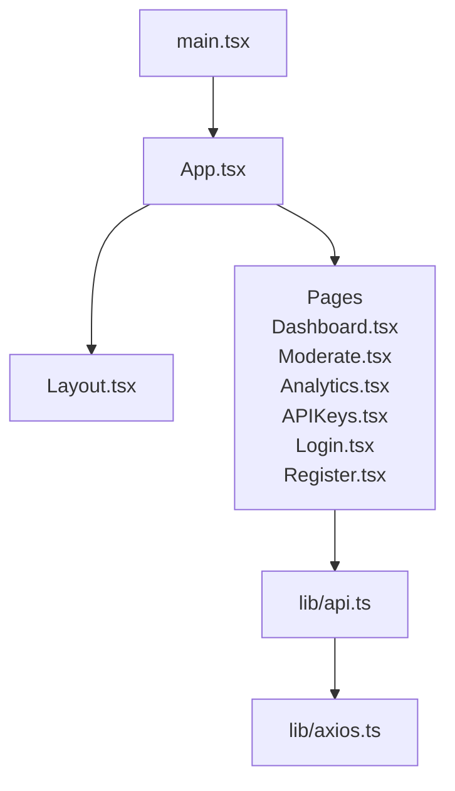
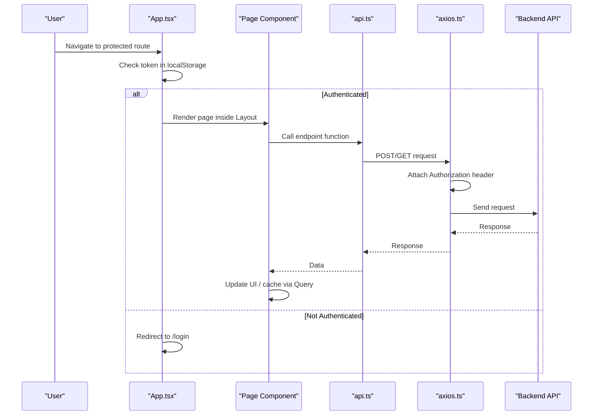
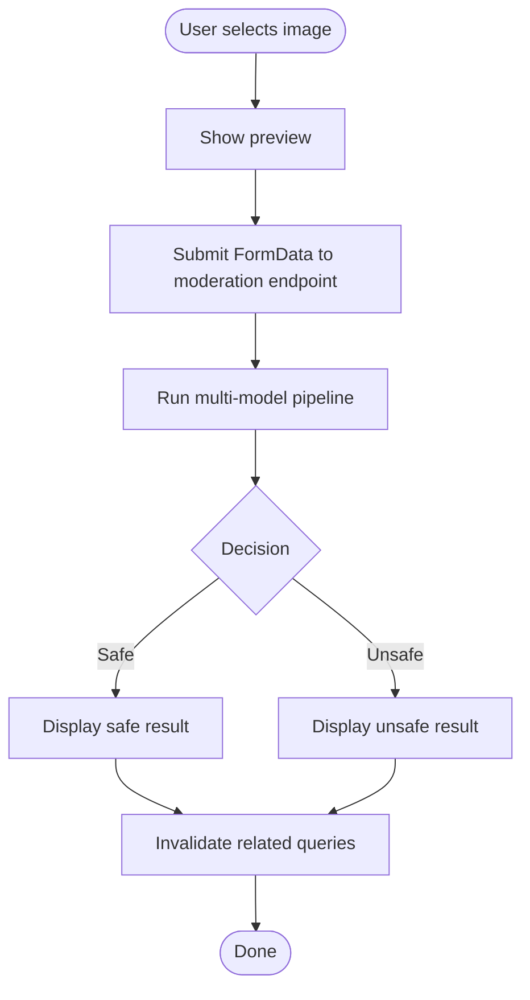
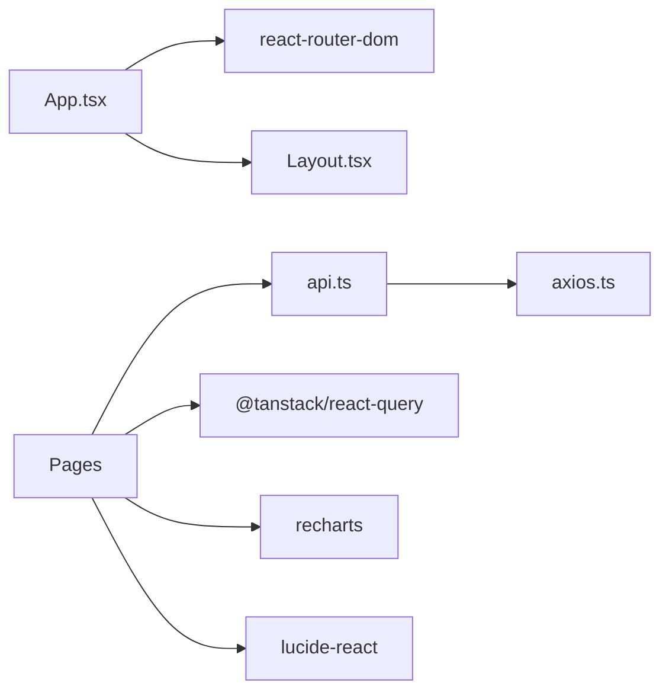

# Frontend Application

<cite>
**Referenced Files in This Document**
- [package.json](file://frontend/package.json)
- [App.tsx](file://frontend/src/App.tsx)
- [main.tsx](file://frontend/src/main.tsx)
- [Layout.tsx](file://frontend/src/components/Layout.tsx)
- [api.ts](file://frontend/src/lib/api.ts)
- [axios.ts](file://frontend/src/lib/axios.ts)
- [Dashboard.tsx](file://frontend/src/pages/Dashboard.tsx)
- [Moderate.tsx](file://frontend/src/pages/Moderate.tsx)
- [Analytics.tsx](file://frontend/src/pages/Analytics.tsx)
- [APIKeys.tsx](file://frontend/src/pages/APIKeys.tsx)
- [Login.tsx](file://frontend/src/pages/Login.tsx)
- [Register.tsx](file://frontend/src/pages/Register.tsx)
</cite>

## Table of Contents
1. Introduction
2. Project Structure
3. Core Components
4. Architecture Overview
5. Detailed Component Analysis
6. Dependency Analysis
7. Performance Considerations
8. Troubleshooting Guide
9. Conclusion

## Introduction
This document describes the OmniShield frontend dashboard, a modern web interface for content moderation management. It is implemented with React and TypeScript, using Vite as the build tool, React Router for navigation, Axios for HTTP requests, TanStack Query for server state caching and background updates, and Recharts for data visualization. The application provides pages for authentication, moderation workflows, analytics dashboards, and API key management, all wrapped in a consistent layout shell.

Note: While the objective mentions Next.js 16 App Router, the current implementation uses a client-side router (React Router). The architecture and patterns described here reflect the actual codebase.

## Project Structure
The frontend is organized by feature areas:
- Entry points and app bootstrap
- Routing and protected routes
- Shared layout shell
- API layer with Axios client and typed endpoints
- Page components for each feature area

**Diagram sources**
- [main.tsx:1-27](file://frontend/src/main.tsx#L1-L27)
- [App.tsx:1-90](file://frontend/src/App.tsx#L1-L90)
- [Layout.tsx:1-108](file://frontend/src/components/Layout.tsx#L1-L108)
- [api.ts:1-93](file://frontend/src/lib/api.ts#L1-L93)
- [axios.ts:1-37](file://frontend/src/lib/axios.ts#L1-L37)
- [Dashboard.tsx:1-124](file://frontend/src/pages/Dashboard.tsx#L1-L124)
- [Moderate.tsx:1-596](file://frontend/src/pages/Moderate.tsx#L1-L596)
- [Analytics.tsx:1-304](file://frontend/src/pages/Analytics.tsx#L1-L304)
- [APIKeys.tsx:1-325](file://frontend/src/pages/APIKeys.tsx#L1-L325)
- [Login.tsx:1-132](file://frontend/src/pages/Login.tsx#L1-L132)
- [Register.tsx:1-179](file://frontend/src/pages/Register.tsx#L1-L179)

**Section sources**
- [package.json:1-38](file://frontend/package.json#L1-L38)
- [main.tsx:1-27](file://frontend/src/main.tsx#L1-L27)
- [App.tsx:1-90](file://frontend/src/App.tsx#L1-L90)

## Core Components
- App: Root component that defines routes, guards authenticated access, and wraps protected pages with Layout.
- Layout: Provides header navigation, active route highlighting, logout behavior, and consistent page structure.
- API Layer: Centralized Axios client with request/response interceptors and typed endpoint functions grouped by domain (auth, moderation, keys, analytics).
- Pages: Feature-specific UIs for Dashboard, Moderate, Analytics, API Keys, Login, and Register.

Key responsibilities:
- Authentication flow and token handling via localStorage and Axios interceptor.
- Server state caching and refetching via TanStack Query.
- File upload and multi-step scanning UX for moderation.
- Data visualization with Recharts for time series and classification breakdowns.
- Secure one-time display and copy-to-clipboard for newly created API keys.

**Section sources**
- [App.tsx:1-90](file://frontend/src/App.tsx#L1-L90)
- [Layout.tsx:1-108](file://frontend/src/components/Layout.tsx#L1-L108)
- [api.ts:1-93](file://frontend/src/lib/api.ts#L1-L93)
- [axios.ts:1-37](file://frontend/src/lib/axios.ts#L1-L37)

## Architecture Overview
High-level runtime architecture:
- Browser bootstraps React via main.tsx, which configures QueryClient and BrowserRouter.
- App.tsx renders Routes; protected routes wrap children in Layout and enforce authentication.
- Pages call api.ts methods, which use axios.ts to send requests to the backend.
- Axios interceptors attach JWT tokens and handle 401 redirects.
- TanStack Query caches responses and supports periodic refetching.

**Diagram sources**
- [main.tsx:1-27](file://frontend/src/main.tsx#L1-L27)
- [App.tsx:1-90](file://frontend/src/App.tsx#L1-L90)
- [api.ts:1-93](file://frontend/src/lib/api.ts#L1-L93)
- [axios.ts:1-37](file://frontend/src/lib/axios.ts#L1-L37)

## Detailed Component Analysis

### App (Routing and Guards)
- Defines public routes (/login, /register) and protected routes (/ , /moderate, /analytics, /api-keys).
- Uses local storage to determine authentication state and redirects unauthenticated users.
- Wraps protected pages with Layout and passes setIsAuthenticated to enable logout from anywhere.

Usage example (conceptual):
- Compose a protected page by rendering it within Layout under a guarded Route.
- Prop passing pattern: Layout receives children and an auth setter to update global auth state.

**Section sources**
- [App.tsx:1-90](file://frontend/src/App.tsx#L1-L90)

### Layout (Shell and Navigation)
- Renders header with navigation links, active link styling based on current path, and a Logout button.
- On logout, clears token, resets auth state, and navigates to login.

Accessibility notes:
- Use semantic HTML elements (header, nav, main, footer).
- Ensure keyboard navigation and focus states are visible.

**Section sources**
- [Layout.tsx:1-108](file://frontend/src/components/Layout.tsx#L1-L108)

### API Layer (api.ts and axios.ts)
- axios.ts:
  - Creates an Axios instance with baseURL from environment.
  - Request interceptor attaches Bearer token from localStorage when present.
  - Response interceptor handles 401 by clearing token and redirecting to login.
- api.ts:
  - Groups endpoints by domain: auth, moderation, keys, analytics.
  - Handles form-encoded login payload and multipart uploads for moderation.
  - Exposes typed functions used by pages.

Integration examples (conceptual):
- Authentication: call login with email/password; store returned token; subsequent requests include Authorization header automatically.
- Moderation: submit FormData with file; receive structured results including categories and risk levels.
- API Keys: create/list/revoke keys; show raw key once in a modal.
- Analytics: fetch stats and time series; cache and periodically refetch.

**Section sources**
- [axios.ts:1-37](file://frontend/src/lib/axios.ts#L1-L37)
- [api.ts:1-93](file://frontend/src/lib/api.ts#L1-L93)

### Dashboard
- Fetches aggregated stats via TanStack Query with periodic refetch.
- Displays summary cards and quick-start guidance.

State and interactions:
- Loading state while fetching stats.
- Auto-refetch interval keeps metrics fresh.

**Section sources**
- [Dashboard.tsx:1-124](file://frontend/src/pages/Dashboard.tsx#L1-L124)

### Moderate (Image Moderation)
- Upload image, preview selection, and trigger comprehensive moderation pipeline.
- Implements a staged scanning animation with timed steps and completion cascade before revealing results.
- Invalidates relevant queries after successful submission to refresh related views.

Data model highlights:
- Result includes decision, risk level, confidence, detected labels, bounding boxes, processing time, recommended action, and optional category breakdowns.

UX considerations:
- Clear error messages and retry behavior.
- Visual feedback during long-running operations.

**Section sources**
- [Moderate.tsx:1-596](file://frontend/src/pages/Moderate.tsx#L1-L596)

### Analytics
- Fetches time series and stats with TanStack Query and refetch intervals.
- Renders line and bar charts using Recharts with responsive containers.
- Includes empty-state messaging when no data is available.

Performance tips:
- Limit chart datasets to recent days.
- Debounce or throttle user-driven filters if added later.

**Section sources**
- [Analytics.tsx:1-304](file://frontend/src/pages/Analytics.tsx#L1-L304)

### API Keys
- Create, list, and revoke API keys.
- One-time modal displays the raw key with copy-to-clipboard and auto-close after copying.
- Masks key previews in the list view for security.

Security best practices:
- Do not persist raw keys beyond the modal session.
- Provide clear warnings about key exposure.

**Section sources**
- [APIKeys.tsx:1-325](file://frontend/src/pages/APIKeys.tsx#L1-L325)

### Login and Register
- Login:
  - Submits credentials using form-encoded payload expected by OAuth2PasswordRequestForm.
  - Stores access token and reloads to refresh routing state.
- Register:
  - Validates password length and confirmation match.
  - Registers then logs in automatically, storing token and reloading.

Error handling:
- Normalizes backend detail messages into user-friendly strings.

**Section sources**
- [Login.tsx:1-132](file://frontend/src/pages/Login.tsx#L1-L132)
- [Register.tsx:1-179](file://frontend/src/pages/Register.tsx#L1-L179)

### Conceptual Overview
Conceptual workflow for moderation:

[No sources needed since this diagram shows conceptual workflow, not actual code structure]

## Dependency Analysis
Runtime dependencies and their roles:
- react/react-dom: UI framework and DOM rendering.
- react-router-dom: Client-side routing and navigation.
- @tanstack/react-query: Server state caching, background refetch, mutations.
- axios: HTTP client with interceptors.
- recharts: Charts and graphs.
- lucide-react: Iconography.
- clsx: Conditional class composition.

Build and dev tooling:
- vite: Development server and bundler.
- typescript: Type checking and compilation.
- tailwindcss + postcss + autoprefixer: Utility-first styling and CSS processing.

**Diagram sources**
- [package.json:1-38](file://frontend/package.json#L1-L38)
- [App.tsx:1-90](file://frontend/src/App.tsx#L1-L90)
- [Layout.tsx:1-108](file://frontend/src/components/Layout.tsx#L1-L108)
- [api.ts:1-93](file://frontend/src/lib/api.ts#L1-L93)
- [axios.ts:1-37](file://frontend/src/lib/axios.ts#L1-L37)
- [Dashboard.tsx:1-124](file://frontend/src/pages/Dashboard.tsx#L1-L124)
- [Moderate.tsx:1-596](file://frontend/src/pages/Moderate.tsx#L1-L596)
- [Analytics.tsx:1-304](file://frontend/src/pages/Analytics.tsx#L1-L304)
- [APIKeys.tsx:1-325](file://frontend/src/pages/APIKeys.tsx#L1-L325)
- [Login.tsx:1-132](file://frontend/src/pages/Login.tsx#L1-L132)
- [Register.tsx:1-179](file://frontend/src/pages/Register.tsx#L1-L179)

**Section sources**
- [package.json:1-38](file://frontend/package.json#L1-L38)

## Performance Considerations
- Server state caching:
  - Use TanStack Query’s staleTime and refetchInterval to balance freshness and network load.
  - Invalidate specific queries after mutations (e.g., after moderation submission).
- Efficient re-renders:
  - Keep page components focused; extract reusable sub-components where appropriate.
  - Avoid unnecessary prop changes; memoize derived data if needed.
- Code splitting:
  - Consider lazy loading heavy pages (e.g., Analytics with charts) to reduce initial bundle size.
- Image handling:
  - Revoke object URLs when no longer needed to prevent memory leaks.
- Chart performance:
  - Limit dataset size and avoid excessive redraws; leverage ResponsiveContainer wisely.

[No sources needed since this section provides general guidance]

## Troubleshooting Guide
Common issues and resolutions:
- 401 Unauthorized:
  - Axios response interceptor clears token and redirects to login. Verify token presence and expiration handling.
- CORS errors:
  - Ensure backend allows the frontend origin and required headers/methods.
- Form-encoded login failures:
  - Confirm Content-Type is application/x-www-form-urlencoded and field name is username for login.
- Multipart upload issues:
  - Ensure Content-Type is multipart/form-data and file field name matches backend expectations.
- Empty analytics data:
  - Check backend availability and query keys; confirm refetch intervals and network connectivity.

Operational checks:
- Inspect browser console for detailed logs in Analytics and registration flows.
- Validate environment variable for API base URL.

**Section sources**
- [axios.ts:1-37](file://frontend/src/lib/axios.ts#L1-L37)
- [api.ts:1-93](file://frontend/src/lib/api.ts#L1-L93)
- [Analytics.tsx:1-304](file://frontend/src/pages/Analytics.tsx#L1-L304)
- [Register.tsx:1-179](file://frontend/src/pages/Register.tsx#L1-L179)

## Conclusion
The OmniShield frontend implements a clean, modular architecture centered around React, TypeScript, and TanStack Query. It provides robust authentication, a rich moderation workflow with visual feedback, actionable analytics, and secure API key management. The design emphasizes maintainability through separation of concerns, predictable state management, and thoughtful error handling. Future enhancements can include advanced theming, accessibility improvements, and further performance optimizations such as code splitting and virtualized lists for large datasets.