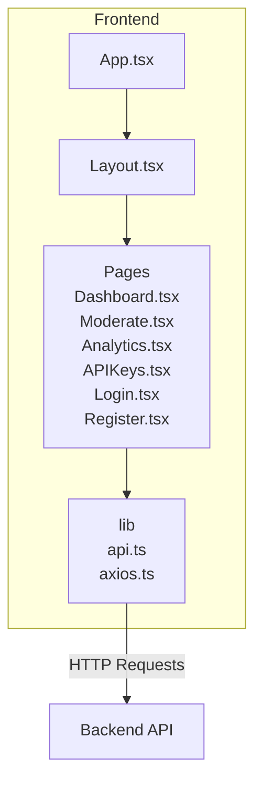
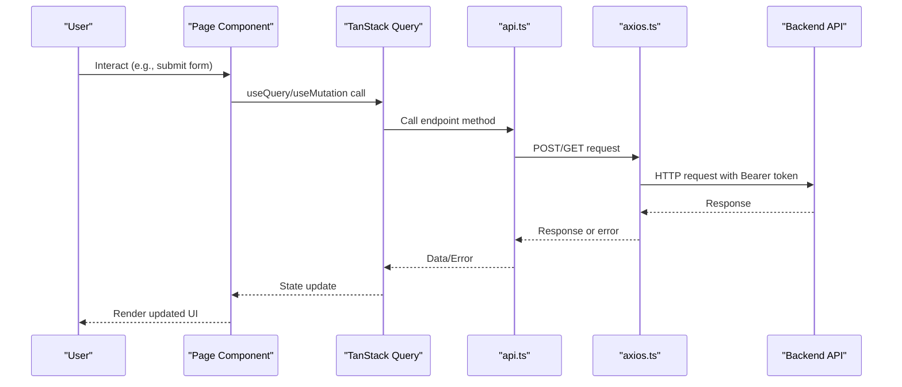
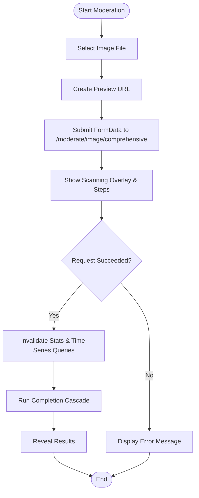
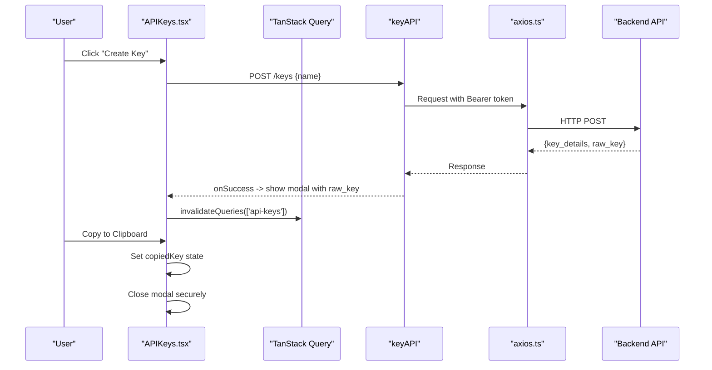
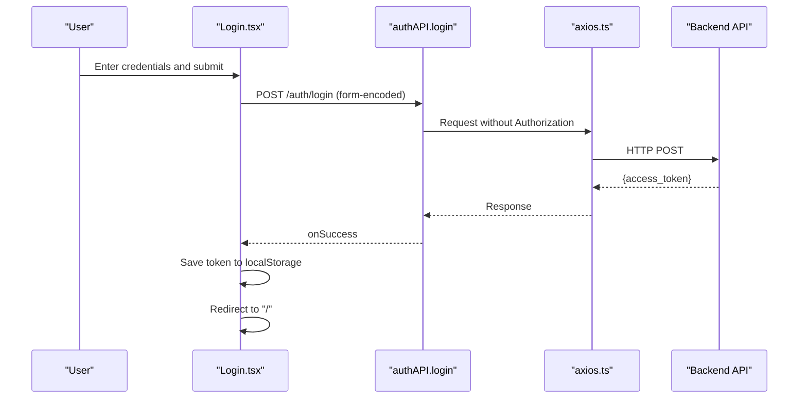
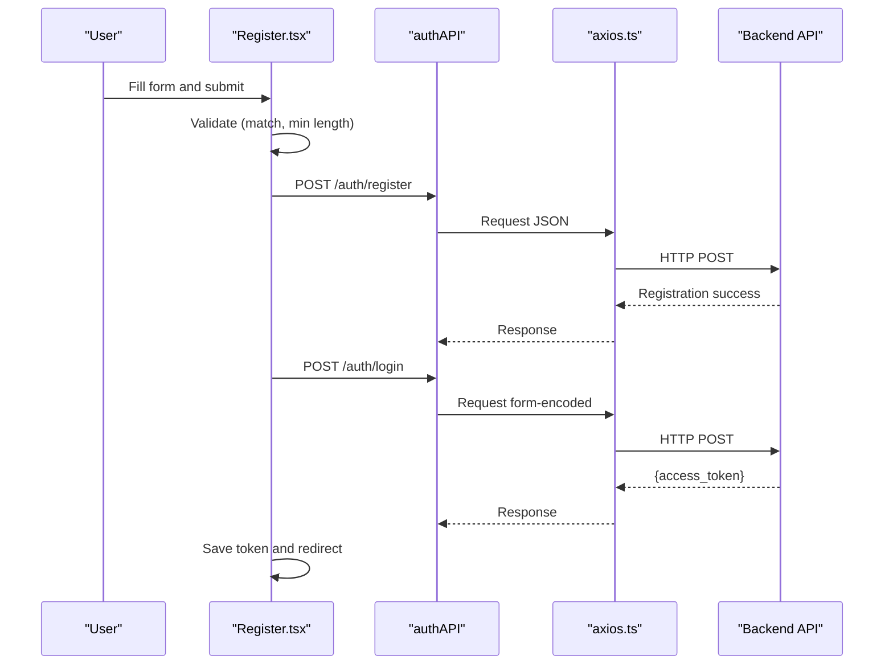
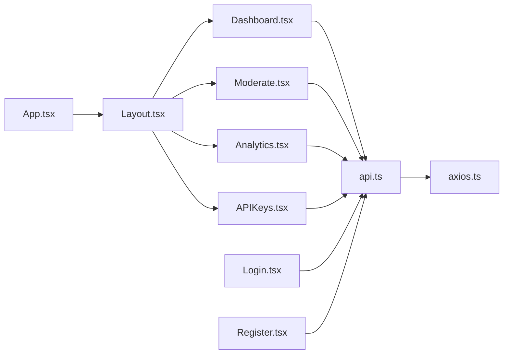

# Page Components

<cite>
**Referenced Files in This Document**
- [Dashboard.tsx](file://frontend/src/pages/Dashboard.tsx)
- [Moderate.tsx](file://frontend/src/pages/Moderate.tsx)
- [Analytics.tsx](file://frontend/src/pages/Analytics.tsx)
- [APIKeys.tsx](file://frontend/src/pages/APIKeys.tsx)
- [Login.tsx](file://frontend/src/pages/Login.tsx)
- [Register.tsx](file://frontend/src/pages/Register.tsx)
- [api.ts](file://frontend/src/lib/api.ts)
- [axios.ts](file://frontend/src/lib/axios.ts)
- [Layout.tsx](file://frontend/src/components/Layout.tsx)
- [App.tsx](file://frontend/src/App.tsx)
</cite>

## Table of Contents
1. [Introduction](#introduction)
2. [Project Structure](#project-structure)
3. [Core Components](#core-components)
4. [Architecture Overview](#architecture-overview)
5. [Detailed Component Analysis](#detailed-component-analysis)
6. [Dependency Analysis](#dependency-analysis)
7. [Performance Considerations](#performance-considerations)
8. [Troubleshooting Guide](#troubleshooting-guide)
9. [Conclusion](#conclusion)

## Introduction
This document provides detailed documentation for the page components of the OmniShield dashboard application. It covers the Dashboard, Moderate, Analytics, API Keys, Login, and Register pages. For each component, we explain structure, state management, API integrations, user interactions, data flow patterns, form handling, file uploads, error states, responsive design with Tailwind CSS, accessibility considerations, and business logic specifics.

## Project Structure
The frontend is a React + TypeScript application using:
- React Router for navigation
- TanStack Query for data fetching and caching
- Recharts for charts
- Axios for HTTP requests with interceptors
- Tailwind CSS for styling
- Lucide icons for UI elements

**Diagram sources**
- [App.tsx:1-104](file://frontend/src/App.tsx#L1-L104)
- [Layout.tsx:1-120](file://frontend/src/components/Layout.tsx#L1-L120)
- [Dashboard.tsx:1-124](file://frontend/src/pages/Dashboard.tsx#L1-L124)
- [Moderate.tsx:1-596](file://frontend/src/pages/Moderate.tsx#L1-L596)
- [Analytics.tsx:1-304](file://frontend/src/pages/Analytics.tsx#L1-L304)
- [APIKeys.tsx:1-325](file://frontend/src/pages/APIKeys.tsx#L1-L325)
- [Login.tsx:1-132](file://frontend/src/pages/Login.tsx#L1-L132)
- [Register.tsx:1-179](file://frontend/src/pages/Register.tsx#L1-L179)
- [api.ts:1-103](file://frontend/src/lib/api.ts#L1-L103)
- [axios.ts:1-37](file://frontend/src/lib/axios.ts#L1-L37)

**Section sources**
- [App.tsx:1-104](file://frontend/src/App.tsx#L1-L104)
- [Layout.tsx:1-120](file://frontend/src/components/Layout.tsx#L1-L120)
- [api.ts:1-103](file://frontend/src/lib/api.ts#L1-L103)
- [axios.ts:1-37](file://frontend/src/lib/axios.ts#L1-L37)

## Core Components
- Dashboard: Displays overview analytics and statistics via periodic refetching.
- Moderate: Handles image upload, multi-model moderation pipeline visualization, and result presentation.
- Analytics: Visualizes time-series metrics with line and bar charts.
- APIKeys: Manages creation, listing, deletion, and secure one-time display of API keys.
- Login: Authenticates users and persists tokens.
- Register: Creates accounts and auto-logs in after successful registration.

Key cross-cutting concerns:
- Authentication token injection via Axios interceptor.
- Centralized API client methods in api.ts.
- Responsive layouts using Tailwind grid/flex utilities.
- Error handling and user feedback across all pages.

**Section sources**
- [Dashboard.tsx:1-124](file://frontend/src/pages/Dashboard.tsx#L1-L124)
- [Moderate.tsx:1-596](file://frontend/src/pages/Moderate.tsx#L1-L596)
- [Analytics.tsx:1-304](file://frontend/src/pages/Analytics.tsx#L1-L304)
- [APIKeys.tsx:1-325](file://frontend/src/pages/APIKeys.tsx#L1-L325)
- [Login.tsx:1-132](file://frontend/src/pages/Login.tsx#L1-L132)
- [Register.tsx:1-179](file://frontend/src/pages/Register.tsx#L1-L179)
- [api.ts:1-103](file://frontend/src/lib/api.ts#L1-L103)
- [axios.ts:1-37](file://frontend/src/lib/axios.ts#L1-L37)

## Architecture Overview
The application uses a layered approach:
- UI Layer: React components (pages) manage local state and render views.
- Data Layer: TanStack Query handles caching, background refetching, and invalidation.
- HTTP Layer: Axios client with request/response interceptors manages auth headers and redirects on 401.
- API Abstraction: api.ts exposes typed endpoints for auth, moderation, keys, and analytics.

**Diagram sources**
- [api.ts:1-103](file://frontend/src/lib/api.ts#L1-L103)
- [axios.ts:1-37](file://frontend/src/lib/axios.ts#L1-L37)
- [Dashboard.tsx:1-124](file://frontend/src/pages/Dashboard.tsx#L1-L124)
- [Moderate.tsx:1-596](file://frontend/src/pages/Moderate.tsx#L1-L596)
- [Analytics.tsx:1-304](file://frontend/src/pages/Analytics.tsx#L1-L304)
- [APIKeys.tsx:1-325](file://frontend/src/pages/APIKeys.tsx#L1-L325)

## Detailed Component Analysis

### Dashboard Component
Purpose:
- Show high-level stats: total requests, safe content, unsafe content, active API keys.
- Provide quick-start guidance to other features.

State Management:
- Uses TanStack Query to fetch stats with automatic refetch interval.
- Loading state renders a simple message while data loads.

API Integration:
- Calls analytics stats endpoint through api.ts.

User Interactions:
- Read-only view; no direct user actions.

Data Flow:
- On mount, query fetches stats; every 30 seconds it refetches automatically.

Responsive Design:
- Grid layout adapts from single column to multiple columns based on screen size.

Accessibility:
- Semantic headings and descriptive text improve readability.

Error Handling:
- No explicit error UI; consider adding an error boundary or fallback UI for robustness.

Business Logic:
- Displays formatted numbers and static guidance steps.

Tailwind Highlights:
- Grids, spacing, typography, color contrast for light/dark sections.

**Section sources**
- [Dashboard.tsx:1-124](file://frontend/src/pages/Dashboard.tsx#L1-L124)
- [api.ts:86-95](file://frontend/src/lib/api.ts#L86-L95)

### Moderate Component
Purpose:
- Upload images and run comprehensive moderation analysis.
- Present multi-model detection results with confidence, risk levels, labels, and model info.

State Management:
- Local state for selected file, preview URL, loading, scanning step progress, pipeline completion, errors, and final result.
- Refs manage timers for cascading scan steps.

File Upload Handling:
- Hidden input accepts image files; creates object URL for preview.
- FormData sent with multipart/form-data header.

API Integration:
- Submits to comprehensive moderation endpoint via api.ts.
- Invalidates relevant queries (stats, timeSeries) after submission to keep dashboards fresh.

Scanning Pipeline Visualization:
- Animated overlay with scanning laser and corner brackets.
- Step-by-step checklist with live progress indicators and percentage complete.

Result Presentation:
- Decision card shows safe/unsafe status, processing time, cached flag, risk level, confidence, recommended action, and optional reason.
- Multi-model categories displayed with confidence bars, risk badges, detected labels, face count, extracted text, profanity warning, and model name.

User Interactions:
- Change image button resets state.
- Analyze Image button triggers submission.

Error Handling:
- Displays server-provided detail messages when available.

Responsive Design:
- Two-column layout on large screens; stacks on smaller screens.

Accessibility:
- Descriptive alt text for previews; clear status labels for scanning steps.

Business Logic:
- Cascading step animation ensures UX continuity during long-running operations.
- Auto-invalidation of related queries post-submission.

Tailwind Highlights:
- Backdrop blur, gradients, animations, borders, and dynamic color classes for status.

**Diagram sources**
- [Moderate.tsx:141-174](file://frontend/src/pages/Moderate.tsx#L141-L174)
- [Moderate.tsx:87-127](file://frontend/src/pages/Moderate.tsx#L87-L127)
- [api.ts:31-44](file://frontend/src/lib/api.ts#L31-L44)

**Section sources**
- [Moderate.tsx:1-596](file://frontend/src/pages/Moderate.tsx#L1-L596)
- [api.ts:31-44](file://frontend/src/lib/api.ts#L31-L44)

### Analytics Component
Purpose:
- Visualize moderation metrics over time with line and bar charts.
- Display summary cards including total requests, safe/unsafe counts, and detection rate.

State Management:
- TanStack Query for time series and stats with refetch intervals.
- Processes raw data into chart-friendly format.

API Integration:
- Fetches time series (last 7 days) and current stats via api.ts.

Charts:
- Line chart for total/safe/unsafe trends.
- Bar chart for classification breakdown.

User Interactions:
- Read-only; updates automatically.

Error Handling:
- Shows error banner if either query fails.

Empty State:
- Friendly messaging when no traffic data is available yet.

Responsive Design:
- Charts adapt to container width; grid-based stat cards adjust per breakpoint.

Accessibility:
- Chart legends and tooltips provide context; semantic headings guide screen readers.

Business Logic:
- Computes detection rate from stats.
- Formats dates for X-axis labels.

Tailwind Highlights:
- Dark-themed containers, consistent spacing, and readable typography.

**Section sources**
- [Analytics.tsx:1-304](file://frontend/src/pages/Analytics.tsx#L1-L304)
- [api.ts:86-95](file://frontend/src/lib/api.ts#L86-L95)

### APIKeys Component
Purpose:
- Create, list, and revoke API keys.
- Securely show newly created key once and allow copying to clipboard.

State Management:
- Local state for new key name, create form visibility, copied key indicator, modal visibility, and temporary plaintext key.
- TanStack Query for listing keys; mutations for create/delete.

API Integration:
- List keys, create key, revoke key via api.ts.

User Interactions:
- Toggle create form.
- Submit new key name.
- Copy to clipboard with visual feedback.
- Confirm before deletion.

Security:
- Plaintext key stored only in memory while modal is open; cleared on close.
- Key list shows masked preview.

Error Handling:
- Relies on global Axios response interceptor for 401 redirects.

Responsive Design:
- Card-based layout with action buttons aligned appropriately.

Accessibility:
- Modal includes aria-label for close button; keyboard focusable controls.

Tailwind Highlights:
- High-contrast modal, clear status badges, and monospace code blocks.

**Diagram sources**
- [APIKeys.tsx:36-60](file://frontend/src/pages/APIKeys.tsx#L36-L60)
- [APIKeys.tsx:62-90](file://frontend/src/pages/APIKeys.tsx#L62-L90)
- [api.ts:72-84](file://frontend/src/lib/api.ts#L72-L84)
- [axios.ts:10-22](file://frontend/src/lib/axios.ts#L10-L22)

**Section sources**
- [APIKeys.tsx:1-325](file://frontend/src/pages/APIKeys.tsx#L1-L325)
- [api.ts:72-84](file://frontend/src/lib/api.ts#L72-L84)

### Login Component
Purpose:
- Authenticate users with email/password and persist access token.

State Management:
- Form fields, password visibility toggle, error message, loading state.

API Integration:
- Sends OAuth2-compatible login request via api.ts.

User Interactions:
- Submit form; redirect to home upon success.

Error Handling:
- Parses backend detail messages (string or array) and displays user-friendly errors.

Authentication Flow:
- Stores token in localStorage and reloads app to apply authentication state.

Responsive Design:
- Centered card layout suitable for mobile and desktop.

Accessibility:
- Labels associated with inputs; eye toggle improves usability.

Tailwind Highlights:
- Clean card design, focus rings, and disabled states.

**Diagram sources**
- [Login.tsx:22-50](file://frontend/src/pages/Login.tsx#L22-L50)
- [api.ts:4-16](file://frontend/src/lib/api.ts#L4-L16)
- [axios.ts:10-22](file://frontend/src/lib/axios.ts#L10-L22)

**Section sources**
- [Login.tsx:1-132](file://frontend/src/pages/Login.tsx#L1-L132)
- [api.ts:4-16](file://frontend/src/lib/api.ts#L4-L16)

### Register Component
Purpose:
- Create a new account and automatically log in the user.

State Management:
- Email, password, confirm password, password visibility toggles, error message, loading state.

Validation Rules:
- Client-side checks: passwords must match; minimum length enforced.

API Integration:
- Registers via api.ts then logs in immediately.

User Interactions:
- Submit form; redirect to home upon success.

Error Handling:
- Parses backend detail messages and displays them.

Authentication Flow:
- Saves token to localStorage and reloads app.

Responsive Design:
- Centered card layout with accessible inputs.

Accessibility:
- Helper text for password length; eye toggles for visibility.

Tailwind Highlights:
- Consistent form styling and clear error banners.

**Diagram sources**
- [Register.tsx:24-72](file://frontend/src/pages/Register.tsx#L24-L72)
- [api.ts:18-23](file://frontend/src/lib/api.ts#L18-L23)
- [api.ts:4-16](file://frontend/src/lib/api.ts#L4-L16)
- [axios.ts:10-22](file://frontend/src/lib/axios.ts#L10-L22)

**Section sources**
- [Register.tsx:1-179](file://frontend/src/pages/Register.tsx#L1-L179)
- [api.ts:18-23](file://frontend/src/lib/api.ts#L18-L23)

## Dependency Analysis
Components depend on shared libraries and services:
- All pages import api.ts for endpoint calls.
- axios.ts configures base URL and interceptors for auth and error handling.
- Layout.tsx wraps authenticated routes and provides navigation.
- App.tsx defines route guards and mounts Layout around protected pages.

**Diagram sources**
- [Dashboard.tsx:1-124](file://frontend/src/pages/Dashboard.tsx#L1-L124)
- [Moderate.tsx:1-596](file://frontend/src/pages/Moderate.tsx#L1-L596)
- [Analytics.tsx:1-304](file://frontend/src/pages/Analytics.tsx#L1-L304)
- [APIKeys.tsx:1-325](file://frontend/src/pages/APIKeys.tsx#L1-L325)
- [Login.tsx:1-132](file://frontend/src/pages/Login.tsx#L1-L132)
- [Register.tsx:1-179](file://frontend/src/pages/Register.tsx#L1-L179)
- [api.ts:1-103](file://frontend/src/lib/api.ts#L1-L103)
- [axios.ts:1-37](file://frontend/src/lib/axios.ts#L1-L37)
- [Layout.tsx:1-120](file://frontend/src/components/Layout.tsx#L1-L120)
- [App.tsx:1-104](file://frontend/src/App.tsx#L1-L104)

**Section sources**
- [api.ts:1-103](file://frontend/src/lib/api.ts#L1-L103)
- [axios.ts:1-37](file://frontend/src/lib/axios.ts#L1-L37)
- [Layout.tsx:1-120](file://frontend/src/components/Layout.tsx#L1-L120)
- [App.tsx:1-104](file://frontend/src/App.tsx#L1-L104)

## Performance Considerations
- Use TanStack Query’s refetchInterval judiciously; avoid excessive polling on heavy endpoints.
- Prefer invalidation strategies (as used in Moderate) to refresh dependent queries instead of polling everywhere.
- Debounce or throttle user-triggered actions where appropriate (e.g., search).
- Ensure images are optimized before upload to reduce payload sizes.
- Consider pagination for logs and analytics lists if datasets grow large.

[No sources needed since this section provides general guidance]

## Troubleshooting Guide
Common issues and resolutions:
- 401 Unauthorized: The Axios response interceptor clears the token and redirects to login. Verify token presence and expiration handling.
- CORS Errors: Ensure VITE_API_URL points to the correct backend origin and that the backend allows the frontend origin.
- Multipart Upload Failures: Confirm Content-Type is set to multipart/form-data and that the file field name matches the backend expectation.
- Empty Analytics Data: Check backend availability and ensure moderation requests have been processed to populate time series data.
- API Key Security: Ensure the plaintext key is never persisted beyond the modal lifecycle; verify cleanup on close.

Operational tips:
- Use browser dev tools Network tab to inspect payloads and responses.
- Add console logging selectively for debugging; remove verbose logs in production.
- Implement error boundaries for graceful degradation.

**Section sources**
- [axios.ts:24-34](file://frontend/src/lib/axios.ts#L24-L34)
- [Moderate.tsx:167-173](file://frontend/src/pages/Moderate.tsx#L167-L173)
- [Analytics.tsx:67-73](file://frontend/src/pages/Analytics.tsx#L67-L73)
- [APIKeys.tsx:75-90](file://frontend/src/pages/APIKeys.tsx#L75-L90)

## Conclusion
The OmniShield dashboard implements a clean separation between UI, data fetching, and HTTP layers. Each page component focuses on its domain responsibilities, leveraging TanStack Query for efficient data management and Tailwind CSS for responsive, accessible interfaces. The Moderate page showcases advanced UX patterns like animated scanning pipelines and rich result visualization. Robust error handling and security practices (token interception, one-time key display) enhance reliability and safety.

[No sources needed since this section summarizes without analyzing specific files]