# React Component Architecture

<cite>
**Referenced Files in This Document**
- [main.tsx](file://frontend/src/main.tsx)
- [App.tsx](file://frontend/src/App.tsx)
- [Layout.tsx](file://frontend/src/components/Layout.tsx)
- [axios.ts](file://frontend/src/lib/axios.ts)
- [api.ts](file://frontend/src/lib/api.ts)
- [Dashboard.tsx](file://frontend/src/pages/Dashboard.tsx)
- [Moderate.tsx](file://frontend/src/pages/Moderate.tsx)
- [Login.tsx](file://frontend/src/pages/Login.tsx)
- [APIKeys.tsx](file://frontend/src/pages/APIKeys.tsx)
- [package.json](file://frontend/package.json)
</cite>

## Table of Contents
1. [Introduction](#introduction)
2. [Project Structure](#project-structure)
3. [Core Components](#core-components)
4. [Architecture Overview](#architecture-overview)
5. [Detailed Component Analysis](#detailed-component-analysis)
6. [Dependency Analysis](#dependency-analysis)
7. [Performance Considerations](#performance-considerations)
8. [Troubleshooting Guide](#troubleshooting-guide)
9. [Conclusion](#conclusion)
10. [Appendices](#appendices)

## Introduction
This document explains the modern React 19 application structure with a focus on component hierarchy, routing setup using react-router-dom, state management patterns with useState and useEffect hooks, and the Layout component as the main wrapper providing consistent UI structure and authentication context. It also documents Axios client configuration for API communication including interceptors, error handling, and request/response transformations. Usage examples demonstrate component composition patterns, prop drilling versus context usage, and event handling strategies. Finally, it provides guidelines for creating reusable components following the project’s architectural patterns and addresses performance considerations such as memoization, lazy loading, and efficient re-rendering techniques.

Note: The repository uses React 18 tooling (React 18.3.x). The patterns described here are compatible with React 19 and follow current best practices.

## Project Structure
The frontend is organized by feature and layer:
- Entry point and providers: main.tsx
- App shell and routes: App.tsx
- Shared layout wrapper: components/Layout.tsx
- API layer: lib/axios.ts and lib/api.ts
- Feature pages: pages/*.tsx

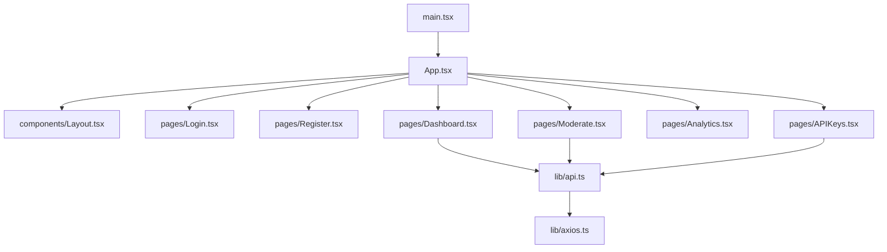

**Diagram sources**
- [main.tsx:1-27](file://frontend/src/main.tsx#L1-L27)
- [App.tsx:1-104](file://frontend/src/App.tsx#L1-L104)
- [Layout.tsx:1-120](file://frontend/src/components/Layout.tsx#L1-L120)
- [axios.ts:1-37](file://frontend/src/lib/axios.ts#L1-L37)
- [api.ts:1-103](file://frontend/src/lib/api.ts#L1-L103)
- [Dashboard.tsx:1-124](file://frontend/src/pages/Dashboard.tsx#L1-L124)
- [Moderate.tsx:1-596](file://frontend/src/pages/Moderate.tsx#L1-L596)
- [Login.tsx:1-132](file://frontend/src/pages/Login.tsx#L1-L132)
- [APIKeys.tsx:1-325](file://frontend/src/pages/APIKeys.tsx#L1-L325)

**Section sources**
- [main.tsx:1-27](file://frontend/src/main.tsx#L1-L27)
- [App.tsx:1-104](file://frontend/src/App.tsx#L1-L104)
- [Layout.tsx:1-120](file://frontend/src/components/Layout.tsx#L1-L120)
- [axios.ts:1-37](file://frontend/src/lib/axios.ts#L1-L37)
- [api.ts:1-103](file://frontend/src/lib/api.ts#L1-L103)
- [Dashboard.tsx:1-124](file://frontend/src/pages/Dashboard.tsx#L1-L124)
- [Moderate.tsx:1-596](file://frontend/src/pages/Moderate.tsx#L1-L596)
- [Login.tsx:1-132](file://frontend/src/pages/Login.tsx#L1-L132)
- [APIKeys.tsx:1-325](file://frontend/src/pages/APIKeys.tsx#L1-L325)
- [package.json:1-38](file://frontend/package.json#L1-L38)

## Core Components
- Application bootstrap and providers:
  - Creates React root, wraps app with StrictMode, QueryClientProvider, and BrowserRouter.
  - Configures default query options (refetchOnWindowFocus, retry, staleTime).
- Routing and auth gating:
  - Defines public routes (/login, /register) and protected routes wrapped in Layout.
  - Uses local token to gate access; redirects unauthenticated users to login.
- Layout wrapper:
  - Provides header navigation, active link highlighting, logout handler, and footer.
  - Receives setIsAuthenticated via props to update auth state from child pages.
- API client:
  - Centralized axios instance with baseURL and environment-based base URL.
  - Request interceptor attaches Authorization Bearer token when present.
  - Response interceptor handles 401 by clearing token and redirecting to login.
- API service layer:
  - Organizes endpoints by domain (auth, moderation, keys, analytics).
  - Handles content-type per endpoint (form-urlencoded, JSON, multipart/form-data).
- Pages:
  - Dashboard: reads stats via react-query with periodic refetch.
  - Moderate: complex file upload flow with scanning animation and multi-model results.
  - Login: form submission, token storage, and redirection.
  - API Keys: create/list/revoke keys with optimistic invalidation and secure one-time key display.

**Section sources**
- [main.tsx:1-27](file://frontend/src/main.tsx#L1-L27)
- [App.tsx:1-104](file://frontend/src/App.tsx#L1-L104)
- [Layout.tsx:1-120](file://frontend/src/components/Layout.tsx#L1-L120)
- [axios.ts:1-37](file://frontend/src/lib/axios.ts#L1-L37)
- [api.ts:1-103](file://frontend/src/lib/api.ts#L1-L103)
- [Dashboard.tsx:1-124](file://frontend/src/pages/Dashboard.tsx#L1-L124)
- [Moderate.tsx:1-596](file://frontend/src/pages/Moderate.tsx#L1-L596)
- [Login.tsx:1-132](file://frontend/src/pages/Login.tsx#L1-L132)
- [APIKeys.tsx:1-325](file://frontend/src/pages/APIKeys.tsx#L1-L325)

## Architecture Overview
High-level architecture shows how data flows from UI to backend through the API layer and how routing controls access.

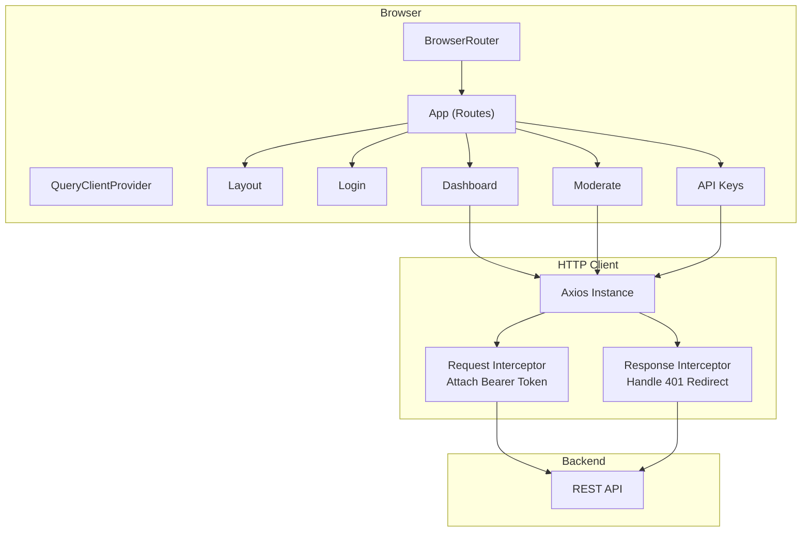

**Diagram sources**
- [main.tsx:1-27](file://frontend/src/main.tsx#L1-L27)
- [App.tsx:1-104](file://frontend/src/App.tsx#L1-L104)
- [Layout.tsx:1-120](file://frontend/src/components/Layout.tsx#L1-L120)
- [axios.ts:1-37](file://frontend/src/lib/axios.ts#L1-L37)
- [api.ts:1-103](file://frontend/src/lib/api.ts#L1-L103)
- [Dashboard.tsx:1-124](file://frontend/src/pages/Dashboard.tsx#L1-L124)
- [Moderate.tsx:1-596](file://frontend/src/pages/Moderate.tsx#L1-L596)
- [APIKeys.tsx:1-325](file://frontend/src/pages/APIKeys.tsx#L1-L325)

## Detailed Component Analysis

### App Shell and Routing
- Public routes: /login, /register.
- Protected routes: /, /moderate, /video-moderate, /analytics, /api-keys.
- Auth gating:
  - Reads token from localStorage on mount.
  - If no token, navigates to /login.
  - Protected routes wrap children inside Layout and pass setIsAuthenticated for logout propagation.

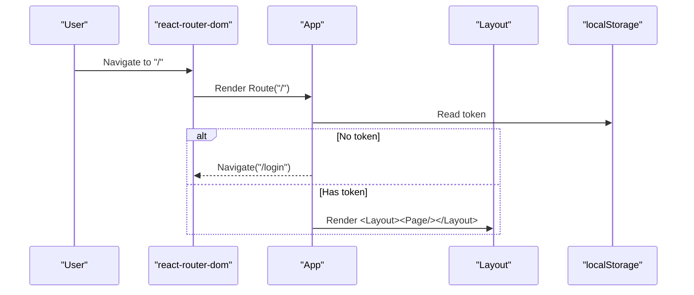

**Diagram sources**
- [App.tsx:1-104](file://frontend/src/App.tsx#L1-L104)

**Section sources**
- [App.tsx:1-104](file://frontend/src/App.tsx#L1-L104)

### Layout Component
Responsibilities:
- Consistent header with navigation links and active state based on current location.
- Logout action that clears token, updates auth state, and navigates to login.
- Footer with branding.
- Accepts children and setIsAuthenticated via props.

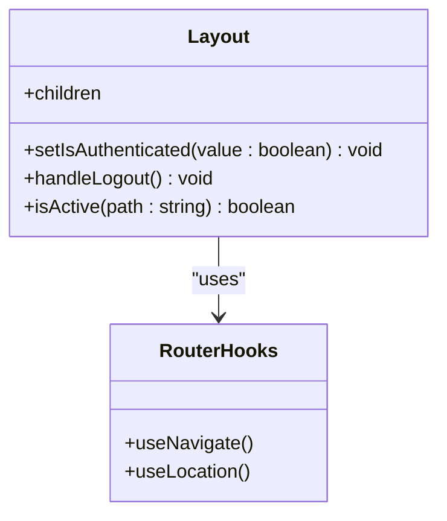

**Diagram sources**
- [Layout.tsx:1-120](file://frontend/src/components/Layout.tsx#L1-L120)

**Section sources**
- [Layout.tsx:1-120](file://frontend/src/components/Layout.tsx#L1-L120)

### Axios Client Configuration
Key behaviors:
- Base URL configured via environment variable or fallback.
- Request interceptor adds Authorization header if token exists.
- Response interceptor handles 401 by removing token and redirecting to login.

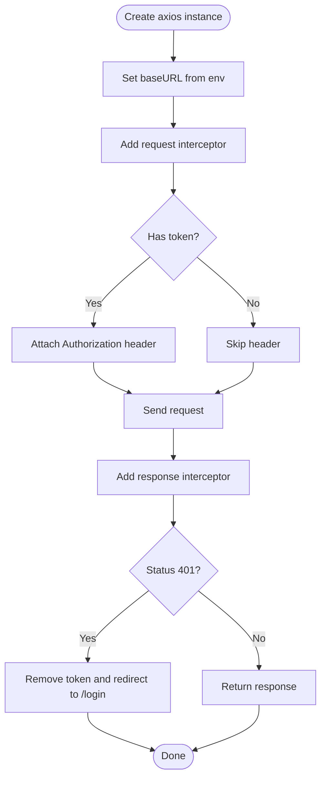

**Diagram sources**
- [axios.ts:1-37](file://frontend/src/lib/axios.ts#L1-L37)

**Section sources**
- [axios.ts:1-37](file://frontend/src/lib/axios.ts#L1-L37)

### API Service Layer
Organized by domain:
- Authentication: login (form-urlencoded), register (JSON), logout, Google OAuth redirect.
- Moderation: image, comprehensive, multi-model, URL-based, video moderation and status polling.
- API Keys: create, list, revoke.
- Analytics: stats, time series, logs.

Usage pattern:
- Each function returns an axios promise typed by the endpoint.
- Content-Type is set per call where needed (multipart/form-data, form-urlencoded, JSON).

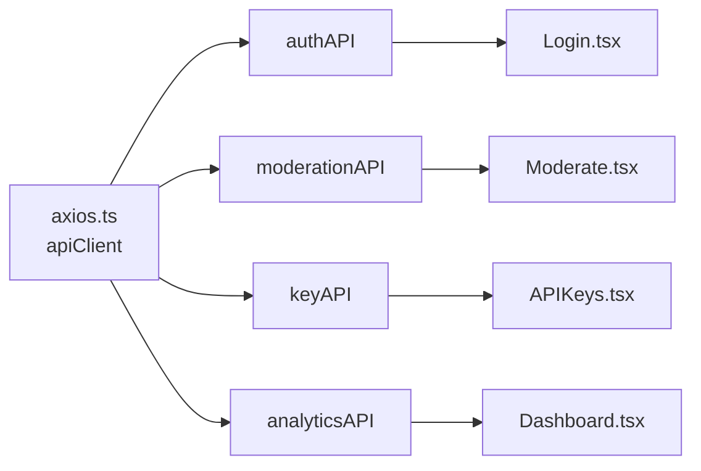

**Diagram sources**
- [api.ts:1-103](file://frontend/src/lib/api.ts#L1-L103)
- [axios.ts:1-37](file://frontend/src/lib/axios.ts#L1-L37)
- [Login.tsx:1-132](file://frontend/src/pages/Login.tsx#L1-L132)
- [Moderate.tsx:1-596](file://frontend/src/pages/Moderate.tsx#L1-L596)
- [APIKeys.tsx:1-325](file://frontend/src/pages/APIKeys.tsx#L1-L325)
- [Dashboard.tsx:1-124](file://frontend/src/pages/Dashboard.tsx#L1-L124)

**Section sources**
- [api.ts:1-103](file://frontend/src/lib/api.ts#L1-L103)

### Page: Login
- State: email, password, showPassword, error, loading.
- Effects: redirect if already authenticated.
- Event handling: form submit calls login API, stores token, reloads page to refresh auth state.
- Error handling: parses backend detail messages into user-friendly strings.

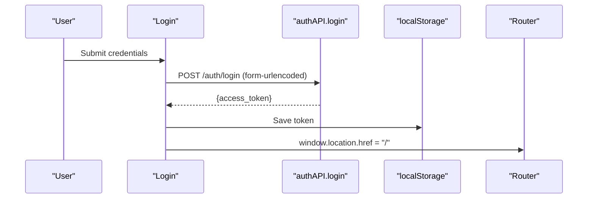

**Diagram sources**
- [Login.tsx:1-132](file://frontend/src/pages/Login.tsx#L1-L132)
- [api.ts:1-103](file://frontend/src/lib/api.ts#L1-L103)

**Section sources**
- [Login.tsx:1-132](file://frontend/src/pages/Login.tsx#L1-L132)

### Page: Dashboard
- Data fetching: uses react-query to fetch stats with auto-refetch interval.
- Rendering: displays summary cards and quick start guidance.

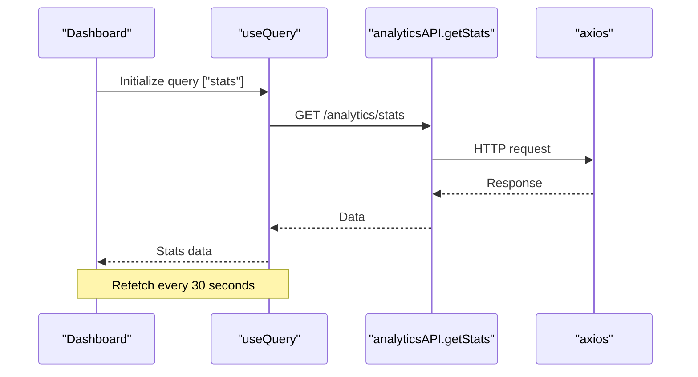

**Diagram sources**
- [Dashboard.tsx:1-124](file://frontend/src/pages/Dashboard.tsx#L1-L124)
- [api.ts:1-103](file://frontend/src/lib/api.ts#L1-L103)

**Section sources**
- [Dashboard.tsx:1-124](file://frontend/src/pages/Dashboard.tsx#L1-L124)

### Page: Moderate
- Complex UX: file selection, preview, animated scanning pipeline, and detailed results.
- State: selectedFile, preview, result, loading, pipelineSuccess, error, scanningStep.
- Effects: manage timers for scanning steps and cleanup on unmount.
- API: submits FormData to comprehensive moderation endpoint; invalidates related queries on success.

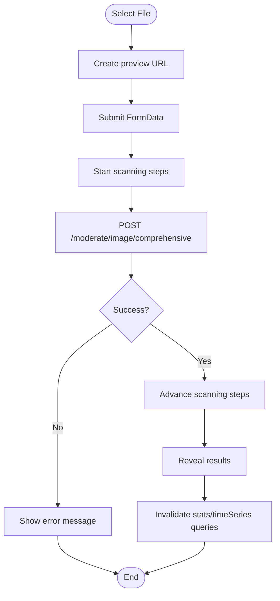

**Diagram sources**
- [Moderate.tsx:1-596](file://frontend/src/pages/Moderate.tsx#L1-L596)
- [api.ts:1-103](file://frontend/src/lib/api.ts#L1-L103)

**Section sources**
- [Moderate.tsx:1-596](file://frontend/src/pages/Moderate.tsx#L1-L596)

### Page: API Keys
- Features: create key with one-time modal, copy to clipboard, list keys with masked previews, delete keys.
- State: newKeyName, showCreateForm, copiedKey, newlyCreatedKey, showKeyModal.
- Data: useQuery for listing keys; useMutation for create/delete with query invalidation.

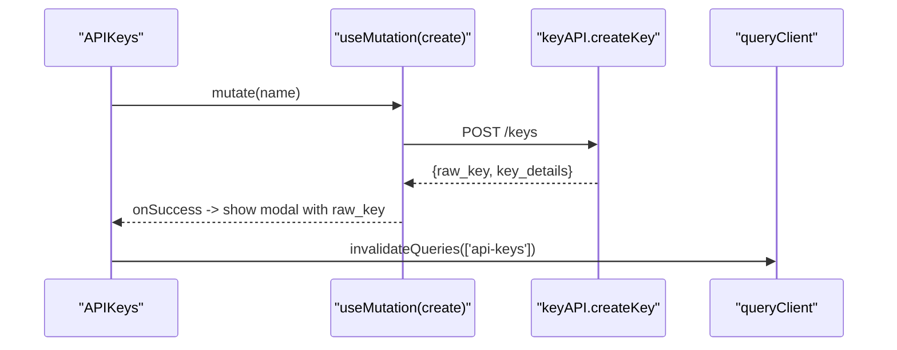

**Diagram sources**
- [APIKeys.tsx:1-325](file://frontend/src/pages/APIKeys.tsx#L1-L325)
- [api.ts:1-103](file://frontend/src/lib/api.ts#L1-L103)

**Section sources**
- [APIKeys.tsx:1-325](file://frontend/src/pages/APIKeys.tsx#L1-L325)

## Dependency Analysis
External dependencies relevant to architecture:
- React and ReactDOM for rendering.
- react-router-dom for routing.
- axios for HTTP requests.
- @tanstack/react-query for server state caching and mutations.
- lucide-react for icons.
- Tailwind CSS for styling.

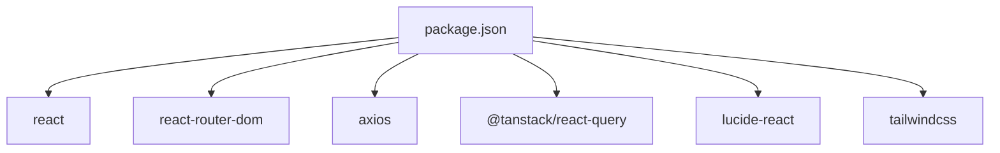

**Diagram sources**
- [package.json:1-38](file://frontend/package.json#L1-L38)

**Section sources**
- [package.json:1-38](file://frontend/package.json#L1-L38)

## Performance Considerations
- Memoization:
  - Use useMemo for expensive computations derived from props/state (e.g., computed lists or formatted values).
  - Use useCallback for stable function references passed to child components to avoid unnecessary re-renders.
- Efficient re-rendering:
  - Keep state co-located near where it is used.
  - Avoid passing large objects as props; prefer selectors or split state.
  - Leverage react-query’s caching and refetch policies to minimize network calls and redundant renders.
- Lazy loading:
  - Consider React.lazy and Suspense for route-level code splitting to reduce initial bundle size.
  - Dynamically import heavy components (e.g., charts) only when needed.
- Query optimization:
  - Tune staleTime and refetchInterval per query to balance freshness and performance.
  - Use query invalidation strategically after mutations to keep UI in sync without full refetches.
- Image and media handling:
  - For previews, ensure object URLs are revoked when no longer needed to free memory.
  - Defer non-critical animations until after first paint if necessary.

[No sources needed since this section provides general guidance]

## Troubleshooting Guide
Common issues and resolutions:
- 401 Unauthorized:
  - The response interceptor removes the token and redirects to login. Ensure tokens are stored correctly and not expired prematurely.
- CORS errors:
  - Verify VITE_API_URL points to the correct backend origin and that the backend allows required headers and methods.
- Form submissions failing:
  - Ensure Content-Type matches backend expectations (form-urlencoded for OAuth2 login, multipart/form-data for uploads).
- Stale data:
  - After mutations, invalidate relevant queries to refresh cached data.
- Memory leaks:
  - Clean up timers and object URLs in useEffect cleanup functions.

**Section sources**
- [axios.ts:1-37](file://frontend/src/lib/axios.ts#L1-L37)
- [Moderate.tsx:1-596](file://frontend/src/pages/Moderate.tsx#L1-L596)
- [api.ts:1-103](file://frontend/src/lib/api.ts#L1-L103)

## Conclusion
The application follows a clear separation of concerns: routing and auth gating at the app level, shared layout for consistent UI, a centralized API client with interceptors, and a domain-specific API service layer. Pages leverage useState/useEffect for local state and react-query for server state. The design supports scalable growth by encouraging reusable patterns, proper error handling, and performance-conscious choices.

[No sources needed since this section summarizes without analyzing specific files]

## Appendices

### Usage Examples and Patterns

- Component composition:
  - Wrap protected pages with Layout to share header/footer and navigation.
  - Example path reference: [App.tsx:35-98](file://frontend/src/App.tsx#L35-L98)

- Prop drilling vs Context:
  - Current approach passes setIsAuthenticated down via props to Layout. As features grow, consider a small AuthContext to avoid deep prop drilling.
  - Example path reference: [Layout.tsx:5-18](file://frontend/src/components/Layout.tsx#L5-L18)

- Event handling strategies:
  - Forms: preventDefault, validate inputs, call API services, handle success/error states.
  - Example path references:
    - [Login.tsx:22-50](file://frontend/src/pages/Login.tsx#L22-L50)
    - [Moderate.tsx:141-174](file://frontend/src/pages/Moderate.tsx#L141-L174)

- Creating reusable components:
  - Follow single responsibility: UI-only components should be pure and accept props.
  - Extract common UI elements (cards, modals, buttons) into dedicated components under components/.
  - Use TypeScript interfaces for props to enforce contracts.
  - Example path references:
    - [Layout.tsx:1-120](file://frontend/src/components/Layout.tsx#L1-L120)
    - [Dashboard.tsx:23-52](file://frontend/src/pages/Dashboard.tsx#L23-L52)

- API communication patterns:
  - Use api.ts functions for all HTTP calls; never call axios directly from components.
  - Example path references:
    - [api.ts:1-103](file://frontend/src/lib/api.ts#L1-L103)
    - [axios.ts:1-37](file://frontend/src/lib/axios.ts#L1-L37)

- Routing setup:
  - Define public and protected routes in App.tsx; wrap protected routes with Layout and auth checks.
  - Example path reference: [App.tsx:1-104](file://frontend/src/App.tsx#L1-L104)

- State management with hooks:
  - Local state via useState for UI interactions.
  - Side effects via useEffect for initialization and cleanup.
  - Server state via react-query for caching and background updates.
  - Example path references:
    - [Dashboard.tsx:6-13](file://frontend/src/pages/Dashboard.tsx#L6-L13)
    - [Moderate.tsx:71-75](file://frontend/src/pages/Moderate.tsx#L71-L75)
    - [APIKeys.tsx:28-60](file://frontend/src/pages/APIKeys.tsx#L28-L60)