# UI Design System & Styling

<cite>
**Referenced Files in This Document**
- [tailwind.config.js](file://frontend/tailwind.config.js)
- [index.css](file://frontend/src/index.css)
- [postcss.config.js](file://frontend/postcss.config.js)
- [package.json](file://frontend/package.json)
- [App.tsx](file://frontend/src/App.tsx)
- [main.tsx](file://frontend/src/main.tsx)
- [Layout.tsx](file://frontend/src/components/Layout.tsx)
- [Login.tsx](file://frontend/src/pages/Login.tsx)
- [Register.tsx](file://frontend/src/pages/Register.tsx)
- [Dashboard.tsx](file://frontend/src/pages/Dashboard.tsx)
- [Moderate.tsx](file://frontend/src/pages/Moderate.tsx)
- [Analytics.tsx](file://frontend/src/pages/Analytics.tsx)
- [APIKeys.tsx](file://frontend/src/pages/APIKeys.tsx)
</cite>

## Table of Contents
1. [Introduction](#introduction)
2. [Project Structure](#project-structure)
3. [Core Components](#core-components)
4. [Architecture Overview](#architecture-overview)
5. [Detailed Component Analysis](#detailed-component-analysis)
6. [Dependency Analysis](#dependency-analysis)
7. [Performance Considerations](#performance-considerations)
8. [Troubleshooting Guide](#troubleshooting-guide)
9. [Conclusion](#conclusion)
10. [Appendices](#appendices)

## Introduction
This document describes the UI design system and styling approach used across the frontend application. It focuses on how Tailwind CSS is configured, how global styles are structured, and how consistent patterns are applied to components such as forms, cards, modals, and data displays. It also covers responsive behavior, accessibility considerations, loading states, animations, cross-browser compatibility, performance optimization techniques for CSS, and maintenance strategies for the design system.

The project uses a dark-first theme with high-contrast elements, utility-first styling via Tailwind CSS 3 (as indicated by dependencies), and custom CSS layers for base resets, component-level utilities, and keyframe animations. The application’s pages demonstrate consistent spacing, typography scale, color usage, and interaction feedback.

## Project Structure
The UI codebase is organized around React components and pages:
- Global configuration and build tooling: Tailwind config, PostCSS setup, package dependencies
- Global styles: Base layer, utilities, and keyframes
- Application shell: Router, providers, and layout
- Pages: Authentication, moderation, analytics, API keys management

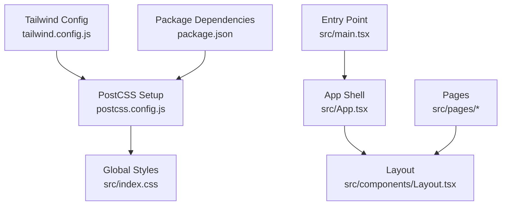

**Diagram sources**
- [tailwind.config.js:1-37](file://frontend/tailwind.config.js#L1-L37)
- [postcss.config.js:1-7](file://frontend/postcss.config.js#L1-L7)
- [index.css:1-87](file://frontend/src/index.css#L1-L87)
- [package.json:1-38](file://frontend/package.json#L1-L38)
- [App.tsx:1-104](file://frontend/src/App.tsx#L1-L104)
- [Layout.tsx:1-120](file://frontend/src/components/Layout.tsx#L1-L120)
- [main.tsx:1-27](file://frontend/src/main.tsx#L1-L27)

**Section sources**
- [tailwind.config.js:1-37](file://frontend/tailwind.config.js#L1-L37)
- [postcss.config.js:1-7](file://frontend/postcss.config.js#L1-L7)
- [index.css:1-87](file://frontend/src/index.css#L1-L87)
- [package.json:1-38](file://frontend/package.json#L1-L38)
- [App.tsx:1-104](file://frontend/src/App.tsx#L1-L104)
- [Layout.tsx:1-120](file://frontend/src/components/Layout.tsx#L1-L120)
- [main.tsx:1-27](file://frontend/src/main.tsx#L1-L27)

## Core Components
This section outlines the foundational building blocks and patterns used throughout the UI.

- Color palette
  - Black and white scales with semantic variants for backgrounds and text
  - Gray scale from light to dark for borders, secondary text, and surfaces
  - Usage examples include header/footer backgrounds, card surfaces, and status indicators

- Typography system
  - Default sans-serif font stack for body text
  - Monospace font stack for code and technical labels
  - Consistent heading sizes and weights across pages

- Spacing conventions
  - Container width and horizontal padding for page content
  - Vertical rhythm using consistent gaps and margins between sections
  - Card paddings and internal spacing for readability

- Component styling patterns
  - Cards: rounded containers with borders and contrasting backgrounds
  - Buttons: primary actions use solid fills; hover and disabled states are explicit
  - Forms: inputs with icons, focus rings, and validation messages
  - Modals: overlay with centered content and clear dismiss actions
  - Data displays: tables/lists with status badges and concise metadata

- Dark mode implementation
  - Global default background and text colors set at the root level
  - High-contrast surfaces for cards and panels
  - Status colors adapted for dark backgrounds

- Responsive design breakpoints
  - Grid layouts adapt from single column to multi-column based on viewport size
  - Navigation collapses into mobile-friendly patterns

- Accessibility compliance measures
  - Semantic HTML structure with headings and lists
  - Focus-visible rings for interactive elements
  - Clear error messaging and confirmation dialogs

- Loading states and user feedback
  - Inline spinners and skeleton-like placeholders during data fetches
  - Progress checklists and animated overlays for long-running operations
  - Success/error banners with contextual colors

- Animation and transition patterns
  - Fade-in transitions for modal entry
  - Scanning line animation for image analysis
  - Pulse effects for active pipeline steps

- Cross-browser compatibility considerations
  - Standard CSS properties and Tailwind utilities ensure broad support
  - Autoprefixer configured to handle vendor prefixes

- Performance optimization techniques for CSS
  - Utility-first approach minimizes custom CSS
  - Scoped animations and minimal keyframes reduce runtime overhead
  - Avoid heavy shadows and excessive gradients where possible

- Maintenance strategies for the design system
  - Centralized Tailwind theme extensions for colors and tokens
  - Reusable class patterns documented per component type
  - Keep global styles minimal and layered

**Section sources**
- [tailwind.config.js:1-37](file://frontend/tailwind.config.js#L1-L37)
- [index.css:1-87](file://frontend/src/index.css#L1-L87)
- [Layout.tsx:1-120](file://frontend/src/components/Layout.tsx#L1-L120)
- [Login.tsx:1-132](file://frontend/src/pages/Login.tsx#L1-L132)
- [Register.tsx:1-179](file://frontend/src/pages/Register.tsx#L1-L179)
- [Dashboard.tsx:1-124](file://frontend/src/pages/Dashboard.tsx#L1-L124)
- [Moderate.tsx:1-596](file://frontend/src/pages/Moderate.tsx#L1-L596)
- [Analytics.tsx:1-304](file://frontend/src/pages/Analytics.tsx#L1-304)
- [APIKeys.tsx:1-325](file://frontend/src/pages/APIKeys.tsx#L1-325)

## Architecture Overview
The UI architecture centers on a React application with routing, a shared layout, and feature-specific pages. Styling is driven by Tailwind CSS with global base and utility layers.

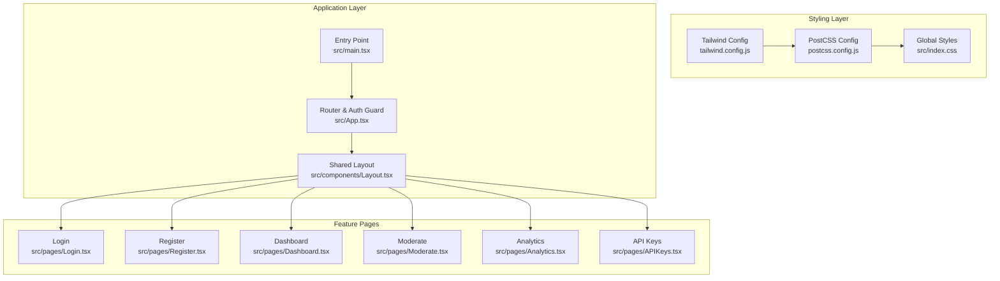

**Diagram sources**
- [tailwind.config.js:1-37](file://frontend/tailwind.config.js#L1-L37)
- [postcss.config.js:1-7](file://frontend/postcss.config.js#L1-L7)
- [index.css:1-87](file://frontend/src/index.css#L1-L87)
- [main.tsx:1-27](file://frontend/src/main.tsx#L1-L27)
- [App.tsx:1-104](file://frontend/src/App.tsx#L1-L104)
- [Layout.tsx:1-120](file://frontend/src/components/Layout.tsx#L1-L120)
- [Login.tsx:1-132](file://frontend/src/pages/Login.tsx#L1-L132)
- [Register.tsx:1-179](file://frontend/src/pages/Register.tsx#L1-L179)
- [Dashboard.tsx:1-124](file://frontend/src/pages/Dashboard.tsx#L1-L124)
- [Moderate.tsx:1-596](file://frontend/src/pages/Moderate.tsx#L1-L596)
- [Analytics.tsx:1-304](file://frontend/src/pages/Analytics.tsx#L1-304)
- [APIKeys.tsx:1-325](file://frontend/src/pages/APIKeys.tsx#L1-325)

## Detailed Component Analysis

### Layout Component
The shared layout provides navigation, branding, and consistent page padding. It applies the dark theme globally and uses responsive classes to show/hide navigation items.

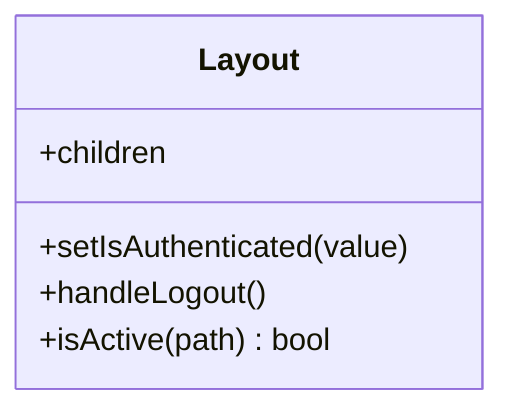

**Diagram sources**
- [Layout.tsx:1-120](file://frontend/src/components/Layout.tsx#L1-L120)

**Section sources**
- [Layout.tsx:1-120](file://frontend/src/components/Layout.tsx#L1-L120)

### Login Page
Implements form-based authentication with password visibility toggle, inline errors, and loading state. Uses consistent input styling and focus rings.

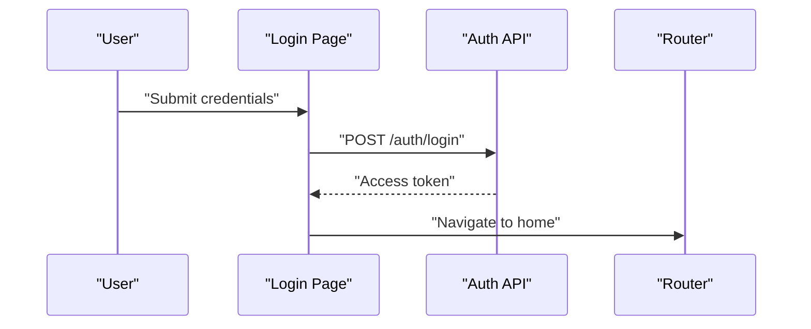

**Diagram sources**
- [Login.tsx:1-132](file://frontend/src/pages/Login.tsx#L1-L132)

**Section sources**
- [Login.tsx:1-132](file://frontend/src/pages/Login.tsx#L1-L132)

### Register Page
Handles account creation with client-side validation, password matching, and auto-login after successful registration.

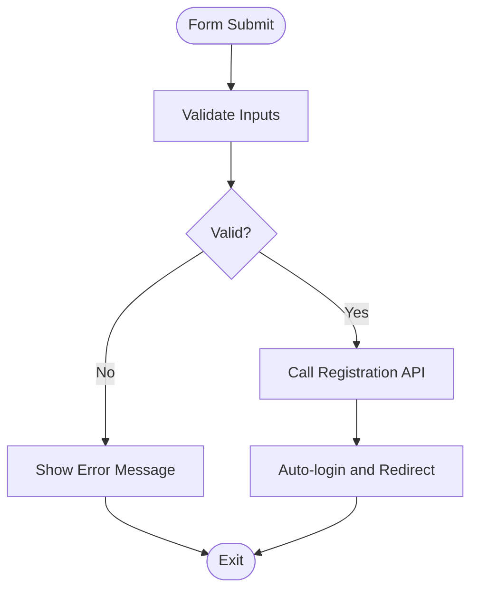

**Diagram sources**
- [Register.tsx:1-179](file://frontend/src/pages/Register.tsx#L1-L179)

**Section sources**
- [Register.tsx:1-179](file://frontend/src/pages/Register.tsx#L1-L179)

### Dashboard Page
Displays summary metrics in cards and quick-start guidance. Uses grid layouts and consistent card styling.

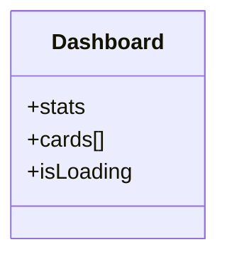

**Diagram sources**
- [Dashboard.tsx:1-124](file://frontend/src/pages/Dashboard.tsx#L1-L124)

**Section sources**
- [Dashboard.tsx:1-124](file://frontend/src/pages/Dashboard.tsx#L1-L124)

### Moderate Page
Provides image upload, scanning overlay, progress checklist, and detailed results display. Demonstrates advanced animations and user feedback mechanisms.

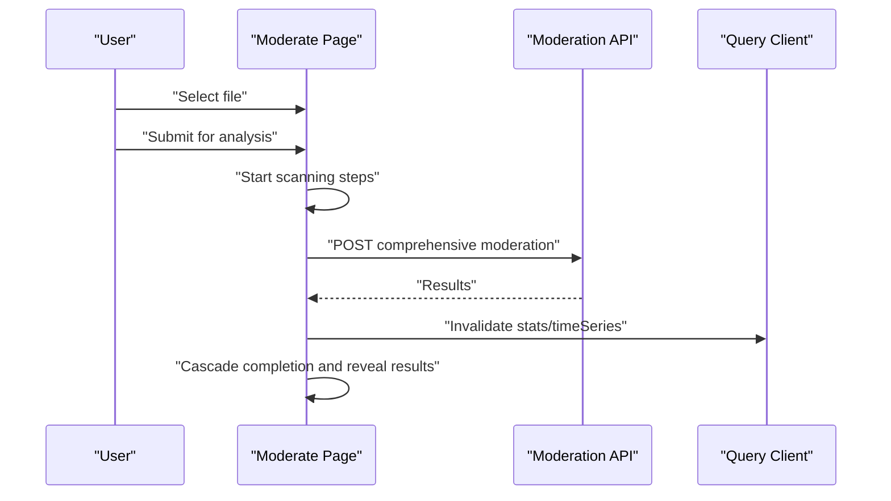

**Diagram sources**
- [Moderate.tsx:1-596](file://frontend/src/pages/Moderate.tsx#L1-L596)

**Section sources**
- [Moderate.tsx:1-596](file://frontend/src/pages/Moderate.tsx#L1-L596)

### Analytics Page
Visualizes time-series data with line and bar charts, includes loading and empty states, and uses consistent chart theming.

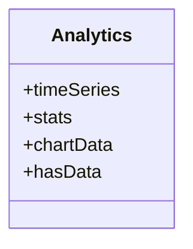

**Diagram sources**
- [Analytics.tsx:1-304](file://frontend/src/pages/Analytics.tsx#L1-304)

**Section sources**
- [Analytics.tsx:1-304](file://frontend/src/pages/Analytics.tsx#L1-304)

### API Keys Page
Manages API keys with create, list, delete, and secure one-time display modal. Includes copy-to-clipboard feedback and masked previews.

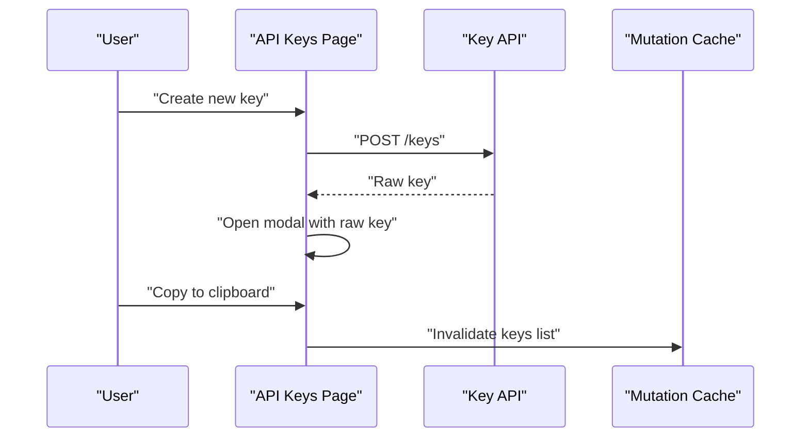

**Diagram sources**
- [APIKeys.tsx:1-325](file://frontend/src/pages/APIKeys.tsx#L1-325)

**Section sources**
- [APIKeys.tsx:1-325](file://frontend/src/pages/APIKeys.tsx#L1-325)

### Conceptual Overview
The following conceptual diagram illustrates common UI patterns implemented consistently across the application:

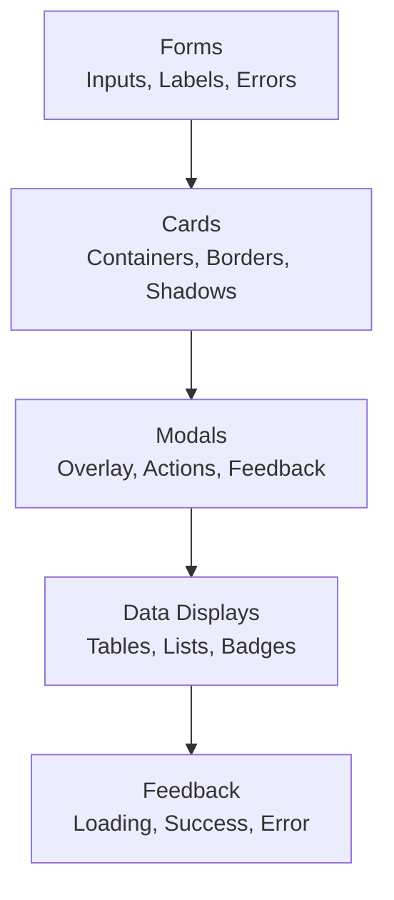

[No sources needed since this diagram shows conceptual workflow, not actual code structure]

## Dependency Analysis
The styling pipeline depends on Tailwind CSS and PostCSS with Autoprefixer. The package manifest confirms these dependencies and their versions.

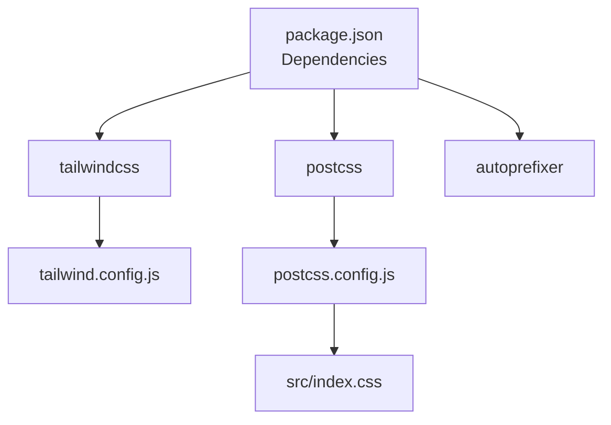

**Diagram sources**
- [package.json:1-38](file://frontend/package.json#L1-L38)
- [tailwind.config.js:1-37](file://frontend/tailwind.config.js#L1-L37)
- [postcss.config.js:1-7](file://frontend/postcss.config.js#L1-L7)
- [index.css:1-87](file://frontend/src/index.css#L1-L87)

**Section sources**
- [package.json:1-38](file://frontend/package.json#L1-L38)
- [tailwind.config.js:1-37](file://frontend/tailwind.config.js#L1-L37)
- [postcss.config.js:1-7](file://frontend/postcss.config.js#L1-L7)

## Performance Considerations
- Prefer utility classes over custom CSS to leverage Tailwind’s purge and tree-shaking
- Limit complex animations; prefer transform and opacity for smooth compositing
- Use responsive grids and avoid heavy nested layouts
- Minimize large shadows and gradients; keep contrast sufficient without excessive visual weight
- Keep global styles scoped and minimal; extend theme tokens rather than duplicating values

## Troubleshooting Guide
Common issues and resolutions:
- Styles not applying
  - Ensure Tailwind directives are included in the global stylesheet
  - Verify PostCSS configuration includes Tailwind and Autoprefixer
  - Confirm content paths in Tailwind config cover all source files
- Build warnings about unused CSS
  - Check that content globs match your file extensions and directories
- Animations not visible
  - Verify keyframes are defined in the global stylesheet and referenced correctly
- Responsive layout issues
  - Inspect breakpoint usage and container widths; adjust grid columns accordingly

**Section sources**
- [index.css:1-87](file://frontend/src/index.css#L1-L87)
- [postcss.config.js:1-7](file://frontend/postcss.config.js#L1-L7)
- [tailwind.config.js:1-37](file://frontend/tailwind.config.js#L1-L37)

## Conclusion
The UI design system emphasizes consistency through a dark-first theme, utility-first styling, and well-defined patterns for forms, cards, modals, and data displays. Tailwind CSS configuration centralizes color tokens, while global styles provide base resets and reusable animations. The pages demonstrate robust loading states, clear user feedback, and responsive layouts. By adhering to these patterns and maintaining centralized tokens, the team can sustain visual consistency and improve maintainability.

## Appendices

### Guidelines for Creating Custom Components
- Follow established patterns:
  - Use consistent spacing, typography, and color tokens
  - Apply rounded containers with borders for cards
  - Provide clear focus states and accessible labels
- Use utility classes effectively:
  - Compose layouts with grid and flex utilities
  - Leverage responsive prefixes for breakpoints
- Maintain visual consistency:
  - Extend Tailwind theme for new tokens instead of hardcoding values
  - Reuse existing button, input, and badge patterns

### Examples of Common UI Patterns
- Forms: See login and register pages for input styling, icon placement, and error handling
- Cards: See dashboard and analytics pages for metric cards and chart containers
- Modals: See API keys page for secure one-time key display and action buttons
- Data Tables: See API keys list for rows with status badges and actions

### Notes on Animation and Transitions
- Fade-in transitions for modal entry
- Scanning line animation for image analysis
- Pulse effects for active pipeline steps

### Cross-Browser Compatibility
- Autoprefixer ensures vendor prefixes for broader browser support
- Stick to standard CSS properties and Tailwind utilities

### Maintenance Strategies
- Centralize tokens in Tailwind config
- Keep global styles minimal and layered
- Document reusable patterns and component recipes