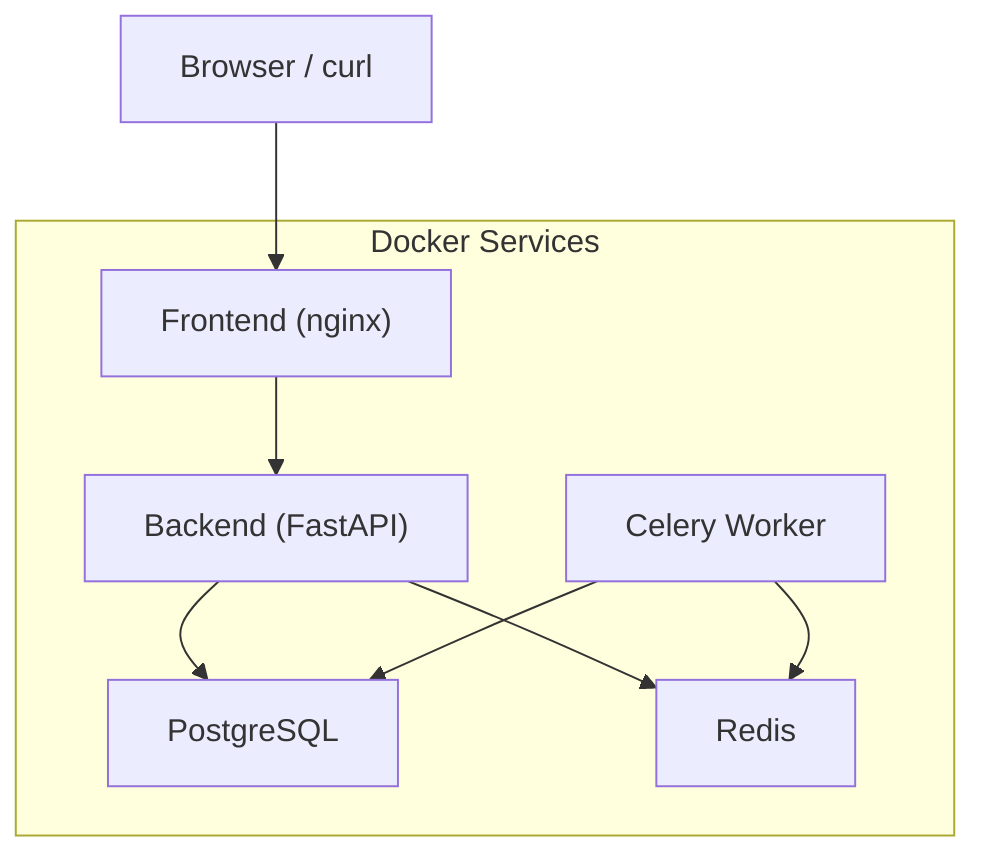
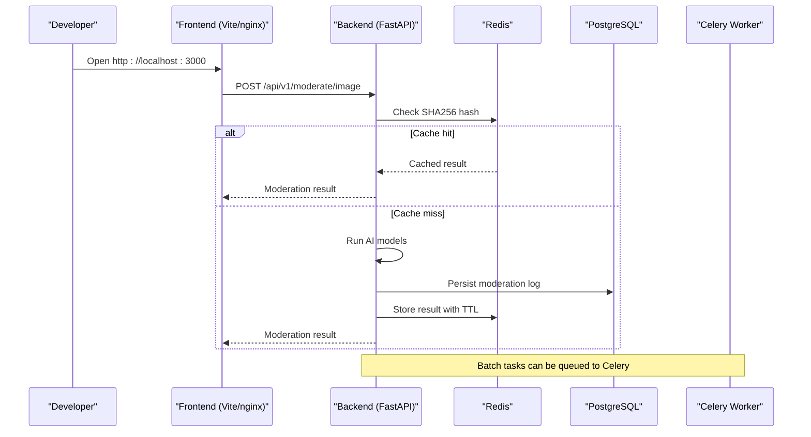
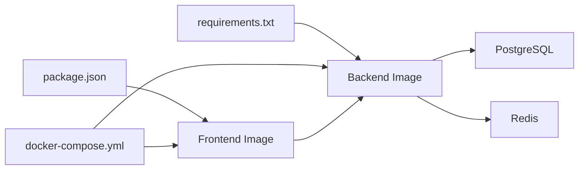

# Getting Started

<cite>
**Referenced Files in This Document**
- [README.md](file://nudenet_project/README.md)
- [QUICK_START.md](file://nudenet_project/QUICK_START.md)
- [docker-compose.yml](file://nudenet_project/docker-compose.yml)
- [backend/Dockerfile](file://nudenet_project/backend/Dockerfile)
- [frontend/Dockerfile](file://nudenet_project/frontend/Dockerfile)
- [backend/app/core/config.py](file://nudenet_project/backend/app/core/config.py)
- [backend/requirements.txt](file://nudenet_project/backend/requirements.txt)
- [frontend/package.json](file://nudenet_project/frontend/package.json)
- [backend/create_tables.py](file://nudenet_project/backend/create_tables.py)
</cite>

## Table of Contents
1. Introduction
2. Project Structure
3. Core Components
4. Architecture Overview
5. Detailed Component Analysis
6. Dependency Analysis
7. Performance Considerations
8. Troubleshooting Guide
9. Conclusion
10. Appendices

## Introduction
OmniShield is an enterprise-grade AI moderation platform that combines multiple specialized models to analyze images and content for safety. It provides a modern web dashboard, a high-performance REST API with OpenAPI documentation, caching, background processing, and production-ready deployment options.

This guide helps you get OmniShield running quickly using Docker (recommended) or local development. You will set up prerequisites, install dependencies, initialize the database, configure environment variables, start services, and make your first API call to moderate an image.

## Project Structure
At a high level:
- Backend: FastAPI application with async I/O, SQLAlchemy ORM, Alembic migrations, Redis cache, Celery workers, and multi-model AI pipelines.
- Frontend: React + Vite UI served via nginx in production; Vite dev server during development.
- Infrastructure: PostgreSQL and Redis are orchestrated via Docker Compose.

**Diagram sources**
- [docker-compose.yml:1-108](file://nudenet_project/docker-compose.yml#L1-L108)

**Section sources**
- [README.md:139-172](file://nudenet_project/README.md#L139-L172)

## Core Components
- Backend runtime: Python 3.12+, FastAPI, Uvicorn, SQLAlchemy async, Alembic, Redis, Celery.
- Frontend runtime: Node.js 20+ (for development), Vite dev server; production build served by nginx.
- Data stores: PostgreSQL for persistence, Redis for caching and task queue.
- AI models: NudeNet ONNX model pre-cached in the backend image; additional models supported by the codebase.

Key configuration is centralized in the settings module, which reads from environment variables and .env files.

**Section sources**
- [backend/app/core/config.py:1-148](file://nudenet_project/backend/app/core/config.py#L1-L148)
- [backend/Dockerfile:1-27](file://nudenet_project/backend/Dockerfile#L1-L27)
- [frontend/Dockerfile:1-36](file://nudenet_project/frontend/Dockerfile#L1-L36)
- [backend/requirements.txt:1-142](file://nudenet_project/backend/requirements.txt#L1-L142)
- [frontend/package.json:1-38](file://nudenet_project/frontend/package.json#L1-L38)

## Architecture Overview
The system exposes a secure API and a user-friendly dashboard. Requests flow through the frontend to the backend, which checks caches, runs AI models, persists logs, and returns results. Background jobs use Celery with Redis as broker.

**Diagram sources**
- [docker-compose.yml:41-99](file://nudenet_project/docker-compose.yml#L41-L99)
- [backend/app/core/config.py:44-52](file://nudenet_project/backend/app/core/config.py#L44-L52)

## Detailed Component Analysis

### Prerequisites
- Docker and Docker Compose installed and running.
- For local development:
  - Python 3.12+
  - Node.js 20+
- System requirements:
  - Sufficient disk space for AI models and datasets.
  - Optional GPU support if enabled in configuration.

**Section sources**
- [README.md:176-182](file://nudenet_project/README.md#L176-L182)

### Option A: Docker Deployment (Recommended)
1. Clone the repository and navigate into the project directory.
2. Create an environment file based on the provided example and adjust values as needed.
3. Build and start all services with Docker Compose.
4. Initialize the database schema.
5. Access the application:
   - Frontend: http://localhost:3000
   - API docs: http://localhost:8000/docs

Notes:
- The compose file defines PostgreSQL, Redis, Backend, Celery worker, and Frontend services.
- The backend Dockerfile installs system libraries required by vision libraries and pre-caches the NudeNet ONNX model at build time.
- The frontend Dockerfile builds a static site and serves it via nginx.

**Section sources**
- [README.md:183-204](file://nudenet_project/README.md#L183-L204)
- [docker-compose.yml:1-108](file://nudenet_project/docker-compose.yml#L1-L108)
- [backend/Dockerfile:1-27](file://nudenet_project/backend/Dockerfile#L1-L27)
- [frontend/Dockerfile:1-36](file://nudenet_project/frontend/Dockerfile#L1-L36)

### Option B: Local Development Setup
Backend
1. Create and activate a Python virtual environment.
2. Install Python dependencies from requirements.
3. Initialize the database tables.
4. Start the FastAPI server with auto-reload.

Frontend
1. Install Node.js dependencies.
2. Start the Vite development server.
3. Access the UI at http://localhost:3000.

Environment Configuration
- Ensure environment variables are set for database, Redis, CORS origins, and other settings.
- The settings module loads from .env and validates critical fields such as JWT secret and environment mode.

Database Initialization
- Use the provided script to create tables without Alembic when needed.

**Section sources**
- [README.md:206-239](file://nudenet_project/README.md#L206-L239)
- [QUICK_START.md:31-86](file://nudenet_project/QUICK_START.md#L31-L86)
- [backend/app/core/config.py:1-148](file://nudenet_project/backend/app/core/config.py#L1-L148)
- [backend/create_tables.py:1-19](file://nudenet_project/backend/create_tables.py#L1-L19)

### Environment Variables
Key variables include:
- Application: ENVIRONMENT, PROJECT_NAME, VERSION, API_V1_STR
- Security: JWT_SECRET, JWT_ALGORITHM, ACCESS_TOKEN_EXPIRE_MINUTES
- Database: DATABASE_URL (SQLite default; PostgreSQL recommended in production)
- Cache & Queue: REDIS_URL, CELERY_BROKER_URL, CELERY_RESULT_BACKEND
- File Uploads: UPLOAD_DIR, ALLOWED_EXTENSIONS, MAX_FILE_SIZE_MB
- AI Features: ENABLE_* flags per model category
- CORS: CORS_ORIGINS (comma-separated list or wildcard)
- Monitoring: ENABLE_PROMETHEUS_METRICS, SENTRY_DSN

Validation and defaults:
- Production environment enforces stronger security rules (e.g., JWT secret must not contain placeholder).
- CORS parsing supports both wildcard and comma-separated lists.

**Section sources**
- [backend/app/core/config.py:13-148](file://nudenet_project/backend/app/core/config.py#L13-L148)

### First API Call Examples
Authentication
- Register a new user.
- Login to obtain a bearer token.
- Include Authorization header with the token in subsequent requests.

Moderate an Image
- Upload an image file to the moderation endpoint using multipart form data.
- The response includes decision, risk level, confidence, detected labels, bounding boxes, processing time, recommended action, reason, and cache status.

Batch Processing
- Submit a batch request with image URLs.
- Receive a task ID and check its status via the tasks endpoint.

Analytics
- Retrieve aggregated stats and history of moderation events.

Rate Limiting
- Observe rate limit headers in responses.

For concrete examples and exact request/response formats, refer to the API section in the README.

**Section sources**
- [README.md:243-434](file://nudenet_project/README.md#L243-L434)

### Development Workflow
Running Servers Locally
- Backend: Start the FastAPI server with reload enabled.
- Frontend: Start the Vite dev server.
- Access:
  - Web interface: http://localhost:3000
  - API docs: http://localhost:8000/docs

Verification Steps
- Confirm ports are listening:
  - Backend: 8000
  - Frontend: 3000
  - PostgreSQL: 5432
  - Redis: 6379
- Test endpoints:
  - Open http://localhost:8000/docs to verify API docs load.
  - Make a simple health or auth call to confirm connectivity.
  - Upload an image to the moderation endpoint and inspect the response.

Troubleshooting Tips
- Port conflicts: Kill processes occupying 8000 or 3000.
- Virtual environment issues: Recreate venv and reinstall dependencies.
- Node modules issues: Remove node_modules and lockfile, then reinstall.
- Database issues: Delete local SQLite database and recreate tables.

**Section sources**
- [QUICK_START.md:73-148](file://nudenet_project/QUICK_START.md#L73-L148)
- [README.md:206-239](file://nudenet_project/README.md#L206-L239)

## Dependency Analysis
Runtime and framework dependencies:
- Backend: FastAPI, Uvicorn, SQLAlchemy async, Alembic, asyncpg, Pydantic v2, Redis, Celery, NudeNet ONNX, OpenCV, Transformers, Ultralytics, PaddleOCR, etc.
- Frontend: React, Vite, TypeScript, Tailwind CSS, Axios, Recharts, TanStack Query.

Containerization:
- Backend image uses python:3.12-slim and installs system libs for vision packages; pre-caches NudeNet model.
- Frontend image builds with node:18-alpine and serves via nginx:alpine.

Orchestration:
- docker-compose.yml defines services, networking, volumes, and health checks.

**Diagram sources**
- [backend/requirements.txt:1-142](file://nudenet_project/backend/requirements.txt#L1-L142)
- [frontend/package.json:1-38](file://nudenet_project/frontend/package.json#L1-L38)
- [docker-compose.yml:1-108](file://nudenet_project/docker-compose.yml#L1-L108)

**Section sources**
- [backend/requirements.txt:1-142](file://nudenet_project/backend/requirements.txt#L1-L142)
- [frontend/package.json:1-38](file://nudenet_project/frontend/package.json#L1-L38)
- [docker-compose.yml:1-108](file://nudenet_project/docker-compose.yml#L1-L108)

## Performance Considerations
- Enable Redis caching to achieve sub-millisecond responses for repeated images.
- Configure appropriate TTLs for image and API response caches.
- Use GPU acceleration if available and enabled in configuration.
- Tune upload limits and batch sizes according to workload.
- Monitor Prometheus metrics and consider scaling workers horizontally.

[No sources needed since this section provides general guidance]

## Troubleshooting Guide
Common Issues and Resolutions
- Port already in use:
  - Identify and terminate processes on ports 8000 or 3000.
- Python virtual environment problems:
  - Recreate venv and reinstall dependencies.
- Node modules corruption:
  - Remove node_modules and package-lock.json, then reinstall.
- Database initialization errors:
  - Delete local SQLite database and recreate tables using the provided script.
- Docker service health:
  - Verify PostgreSQL and Redis health checks pass before starting dependent services.

Verification Checklist
- Frontend accessible at http://localhost:3000.
- API docs accessible at http://localhost:8000/docs.
- Successful registration/login and token-based moderation call.
- Logs show successful model inference and DB writes.

**Section sources**
- [QUICK_START.md:107-148](file://nudenet_project/QUICK_START.md#L107-L148)
- [backend/create_tables.py:1-19](file://nudenet_project/backend/create_tables.py#L1-L19)

## Conclusion
You now have OmniShield running either via Docker or locally. Use the web interface to explore moderation features and the API docs to integrate programmatically. For production, ensure strong secrets, restrict CORS, and monitor performance and usage metrics.

[No sources needed since this section summarizes without analyzing specific files]

## Appendices

### Appendix A: Docker Compose Services Summary
- PostgreSQL: Persistent relational storage.
- Redis: Caching and message broker.
- Backend: FastAPI server exposing REST endpoints and OpenAPI docs.
- Celery Worker: Background job processor.
- Frontend: Static site served by nginx.

**Section sources**
- [docker-compose.yml:1-108](file://nudenet_project/docker-compose.yml#L1-L108)

### Appendix B: Key Configuration Fields
- ENVIRONMENT: development | staging | production
- JWT_SECRET: Strong secret required in production
- DATABASE_URL: sqlite+aiosqlite:///./moderation.db (default); postgresql+asyncpg://... (production)
- REDIS_URL, CELERY_BROKER_URL, CELERY_RESULT_BACKEND: Redis endpoints
- CORS_ORIGINS: "*" or comma-separated list
- ENABLE_* flags: Toggle individual AI capabilities
- UPLOAD_DIR, ALLOWED_EXTENSIONS, MAX_FILE_SIZE_MB: Ingestion controls

**Section sources**
- [backend/app/core/config.py:13-148](file://nudenet_project/backend/app/core/config.py#L13-L148)