# Health Checks & System Monitoring

<cite>
**Referenced Files in This Document**
- [main.py](file://backend/app/main.py)
- [config.py](file://backend/app/core/config.py)
- [database.py](file://backend/app/core/database.py)
- [redis.py](file://backend/app/core/redis.py)
- [celery_app.py](file://backend/app/core/celery_app.py)
- [ai_moderation.py](file://backend/app/services/ai_moderation.py)
- [moderate.py](file://backend/app/api/moderate.py)
- [docker-compose.yml](file://docker-compose.yml)
- [Dockerfile (Backend)](file://backend/Dockerfile)
- [Dockerfile (Frontend)](file://frontend/Dockerfile)
- [DEPLOYMENT.md](file://DEPLOYMENT.md)
- [ARCHITECTURE.md](file://ARCHITECTURE.md)
</cite>

## Table of Contents
1. Introduction
2. Project Structure
3. Core Components
4. Architecture Overview
5. Detailed Component Analysis
6. Dependency Analysis
7. Performance Considerations
8. Troubleshooting Guide
9. Conclusion
10. Appendices

## Introduction
This document describes the health monitoring and system readiness strategy for the OmniShield platform. It covers:
- The /health endpoint implementation and response format
- Kubernetes-style liveness/readiness probes integration
- Custom health checks for AI model availability, disk space, and queue depth
- Integration with Prometheus metrics and Docker health checks
- Example configurations for different environments
- Alerting rules and automated recovery procedures
- Performance considerations, caching strategies, and graceful degradation patterns

## Project Structure
The health-related functionality spans application endpoints, core service integrations, container orchestration, and deployment documentation.

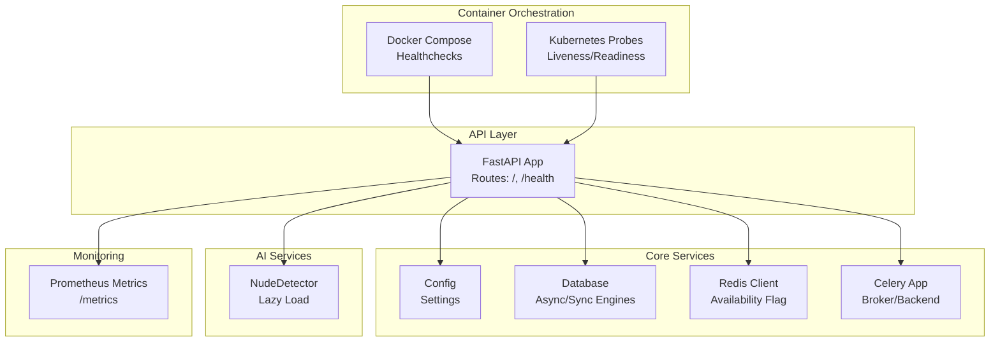

**Diagram sources**
- [main.py:65-107](file://backend/app/main.py#L65-L107)
- [config.py:1-148](file://backend/app/core/config.py#L1-L148)
- [database.py:1-50](file://backend/app/core/database.py#L1-L50)
- [redis.py:1-21](file://backend/app/core/redis.py#L1-L21)
- [celery_app.py:1-21](file://backend/app/core/celery_app.py#L1-L21)
- [ai_moderation.py:1-275](file://backend/app/services/ai_moderation.py#L1-L275)
- [docker-compose.yml:1-108](file://docker-compose.yml#L1-L108)
- [DEPLOYMENT.md:558-581](file://DEPLOYMENT.md#L558-L581)

**Section sources**
- [main.py:65-107](file://backend/app/main.py#L65-L107)
- [docker-compose.yml:1-108](file://docker-compose.yml#L1-L108)
- [DEPLOYMENT.md:558-581](file://DEPLOYMENT.md#L558-L581)

## Core Components
- Application root and health endpoints:
  - Root info endpoint returns API metadata and feature flags.
  - /health returns a structured status object including version, environment, and services.
- Configuration:
  - Centralized settings include database URLs, Redis URL, Celery broker/backend, and Prometheus toggle.
- Database connectivity:
  - Async and sync engines are created with pool pre-ping; session providers are available for dependency injection.
- Redis client:
  - Global client initialized with short connect timeout; availability flag set based on ping result.
- Celery app:
  - Broker and backend configured via settings; tasks imported from app.tasks.
- AI moderation:
  - NudeDetector is lazily loaded to avoid startup delays; detection logic includes fallback heuristics.
- Prometheus metrics:
  - Optional mount at /metrics when enabled by configuration.

**Section sources**
- [main.py:65-107](file://backend/app/main.py#L65-L107)
- [config.py:1-148](file://backend/app/core/config.py#L1-L148)
- [database.py:1-50](file://backend/app/core/database.py#L1-L50)
- [redis.py:1-21](file://backend/app/core/redis.py#L1-L21)
- [celery_app.py:1-21](file://backend/app/core/celery_app.py#L1-L21)
- [ai_moderation.py:1-275](file://backend/app/services/ai_moderation.py#L1-L275)

## Architecture Overview
The health monitoring architecture integrates API-level endpoints, dependency checks, container orchestration probes, and external monitoring systems.

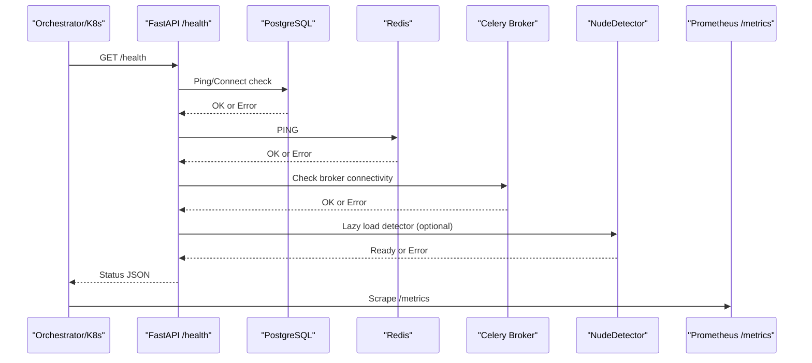

**Diagram sources**
- [main.py:84-96](file://backend/app/main.py#L84-L96)
- [database.py:1-50](file://backend/app/core/database.py#L1-L50)
- [redis.py:1-21](file://backend/app/core/redis.py#L1-L21)
- [celery_app.py:1-21](file://backend/app/core/celery_app.py#L1-L21)
- [ai_moderation.py:14-22](file://backend/app/services/ai_moderation.py#L14-L22)
- [main.py:98-107](file://backend/app/main.py#L98-L107)

## Detailed Component Analysis

### Health Endpoint (/health)
- Purpose: Provide a comprehensive view of service readiness and dependency health.
- Response fields:
  - status: overall health state
  - version: application version
  - environment: runtime environment
  - services: per-component statuses (api, database, cache)
- Implementation notes:
  - Currently returns static operational statuses; can be extended to perform live checks against dependencies.
  - Prometheus metrics endpoint is conditionally mounted based on configuration.

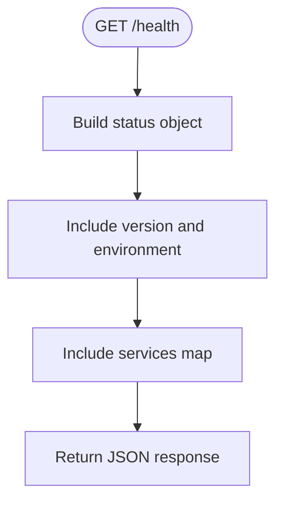

**Diagram sources**
- [main.py:84-96](file://backend/app/main.py#L84-L96)

**Section sources**
- [main.py:84-96](file://backend/app/main.py#L84-L96)

### Kubernetes-Style Readiness and Liveness Probes
- Liveness probe:
  - Path: /health
  - Port: 8000
  - Typical initialDelaySeconds and periodSeconds values are provided in deployment manifests.
- Readiness probe:
  - Path: /health
  - Port: 8000
  - Used to control traffic routing once the service is ready.

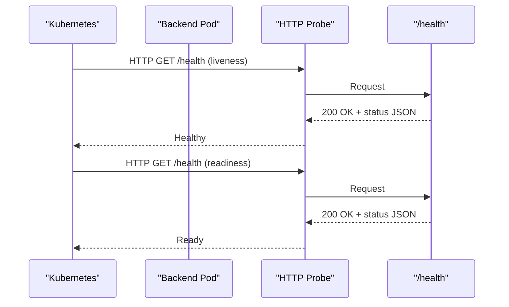

**Diagram sources**
- [DEPLOYMENT.md:558-581](file://DEPLOYMENT.md#L558-L581)
- [main.py:84-96](file://backend/app/main.py#L84-L96)

**Section sources**
- [DEPLOYMENT.md:558-581](file://DEPLOYMENT.md#L558-L581)

### Docker Health Checks
- Backend container:
  - No HEALTHCHECK directive in the backend Dockerfile; rely on orchestrator probes or compose depends_on conditions.
- Frontend container:
  - HEALTHCHECK uses wget to probe the root path.
- Docker Compose:
  - PostgreSQL and Redis define healthcheck commands; backend depends on their healthy state.

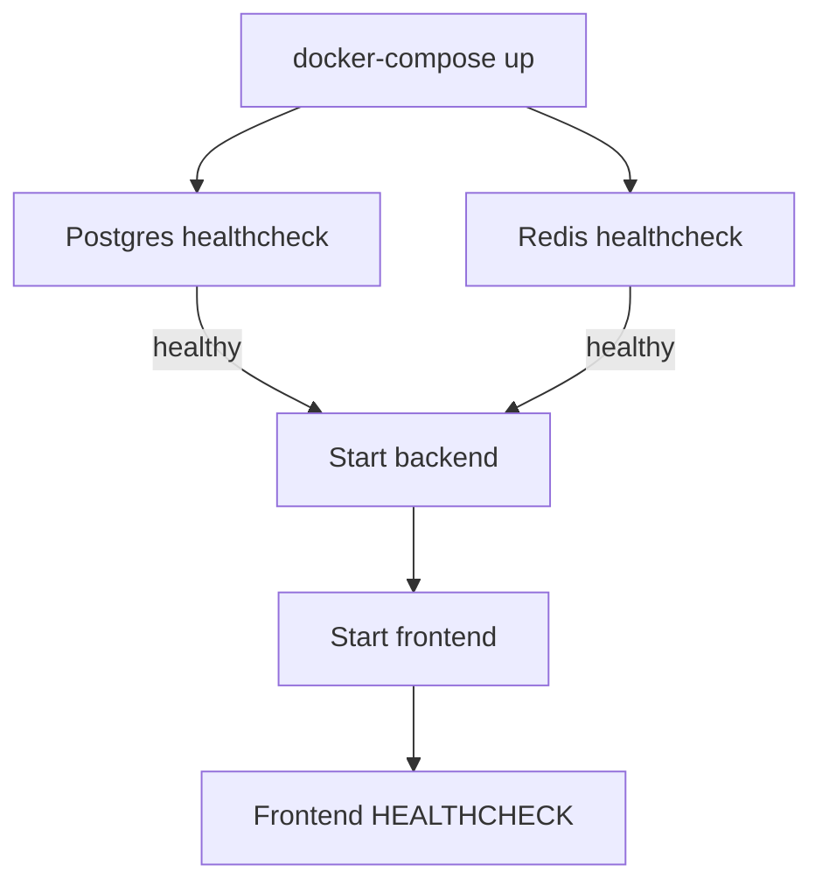

**Diagram sources**
- [docker-compose.yml:16-39](file://docker-compose.yml#L16-L39)
- [docker-compose.yml:41-66](file://docker-compose.yml#L41-L66)
- [Dockerfile (Frontend):30-32](file://frontend/Dockerfile#L30-L32)

**Section sources**
- [docker-compose.yml:16-39](file://docker-compose.yml#L16-L39)
- [docker-compose.yml:41-66](file://docker-compose.yml#L41-L66)
- [Dockerfile (Frontend):30-32](file://frontend/Dockerfile#L30-L32)

### Prometheus Metrics Integration
- Conditional mounting:
  - If ENABLE_PROMETHEUS_METRICS is true, /metrics is mounted using prometheus_client.
- Scraping configuration:
  - Example Prometheus job targets backend:8000 with metrics_path /metrics.

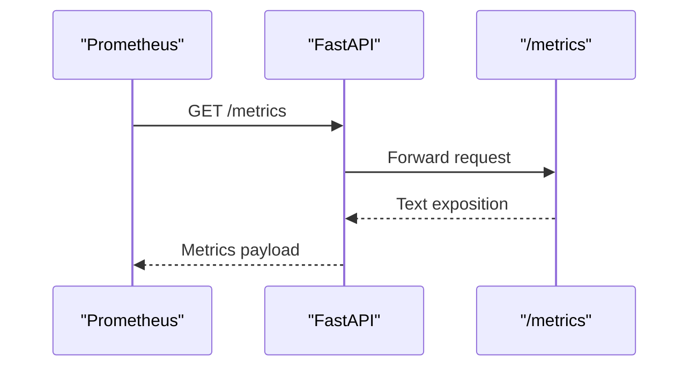

**Diagram sources**
- [main.py:98-107](file://backend/app/main.py#L98-L107)
- [DEPLOYMENT.md:690-706](file://DEPLOYMENT.md#L690-L706)

**Section sources**
- [main.py:98-107](file://backend/app/main.py#L98-L107)
- [DEPLOYMENT.md:690-706](file://DEPLOYMENT.md#L690-L706)

### Custom Health Checks

#### AI Model Availability
- Strategy:
  - Use lazy initialization for NudeDetector to avoid blocking startup.
  - Add a dedicated endpoint that attempts to initialize the detector and reports status.
- Graceful degradation:
  - If model loading fails, mark AI service as degraded while keeping API functional.

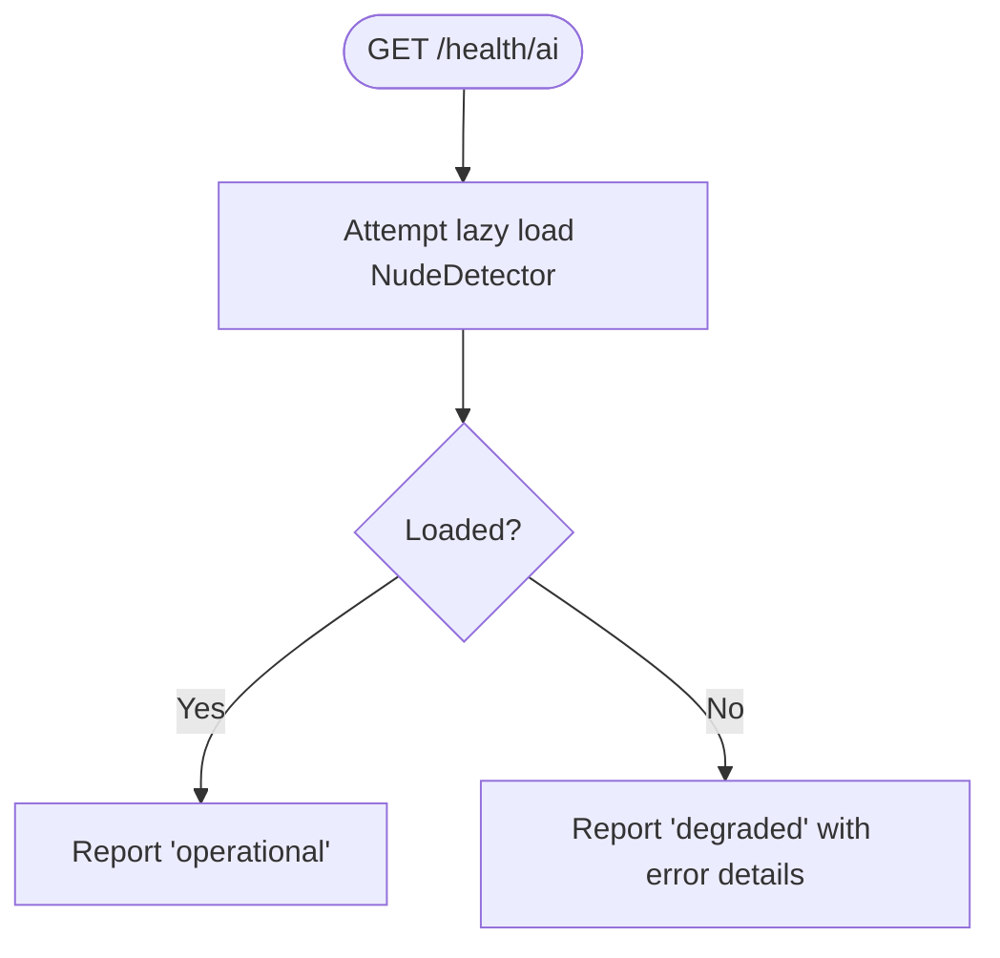

**Diagram sources**
- [ai_moderation.py:14-22](file://backend/app/services/ai_moderation.py#L14-L22)

**Section sources**
- [ai_moderation.py:14-22](file://backend/app/services/ai_moderation.py#L14-L22)

#### Disk Space Monitoring
- Strategy:
  - Implement a health check that inspects critical directories (e.g., uploads, dataset).
  - Return degraded status if free space falls below a threshold.
- Integration:
  - Include disk status in the /health services map.

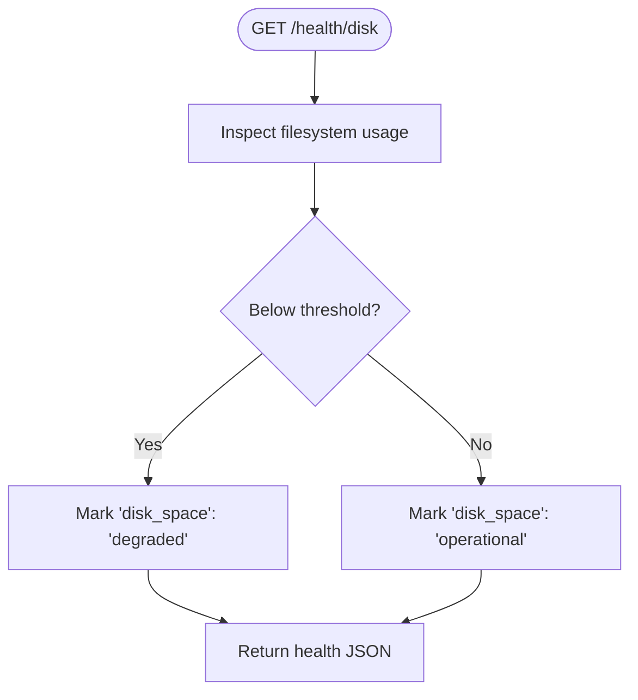

[No sources needed since this section proposes an extension not present in current code]

#### Queue Depth Monitoring
- Strategy:
  - Query Celery broker for queue length and worker availability.
  - Report queue_depth and worker_status in the /health services map.
- Background processing:
  - Batch moderation routes use Celery; task status queries are supported.

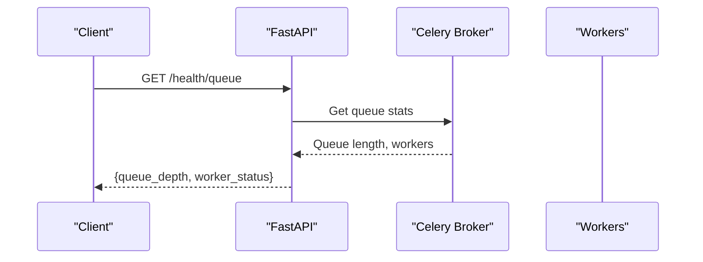

**Diagram sources**
- [celery_app.py:1-21](file://backend/app/core/celery_app.py#L1-L21)
- [moderate.py:380-443](file://backend/app/api/moderate.py#L380-L443)

**Section sources**
- [celery_app.py:1-21](file://backend/app/core/celery_app.py#L1-L21)
- [moderate.py:380-443](file://backend/app/api/moderate.py#L380-L443)

### Health Check Response Format
- Overall structure:
  - status: string indicating overall health
  - version: application version
  - environment: runtime environment
  - services: map of component names to statuses
- Suggested statuses:
  - operational: fully functional
  - degraded: partially functional with reduced capability
  - down: non-functional
- Diagnostic information:
  - Include timestamps, error messages, and latency where applicable.

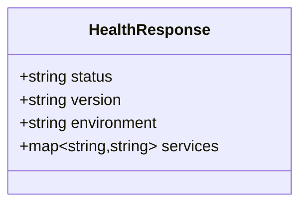

**Diagram sources**
- [main.py:84-96](file://backend/app/main.py#L84-L96)

**Section sources**
- [main.py:84-96](file://backend/app/main.py#L84-L96)

### Integration with External Monitoring Systems
- Prometheus:
  - Mount /metrics endpoint and configure scraping jobs.
- Docker:
  - Use HEALTHCHECK directives for containers that serve HTTP endpoints.
- Cloud providers:
  - Configure load balancer health checks to target /health.

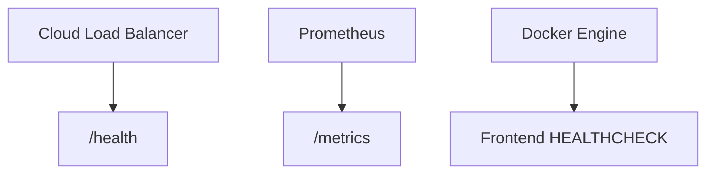

**Diagram sources**
- [main.py:98-107](file://backend/app/main.py#L98-L107)
- [DEPLOYMENT.md:690-706](file://DEPLOYMENT.md#L690-L706)
- [Dockerfile (Frontend):30-32](file://frontend/Dockerfile#L30-L32)

**Section sources**
- [main.py:98-107](file://backend/app/main.py#L98-L107)
- [DEPLOYMENT.md:690-706](file://DEPLOYMENT.md#L690-L706)
- [Dockerfile (Frontend):30-32](file://frontend/Dockerfile#L30-L32)

## Dependency Analysis
Key dependencies and their health implications:
- Database:
  - Async and sync engines created with pool_pre_ping; failures indicate database unavailability.
- Redis:
  - Short connect timeout and ping-based availability flag; rate limiting degrades gracefully when Redis is down.
- Celery:
  - Broker and backend configured via settings; queue health affects background processing.
- AI models:
  - Lazy-loaded NudeDetector; failures degrade AI capabilities but keep API responsive.

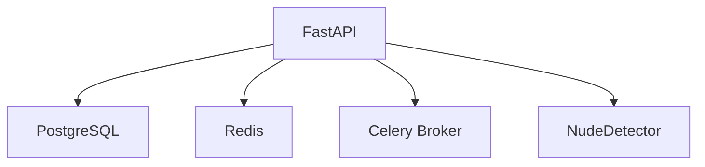

**Diagram sources**
- [database.py:1-50](file://backend/app/core/database.py#L1-L50)
- [redis.py:1-21](file://backend/app/core/redis.py#L1-L21)
- [celery_app.py:1-21](file://backend/app/core/celery_app.py#L1-L21)
- [ai_moderation.py:14-22](file://backend/app/services/ai_moderation.py#L14-L22)

**Section sources**
- [database.py:1-50](file://backend/app/core/database.py#L1-L50)
- [redis.py:1-21](file://backend/app/core/redis.py#L1-L21)
- [celery_app.py:1-21](file://backend/app/core/celery_app.py#L1-L21)
- [ai_moderation.py:14-22](file://backend/app/services/ai_moderation.py#L14-L22)

## Performance Considerations
- Keep health checks lightweight:
  - Avoid heavy computations or long-running operations in /health.
  - Use quick pings and cached status flags where appropriate.
- Caching strategies:
  - Cache dependency health results for a short TTL to reduce overhead.
  - Invalidate cache on configuration changes or errors.
- Graceful degradation:
  - When Redis is unavailable, continue serving requests without rate limiting.
  - When AI models fail, return safe defaults or route to fallback logic.
- Timeouts and retries:
  - Set low timeouts for dependency checks to prevent slow responses.
  - Retry failed checks with exponential backoff only in background tasks, not in hot paths.

[No sources needed since this section provides general guidance]

## Troubleshooting Guide
Common issues and diagnostics:
- Database connection failures:
  - Verify DATABASE_URL and ASYNC_DATABASE_URL settings.
  - Test connections using provided session providers.
- Redis connection failures:
  - Confirm REDIS_URL and network reachability.
  - Check redis_available flag and logs.
- Model loading errors:
  - Ensure NudeDetector initializes successfully.
  - Validate model files and environment variables.
- High memory usage:
  - Monitor container stats and scale workers accordingly.

Operational references:
- Deployment troubleshooting steps and example commands are documented.

**Section sources**
- [DEPLOYMENT.md:718-766](file://DEPLOYMENT.md#L718-L766)
- [redis.py:1-21](file://backend/app/core/redis.py#L1-L21)
- [ai_moderation.py:14-22](file://backend/app/services/ai_moderation.py#L14-L22)

## Conclusion
OmniShield’s health monitoring combines simple API endpoints, container orchestration probes, and optional Prometheus metrics. Extending /health with live dependency checks, custom components (AI, disk, queue), and robust alerting will improve reliability and observability. Graceful degradation ensures continued operation even when non-critical dependencies are unavailable.

[No sources needed since this section summarizes without analyzing specific files]

## Appendices

### Example Configurations

- Kubernetes liveness/readiness probes:
  - Use /health on port 8000 with appropriate timing parameters.
- Prometheus scrape config:
  - Target backend:8000 with metrics_path /metrics.
- Docker HEALTHCHECK:
  - For frontend, use wget to probe root path.

**Section sources**
- [DEPLOYMENT.md:558-581](file://DEPLOYMENT.md#L558-L581)
- [DEPLOYMENT.md:690-706](file://DEPLOYMENT.md#L690-L706)
- [Dockerfile (Frontend):30-32](file://frontend/Dockerfile#L30-L32)

### Alerting Rules
- High error rate alerts
- Slow inference alerts
- Database down alerts

**Section sources**
- [ARCHITECTURE.md:696-716](file://ARCHITECTURE.md#L696-L716)

### Automated Recovery Procedures
- Restart failed pods based on liveness probe failures.
- Scale workers when queue depth exceeds thresholds.
- Rollback deployments if health checks consistently fail post-deploy.

[No sources needed since this section provides general guidance]