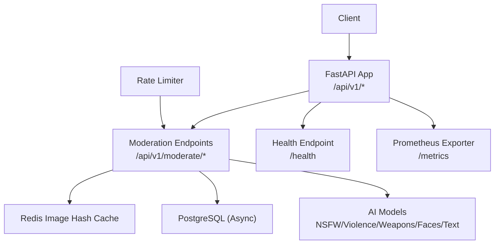
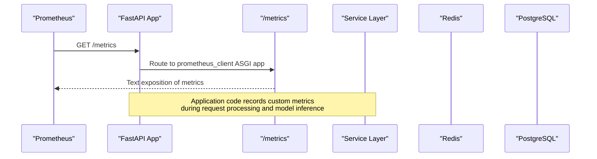
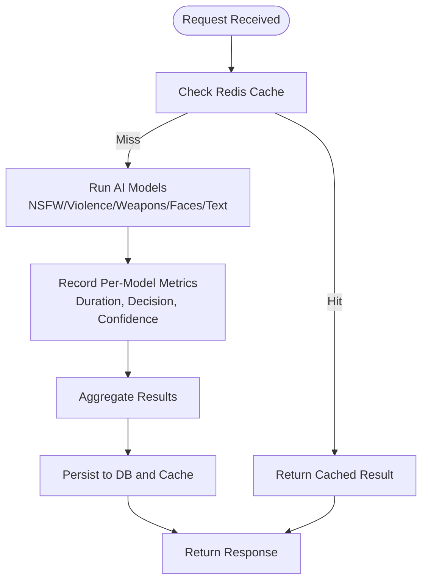
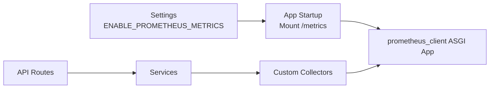

# Metrics Collection & Prometheus Integration

<cite>
**Referenced Files in This Document**
- [main.py](file://backend/app/main.py)
- [config.py](file://backend/app/core/config.py)
- [moderate.py](file://backend/app/api/moderate.py)
- [ai_moderation.py](file://backend/app/services/ai_moderation.py)
- [multi_model_moderation.py](file://backend/app/services/multi_model_moderation.py)
- [hash_cache.py](file://backend/app/services/hash_cache.py)
- [redis.py](file://backend/app/core/redis.py)
- [database.py](file://backend/app/core/database.py)
- [rate_limit.py](file://backend/app/core/rate_limit.py)
- [log_repo.py](file://backend/app/repositories/log_repo.py)
- [ARCHITECTURE.md](file://ARCHITECTURE.md)
- [DEPLOYMENT_GUIDE.md](file://DEPLOYMENT_GUIDE.md)
</cite>

## Table of Contents
1. [Introduction](#introduction)
2. [Project Structure](#project-structure)
3. [Core Components](#core-components)
4. [Architecture Overview](#architecture-overview)
5. [Detailed Component Analysis](#detailed-component-analysis)
6. [Dependency Analysis](#dependency-analysis)
7. [Performance Considerations](#performance-considerations)
8. [Troubleshooting Guide](#troubleshooting-guide)
9. [Conclusion](#conclusion)
10. [Appendices](#appendices)

## Introduction
This document provides comprehensive guidance for collecting and exposing metrics on the OmniShield platform with a focus on Prometheus integration and custom metric implementation. It covers:
- Automatic HTTP request metrics (request rates, error rates, latency percentiles p50/p95/p99, endpoint-specific performance)
- AI model performance metrics (inference duration per detection category, confidence distributions, detection success rates)
- System resource metrics (CPU usage, memory consumption, database connection pool utilization, Redis cache hit rates)
- Configuration for enabling Prometheus via ENABLE_PROMETHEUS_METRICS
- Custom metric definitions for business KPIs (total scans processed, unsafe content detection rates)
- Metric naming conventions following OpenMetrics standards
- PromQL queries for common monitoring scenarios
- Alerting rule templates for critical thresholds
- Best practices for cardinality management to prevent performance degradation

## Project Structure
The backend exposes a /metrics endpoint when Prometheus is enabled. The application mounts the prometheus_client ASGI app at startup and conditionally enables it based on configuration. Core services include image moderation, multi-model moderation, caching, rate limiting, and database access.

**Diagram sources**
- [main.py:98-107](file://backend/app/main.py#L98-L107)
- [moderate.py:223-371](file://backend/app/api/moderate.py#L223-L371)
- [hash_cache.py:1-58](file://backend/app/services/hash_cache.py#L1-L58)
- [database.py:1-50](file://backend/app/core/database.py#L1-L50)
- [rate_limit.py:1-43](file://backend/app/core/rate_limit.py#L1-L43)

**Section sources**
- [main.py:98-107](file://backend/app/main.py#L98-L107)
- [config.py:113-115](file://backend/app/core/config.py#L113-L115)
- [DEPLOYMENT_GUIDE.md:283-292](file://DEPLOYMENT_GUIDE.md#L283-L292)

## Core Components
- Prometheus exporter mounting: The FastAPI app conditionally mounts the prometheus_client ASGI app at /metrics when ENABLE_PROMETHEUS_METRICS is True.
- Configuration: ENABLE_PROMETHEUS_METRICS defaults to True and can be toggled via environment variables.
- Moderation endpoints: Provide the primary request surface where HTTP-level metrics are collected by default.
- Caching and rate limiting: Interact with Redis; useful for deriving cache hit/miss and throttling metrics.
- Database layer: Async SQLAlchemy engine/session management; useful for connection pool metrics.

Key responsibilities:
- Expose /metrics endpoint for Prometheus scraping
- Ensure consistent labeling for all custom metrics
- Track AI inference durations and outcomes per category
- Record business KPIs such as total scans and unsafe detection rates

**Section sources**
- [main.py:98-107](file://backend/app/main.py#L98-L107)
- [config.py:113-115](file://backend/app/core/config.py#L113-L115)
- [moderate.py:223-371](file://backend/app/api/moderate.py#L223-L371)
- [hash_cache.py:1-58](file://backend/app/services/hash_cache.py#L1-L58)
- [database.py:1-50](file://backend/app/core/database.py#L1-L50)

## Architecture Overview
Prometheus integration is achieved by mounting the prometheus_client ASGI app under /metrics. All HTTP requests handled by FastAPI will automatically expose standard counters and histograms if using the default collector or middleware. For domain-specific metrics (AI inference, cache hits, etc.), custom collectors should be added within service layers.

**Diagram sources**
- [main.py:98-107](file://backend/app/main.py#L98-L107)

## Detailed Component Analysis

### HTTP Request Metrics (Automatic)
- What is exposed: By default, prometheus_client collects process metrics and basic HTTP server metrics. When mounted under /metrics, Prometheus can scrape these.
- Recommended labels: method, path, status_code, endpoint (normalized), version.
- Latency percentiles: Use histogram buckets appropriate for your SLIs (e.g., p50, p95, p99).
- Error rates: Count responses with 4xx/5xx status codes.

Implementation notes:
- Ensure that the /metrics route is reachable from your Prometheus instance.
- Normalize endpoint paths to avoid high cardinality (e.g., group /api/v1/moderate/image/comprehensive into a single endpoint label).

**Section sources**
- [main.py:98-107](file://backend/app/main.py#L98-L107)
- [DEPLOYMENT_GUIDE.md:283-292](file://DEPLOYMENT_GUIDE.md#L283-L292)

### AI Model Performance Metrics
Categories tracked: NSFW, violence, weapons, faces, text.

Recommended metrics:
- ai_inference_duration_seconds{model} (histogram)
- ai_predictions_total{model, decision} (counter)
- ai_model_load_time_seconds{model} (gauge or counter)
- ai_detection_success_total{model} (counter)
- ai_confidence_score{model} (histogram)

Where to record:
- In each model’s execution path within the multi-model service.
- Aggregate per-category results and overall ensemble outputs.

Data flow:
- Endpoints call multi-model moderation service.
- Service runs models in parallel and aggregates results.
- Record per-model durations and decisions.

**Diagram sources**
- [moderate.py:223-371](file://backend/app/api/moderate.py#L223-L371)
- [hash_cache.py:1-58](file://backend/app/services/hash_cache.py#L1-L58)
- [multi_model_moderation.py:1-200](file://backend/app/services/multi_model_moderation.py#L1-L200)

**Section sources**
- [ai_moderation.py:148-275](file://backend/app/services/ai_moderation.py#L148-L275)
- [multi_model_moderation.py:1-200](file://backend/app/services/multi_model_moderation.py#L1-L200)

### System Resource Metrics
- CPU and memory: Typically provided by node_exporter or runtime exporters.
- Database connection pool utilization: Track active connections vs pool size.
- Redis cache hit rates: Compute hits/(hits+misses) over time windows.

Recommendations:
- Use gauges for current pool utilization and histograms for query latencies.
- Label by operation type where needed (e.g., moderate_image, get_stats).

**Section sources**
- [database.py:1-50](file://backend/app/core/database.py#L1-L50)
- [redis.py:1-21](file://backend/app/core/redis.py#L1-L21)
- [rate_limit.py:1-43](file://backend/app/core/rate_limit.py#L1-L43)

### Business KPIs
Examples:
- moderation_scans_total{decision, risk_level} (counter)
- moderation_unsafe_rate_ratio (gauge or derived from counters)
- users_registered_total (counter)
- api_keys_generated_total (counter)

Recording points:
- After final decision aggregation in the moderation pipeline.
- On user/key lifecycle events.

**Section sources**
- [log_repo.py:88-109](file://backend/app/repositories/log_repo.py#L88-L109)
- [ARCHITECTURE.md:665-694](file://ARCHITECTURE.md#L665-L694)

## Dependency Analysis
Prometheus exporter depends on:
- FastAPI app initialization and settings flag
- Optional import of prometheus_client
- Application routes and services recording custom metrics

**Diagram sources**
- [config.py:113-115](file://backend/app/core/config.py#L113-L115)
- [main.py:98-107](file://backend/app/main.py#L98-L107)

**Section sources**
- [config.py:113-115](file://backend/app/core/config.py#L113-L115)
- [main.py:98-107](file://backend/app/main.py#L98-L107)

## Performance Considerations
- Histogram bucket sizing: Choose buckets aligned with expected latency ranges to ensure accurate percentile calculations.
- Cardinality control: Avoid high-cardinality labels like raw file names, UUIDs, or user IDs in metric keys.
- Aggregation strategy: Prefer counters and histograms over gauges for frequently changing values.
- Scrape interval: Tune Prometheus scrape intervals to balance freshness and overhead.
- Background tasks: Ensure metrics are recorded even for async jobs and background workers.

[No sources needed since this section provides general guidance]

## Troubleshooting Guide
Common issues:
- /metrics not available: Verify ENABLE_PROMETHEUS_METRICS is True and prometheus_client is installed.
- Missing custom metrics: Confirm collectors are initialized before first use and labels are consistently applied.
- High cardinality warnings: Review label sets and reduce unique values.
- Redis failures: Graceful degradation should still allow requests; monitor cache miss spikes.

Operational checks:
- Access /metrics directly to validate exposure.
- Inspect logs for importer warnings and service errors.

**Section sources**
- [main.py:98-107](file://backend/app/main.py#L98-L107)
- [redis.py:1-21](file://backend/app/core/redis.py#L1-L21)
- [rate_limit.py:1-43](file://backend/app/core/rate_limit.py#L1-L43)

## Conclusion
OmniShield supports Prometheus integration through a conditional /metrics mount. To achieve full observability, add custom collectors for AI inference, cache behavior, and business KPIs while adhering to OpenMetrics naming and low-cardinality labeling. Use the provided PromQL examples and alert templates to monitor health and performance effectively.

[No sources needed since this section summarizes without analyzing specific files]

## Appendices

### Configuration Examples
- Enable Prometheus metrics:
  - Set ENABLE_PROMETHEUS_METRICS=true in environment variables.
  - Ensure prometheus_client is installed in the runtime environment.

- Example environment variable table:
  - Variable: ENABLE_PROMETHEUS_METRICS
    - Type: boolean
    - Default: true
    - Description: Enables the /metrics endpoint for Prometheus scraping

**Section sources**
- [config.py:113-115](file://backend/app/core/config.py#L113-L115)
- [DEPLOYMENT_GUIDE.md:283-292](file://DEPLOYMENT_GUIDE.md#L283-L292)

### Metric Naming Conventions (OpenMetrics-aligned)
- Use lowercase with underscores.
- Suffix types appropriately: _total, _seconds, _bytes, _ratio.
- Include stable labels: endpoint, method, status_code, model, decision, risk_level.
- Avoid dynamic identifiers in labels (e.g., no raw filenames or UUIDs).

[No sources needed since this section provides general guidance]

### PromQL Queries
- Request rate by endpoint (per minute):
  - sum by (endpoint) (rate(http_requests_total{job="omnishield"}[5m]))

- Error rate ratio (5xx):
  - sum(rate(http_requests_total{status=~"5..", job="omnishield"}[5m])) / sum(rate(http_requests_total{job="omnishield"}[5m]))

- Latency percentiles (p50, p95, p99) across endpoints:
  - histogram_quantile(0.50, sum(rate(http_request_duration_seconds_bucket{job="omnishield"}[5m])) by (le))
  - histogram_quantile(0.95, sum(rate(http_request_duration_seconds_bucket{job="omnishield"}[5m])) by (le))
  - histogram_quantile(0.99, sum(rate(http_request_duration_seconds_bucket{job="omnishield"}[5m])) by (le))

- AI inference duration p95 by model:
  - histogram_quantile(0.95, sum(rate(ai_inference_duration_seconds_bucket{job="omnishield"}[5m])) by (le, model))

- Redis cache hit rate:
  - sum(rate(redis_cache_hits_total{job="omnishield"}[5m])) / (sum(rate(redis_cache_hits_total{job="omnishield"}[5m])) + sum(rate(redis_cache_misses_total{job="omnishield"}[5m])))

- Business KPI: Total scans processed:
  - sum(moderation_scans_total{job="omnishield"})

- Unsafe detection rate:
  - sum(rate(moderation_scans_total{decision="unsafe", job="omnishield"}[5m])) / sum(rate(moderation_scans_total{job="omnishield"}[5m]))

[No sources needed since this section provides general guidance]

### Alerting Rule Templates
- High API error rate:
  - expr: sum(rate(http_requests_total{status=~"5..", job="omnishield"}[5m])) / sum(rate(http_requests_total{job="omnishield"}[5m])) > 0.05
  - for: 5m
  - annotations: summary: "High API error rate detected"

- Slow AI inference (p95 > threshold):
  - expr: histogram_quantile(0.95, sum(rate(ai_inference_duration_seconds_bucket{job="omnishield"}[5m])) by (le)) > 5
  - for: 10m
  - annotations: summary: "AI inference taking too long"

- Database down:
  - expr: up{job="postgresql"} == 0
  - for: 1m
  - annotations: summary: "PostgreSQL is down"

- Low cache hit rate:
  - expr: sum(rate(redis_cache_hits_total{job="omnishield"}[5m])) / (sum(rate(redis_cache_hits_total{job="omnishield"}[5m])) + sum(rate(redis_cache_misses_total{job="omnishield"}[5m]))) < 0.7
  - for: 10m
  - annotations: summary: "Redis cache hit rate below threshold"

**Section sources**
- [ARCHITECTURE.md:696-716](file://ARCHITECTURE.md#L696-L716)

### Best Practices for Cardinality Management
- Limit label values:
  - Use normalized endpoint labels instead of raw paths.
  - Avoid including user IDs, session tokens, or file hashes in metric labels.
- Prefer counters and histograms:
  - Use _total for counts and _seconds/_bytes for sizes/durations.
- Pre-aggregate where possible:
  - Aggregate per-minute rates in PromQL rather than storing high-frequency gauges.
- Monitor cardinality:
  - Track number of series per metric and set alerts for unexpected growth.

[No sources needed since this section provides general guidance]