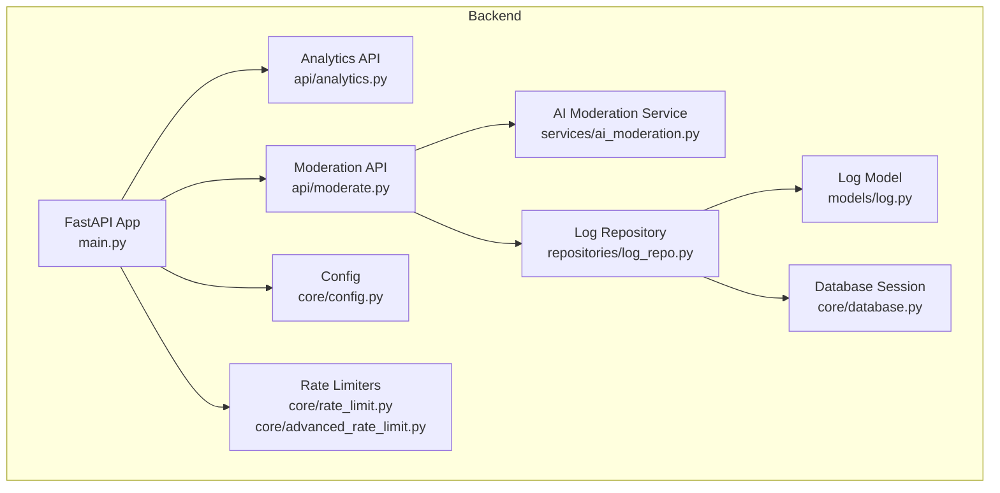
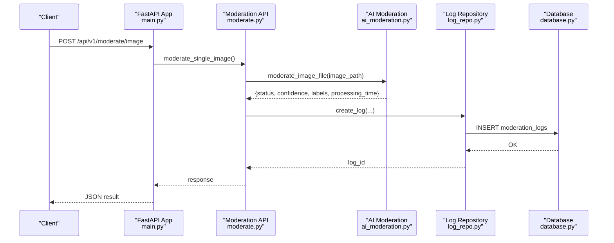
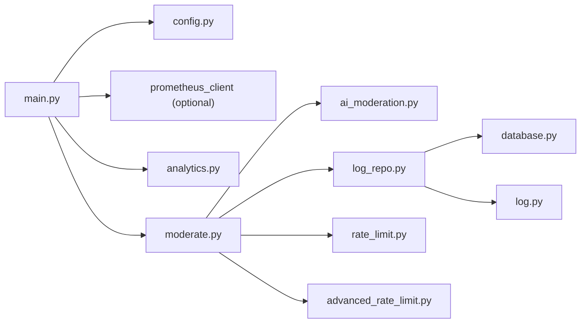

# Monitoring & Observability

<cite>
**Referenced Files in This Document**
- [main.py](file://backend/app/main.py)
- [config.py](file://backend/app/core/config.py)
- [analytics.py](file://backend/app/api/analytics.py)
- [moderate.py](file://backend/app/api/moderate.py)
- [ai_moderation.py](file://backend/app/services/ai_moderation.py)
- [log_repo.py](file://backend/app/repositories/log_repo.py)
- [log.py](file://backend/app/models/log.py)
- [database.py](file://backend/app/core/database.py)
- [rate_limit.py](file://backend/app/core/rate_limit.py)
- [advanced_rate_limit.py](file://backend/app/core/advanced_rate_limit.py)
- [docker-compose.yml](file://docker-compose.yml)
- [requirements.txt](file://backend/requirements.txt)
- [ARCHITECTURE.md](file://ARCHITECTURE.md)
- [README.md](file://README.md)
</cite>

## Table of Contents
1. Introduction
2. Project Structure
3. Core Components
4. Architecture Overview
5. Detailed Component Analysis
6. Dependency Analysis
7. Performance Considerations
8. Troubleshooting Guide
9. Conclusion
10. Appendices

## Introduction
This document provides comprehensive monitoring and observability guidance for the OmniShield platform. It covers system health tracking, performance metrics, structured logging, custom analytics endpoints, Grafana dashboards, alerting rules, distributed tracing considerations, health checks, debugging utilities, best practices, metric naming conventions, and capacity planning based on collected metrics.

## Project Structure
The backend exposes a FastAPI application with:
- Health and root endpoints
- Conditional Prometheus metrics endpoint
- Analytics endpoints for usage statistics and time series
- Moderation endpoints that persist logs used by analytics
- Structured logging via Loguru
- Database models and repositories for moderation logs

**Diagram sources**
- [main.py:1-126](file://backend/app/main.py#L1-L126)
- [analytics.py:1-70](file://backend/app/api/analytics.py#L1-L70)
- [moderate.py:1-615](file://backend/app/api/moderate.py#L1-L615)
- [ai_moderation.py:1-275](file://backend/app/services/ai_moderation.py#L1-L275)
- [log_repo.py:1-232](file://backend/app/repositories/log_repo.py#L1-L232)
- [log.py:1-51](file://backend/app/models/log.py#L1-L51)
- [database.py:1-50](file://backend/app/core/database.py#L1-L50)
- [config.py:1-148](file://backend/app/core/config.py#L1-L148)
- [rate_limit.py:1-43](file://backend/app/core/rate_limit.py#L1-L43)
- [advanced_rate_limit.py:81-112](file://backend/app/core/advanced_rate_limit.py#L81-L112)

**Section sources**
- [main.py:1-126](file://backend/app/main.py#L1-L126)
- [config.py:1-148](file://backend/app/core/config.py#L1-L148)

## Core Components
- Health and Root Endpoints: Provide basic service status and feature flags.
- Prometheus Metrics Endpoint: Conditionally mounted when enabled.
- Analytics Endpoints: Expose dashboard stats, scan history, and timeseries data.
- Moderation Endpoints: Persist detailed logs used for analytics and compliance.
- AI Moderation Service: Performs inference and returns confidence and labels.
- Logging: Structured logging using Loguru across services and endpoints.
- Configuration: Centralized settings including monitoring toggles.

Key responsibilities:
- System health: /health and / endpoints
- Metrics exposure: /metrics (conditional)
- Business KPIs: /analytics/stats, /analytics/history, /analytics/timeseries
- Audit trail: persisted moderation logs with decisions, risk levels, confidence, processing time, and model metadata

**Section sources**
- [main.py:65-107](file://backend/app/main.py#L65-L107)
- [analytics.py:14-70](file://backend/app/api/analytics.py#L14-L70)
- [moderate.py:223-371](file://backend/app/api/moderate.py#L223-L371)
- [ai_moderation.py:148-275](file://backend/app/services/ai_moderation.py#L148-L275)
- [log_repo.py:89-136](file://backend/app/repositories/log_repo.py#L89-L136)
- [log.py:13-51](file://backend/app/models/log.py#L13-L51)
- [config.py:113-116](file://backend/app/core/config.py#L113-L116)

## Architecture Overview
The platform integrates HTTP request handling, optional Prometheus scraping, structured logging, and database-backed analytics. The health endpoint supports container orchestration probes. The analytics endpoints aggregate moderation logs to provide business KPIs and trends.

**Diagram sources**
- [main.py:59-63](file://backend/app/main.py#L59-L63)
- [moderate.py:223-371](file://backend/app/api/moderate.py#L223-L371)
- [ai_moderation.py:148-275](file://backend/app/services/ai_moderation.py#L148-L275)
- [log_repo.py:12-60](file://backend/app/repositories/log_repo.py#L12-L60)
- [database.py:35-41](file://backend/app/core/database.py#L35-L41)

## Detailed Component Analysis

### Health and Readiness
- Root endpoint returns version, environment, and feature flags.
- Health endpoint returns operational status for core services.
- These are suitable for liveness/readiness probes in orchestrators.

Best practices:
- Use /health for readiness checks; ensure it reflects actual dependency states if extended.
- Include version and environment for traceability.

**Section sources**
- [main.py:65-96](file://backend/app/main.py#L65-L96)

### Prometheus Integration
- The /metrics endpoint is conditionally mounted when ENABLE_PROMETHEUS_METRICS is true.
- prometheus_client is available in dependencies.

Recommendations:
- Add explicit counters/histograms for HTTP requests and latencies.
- Add AI inference histograms per model category.
- Export process/system metrics via an exporter or sidecar.

**Section sources**
- [main.py:98-107](file://backend/app/main.py#L98-L107)
- [config.py:113-116](file://backend/app/core/config.py#L113-L116)
- [requirements.txt:84](file://backend/requirements.txt#L84)

### Structured Logging with Loguru
- Loguru is used throughout the app for consistent structured logs.
- Logs include contextual information such as user IDs, file names, decisions, and errors.

Guidelines:
- Enforce correlation IDs per request (e.g., X-Correlation-ID header).
- Attach user context and decision metadata to logs.
- Configure centralized aggregation (e.g., file shipping to Loki/ELK).

**Section sources**
- [main.py:110-120](file://backend/app/main.py#L110-L120)
- [moderate.py:364-378](file://backend/app/api/moderate.py#L364-L378)
- [ai_moderation.py:18-22](file://backend/app/services/ai_moderation.py#L18-L22)
- [log_repo.py:168-193](file://backend/app/repositories/log_repo.py#L168-L193)

### Custom Analytics Endpoints
- GET /api/v1/analytics/stats: high-level metrics (total scans, unsafe/safe counts, average processing time, risk breakdown, active keys).
- GET /api/v1/analytics/history: paginated audit logs.
- GET /api/v1/analytics/timeseries: daily safe/unsafe totals over N days.

Data source:
- ModerationLog repository queries against moderation_logs table.

Business KPIs:
- Total scans, unsafe detection rate, average processing time, risk distribution.

**Section sources**
- [analytics.py:14-70](file://backend/app/api/analytics.py#L14-L70)
- [log_repo.py:89-136](file://backend/app/repositories/log_repo.py#L89-L136)
- [log_repo.py:139-232](file://backend/app/repositories/log_repo.py#L139-L232)
- [log.py:13-51](file://backend/app/models/log.py#L13-L51)

### Moderation Pipeline and AI Metrics
- Image moderation computes status, confidence, labels, bounding boxes, risk level, recommended action, and reason.
- Processing time is recorded per request.
- Comprehensive moderation captures additional categories and model versions.

Observability opportunities:
- Track inference duration per model category.
- Record confidence distributions and label frequencies.
- Capture face count and text moderation flags.

**Section sources**
- [ai_moderation.py:148-275](file://backend/app/services/ai_moderation.py#L148-L275)
- [moderate.py:446-615](file://backend/app/api/moderate.py#L446-L615)
- [log_repo.py:12-60](file://backend/app/repositories/log_repo.py#L12-L60)

### Rate Limiting and Operational Signals
- Redis-based windowed rate limiting with graceful degradation.
- Advanced key derivation supports per-user/IP and per-endpoint limits.

Operational insights:
- Monitor 429 responses as a proxy for throttling pressure.
- Track Redis availability and pipeline failures.

**Section sources**
- [rate_limit.py:1-43](file://backend/app/core/rate_limit.py#L1-L43)
- [advanced_rate_limit.py:81-112](file://backend/app/core/advanced_rate_limit.py#L81-L112)

### Container Orchestration and Health Checks
- docker-compose defines healthchecks for PostgreSQL and Redis.
- Backend exposes /health for service-level checks.

**Section sources**
- [docker-compose.yml:16-22](file://docker-compose.yml#L16-L22)
- [docker-compose.yml:33-39](file://docker-compose.yml#L33-L39)
- [main.py:84-96](file://backend/app/main.py#L84-L96)

## Dependency Analysis
The following diagram shows how components depend on each other for monitoring and observability.

**Diagram sources**
- [main.py:1-126](file://backend/app/main.py#L1-L126)
- [config.py:1-148](file://backend/app/core/config.py#L1-L148)
- [analytics.py:1-70](file://backend/app/api/analytics.py#L1-L70)
- [moderate.py:1-615](file://backend/app/api/moderate.py#L1-L615)
- [ai_moderation.py:1-275](file://backend/app/services/ai_moderation.py#L1-L275)
- [log_repo.py:1-232](file://backend/app/repositories/log_repo.py#L1-L232)
- [log.py:1-51](file://backend/app/models/log.py#L1-L51)
- [database.py:1-50](file://backend/app/core/database.py#L1-L50)
- [rate_limit.py:1-43](file://backend/app/core/rate_limit.py#L1-L43)
- [advanced_rate_limit.py:81-112](file://backend/app/core/advanced_rate_limit.py#L81-L112)

**Section sources**
- [requirements.txt:57](file://backend/requirements.txt#L57)
- [requirements.txt:84](file://backend/requirements.txt#L84)

## Performance Considerations
- Inference latency: capture per-model histograms and percentiles (P50/P95/P99).
- Cache effectiveness: track cache hits vs misses for image hashes.
- Database load: monitor query durations and connection pool utilization.
- Throughput: measure requests per second and error rates.
- Resource usage: CPU, memory, and GPU utilization where applicable.

[No sources needed since this section provides general guidance]

## Troubleshooting Guide
Common issues and diagnostics:
- High error rates: inspect 5xx responses and correlate with logs around the same timestamps.
- Slow inference: check per-model latency histograms and resource saturation.
- Rate limiting spikes: review 429 responses and Redis availability.
- Analytics gaps: verify moderation logs are being persisted and timeseries queries return expected ranges.

Useful endpoints and signals:
- /health for service state
- /metrics for Prometheus scrape
- /api/v1/analytics/* for business metrics and audit trails

**Section sources**
- [main.py:84-96](file://backend/app/main.py#L84-L96)
- [main.py:98-107](file://backend/app/main.py#L98-L107)
- [analytics.py:14-70](file://backend/app/api/analytics.py#L14-L70)
- [rate_limit.py:29-43](file://backend/app/core/rate_limit.py#L29-L43)

## Conclusion
OmniShield provides foundational observability through health endpoints, conditional Prometheus integration, structured logging, and robust analytics backed by persistent moderation logs. Extending metrics collection to cover HTTP, AI inference, and system resources will enable comprehensive dashboards and alerting for reliable operations.

[No sources needed since this section summarizes without analyzing specific files]

## Appendices

### Prometheus Metrics Integration Plan
- HTTP metrics:
  - http_requests_total{method, endpoint, status}
  - http_request_duration_seconds{endpoint}
  - http_requests_in_flight{endpoint}
- AI model metrics:
  - ai_inference_duration_seconds{model}
  - ai_predictions_total{model, decision}
  - ai_model_load_time_seconds{model}
- System and infrastructure:
  - db_connections_active
  - db_query_duration_seconds{query_type}
  - redis_cache_hits_total, redis_cache_misses_total, redis_memory_used_bytes
- Business metrics:
  - moderation_scans_total{decision, risk_level}
  - users_registered_total
  - api_keys_generated_total

These metric families are defined for planning and visualization.

**Section sources**
- [ARCHITECTURE.md:665-694](file://ARCHITECTURE.md#L665-L694)
- [README.md:580-597](file://README.md#L580-L597)

### Grafana Dashboard Configurations
Recommended panels:
- System Health:
  - Request rate (req/s)
  - Error rate (%)
  - Latency P50/P95/P99
  - Resource usage (CPU, memory)
- AI Performance:
  - Inference time per category
  - Confidence distribution
  - Detection rate by category
  - Cache hit rate
- Business KPIs:
  - Total scans
  - Unsafe content detected
  - Active users
  - API key usage

**Section sources**
- [README.md:599-619](file://README.md#L599-L619)

### Alerting Rules
Example rules for critical conditions:
- HighErrorRate: 5xx rate exceeds threshold over a time window
- SlowInference: P95 inference duration exceeds target
- DatabaseDown: Database job down

**Section sources**
- [ARCHITECTURE.md:696-716](file://ARCHITECTURE.md#L696-L716)

### Distributed Tracing Strategy
- Propagate correlation IDs via headers (e.g., X-Correlation-ID) across services.
- Inject correlation ID into structured logs for unified search.
- Integrate OpenTelemetry exporters to send traces to a collector and visualize in a tracing UI.

[No sources needed since this section provides general guidance]

### Debugging Utilities for Production
- Health endpoint for quick checks
- Analytics endpoints for post-mortem analysis
- Structured logs with context for fast triage
- Optional Sentry integration for error tracking

**Section sources**
- [main.py:84-96](file://backend/app/main.py#L84-L96)
- [analytics.py:14-70](file://backend/app/api/analytics.py#L14-L70)
- [config.py:114-115](file://backend/app/core/config.py#L114-L115)

### Monitoring Best Practices and Metric Naming Conventions
- Use clear, consistent metric names with units (e.g., _seconds, _bytes, _total).
- Tag dimensions thoughtfully (method, endpoint, status, model, decision).
- Prefer histograms for latency and counters for events.
- Keep cardinality under control to avoid high memory usage.

[No sources needed since this section provides general guidance]

### Capacity Planning Guidance
- Use request rates and latency percentiles to size API workers.
- Monitor DB connections and query durations to right-size database instances.
- Track cache hit rates to tune TTLs and memory allocation.
- Observe AI inference durations to plan GPU/CPU allocations.

[No sources needed since this section provides general guidance]