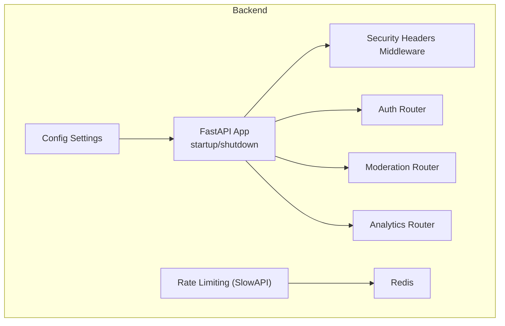
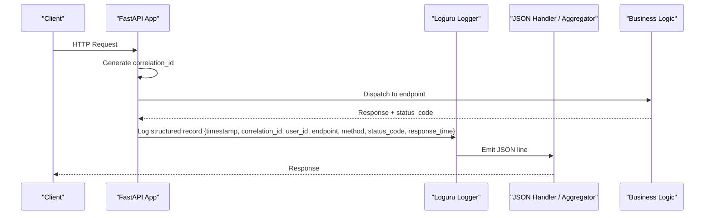
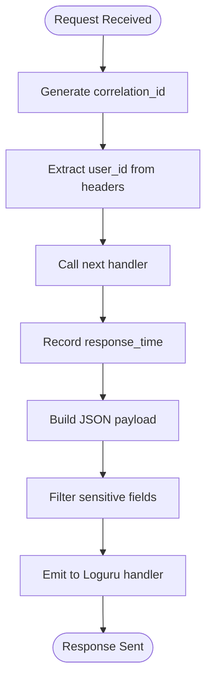
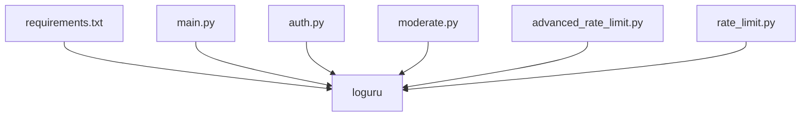

# Structured Logging & Debugging

<cite>
**Referenced Files in This Document**
- [main.py](file://backend/app/main.py)
- [config.py](file://backend/app/core/config.py)
- [auth.py](file://backend/app/api/auth.py)
- [moderate.py](file://backend/app/api/moderate.py)
- [analytics.py](file://backend/app/api/analytics.py)
- [advanced_rate_limit.py](file://backend/app/core/advanced_rate_limit.py)
- [rate_limit.py](file://backend/app/core/rate_limit.py)
- [security.py](file://backend/app/core/security.py)
- [log.py](file://backend/app/models/log.py)
- [log_repo.py](file://backend/app/repositories/log_repo.py)
- [requirements.txt](file://backend/requirements.txt)
</cite>

## Table of Contents
1. Introduction
2. Project Structure
3. Core Components
4. Architecture Overview
5. Detailed Component Analysis
6. Dependency Analysis
7. Performance Considerations
8. Troubleshooting Guide
9. Conclusion
10. Appendices

## Introduction
This document defines the structured logging and debugging strategy for the OmniShield platform using Loguru. It specifies how to implement request/response middleware, correlation IDs for distributed tracing, user context enrichment, log levels, JSON serialization, aggregation, rotation, and PII filtering. It also provides development-time debugging utilities, exception handling with stack traces, performance profiling hooks, troubleshooting workflows, and example queries for security auditing, performance analysis, and compliance reporting.

## Project Structure
The backend is a FastAPI application that currently uses Loguru for logging across API endpoints and core modules. The existing codebase includes:
- Application entrypoint and startup/shutdown events
- Security headers middleware
- Authentication and moderation endpoints with explicit logging
- Rate limiting components with warning/error logs
- Configuration settings used by the app
- Moderation log model and repository for persistence (separate from runtime logs)

**Diagram sources**
- [main.py:1-126](file://backend/app/main.py#L1-L126)
- [config.py:1-148](file://backend/app/core/config.py#L1-L148)
- [auth.py:1-90](file://backend/app/api/auth.py#L1-L90)
- [moderate.py:1-615](file://backend/app/api/moderate.py#L1-L615)
- [advanced_rate_limit.py:1-112](file://backend/app/core/advanced_rate_limit.py#L1-L112)

**Section sources**
- [main.py:1-126](file://backend/app/main.py#L1-L126)
- [config.py:1-148](file://backend/app/core/config.py#L1-L148)

## Core Components
- Loguru integration: The application imports and uses Loguru’s logger across multiple modules for informational, warning, error, and exception logging.
- Request lifecycle: Startup and shutdown events are logged; a security headers middleware exists but does not yet capture request/response metrics or correlation IDs.
- Authentication flows: Login attempts and outcomes are logged with contextual details such as username and user ID.
- Moderation flows: File uploads, validation, processing, caching, and DB persistence are logged on success and failure paths.
- Rate limiting: Warnings and errors are emitted when limits are exceeded or Redis operations fail.
- Configuration: Environment-driven settings control behavior and are logged during startup.

Key implementation references:
- Application entrypoint and startup/shutdown logging
- Security headers middleware
- Auth login attempt and outcome logs
- Moderate image/video endpoints with detailed logs
- Advanced rate limit warnings and errors

**Section sources**
- [main.py:109-126](file://backend/app/main.py#L109-L126)
- [main.py:41-57](file://backend/app/main.py#L41-L57)
- [auth.py:41-90](file://backend/app/api/auth.py#L41-L90)
- [moderate.py:85-186](file://backend/app/api/moderate.py#L85-L186)
- [moderate.py:223-378](file://backend/app/api/moderate.py#L223-L378)
- [moderate.py:446-615](file://backend/app/api/moderate.py#L446-L615)
- [advanced_rate_limit.py:24-45](file://backend/app/core/advanced_rate_limit.py#L24-L45)
- [rate_limit.py:1-43](file://backend/app/core/rate_limit.py#L1-L43)

## Architecture Overview
The proposed architecture adds a centralized logging middleware that:
- Generates a correlation_id per request
- Enriches logs with user_id (from JWT or API key), endpoint, method, status_code, response_time
- Serializes logs to JSON for aggregation
- Filters sensitive fields before emission
- Integrates with external systems (ELK Stack, CloudWatch) via handlers

[No sources needed since this diagram shows conceptual workflow, not actual code structure]

## Detailed Component Analysis

### Logging Middleware Implementation
Responsibilities:
- Create a unique correlation_id per request
- Extract user identity (user_id) from Authorization header or X-API-Key
- Measure response time
- Capture endpoint, method, and status_code
- Serialize to JSON with required fields
- Filter sensitive data (e.g., tokens, secrets)

Recommended fields:
- timestamp (ISO 8601 UTC)
- correlation_id (UUID v4)
- user_id (nullable)
- endpoint (path)
- method (HTTP verb)
- status_code (integer)
- response_time_ms (float)
- additional_context (object)

Implementation guidance:
- Add an HTTP middleware around the FastAPI app
- Use Loguru’s add() to register a JSON handler with a custom formatter
- Ensure correlation_id is propagated to all downstream logs via contextvars or Loguru context

[No sources needed since this diagram shows conceptual workflow, not actual code structure]

### Correlation IDs and Distributed Tracing
- Generate correlation_id at the start of each request
- Propagate correlation_id through background tasks and Celery jobs via task headers
- Include correlation_id in all service calls and database logs where applicable

[No sources needed since this section doesn't analyze specific files]

### User Context Enrichment
- Resolve user_id from JWT payload (subject claim) or X-API-Key prefix
- Attach user_id to all logs within the request scope
- Avoid logging full tokens or keys; only include safe identifiers

References for identity extraction patterns:
- JWT decoding and subject extraction
- API key resolution and safe masking

**Section sources**
- [advanced_rate_limit.py:81-103](file://backend/app/core/advanced_rate_limit.py#L81-L103)
- [security.py:153-176](file://backend/app/core/security.py#L153-L176)

### Log Levels Configuration and Use Cases
- DEBUG: Verbose internal state, cache hits/misses, SQL query plans (development/staging only)
- INFO: Normal operational events (login success, moderation results, startup/shutdown)
- WARNING: Recoverable issues (rate limit thresholds, deprecated features, configuration warnings)
- ERROR: Failures requiring attention (inference pipeline errors, DB failures, unexpected exceptions)

Production recommendations:
- Default level: INFO
- Enable DEBUG selectively via environment flags
- Ensure ERROR logs include correlation_id and stack traces

[No sources needed since this section provides general guidance]

### Structured Log Format (JSON)
Required fields:
- timestamp
- correlation_id
- user_id
- endpoint
- method
- status_code
- response_time_ms
- additional_context (optional object)

Optional fields:
- ip_address
- user_agent
- request_id (if provided by gateway)
- model_name (for AI services)
- decision/risk_level (for moderation)

[No sources needed since this section provides general guidance]

### Sensitive Data Filtering
- Mask or remove: Authorization headers, API keys, passwords, tokens, PII (emails, phone numbers)
- Sanitize payloads before logging
- Apply filters in the logging handler to ensure consistent redaction

[No sources needed since this section provides general guidance]

### Log Aggregation Strategies
- ELK Stack: Ship JSON lines to Filebeat/Fluent Bit -> Elasticsearch; visualize in Kibana
- CloudWatch: Configure Fluent Bit or AWS SDK to stream JSON logs to CloudWatch Logs
- Centralized indexing: Index by correlation_id, user_id, endpoint, status_code, timestamp

[No sources needed since this section provides general guidance]

### Log Rotation Policies
- Rotate by size (e.g., 50 MB) and retention (e.g., 14 days)
- Compress rotated files
- Separate access logs from error logs for different retention policies

[No sources needed since this section provides general guidance]

### Development Debugging Utilities
- Enable DEBUG level locally
- Pretty-print JSON logs in console
- Provide a health endpoint that returns current logging configuration and active handlers

[No sources needed since this section provides general guidance]

### Exception Handling with Stack Traces
- Catch unhandled exceptions in middleware
- Log ERROR with full stack trace and correlation_id
- Return standardized error responses without leaking internals

[No sources needed since this section provides general guidance]

### Performance Profiling Hooks
- Measure response_time_ms in middleware
- Optionally sample slow requests (e.g., > 500 ms) and emit WARN/INFO with extra context
- Integrate Prometheus metrics if enabled

**Section sources**
- [main.py:98-108](file://backend/app/main.py#L98-L108)

### Troubleshooting Workflows
- Slow API responses:
  - Query logs by high response_time_ms and correlation_id
  - Inspect downstream dependencies (DB, AI models)
- Authentication failures:
  - Review login attempt logs and error reasons
- AI model errors:
  - Check inference pipeline logs and model versions

[No sources needed since this section provides general guidance]

## Dependency Analysis
Current logging dependency:
- Loguru is included in requirements and used across modules

**Diagram sources**
- [requirements.txt:57](file://backend/requirements.txt#L57)
- [main.py:1-126](file://backend/app/main.py#L1-L126)
- [auth.py:1-90](file://backend/app/api/auth.py#L1-L90)
- [moderate.py:1-615](file://backend/app/api/moderate.py#L1-L615)
- [advanced_rate_limit.py:1-112](file://backend/app/core/advanced_rate_limit.py#L1-L112)
- [rate_limit.py:1-43](file://backend/app/core/rate_limit.py#L1-L43)

**Section sources**
- [requirements.txt:1-142](file://backend/requirements.txt#L1-L142)

## Performance Considerations
- Prefer async-safe logging and avoid heavy I/O in hot paths
- Batch or buffer logs where possible
- Sample expensive debug logs in production
- Keep JSON payloads small; move large payloads to separate audit records

[No sources needed since this section provides general guidance]

## Troubleshooting Guide
Common issues and actions:
- Missing correlation_id:
  - Verify middleware initialization and propagation
- Excessive log volume:
  - Adjust log levels and sampling
- PII leakage:
  - Audit filter rules and sanitize inputs
- Slow ingestion:
  - Tune handler throughput and rotation policies

[No sources needed since this section provides general guidance]

## Conclusion
By implementing a centralized logging middleware with correlation IDs, user context, and JSON serialization, OmniShield can achieve robust observability, secure audit trails, and efficient troubleshooting. Pairing structured logs with ELK Stack or CloudWatch enables powerful querying for security, performance, and compliance needs.

[No sources needed since this section summarizes without analyzing specific files]

## Appendices

### Example Log Queries
- Security auditing:
  - Find failed login attempts by user_id and correlation_id
  - Detect repeated authentication failures from same IP
- Performance analysis:
  - Identify slow endpoints by response_time_ms threshold
  - Track average response times per endpoint over time
- Compliance reporting:
  - Export logs for a date range with user_id and decision fields
  - Aggregate counts by risk_level and recommended_action

[No sources needed since this section provides general guidance]