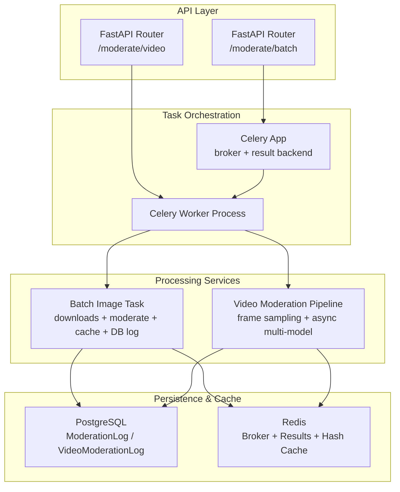
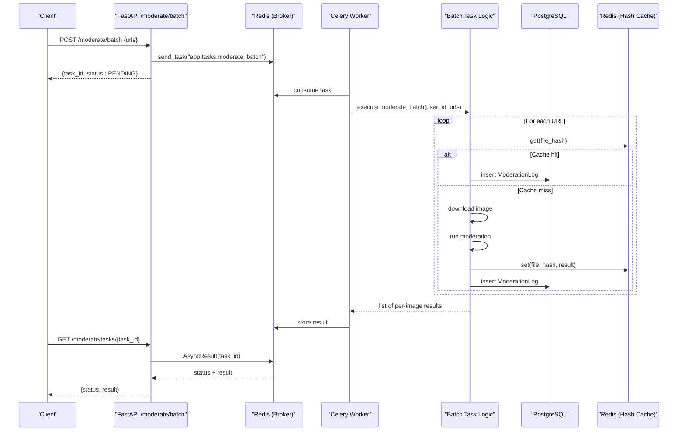
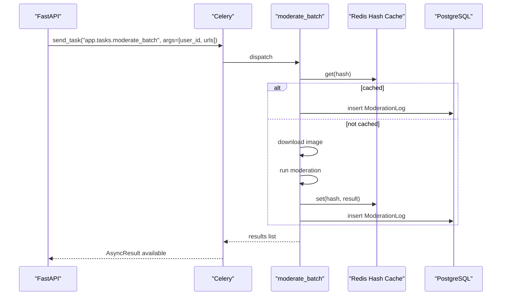
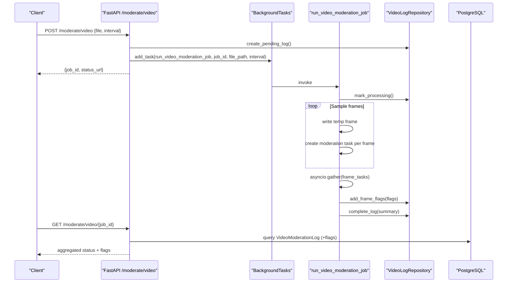
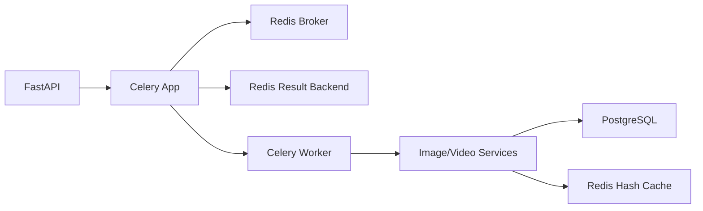

# Background Processing

<cite>
**Referenced Files in This Document**
- [celery_app.py](file://backend/app/core/celery_app.py)
- [tasks.py](file://backend/app/tasks.py)
- [moderate.py](file://backend/app/api/moderate.py)
- [video_moderation.py](file://backend/app/services/video_moderation.py)
- [config.py](file://backend/app/core/config.py)
- [redis.py](file://backend/app/core/redis.py)
- [hash_cache.py](file://backend/app/services/hash_cache.py)
- [log.py](file://backend/app/models/log.py)
- [video_log.py](file://backend/app/models/video_log.py)
- [video_log_repo.py](file://backend/app/repositories/video_log_repo.py)
- [docker-compose.yml](file://docker-compose.yml)
- [Dockerfile](file://backend/Dockerfile)
</cite>

## Table of Contents
1. Introduction
2. Project Structure
3. Core Components
4. Architecture Overview
5. Detailed Component Analysis
6. Dependency Analysis
7. Performance Considerations
8. Troubleshooting Guide
9. Conclusion

## Introduction
This document explains the background processing system for the OmniShield platform, focusing on Celery worker orchestration and task queue management. It covers how batch image moderation is queued and executed asynchronously, how video moderation jobs are processed concurrently, and how progress and results are tracked. It also provides guidance on scaling workers, monitoring health, debugging failures, and tuning performance for high-throughput moderation workloads.

## Project Structure
The background processing stack spans API endpoints that enqueue tasks, a Celery application that executes them, services that perform AI inference, and persistence layers that record job status and results. Redis serves as both broker and result backend, while PostgreSQL stores logs and job metadata.

**Diagram sources**
- [moderate.py:380-443](file://backend/app/api/moderate.py#L380-L443)
- [celery_app.py:1-20](file://backend/app/core/celery_app.py#L1-L20)
- [tasks.py:14-141](file://backend/app/tasks.py#L14-L141)
- [video_moderation.py:89-254](file://backend/app/services/video_moderation.py#L89-L254)
- [log.py:13-51](file://backend/app/models/log.py#L13-L51)
- [video_log.py:11-66](file://backend/app/models/video_log.py#L11-L66)
- [redis.py:1-21](file://backend/app/core/redis.py#L1-L21)

**Section sources**
- [moderate.py:380-443](file://backend/app/api/moderate.py#L380-L443)
- [celery_app.py:1-20](file://backend/app/core/celery_app.py#L1-L20)
- [tasks.py:14-141](file://backend/app/tasks.py#L14-L141)
- [video_moderation.py:89-254](file://backend/app/services/video_moderation.py#L89-L254)
- [config.py:44-51](file://backend/app/core/config.py#L44-L51)
- [redis.py:1-21](file://backend/app/core/redis.py#L1-L21)
- [log.py:13-51](file://backend/app/models/log.py#L13-L51)
- [video_log.py:11-66](file://backend/app/models/video_log.py#L11-L66)

## Core Components
- Celery Application: Initializes the Celery app with broker and result backend from configuration and auto-imports tasks.
- Batch Image Task: Downloads images from URLs, checks hash-based cache, runs moderation, persists logs, and returns per-item results.
- Video Moderation Pipeline: Samples frames at configurable intervals, runs concurrent multi-model moderation, aggregates flags, and updates job status.
- Progress Tracking: HTTP endpoints return Celery task status/results; video jobs expose polling endpoints backed by database records.
- Persistence: ModerationLog for image decisions; VideoModerationLog and VideoFrameFlag for video job lifecycle and flagged frames.
- Caching: SHA256-based image cache stored in Redis to avoid redundant inference.

**Section sources**
- [celery_app.py:1-20](file://backend/app/core/celery_app.py#L1-L20)
- [tasks.py:14-141](file://backend/app/tasks.py#L14-L141)
- [video_moderation.py:89-254](file://backend/app/services/video_moderation.py#L89-L254)
- [moderate.py:380-443](file://backend/app/api/moderate.py#L380-L443)
- [log.py:13-51](file://backend/app/models/log.py#L13-L51)
- [video_log.py:11-66](file://backend/app/models/video_log.py#L11-L66)
- [hash_cache.py:8-59](file://backend/app/services/hash_cache.py#L8-L59)

## Architecture Overview
The system uses FastAPI to accept requests, enqueues background work via Celery, and exposes status endpoints. Workers execute tasks against AI models and persist outcomes.

**Diagram sources**
- [moderate.py:380-443](file://backend/app/api/moderate.py#L380-L443)
- [tasks.py:14-141](file://backend/app/tasks.py#L14-L141)
- [hash_cache.py:8-59](file://backend/app/services/hash_cache.py#L8-L59)
- [log.py:13-51](file://backend/app/models/log.py#L13-L51)

## Detailed Component Analysis

### Celery Application Configuration
- The Celery app is configured with a Redis broker and result backend sourced from settings. Serializers are JSON, UTC timezone enabled, and tasks are auto-imported from the tasks module.
- No explicit routing or priority queues are defined in code; all tasks currently use the default queue.

Operational notes:
- Worker processes are launched via Docker Compose using the Celery command targeting the app module.
- Environment variables for broker/backend are provided in compose and can be overridden per environment.

**Section sources**
- [celery_app.py:1-20](file://backend/app/core/celery_app.py#L1-L20)
- [config.py:44-51](file://backend/app/core/config.py#L44-L51)
- [docker-compose.yml:68-85](file://docker-compose.yml#L68-L85)

### Batch Image Moderation Task
Responsibilities:
- Accepts user ID and a list of image URLs.
- Downloads each image to a temporary file.
- Checks hash-based cache; if present, reuses result and writes a log entry.
- On cache miss, runs moderation, caches result, and writes a log entry.
- Returns a list of per-image results including decision, confidence, labels, bounding boxes, and recommended action.

Data flow:
- Temp files are created under a dedicated directory and cleaned up after processing.
- Database session is opened within the task for synchronous writes.

Error handling:
- Per-URL exceptions are caught and recorded as failed items without aborting the entire batch.
- Cleanup occurs even when errors happen.

Progress tracking:
- Clients poll the task status endpoint to retrieve final aggregated results.

**Section sources**
- [tasks.py:14-141](file://backend/app/tasks.py#L14-L141)
- [moderate.py:380-443](file://backend/app/api/moderate.py#L380-L443)
- [log.py:13-51](file://backend/app/models/log.py#L13-L51)

#### Sequence Diagram: Batch Moderation Flow

**Diagram sources**
- [tasks.py:14-141](file://backend/app/tasks.py#L14-L141)
- [hash_cache.py:8-59](file://backend/app/services/hash_cache.py#L8-L59)
- [log.py:13-51](file://backend/app/models/log.py#L13-L51)

### Video Moderation Job
Responsibilities:
- Enqueued via FastAPI background task mechanism, which calls an async function that opens an async DB session and orchestrates processing.
- Extracts one frame per second (configurable interval), converts BGR to RGB, saves frames to a temporary directory, and runs multi-model moderation concurrently using asyncio.gather.
- Aggregates flags across frames, determines overall risk and recommendation, and persists summary plus per-frame flags.

Progress tracking:
- Job lifecycle states: pending -> processing -> completed/failed.
- Status endpoint returns aggregated data and optional frame flags.

Concurrency pattern:
- Frame-level moderation tasks are created and gathered concurrently.
- Temporary storage is isolated per job and cleaned up automatically.

**Section sources**
- [moderate.py:85-188](file://backend/app/api/moderate.py#L85-L188)
- [video_moderation.py:89-254](file://backend/app/services/video_moderation.py#L89-L254)
- [video_log_repo.py:12-115](file://backend/app/repositories/video_log_repo.py#L12-L115)
- [video_log.py:11-66](file://backend/app/models/video_log.py#L11-L66)

#### Sequence Diagram: Video Moderation Job

**Diagram sources**
- [moderate.py:85-188](file://backend/app/api/moderate.py#L85-L188)
- [video_moderation.py:89-254](file://backend/app/services/video_moderation.py#L89-L254)
- [video_log_repo.py:12-115](file://backend/app/repositories/video_log_repo.py#L12-L115)

### Error Handling and Retries
Current behavior:
- Batch task: individual item failures are captured and returned in the result list; the task continues processing remaining items.
- Video pipeline: per-frame moderation errors are logged and skipped; overall job transitions to failed state only on unrecoverable errors.

Retry logic:
- No explicit Celery retry/backoff/dead-letter configuration is present in the codebase.
- External network downloads in the batch task do not implement retries.

Recommendations (implementation guidance):
- Add retry policies to long-running or I/O-bound tasks using Celery’s retry options with exponential backoff.
- Implement dead letter queues for tasks exceeding maximum retries to isolate persistent failures.
- Introduce idempotency keys for batch items to safely reprocess failed URLs.

**Section sources**
- [tasks.py:124-141](file://backend/app/tasks.py#L124-L141)
- [video_moderation.py:166-236](file://backend/app/services/video_moderation.py#L166-L236)

### Progress Tracking and Notifications
- Batch tasks: clients poll GET /moderate/tasks/{task_id} to retrieve Celery AsyncResult status and final results.
- Video jobs: clients poll GET /moderate/video/{job_id} to retrieve updated status, aggregated metrics, and flagged frames.

Completion notifications:
- Not implemented in code. Suggested approaches include webhooks or server-sent events triggered upon completion.

**Section sources**
- [moderate.py:418-443](file://backend/app/api/moderate.py#L418-L443)
- [moderate.py:191-220](file://backend/app/api/moderate.py#L191-L220)

### Practical Examples

Scheduling moderate operations:
- Submit a batch moderation request to POST /moderate/batch with a list of image URLs. Use the returned task_id to poll GET /moderate/tasks/{task_id}.
- Submit a video moderation request to POST /moderate/video with a file and optional frame interval. Use the returned job_id to poll GET /moderate/video/{job_id}.

Monitoring worker health:
- Inspect container logs for the Celery service.
- Verify Redis connectivity and broker/backend availability.
- Check database records for job statuses and timestamps.

Scaling worker pools horizontally:
- Run multiple Celery worker containers behind the same broker/backend.
- Ensure shared filesystem access for uploads or switch to object storage for portability.

Debugging task failures:
- Review worker logs for exceptions during downloads, model inference, or DB writes.
- Validate Redis availability and TTL behavior for cached results.
- Confirm file permissions and disk space for temporary directories.

**Section sources**
- [moderate.py:380-443](file://backend/app/api/moderate.py#L380-L443)
- [moderate.py:85-188](file://backend/app/api/moderate.py#L85-L188)
- [docker-compose.yml:68-85](file://docker-compose.yml#L68-L85)

## Dependency Analysis
Key runtime dependencies:
- Celery and Kombu for task distribution.
- Redis for broker, result backend, and hash cache.
- SQLAlchemy async drivers for PostgreSQL.
- OpenCV and ONNX runtime for media processing and inference.

**Diagram sources**
- [celery_app.py:1-20](file://backend/app/core/celery_app.py#L1-L20)
- [config.py:44-51](file://backend/app/core/config.py#L44-L51)
- [redis.py:1-21](file://backend/app/core/redis.py#L1-L21)
- [video_moderation.py:89-254](file://backend/app/services/video_moderation.py#L89-L254)

**Section sources**
- [requirements.txt:16-17](file://backend/requirements.txt#L16-L17)
- [requirements.txt:107](file://backend/requirements.txt#L107)
- [requirements.txt:71-73](file://backend/requirements.txt#L71-L73)

## Performance Considerations
Worker concurrency and process model:
- Default worker concurrency is determined by Celery defaults. Tune --concurrency based on CPU cores and GPU availability.
- Consider using prefork with appropriate concurrency or gevent/gevent-based concurrency for I/O-heavy tasks.

Memory limits:
- Set memory limits per worker to prevent OOM conditions, especially when processing large videos or many frames concurrently.
- Use temporary directories scoped to each job and ensure cleanup.

Resource allocation:
- Pre-warm models in the container build stage to reduce cold-start latency.
- Separate CPU-bound workers (inference) from I/O-bound workers (downloads, DB writes) by running multiple specialized worker instances.

Throughput optimization:
- Increase Redis connection timeouts and pool sizes if needed.
- Enable caching aggressively for repeated content to minimize inference costs.
- Adjust video frame sampling interval to balance accuracy and throughput.

[No sources needed since this section provides general guidance]

## Troubleshooting Guide
Common issues and resolutions:
- Redis unavailable:
  - Symptom: Graceful degradation for cache; potential broker/backend failure.
  - Action: Verify Redis container health and connectivity; check REDIS_URL and CELERY_* settings.
- Task never completes:
  - Symptom: AsyncResult remains PENDING.
  - Action: Inspect worker logs; confirm broker connectivity; validate task name and imports.
- Disk space exhaustion:
  - Symptom: Failed downloads or frame writes.
  - Action: Monitor upload directories and temp paths; enforce size limits; clean up artifacts.
- Model initialization slowness:
  - Symptom: High first-request latency.
  - Action: Pre-cache models in Docker image; warm up workers before serving traffic.

**Section sources**
- [redis.py:1-21](file://backend/app/core/redis.py#L1-L21)
- [Dockerfile:16-17](file://backend/Dockerfile#L16-L17)
- [tasks.py:124-141](file://backend/app/tasks.py#L124-L141)
- [video_moderation.py:226-236](file://backend/app/services/video_moderation.py#L226-L236)

## Conclusion
OmniShield’s background processing leverages Celery for asynchronous batch image moderation and a custom async pipeline for video moderation. The system integrates Redis for queuing, results, and caching, and persists outcomes in PostgreSQL. While robust in design, it currently lacks explicit retry/backoff and dead-letter mechanisms. By adding these features, tuning worker concurrency and memory limits, and implementing completion notifications, the platform can achieve higher reliability and scalability for large-scale moderation workloads.