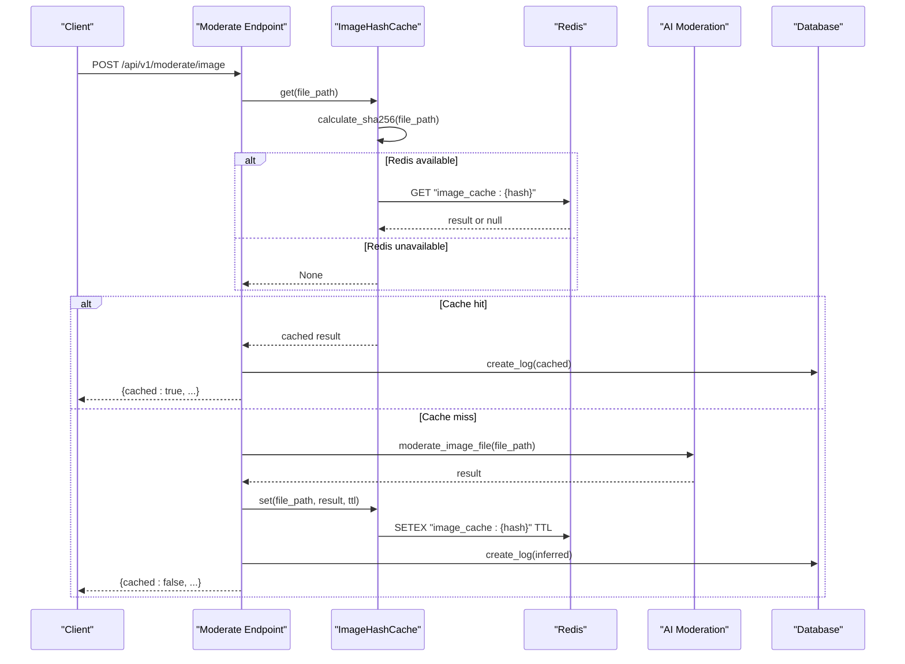
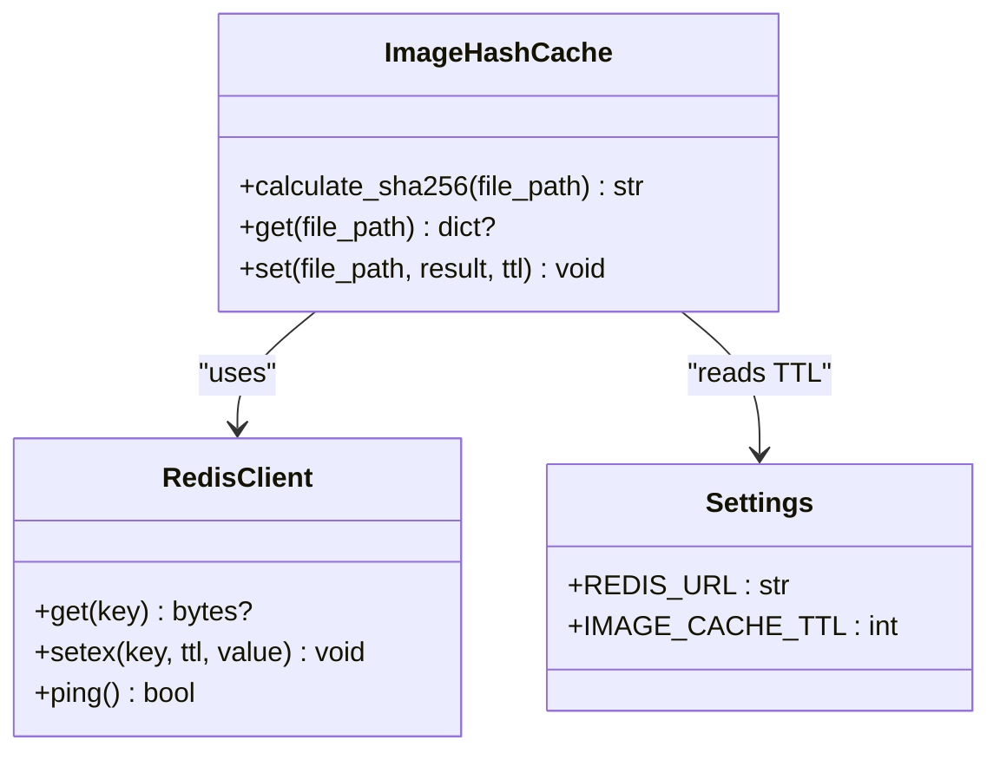
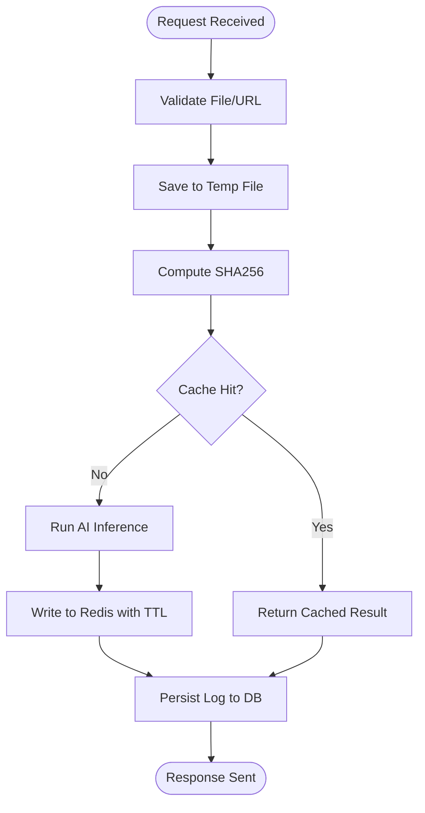
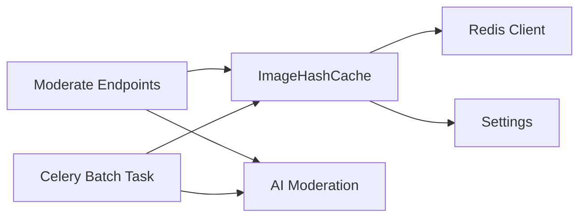

# Caching Strategies

<cite>
**Referenced Files in This Document**
- [hash_cache.py](file://backend/app/services/hash_cache.py)
- [redis.py](file://backend/app/core/redis.py)
- [config.py](file://backend/app/core/config.py)
- [moderate.py](file://backend/app/api/moderate.py)
- [tasks.py](file://backend/app/tasks.py)
- [ai_moderation.py](file://backend/app/services/ai_moderation.py)
- [multi_model_moderation.py](file://backend/app/services/multi_model_moderation.py)
- [main.py](file://backend/app/main.py)
- [ARCHITECTURE.md](file://ARCHITECTURE.md)
</cite>

## Table of Contents
1. Introduction
2. Project Structure
3. Core Components
4. Architecture Overview
5. Detailed Component Analysis
6. Dependency Analysis
7. Performance Considerations
8. Troubleshooting Guide
9. Conclusion
10. Appendices

## Introduction
This document explains the caching strategies used by the OmniShield platform to deduplicate image moderation via SHA256 hashing and integrate with Redis for high-performance lookups. It covers the ImageHashCache implementation, Redis connection pooling, cache key patterns, TTL policies, fallback behavior when Redis is unavailable, monitoring considerations, and scalability guidance for distributed deployments.

## Project Structure
The caching layer spans a small set of focused modules:
- Image hash computation and cache operations are encapsulated in a dedicated service.
- Redis connectivity is centralized and initialized once at startup.
- API endpoints and background tasks use the shared cache instance to avoid redundant AI inference.
- Configuration provides default TTLs and Redis URL.

```mermaid
graph TB
subgraph "API Layer"
A["FastAPI Router<br/>/api/v1/moderate/*"]
end
subgraph "Services"
B["ImageHashCache<br/>SHA256 + Redis get/set"]
C["AI Moderation<br/>NudeNet / Multi-model"]
end
subgraph "Core"
D["Redis Client<br/>Connection Pool"]
E["Settings<br/>REDIS_URL, TTLs"]
end
subgraph "Persistence"
F["Database (Logs)"]
end
A --> B
A --> C
B --> D
A --> F
D -. reads/writes .->|"image_cache:{sha256}"| D
E --> D
```

**Diagram sources**
- [moderate.py:223-378](file://backend/app/api/moderate.py#L223-L378)
- [hash_cache.py:8-59](file://backend/app/services/hash_cache.py#L8-L59)
- [redis.py:1-21](file://backend/app/core/redis.py#L1-L21)
- [config.py:44-51](file://backend/app/core/config.py#L44-L51)

**Section sources**
- [moderate.py:223-378](file://backend/app/api/moderate.py#L223-L378)
- [hash_cache.py:8-59](file://backend/app/services/hash_cache.py#L8-L59)
- [redis.py:1-21](file://backend/app/core/redis.py#L1-L21)
- [config.py:44-51](file://backend/app/core/config.py#L44-L51)

## Core Components
- ImageHashCache: Computes SHA256 checksums for uploaded images and performs cache get/set against Redis using keys of the form image_cache:{hash}. It avoids caching error results and marks cached responses with a flag for downstream consumers.
- Redis client: Initializes a single shared Redis client with a short connect timeout and decode_responses enabled. If initialization fails, it gracefully degrades by marking Redis as unavailable.
- Settings: Provides REDIS_URL and default TTL values such as IMAGE_CACHE_TTL.

Key responsibilities:
- Deduplication: Identical files produce identical hashes, enabling reuse of prior moderation results.
- Resilience: Graceful degradation when Redis is down; requests still proceed to model inference.
- Consistency: Cache miss triggers full inference pipeline; successful results are stored for future hits.

**Section sources**
- [hash_cache.py:8-59](file://backend/app/services/hash_cache.py#L8-L59)
- [redis.py:1-21](file://backend/app/core/redis.py#L1-L21)
- [config.py:44-51](file://backend/app/core/config.py#L44-L51)

## Architecture Overview
The moderation workflow integrates caching before invoking AI models. On cache hit, results are returned immediately and logged. On cache miss, the system runs inference, stores results in Redis, and returns them.



**Diagram sources**
- [moderate.py:223-378](file://backend/app/api/moderate.py#L223-L378)
- [hash_cache.py:13-56](file://backend/app/services/hash_cache.py#L13-L56)
- [redis.py:8-21](file://backend/app/core/redis.py#L8-L21)
- [ai_moderation.py:148-275](file://backend/app/services/ai_moderation.py#L148-L275)

## Detailed Component Analysis

### ImageHashCache: SHA256-based deduplication and Redis integration
Responsibilities:
- Compute file checksums using streaming SHA256 to support large files efficiently.
- Generate deterministic cache keys: image_cache:{sha256}.
- Provide get() and set() methods that interact with the shared Redis client.
- Avoid caching error outputs to prevent propagating transient failures.
- Mark cached responses with a boolean flag for UI and analytics.

Behavioral notes:
- get(): Computes hash, attempts Redis GET if available, parses JSON on hit, logs and returns None otherwise.
- set(): Skips error results, computes hash, serializes result with a cached flag, writes to Redis with TTL.



**Diagram sources**
- [hash_cache.py:8-59](file://backend/app/services/hash_cache.py#L8-L59)
- [redis.py:1-21](file://backend/app/core/redis.py#L1-L21)
- [config.py:44-51](file://backend/app/core/config.py#L44-L51)

**Section sources**
- [hash_cache.py:8-59](file://backend/app/services/hash_cache.py#L8-L59)

### Redis Integration: Connection pooling, availability, and TTL
- Connection pool: The client is created once and reused across processes. A low socket_connect_timeout prevents blocking during network issues.
- Availability check: A ping validates connectivity at startup; redis_available flags subsequent usage paths.
- TTL policy: Default TTL is provided by settings (e.g., IMAGE_CACHE_TTL). The cache set method uses a default TTL parameter consistent with configuration.

Operational implications:
- If Redis is unreachable, the application continues to function without caching.
- Keys are short-lived by default, balancing freshness and memory footprint.

**Section sources**
- [redis.py:1-21](file://backend/app/core/redis.py#L1-L21)
- [config.py:44-51](file://backend/app/core/config.py#L44-L51)

### Moderation Endpoints: Cache-first flow
Single-image moderation endpoint:
- Validates upload, writes to a temporary file, then checks cache by SHA256.
- On hit: constructs a database log from cached data and returns immediately.
- On miss: invokes AI moderation, caches the result, persists a log, and returns.

Batch moderation task:
- Downloads remote images, checks cache per file, skips inference on hits, and persists logs accordingly.



**Diagram sources**
- [moderate.py:223-378](file://backend/app/api/moderate.py#L223-L378)
- [tasks.py:14-142](file://backend/app/tasks.py#L14-L142)
- [hash_cache.py:13-56](file://backend/app/services/hash_cache.py#L13-L56)

**Section sources**
- [moderate.py:223-378](file://backend/app/api/moderate.py#L223-L378)
- [tasks.py:14-142](file://backend/app/tasks.py#L14-L142)

### Comprehensive Moderation: Cache key strategy considerations
The comprehensive endpoint builds a composite key suffix based on enabled detectors. While this design supports variant caching by feature flags, the current implementation does not persist comprehensive results to the cache. This allows future expansion while keeping the core cache simple and stable.

**Section sources**
- [moderate.py:446-598](file://backend/app/api/moderate.py#L446-L598)

## Dependency Analysis
- API routes depend on ImageHashCache for fast path decisions.
- ImageHashCache depends on the shared Redis client and settings.
- Background tasks mirror the same cache-first pattern for batch processing.
- AI services remain decoupled from caching concerns and are invoked only on misses.



**Diagram sources**
- [moderate.py:223-378](file://backend/app/api/moderate.py#L223-L378)
- [tasks.py:14-142](file://backend/app/tasks.py#L14-L142)
- [hash_cache.py:8-59](file://backend/app/services/hash_cache.py#L8-L59)
- [redis.py:1-21](file://backend/app/core/redis.py#L1-L21)
- [config.py:44-51](file://backend/app/core/config.py#L44-L51)

**Section sources**
- [moderate.py:223-378](file://backend/app/api/moderate.py#L223-L378)
- [tasks.py:14-142](file://backend/app/tasks.py#L14-L142)
- [hash_cache.py:8-59](file://backend/app/services/hash_cache.py#L8-L59)
- [redis.py:1-21](file://backend/app/core/redis.py#L1-L21)
- [config.py:44-51](file://backend/app/core/config.py#L44-L51)

## Performance Considerations
- Cache hit performance: Retrieval from Redis is typically sub-millisecond to low-millisecond depending on network latency and payload size. The overall response time on cache hits is dominated by minimal JSON serialization/deserialization and logging.
- Memory optimization:
  - Short TTL reduces long-term memory pressure.
  - Error results are not cached to avoid storing noisy or transient payloads.
  - Streaming SHA256 avoids loading entire files into memory.
- Distributed caching:
  - Shared Redis ensures consistency across multiple API replicas.
  - Keying by content hash guarantees global deduplication regardless of which node served the request.
- Cache warming:
  - Precompute hashes for known popular assets and seed Redis ahead of traffic spikes.
  - Use background jobs to warm cache for frequently accessed URLs or datasets.
- Monitoring:
  - Track cache hits vs misses and average retrieval times.
  - Expose Prometheus metrics where applicable and instrument Redis stats.

[No sources needed since this section provides general guidance]

## Troubleshooting Guide
Common issues and mitigations:
- Redis unavailable:
  - Symptom: All requests bypass cache and run inference.
  - Cause: Initialization failure or runtime connectivity loss.
  - Mitigation: Application continues operating; monitor redis_available and health endpoints.
- High CPU on hashing:
  - Symptom: Elevated CPU usage under heavy uploads.
  - Cause: Frequent SHA256 computations on large files.
  - Mitigation: Ensure efficient I/O and consider pre-hashing upstream if possible.
- Stale results:
  - Symptom: Outdated moderation results after model updates.
  - Cause: Long TTL retains old results.
  - Mitigation: Reduce TTL or implement versioned keys tied to model versions.
- Batch job anomalies:
  - Symptom: Some URLs fail while others succeed.
  - Cause: Network errors or invalid content.
  - Mitigation: Inspect per-URL results and retry failed entries.

**Section sources**
- [redis.py:8-21](file://backend/app/core/redis.py#L8-L21)
- [hash_cache.py:21-56](file://backend/app/services/hash_cache.py#L21-L56)
- [tasks.py:14-142](file://backend/app/tasks.py#L14-L142)

## Conclusion
OmniShield’s caching strategy centers on content-addressable deduplication via SHA256 and a resilient Redis-backed store. The approach delivers significant performance gains for repeated content, maintains correctness through graceful degradation, and scales horizontally with a shared cache. With thoughtful TTL management, monitoring, and optional cache warming, the system can handle large-scale workloads efficiently.

[No sources needed since this section summarizes without analyzing specific files]

## Appendices

### Practical Examples
- Single image moderation:
  - Upload an image; if the same file is submitted again within TTL, the response includes a cached indicator and returns almost instantly.
- Batch moderation:
  - Submit a list of URLs; each URL is checked against the cache before downloading and scanning. Hits skip inference and are persisted as logs.

**Section sources**
- [moderate.py:223-378](file://backend/app/api/moderate.py#L223-L378)
- [tasks.py:14-142](file://backend/app/tasks.py#L14-L142)

### Monitoring and Observability
- Health endpoint indicates service status and component states.
- Prometheus metrics endpoint can be enabled to expose system metrics.
- Architecture documentation outlines recommended Redis-related metrics and alert rules.

**Section sources**
- [main.py:84-108](file://backend/app/main.py#L84-L108)
- [ARCHITECTURE.md:665-716](file://ARCHITECTURE.md#L665-L716)