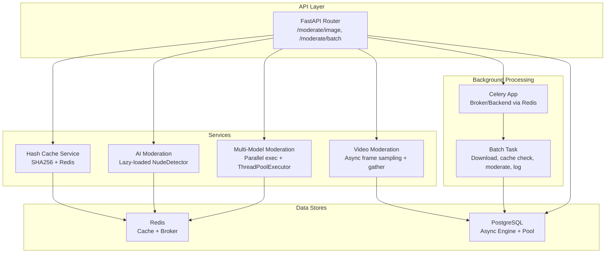
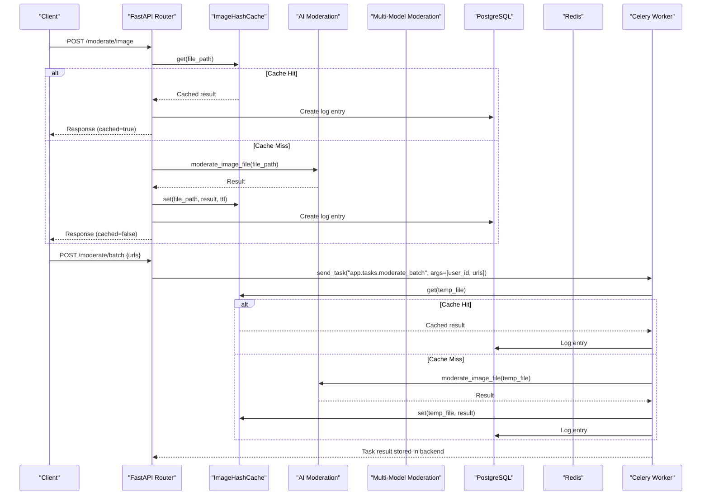
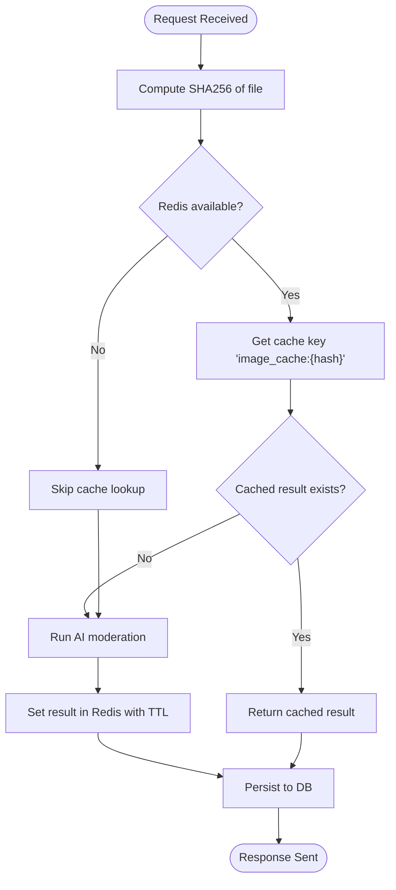
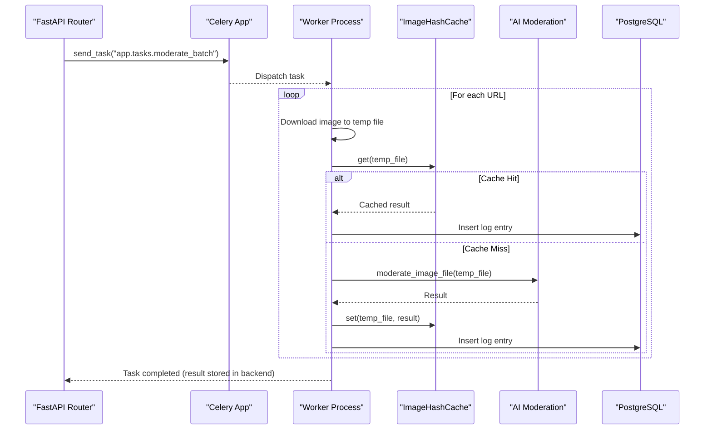
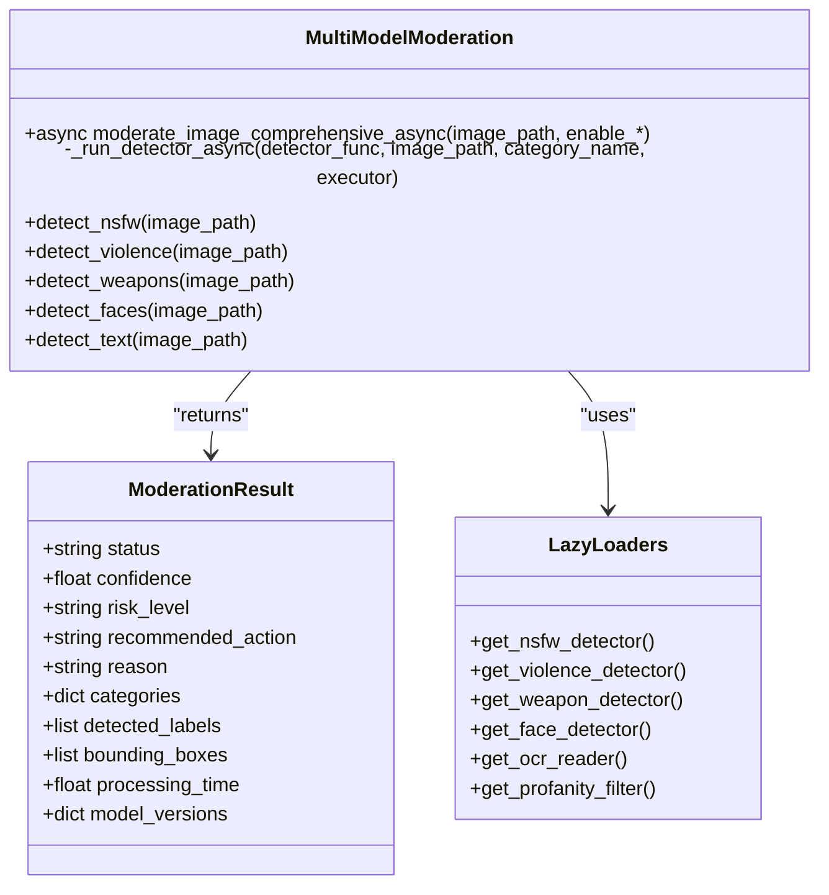
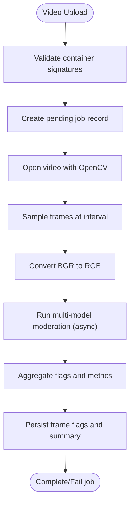
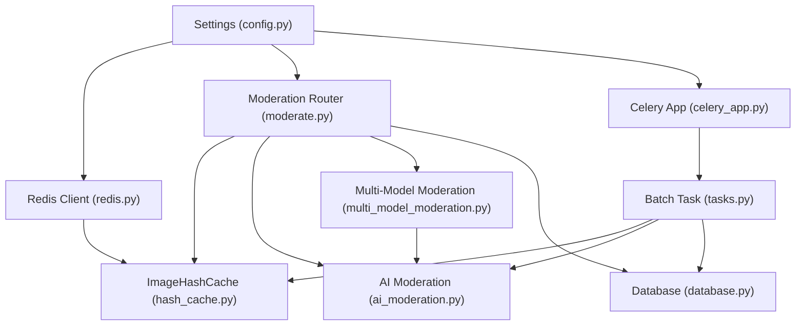

# Performance & Caching

<cite>
**Referenced Files in This Document**
- [redis.py](file://backend/app/core/redis.py)
- [hash_cache.py](file://backend/app/services/hash_cache.py)
- [celery_app.py](file://backend/app/core/celery_app.py)
- [tasks.py](file://backend/app/tasks.py)
- [ai_moderation.py](file://backend/app/services/ai_moderation.py)
- [multi_model_moderation.py](file://backend/app/services/multi_model_moderation.py)
- [video_moderation.py](file://backend/app/services/video_moderation.py)
- [moderate.py](file://backend/app/api/moderate.py)
- [database.py](file://backend/app/core/database.py)
- [config.py](file://backend/app/core/config.py)
- [ARCHITECTURE.md](file://ARCHITECTURE.md)
- [speed_test.py](file://backend/speed_test.py)
</cite>

## Table of Contents
1. [Introduction](#introduction)
2. [Project Structure](#project-structure)
3. [Core Components](#core-components)
4. [Architecture Overview](#architecture-overview)
5. [Detailed Component Analysis](#detailed-component-analysis)
6. [Dependency Analysis](#dependency-analysis)
7. [Performance Considerations](#performance-considerations)
8. [Troubleshooting Guide](#troubleshooting-guide)
9. [Conclusion](#conclusion)
10. [Appendices](#appendices)

## Introduction
This document provides comprehensive performance documentation for the OmniShield platform with a focus on caching strategies, background processing, and optimization techniques. It details:
- SHA256-based image deduplication that eliminates duplicate processing by computing content hashes and storing results in Redis with configurable TTL policies.
- The Redis caching layer implementation including connection pooling, cache invalidation strategies, and memory optimization techniques.
- Celery background task processing for batch operations, queue management, error handling, and progress tracking for long-running jobs.
- Performance benchmarks and throughput optimization strategies, including GPU auto-detection with CUDA acceleration, lazy model loading, and async/await patterns across the stack.
- Scalability considerations such as horizontal scaling, database connection pooling, read replica support, and CDN integration for static assets.
- Monitoring and profiling tools to identify bottlenecks and detect performance regressions.

## Project Structure
The backend is organized into core services (caching, AI moderation, video moderation), API endpoints, background tasks, and configuration. Key performance-related modules include:
- Redis client initialization and availability checks
- Image hashing and caching service
- Celery app and background tasks
- Multi-model moderation orchestrator with parallel execution
- Video moderation pipeline using async frame sampling and concurrent moderation
- Database session management with async engines and connection pooling
- Configuration settings for cache TTLs, GPU usage, and rate limits

**Diagram sources**
- [moderate.py](file://backend/app/api/moderate.py)
- [ai_moderation.py](file://backend/app/services/ai_moderation.py)
- [multi_model_moderation.py](file://backend/app/services/multi_model_moderation.py)
- [video_moderation.py](file://backend/app/services/video_moderation.py)
- [hash_cache.py](file://backend/app/services/hash_cache.py)
- [celery_app.py](file://backend/app/core/celery_app.py)
- [tasks.py](file://backend/app/tasks.py)
- [database.py](file://backend/app/core/database.py)
- [redis.py](file://backend/app/core/redis.py)

**Section sources**
- [moderate.py](file://backend/app/api/moderate.py)
- [ai_moderation.py](file://backend/app/services/ai_moderation.py)
- [multi_model_moderation.py](file://backend/app/services/multi_model_moderation.py)
- [video_moderation.py](file://backend/app/services/video_moderation.py)
- [hash_cache.py](file://backend/app/services/hash_cache.py)
- [celery_app.py](file://backend/app/core/celery_app.py)
- [tasks.py](file://backend/app/tasks.py)
- [database.py](file://backend/app/core/database.py)
- [redis.py](file://backend/app/core/redis.py)

## Core Components
- Redis Client Initialization: Provides a shared Redis client with short connect timeout and graceful degradation if unavailable.
- Image Hash Cache: Computes SHA256 checksums per file path, uses Redis keys prefixed with content hash, stores JSON-encoded results with TTL, and avoids caching error outputs.
- Celery App: Initializes Celery with broker and result backend configured via settings; imports tasks module for discovery.
- Batch Task: Downloads images from URLs, checks cache by SHA256, runs inference on cache miss, persists logs, and cleans up temp files.
- AI Moderation: Lazy-loads NudeDetector, applies close-up padding and fallback heuristics, maps detections to risk levels and recommended actions.
- Multi-Model Moderation: Orchestrates NSFW, violence (CLIP), weapons (YOLOv8), faces (MTCNN), and text (OCR + profanity) detectors concurrently using asyncio.gather and ThreadPoolExecutor; includes GPU auto-detection and lazy loading.
- Video Moderation: Samples frames at configurable intervals, converts BGR to RGB, runs multi-model moderation concurrently, aggregates flags, and persists results.
- Database Layer: Async engine with pool_pre_ping and session generators for FastAPI routes; sync engine used for migrations and CLI.

**Section sources**
- [redis.py](file://backend/app/core/redis.py)
- [hash_cache.py](file://backend/app/services/hash_cache.py)
- [celery_app.py](file://backend/app/core/celery_app.py)
- [tasks.py](file://backend/app/tasks.py)
- [ai_moderation.py](file://backend/app/services/ai_moderation.py)
- [multi_model_moderation.py](file://backend/app/services/multi_model_moderation.py)
- [video_moderation.py](file://backend/app/services/video_moderation.py)
- [database.py](file://backend/app/core/database.py)

## Architecture Overview
The system integrates an API layer with caching, background processing, and AI inference services. Requests are validated and routed to either real-time moderation or asynchronous batch/video pipelines. Results are cached in Redis and persisted to PostgreSQL. Background workers process queued tasks using Celery with Redis as both broker and result backend.

**Diagram sources**
- [moderate.py](file://backend/app/api/moderate.py)
- [hash_cache.py](file://backend/app/services/hash_cache.py)
- [ai_moderation.py](file://backend/app/services/ai_moderation.py)
- [tasks.py](file://backend/app/tasks.py)
- [celery_app.py](file://backend/app/core/celery_app.py)
- [database.py](file://backend/app/core/database.py)
- [redis.py](file://backend/app/core/redis.py)

## Detailed Component Analysis

### SHA256-Based Image Deduplication and Redis Caching
- Content Hashing: Each uploaded image is hashed using SHA256 over fixed-size blocks to compute a stable key independent of filename.
- Cache Keys: Keys are prefixed with a namespace and include the computed hash to ensure uniqueness across different files.
- TTL Policy: Default TTL is configurable via settings; successful results are cached while errors are intentionally skipped to avoid propagating failures.
- Graceful Degradation: If Redis is unavailable, requests proceed without caching, ensuring resilience.

**Diagram sources**
- [hash_cache.py](file://backend/app/services/hash_cache.py)
- [redis.py](file://backend/app/core/redis.py)
- [ai_moderation.py](file://backend/app/services/ai_moderation.py)
- [moderate.py](file://backend/app/api/moderate.py)

**Section sources**
- [hash_cache.py](file://backend/app/services/hash_cache.py)
- [redis.py](file://backend/app/core/redis.py)
- [config.py](file://backend/app/core/config.py)

### Redis Caching Layer Implementation
- Connection Pooling: Uses redis-py’s default connection pooling with a low socket connect timeout to prevent blocking on network issues.
- Availability Flag: Maintains a global flag indicating whether Redis is reachable; all cache operations guard against unavailability.
- Memory Optimization: Avoids caching error responses; uses compact JSON serialization and reasonable TTLs to control memory footprint.
- Invalidation Strategy: TTL-based expiration; no explicit invalidation logic is implemented beyond time-based expiry.

**Section sources**
- [redis.py](file://backend/app/core/redis.py)
- [hash_cache.py](file://backend/app/services/hash_cache.py)
- [config.py](file://backend/app/core/config.py)

### Celery Background Task Processing
- Queue Management: Tasks are sent via Celery with Redis as both broker and result backend; task serializer and accept content are configured to JSON.
- Batch Workflow: Downloads remote images, checks cache by SHA256, runs inference on cache miss, caches results, and persists logs.
- Error Handling: Individual URL processing exceptions are caught and logged; temp files are cleaned up in finally blocks.
- Progress Tracking: Clients poll task status via AsyncResult; results are stored in the backend for retrieval.

**Diagram sources**
- [celery_app.py](file://backend/app/core/celery_app.py)
- [tasks.py](file://backend/app/tasks.py)
- [hash_cache.py](file://backend/app/services/hash_cache.py)
- [ai_moderation.py](file://backend/app/services/ai_moderation.py)
- [moderate.py](file://backend/app/api/moderate.py)

**Section sources**
- [celery_app.py](file://backend/app/core/celery_app.py)
- [tasks.py](file://backend/app/tasks.py)
- [moderate.py](file://backend/app/api/moderate.py)

### Multi-Model Moderation and Parallel Execution
- Model Orchestration: Combines NSFW detection (NudeNet), violence detection (CLIP), weapon detection (YOLOv8), face detection (MTCNN), and text moderation (PaddleOCR + Profanity).
- Concurrency: Uses asyncio.gather with ThreadPoolExecutor to run CPU/GPU-bound detectors concurrently, maximizing throughput.
- GPU Auto-Detection: Models check torch.cuda.is_available() and move to GPU when possible; CLIP and MTCNN explicitly target CUDA devices.
- Lazy Loading: Detectors are initialized on first use to reduce startup latency and memory footprint.
- Aggregation: Results are aggregated with risk scoring and confidence calibration; professional portrait override reduces false positives for single-face scenarios.

**Diagram sources**
- [multi_model_moderation.py](file://backend/app/services/multi_model_moderation.py)

**Section sources**
- [multi_model_moderation.py](file://backend/app/services/multi_model_moderation.py)
- [ai_moderation.py](file://backend/app/services/ai_moderation.py)

### Video Moderation Pipeline
- Frame Sampling: Extracts one frame per second based on FPS and interval configuration; converts BGR to RGB for model compatibility.
- Concurrent Moderation: Queues each sampled frame for multi-model moderation and executes them concurrently via asyncio.gather.
- Aggregation: Collects frame-level flags, determines overall status/risk/confidence, and persists summary telemetry.
- Persistence: Updates job status transitions (pending -> processing -> complete/fail) and writes frame flags for auditability.

**Diagram sources**
- [video_moderation.py](file://backend/app/services/video_moderation.py)
- [multi_model_moderation.py](file://backend/app/services/multi_model_moderation.py)
- [moderate.py](file://backend/app/api/moderate.py)

**Section sources**
- [video_moderation.py](file://backend/app/services/video_moderation.py)
- [moderate.py](file://backend/app/api/moderate.py)

## Dependency Analysis
The following diagram shows key dependencies between components involved in performance-critical paths:

**Diagram sources**
- [config.py](file://backend/app/core/config.py)
- [redis.py](file://backend/app/core/redis.py)
- [hash_cache.py](file://backend/app/services/hash_cache.py)
- [moderate.py](file://backend/app/api/moderate.py)
- [ai_moderation.py](file://backend/app/services/ai_moderation.py)
- [multi_model_moderation.py](file://backend/app/services/multi_model_moderation.py)
- [celery_app.py](file://backend/app/core/celery_app.py)
- [tasks.py](file://backend/app/tasks.py)
- [database.py](file://backend/app/core/database.py)

**Section sources**
- [config.py](file://backend/app/core/config.py)
- [redis.py](file://backend/app/core/redis.py)
- [hash_cache.py](file://backend/app/services/hash_cache.py)
- [moderate.py](file://backend/app/api/moderate.py)
- [ai_moderation.py](file://backend/app/services/ai_moderation.py)
- [multi_model_moderation.py](file://backend/app/services/multi_model_moderation.py)
- [celery_app.py](file://backend/app/core/celery_app.py)
- [tasks.py](file://backend/app/tasks.py)
- [database.py](file://backend/app/core/database.py)

## Performance Considerations
- Cache Hit Performance: Cache lookups bypass expensive inference; typical Redis GET/SET operations are sub-millisecond under normal conditions.
- Model Inference Times: Single-image inference times vary by model complexity and hardware; comprehensive multi-model runs aggregate multiple detectors concurrently.
- Throughput Optimization:
  - Parallel execution via asyncio.gather and ThreadPoolExecutor maximizes concurrency for CPU/GPU-bound tasks.
  - Lazy model loading reduces startup overhead and memory footprint.
  - GPU auto-detection moves models to CUDA when available, improving inference speed.
  - Async/await patterns keep I/O non-blocking across API routes and background tasks.
- Database Connection Pooling: Async engine uses pool_pre_ping and session generators to efficiently manage connections.
- Horizontal Scaling: Multiple API pods behind a load balancer, Redis cluster, and auto-scaling Celery workers improve throughput.
- Read Replicas: PostgreSQL replicas can offload analytics queries to reduce primary load.
- CDN Integration: Static assets served via CDN reduce origin load and improve frontend performance.

[No sources needed since this section provides general guidance]

## Troubleshooting Guide
- Redis Unavailable:
  - Symptom: Cache misses despite repeated uploads; graceful degradation activates.
  - Action: Verify REDIS_URL connectivity; inspect redis_available flag and logs.
- Batch Task Failures:
  - Symptom: Some URLs fail while others succeed; temp files not cleaned.
  - Action: Check worker logs for download/inference errors; ensure cleanup in finally blocks.
- High Inference Latency:
  - Symptom: Slow responses for comprehensive moderation.
  - Action: Confirm GPU availability; tune max_workers; consider enabling only necessary detectors.
- Database Connection Issues:
  - Symptom: Timeouts or connection pool exhaustion.
  - Action: Review pool sizes and pool_pre_ping; monitor active connections and query durations.

**Section sources**
- [redis.py](file://backend/app/core/redis.py)
- [tasks.py](file://backend/app/tasks.py)
- [multi_model_moderation.py](file://backend/app/services/multi_model_moderation.py)
- [database.py](file://backend/app/core/database.py)

## Conclusion
OmniShield’s performance architecture leverages SHA256-based deduplication, Redis caching with TTL policies, and Celery-backed background processing to deliver scalable, high-throughput moderation. Parallel execution, lazy model loading, and GPU acceleration further optimize inference times. With robust connection pooling, horizontal scaling, and monitoring hooks, the platform maintains reliability and responsiveness under varying loads.

[No sources needed since this section summarizes without analyzing specific files]

## Appendices

### Benchmarks and Measurement
- Speed Test Utility: A simple script measures single-image scan time using NudeDetector to establish baseline inference latency.
- Frontend Metrics: The UI displays average latency for cache-miss model runs, aiding in operational visibility.

**Section sources**
- [speed_test.py](file://backend/speed_test.py)
- [ARCHITECTURE.md](file://ARCHITECTURE.md)

### Monitoring and Alerting
- Key Metrics: HTTP request duration, AI inference duration, database connection pool state, Redis cache hits/misses, and business moderation counts.
- Alert Rules: High error rates, slow inference thresholds, and database down alerts help detect regressions early.

**Section sources**
- [ARCHITECTURE.md](file://ARCHITECTURE.md)