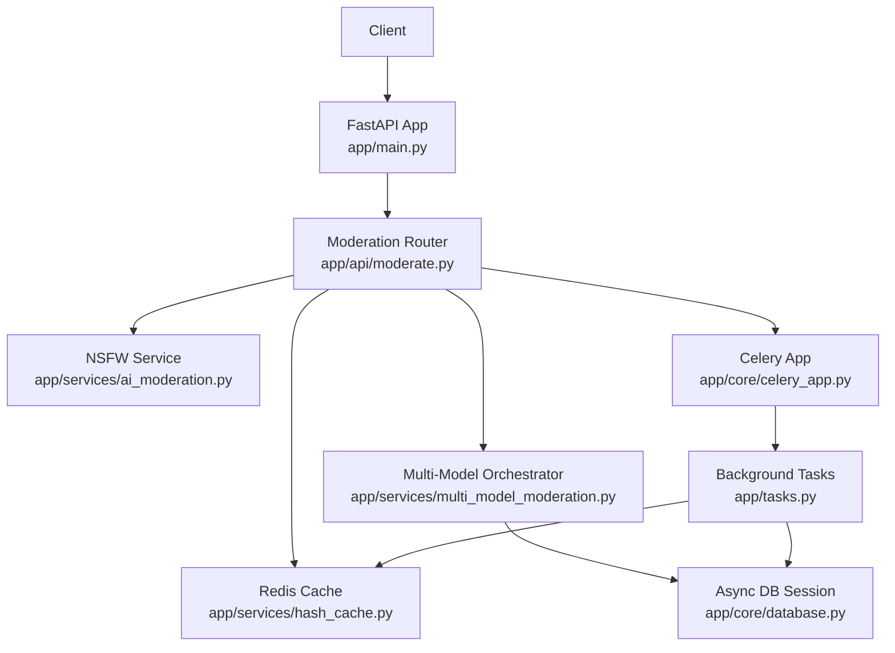
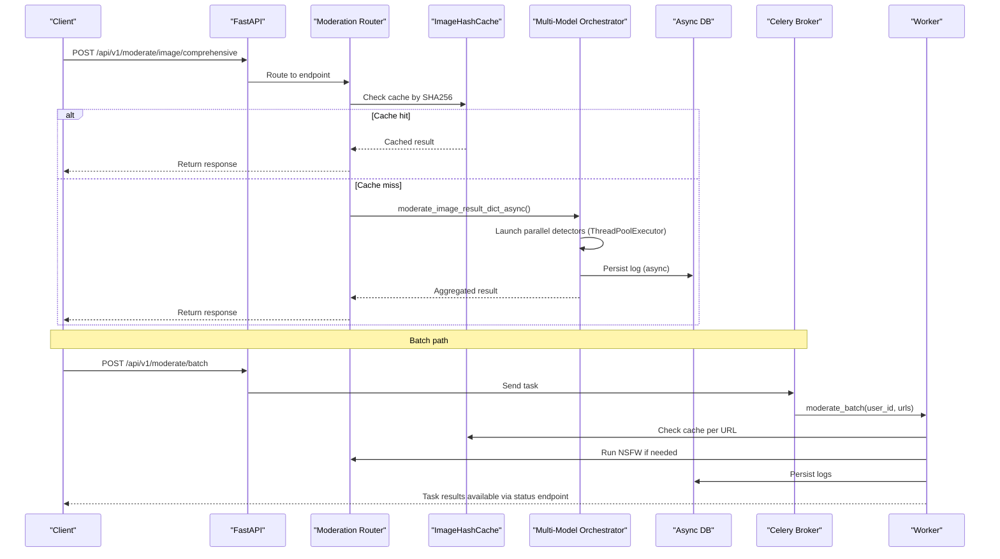
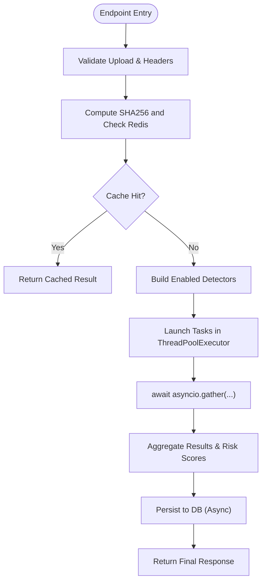
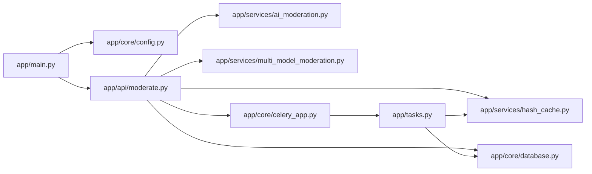

# Performance Optimization

<cite>
**Referenced Files in This Document**
- [main.py](file://backend/app/main.py)
- [config.py](file://backend/app/core/config.py)
- [database.py](file://backend/app/core/database.py)
- [redis.py](file://backend/app/core/redis.py)
- [moderate.py](file://backend/app/api/moderate.py)
- [ai_moderation.py](file://backend/app/services/ai_moderation.py)
- [multi_model_moderation.py](file://backend/app/services/multi_model_moderation.py)
- [hash_cache.py](file://backend/app/services/hash_cache.py)
- [celery_app.py](file://backend/app/core/celery_app.py)
- [tasks.py](file://backend/app/tasks.py)
- [Dockerfile](file://backend/Dockerfile)
- [docker-compose.yml](file://docker-compose.yml)
- [speed_test.py](file://backend/speed_test.py)
- [README.md](file://README.md)
</cite>

## Table of Contents
1. [Introduction](#introduction)
2. [Project Structure](#project-structure)
3. [Core Components](#core-components)
4. [Architecture Overview](#architecture-overview)
5. [Detailed Component Analysis](#detailed-component-analysis)
6. [Dependency Analysis](#dependency-analysis)
7. [Performance Considerations](#performance-considerations)
8. [Troubleshooting Guide](#troubleshooting-guide)
9. [Conclusion](#conclusion)
10. [Appendices](#appendices)

## Introduction
This document provides comprehensive performance optimization guidance for the OmniShield platform with a focus on GPU acceleration, lazy loading, and async patterns. It explains how models are initialized and loaded on demand, how asynchronous I/O is used across the stack, and how to optimize database access, caching, and background processing. It also includes benchmarking strategies, profiling recommendations, load testing approaches, and capacity planning considerations.

## Project Structure
The backend is an async FastAPI application that orchestrates multiple AI models using lazy initialization and parallel execution. Caching via Redis reduces repeated inference costs, while Celery workers handle long-running batch jobs. The Docker setup pre-caches model artifacts to reduce cold-start latency.

**Diagram sources**
- [main.py:1-126](file://backend/app/main.py#L1-L126)
- [moderate.py:1-615](file://backend/app/api/moderate.py#L1-L615)
- [hash_cache.py:1-59](file://backend/app/services/hash_cache.py#L1-L59)
- [ai_moderation.py:1-275](file://backend/app/services/ai_moderation.py#L1-L275)
- [multi_model_moderation.py:1-777](file://backend/app/services/multi_model_moderation.py#L1-L777)
- [database.py:1-50](file://backend/app/core/database.py#L1-L50)
- [celery_app.py:1-21](file://backend/app/core/celery_app.py#L1-L21)
- [tasks.py:1-142](file://backend/app/tasks.py#L1-L142)

**Section sources**
- [main.py:1-126](file://backend/app/main.py#L1-L126)
- [README.md:490-508](file://README.md#L490-L508)

## Core Components
- Async FastAPI server with middleware and metrics endpoint
- Lazy-loaded AI services (NudeNet, CLIP, YOLOv8, MTCNN, PaddleOCR)
- Parallel multi-model orchestration using asyncio + ThreadPoolExecutor
- SHA256-based image cache backed by Redis
- Async SQLAlchemy engines and session providers
- Celery worker for batch moderation
- Pre-cached model artifacts in container images

Key implementation references:
- Lazy model loaders and async orchestrator: [multi_model_moderation.py:43-147](file://backend/app/services/multi_model_moderation.py#L43-L147), [multi_model_moderation.py:491-732](file://backend/app/services/multi_model_moderation.py#L491-L732)
- NSFW pipeline entrypoint: [ai_moderation.py:148-275](file://backend/app/services/ai_moderation.py#L148-L275)
- Image hashing and Redis-backed cache: [hash_cache.py:8-59](file://backend/app/services/hash_cache.py#L8-L59)
- Async DB sessions: [database.py:19-49](file://backend/app/core/database.py#L19-L49)
- Celery app and tasks: [celery_app.py:1-21](file://backend/app/core/celery_app.py#L1-L21), [tasks.py:14-142](file://backend/app/tasks.py#L14-L142)
- Container pre-warming: [Dockerfile:16-17](file://backend/Dockerfile#L16-L17)

**Section sources**
- [multi_model_moderation.py:43-147](file://backend/app/services/multi_model_moderation.py#L43-L147)
- [ai_moderation.py:148-275](file://backend/app/services/ai_moderation.py#L148-L275)
- [hash_cache.py:8-59](file://backend/app/services/hash_cache.py#L8-L59)
- [database.py:19-49](file://backend/app/core/database.py#L19-L49)
- [celery_app.py:1-21](file://backend/app/core/celery_app.py#L1-L21)
- [tasks.py:14-142](file://backend/app/tasks.py#L14-L142)
- [Dockerfile:16-17](file://backend/Dockerfile#L16-L17)

## Architecture Overview
The system uses an async-first design:
- Requests enter FastAPI, which routes to moderation endpoints
- On cache miss, the request triggers one or more AI detectors
- Detectors are lazily initialized and run concurrently via thread pools
- Results are aggregated, cached, and persisted asynchronously
- Long-running batch jobs are offloaded to Celery workers

**Diagram sources**
- [moderate.py:446-615](file://backend/app/api/moderate.py#L446-L615)
- [hash_cache.py:21-59](file://backend/app/services/hash_cache.py#L21-L59)
- [multi_model_moderation.py:532-732](file://backend/app/services/multi_model_moderation.py#L532-L732)
- [database.py:35-49](file://backend/app/core/database.py#L35-L49)
- [celery_app.py:1-21](file://backend/app/core/celery_app.py#L1-L21)
- [tasks.py:14-142](file://backend/app/tasks.py#L14-L142)

## Detailed Component Analysis

### GPU Acceleration and Auto-Detection
- CUDA availability is checked at runtime for PyTorch-backed models (CLIP, MTCNN). When available, tensors and models are moved to GPU; otherwise CPU fallback is used.
- Configuration exposes USE_GPU and GPU_DEVICE_ID flags for environment-driven behavior.
- NudeNet detector is lazily initialized; GPU usage depends on underlying library/device placement.

Implementation references:
- CLIP device selection and tensor placement: [multi_model_moderation.py:65-82](file://backend/app/services/multi_model_moderation.py#L65-L82), [multi_model_moderation.py:243-250](file://backend/app/services/multi_model_moderation.py#L243-L250)
- MTCNN device selection: [multi_model_moderation.py:103-117](file://backend/app/services/multi_model_moderation.py#L103-L117)
- Settings for GPU control: [config.py:80-83](file://backend/app/core/config.py#L80-L83)

Recommendations:
- Ensure CUDA-capable drivers and libraries are present in production containers.
- Use torch.cuda.is_available() checks consistently before moving tensors/models to GPU.
- Monitor GPU memory utilization and consider model quantization or batching where applicable.

**Section sources**
- [multi_model_moderation.py:65-82](file://backend/app/services/multi_model_moderation.py#L65-L82)
- [multi_model_moderation.py:103-117](file://backend/app/services/multi_model_moderation.py#L103-L117)
- [multi_model_moderation.py:243-250](file://backend/app/services/multi_model_moderation.py#L243-L250)
- [config.py:80-83](file://backend/app/core/config.py#L80-L83)

### Model Initialization Strategies and Lazy Loading
- All heavy models are loaded on first use via singleton-style getters to avoid slow startup and reduce initial memory footprint.
- NudeNet detector is lazily loaded in both single-model and multi-model paths.
- Container build step pre-caches NudeNet ONNX model to minimize cold starts.

Implementation references:
- NudeNet lazy loader: [ai_moderation.py:14-22](file://backend/app/services/ai_moderation.py#L14-L22)
- Multi-model lazy loaders (CLIP, YOLOv8, MTCNN, PaddleOCR): [multi_model_moderation.py:43-147](file://backend/app/services/multi_model_moderation.py#L43-L147)
- Pre-cache NudeNet in image: [Dockerfile:16-17](file://backend/Dockerfile#L16-L17)

Best practices:
- Keep lazy loaders guarded by try/except to gracefully disable unavailable models.
- Log initialization events for observability and debugging.
- Consider warm-up requests in CI/CD to ensure models are ready before serving traffic.

**Section sources**
- [ai_moderation.py:14-22](file://backend/app/services/ai_moderation.py#L14-L22)
- [multi_model_moderation.py:43-147](file://backend/app/services/multi_model_moderation.py#L43-L147)
- [Dockerfile:16-17](file://backend/Dockerfile#L16-L17)

### Memory Management for Multiple AI Models
- Lazy loading prevents all models from occupying memory at startup.
- Temporary files created during preprocessing (e.g., padded images) are cleaned up promptly.
- Thread pool executor limits concurrency to bound memory pressure during parallel inference.

Implementation references:
- Padded image creation and cleanup: [ai_moderation.py:58-73](file://backend/app/services/ai_moderation.py#L58-L73), [ai_moderation.py:220-227](file://backend/app/services/ai_moderation.py#L220-L227)
- Executor sizing in orchestrator: [multi_model_moderation.py:598-608](file://backend/app/services/multi_model_moderation.py#L598-L608)

Guidance:
- Tune max_workers based on CPU/GPU resources and model sizes.
- Avoid retaining large intermediate arrays; process in streaming fashion where possible.
- Periodically monitor process memory and restart workers proactively if needed.

**Section sources**
- [ai_moderation.py:58-73](file://backend/app/services/ai_moderation.py#L58-L73)
- [ai_moderation.py:220-227](file://backend/app/services/ai_moderation.py#L220-L227)
- [multi_model_moderation.py:598-608](file://backend/app/services/multi_model_moderation.py#L598-L608)

### Async/Await Patterns and Concurrent Request Handling
- FastAPI endpoints are async, enabling non-blocking I/O for uploads, DB writes, and cache operations.
- Multi-model detection runs synchronously inside threads via ThreadPoolExecutor, coordinated by asyncio.gather to maximize throughput without blocking the event loop.
- Background tasks queue video moderation jobs for asynchronous processing.

Implementation references:
- Comprehensive async moderation endpoint: [moderate.py:446-615](file://backend/app/api/moderate.py#L446-L615)
- Async orchestrator and gather: [multi_model_moderation.py:532-732](file://backend/app/services/multi_model_moderation.py#L532-L732)
- Video moderation background task: [moderate.py:85-188](file://backend/app/api/moderate.py#L85-L188)

Flowchart of async orchestration:

**Diagram sources**
- [moderate.py:446-615](file://backend/app/api/moderate.py#L446-L615)
- [multi_model_moderation.py:532-732](file://backend/app/services/multi_model_moderation.py#L532-L732)

**Section sources**
- [moderate.py:446-615](file://backend/app/api/moderate.py#L446-L615)
- [multi_model_moderation.py:532-732](file://backend/app/services/multi_model_moderation.py#L532-L732)
- [moderate.py:85-188](file://backend/app/api/moderate.py#L85-L188)

### Database Optimization: Connection Pooling, Query Strategy, Read Replicas
- Async engine and session factory configured with connection pooling options suitable for high-throughput workloads.
- Sync engine provided for migrations and CLI tools.
- Environment supports PostgreSQL with async driver; read replicas can be added by routing reads to separate URLs.

Implementation references:
- Async engine and session provider: [database.py:19-49](file://backend/app/core/database.py#L19-L49)
- Sync engine for migrations: [database.py:8-17](file://backend/app/core/database.py#L8-L17)
- Async URL conversion helper: [config.py:33-42](file://backend/app/core/config.py#L33-L42)

Recommendations:
- Set appropriate pool size and recycle parameters based on workload.
- Use read replicas for analytics and reporting queries.
- Prefer parameterized queries and limit result sets.

**Section sources**
- [database.py:8-49](file://backend/app/core/database.py#L8-L49)
- [config.py:33-42](file://backend/app/core/config.py#L33-L42)

### Caching and CDN Integration
- SHA256-based deduplication caches moderation results in Redis with configurable TTL.
- Graceful degradation when Redis is unavailable ensures service continuity.
- Frontend static assets can be served via CDN; configure CORS origins accordingly.

Implementation references:
- Image hash cache class: [hash_cache.py:8-59](file://backend/app/services/hash_cache.py#L8-L59)
- Shared Redis client initialization: [redis.py:1-21](file://backend/app/core/redis.py#L1-21)
- CORS configuration: [main.py:26-39](file://backend/app/main.py#L26-L39), [config.py:88-99](file://backend/app/core/config.py#L88-L99)

Guidance:
- Enable HTTP compression (gzip/br) at the reverse proxy layer.
- Use CDN edge caching for immutable assets and set appropriate cache-control headers.
- Monitor cache hit rates and adjust TTLs based on content volatility.

**Section sources**
- [hash_cache.py:8-59](file://backend/app/services/hash_cache.py#L8-L59)
- [redis.py:1-21](file://backend/app/core/redis.py#L1-21)
- [main.py:26-39](file://backend/app/main.py#L26-L39)
- [config.py:88-99](file://backend/app/core/config.py#L88-L99)

### Background Processing and Throughput
- Celery app configured with Redis broker/backend for queuing and result storage.
- Batch moderation downloads images, checks cache, runs inference on misses, and persists logs.

Implementation references:
- Celery app config: [celery_app.py:1-21](file://backend/app/core/celery_app.py#L1-L21)
- Batch task implementation: [tasks.py:14-142](file://backend/app/tasks.py#L14-L142)

Scaling tips:
- Scale Celery workers horizontally to increase throughput.
- Separate broker/backend databases for reliability under load.
- Use idempotent task logic and retry policies for resilience.

**Section sources**
- [celery_app.py:1-21](file://backend/app/core/celery_app.py#L1-L21)
- [tasks.py:14-142](file://backend/app/tasks.py#L14-L142)

## Dependency Analysis
The following diagram shows key runtime dependencies among core modules:

**Diagram sources**
- [main.py:1-126](file://backend/app/main.py#L1-L126)
- [config.py:1-148](file://backend/app/core/config.py#L1-L148)
- [moderate.py:1-615](file://backend/app/api/moderate.py#L1-L615)
- [hash_cache.py:1-59](file://backend/app/services/hash_cache.py#L1-L59)
- [ai_moderation.py:1-275](file://backend/app/services/ai_moderation.py#L1-L275)
- [multi_model_moderation.py:1-777](file://backend/app/services/multi_model_moderation.py#L1-L777)
- [database.py:1-50](file://backend/app/core/database.py#L1-L50)
- [celery_app.py:1-21](file://backend/app/core/celery_app.py#L1-L21)
- [tasks.py:1-142](file://backend/app/tasks.py#L1-L142)

**Section sources**
- [main.py:1-126](file://backend/app/main.py#L1-L126)
- [moderate.py:1-615](file://backend/app/api/moderate.py#L1-L615)
- [multi_model_moderation.py:1-777](file://backend/app/services/multi_model_moderation.py#L1-L777)

## Performance Considerations
- GPU acceleration:
  - Ensure CUDA is available and models move to GPU when detected.
  - Profile model-specific kernels to identify bottlenecks.
- Lazy loading:
  - Keep model imports inside getters to reduce startup time and memory usage.
- Concurrency:
  - Tune ThreadPoolExecutor max_workers to match hardware capabilities.
  - Use asyncio.gather for parallelism while keeping I/O non-blocking.
- Caching:
  - Leverage SHA256 deduplication and Redis TTLs to minimize redundant inference.
- Database:
  - Use async connections and tune pool sizes; add read replicas for analytical loads.
- Background jobs:
  - Scale Celery workers and monitor queue depth.
- Observability:
  - Enable Prometheus metrics and structured logging to track latency and error rates.

[No sources needed since this section provides general guidance]

## Troubleshooting Guide
Common issues and diagnostics:
- Slow cold starts:
  - Verify model pre-caching in container images and warm-up requests.
- High latency spikes:
  - Inspect Redis connectivity and rate limiting behavior; check for cache misses.
- Out-of-memory errors:
  - Reduce max_workers, avoid retaining large intermediates, and clean temp files promptly.
- Database contention:
  - Review pool settings, query plans, and consider read replicas.
- Batch job backlogs:
  - Increase worker count, inspect broker health, and validate task idempotency.

Relevant references:
- Graceful Redis degradation: [redis.py:1-21](file://backend/app/core/redis.py#L1-21)
- Rate limiting with Redis: [rate_limit.py:1-43](file://backend/app/core/rate_limit.py#L1-L43)
- Cleanup of temporary files: [moderate.py:607-615](file://backend/app/api/moderate.py#L607-L615)

**Section sources**
- [redis.py:1-21](file://backend/app/core/redis.py#L1-21)
- [rate_limit.py:1-43](file://backend/app/core/rate_limit.py#L1-L43)
- [moderate.py:607-615](file://backend/app/api/moderate.py#L607-L615)

## Conclusion
OmniShield’s performance hinges on lazy model loading, async I/O, parallel inference, and effective caching. With GPU acceleration, tuned concurrency, and robust background processing, the platform delivers low-latency responses and scalable throughput. Continuous monitoring and capacity planning will help maintain optimal performance as workloads grow.

[No sources needed since this section summarizes without analyzing specific files]

## Appendices

### Benchmarks and Profiling
- Baseline vs optimized metrics are documented in the project README.
- Use the included speed test script to measure single-model inference times locally.
- Integrate Prometheus metrics and Grafana dashboards for ongoing performance tracking.

References:
- README benchmarks: [README.md:490-508](file://README.md#L490-L508)
- Speed test script: [speed_test.py:1-41](file://backend/speed_test.py#L1-L41)

**Section sources**
- [README.md:490-508](file://README.md#L490-L508)
- [speed_test.py:1-41](file://backend/speed_test.py#L1-L41)

### Load Testing and Capacity Planning
- Simulate concurrent moderation requests to evaluate p50/p95 latencies and throughput.
- Measure cache hit ratios and adjust TTLs accordingly.
- Plan worker scaling based on queue depth and average task duration.
- For database-heavy workloads, provision read replicas and tune connection pools.

[No sources needed since this section provides general guidance]

### Deployment Notes
- Docker Compose defines Postgres, Redis, Backend, Celery, and Frontend services.
- Ensure environment variables align with production requirements (DB URLs, Redis URLs, CORS).

References:
- Compose services and env vars: [docker-compose.yml:1-108](file://docker-compose.yml#L1-L108)

**Section sources**
- [docker-compose.yml:1-108](file://docker-compose.yml#L1-L108)