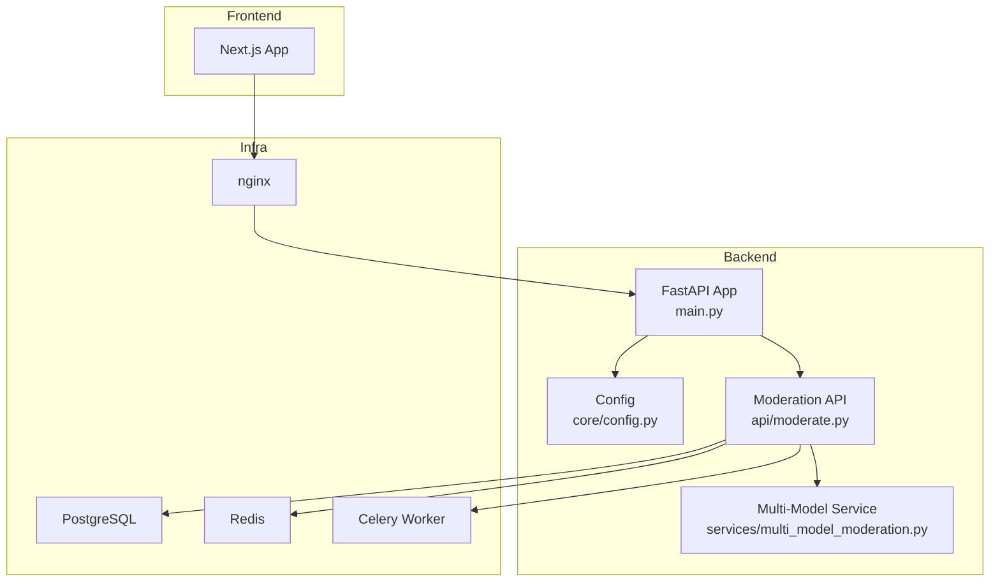
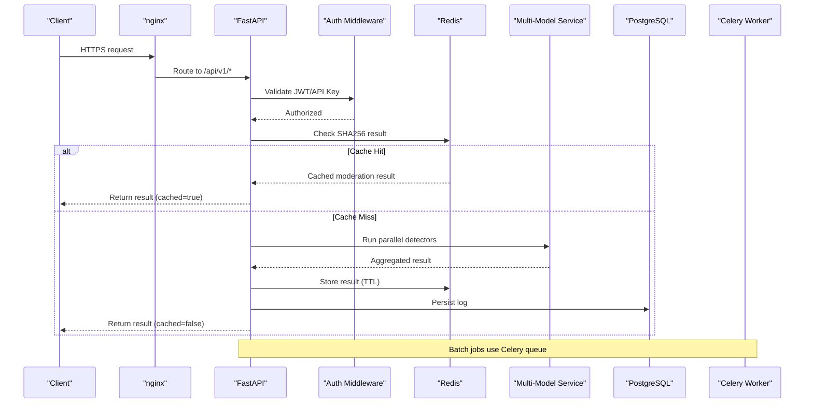
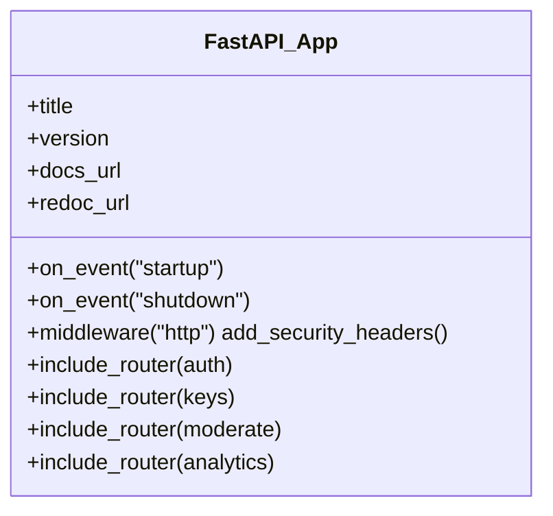
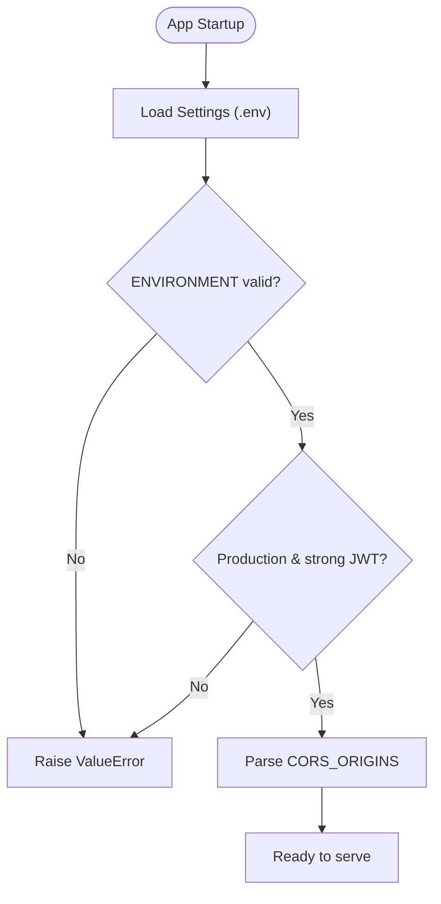
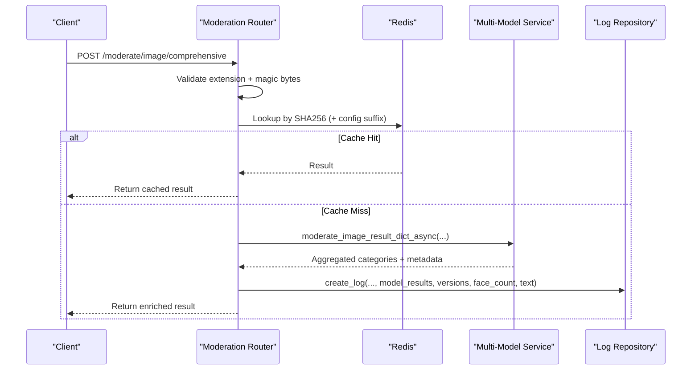
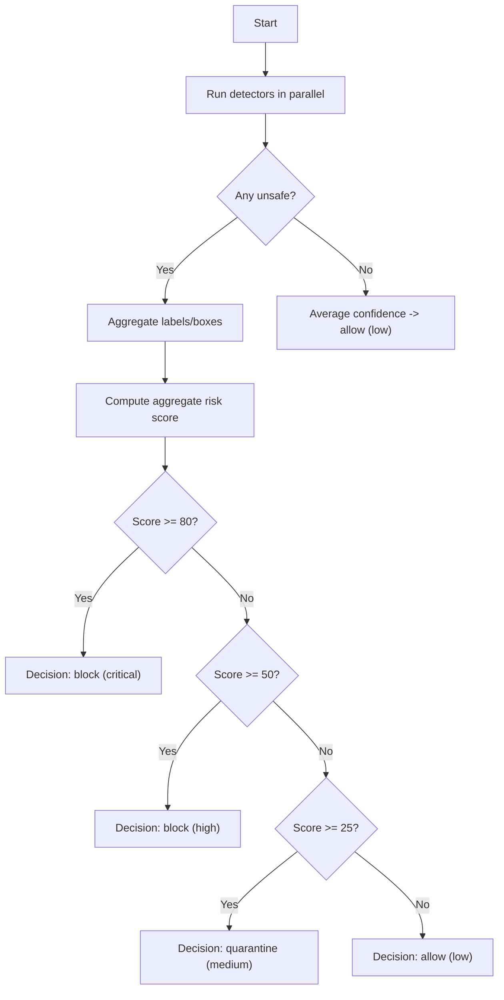
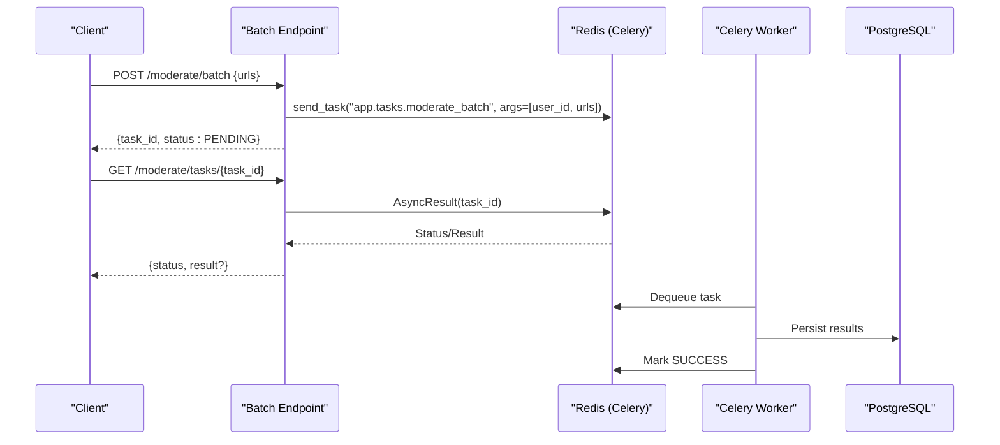
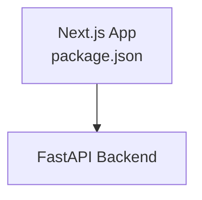
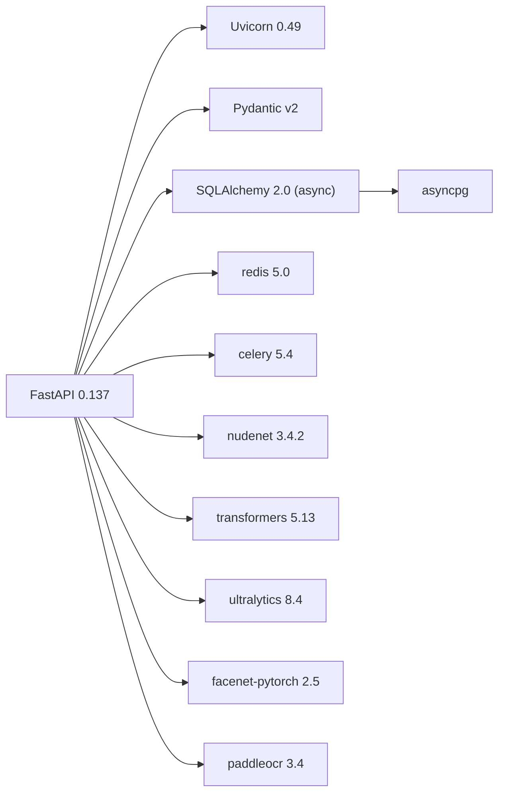
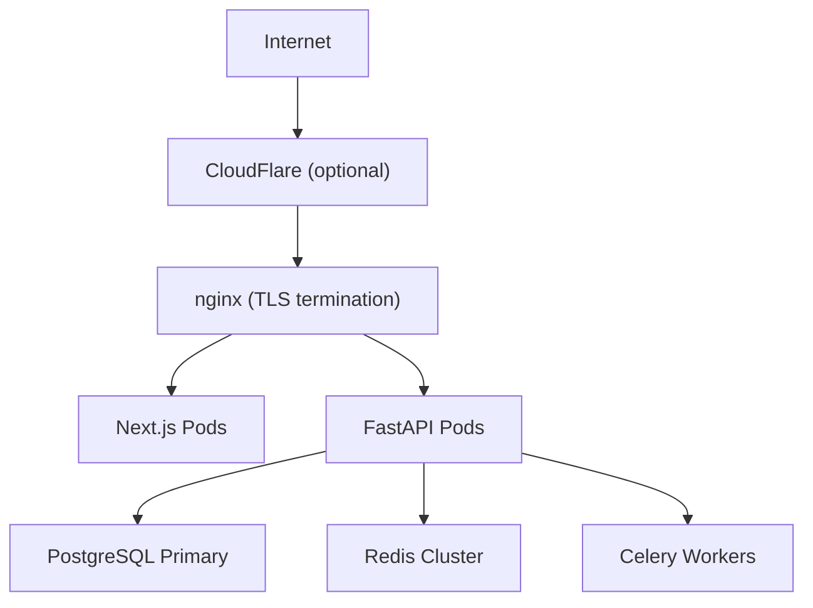

# Architecture Overview

<cite>
**Referenced Files in This Document**
- [README.md](file://nudenet_project/README.md)
- [ARCHITECTURE.md](file://nudenet_project/ARCHITECTURE.md)
- [docker-compose.yml](file://nudenet_project/docker-compose.yml)
- [DEPLOYMENT.md](file://nudenet_project/DEPLOYMENT.md)
- [backend/app/main.py](file://nudenet_project/backend/app/main.py)
- [backend/app/core/config.py](file://nudenet_project/backend/app/core/config.py)
- [backend/app/api/moderate.py](file://nudenet_project/backend/app/api/moderate.py)
- [backend/app/services/multi_model_moderation.py](file://nudenet_project/backend/app/services/multi_model_moderation.py)
- [backend/requirements.txt](file://nudenet_project/backend/requirements.txt)
- [frontend-nextjs-backup/package.json](file://nudenet_project/frontend-nextjs-backup/package.json)
</cite>

## Table of Contents
1. Introduction
2. Project Structure
3. Core Components
4. Architecture Overview
5. Detailed Component Analysis
6. Dependency Analysis
7. Performance Considerations
8. Troubleshooting Guide
9. Conclusion
10. Appendices

## Introduction
OmniShield is a production-ready, multi-tenant AI content moderation platform that combines six specialized models (NSFW, violence, weapons, faces, text, gore) to deliver comprehensive safety analysis. The system uses a microservices-style architecture with FastAPI for the backend API, Next.js for the frontend dashboard, PostgreSQL for persistence, Redis for caching and task brokering, Celery workers for background processing, and nginx as an edge load balancer and reverse proxy. It emphasizes high performance through SHA256-based image deduplication and caching, parallel model inference via async + thread pools, and robust security layers including JWT, API keys, rate limiting, and input validation.

## Project Structure
The repository organizes code into clear layers:
- Backend (FastAPI): API endpoints, core configuration, database access, services, repositories, schemas, and tasks.
- Frontend (Next.js): Dashboard UI and API client.
- Infrastructure: Docker Compose for local orchestration; deployment manifests and scripts for production and Kubernetes.

**Diagram sources**
- [backend/app/main.py:1-126](file://nudenet_project/backend/app/main.py#L1-L126)
- [backend/app/core/config.py:1-148](file://nudenet_project/backend/app/core/config.py#L1-L148)
- [backend/app/api/moderate.py:1-615](file://nudenet_project/backend/app/api/moderate.py#L1-L615)
- [backend/app/services/multi_model_moderation.py:1-777](file://nudenet_project/backend/app/services/multi_model_moderation.py#L1-L777)
- [docker-compose.yml:1-108](file://nudenet_project/docker-compose.yml#L1-L108)

**Section sources**
- [README.md:140-172](file://nudenet_project/README.md#L140-L172)
- [ARCHITECTURE.md:60-86](file://nudenet_project/ARCHITECTURE.md#L60-L86)

## Core Components
- API Server (FastAPI): Handles authentication, request validation, routing, caching, orchestration of AI pipeline, and response serialization.
- Multi-Model AI Pipeline: Executes NSFW (NudeNet), Violence (CLIP), Weapons (YOLOv8), Faces (MTCNN), Text (PaddleOCR + Profanity), and Gore (CLIP) detectors in parallel with ensemble aggregation.
- Cache Layer (Redis): Stores SHA256-based image results and supports rate limiting and session storage.
- Database (PostgreSQL): Persists users, API keys, moderation logs, and video moderation jobs.
- Background Workers (Celery): Processes batch moderation and scheduled tasks asynchronously.
- Edge Proxy (nginx): Load balances, terminates TLS, enforces security headers, and routes traffic to backend and frontend.

**Section sources**
- [backend/app/main.py:1-126](file://nudenet_project/backend/app/main.py#L1-L126)
- [backend/app/core/config.py:1-148](file://nudenet_project/backend/app/core/config.py#L1-L148)
- [backend/app/api/moderate.py:1-615](file://nudenet_project/backend/app/api/moderate.py#L1-L615)
- [backend/app/services/multi_model_moderation.py:1-777](file://nudenet_project/backend/app/services/multi_model_moderation.py#L1-L777)
- [ARCHITECTURE.md:181-222](file://nudenet_project/ARCHITECTURE.md#L181-L222)
- [docker-compose.yml:1-108](file://nudenet_project/docker-compose.yml#L1-L108)

## Architecture Overview
High-level flow from client to response:
- Client requests are routed by nginx to the FastAPI backend.
- Authentication validates JWT or API key.
- Request body is validated (magic bytes, size limits).
- Cache lookup by SHA256 returns cached results when available.
- On cache miss, the multi-model pipeline runs all enabled detectors in parallel.
- Results are aggregated via ensemble voting and risk scoring.
- Responses are cached and logged to PostgreSQL.
- Batch jobs are queued to Celery for asynchronous processing.

**Diagram sources**
- [backend/app/api/moderate.py:223-378](file://nudenet_project/backend/app/api/moderate.py#L223-L378)
- [backend/app/api/moderate.py:446-615](file://nudenet_project/backend/app/api/moderate.py#L446-L615)
- [backend/app/services/multi_model_moderation.py:532-732](file://nudenet_project/backend/app/services/multi_model_moderation.py#L532-L732)
- [ARCHITECTURE.md:224-305](file://nudenet_project/ARCHITECTURE.md#L224-L305)

## Detailed Component Analysis

### API Server (FastAPI)
- Registers routers under /api/v1, adds CORS and security headers, mounts Prometheus metrics if enabled, and provides health endpoints.
- Enforces environment-specific behavior (e.g., strict CORS in production).

**Diagram sources**
- [backend/app/main.py:1-126](file://nudenet_project/backend/app/main.py#L1-L126)

**Section sources**
- [backend/app/main.py:1-126](file://nudenet_project/backend/app/main.py#L1-L126)

### Configuration and Security
- Centralized settings loaded from environment with Pydantic Settings.
- Validates environment, JWT secret strength in production, and parses CORS origins.
- Provides URLs for async database connections, Redis, Celery broker/backend, and feature toggles for each detector.

**Diagram sources**
- [backend/app/core/config.py:1-148](file://nudenet_project/backend/app/core/config.py#L1-L148)

**Section sources**
- [backend/app/core/config.py:1-148](file://nudenet_project/backend/app/core/config.py#L1-L148)

### Moderation Endpoints
- Single image moderation: validates file extension and magic bytes, checks cache, runs NudeNet on miss, caches result, persists log.
- Comprehensive moderation: enables/disables detectors via query params, runs parallel multi-model pipeline, aggregates results, persists enhanced fields.
- Video moderation: queues job, returns status URL, polls for completion.
- Batch moderation: enqueues Celery task, returns task ID for polling.

**Diagram sources**
- [backend/app/api/moderate.py:446-615](file://nudenet_project/backend/app/api/moderate.py#L446-L615)
- [backend/app/services/multi_model_moderation.py:532-732](file://nudenet_project/backend/app/services/multi_model_moderation.py#L532-L732)

**Section sources**
- [backend/app/api/moderate.py:223-378](file://nudenet_project/backend/app/api/moderate.py#L223-L378)
- [backend/app/api/moderate.py:446-615](file://nudenet_project/backend/app/api/moderate.py#L446-L615)

### Multi-Model AI Pipeline and Ensemble Voting
- Detectors:
  - NSFW: NudeNet v3.4.2 (ONNX Runtime)
  - Violence: CLIP zero-shot classification
  - Weapons: YOLOv8 object detection
  - Faces: MTCNN face detection
  - Text: PaddleOCR + profanity filter
  - Gore: CLIP zero-shot classification
- Parallel execution: asyncio.gather with ThreadPoolExecutor to run CPU/GPU-bound inference concurrently.
- Ensemble strategy:
  - Aggregate labels and bounding boxes across models.
  - Map per-model risk levels to numeric scores and compute aggregate risk score.
  - Decision thresholds: critical/high -> block; medium -> quarantine; low -> allow.
  - Confidence calibration: max confidence among unsafe categories or average for safe.
  - Professional portrait override: reduces false positives for single-face images without weapons and low violence probability.

**Diagram sources**
- [backend/app/services/multi_model_moderation.py:532-732](file://nudenet_project/backend/app/services/multi_model_moderation.py#L532-L732)

**Section sources**
- [backend/app/services/multi_model_moderation.py:1-777](file://nudenet_project/backend/app/services/multi_model_moderation.py#L1-L777)

### Background Processing (Celery)
- Batch moderation endpoint enqueues tasks using Celery app.
- Task status polling endpoint queries AsyncResult.
- Workers consume tasks from Redis broker and persist results.

**Diagram sources**
- [backend/app/api/moderate.py:380-444](file://nudenet_project/backend/app/api/moderate.py#L380-L444)

**Section sources**
- [backend/app/api/moderate.py:380-444](file://nudenet_project/backend/app/api/moderate.py#L380-L444)

### Frontend (Next.js)
- Next.js 16 application with React 19, TypeScript, Tailwind CSS, Recharts, Axios, and Framer Motion.
- Serves dashboard pages and interacts with the FastAPI backend.

**Diagram sources**
- [frontend-nextjs-backup/package.json:1-32](file://nudenet_project/frontend-nextjs-backup/package.json#L1-L32)

**Section sources**
- [frontend-nextjs-backup/package.json:1-32](file://nudenet_project/frontend-nextjs-backup/package.json#L1-L32)

## Dependency Analysis
Key runtime dependencies include FastAPI, Uvicorn, SQLAlchemy async, asyncpg, Redis, Celery, Pydantic v2, and AI libraries (NudeNet, Transformers/CLIP, Ultralytics YOLOv8, facenet-pytorch/MTCNN, PaddleOCR).

**Diagram sources**
- [backend/requirements.txt:1-142](file://nudenet_project/backend/requirements.txt#L1-L142)

**Section sources**
- [backend/requirements.txt:1-142](file://nudenet_project/backend/requirements.txt#L1-L142)

## Performance Considerations
- Caching: SHA256-based image deduplication with Redis TTL reduces repeated inference cost.
- Parallelism: Async/await combined with ThreadPoolExecutor executes multiple models concurrently.
- Model optimization: Lazy loading, GPU auto-detection, and quantization options improve throughput.
- Scalability: Horizontal scaling of API pods, read replicas for analytics, and auto-scaling workers.
- Observability: Prometheus metrics, structured logging, and alerting rules for error rates and slow inference.

[No sources needed since this section provides general guidance]

## Troubleshooting Guide
Common issues and diagnostics:
- Database connectivity: verify connection strings and service health.
- Redis connectivity: ping Redis and inspect stats.
- Model loading failures: ensure model artifacts exist and test loader functions.
- High memory usage: monitor container stats and scale workers down if needed.
- Slow API responses: analyze DB activity, Redis hit rate, and API logs.

**Section sources**
- [DEPLOYMENT.md:718-800](file://nudenet_project/DEPLOYMENT.md#L718-L800)

## Conclusion
OmniShield’s architecture delivers a scalable, secure, and high-performance moderation platform by combining a modular FastAPI backend, a modern Next.js frontend, robust caching and queuing with Redis and Celery, persistent storage in PostgreSQL, and an edge proxy with nginx. The ensemble voting system integrates six specialized AI models in parallel to produce accurate, explainable decisions while maintaining low latency through caching and efficient resource utilization.

[No sources needed since this section summarizes without analyzing specific files]

## Appendices

### Technology Stack and Version Compatibility Matrix
- Backend: FastAPI 0.137, Uvicorn 0.49, Python 3.12+, SQLAlchemy 2.0 (async), asyncpg, Pydantic v2.
- Database: PostgreSQL 15.
- Cache/Queue: Redis 7, Celery 5.4.
- AI Models: NudeNet 3.4.2 (ONNX), Transformers 5.13 (CLIP), Ultralytics 8.4 (YOLOv8), facenet-pytorch 2.5 (MTCNN), PaddleOCR 3.4.
- Frontend: Next.js 16, React 19, TypeScript 5, Tailwind CSS 4, Recharts 3.9, Axios, Framer Motion 12.
- Infra: Docker, Docker Compose, nginx, Prometheus, Grafana.

**Section sources**
- [README.md:621-657](file://nudenet_project/README.md#L621-L657)
- [backend/requirements.txt:1-142](file://nudenet_project/backend/requirements.txt#L1-L142)
- [frontend-nextjs-backup/package.json:1-32](file://nudenet_project/frontend-nextjs-backup/package.json#L1-L32)

### Deployment Topology
- Local: docker-compose orchestrates PostgreSQL, Redis, backend, worker, and frontend containers.
- Production: nginx terminates TLS and load balances to backend/frontend; optional Cloudflare WAF/CDN upstream; Kubernetes manifests provided for stateful and stateless components.

**Diagram sources**
- [ARCHITECTURE.md:620-651](file://nudenet_project/ARCHITECTURE.md#L620-L651)
- [DEPLOYMENT.md:249-351](file://nudenet_project/DEPLOYMENT.md#L249-L351)
- [docker-compose.yml:1-108](file://nudenet_project/docker-compose.yml#L1-L108)

**Section sources**
- [docker-compose.yml:1-108](file://nudenet_project/docker-compose.yml#L1-L108)
- [DEPLOYMENT.md:149-412](file://nudenet_project/DEPLOYMENT.md#L149-L412)
- [ARCHITECTURE.md:620-651](file://nudenet_project/ARCHITECTURE.md#L620-L651)