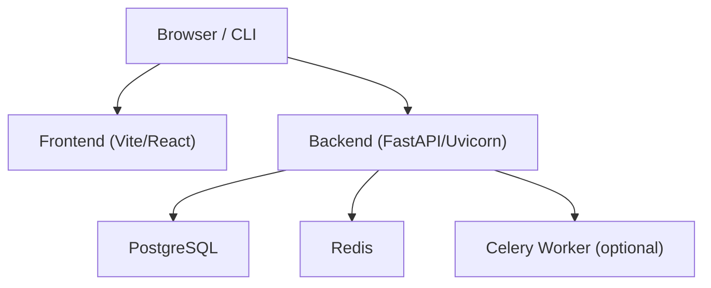
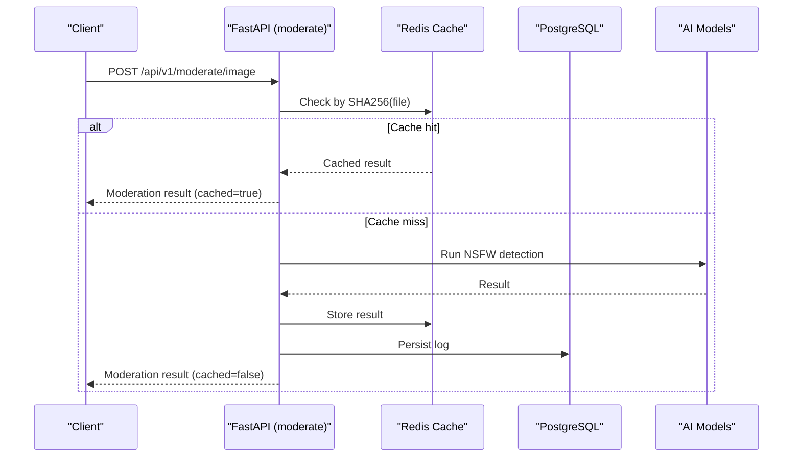
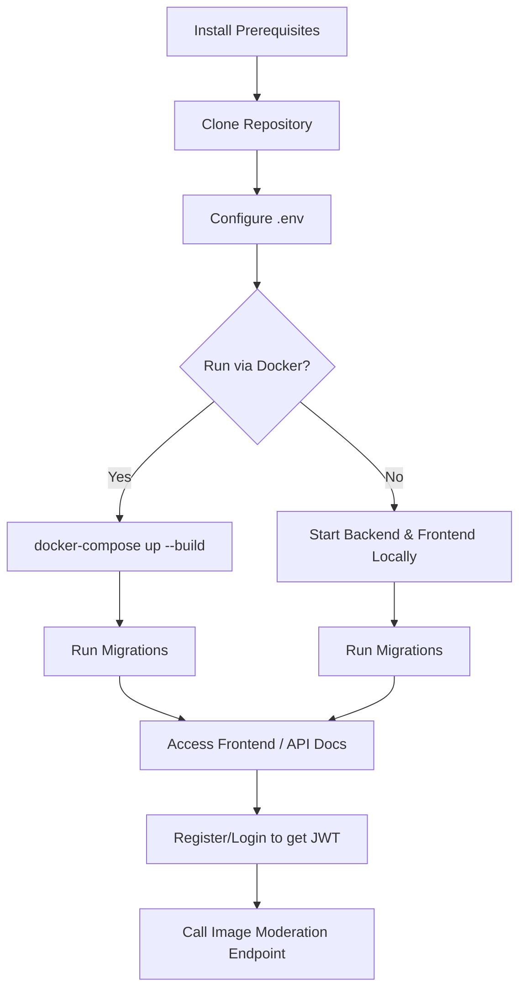
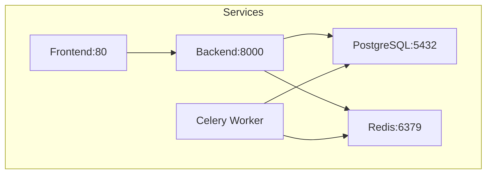

# Getting Started

<cite>
**Referenced Files in This Document**
- [README.md](file://nudenet_project/README.md)
- [QUICK_START.md](file://nudenet_project/QUICK_START.md)
- [docker-compose.yml](file://nudenet_project/docker-compose.yml)
- [backend/app/main.py](file://nudenet_project/backend/app/main.py)
- [backend/app/core/config.py](file://nudenet_project/backend/app/core/config.py)
- [backend/app/api/auth.py](file://nudenet_project/backend/app/api/auth.py)
- [backend/app/api/moderate.py](file://nudenet_project/backend/app/api/moderate.py)
- [frontend/package.json](file://nudenet_project/frontend/package.json)
</cite>

## Table of Contents
1. Introduction
2. Project Structure
3. Core Components
4. Architecture Overview
5. Detailed Component Analysis
6. Dependency Analysis
7. Performance Considerations
8. Troubleshooting Guide
9. Conclusion

## Introduction
This guide helps you quickly set up and run the OmniShield platform, then make your first API call. You will:
- Install prerequisites (Docker, Python 3.12+, Node.js 20+)
- Start services with Docker Compose (recommended)
- Configure environment variables
- Run database migrations
- Start local development servers for backend and frontend
- Authenticate via JWT or API key
- Call image moderation endpoints

The content is beginner-friendly but includes enough technical depth for experienced developers.

## Project Structure
OmniShield consists of a FastAPI backend, a React + Vite frontend, PostgreSQL, Redis, and optional Celery workers. The recommended way to run everything is Docker Compose. For local development, you can start the backend and frontend independently.

[No sources needed since this diagram shows conceptual workflow, not actual code structure]

**Section sources**
- [README.md:139-172](file://nudenet_project/README.md#L139-L172)

## Core Components
- Backend: FastAPI application with authentication, moderation endpoints, caching, and async task support.
- Frontend: React + Vite dashboard for UI interactions.
- Data and Caching: PostgreSQL for persistence, Redis for cache and task queue.
- Orchestration: Docker Compose defines all services and networking.

Key configuration and runtime behaviors are defined in the backend main entrypoint and settings module.

**Section sources**
- [backend/app/main.py:1-126](file://nudenet_project/backend/app/main.py#L1-L126)
- [backend/app/core/config.py:1-148](file://nudenet_project/backend/app/core/config.py#L1-L148)

## Architecture Overview
High-level flow for an image moderation request:
- Client sends a file to the backend.
- Backend validates input, checks cache, runs AI models on cache miss, caches results, logs to DB, and returns response.
- Optional background tasks use Celery for batch processing.

**Diagram sources**
- [backend/app/api/moderate.py:223-378](file://nudenet_project/backend/app/api/moderate.py#L223-L378)
- [backend/app/core/config.py:44-52](file://nudenet_project/backend/app/core/config.py#L44-L52)

## Detailed Component Analysis

### Prerequisites
- Docker and Docker Compose
- Python 3.12+ (for local development)
- Node.js 20+ (for frontend development)

**Section sources**
- [README.md:176-182](file://nudenet_project/README.md#L176-L182)

### Recommended Setup: Docker Compose
1. Clone the repository and navigate to the project root.
2. Create an environment file from the example and edit it with your settings.
3. Build and start all services using Docker Compose.
4. Run database migrations inside the backend container.
5. Access the frontend and API documentation.

Notes:
- The compose file defines PostgreSQL, Redis, backend, Celery worker, and frontend services.
- Health checks ensure dependencies are ready before starting dependent services.
- Ports exposed include 5432 (PostgreSQL), 6379 (Redis), 8000 (Backend), and 80 (Frontend).

**Section sources**
- [README.md:183-204](file://nudenet_project/README.md#L183-L204)
- [docker-compose.yml:1-108](file://nudenet_project/docker-compose.yml#L1-L108)

### Environment Configuration
Create a .env file at the project root and configure:
- Application name, version, and environment
- Security: JWT secret and algorithm
- Database URL (PostgreSQL or SQLite)
- Redis URLs for cache and Celery broker/backend
- Feature toggles for each AI model
- CORS origins
- Monitoring flags (Prometheus, Sentry)

Important validations:
- ENVIRONMENT must be one of development, staging, production.
- In production, JWT_SECRET cannot contain default placeholder text.

**Section sources**
- [backend/app/core/config.py:6-148](file://nudenet_project/backend/app/core/config.py#L6-L148)
- [README.md:541-576](file://nudenet_project/README.md#L541-L576)

### Database Migrations
- When running via Docker Compose, run migrations inside the backend container.
- For local development without Docker, run migrations using Alembic after installing dependencies.

**Section sources**
- [README.md:197-198](file://nudenet_project/README.md#L197-L198)
- [README.md:220-221](file://nudenet_project/README.md#L220-L221)

### Service Startup
- Docker Compose: build and start all services; access frontend and docs.
- Local development:
  - Backend: install dependencies, run migrations, start Uvicorn server.
  - Frontend: install dependencies and start Vite dev server.

**Section sources**
- [README.md:206-239](file://nudenet_project/README.md#L206-L239)

### First Authentication Flow (JWT)
Two options are supported:
- JWT Bearer Token: register, login, then include Authorization header in requests.
- API Key: generate an API key using a valid JWT, then send X-API-Key header.

Steps:
1. Register a user.
2. Login to receive a bearer token.
3. Use the token in subsequent requests.
4. Optionally create an API key and use it instead of JWT.

**Section sources**
- [README.md:245-281](file://nudenet_project/README.md#L245-L281)
- [backend/app/api/auth.py:15-90](file://nudenet_project/backend/app/api/auth.py#L15-L90)

### First Image Moderation API Calls
After authenticating:
- Single image moderation endpoint accepts multipart file uploads.
- Comprehensive multi-model moderation endpoint supports enabling/disabling specific models via query parameters.

Example flows:
- Upload an image to the single moderation endpoint.
- Upload an image to the comprehensive endpoint with feature toggles.

Response fields include decision, risk level, confidence, detected labels, bounding boxes, processing time, recommended action, reason, and whether the result was cached.

**Section sources**
- [README.md:283-380](file://nudenet_project/README.md#L283-L380)
- [backend/app/api/moderate.py:223-378](file://nudenet_project/backend/app/api/moderate.py#L223-L378)
- [backend/app/api/moderate.py:446-615](file://nudenet_project/backend/app/api/moderate.py#L446-L615)

### Local Development Setup

#### Backend (FastAPI + Uvicorn)
- Create and activate a virtual environment.
- Install Python dependencies.
- Run database migrations.
- Start the development server with auto-reload.

**Section sources**
- [README.md:208-225](file://nudenet_project/README.md#L208-L225)

#### Frontend (React + Vite)
- Install Node dependencies.
- Start the Vite development server.
- Access the UI at the configured port.

**Section sources**
- [README.md:227-239](file://nudenet_project/README.md#L227-L239)
- [frontend/package.json:1-38](file://nudenet_project/frontend/package.json#L1-L38)

### Conceptual Overview
The following diagram illustrates the typical user journey from setup to first moderation call.

[No sources needed since this diagram shows conceptual workflow, not actual code structure]

## Dependency Analysis
Service relationships and ports:
- PostgreSQL exposes 5432.
- Redis exposes 6379.
- Backend exposes 8000.
- Frontend exposes 80 (in Docker Compose).

The backend depends on PostgreSQL and Redis; Celery worker also depends on both. The frontend depends on the backend for API calls.

**Diagram sources**
- [docker-compose.yml:1-108](file://nudenet_project/docker-compose.yml#L1-L108)

**Section sources**
- [docker-compose.yml:1-108](file://nudenet_project/docker-compose.yml#L1-L108)

## Performance Considerations
- Cache hits are extremely fast due to SHA256-based deduplication.
- Multi-model inference is more expensive; consider enabling only required models.
- GPU acceleration can significantly improve model performance if available.
- Connection pooling and async I/O reduce latency under load.

[No sources needed since this section provides general guidance]

## Troubleshooting Guide

Common issues and resolutions:
- Port conflicts:
  - Identify processes using ports 8000 (backend) or 3000 (local frontend) and terminate them.
  - Adjust service ports in docker-compose.yml or local startup commands if needed.
- Database connection problems:
  - Ensure DATABASE_URL points to the correct host/port and credentials.
  - Verify PostgreSQL container is healthy and accessible.
  - Re-run migrations if schema changes are required.
- Model loading errors:
  - Confirm AI model toggles in .env match available resources.
  - Check logs for import or initialization errors.
  - Validate that required libraries are installed and compatible with your environment.
- Redis connectivity:
  - Ensure REDIS_URL and Celery broker/backend URLs are correct.
  - Verify Redis container health and network accessibility.
- CORS issues:
  - Set CORS_ORIGINS to include your frontend origin(s).
  - In production, restrict origins to trusted domains.

For additional troubleshooting steps and scripts, see the quick start guide.

**Section sources**
- [QUICK_START.md:107-149](file://nudenet_project/QUICK_START.md#L107-L149)
- [backend/app/core/config.py:88-99](file://nudenet_project/backend/app/core/config.py#L88-L99)
- [docker-compose.yml:16-39](file://nudenet_project/docker-compose.yml#L16-L39)

## Conclusion
You now have the essentials to set up OmniShield, authenticate, and call the image moderation APIs. Use Docker Compose for a consistent environment, configure .env carefully, and leverage the comprehensive moderation endpoint when you need multi-model insights. For ongoing operations, monitor logs, adjust model toggles, and tune performance based on your workload.

[No sources needed since this section summarizes without analyzing specific files]