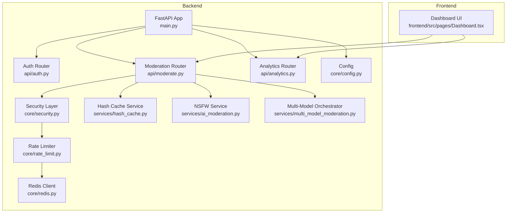
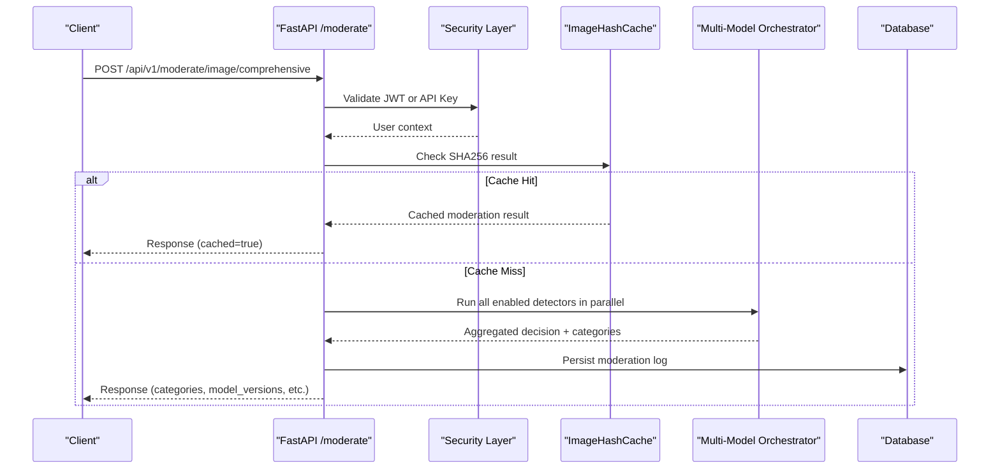
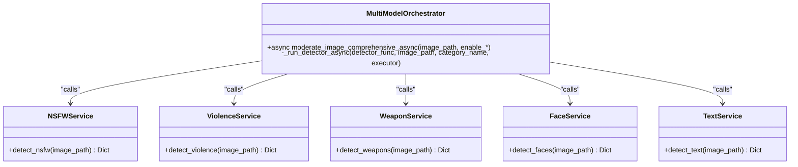
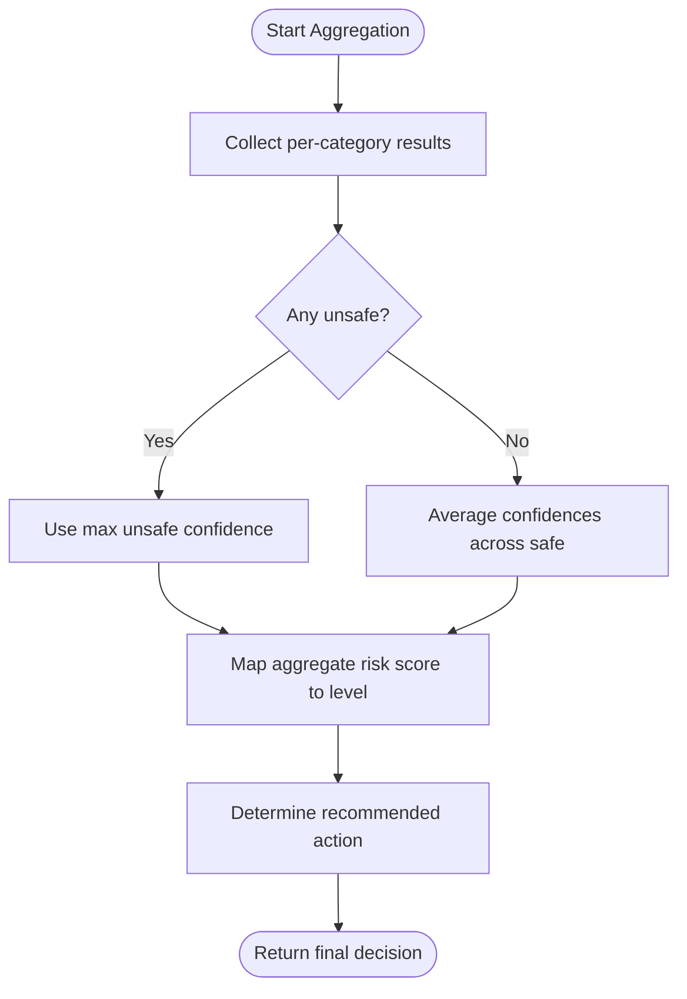
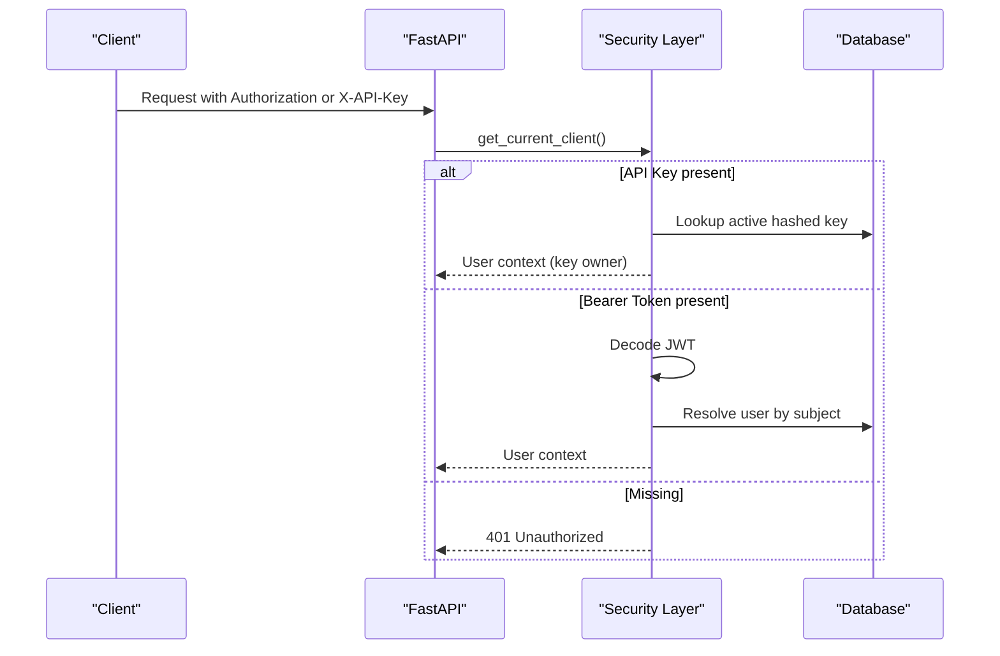
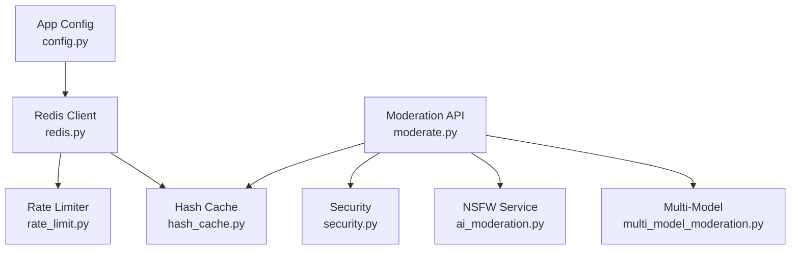

# Key Features & Capabilities

<cite>
**Referenced Files in This Document**
- [README.md](file://nudenet_project/README.md)
- [main.py](file://nudenet_project/backend/app/main.py)
- [moderate.py](file://nudenet_project/backend/app/api/moderate.py)
- [auth.py](file://nudenet_project/backend/app/api/auth.py)
- [analytics.py](file://nudenet_project/backend/app/api/analytics.py)
- [security.py](file://nudenet_project/backend/app/core/security.py)
- [rate_limit.py](file://nudenet_project/backend/app/core/rate_limit.py)
- [redis.py](file://nudenet_project/backend/app/core/redis.py)
- [config.py](file://nudenet_project/backend/app/core/config.py)
- [hash_cache.py](file://nudenet_project/backend/app/services/hash_cache.py)
- [ai_moderation.py](file://nudenet_project/backend/app/services/ai_moderation.py)
- [multi_model_moderation.py](file://nudenet_project/backend/app/services/multi_model_moderation.py)
- [Dashboard.tsx](file://nudenet_project/frontend/src/pages/Dashboard.tsx)
</cite>

## Table of Contents
1. Introduction
2. Project Structure
3. Core Components
4. Architecture Overview
5. Detailed Component Analysis
6. Dependency Analysis
7. Performance Considerations
8. Troubleshooting Guide
9. Conclusion

## Introduction
OmniShield is an enterprise-grade, multi-model AI content moderation platform that combines six specialized detectors to deliver comprehensive safety analysis for images and videos. It provides a production-ready API with dual authentication (JWT + API keys), rate limiting, batch processing, real-time analytics, and robust security controls. The system emphasizes high accuracy through ensemble voting with confidence calibration and risk assessment, while maintaining low latency via SHA256-based caching and parallel model execution.

## Project Structure
The backend is a FastAPI application organized into API routes, core services, repositories, schemas, and configuration. The frontend is a Next.js dashboard providing real-time analytics and moderation workflows.

**Diagram sources**
- [main.py:1-126](file://nudenet_project/backend/app/main.py#L1-L126)
- [auth.py:1-90](file://nudenet_project/backend/app/api/auth.py#L1-L90)
- [moderate.py:1-615](file://nudenet_project/backend/app/api/moderate.py#L1-L615)
- [analytics.py:1-70](file://nudenet_project/backend/app/api/analytics.py#L1-L70)
- [security.py:1-177](file://nudenet_project/backend/app/core/security.py#L1-L177)
- [rate_limit.py:1-44](file://nudenet_project/backend/app/core/rate_limit.py#L1-L44)
- [redis.py:1-21](file://nudenet_project/backend/app/core/redis.py#L1-L21)
- [config.py:1-148](file://nudenet_project/backend/app/core/config.py#L1-L148)
- [hash_cache.py:1-59](file://nudenet_project/backend/app/services/hash_cache.py#L1-L59)
- [ai_moderation.py:1-275](file://nudenet_project/backend/app/services/ai_moderation.py#L1-L275)
- [multi_model_moderation.py:1-777](file://nudenet_project/backend/app/services/multi_model_moderation.py#L1-L777)
- [Dashboard.tsx:1-124](file://nudenet_project/frontend/src/pages/Dashboard.tsx#L1-L124)

**Section sources**
- [main.py:1-126](file://nudenet_project/backend/app/main.py#L1-L126)
- [README.md:1-745](file://nudenet_project/README.md#L1-L745)

## Core Components
- Multi-Model Moderation Engine: Orchestrates six detectors (NSFW, Violence, Weapons, Faces, Text, Gore) with parallel execution and ensemble aggregation.
- NSFW Detection: NudeNet-based pipeline with close-up padding and heuristic fallbacks.
- Violence/Gore Detection: CLIP zero-shot classification with strict thresholds and professional portrait override.
- Weapon Detection: YOLOv8 object detection with COCO class mapping.
- Face Detection: MTCNN face localization and counting.
- Text Moderation: PaddleOCR text extraction plus profanity filtering.
- Security & Auth: Dual authentication (JWT + API keys), bcrypt hashing, role checks, and secure headers.
- Rate Limiting: Redis-backed per-minute windowed counters with graceful degradation.
- Caching: SHA256 image deduplication with Redis-backed results cache.
- Analytics Dashboard: Real-time metrics and history retrieval.

**Section sources**
- [multi_model_moderation.py:1-777](file://nudenet_project/backend/app/services/multi_model_moderation.py#L1-L777)
- [ai_moderation.py:1-275](file://nudenet_project/backend/app/services/ai_moderation.py#L1-L275)
- [security.py:1-177](file://nudenet_project/backend/app/core/security.py#L1-L177)
- [rate_limit.py:1-44](file://nudenet_project/backend/app/core/rate_limit.py#L1-L44)
- [hash_cache.py:1-59](file://nudenet_project/backend/app/services/hash_cache.py#L1-L59)
- [analytics.py:1-70](file://nudenet_project/backend/app/api/analytics.py#L1-L70)

## Architecture Overview
The request flow authenticates clients, validates inputs, checks the cache, runs models in parallel when needed, aggregates decisions, persists logs, and returns responses. The frontend consumes analytics endpoints to render live dashboards.

**Diagram sources**
- [moderate.py:446-615](file://nudenet_project/backend/app/api/moderate.py#L446-L615)
- [security.py:153-177](file://nudenet_project/backend/app/core/security.py#L153-L177)
- [hash_cache.py:21-59](file://nudenet_project/backend/app/services/hash_cache.py#L21-L59)
- [multi_model_moderation.py:532-732](file://nudenet_project/backend/app/services/multi_model_moderation.py#L532-L732)

## Detailed Component Analysis

### Six Specialized AI Models
- NSFW Detection (NudeNet): Detects explicit content with label-specific thresholds, close-up padding, and heuristic fallbacks.
- Violence Detection (CLIP): Zero-shot classification using safe vs violence-related prompts; strict thresholds reduce false positives.
- Gore Detection (CLIP): Uses violence-oriented categories to identify gore-like content within the same CLIP pipeline.
- Weapon Detection (YOLOv8): Object detection mapped to weapon-relevant classes with bounding boxes and confidence scoring.
- Face Detection (MTCNN): Locates faces and counts them; used for privacy signals and professional portrait override logic.
- Text Moderation (PaddleOCR + Profanity Filter): Extracts text from images and flags profanity.

**Diagram sources**
- [multi_model_moderation.py:149-487](file://nudenet_project/backend/app/services/multi_model_moderation.py#L149-L487)
- [multi_model_moderation.py:532-732](file://nudenet_project/backend/app/services/multi_model_moderation.py#L532-L732)
- [ai_moderation.py:148-275](file://nudenet_project/backend/app/services/ai_moderation.py#L148-L275)

**Section sources**
- [multi_model_moderation.py:1-777](file://nudenet_project/backend/app/services/multi_model_moderation.py#L1-L777)
- [ai_moderation.py:1-275](file://nudenet_project/backend/app/services/ai_moderation.py#L1-L275)

### Ensemble Voting, Confidence Calibration, and Risk Assessment
- Parallel Execution: All enabled detectors run concurrently via asyncio.gather with ThreadPoolExecutor.
- Aggregation Strategy:
  - Unsafe verdict if any detector reports unsafe.
  - Confidence uses the highest unsafe confidence or average safe confidence.
  - Risk score maps levels (low/medium/high/critical) to numeric scores and determines recommended actions.
- Professional Portrait Override: If exactly one face is detected, no weapons, and violence probability below threshold, violence is overridden to safe to reduce false positives on portraits.

**Diagram sources**
- [multi_model_moderation.py:621-732](file://nudenet_project/backend/app/services/multi_model_moderation.py#L621-L732)

**Section sources**
- [multi_model_moderation.py:532-732](file://nudenet_project/backend/app/services/multi_model_moderation.py#L532-L732)

### Platform Functionality

#### Dual Authentication (JWT + API Keys)
- JWT: OAuth2-compatible login returns access tokens; middleware decodes and resolves user identity.
- API Keys: X-API-Key header validated against hashed keys; supports per-key rate limits and last-used tracking.
- Unified client resolver prioritizes API key, falls back to Bearer token.

**Diagram sources**
- [security.py:153-177](file://nudenet_project/backend/app/core/security.py#L153-L177)
- [auth.py:41-90](file://nudenet_project/backend/app/api/auth.py#L41-L90)

**Section sources**
- [security.py:1-177](file://nudenet_project/backend/app/core/security.py#L1-L177)
- [auth.py:1-90](file://nudenet_project/backend/app/api/auth.py#L1-L90)

#### Rate Limiting
- Windowed per-minute counter stored in Redis.
- Per-user and per-API key limits enforced; fails open if Redis unavailable.

**Section sources**
- [rate_limit.py:1-44](file://nudenet_project/backend/app/core/rate_limit.py#L1-L44)
- [redis.py:1-21](file://nudenet_project/backend/app/core/redis.py#L1-L21)

#### Batch Processing
- Submit URLs for asynchronous moderation; returns task ID for status polling.
- Background workers process batches and persist results.

**Section sources**
- [moderate.py:380-443](file://nudenet_project/backend/app/api/moderate.py#L380-L443)

#### Real-Time Analytics Dashboard
- Frontend polls analytics endpoints to display total requests, safe/unsafe counts, and active API keys.
- Backend provides stats, history, and timeseries data.

**Section sources**
- [Dashboard.tsx:1-124](file://nudenet_project/frontend/src/pages/Dashboard.tsx#L1-L124)
- [analytics.py:1-70](file://nudenet_project/backend/app/api/analytics.py#L1-L70)

#### Comprehensive Logging
- Structured logging throughout API, services, and orchestration layers.
- Moderation transactions persisted with detailed metadata including categories and model versions.

**Section sources**
- [moderate.py:555-597](file://nudenet_project/backend/app/api/moderate.py#L555-L597)
- [multi_model_moderation.py:717-732](file://nudenet_project/backend/app/services/multi_model_moderation.py#L717-L732)

### Security Features
- Password Hashing: bcrypt with salt and UTF-8 truncation to 72 bytes.
- MIME Validation: Magic byte checks for JPEG/PNG/WebP and video containers.
- SQL Injection Protection: Parameterized queries via async SQLAlchemy.
- XSS Prevention: Security headers (HSTS, X-Frame-Options, nosniff, XSS protection).
- API Key Hashing: SHA256 storage and lookup.
- Environment-Specific Hardening: Production CORS restrictions and secret validation.

**Section sources**
- [security.py:24-40](file://nudenet_project/backend/app/core/security.py#L24-L40)
- [moderate.py:32-60](file://nudenet_project/backend/app/api/moderate.py#L32-L60)
- [main.py:42-57](file://nudenet_project/backend/app/main.py#L42-L57)
- [config.py:125-135](file://nudenet_project/backend/app/core/config.py#L125-L135)

## Dependency Analysis
Key runtime dependencies include Redis for caching and rate limiting, PostgreSQL for persistence, Celery for background tasks, and multiple ML libraries for inference.

**Diagram sources**
- [config.py:1-148](file://nudenet_project/backend/app/core/config.py#L1-L148)
- [redis.py:1-21](file://nudenet_project/backend/app/core/redis.py#L1-L21)
- [rate_limit.py:1-44](file://nudenet_project/backend/app/core/rate_limit.py#L1-L44)
- [hash_cache.py:1-59](file://nudenet_project/backend/app/services/hash_cache.py#L1-L59)
- [multi_model_moderation.py:1-777](file://nudenet_project/backend/app/services/multi_model_moderation.py#L1-L777)
- [ai_moderation.py:1-275](file://nudenet_project/backend/app/services/ai_moderation.py#L1-L275)
- [moderate.py:1-615](file://nudenet_project/backend/app/api/moderate.py#L1-L615)
- [security.py:1-177](file://nudenet_project/backend/app/core/security.py#L1-L177)

**Section sources**
- [config.py:1-148](file://nudenet_project/backend/app/core/config.py#L1-L148)
- [redis.py:1-21](file://nudenet_project/backend/app/core/redis.py#L1-L21)

## Performance Considerations
- Cache Hits: SHA256-based deduplication with Redis yields sub-2ms responses for repeated images.
- Model Inference:
  - NSFW (NudeNet): ~450ms median on CPU.
  - Comprehensive (6 models): ~2.1s median on CPU; GPU acceleration can significantly reduce latency.
- Optimization Strategies:
  - Lazy model loading to minimize startup time.
  - Async I/O and connection pooling.
  - Optional GPU utilization for heavy models.
  - Quantization readiness for faster inference.

Practical benchmarks are documented in the repository’s performance section.

**Section sources**
- [README.md:490-508](file://nudenet_project/README.md#L490-L508)
- [hash_cache.py:21-59](file://nudenet_project/backend/app/services/hash_cache.py#L21-L59)

## Troubleshooting Guide
- Model Loading Failures:
  - Ensure required packages are installed; first-run downloads may fail due to network issues.
  - Use the provided test script to verify each detector’s availability.
- Redis Unavailable:
  - Rate limiting and caching degrade gracefully; requests proceed without blocking.
- Video Upload Rejections:
  - Validate container signatures; ensure allowed extensions and size limits.
- High False Positives in Violence:
  - Adjust thresholds or rely on professional portrait override behavior.

**Section sources**
- [test_multi_model.py:1-205](file://nudenet_project/backend/test_multi_model.py#L1-L205)
- [rate_limit.py:12-14](file://nudenet_project/backend/app/core/rate_limit.py#L12-L14)
- [moderate.py:125-131](file://nudenet_project/backend/app/api/moderate.py#L125-L131)
- [multi_model_moderation.py:627-653](file://nudenet_project/backend/app/services/multi_model_moderation.py#L627-L653)

## Conclusion
OmniShield delivers a robust, scalable moderation platform powered by six specialized AI models. Its ensemble approach balances accuracy and precision, while caching and parallel execution ensure responsive performance. Enterprise-grade security, observability, and analytics make it suitable for production deployments across diverse use cases.