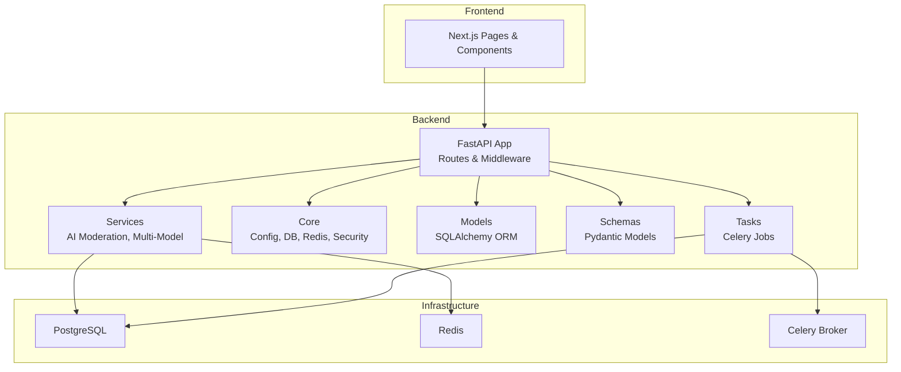
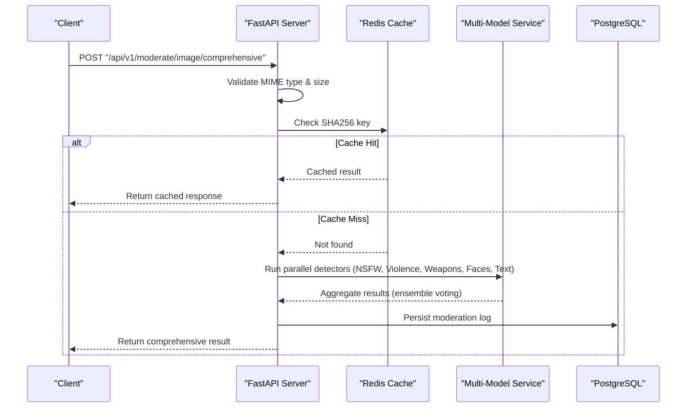
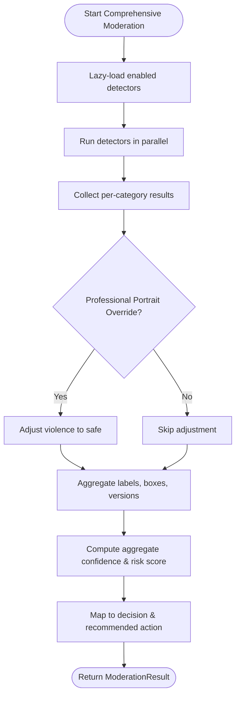
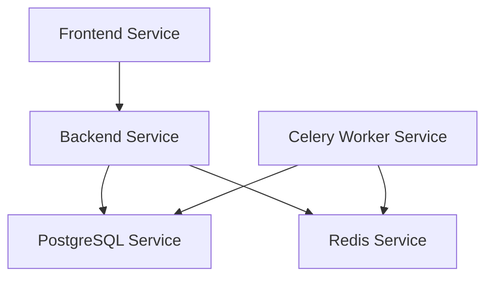

# Project Overview

<cite>
**Referenced Files in This Document**
- [README.md](file://nudenet_project/README.md)
- [ARCHITECTURE.md](file://nudenet_project/ARCHITECTURE.md)
- [docker-compose.yml](file://nudenet_project/docker-compose.yml)
- [main.py](file://nudenet_project/backend/app/main.py)
- [config.py](file://nudenet_project/backend/app/core/config.py)
- [moderate.py](file://nudenet_project/backend/app/api/moderate.py)
- [multi_model_moderation.py](file://nudenet_project/backend/app/services/multi_model_moderation.py)
- [celery_app.py](file://nudenet_project/backend/app/core/celery_app.py)
- [redis.py](file://nudenet_project/backend/app/core/redis.py)
- [log.py](file://nudenet_project/backend/app/models/log.py)
- [moderate.py (schemas)](file://nudenet_project/backend/app/schemas/moderate.py)
- [MultiModelResults.tsx](file://nudenet_project/frontend-nextjs-backup/src/components/MultiModelResults.tsx)
</cite>

## Table of Contents
1. Introduction
2. Project Structure
3. Core Components
4. Architecture Overview
5. Detailed Component Analysis
6. Dependency Analysis
7. Performance Considerations
8. Troubleshooting Guide
9. Conclusion

## Introduction
OmniShield is an enterprise-grade, production-ready AI content moderation platform that provides comprehensive moderation across multiple categories using a multi-model ensemble approach. It combines six specialized models—NSFW detection, violence detection, weapon detection, face detection, text moderation, and gore detection—to deliver accurate risk assessment and actionable decisions for images and videos. The system emphasizes high performance through SHA256-based caching, parallel model execution, and robust orchestration with FastAPI, Next.js, PostgreSQL, Redis, Celery workers, and Docker.

Key concepts:
- Comprehensive moderation: Unified decision combining outputs from multiple models with confidence calibration and risk scoring.
- Ensemble voting: Aggregation strategy that maps per-model risk levels to scores and selects the highest risk to determine final action.
- Risk assessment: Final decision mapped to recommended actions (allow, quarantine, block) based on aggregate risk thresholds.

Practical use cases:
- NSFW detection: Identify explicit content with bounding boxes and labels.
- Violence detection: Detect fighting, blood, aggression using zero-shot classification with strict thresholds to reduce false positives.
- Weapon detection: Detect knives, guns, bats, and other dangerous objects with object detection.

Public interfaces:
- Single image moderation endpoint returns decision, risk level, confidence, detected labels, bounding boxes, processing time, recommended action, reason, and cache status.
- Comprehensive multi-model moderation endpoint adds per-category results, model versions, face count, extracted text, and profanity flags.
- Batch processing endpoints queue jobs and return task IDs for asynchronous polling.

Conceptual overview for beginners:
AI content moderation uses machine learning models to automatically evaluate user-generated content against safety policies. OmniShield runs multiple models in parallel and aggregates their findings into a single, explainable decision with clear risk levels and recommended actions.

Technical overview for experienced developers:
The backend orchestrates async requests, validates inputs, checks Redis cache by SHA256 hash, executes model inference concurrently via ThreadPoolExecutor and asyncio.gather, applies ensemble voting and professional portrait override logic, persists logs to PostgreSQL, and exposes REST APIs with OpenAPI docs. The frontend renders detailed results including category breakdowns and bounding boxes.

**Section sources**
- [README.md:19-32](file://nudenet_project/README.md#L19-L32)
- [README.md:35-46](file://nudenet_project/README.md#L35-L46)
- [README.md:283-380](file://nudenet_project/README.md#L283-L380)
- [README.md:490-508](file://nudenet_project/README.md#L490-L508)

## Project Structure
High-level structure:
- Backend (FastAPI): API routes, services, core configuration, database models, repositories, schemas, tasks, migrations.
- Frontend (Next.js): Dashboard pages, components, API client.
- Orchestration: Docker Compose defines services for PostgreSQL, Redis, backend, Celery worker, and frontend.

**Diagram sources**
- [main.py:1-63](file://nudenet_project/backend/app/main.py#L1-L63)
- [moderate.py:1-23](file://nudenet_project/backend/app/api/moderate.py#L1-L23)
- [multi_model_moderation.py:1-12](file://nudenet_project/backend/app/services/multi_model_moderation.py#L1-L12)
- [config.py:1-16](file://nudenet_project/backend/app/core/config.py#L1-L16)
- [redis.py:1-21](file://nudenet_project/backend/app/core/redis.py#L1-L21)
- [log.py:1-12](file://nudenet_project/backend/app/models/log.py#L1-L12)
- [moderate.py (schemas):1-31](file://nudenet_project/backend/app/schemas/moderate.py#L1-L31)
- [celery_app.py:1-21](file://nudenet_project/backend/app/core/celery_app.py#L1-L21)

**Section sources**
- [README.md:139-172](file://nudenet_project/README.md#L139-L172)
- [ARCHITECTURE.md:60-86](file://nudenet_project/ARCHITECTURE.md#L60-L86)

## Core Components
- API Server (FastAPI): Registers routers under /api/v1, sets CORS, security headers, health endpoints, optional Prometheus metrics.
- Configuration (Settings): Centralized environment-driven settings for JWT, database URLs, Redis/Celery URLs, file ingestion limits, AI toggles, GPU usage, rate limits, CORS origins, monitoring.
- Moderation Endpoints: Image moderation (single), comprehensive multi-model moderation, batch job queuing, video moderation job submission and status polling.
- Multi-Model Service: Lazy-loaded detectors for NSFW (NudeNet), violence (CLIP), weapons (YOLOv8), faces (MTCNN), text (PaddleOCR + profanity). Async orchestrator runs detectors in parallel and aggregates results with ensemble voting and professional portrait override.
- Caching (Redis): SHA256-based deduplication and result caching; connection initialization with graceful degradation.
- Database (PostgreSQL): Moderation logs with JSONB fields for model results, versions, face count, detected text, profanity flag.
- Background Workers (Celery): Task broker and result backend configured via settings; used for batch moderation and scheduled jobs.
- Frontend (Next.js): Displays overall decision, risk level, confidence, action, processing time, per-category results, model versions, detected labels, and bounding boxes.

**Section sources**
- [main.py:1-63](file://nudenet_project/backend/app/main.py#L1-L63)
- [config.py:1-148](file://nudenet_project/backend/app/core/config.py#L1-L148)
- [moderate.py:223-378](file://nudenet_project/backend/app/api/moderate.py#L223-L378)
- [moderate.py:446-615](file://nudenet_project/backend/app/api/moderate.py#L446-L615)
- [multi_model_moderation.py:43-147](file://nudenet_project/backend/app/services/multi_model_moderation.py#L43-L147)
- [multi_model_moderation.py:489-732](file://nudenet_project/backend/app/services/multi_model_moderation.py#L489-L732)
- [redis.py:1-21](file://nudenet_project/backend/app/core/redis.py#L1-L21)
- [log.py:13-51](file://nudenet_project/backend/app/models/log.py#L13-L51)
- [celery_app.py:1-21](file://nudenet_project/backend/app/core/celery_app.py#L1-L21)
- [MultiModelResults.tsx:1-263](file://nudenet_project/frontend-nextjs-backup/src/components/MultiModelResults.tsx#L1-L263)

## Architecture Overview
End-to-end request flow for comprehensive moderation:
- Client uploads image to /api/v1/moderate/image/comprehensive.
- Backend validates MIME type via magic bytes, computes SHA256, checks Redis cache.
- On cache miss, launches parallel model inference (NSFW, violence, weapons, faces, text).
- Results aggregated via ensemble voting; professional portrait override may adjust low-confidence violence detections.
- Response includes decision, risk level, confidence, labels, bounding boxes, processing time, recommended action, reason, plus per-category details and model versions.
- Logs persisted to PostgreSQL; cache updated if applicable.

**Diagram sources**
- [moderate.py:446-615](file://nudenet_project/backend/app/api/moderate.py#L446-L615)
- [multi_model_moderation.py:532-732](file://nudenet_project/backend/app/services/multi_model_moderation.py#L532-L732)
- [redis.py:1-21](file://nudenet_project/backend/app/core/redis.py#L1-L21)
- [log.py:13-51](file://nudenet_project/backend/app/models/log.py#L13-L51)

**Section sources**
- [README.md:88-136](file://nudenet_project/README.md#L88-L136)
- [ARCHITECTURE.md:224-304](file://nudenet_project/ARCHITECTURE.md#L224-L304)

## Detailed Component Analysis

### API Layer (FastAPI)
Responsibilities:
- Register routers under /api/v1.
- Configure CORS and security headers.
- Provide health and root endpoints.
- Expose moderation endpoints for single image, comprehensive multi-model, batch, and video moderation.

Key endpoints:
- POST /api/v1/moderate/image: Single image moderation with cache and logging.
- POST /api/v1/moderate/image/comprehensive: Multi-model moderation with per-category results and metadata.
- POST /api/v1/moderate/batch: Queue batch moderation via Celery.
- GET /api/v1/moderate/tasks/{task_id}: Poll batch task status.
- POST /api/v1/moderate/video: Queue video moderation job.
- GET /api/v1/moderate/video/{job_id}: Poll video job status.

Request/response highlights:
- Inputs include uploaded files or URL lists; query parameters enable/disable specific models.
- Responses include decision, risk_level, confidence, detected_labels, bounding_boxes, processing_time, recommended_action, reason, and additional fields like categories, model_versions, face_count, detected_text, contains_profanity.

**Section sources**
- [main.py:1-63](file://nudenet_project/backend/app/main.py#L1-L63)
- [moderate.py:223-378](file://nudenet_project/backend/app/api/moderate.py#L223-L378)
- [moderate.py:380-444](file://nudenet_project/backend/app/api/moderate.py#L380-L444)
- [moderate.py:446-615](file://nudenet_project/backend/app/api/moderate.py#L446-L615)
- [moderate.py:85-221](file://nudenet_project/backend/app/api/moderate.py#L85-L221)
- [moderate.py (schemas):1-31](file://nudenet_project/backend/app/schemas/moderate.py#L1-L31)

### Multi-Model Service (Ensemble Voting)
Design:
- Lazy loading of detectors to minimize startup overhead.
- Parallel execution via ThreadPoolExecutor and asyncio.gather.
- Per-detector functions return structured results with status, confidence, risk_level, labels, bounding boxes, reasons, and model identifiers.
- Aggregation logic:
  - Collect unsafe categories and compute aggregate confidence and risk score.
  - Map risk levels to numeric scores and select maximum for unsafe verdicts.
  - Professional portrait override: If exactly one face is detected, no weapons, and violence probability below threshold, override violence to safe.
- Returns ModerationResult dataclass with categories, model_versions, face_count, detected_text, contains_profanity.

**Diagram sources**
- [multi_model_moderation.py:43-147](file://nudenet_project/backend/app/services/multi_model_moderation.py#L43-L147)
- [multi_model_moderation.py:489-732](file://nudenet_project/backend/app/services/multi_model_moderation.py#L489-L732)

**Section sources**
- [multi_model_moderation.py:179-301](file://nudenet_project/backend/app/services/multi_model_moderation.py#L179-L301)
- [multi_model_moderation.py:304-431](file://nudenet_project/backend/app/services/multi_model_moderation.py#L304-L431)
- [multi_model_moderation.py:434-486](file://nudenet_project/backend/app/services/multi_model_moderation.py#L434-L486)
- [multi_model_moderation.py:532-732](file://nudenet_project/backend/app/services/multi_model_moderation.py#L532-L732)

### Configuration and Environment
Settings cover:
- Application identity and versioning.
- Security: JWT secret, algorithm, token expiry, OAuth placeholders.
- Database: SQLite or PostgreSQL with async driver conversion.
- Cache and queue: Redis URLs for cache and Celery broker/backend.
- File ingestion: Allowed extensions, content types, max sizes, batch limits.
- Video moderation: Upload directory, allowed formats, frame interval.
- AI toggles: Enable/disable each detector.
- GPU support: Flag and device ID.
- Rate limiting defaults.
- CORS origins parsing.
- Cloud storage integrations (Cloudinary, S3).
- Monitoring: Prometheus metrics toggle, Sentry DSN.

Validation ensures production-safe defaults and warns about insecure configurations.

**Section sources**
- [config.py:1-148](file://nudenet_project/backend/app/core/config.py#L1-L148)

### Caching and Persistence
Caching:
- Redis client initialized with timeout and ping check; graceful degradation if unavailable.
- SHA256-based keys for image deduplication; comprehensive moderation can extend cache keys with feature flags.

Persistence:
- ModerationLog model stores decision, risk_level, confidence, labels, bounding boxes, processing_time, recommended_action, reason.
- Extended fields for multi-model: model_results, model_versions, face_count, detected_text, contains_profanity.

**Section sources**
- [redis.py:1-21](file://nudenet_project/backend/app/core/redis.py#L1-L21)
- [log.py:13-51](file://nudenet_project/backend/app/models/log.py#L13-L51)
- [moderate.py:283-316](file://nudenet_project/backend/app/api/moderate.py#L283-L316)
- [moderate.py:519-575](file://nudenet_project/backend/app/api/moderate.py#L519-L575)

### Background Processing (Celery)
Configuration:
- Celery app instance created with broker and backend URLs from settings.
- Imports tasks module for discovery.

Usage:
- Batch moderation endpoint enqueues tasks and returns task IDs.
- Status polling retrieves task state and results.

**Section sources**
- [celery_app.py:1-21](file://nudenet_project/backend/app/core/celery_app.py#L1-L21)
- [moderate.py:380-444](file://nudenet_project/backend/app/api/moderate.py#L380-L444)

### Frontend Integration
The Next.js component renders:
- Overall decision, risk badge, confidence percentage, recommended action, processing time.
- Per-category results with icons, statuses, confidences, labels, face counts, extracted text, profanity warnings.
- Model versions and bounding box summaries.

This aligns with the comprehensive moderation response schema and enhances explainability for users.

**Section sources**
- [MultiModelResults.tsx:1-263](file://nudenet_project/frontend-nextjs-backup/src/components/MultiModelResults.tsx#L1-L263)

## Dependency Analysis
Container orchestration:
- docker-compose defines services for PostgreSQL, Redis, backend, Celery worker, and frontend.
- Health checks ensure dependencies are ready before starting dependent services.
- Volumes persist data for PostgreSQL and Redis.

**Diagram sources**
- [docker-compose.yml:1-108](file://nudenet_project/docker-compose.yml#L1-L108)

**Section sources**
- [docker-compose.yml:1-108](file://nudenet_project/docker-compose.yml#L1-L108)

## Performance Considerations
- SHA256 caching reduces redundant processing; cache hits respond in milliseconds.
- Parallel model execution leverages ThreadPoolExecutor and asyncio.gather to maximize throughput.
- Lazy model loading minimizes startup time and memory footprint.
- Optional GPU acceleration improves inference speed where available.
- Connection pooling and async I/O improve database and cache responsiveness.
- Frontend displays processing time and confidence to aid operational insights.

[No sources needed since this section provides general guidance]

## Troubleshooting Guide
Common issues and mitigations:
- Redis connection failure: System logs warning and activates graceful degradation; verify REDIS_URL and service availability.
- Unsupported file types: Validation rejects non-JPEG/PNG/WebP images and invalid video containers; check ALLOWED_EXTENSIONS and validate magic bytes.
- Large uploads: Enforced size limits prevent resource exhaustion; review MAX_FILE_SIZE_MB and MAX_VIDEO_SIZE_MB.
- Model loading failures: Detectors log warnings when unavailable; ensure required libraries and models are installed; fallback behavior marks categories as skipped.
- Batch task errors: Query task status endpoint for error messages; inspect worker logs and broker connectivity.

Operational tips:
- Use health endpoints to verify API readiness.
- Monitor Prometheus metrics if enabled.
- Review moderation logs for decision explanations and model versions.

**Section sources**
- [redis.py:1-21](file://nudenet_project/backend/app/core/redis.py#L1-L21)
- [moderate.py:32-61](file://nudenet_project/backend/app/api/moderate.py#L32-L61)
- [moderate.py:241-281](file://nudenet_project/backend/app/api/moderate.py#L241-L281)
- [moderate.py:477-517](file://nudenet_project/backend/app/api/moderate.py#L477-L517)
- [multi_model_moderation.py:85-147](file://nudenet_project/backend/app/services/multi_model_moderation.py#L85-L147)
- [main.py:84-96](file://nudenet_project/backend/app/main.py#L84-L96)

## Conclusion
OmniShield delivers comprehensive moderation through a robust, scalable architecture that integrates multiple AI models with efficient caching, background processing, and strong security practices. Its public APIs expose clear parameters and responses, enabling both simple and advanced moderation workflows. The ensemble voting approach ensures reliable risk assessment while providing detailed explainability for each category. With Docker orchestration and observability hooks, the platform is well-suited for production deployments at scale.

[No sources needed since this section summarizes without analyzing specific files]