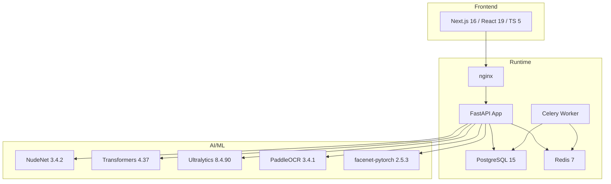
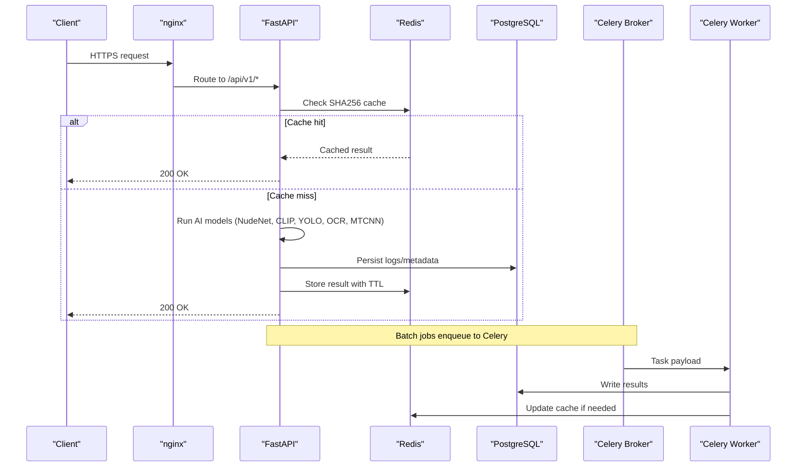

# Technology Stack

<cite>
**Referenced Files in This Document**
- [README.md](file://README.md)
- [docker-compose.yml](file://docker-compose.yml)
- [backend/requirements.txt](file://backend/requirements.txt)
- [backend/pyproject.toml](file://backend/pyproject.toml)
- [backend/Dockerfile](file://backend/Dockerfile)
- [frontend-nextjs-backup/package.json](file://frontend-nextjs-backup/package.json)
- [frontend-nextjs-backup/tsconfig.json](file://frontend-nextjs-backup/tsconfig.json)
- [frontend-nextjs-backup/Dockerfile](file://frontend-nextjs-backup/Dockerfile)
- [.github/workflows/ci.yml](file://.github/workflows/ci.yml)
- [.github/workflows/deploy.yml](file://.github/workflows/deploy.yml)
- [backend/app/core/config.py](file://backend/app/core/config.py)
- [backend/app/core/database.py](file://backend/app/core/database.py)
- [backend/app/core/redis.py](file://backend/app/core/redis.py)
</cite>

## Table of Contents
1. Introduction
2. Project Structure
3. Core Components
4. Architecture Overview
5. Detailed Component Analysis
6. Dependency Analysis
7. Performance Considerations
8. Troubleshooting Guide
9. Conclusion

## Introduction
This document describes the complete technology ecosystem for OmniShield, covering backend, frontend, AI/ML libraries, and DevOps tools. It focuses on version compatibility, dependency relationships, and upgrade considerations to help teams maintain a stable, high-performance moderation platform.

## Project Structure
OmniShield is organized into:
- Backend (FastAPI + Uvicorn, async SQLAlchemy 2.0, Pydantic v2, Redis, Celery, PostgreSQL)
- Frontend (Next.js 16 with TypeScript 5, React 19, Tailwind CSS 4, Recharts 3.9)
- AI/ML (NudeNet, Transformers, Ultralytics YOLOv8, PaddleOCR, facenet-pytorch MTCNN)
- DevOps (Docker Compose, GitHub Actions CI/CD, Prometheus metrics, nginx proxy)

**Diagram sources**
- [docker-compose.yml:1-108](file://docker-compose.yml#L1-L108)
- [backend/requirements.txt:1-142](file://backend/requirements.txt#L1-L142)
- [frontend-nextjs-backup/package.json:1-32](file://frontend-nextjs-backup/package.json#L1-L32)

**Section sources**
- [README.md:621-657](file://README.md#L621-L657)
- [docker-compose.yml:1-108](file://docker-compose.yml#L1-L108)

## Core Components
- Backend framework: FastAPI 0.137 with Uvicorn ASGI server
- Database: PostgreSQL 15 via asyncpg; ORM: SQLAlchemy 2.0; migrations: Alembic
- Validation: Pydantic v2 (pydantic-settings)
- Cache: Redis 7 (caching, rate limiting, session storage)
- Background tasks: Celery 5.4 with Redis broker/backend
- Frontend: Next.js 16, TypeScript 5, React 19, Tailwind CSS 4, Recharts 3.9
- AI/ML: NudeNet 3.4.2, Transformers 4.37, Ultralytics 8.4.90, PaddleOCR 3.4.1, facenet-pytorch 2.5.3
- DevOps: Docker 24, Kubernetes-ready manifests, GitHub Actions CI/CD, Prometheus metrics, nginx reverse proxy

Key configuration highlights:
- Settings management via pydantic-settings with environment validation
- Async database engine setup for FastAPI routes and sync engine for migrations
- Graceful Redis connection handling with fallback behavior

**Section sources**
- [backend/requirements.txt:1-142](file://backend/requirements.txt#L1-L142)
- [backend/app/core/config.py:1-148](file://backend/app/core/config.py#L1-L148)
- [backend/app/core/database.py:1-50](file://backend/app/core/database.py#L1-L50)
- [backend/app/core/redis.py:1-21](file://backend/app/core/redis.py#L1-L21)
- [frontend-nextjs-backup/package.json:1-32](file://frontend-nextjs-backup/package.json#L1-L32)
- [README.md:621-657](file://README.md#L621-L657)

## Architecture Overview
The system uses an asynchronous API layer backed by a multi-model AI pipeline, caching, and background processing.

**Diagram sources**
- [docker-compose.yml:1-108](file://docker-compose.yml#L1-L108)
- [backend/app/core/config.py:1-148](file://backend/app/core/config.py#L1-L148)
- [backend/app/core/database.py:1-50](file://backend/app/core/database.py#L1-L50)
- [backend/app/core/redis.py:1-21](file://backend/app/core/redis.py#L1-L21)

## Detailed Component Analysis

### Backend Technologies
- FastAPI 0.137 + Uvicorn 0.49: High-performance async web server and framework
- SQLAlchemy 2.0 + asyncpg: Async database access with connection pooling
- Pydantic v2 + pydantic-settings: Strongly typed settings and request/response validation
- Redis 7: Shared client initialization with timeout and graceful degradation
- Celery 5.4: Distributed task queue using Redis as broker and result backend
- PostgreSQL 15: Persistent relational store with Alembic migrations

Configuration and runtime notes:
- Settings include JWT, CORS, thresholds, GPU flags, and cloud storage options
- Async engine used for endpoints; sync engine for migrations and scripts
- Redis client initializes with low connect timeout and availability flag for fallback paths

**Section sources**
- [backend/requirements.txt:1-142](file://backend/requirements.txt#L1-L142)
- [backend/app/core/config.py:1-148](file://backend/app/core/config.py#L1-L148)
- [backend/app/core/database.py:1-50](file://backend/app/core/database.py#L1-L50)
- [backend/app/core/redis.py:1-21](file://backend/app/core/redis.py#L1-L21)
- [backend/Dockerfile:1-27](file://backend/Dockerfile#L1-L27)

### Frontend Technologies
- Next.js 16 with App Router
- TypeScript 5 strict mode
- React 19
- Tailwind CSS 4
- Recharts 3.9 for analytics charts
- Axios for HTTP requests

Build and type-checking:
- TypeScript target ES2017 with bundler module resolution
- Strict checks enabled; incremental builds supported
- Build pipeline produces optimized static assets served by nginx or Vercel

**Section sources**
- [frontend-nextjs-backup/package.json:1-32](file://frontend-nextjs-backup/package.json#L1-L32)
- [frontend-nextjs-backup/tsconfig.json:1-35](file://frontend-nextjs-backup/tsconfig.json#L1-L35)
- [frontend-nextjs-backup/Dockerfile:1-22](file://frontend-nextjs-backup/Dockerfile#L1-L22)

### AI/ML Libraries
- NudeNet 3.4.2: ONNX-based NSFW detection
- Transformers 4.37: CLIP zero-shot classification for violence/gore
- Ultralytics 8.4.90: YOLOv8 object detection for weapons
- PaddleOCR 3.4.1: Text extraction from images
- facenet-pytorch 2.5.3: MTCNN face detection

Integration patterns:
- Models are invoked within service layers and aggregated by an ensemble strategy
- Optional GPU acceleration controlled by settings
- Results cached by image hash to reduce redundant inference

**Section sources**
- [backend/requirements.txt:1-142](file://backend/requirements.txt#L1-L142)
- [README.md:35-47](file://README.md#L35-L47)

### DevOps and Infrastructure
- Docker 24: Containerized services for backend, frontend, Redis, PostgreSQL
- Docker Compose: Local and staging orchestration with healthchecks and volumes
- GitHub Actions CI/CD: Linting, testing, security scans, Docker builds, deployments
- Prometheus metrics: Request and model performance counters exposed by backend
- nginx: Reverse proxy and load balancing for frontend and API

CI/CD highlights:
- Python 3.12 and Node 20 environments
- Services for PostgreSQL and Redis during tests
- Security scanning with Bandit, Safety, and Trivy
- Staging and production deployment jobs with environment gating

**Section sources**
- [docker-compose.yml:1-108](file://docker-compose.yml#L1-L108)
- [.github/workflows/ci.yml:1-379](file://.github/workflows/ci.yml#L1-L379)
- [.github/workflows/deploy.yml:1-137](file://.github/workflows/deploy.yml#L1-L137)
- [README.md:580-618](file://README.md#L580-L618)

## Dependency Analysis
Version matrix and compatibility notes:
- Python 3.12 runtime with FastAPI 0.137, Starlette 1.3.1, Uvicorn 0.49
- SQLAlchemy 2.0.31 with asyncpg 0.31.0 for PostgreSQL 15
- Pydantic 2.13.4 with pydantic-core 2.46.4 and pydantic-settings 2.3.4
- Redis 5.0.7 client against Redis 7 server
- Celery 5.4.0 with Kombu 5.6.2 and amqp 5.3.1
- AI stack: torch 2.12.1, torchvision 0.27.1, transformers 5.13.0, ultralytics 8.4.90, paddleocr 3.4.1, facenet-pytorch 2.5.3, nudenet 3.4.2
- Frontend: next 16.2.10, react/react-dom 19.2.4, typescript ^5, tailwindcss ^4, recharts ^3.9.2

Dependency relationships:
- FastAPI depends on Starlette and Uvicorn for routing and ASGI execution
- SQLAlchemy async engine relies on asyncpg driver for PostgreSQL
- Celery workers consume tasks from Redis broker and write results to Redis backend
- AI libraries depend on PyTorch and related CUDA/CPU backends; optional GPU usage toggled via settings

Upgrade considerations:
- Keep Python at 3.12 to align with toolchain targets in pyproject.toml
- When upgrading Pydantic, ensure schema validators remain compatible
- For Transformers upgrades, verify model loading APIs and tokenizer changes
- For Ultralytics, confirm export and inference interfaces remain stable
- For PaddleOCR, check OCR engine updates and language pack compatibility
- For facenet-pytorch, validate MTCNN detector signatures and pretrained weights

**Section sources**
- [backend/requirements.txt:1-142](file://backend/requirements.txt#L1-L142)
- [backend/pyproject.toml:1-95](file://backend/pyproject.toml#L1-L95)
- [frontend-nextjs-backup/package.json:1-32](file://frontend-nextjs-backup/package.json#L1-L32)

## Performance Considerations
- Use Redis caching with SHA256 hashing to avoid repeated AI inference
- Enable GPU acceleration when available; otherwise rely on CPU fallback
- Tune connection pools for asyncpg and Redis clients
- Prefer batch processing via Celery for heavy workloads
- Monitor Prometheus metrics to identify bottlenecks in model inference and I/O

[No sources needed since this section provides general guidance]

## Troubleshooting Guide
Common issues and resolutions:
- Redis connectivity failures: The shared client initializes with a short timeout and sets an availability flag; code paths should degrade gracefully when unavailable
- Database connection errors: Ensure DATABASE_URL uses the correct dialect (postgresql+asyncpg) and credentials; use sync engine only for migrations
- Model import errors: Confirm system dependencies (e.g., OpenGL/GLIBC) are installed in containers; pre-warm NudeNet model during build
- CI test failures: Verify service containers for PostgreSQL and Redis are healthy before running tests

Operational tips:
- Validate environment variables for JWT secrets and CORS origins in production
- Use healthcheck endpoints for Postgres and Redis in docker-compose
- Inspect Celery worker logs for task failures and retry policies

**Section sources**
- [backend/app/core/redis.py:1-21](file://backend/app/core/redis.py#L1-L21)
- [backend/app/core/database.py:1-50](file://backend/app/core/database.py#L1-L50)
- [backend/Dockerfile:1-27](file://backend/Dockerfile#L1-L27)
- [docker-compose.yml:1-108](file://docker-compose.yml#L1-L108)

## Conclusion
OmniShield’s technology stack combines a modern async backend, a contemporary frontend, robust AI capabilities, and mature DevOps practices. By maintaining aligned versions across components and following the upgrade guidelines, teams can sustain high performance, reliability, and security while evolving the platform.