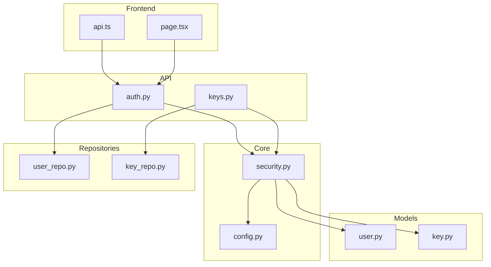
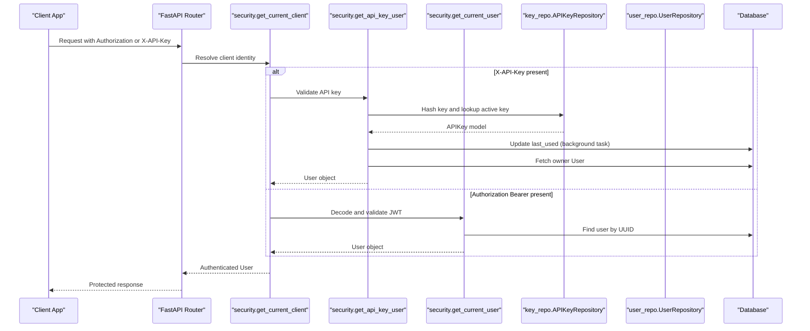
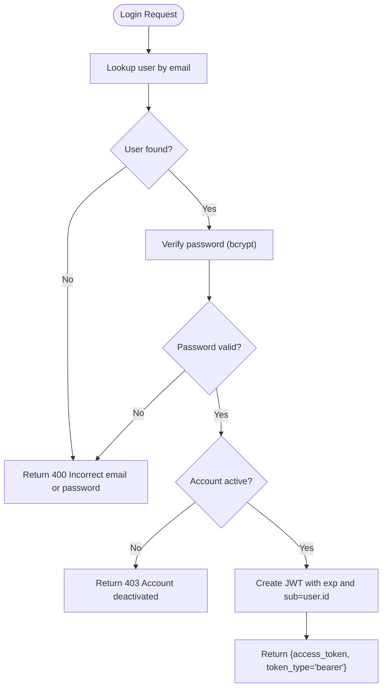
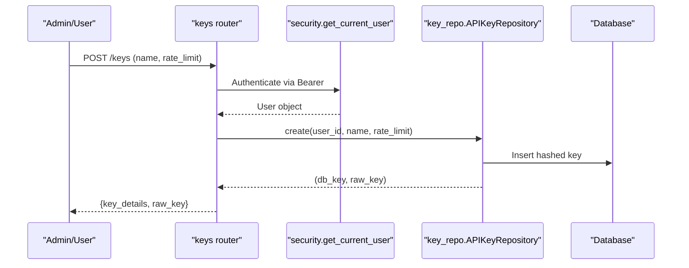
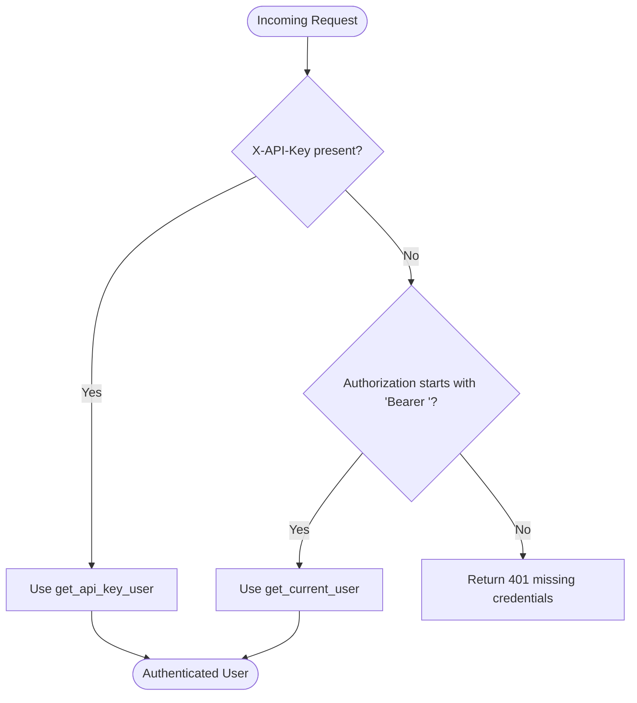
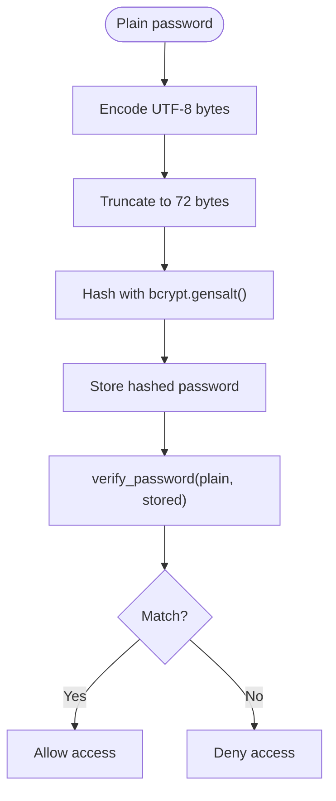
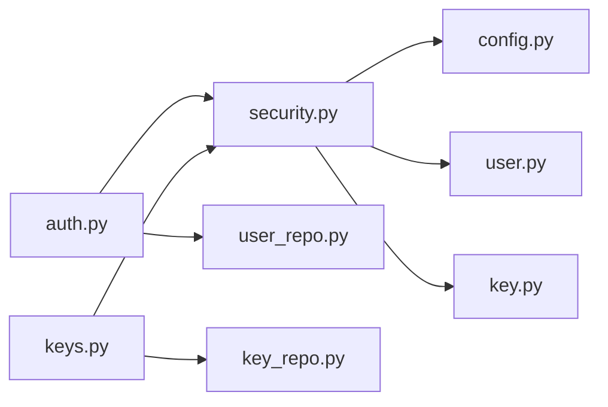

# Authentication Mechanisms

<cite>
**Referenced Files in This Document**
- [security.py](file://backend/app/core/security.py)
- [auth.py](file://backend/app/api/auth.py)
- [keys.py](file://backend/app/api/keys.py)
- [config.py](file://backend/app/core/config.py)
- [user.py](file://backend/app/models/user.py)
- [key.py](file://backend/app/models/key.py)
- [user_repo.py](file://backend/app/repositories/user_repo.py)
- [key_repo.py](file://backend/app/repositories/key_repo.py)
- [api.ts](file://frontend/src/lib/api.ts)
- [page.tsx](file://frontend-nextjs-backup/src/app/page.tsx)
</cite>

## Table of Contents
1. Introduction
2. Project Structure
3. Core Components
4. Architecture Overview
5. Detailed Component Analysis
6. Dependency Analysis
7. Performance Considerations
8. Troubleshooting Guide
9. Conclusion
10. Appendices

## Introduction
This document explains OmniShield’s dual authentication system, which supports:
- JWT Bearer token authentication with configurable expiration and subject claims
- API key authentication using SHA256 hashing for secure storage, header-based access via X-API-Key, and automatic last-used timestamp updates
- Password security using bcrypt with UTF-8 encoding and 72-byte truncation to prevent timing attacks
- A unified dependency get_current_client that resolves the client identity from either Authorization Bearer or X-API-Key headers
- Token refresh mechanisms (configuration present; implementation not included in analyzed files)
- Session management and credential verification workflows

The goal is to provide a clear, code-sourced understanding of how authentication works end-to-end and how clients can implement each method.

## Project Structure
Authentication-related components are organized as follows:
- Security utilities and dependencies: core/security.py
- Authentication endpoints: api/auth.py
- API key management endpoints: api/keys.py
- Configuration for tokens and algorithms: core/config.py
- Data models: models/user.py, models/key.py
- Repositories for user and API key operations: repositories/user_repo.py, repositories/key_repo.py
- Frontend examples for login and token usage: frontend/src/lib/api.ts, frontend-nextjs-backup/src/app/page.tsx

**Diagram sources**
- [security.py:1-177](file://backend/app/core/security.py#L1-L177)
- [auth.py:1-90](file://backend/app/api/auth.py#L1-L90)
- [keys.py:1-87](file://backend/app/api/keys.py#L1-L87)
- [config.py:1-148](file://backend/app/core/config.py#L1-L148)
- [user.py:1-28](file://backend/app/models/user.py#L1-L28)
- [key.py:1-23](file://backend/app/models/key.py#L1-L23)
- [user_repo.py:1-40](file://backend/app/repositories/user_repo.py#L1-L40)
- [key_repo.py:1-79](file://backend/app/repositories/key_repo.py#L1-L79)
- [api.ts:1-28](file://frontend/src/lib/api.ts#L1-L28)
- [page.tsx:198-238](file://frontend-nextjs-backup/src/app/page.tsx#L198-L238)

**Section sources**
- [security.py:1-177](file://backend/app/core/security.py#L1-L177)
- [auth.py:1-90](file://backend/app/api/auth.py#L1-L90)
- [keys.py:1-87](file://backend/app/api/keys.py#L1-L87)
- [config.py:1-148](file://backend/app/core/config.py#L1-L148)
- [user.py:1-28](file://backend/app/models/user.py#L1-L28)
- [key.py:1-23](file://backend/app/models/key.py#L1-L23)
- [user_repo.py:1-40](file://backend/app/repositories/user_repo.py#L1-L40)
- [key_repo.py:1-79](file://backend/app/repositories/key_repo.py#L1-L79)
- [api.ts:1-28](file://frontend/src/lib/api.ts#L1-L28)
- [page.tsx:198-238](file://frontend-nextjs-backup/src/app/page.tsx#L198-L238)

## Core Components
- JWT Bearer authentication:
  - Token creation with configurable expiration and subject claim
  - Token decoding and validation
  - User resolution from token payload
- API key authentication:
  - Secure generation and SHA256 hashing
  - Header-based lookup and rate limiting
  - Automatic last-used timestamp update
- Password security:
  - bcrypt hashing with UTF-8 encoding and 72-byte truncation
- Unified client resolver:
  - get_current_client supporting both Bearer and API keys

**Section sources**
- [security.py:42-93](file://backend/app/core/security.py#L42-L93)
- [security.py:106-176](file://backend/app/core/security.py#L106-L176)
- [auth.py:41-90](file://backend/app/api/auth.py#L41-L90)
- [key_repo.py:10-21](file://backend/app/repositories/key_repo.py#L10-L21)
- [key_repo.py:50-68](file://backend/app/repositories/key_repo.py#L50-L68)
- [user_repo.py:23-40](file://backend/app/repositories/user_repo.py#L23-L40)

## Architecture Overview
The authentication architecture integrates FastAPI routers with security dependencies and repository layers. The unified dependency get_current_client centralizes identity resolution across endpoints.

**Diagram sources**
- [security.py:153-176](file://backend/app/core/security.py#L153-L176)
- [security.py:119-151](file://backend/app/core/security.py#L119-L151)
- [security.py:53-93](file://backend/app/core/security.py#L53-L93)
- [key_repo.py:18-47](file://backend/app/repositories/key_repo.py#L18-L47)
- [user_repo.py:16-20](file://backend/app/repositories/user_repo.py#L16-L20)

## Detailed Component Analysis

### JWT Bearer Token Authentication
- Token creation:
  - Uses jose.jwt.encode with configurable algorithm and secret
  - Supports optional expires_delta; otherwise uses configured ACCESS_TOKEN_EXPIRE_MINUTES
  - Payload includes exp and sub (subject), where sub is the user id
- Token validation:
  - Decodes using jose.jwt.decode with configured algorithm and secret
  - Extracts sub and validates presence
  - Converts string UUID to UUID object and queries database for user
  - Ensures user status is active
- Login flow:
  - Accepts OAuth2 form data (username=email, password)
  - Verifies credentials using verify_password
  - Checks account status
  - Returns access_token and token_type=bearer

**Diagram sources**
- [auth.py:41-90](file://backend/app/api/auth.py#L41-L90)
- [security.py:42-51](file://backend/app/core/security.py#L42-L51)
- [security.py:53-93](file://backend/app/core/security.py#L53-L93)

**Section sources**
- [auth.py:41-90](file://backend/app/api/auth.py#L41-L90)
- [security.py:42-93](file://backend/app/core/security.py#L42-L93)
- [config.py:19-22](file://backend/app/core/config.py#L19-L22)

### API Key Authentication
- Generation and storage:
  - Raw keys generated securely with prefix ak_
  - Keys hashed using SHA256 before storage
  - Only hashed values stored; raw key returned once at creation
- Validation:
  - Lookup by hashed key and active status
  - Enforce per-key rate limits
  - Asynchronously update last_used timestamp
  - Retrieve owner user and ensure active status
- Management endpoints:
  - Create key (returns raw key once)
  - List keys
  - Revoke key

**Diagram sources**
- [keys.py:14-38](file://backend/app/api/keys.py#L14-L38)
- [key_repo.py:50-68](file://backend/app/repositories/key_repo.py#L50-L68)
- [security.py:53-93](file://backend/app/core/security.py#L53-L93)

**Section sources**
- [keys.py:14-87](file://backend/app/api/keys.py#L14-L87)
- [key_repo.py:10-79](file://backend/app/repositories/key_repo.py#L10-L79)
- [security.py:119-151](file://backend/app/core/security.py#L119-L151)

### Unified Client Resolver: get_current_client
- Priority:
  - If X-API-Key header present, authenticate via API key path
  - Else if Authorization header starts with Bearer, authenticate via JWT path
  - Otherwise return 401 with guidance on required headers
- Behavior:
  - Integrates background tasks for last_used updates
  - Delegates to get_api_key_user and get_current_user

**Diagram sources**
- [security.py:153-176](file://backend/app/core/security.py#L153-L176)
- [security.py:119-151](file://backend/app/core/security.py#L119-L151)
- [security.py:53-93](file://backend/app/core/security.py#L53-L93)

**Section sources**
- [security.py:153-176](file://backend/app/core/security.py#L153-L176)

### Password Security Implementation
- Encoding and truncation:
  - Passwords encoded to UTF-8 bytes and truncated to 72 bytes to align with bcrypt limit
- Hashing and verification:
  - Hashing uses bcrypt.hashpw with random salt
  - Verification uses bcrypt.checkpw against stored hash
- Repository warning:
  - Logs when provided password exceeds 72 bytes

**Diagram sources**
- [security.py:24-40](file://backend/app/core/security.py#L24-L40)
- [user_repo.py:23-40](file://backend/app/repositories/user_repo.py#L23-L40)

**Section sources**
- [security.py:24-40](file://backend/app/core/security.py#L24-L40)
- [user_repo.py:23-40](file://backend/app/repositories/user_repo.py#L23-L40)

### Token Refresh Mechanisms
- Configuration:
  - REFRESH_TOKEN_EXPIRE_DAYS is defined in settings
- Implementation:
  - No refresh endpoint or logic was found in the analyzed files
- Recommendation:
  - Implement a refresh endpoint that issues new access tokens using a stored refresh token mechanism

**Section sources**
- [config.py:22](file://backend/app/core/config.py#L22)

### Session Management
- Statelessness:
  - JWT-based authentication is stateless; no server-side session store is used
- Implications:
  - Tokens must be validated on each request
  - Revocation requires additional mechanisms (e.g., token blacklist or short-lived tokens)

[No sources needed since this section provides general guidance]

### Credential Verification Workflows
- Registration:
  - Validates uniqueness of email
  - Hashes password and creates user with default role and status
- Login:
  - Verifies credentials and account status
  - Issues JWT access token

**Section sources**
- [auth.py:15-40](file://backend/app/api/auth.py#L15-L40)
- [auth.py:41-90](file://backend/app/api/auth.py#L41-L90)

## Dependency Analysis
- Coupling:
  - auth.py depends on security utilities and UserRepository
  - keys.py depends on security utilities and APIKeyRepository
  - security.py depends on config, database, models, and repositories
- External integrations:
  - PyJWT (jose) for token encoding/decoding
  - bcrypt for password hashing
  - SQLAlchemy async for database operations

**Diagram sources**
- [auth.py:1-90](file://backend/app/api/auth.py#L1-L90)
- [keys.py:1-87](file://backend/app/api/keys.py#L1-L87)
- [security.py:1-177](file://backend/app/core/security.py#L1-L177)
- [user_repo.py:1-40](file://backend/app/repositories/user_repo.py#L1-L40)
- [key_repo.py:1-79](file://backend/app/repositories/key_repo.py#L1-L79)
- [config.py:1-148](file://backend/app/core/config.py#L1-L148)
- [user.py:1-28](file://backend/app/models/user.py#L1-L28)
- [key.py:1-23](file://backend/app/models/key.py#L1-L23)

**Section sources**
- [auth.py:1-90](file://backend/app/api/auth.py#L1-L90)
- [keys.py:1-87](file://backend/app/api/keys.py#L1-L87)
- [security.py:1-177](file://backend/app/core/security.py#L1-L177)
- [user_repo.py:1-40](file://backend/app/repositories/user_repo.py#L1-L40)
- [key_repo.py:1-79](file://backend/app/repositories/key_repo.py#L1-L79)
- [config.py:1-148](file://backend/app/core/config.py#L1-L148)
- [user.py:1-28](file://backend/app/models/user.py#L1-L28)
- [key.py:1-23](file://backend/app/models/key.py#L1-L23)

## Performance Considerations
- bcrypt cost factor:
  - Ensure appropriate bcrypt rounds to balance security and latency
- Rate limiting:
  - Per-key rate limits enforced during API key authentication
- Background updates:
  - last_used updates performed asynchronously to avoid blocking requests
- Token size:
  - Keep JWT payloads minimal (sub only) to reduce overhead

[No sources needed since this section provides general guidance]

## Troubleshooting Guide
- Common errors:
  - 401 Unauthorized: Missing or invalid credentials (check headers and token validity)
  - 403 Forbidden: Inactive user or insufficient permissions
  - 400 Bad Request: Duplicate registration or incorrect credentials
- Debugging tips:
  - Verify JWT_SECRET and JWT_ALGORITHM configuration
  - Confirm X-API-Key header format and active status
  - Inspect logs for decode failures and database errors

**Section sources**
- [security.py:58-72](file://backend/app/core/security.py#L58-L72)
- [security.py:129-150](file://backend/app/core/security.py#L129-L150)
- [auth.py:52-71](file://backend/app/api/auth.py#L52-L71)

## Conclusion
OmniShield implements a robust dual authentication system combining JWT Bearer tokens and API keys. Passwords are secured with bcrypt and careful byte handling. The unified get_current_client dependency simplifies integration by automatically resolving the authentication method. While token refresh configuration exists, its implementation is not present in the analyzed files. Clients should follow the documented flows and headers to integrate seamlessly.

[No sources needed since this section summarizes without analyzing specific files]

## Appendices

### Practical Client Examples

- JWT Bearer token usage:
  - Obtain token via login endpoint
  - Include Authorization: Bearer <token> in subsequent requests
  - Example references:
    - [api.ts:5-16](file://frontend/src/lib/api.ts#L5-L16)
    - [page.tsx:205-222](file://frontend-nextjs-backup/src/app/page.tsx#L205-L222)

- API key usage:
  - Generate an API key via protected endpoint
  - Include X-API-Key: ak_<raw_key> in requests
  - Example references:
    - [keys.py:14-38](file://backend/app/api/keys.py#L14-L38)

- Registration and login:
  - Register with JSON payload
  - Login with URL-encoded form data (username=email, password)
  - Example references:
    - [api.ts:18-23](file://frontend/src/lib/api.ts#L18-L23)
    - [page.tsx:224-232](file://frontend-nextjs-backup/src/app/page.tsx#L224-L232)

**Section sources**
- [api.ts:5-23](file://frontend/src/lib/api.ts#L5-L23)
- [page.tsx:205-232](file://frontend-nextjs-backup/src/app/page.tsx#L205-L232)
- [keys.py:14-38](file://backend/app/api/keys.py#L14-L38)