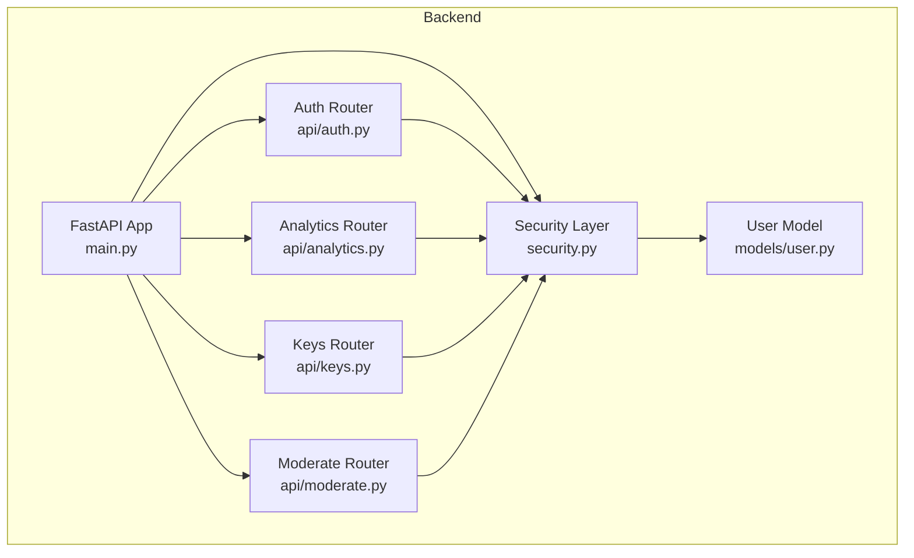
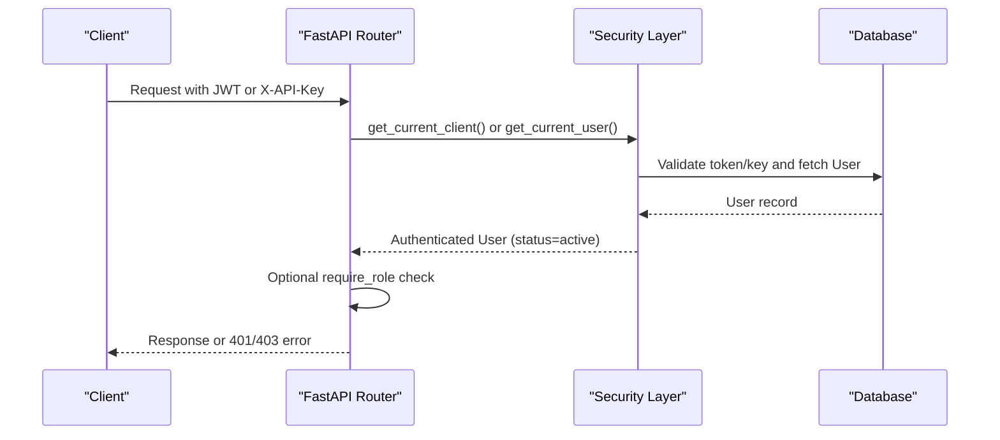
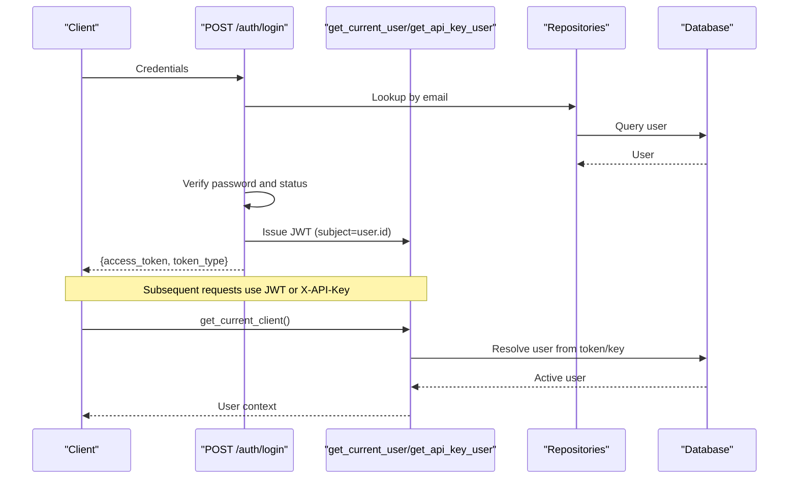
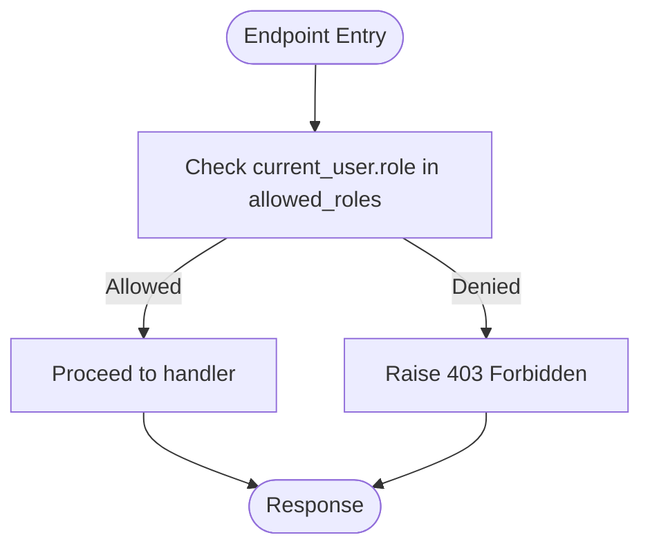
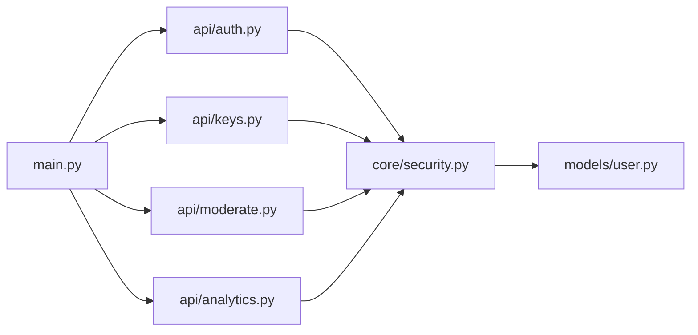

# Authorization & Role-Based Access Control

<cite>
**Referenced Files in This Document**
- [main.py](file://backend/app/main.py)
- [security.py](file://backend/app/core/security.py)
- [user.py](file://backend/app/models/user.py)
- [auth.py](file://backend/app/api/auth.py)
- [auth_schemas.py](file://backend/app/schemas/auth.py)
- [analytics.py](file://backend/app/api/analytics.py)
- [keys.py](file://backend/app/api/keys.py)
- [moderate.py](file://backend/app/api/moderate.py)
</cite>

## Table of Contents
1. [Introduction](#introduction)
2. [Project Structure](#project-structure)
3. [Core Components](#core-components)
4. [Architecture Overview](#architecture-overview)
5. [Detailed Component Analysis](#detailed-component-analysis)
6. [Dependency Analysis](#dependency-analysis)
7. [Performance Considerations](#performance-considerations)
8. [Troubleshooting Guide](#troubleshooting-guide)
9. [Conclusion](#conclusion)
10. [Appendices](#appendices)

## Introduction
This document describes the OmniShield authorization system with a focus on role-based access control (RBAC). It explains how user roles and status are modeled, how authentication is performed, how endpoints are protected using dependency injection and decorators, and how resource-level permissions are enforced across API modules. It also provides best practices for defining new roles, managing permission matrices, implementing fine-grained controls, and handling unauthorized access scenarios.

## Project Structure
The authorization and RBAC features are implemented primarily in the backend FastAPI application:
- User model and schema definitions define roles and account status.
- Security utilities provide JWT handling, current user resolution, and role checking.
- API routers use dependencies to enforce authentication and authorization at endpoint boundaries.
- Resource-level checks are applied within route handlers for ownership and admin-only operations.

**Diagram sources**
- [main.py:59-63](file://backend/app/main.py#L59-L63)
- [security.py:53-104](file://backend/app/core/security.py#L53-L104)
- [user.py:10-28](file://backend/app/models/user.py#L10-L28)
- [auth.py:15-90](file://backend/app/api/auth.py#L15-L90)
- [analytics.py:14-70](file://backend/app/api/analytics.py#L14-L70)
- [keys.py:14-87](file://backend/app/api/keys.py#L14-L87)
- [moderate.py:85-220](file://backend/app/api/moderate.py#L85-L220)

**Section sources**
- [main.py:59-63](file://backend/app/main.py#L59-L63)

## Core Components
- User model: Defines identity, role, and status fields used by all authorization logic.
- Authentication: Login flow validates credentials, enforces active status, and issues JWT tokens.
- Current user resolution: Extracts and validates JWT or API key, returning an authenticated User object.
- Role enforcement: Dependency wrapper that restricts access based on allowed roles.
- Resource-level checks: Ownership and admin-only guards applied within specific endpoints.

Key responsibilities:
- Enforce account status (active/inactive) globally during authentication and per-request.
- Provide a reusable role-checking dependency for endpoints requiring specific roles.
- Support both JWT and API Key authentication flows.
- Apply fine-grained permissions where necessary (e.g., owner vs admin).

**Section sources**
- [user.py:10-28](file://backend/app/models/user.py#L10-L28)
- [auth.py:41-90](file://backend/app/api/auth.py#L41-L90)
- [security.py:53-104](file://backend/app/core/security.py#L53-L104)
- [security.py:119-177](file://backend/app/core/security.py#L119-L177)
- [analytics.py:14-70](file://backend/app/api/analytics.py#L14-L70)
- [keys.py:14-87](file://backend/app/api/keys.py#L14-L87)
- [moderate.py:191-220](file://backend/app/api/moderate.py#L191-L220)

## Architecture Overview
The authorization architecture combines global authentication dependencies with optional role and resource-level checks:

**Diagram sources**
- [security.py:53-104](file://backend/app/core/security.py#L53-L104)
- [security.py:119-177](file://backend/app/core/security.py#L119-L177)
- [auth.py:41-90](file://backend/app/api/auth.py#L41-L90)

## Detailed Component Analysis

### User Model and Status Management
- Fields include unique email, hashed password, role, and status.
- Default role is set at registration; default status is active.
- Relationships tie users to API keys and moderation logs.

Best practices:
- Keep role values canonicalized (lowercase) and validated at creation.
- Use explicit status transitions (active, inactive, suspended) and log changes.
- Avoid storing plain-text passwords; rely on hashing utilities.

**Section sources**
- [user.py:10-28](file://backend/app/models/user.py#L10-L28)
- [auth.py:15-40](file://backend/app/api/auth.py#L15-L40)

### Authentication Flow (JWT and API Keys)
- Login verifies credentials and ensures the account is active before issuing a JWT.
- Two identity resolvers:
  - JWT-based: get_current_user extracts and decodes token, loads user, and rejects inactive accounts.
  - API Key-based: get_api_key_user validates key, applies rate limiting, updates last-used timestamp, and returns the owner user if active.
- Unified resolver get_current_client supports both methods via request headers.

**Diagram sources**
- [auth.py:41-90](file://backend/app/api/auth.py#L41-L90)
- [security.py:53-93](file://backend/app/core/security.py#L53-L93)
- [security.py:119-177](file://backend/app/core/security.py#L119-L177)

**Section sources**
- [auth.py:41-90](file://backend/app/api/auth.py#L41-L90)
- [security.py:53-93](file://backend/app/core/security.py#L53-L93)
- [security.py:119-177](file://backend/app/core/security.py#L119-L177)

### Role-Based Access Control (RBAC)
- The require_role dependency wrapper enforces that the current user’s role is in an allowed list.
- Endpoints can depend on this wrapper to restrict access to specific roles.
- Role hierarchy is not currently enforced automatically; it must be implemented explicitly if needed.

Usage patterns:
- Protect admin-only endpoints by requiring ["admin"].
- Protect moderator endpoints by requiring ["admin", "moderator"].
- Combine with resource-level checks for fine-grained control.

**Diagram sources**
- [security.py:95-104](file://backend/app/core/security.py#L95-L104)

**Section sources**
- [security.py:95-104](file://backend/app/core/security.py#L95-L104)

### Middleware and Automatic Validation
- Global middleware adds security headers and API versioning.
- Per-endpoint dependencies perform automatic authentication and status validation.
- No dedicated RBAC middleware is present; role checks are applied via dependencies and inline guards.

Recommendations:
- Add a central RBAC middleware to standardize audit logging and permission escalation prevention.
- Centralize forbidden/unauthorized responses for consistent client behavior.

**Section sources**
- [main.py:41-57](file://backend/app/main.py#L41-L57)
- [security.py:53-93](file://backend/app/core/security.py#L53-L93)

### Resource-Level Permissions and Ownership Checks
- Some endpoints implement ownership checks and admin overrides:
  - Moderation video status: non-admin users can only view their own jobs.
  - API key revocation: owners or admins can revoke keys.
  - Analytics: admins see global data; regular users see only their own.

Examples:
- Owner vs admin checks in moderate and keys routers.
- Admin-only filters in analytics router.

**Section sources**
- [moderate.py:191-220](file://backend/app/api/moderate.py#L191-L220)
- [keys.py:56-87](file://backend/app/api/keys.py#L56-L87)
- [analytics.py:14-70](file://backend/app/api/analytics.py#L14-L70)

### Permission Matrices and Fine-Grained Controls
Current implementation uses:
- Role field for coarse-grained access.
- Inline ownership checks for resource-level restrictions.
- Admin overrides for cross-user visibility.

To extend:
- Introduce a permissions table and map roles to sets of permissions.
- Implement a permission checker dependency that evaluates multiple permissions.
- Add hierarchical roles with inheritance rules if required.

[No sources needed since this section proposes future enhancements]

## Dependency Analysis
The following diagram shows how routers depend on security utilities and models:

**Diagram sources**
- [main.py:59-63](file://backend/app/main.py#L59-L63)
- [auth.py:1-12](file://backend/app/api/auth.py#L1-L12)
- [keys.py:1-12](file://backend/app/api/keys.py#L1-L12)
- [moderate.py:1-22](file://backend/app/api/moderate.py#L1-L22)
- [analytics.py:1-12](file://backend/app/api/analytics.py#L1-L12)
- [security.py:1-22](file://backend/app/core/security.py#L1-L22)
- [user.py:1-12](file://backend/app/models/user.py#L1-L12)

**Section sources**
- [main.py:59-63](file://backend/app/main.py#L59-L63)

## Performance Considerations
- Prefer dependency-based auth to avoid redundant checks inside handlers.
- Cache frequently accessed user metadata when appropriate, but ensure invalidation on status/role changes.
- Use database indexes on commonly filtered fields (e.g., user_id, created_at) for analytics queries.
- Avoid heavy computations in authentication paths; offload background tasks where possible.

[No sources needed since this section provides general guidance]

## Troubleshooting Guide
Common issues and resolutions:
- 401 Unauthorized: Missing or invalid JWT/API key. Ensure correct header usage and token validity.
- 403 Forbidden: Inactive account or insufficient role. Confirm user status and required roles.
- Ownership errors: Non-owner attempting to access another user’s resources. Verify ownership checks and admin privileges.

Operational tips:
- Inspect response details for exact reasons returned by the server.
- Review logs around login attempts and resource access for clues.

**Section sources**
- [auth.py:41-90](file://backend/app/api/auth.py#L41-L90)
- [security.py:53-93](file://backend/app/core/security.py#L53-L93)
- [security.py:95-104](file://backend/app/core/security.py#L95-L104)
- [keys.py:56-87](file://backend/app/api/keys.py#L56-L87)
- [moderate.py:191-220](file://backend/app/api/moderate.py#L191-L220)

## Conclusion
OmniShield implements a practical RBAC foundation using a user model with role and status fields, JWT and API Key authentication, and dependency-based role checks. Resource-level permissions are enforced through inline ownership and admin overrides. To scale further, introduce a formal permissions matrix, hierarchical roles, centralized RBAC middleware, and comprehensive audit logging for access attempts and permission changes.

[No sources needed since this section summarizes without analyzing specific files]

## Appendices

### Best Practices for Defining New Roles
- Define canonical role names and validate them at creation time.
- Document role capabilities and update permission matrices accordingly.
- Avoid granting excessive privileges; prefer least privilege.

[No sources needed since this section provides general guidance]

### Managing Permission Matrices
- Maintain a mapping of roles to permissions.
- Implement a permission checker dependency that evaluates required permissions.
- Log permission decisions for auditing.

[No sources needed since this section provides general guidance]

### Examples of Protecting Endpoints
- Require admin role:
  - Use the role-checking dependency with ["admin"] on admin-only routes.
- Require moderator or admin:
  - Use the role-checking dependency with ["admin", "moderator"].
- Protect resource ownership:
  - Compare the requesting user’s ID with the resource owner’s ID; allow if equal or if user has admin role.

[No sources needed since this section provides general guidance]