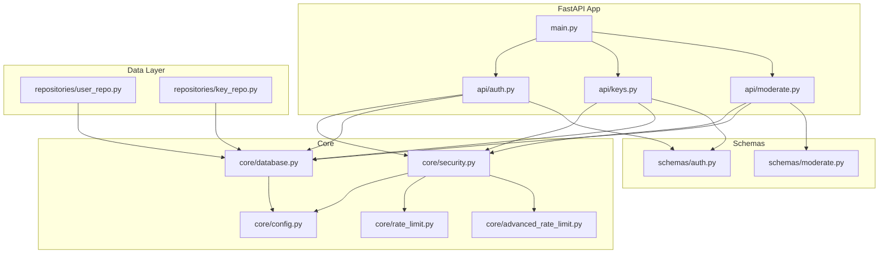
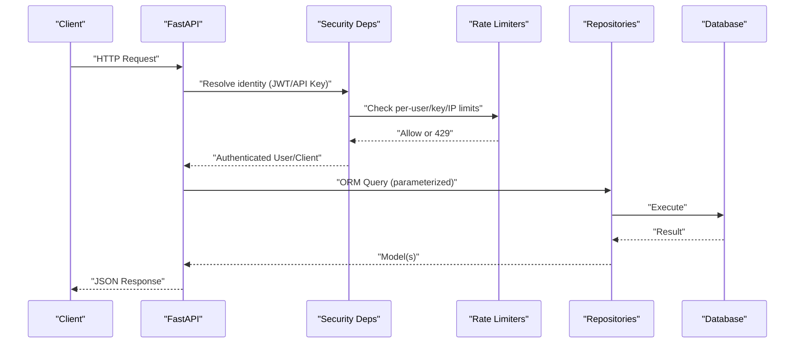
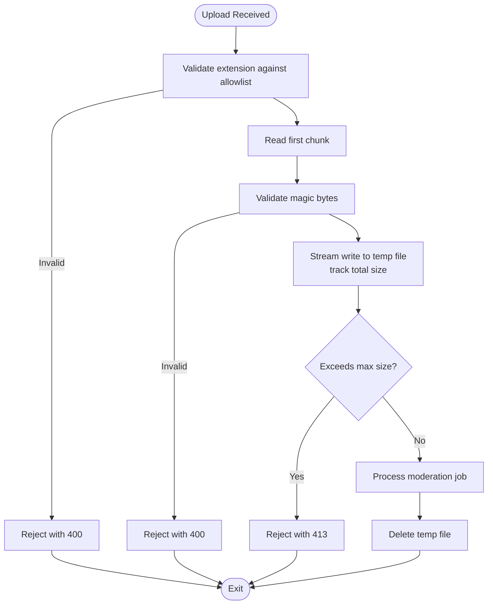
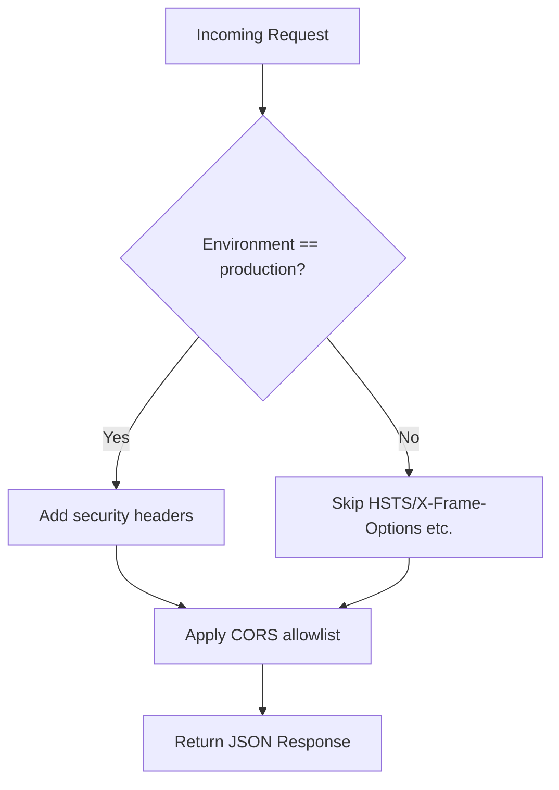
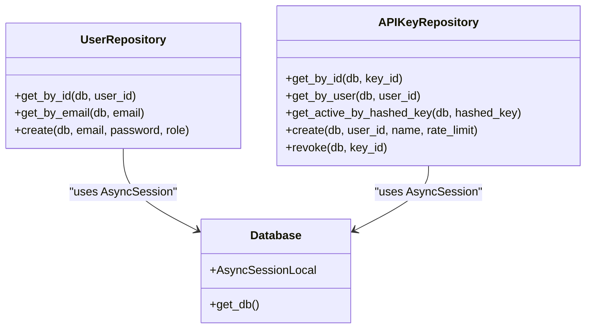
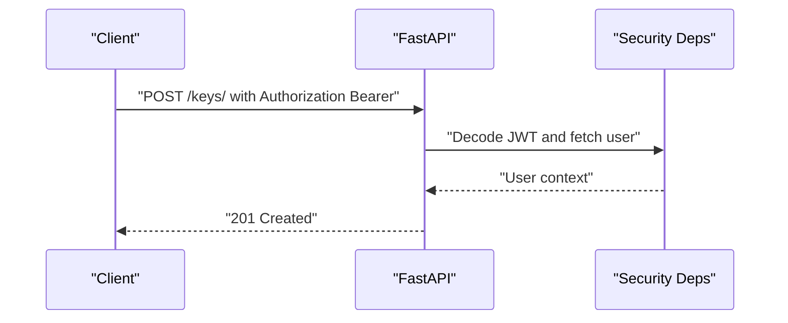
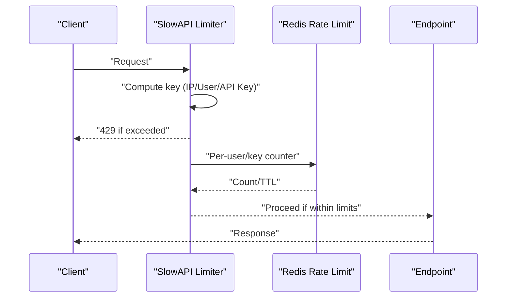
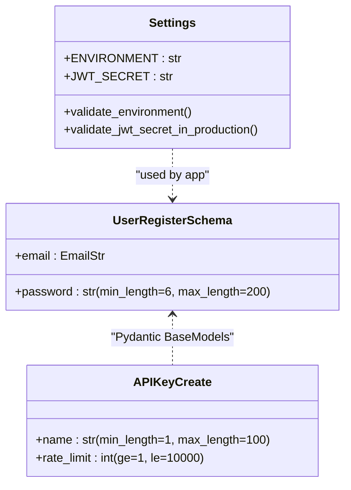
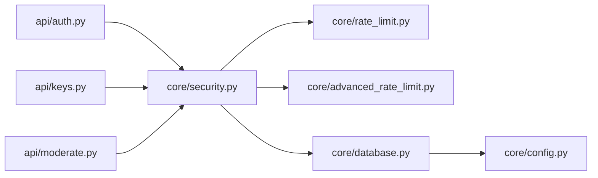

# Input Validation & Sanitization

<cite>
**Referenced Files in This Document**
- [main.py](file://backend/app/main.py)
- [config.py](file://backend/app/core/config.py)
- [security.py](file://backend/app/core/security.py)
- [rate_limit.py](file://backend/app/core/rate_limit.py)
- [advanced_rate_limit.py](file://backend/app/core/advanced_rate_limit.py)
- [moderate.py](file://backend/app/api/moderate.py)
- [auth.py](file://backend/app/api/auth.py)
- [keys.py](file://backend/app/api/keys.py)
- [database.py](file://backend/app/core/database.py)
- [user_repo.py](file://backend/app/repositories/user_repo.py)
- [key_repo.py](file://backend/app/repositories/key_repo.py)
- [auth.py (schemas)](file://backend/app/schemas/auth.py)
- [moderate.py (schemas)](file://backend/app/schemas/moderate.py)
</cite>

## Table of Contents
1. Introduction
2. Project Structure
3. Core Components
4. Architecture Overview
5. Detailed Component Analysis
6. Dependency Analysis
7. Performance Considerations
8. Troubleshooting Guide
9. Conclusion
10. Appendices

## Introduction
This document explains how the OmniShield platform implements input validation and sanitization to prevent common web vulnerabilities. It covers:
- File upload security with extension checks, magic bytes validation, size limits, and safe handling
- XSS prevention via security headers and CORS configuration
- SQL injection protection using SQLAlchemy ORM parameterized queries
- CSRF mitigation through stateless JWTs and API keys, plus request origin controls
- Rate limiting for per-user, per-API-key, and per-IP enforcement with burst handling and tiered quotas
- Request body validation using Pydantic schemas and custom validators
- Error response formatting and security testing guidelines for production deployments

## Project Structure
The backend is a FastAPI application organized by feature layers:
- API routes under app/api
- Core utilities (security, rate limiting, config, database) under app/core
- Data access via repositories under app/repositories
- Schemas for request/response validation under app/schemas
- Models and migrations under app/models and migrations

**Diagram sources**
- [main.py:1-126](file://backend/app/main.py#L1-L126)
- [auth.py](file://backend/app/api/auth.py)
- [keys.py](file://backend/app/api/keys.py)
- [moderate.py](file://backend/app/api/moderate.py)
- [config.py](file://backend/app/core/config.py)
- [security.py](file://backend/app/core/security.py)
- [rate_limit.py](file://backend/app/core/rate_limit.py)
- [advanced_rate_limit.py](file://backend/app/core/advanced_rate_limit.py)
- [database.py](file://backend/app/core/database.py)
- [user_repo.py](file://backend/app/repositories/user_repo.py)
- [key_repo.py](file://backend/app/repositories/key_repo.py)
- [auth.py (schemas)](file://backend/app/schemas/auth.py)
- [moderate.py (schemas)](file://backend/app/schemas/moderate.py)

**Section sources**
- [main.py:1-126](file://backend/app/main.py#L1-L126)
- [config.py:1-148](file://backend/app/core/config.py#L1-L148)

## Core Components
- Authentication and authorization:
  - JWT-based authentication and API key authentication are provided as dependencies that resolve the current user or client identity.
  - Role-based access control decorator supports restricting endpoints to specific roles.
- Rate limiting:
  - Per-minute windowed counting using Redis with graceful degradation if Redis is unavailable.
  - Advanced SlowAPI-based limiter provides IP-based defaults and endpoint-scoped keys.
- Configuration-driven security:
  - Centralized settings for file ingestion limits, allowed extensions/content types, CORS origins, and environment-specific warnings.
- Database access:
  - Async SQLAlchemy engines and session providers; all queries use ORM constructs to avoid SQL injection.

**Section sources**
- [security.py:1-177](file://backend/app/core/security.py#L1-L177)
- [rate_limit.py:1-44](file://backend/app/core/rate_limit.py#L1-L44)
- [advanced_rate_limit.py:1-113](file://backend/app/core/advanced_rate_limit.py#L1-L113)
- [config.py:1-148](file://backend/app/core/config.py#L1-L148)
- [database.py:1-50](file://backend/app/core/database.py#L1-L50)

## Architecture Overview
Security controls are layered across middleware, dependencies, and route handlers:
- Middleware adds security headers and enforces CORS based on environment.
- Dependencies authenticate requests via JWT or API key and enforce role checks.
- Endpoints validate inputs using Pydantic schemas and perform strict file validations before processing.
- Repository layer uses SQLAlchemy ORM parameterized queries exclusively.

**Diagram sources**
- [main.py:1-126](file://backend/app/main.py#L1-L126)
- [security.py:1-177](file://backend/app/core/security.py#L1-L177)
- [rate_limit.py:1-44](file://backend/app/core/rate_limit.py#L1-L44)
- [advanced_rate_limit.py:1-113](file://backend/app/core/advanced_rate_limit.py#L1-L113)
- [user_repo.py:1-40](file://backend/app/repositories/user_repo.py#L1-L40)
- [key_repo.py:1-79](file://backend/app/repositories/key_repo.py#L1-L79)
- [database.py:1-50](file://backend/app/core/database.py#L1-L50)

## Detailed Component Analysis

### File Upload Security
- Extension allowlist:
  - Images: .jpg, .jpeg, .png, .webp
  - Videos: .mp4, .avi, .mov, .webm, .mkv
- Magic bytes validation:
  - Image signatures checked for JPEG, PNG, WebP
  - Video container signatures checked for WebM/Matroska, AVI, MP4/MOV
- Size limits:
  - Images: configurable MB limit enforced during streaming write
  - Videos: configurable MB limit enforced during streaming write
- Safe storage and cleanup:
  - Unique temporary filenames per request
  - Immediate deletion after processing or error paths
- Malicious pattern scanning:
  - No explicit content scanning beyond signature and size checks; consider adding antivirus/malware scanning for production.

**Diagram sources**
- [moderate.py:32-61](file://backend/app/api/moderate.py#L32-L61)
- [moderate.py:223-378](file://backend/app/api/moderate.py#L223-L378)
- [moderate.py:85-189](file://backend/app/api/moderate.py#L85-L189)
- [config.py:53-68](file://backend/app/core/config.py#L53-L68)

**Section sources**
- [moderate.py:32-61](file://backend/app/api/moderate.py#L32-L61)
- [moderate.py:223-378](file://backend/app/api/moderate.py#L223-L378)
- [moderate.py:85-189](file://backend/app/api/moderate.py#L85-L189)
- [config.py:53-68](file://backend/app/core/config.py#L53-L68)

### XSS Prevention
- Security headers:
  - Strict-Transport-Security, X-Frame-Options, X-Content-Type-Options, X-XSS-Protection, Referrer-Policy added in production.
- CORS policy:
  - Allowlists configured via settings; development allows all origins; production warns if wildcard remains.
- Output encoding:
  - Responses are JSON; ensure frontend encodes HTML contexts when rendering user-generated content.

**Diagram sources**
- [main.py:42-57](file://backend/app/main.py#L42-L57)
- [main.py:26-39](file://backend/app/main.py#L26-L39)
- [config.py:88-99](file://backend/app/core/config.py#L88-L99)

**Section sources**
- [main.py:42-57](file://backend/app/main.py#L42-L57)
- [main.py:26-39](file://backend/app/main.py#L26-L39)
- [config.py:88-99](file://backend/app/core/config.py#L88-L99)

### SQL Injection Protection
- All data access uses SQLAlchemy ORM with parameterized queries via select().where() clauses.
- No raw SQL strings are constructed from user inputs.
- UUID parameters are validated and coerced where necessary.

**Diagram sources**
- [user_repo.py:1-40](file://backend/app/repositories/user_repo.py#L1-L40)
- [key_repo.py:1-79](file://backend/app/repositories/key_repo.py#L1-L79)
- [database.py:1-50](file://backend/app/core/database.py#L1-L50)

**Section sources**
- [user_repo.py:1-40](file://backend/app/repositories/user_repo.py#L1-L40)
- [key_repo.py:1-79](file://backend/app/repositories/key_repo.py#L1-L79)
- [database.py:1-50](file://backend/app/core/database.py#L1-L50)

### CSRF Mitigation
- State-changing operations rely on:
  - Bearer JWT tokens validated via dependency
  - API keys validated via header and hashed lookup
- No server-side sessions or cookies used for auth, reducing CSRF attack surface.
- SameSite cookie policies are not applicable here since no auth cookies are set.

**Diagram sources**
- [keys.py:14-38](file://backend/app/api/keys.py#L14-L38)
- [security.py:53-93](file://backend/app/core/security.py#L53-L93)

**Section sources**
- [keys.py:14-38](file://backend/app/api/keys.py#L14-L38)
- [security.py:53-93](file://backend/app/core/security.py#L53-L93)

### Rate Limiting Integration
- Two mechanisms:
  - Redis-backed per-minute counters for user and API key identifiers
  - SlowAPI-based IP-level default limits with custom handler and endpoint-scoped keys
- Graceful degradation:
  - If Redis is down, per-minute checks do not block requests.
- Tiered quotas:
  - Public, authenticated, and admin decorators provide different limits.
- Burst handling:
  - Fixed-window approach; consider sliding window for smoother bursts.

**Diagram sources**
- [advanced_rate_limit.py:16-49](file://backend/app/core/advanced_rate_limit.py#L16-L49)
- [advanced_rate_limit.py:74-113](file://backend/app/core/advanced_rate_limit.py#L74-L113)
- [rate_limit.py:7-44](file://backend/app/core/rate_limit.py#L7-L44)

**Section sources**
- [advanced_rate_limit.py:16-49](file://backend/app/core/advanced_rate_limit.py#L16-L49)
- [advanced_rate_limit.py:74-113](file://backend/app/core/advanced_rate_limit.py#L74-L113)
- [rate_limit.py:7-44](file://backend/app/core/rate_limit.py#L7-L44)

### Request Body Validation and Error Formatting
- Pydantic models enforce:
  - Email format and length constraints
  - Password length bounds
  - API key creation fields with range constraints
- Custom validators:
  - Environment and JWT secret validation at startup
- Error responses:
  - HTTPException instances return structured JSON with consistent messages
  - Rate limit errors include retry-after guidance

**Diagram sources**
- [auth.py (schemas):7-14](file://backend/app/schemas/auth.py#L7-L14)
- [key.py (schemas):7-10](file://backend/app/schemas/key.py#L7-L10)
- [config.py:117-135](file://backend/app/core/config.py#L117-L135)

**Section sources**
- [auth.py (schemas):7-14](file://backend/app/schemas/auth.py#L7-L14)
- [key.py (schemas):7-10](file://backend/app/schemas/key.py#L7-L10)
- [config.py:117-135](file://backend/app/core/config.py#L117-L135)

## Dependency Analysis
- Tight coupling between routers and core dependencies:
  - Routers depend on security dependencies for identity resolution
  - Security depends on config, rate limiting, and database session providers
- External integrations:
  - Redis for rate limiting counters and SlowAPI storage
  - Prometheus metrics endpoint (optional)

**Diagram sources**
- [auth.py](file://backend/app/api/auth.py)
- [keys.py](file://backend/app/api/keys.py)
- [moderate.py](file://backend/app/api/moderate.py)
- [security.py](file://backend/app/core/security.py)
- [rate_limit.py](file://backend/app/core/rate_limit.py)
- [advanced_rate_limit.py](file://backend/app/core/advanced_rate_limit.py)
- [database.py](file://backend/app/core/database.py)
- [config.py](file://backend/app/core/config.py)

**Section sources**
- [auth.py](file://backend/app/api/auth.py)
- [keys.py](file://backend/app/api/keys.py)
- [moderate.py](file://backend/app/api/moderate.py)
- [security.py](file://backend/app/core/security.py)
- [rate_limit.py](file://backend/app/core/rate_limit.py)
- [advanced_rate_limit.py](file://backend/app/core/advanced_rate_limit.py)
- [database.py](file://backend/app/core/database.py)
- [config.py](file://backend/app/core/config.py)

## Performance Considerations
- Streaming uploads:
  - Files are streamed in chunks to disk while enforcing size limits to avoid memory spikes.
- Redis rate limiting:
  - Atomic pipeline operations minimize latency; fail-open behavior prevents bottlenecks when Redis is down.
- Optional metrics:
  - Prometheus endpoint can be enabled for observability.

[No sources needed since this section provides general guidance]

## Troubleshooting Guide
- Common issues:
  - Invalid or spoofed files: Ensure magic bytes match expected signatures and extensions are allowed.
  - Too many requests: Check Redis availability and adjust per-user/key/IP limits.
  - Authentication failures: Verify JWT secret and token expiration; confirm API key status and owner account active state.
  - Database connectivity: Confirm async engine URL and pool settings.
- Logging:
  - Use structured logs around rate limit hits, authentication failures, and file processing errors.

**Section sources**
- [moderate.py:223-378](file://backend/app/api/moderate.py#L223-L378)
- [rate_limit.py:7-44](file://backend/app/core/rate_limit.py#L7-L44)
- [security.py:53-93](file://backend/app/core/security.py#L53-L93)
- [database.py:1-50](file://backend/app/core/database.py#L1-L50)

## Conclusion
OmniShield applies defense-in-depth for input validation and sanitization:
- Strict file type and size checks with magic bytes validation
- Security headers and CORS controls to mitigate XSS and clickjacking
- Parameterized ORM queries to prevent SQL injection
- Stateless JWT and API key authentication to reduce CSRF risk
- Multi-layered rate limiting with graceful degradation
- Robust Pydantic schema validation and consistent error responses

For production hardening, add malware scanning for uploads, implement Content Security Policy headers, and adopt sliding-window rate limiting for smoother burst handling.

[No sources needed since this section summarizes without analyzing specific files]

## Appendices

### Security Testing Guidelines
- Unit tests:
  - Validate Pydantic schema constraints and custom validators
  - Assert correct HTTP status codes for invalid inputs
- Integration tests:
  - Simulate malformed uploads (wrong magic bytes, oversized files)
  - Exercise rate limiting under load and verify 429 responses
  - Test authentication flows with JWT and API keys
- Vulnerability scanning:
  - Static analysis for SQL injection patterns
  - Dynamic scanning for XSS and insecure headers
  - Dependency vulnerability checks for Python packages

[No sources needed since this section provides general guidance]